# Recovery

## Purpose

`recovery` provides the operator-facing replay and refinalize operations for
the facts-first write plane. `Handler.ReplayFailed` resets dead-lettered or
failed projector or reducer work items back to pending so they re-enter the
queue. `Handler.Refinalize` re-enqueues projector work for an explicit list of
scopes so their active generations are projected again without rebuilding the
graph from scratch. `Handler.ReplayCollectorGenerations` marks collector
generation commit failures for source-level replay when those failures happened
before normal work-item replay could exist. The source collector clears those
requests only after a later successful commit for the same scope.

## Recovery flow

```mermaid
flowchart LR
    Admin["Admin/API recovery caller"]
    Handler["recovery.Handler"]
    Validate["Validate replay or refinalize filter"]
    Store["ReplayStore interface"]
    Postgres["storage/postgres adapter"]
    Queue["projector or reducer queue"]
    Pipeline["normal write pipeline"]
    Graph["graph/content projection"]

    Admin -->|"ReplayFailed, Refinalize, or ReplayCollectorGenerations"| Handler
    Handler --> Validate
    Validate -->|"invalid stage or empty scope list"| Handler
    Validate -->|"valid request + UTC now"| Store
    Store --> Postgres
    Postgres -->|"reset failed work, enqueue projections, or mark replay requests"| Queue
    Queue --> Pipeline
    Pipeline --> Graph
```

Recovery only changes durable queue or replay-request state. The collector,
projector, or reducer still owns the follow-up source read, graph write, and
content write.

## Ownership boundary

Owns the replay and refinalize value contracts (`ReplayFilter`,
`RefinalizeFilter`, `CollectorGenerationReplayFilter`, `ReplayResult`,
`RefinalizeResult`, `CollectorGenerationReplayResult`) and the `Handler` that
drives them through a `ReplayStore`. The store is implemented in
`internal/storage/postgres`. This package never touches Postgres, the graph
backend, or any network connection directly.

## Exported surface

- `Stage` — string alias for the pipeline stage enum.
- Stage constants: `StageProjector` (`"projector"`), `StageReducer`
  (`"reducer"`).
- `ReplayFilter` — filter for failed-item replay: `Stage` (required),
  `ScopeIDs` (empty means all), `FailureClass`, `Limit`.
- `ReplayResult` — outcome of a replay call: `Stage`, `Replayed` count,
  `WorkItemIDs`.
- `RefinalizeFilter` — filter for scope re-projection: `ScopeIDs` (required,
  non-empty).
- `RefinalizeResult` — outcome of a refinalize call: `Enqueued` count,
  `ScopeIDs`.
- `CollectorGenerationReplayFilter` — filter for collector generation replay
  requests: `CollectorKind` (required and non-blank), `ScopeIDs`,
  `FailureClass`, `Limit`.
- `CollectorGenerationReplayResult` — outcome of a collector generation replay
  request: `Replayed` count and `GenerationIDs`.
- `ReplayStore` — interface the `Handler` calls: `ReplayFailedWorkItems` and
  `RefinalizeScopeProjections`, plus `ReplayCollectorGenerations`.
- `Handler` — orchestrates recovery through the store; construct with
  `NewHandler`.
- `NewHandler(store ReplayStore) (*Handler, error)` — returns an error if
  `store` is nil.
- `Handler.ReplayFailed(ctx, filter)` — validates filter, delegates to
  `ReplayStore.ReplayFailedWorkItems`.
- `Handler.Refinalize(ctx, filter)` — validates filter, delegates to
  `ReplayStore.RefinalizeScopeProjections`.
- `Handler.ReplayCollectorGenerations(ctx, filter)` — validates filter,
  delegates to `ReplayStore.ReplayCollectorGenerations`.

See `doc.go` for the full godoc contract.

## Dependencies

Standard library only (`context`, `errors`, `fmt`, `time`). The `ReplayStore`
interface is the only injection point; the Postgres adapter lives in
`internal/storage/postgres`.

## Telemetry

This package emits no metrics, spans, or logs. Observability around recovery
calls belongs in the `ReplayStore` implementation and the admin handler that
invokes `Handler`.

## Gotchas / invariants

- `ReplayFilter.Stage` must be `StageProjector` or `StageReducer`; any other
  value fails `Validate` and the call returns an error before touching the
  store.
- `RefinalizeFilter.ScopeIDs` must be non-empty. Refinalize is always scoped
  to explicit scope IDs; unbounded refinalize is not supported.
- `CollectorGenerationReplayFilter.CollectorKind` is required and must not be
  blank. Collector generation replay is intentionally source-level because the
  original fact stream is not durable when the commit boundary fails before
  queue rows exist.
- `Handler.time()` returns UTC unconditionally. Test assertions against the
  `now` value passed to the store must use UTC.
- Recovery is queue replay, not direct graph mutation. After a replay, the
  projector or reducer re-runs the normal write pipeline including graph writes,
  phase-state publication, and content indexing. Domains that consume
  reducer-derived state still depend on the bootstrap-index phase ordering
  described in `CLAUDE.md` after a mass replay.

## Related docs

- `docs/public/deployment/service-runtimes.md` — admin recovery entry points
- `docs/public/architecture.md` — facts-first bootstrap ordering
- `docs/public/reference/runtime-admin-api.md` — runtime-local recovery route
  shape
