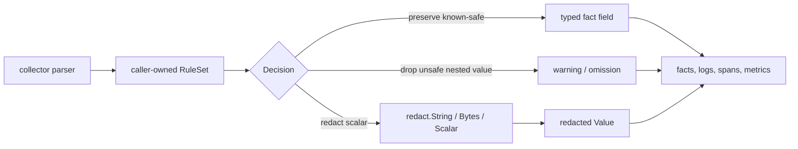

# Redact

## Purpose

`redact` provides a small collector-neutral API for replacing sensitive scalar
values before they cross fact, persistence, log, metric, span, or admin-status
boundaries. It is intended for Terraform-state and cloud collectors that may
observe plaintext secrets while parsing source truth.

The marker path is keyed. Callers construct a `Key` with deployment-scoped
secret material before calling `String`, `Bytes`, or `Scalar`; blank key
material is rejected instead of producing guessable markers.

## Where this fits

Raw secret material should only exist in a caller's source reader or parser
window. This package returns deterministic markers and redaction evidence; it
does not persist raw input or emit telemetry.

## Exported surface

- `Value` — replacement payload with `Marker`, `Reason`, and `Source`.
- `NewKey(material []byte) (Key, error)` — constructs deployment-scoped marker
  key material.
- `NewRuleSet(version string, sensitiveKeys []string) (RuleSet, error)` —
  constructs a caller-owned versioned sensitive-key classifier.
- `RuleSet.Classify(source string, schemaTrust SchemaTrust, fieldKind FieldKind)
  Decision` — returns `preserve`, `redact`, or `drop` for a field path.
- `String(raw, reason, source string, key Key) Value` — redacts sensitive strings.
- `Bytes(raw []byte, reason, source string, key Key) Value` — redacts sensitive
  bytes.
- `Scalar(raw any, reason, source string, key Key) Value` — redacts scalar
  values and fails closed for unsupported values.

## Invariants

- Markers are deterministic for the same raw value, reason, and source.
- Markers use `redacted:hmac-sha256:<hex>` and do not include raw values,
  reason, or source text.
- The HMAC key must come from deployment-scoped secret material. Do not hardcode
  production redaction keys.
- `NewKey` copies caller-provided material and rejects blank input.
- Blank reason or source values normalize to `unknown`.
- Unsupported values still produce a marker without serializing the value.
- Unknown schema coverage fails closed: scalar fields are redacted and composite
  fields are dropped.
- An uninitialized `RuleSet` fails closed the same way and reports
  `unknown_redaction_ruleset`.
- Unknown `FieldKind` values are treated as unsafe and dropped.
- Known sensitive composite values are dropped because this package only
  represents safe scalar markers.
- Sensitive-key policy is versioned by callers. Do not add Terraform, AWS, or
  provider-specific key lists to this package.
- Callers must pass classification labels and field paths as reason/source; do
  not put raw secret values in those fields.

## Dependencies

Standard library only. No internal package imports.

## Telemetry

None directly. Callers should count redactions by reason or source class, not by
marker, and must not attach raw values to spans, metrics, logs, or status.
