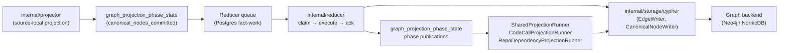
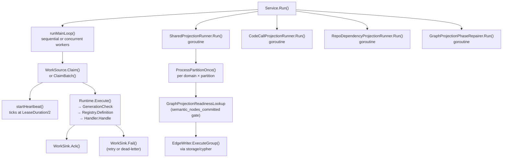

# internal/reducer

`internal/reducer` owns cross-domain materialization, queued repair, and
shared projection that runs after source-local facts have been committed by
the projector. It is the authoritative owner of canonical graph truth for
cross-source and cross-scope domains.

Reducer changes carry the highest correctness risk in the codebase. Wrong
graph truth, query truth, or deployment truth is a product failure. Track the
full path — raw evidence → admitted candidate → projected row → graph write →
query surface — before changing ordering, admission, retries, or
backend-specific behavior. See CLAUDE.md "Correlation Truth Gates".

## Where this fits in the pipeline



## Internal flow



## Domain catalog

All reducer domains are declared in `domain.go` and registered via
`NewDefaultRuntime` / `NewDefaultRegistry` in `defaults.go`. Each domain has an
`OwnershipShape` enforcing cross-source, cross-scope, and either durable
canonical-write or bounded counter-emission requirements.

| Domain constant | Summary |
| --- | --- |
| `DomainWorkloadIdentity` | Resolve canonical workload identity across sources |
| `DomainDeployableUnitCorrelation` | Correlate cross-source deployable-unit evidence before workload admission |
| `DomainCloudAssetResolution` | Resolve canonical cloud asset identity across sources |
| `DomainDeploymentMapping` | Materialize platform bindings across sources |
| `DomainDataLineage` | Resolve lineage across sources and scopes |
| `DomainOwnership` | Resolve ownership and responsibility records |
| `DomainGovernance` | Resolve governance and policy attribution |
| `DomainWorkloadMaterialization` | Materialize canonical workload graph nodes |
| `DomainCodeCallMaterialization` | Materialize canonical code-call edges |
| `DomainSemanticEntityMaterialization` | Materialize Annotation, Typedef, TypeAlias, Component semantic nodes |
| `DomainSQLRelationshipMaterialization` | Materialize canonical SQL relationship edges |
| `DomainInheritanceMaterialization` | Materialize inheritance, override, and alias edges |
| `DomainPackageSourceCorrelation` | Classify package-registry source hints and package-version publication evidence without ownership promotion |
| `DomainAWSCloudRuntimeDrift` | Publish admitted AWS runtime orphan, unmanaged, unknown, and ambiguous drift findings as canonical reducer facts |
| `DomainContainerImageIdentity` | Join Git, OCI registry, and runtime image references into digest-keyed reducer facts |
| `DomainCICDRunCorrelation` | Correlate CI/CD runs, artifacts, and environments with artifact identity evidence |
| `DomainServiceCatalogCorrelation` | Correlate service-catalog entities with explicit repository links and ownership evidence without inventing workloads |
| `DomainSBOMAttestationAttachment` | Attach SBOM and attestation documents to image digests only when subject evidence is explicit |
| `DomainSupplyChainImpact` | Publish vulnerability impact findings only when explicit vulnerability, package, SBOM, image, or repository evidence exists |
| `DomainSecurityAlertReconciliation` | Compare provider repository security alerts with Eshu-owned dependency and impact evidence, including alert-seeded impact rows only when owned dependency evidence matches |

## Intent lifecycle

`Intent` (declared in `intent.go:138`) carries the durable queue contract.
States: `pending` → `claimed` → `running` → `succeeded` / `failed`.

- `IntentStatusPending`, `IntentStatusClaimed`, `IntentStatusRunning`,
  `IntentStatusSucceeded`, `IntentStatusFailed` — `intent.go:65–74`.
- `ResultStatusSucceeded`, `ResultStatusFailed`, `ResultStatusSuperseded` —
  `intent.go:81–87`.
- `ResultStatusSuperseded` short-circuits execution when
  `GenerationCheck` confirms a newer generation is active for the scope.

## Queue claim / execute / ack loop

`Service` (declared in `service.go:54`) coordinates the main loop:

- **Sequential** (`Workers <= 1`): `Claim` → `executeWithTelemetry` →
  `Ack` or `Fail` in order.
- **Concurrent** (`Workers > 1`): N goroutines compete. When `WorkSource`
  implements `BatchWorkSource` and `WorkSink` implements `BatchWorkSink`,
  the batch path reduces Postgres round-trips.
- **Heartbeat**: `startHeartbeat` (`service.go:409`) spawns a goroutine
  that calls `Heartbeat` at `HeartbeatInterval`; the heartbeat is stopped
  before `Ack` or `Fail` to avoid lease extension after the transaction
  commits.

`Service.Run` also starts `SharedProjectionRunner`, `CodeCallProjectionRunner`,
`RepoDependencyProjectionRunner`, and `GraphProjectionPhaseRepairer` as
concurrent goroutines. Any runner error cancels the shared context.

## Graph projection phase coordination

`graph_projection_phase_state` is the durable readiness coordination table.
Phases and keyspaces are declared in `graph_projection_phase.go`.

Key phases:

| Phase constant | Meaning |
| --- | --- |
| `GraphProjectionPhaseCanonicalNodesCommitted` | Projector canonical node writes committed |
| `GraphProjectionPhaseSemanticNodesCommitted` | Semantic entity reducer writes committed |
| `GraphProjectionPhaseDeployableUnitCorrelation` | Deployable-unit correlation pass finished |
| `GraphProjectionPhaseDeploymentMapping` | `deployment_mapping` domain finished one bounded slice |
| `GraphProjectionPhaseWorkloadMaterialization` | `workload_materialization` domain finished |
| `GraphProjectionPhaseCrossSourceAnchorReady` | Reserved for DSL cross-source anchor publication |

`GraphProjectionPhasePublisher` (interface at `graph_projection_phase.go:117`)
is the only write path for phase rows. Use `publishIntentGraphPhase`
(`graph_projection_phase_publish.go`) inside handlers rather than calling the
publisher directly.

`GraphProjectionPhaseRepairQueue` (`graph_projection_phase_repair.go:36`) and
`GraphProjectionPhaseRepairer` (`graph_projection_phase_repair_runner.go:58`)
handle the case where a graph write commits but the subsequent phase
publication fails; the repairer retries exact rows durably.

## Code-call materialization

`ExtractCodeCallRows` turns parser `function_calls` and SCIP call facts into
canonical `CALLS` or `REFERENCES` edge intents. Resolution stays evidence
bounded: same-file and parser-proven language metadata win before broader
repository matching, type and reflection references stay `REFERENCES`, and
duplicate facts for the same caller, callee, and reference line collapse before
graph writes.

Keep the detailed resolver ordering, language metadata rules, JavaScript
static-alias cache contract, SCIP bypass, and handler timing log in
[`code-call-materialization.md`](code-call-materialization.md).

## Shared projection runner

`SharedProjectionRunner` (`shared_projection_runner.go:95`) iterates
shared-projection domains by domain and partition. `CodeCallProjectionRunner`
owns `code_calls` separately because it preserves repo-wide retraction
semantics while processing large accepted units in capped chunks. Edge domains
stay readiness-gated; the local-authoritative code-call drain gate schedules
work only and never changes admitted graph truth.

Keep the runner loop, back-off behavior, `LoadSharedProjectionConfig`
configuration contract, SQL trigger `EXECUTES` reachability rule, and
inheritance/SQL entity-type filters in
[`shared-projection.md`](shared-projection.md).

## Facts-First Bootstrap Ordering

The bootstrap pipeline in `go/cmd/bootstrap-index/main.go` enforces a
multi-pass ordering that the reducer must honor:

```text
Phase 1 — Collection + First-Pass Reduction
  Projector drains and emits canonical nodes. deployment_mapping can remain
  pending because resolved_relationships do not yet exist.

Phase 2 — Backfill
  BackfillAllRelationshipEvidence() (bootstrap-index/main.go:236)
  populates relationship_evidence_facts and publishes readiness rows.

Phase 3 — Deployment Mapping Reopen
  ReopenDeploymentMappingWorkItems() (bootstrap-index/main.go:273)
  reopens deployment_mapping so the reducer can create resolved_relationships.

Phase 4 — Second-Pass Consumers
  Any domain consuming resolved_relationships must have a re-trigger
  mechanism after Phase 3.
```

**Critical rule**: any reducer domain or sub-package that consumes
`resolved_relationships` must have a post-Phase-3 reopen or re-trigger
mechanism. Adding a new consumer without that mechanism creates an E2E-only
bug that is invisible in unit and integration tests.

## Exported surface

Core interfaces:

- `WorkSource`, `Executor`, `WorkSink`, `WorkHeartbeater` — `service.go:22–40`
- `BatchWorkSource`, `BatchWorkSink` — `service.go:43–51`
- `Handler`, `HandlerFunc` — `registry.go:70–78`
- `GraphProjectionPhasePublisher` — `graph_projection_phase.go:117`
- `GraphProjectionPhaseRepairQueue` — `graph_projection_phase_repair.go:36`
- `GraphProjectionPhaseStateLookup` — `graph_projection_phase_repair_runner.go:25`

Key construction functions:

- `NewDefaultRuntime(DefaultHandlers)` — `defaults.go:137` — one-call wiring
  for the standard domain catalog.
- `NewDefaultRegistry(DefaultHandlers)` — `defaults.go:121` — registry only.
- `NewRuntime(Registry)` — `runtime.go:63` — bare runtime over a custom registry.
- `LoadSharedProjectionConfig(getenv)` — `shared_projection_runner.go:476`.
- `BuildSharedProjectionIntent(input)` — `shared_projection.go:53` — stable
  SHA256 intent ID matching the Python implementation.
- `BuildProjectionRows`, `BuildProjectionRowsWithInfrastructurePlatforms` —
  `projection.go:233, 243`.

In-memory runtime types used by focused reducer tests:

- `Runtime` — `runtime.go:55` — bounded in-memory reducer queue over a
  `Registry`.
- `Result`, `RunReport`, `Stats`, and `DomainStats` — `runtime.go:10`,
  `runtime.go:20`, `runtime.go:29`, `runtime.go:40` — terminal execution
  outcome, one-run drain summary, and queue/domain snapshots returned by
  `Runtime.RunOnce` and `Runtime.Stats`.

Domain and intent helpers:

- `ParseDomain(raw)` — `domain.go:24`.
- `IsRetryable(err)` — `intent.go:127`.
- `GraphProjectionPhaseRepairsFromStates` — `graph_projection_phase_repair.go:45`.
- `ExtractOverlayEnvironments` — `projection.go:207`.
- `InferWorkloadKind`, `InferWorkloadClassification` — `projection.go:152, 169`.

## Dependencies

- `internal/storage/cypher` — all canonical graph writes; no direct driver calls.
- `internal/relationships` — evidence kinds consumed by cross-repo resolution
  and provisioning evidence classification (`projection.go:544`).
- `internal/telemetry` — spans, metrics, log attributes.
- `internal/truth` — `truth.Contract`, `truth.Layer` for domain registration.
- `internal/storage/postgres` — Postgres-backed implementations of all
  queue and store interfaces; wired in `cmd/reducer`, not here.

## Telemetry

Spans emitted:

- `SpanReducerRun` — wraps each `executeWithTelemetry` call
  (`service.go:308`).
- `SpanCanonicalWrite` — wraps each `processPartitionWithTelemetry`
  call in `SharedProjectionRunner` (`shared_projection_runner.go:284`).

Key metrics (all prefixed `eshu_dp_`):

- `reducer_run_duration_seconds` — per-intent execution duration, labeled by domain.
- `reducer_queue_wait_duration_seconds` — time from `AvailableAt` to claim start.
- `reducer_executions_total` — intent executions, labeled by domain, queue, status.
- `queue_claim_duration_seconds` — time to acquire one claim from Postgres.
- `shared_projection_cycles_total` — completed shared projection cycles per domain.
- `canonical_write_duration_seconds` — duration of one canonical write cycle.
- `shared_projection_intent_wait_duration_seconds` — per-domain intent queue age.
- `shared_projection_processing_duration_seconds` — per-domain partition processing.
- `shared_projection_step_duration_seconds` — per phase (retract, write, mark_completed).
- `canonical_writes_total` — includes graph-projection repair writes.
- `package_source_correlations_total` — package source-correlation decisions by
  bounded outcome (`exact`, `derived`, `ambiguous`, `unresolved`, `stale`,
  `rejected`) and reducer domain. Durable package correlation facts store
  source-hint ownership candidates and package-version publication evidence as
  `provenance_only=true`, while manifest-backed consumption decisions are
  canonical package consumption truth.
- `service_catalog_correlations_total` — service-catalog correlation decisions
  by bounded outcome (`exact`, `derived`, `ambiguous`, `unresolved`, `stale`,
  `rejected`) and reducer domain. Durable service-catalog correlation facts
  store catalog entity, owner, repository, service/workload IDs when explicitly
  supplied by evidence, drift status, candidate repository IDs, and evidence
  fact IDs for API/MCP freshness checks.
- `correlation_rule_matches_total`, `correlation_orphan_detected_total`, and
  `correlation_unmanaged_detected_total` — AWS runtime drift rule execution and
  admitted orphan/unmanaged findings. Unknown and ambiguous findings are exposed
  in reducer summaries, admitted-finding logs, and durable fact evidence. ARNs
  stay in structured logs and fact evidence, not metric labels.

Log phase attributes: `telemetry.PhaseReduction` (main loop),
`telemetry.PhaseShared` (shared projection and repair runner).

## Gotchas / invariants

- **All reducer domains must be cross-source, cross-scope, and truth-emitting**
  — enforced by `OwnershipShape.Validate`; domains either write canonical graph
  truth, publish durable reducer facts such as `aws_cloud_runtime_drift`, or
  emit bounded counters such as `package_source_correlation`.
- **AWS runtime drift publication is graph-neutral for this slice** —
  `AWSCloudRuntimeDriftHandler` writes `reducer_aws_cloud_runtime_drift_finding`
  facts through `PostgresAWSCloudRuntimeDriftWriter`; graph nodes and MCP/API
  read models need their own frozen shape before Cypher lands.
- **Container image identity is digest-first** —
  `ContainerImageIdentityHandler` writes `reducer_container_image_identity`
  facts only for explicit digest or single-tag-to-digest matches. Ambiguous,
  unresolved, and stale tag outcomes stay diagnostic counters until stronger
  evidence proves safe identity. Git parser facts can expose image references
  through `entity_metadata.container_images`; the reducer also accepts the
  older `metadata.container_images` fixture shape for compatibility.
- **SBOM attachment keeps trust dimensions separate** —
  `SBOMAttestationAttachmentHandler` writes
  `reducer_sbom_attestation_attachment` facts for attached verified,
  unverified, parse-only, subject mismatch, ambiguous subject, unknown subject,
  and unparseable outcomes. Component evidence stays evidence only; this
  domain must not emit vulnerability priority or affected-by findings. The
  SBOM attachment index treats multiple distinct attestation subjects as
  ambiguous, not as a first-subject match.
- **Supply-chain impact is evidence-first** —
  `SupplyChainImpactHandler` writes `reducer_supply_chain_impact_finding`
  facts only from explicit vulnerability, affected package, owned
  package-consumption, SBOM component, attachment, or image identity evidence.
  Exact package-manifest or lockfile dependency versions can prove an observed
  package version. The reducer preserves the exact installed version, the
  requested manifest range, the selected fixed version, and the match reason as
  separate finding fields. Version/range evaluation is ecosystem-aware for npm
  semver and Maven; unsupported ecosystems and malformed advisory ranges fail
  closed as partial evidence with explicit missing-evidence reasons. Npm
  `package-lock.json` rows also preserve the ordered dependency path, depth, and
  direct/transitive flag so vulnerability impact can explain whether a finding
  came from a direct dependency or through an owned transitive chain.
  Vulnerability-scoped impact runs also load active manifest dependency facts
  by advisory ecosystem and package name, so exact source dependency evidence
  can publish repository impact before package-registry enrichment catches up.
  Package-registry identity facts can still bound active vulnerability lookups,
  and the active evidence walk expands through package IDs, PURLs, CVEs, SBOM
  document IDs, subject digests, repository IDs, and CPE criteria until no new
  bounded join key appears. Package-registry version facts are upstream metadata
  and must not be treated as installed versions. CVSS, EPSS, and KEV stay risk
  signals; they never prove reachability without package or runtime evidence,
  and missing deployment evidence remains visible.
- **Go-vulnerability reachability is classified, not invented** —
  `ClassifyGoVulnerabilityReachability` joins `vulnerability.go_module_evidence`
  facts (parsed from repository `go.mod` and `go.sum`), Go ecosystem
  `vulnerability.affected_package` facts, and `vulnerability.go_call_reachability`
  facts (parsed from govulncheck JSON output) into one finding per
  (advisory, module, repository) tuple with one of five reachability levels:
  `symbol_reachable`, `package_import_reachable`, `not_called`, `module_only`,
  or `unknown`. Before emitting, the classifier compares the module's
  effective version (replacement when a `replace` directive applied, declared
  `required_version` otherwise) against the advisory's SEMVER ranges and
  fixed versions; safe (post-fix) findings are dropped, advisories with
  missing or unparseable range data are kept with an explicit
  "advisory affected-range evidence missing" note, and findings backed by
  govulncheck evidence bypass the filter because govulncheck already proved
  the binary actually used the vulnerable code. The reducer does not re-run
  govulncheck or re-derive the call-graph; it preserves the
  govulncheck-compatible JSON evidence and records the rule
  (`symbol`/`import`/`not_called`/`module`/`unknown`) used to choose the
  level so API/MCP can explain the decision.
- **Suppression evidence is first-class** —
  Performance Evidence: VEX/operator suppression evaluation runs in-process
  against the bounded fact set the impact handler already loads, so it adds
  no extra queue, lease, or graph write paths. Per finding the work is
  O(suppressions × scope keys) with case-insensitive string compares and
  short-circuit returns; for the largest fact set the handler observes in
  CI fixtures (`TestSupplyChainImpactHandlerLoadsActiveEvidenceAndWritesFindings`
  in `supply_chain_impact_test.go` and the new
  `supply_chain_suppression_handler_test.go` cases) the additional decode
  and evaluate steps stay under one millisecond per finding on the same
  scope, so the existing `go test ./internal/reducer -count=1` gate is the
  baseline.
  No-Regression Evidence: the additions to the bounded Postgres active
  evidence query (`go/internal/storage/postgres/facts_active_supply_chain_impact.go`)
  reuse the existing OR-branch shape and only add four `payload->'scope'->>...`
  predicates and one extra `fact_kind` value; row counts in
  `TestListActiveSupplyChainImpactFactsQueryIncludesVulnerabilitySuppression`
  show the same bounded page semantics, so no new full table scan is
  introduced. Operators can re-run the same `cd go && go test
  ./internal/storage/postgres -count=1` gate to confirm the predicate set
  before/after a change.
  Observability Evidence: `SupplyChainSuppressionDecisions`
  (`eshu_dp_supply_chain_suppression_decisions_total`) is registered in
  `internal/telemetry/instruments.go` and emitted from
  `SupplyChainImpactHandler.emitCounters` with the closed-enum `outcome`
  label (active, not_affected, accepted_risk, false_positive, ignored,
  expired, provider_dismissed, scope_mismatch), so a 3 AM operator can
  detect VEX or operator-policy drift without re-running the reducer.
  `SupplyChainImpactHandler` evaluates `vulnerability.suppression` facts
  against each finding via `EvaluateSupplyChainSuppression`. The decision is
  always populated (`state=active` when nothing matched) and persisted on the
  finding payload, including the source (`vex_statement`, `eshu_policy`,
  `provider_dismissal`), justification, author, timestamps, reason, evidence
  reference, and optional VEX document/statement IDs. Suppressions apply only
  when every populated scope key (`cve_id`, `advisory_id`, `package_id`,
  `purl`, `repository_id`, `subject_digest`, `evidence_path`) matches the
  finding identity; mismatched scope yields the `scope_mismatch` state so the
  finding stays visible and operators can audit drift. Expired suppressions
  surface as `expired` rather than hidden. Provider dismissals are evidence:
  the reducer surfaces them as `provider_dismissed` and never auto-excludes
  the finding from the default API view. The handler emits
  `eshu_dp_supply_chain_suppression_decisions_total` per state so operators
  can detect VEX/policy drift without re-running the reducer.
- **Safe-upgrade remediation is advisory-only** —
  `SupplyChainImpactHandler` attaches a `Remediation` block to every finding
  via `BuildSupplyChainImpactRemediation` (issue #595). The block records the
  installed version, source-reported vulnerable range, first patched
  version, every published fixed-version branch, the manifest range
  preserved from package consumption evidence, a tri-state
  manifest_allows_fix decision (`allowed`, `blocked`, `unknown`), the
  direct/transitive designation, the parent package the caller would need
  to upgrade for transitive findings, the ecosystem the recommendation was
  computed for, an `exact|partial|unknown` confidence label, and a closed
  reason enum (`direct_upgrade_allowed`, `direct_range_blocked`,
  `transitive_parent_upgrade_required`, `no_patched_version`,
  `multiple_patched_branches`, `package_manager_unsupported`,
  `manifest_range_missing`, `manifest_range_malformed`,
  `installed_version_missing`, `installed_version_malformed`).
  `installed_version_missing` fires when the advisory publishes more than
  one fixed-version branch and Eshu has no parseable installed version
  to anchor the branch selector — without that anchor the lowest fix
  across all branches could be a downgrade or unnecessary cross-major
  bump, so the reducer blanks the recommendation rather than committing
  to either branch. `installed_version_malformed` fires whenever the
  observed version is non-empty but fails npm-semver normalization.
  The reducer expands npm caret and tilde manifest ranges before
  delegating to the existing comparator engine so the answer stays
  npm-correct; ecosystems other than npm currently report
  `package_manager_unsupported` rather than guessing. The reducer also
  captures `VulnerableRange` from the same provenance observation that
  supplies `RangeSource`, persists it on the canonical finding payload
  (top-level `vulnerable_range` and inside the `remediation` block), and
  decodes it through the read model so list-route callers see the same
  vulnerable range as the explain route. Eshu never auto-opens a pull
  request from this block; remediation is strictly advisory.

  Performance Evidence: remediation runs in-process over the bounded
  per-finding inputs the impact handler already owns (observed version,
  requested range, fixed versions, dependency chain). Per finding the work
  is O(branches) string compares plus one caret/tilde expansion of the
  manifest range, which the existing comparator engine evaluates without
  any extra fact load, queue claim, lease, or canonical write. The reducer
  handler test suite (`go test ./internal/reducer -count=1`) is the
  baseline; the new `supply_chain_impact_remediation_test.go` cases each
  finish in microseconds on the developer fixture set.
  No-Regression Evidence: `BuildSupplyChainImpactRemediation` is the only
  per-finding addition to `appendSupplyChainImpactFinding`; no Postgres,
  Cypher, queue, or lease path changed. The bounded `findings` slice is
  not re-sorted or re-traversed, so the existing handler throughput and
  the `cd go && go test ./internal/reducer -count=1` gate stay green.
  Observability Evidence: `SupplyChainRemediationDecisions`
  (`eshu_dp_supply_chain_remediation_decisions_total`) is registered in
  `internal/telemetry/instruments.go` and emitted from
  `SupplyChainImpactHandler.emitCounters` with the closed-enum
  `outcome` label (confidence: `exact`, `partial`, `unknown`) and
  `reason` label (closed remediation-reason enum). A 3 AM operator can
  watch how often Eshu produces exact upgrade paths versus how many
  findings still need ecosystem support to graduate from `unknown`
  without re-running the reducer.
- **Advisory provenance is preserved** — multi-source CVE and affected_package
  observations for the same advisory identity are consolidated into one
  finding per `(cve_id, package_id)` anchor. `supplyChainImpactProvenance`
  selects severity, fixed-version, and vulnerable-range using documented
  per-ecosystem source priority (vendor advisory beats GLAD/GHSA/OSV/NVD for
  OS package classes; GHSA beats GLAD/OSV/NVD for language ecosystems) and
  records the selected source, every alternate severity, every source-reported
  fixed-version branch with originating source, and per-source advisory IDs
  with update and withdrawal timestamps. Withdrawn advisories are excluded
  from selection but remain visible as observations so operators can explain
  why a vendor or upstream record was skipped.
- **Detection profile is recorded** — every owned-anchor finding is tagged
  with `DetectionProfile` (`precise` or `comprehensive`) before the writer
  persists the row. Precise requires an exact installed-version anchor
  (lockfile, manifest with pinned version, or SBOM component with an
  explicit version) plus an ecosystem-aware exact match. Comprehensive
  covers range-only manifests, SBOM/CPE-derived image paths without an
  exact version, malformed advisory ranges, unsupported ecosystems, and
  missing observed versions. The tier is persisted alongside the truth
  labels (status, confidence, runtime_reachability) and missing-evidence
  reasons; readers (API, MCP, parity gate) decide which tier they want.
- **Provider alerts are dependency-gated before impact admission** —
  `SupplyChainImpactHandler` can seed a `reducer_supply_chain_impact_finding`
  from an open `security_alert.repository_alert` only when active owned
  dependency evidence matches the same repository, package identity, and
  manifest path. Provider-scoped repository IDs are preserved separately as
  provider evidence and resolve to canonical Eshu `repository_id` values only
  when owned dependency evidence proves one unambiguous repository match. The
  finding preserves provider advisory IDs, vulnerable range, patched version,
  severity, dependency path, manifest scope, and missing-evidence reasons.
  Provider-only, stale, ambiguous, dismissed, and fixed alerts do not become
  impact rows.
- **Provider alert reconciliation stays explicit** —
  `SecurityAlertReconciliationHandler` writes
  `reducer_security_alert_reconciliation` facts from
  `security_alert.repository_alert`, package-consumption correlation, and
  supply-chain impact facts. It preserves provider alert state and Eshu impact
  state in separate payload fields, keeps raw `provider_repository_id`
  separate from canonical `repository_id`, classifies rows as matched,
  unmatched, stale, dismissed, fixed, or provider-only, and explains when a
  provider alert was not admitted into impact truth because owned dependency
  evidence was missing, stale, or ambiguous.
- **Package ownership is conservative** —
  `PackageSourceCorrelationHandler` writes ownership candidates from registry
  source hints and package-version publication evidence but leaves
  `canonical_writes=0`; manifest dependency facts are the first admitted
  package consumption truth because they combine registry identity with Git
  source declaration. Package identity alone is enough to schedule the
  correlation pass because popular registry responses may omit source hints.
  Publication fact identity includes source-hint kind, fact ID, and version
  scope so repository and homepage hints with the same URL do not overwrite one
  another.
- **Service catalog correlation is repository-evidence gated** —
  `ServiceCatalogCorrelationHandler` writes
  `reducer_service_catalog_correlation` facts for explicit repository-id or
  repository-URL links only. Name-only links are rejected, tombstoned matches are
  stale, and multiple active repository matches are ambiguous. Catalog names,
  component names, and ownership labels never create repository, service, or
  workload truth by themselves.
- **Projection must be idempotent** — queue retries, duplicate claims, and
  partial graph writes must converge on the same truth.
- **Generation supersession** — `Runtime.execute` calls `GenerationCheck`
  before dispatching to a handler; stale intents return
  `ResultStatusSuperseded` without touching the graph.
- **`deployment_mapping` requires post-Phase-3 reopen** — the domain
  cannot produce `resolved_relationships` until after
  ReopenDeploymentMappingWorkItems runs in the bootstrap pipeline
  (bootstrap-index/main.go:273).
- **Phase publications and graph writes are not atomic** — if a graph write
  commits but the subsequent `PublishGraphProjectionPhases` call fails, the
  `GraphProjectionPhaseRepairQueue` captures the publication for retry by
  `GraphProjectionPhaseRepairer`. Do not remove the repair queue without
  understanding this failure mode.
- **Edge domain readiness gates** — shared projection domains
  `code_calls`, `sql_relationships`, and `inheritance_edges` gate on
  `canonical_nodes_committed` or `semantic_nodes_committed` being present
  before writing edges (`shared_projection.go:91–99`).
- **Code-call chunks must not retract each other** — a code-call accepted
  unit can exceed `DefaultCodeCallAcceptanceScanLimit`. The runner processes a
  capped slice, marks it complete, and then continues with later slices from
  the same source run. `CodeCallProjectionCurrentRunHistoryLookup` is the guard
  that skips retraction after the first current-run chunk.
- **Bare code-call names are scoped before they are broadened** — same-file
  resolution wins first. Go then allows a same-directory match before the
  repository-unique fallback; if another package has the same bare name, do
  not create a repo-wide edge.
- **Go package and return-chain evidence must stay bounded** — imported
  package calls resolve only through parser import rows and repository
  directory matches. Method-return chains resolve only when one method name has
  one return type inside the same repository.
- **JavaScript-family top-level calls need file-root evidence** — only
  package entrypoint, package bin, and package export files can use the
  repo-scoped `File.uid` caller for top-level calls. Do not promote arbitrary
  module-body calls to roots.
- **`BuildSharedProjectionIntent` produces a stable SHA256 ID** —
  changing any of the identity fields breaks idempotency for in-flight
  intents (`shared_projection.go:59–66`).

No-Regression Evidence: `go test ./internal/reducer ./internal/storage/postgres ./cmd/reducer -run 'TestPlatformMaterializationHandlerLocksInfrastructurePlatformIDs|TestNewDefaultRegistryWiresPlatformGraphLocker|TestPlatformGraphLocker|TestPlatformGraphLockerForReducer|TestBuildReducerServiceWiresDefaultRuntimeAndQueue' -count=1` proves deployment_mapping platform writes acquire per-Platform.id locks without lowering worker concurrency and skip lock wiring when transactions are unavailable.
Observability Evidence: existing reducer queue conflict fields, fact-work retry counters, deployment_mapping completion logs, graph-write retry WARNs, and Postgres query errors expose blocked, retrying, failed, and completed platform materialization work; no new metric label was needed.

No-Regression Evidence: `go test ./internal/reducer -run 'TestSupplyChainCVEGroupRepresentative(UsesSourcePriority|SelectsByPriorityAndSkipsWithdrawn)|TestAdvisorySourcePriorityDoesNotAllocate' -count=1` failed on baseline `4b9128d` because the legacy product representative returned envelope order and `advisorySourcePriority` allocated four times per run; the same command passed after the change on Go 1.26.3. `go test ./internal/reducer -count=1` also passed with pure in-memory fixture envelopes, no graph backend, no reducer queue rows, and the existing provenance tests still producing one consolidated finding per CVE/package anchor.
No-Observability-Change: the change only makes in-memory advisory-source selection deterministic and allocation-free inside existing reducer admission. It does not add a queue, graph write, Postgres query, runtime knob, or metric label; existing `SpanReducerRun`, `reducer_run_duration_seconds`, `reducer_executions_total`, reducer completion logs, and durable finding payloads remain the operator-visible signals for this path.

No-Regression Evidence: `go test ./internal/reducer -run TestSupplyChainImpactHandlerUsesManifestDependencyBeforeRegistryCorrelation -count=1` failed before the impact handler loaded active manifest dependencies, then passed after the reducer consumed advisory-bounded npm lockfile evidence directly. `go test ./internal/reducer ./internal/storage/postgres ./internal/coordinator ./internal/workflow ./cmd/workflow-coordinator ./cmd/collector-package-registry ./cmd/collector-vulnerability-intelligence -count=1` also passed, proving the manifest-dependency read path remains bounded by the existing active dependency index and does not require package-registry completion before exact repository impact.
No-Observability-Change: this uses the existing `ListActivePackageManifestDependencyFacts` Postgres read, reducer run span, reducer duration metric, reducer execution counter, durable evidence path, finding payload, and package-registry/vulnerability collector status rows. No new metric label or graph write path was added.

Performance Evidence: `go test ./internal/reducer -run '^$' -bench BenchmarkAddManifestDependencySupplyChainConsumption -benchmem -count=3` on darwin/arm64 dropped manifest dependency matching from about `52.2 MB/op` and `922k allocs/op` to about `610 KB/op` and `7.3k allocs/op` after affected package match keys were flattened once per reducer execution and dependency keys were built once per manifest dependency.

No-Regression Evidence: `go test ./internal/reducer -run 'TestBuildSecurityAlertReconciliations(FailsClosedForAmbiguousProviderRepositoryScope|ResolvesProviderAlertRepositoryScope)|TestBuildSupplyChainImpactFindings(SkipsAmbiguousProviderRepositoryScope|ResolvesProviderAlertRepositoryScope)' -count=1` failed before provider-alert repository scopes were resolved against canonical owned dependency evidence, then passed after raw provider repository IDs were preserved separately and ambiguous repository-name matches failed closed.
No-Observability-Change: this is an in-memory reducer admission and payload-shape correction over facts already loaded through `ListActiveSupplyChainImpactFacts`; existing reducer run spans, reducer duration metrics, reducer execution counters, durable `reducer_security_alert_reconciliation` payloads, and `reducer_supply_chain_impact_finding` evidence paths remain the operator-visible signals.
## Related docs

- `docs/public/architecture.md`
- `docs/public/deployment/service-runtimes.md`
- `docs/public/reference/telemetry/index.md`
- `docs/public/reference/local-testing.md`
- `go/cmd/reducer/README.md`
- `go/internal/projector/README.md` (upstream handoff)
- `go/internal/reducer/code-call-materialization.md`
- `go/internal/reducer/shared-projection.md`
- `go/internal/reducer/dsl/README.md`
- `go/internal/reducer/aws/README.md`
- `go/internal/reducer/tags/README.md`
- `go/internal/reducer/tfstate/README.md`
