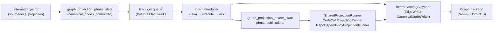
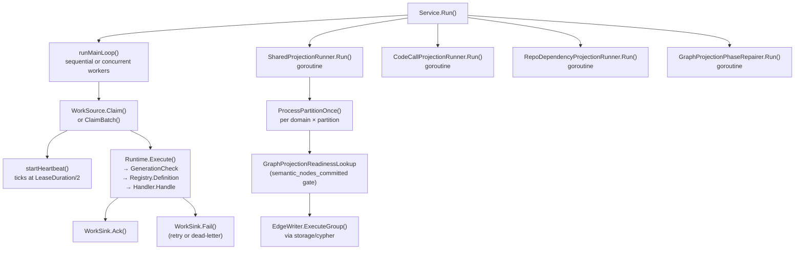

# internal/reducer

`internal/reducer` owns cross-domain materialization, queued repair, and
shared projection that runs after source-local facts have been committed by
the projector. It is the authoritative owner of canonical graph truth for
cross-source and cross-scope domains.

Reducer changes carry the highest correctness risk in the codebase. Wrong
graph truth, query truth, or deployment truth is a product failure. Track the
full path — raw evidence → admitted candidate → projected row → graph write →
query surface — before changing ordering, admission, retries, or
backend-specific behavior. See CLAUDE.md "Correlation Truth Gates".

## Where this fits in the pipeline



## Internal flow



## Domain catalog

All reducer domains are declared in `domain.go` and registered via
`NewDefaultRuntime` / `NewDefaultRegistry` in `defaults.go`. Each domain has an
`OwnershipShape` enforcing cross-source, cross-scope, and either durable
canonical-write or bounded counter-emission requirements.

| Domain constant | Summary |
| --- | --- |
| `DomainWorkloadIdentity` | Resolve canonical workload identity across sources |
| `DomainDeployableUnitCorrelation` | Correlate cross-source deployable-unit evidence before workload admission |
| `DomainCloudAssetResolution` | Resolve canonical cloud asset identity across sources |
| `DomainDeploymentMapping` | Materialize platform bindings across sources |
| `DomainDataLineage` | Resolve lineage across sources and scopes |
| `DomainOwnership` | Resolve ownership and responsibility records |
| `DomainGovernance` | Resolve governance and policy attribution |
| `DomainWorkloadMaterialization` | Materialize canonical workload graph nodes |
| `DomainCodeCallMaterialization` | Materialize canonical code-call edges |
| `DomainSemanticEntityMaterialization` | Materialize Annotation, Typedef, TypeAlias, Component semantic nodes |
| `DomainSQLRelationshipMaterialization` | Materialize canonical SQL relationship edges |
| `DomainInheritanceMaterialization` | Materialize inheritance, override, and alias edges |
| `DomainPackageSourceCorrelation` | Classify package-registry source hints and package-version publication evidence without ownership promotion |
| `DomainAWSCloudRuntimeDrift` | Publish admitted AWS runtime orphan, unmanaged, unknown, and ambiguous drift findings as canonical reducer facts |
| `DomainContainerImageIdentity` | Join Git, OCI registry, and runtime image references into digest-keyed reducer facts |
| `DomainCICDRunCorrelation` | Correlate CI/CD runs, artifacts, and environments with artifact identity evidence |
| `DomainServiceCatalogCorrelation` | Correlate service-catalog entities with explicit repository links and ownership evidence without inventing workloads |
| `DomainSBOMAttestationAttachment` | Attach SBOM and attestation documents to image digests only when subject evidence is explicit |
| `DomainSupplyChainImpact` | Publish vulnerability impact findings only when explicit vulnerability, package, SBOM, image, or repository evidence exists |
| `DomainSecurityAlertReconciliation` | Compare provider repository security alerts with Eshu-owned dependency and impact evidence, including alert-seeded impact rows only when owned dependency evidence matches |
| `DomainAWSResourceMaterialization` | Materialize `aws_resource` facts into canonical `CloudResource` nodes; publishes the `cloud_resource_uid` canonical-nodes phase the AWS relationship edge gates on (issue #805) |
| `DomainEC2InstanceNodeMaterialization` | Materialize `ec2_instance_posture` facts into canonical EC2 instance `CloudResource` nodes keyed by `cloudResourceUID(account, region, "aws_ec2_instance", instance_id)` on the existing `cloud_resource_uid` keyspace (the EC2 scanner emits no `aws_resource` inventory fact for instances); carries metadata-only safe identifiers plus derived posture booleans (IMDS, user-data presence, monitoring, public-IP, `instance_profile_arn`) — never user-data content, the raw public IP, or block devices; publishes the `cloud_resource_uid` canonical-nodes phase under the distinct `ec2_instance_node_materialization:<scope>` entity key the future `USES_PROFILE` edge gates on (issue #1146 PR-A); see `docs/internal/design/1146-ec2-instance-node.md` |
| `DomainKubernetesWorkloadMaterialization` | Materialize `kubernetes_live.pod_template` facts into canonical `KubernetesWorkload` nodes keyed by the collector-emitted `object_id`; publishes the `kubernetes_workload_uid` canonical-nodes phase the #388 live-workload edge gates on |
| `DomainKubernetesCorrelationMaterialization` | Project exact live-workload correlation decisions into canonical `RUNS_IMAGE` edges from a `KubernetesWorkload` node to the digest-addressed OCI source node it runs; gates on the `kubernetes_workload_uid` canonical-nodes phase, exact-only, never fabricates or dangles an edge (issue #388 PR3) |
| `DomainIAMCanAssumeMaterialization` | Project `aws_iam_permission` trust statements into canonical `(:CloudResource)-[:CAN_ASSUME]->(:CloudResource)` edges from an assuming IAM principal (role/user) to the role whose trust policy grants the assume; gates on the `cloud_resource_uid` canonical-nodes phase (the same gate `aws_relationship_materialization` uses), `effect=Allow` only, skips external / AWS-service / wildcard / account-root / unscanned principals, never fabricates or dangles an edge (issue #1134 PR2) |
| `DomainS3LogsToMaterialization` | Project `s3_bucket_posture` `logging_target_bucket` fields into canonical `(:CloudResource)-[:LOGS_TO]->(:CloudResource)` edges from a source S3 bucket to the target log bucket it delivers server-access logs to; resolves the target by bucket-name equality against an in-memory S3 join index; gates on the `cloud_resource_uid` canonical-nodes phase (the same gate `aws_relationship_materialization` uses); a blank target (logging disabled) is no edge and not a skip; a self-target (bucket logging to itself) is a legal config and DOES emit an edge; cross-account / out-of-scope / unscanned targets are counted, never fabricated or dangled (issue #1144 PR2). `GRANTS_ACCESS_TO :ExternalPrincipal` and the internet-exposure flag are deferred follow-ups; see `docs/internal/design/1144-s3-logs-to-edge.md` §8 |
| `DomainIncidentRoutingMaterialization` | Project exact PagerDuty incident-routing evidence into reducer-owned `IncidentRoutingEvidence` graph nodes and intended/applied/live evidence relationships without promoting runtime, image, commit, pull-request, Jira, service-health, or root-cause truth |

## PagerDuty IncidentRoutingEvidence graph projection (issue #1168)

`DomainIncidentRoutingMaterialization` is the conservative graph slice for
PagerDuty incident routing. It loads incident-scoped `incident.record` anchors,
Terraform-source `PagerDutyDeclaration` content rows, same-generation applied
PagerDuty service facts, optional live PagerDuty service facts, and coverage
warnings. The extractor writes graph rows only for:

- declared, applied, and live routing slots that all classify as `exact`; or
- exact live PagerDuty service evidence when declared and applied IaC evidence
  are both missing.

All drifted, stale, permission-hidden, ambiguous, unresolved, rejected, derived,
and missing outcomes stay provenance-only and are counted. Rows use deterministic
`IncidentRoutingEvidence` UIDs and the Cypher writer emits only
`HAS_INTENDED_ROUTING`, `HAS_APPLIED_ROUTING`, and `HAS_LIVE_ROUTING`
relationships between evidence nodes. This domain does not create service,
runtime, image, commit, pull-request, Jira, blast-radius, service-health, or
root-cause edges.

No-Regression Evidence: `go test ./internal/reducer -run
'IncidentRouting|DefaultDomainDefinitions.*IncidentRouting' -count=1` proves
exact convergence, live-only no-IaC evidence, unsafe outcome suppression, and
default-domain registration.

Observability Evidence: `eshu_dp_incident_routing_evidence_total` is labeled by
`domain`, bounded `outcome`, `source` (`declared`, `applied`, `observed`, or
`provenance`), and slot `kind`. The handler completion log carries load,
extract, retract, write, and total durations plus materialized/skipped tallies.

## Live-workload RUNS_IMAGE edge projection (issue #388 PR3)

`DomainKubernetesCorrelationMaterialization`
(`kubernetes_correlation_materialization.go`) is the gated graph-write slice that
closes the #388 chain. It mirrors `DomainAWSRelationshipMaterialization` (#805
PR2) and `DomainObservabilityCoverageMaterialization` (#391 PR3):

- It gates on `GraphProjectionKeyspaceKubernetesWorkloadUID` /
  `canonical_nodes_committed` (published by
  `DomainKubernetesWorkloadMaterialization`) so an edge never resolves against a
  workload node that has not committed. The miss is a retryable error so the
  durable queue re-runs the intent rather than failing terminally or writing
  against absent nodes. The durable Postgres claim gate
  (`reducer_queue_claim_query.go`, `reducer_queue_batch.go`) and the blockage
  view (`status_blockage.go`) carry a matching `kubernetes_workload_uid` clause.
- `ExtractKubernetesCorrelationEdgeRows` re-runs the PR1 classifier and promotes
  to an edge **only** an `exact` image decision that resolved both a workload
  node uid (`object_id`) and a digest-addressed OCI source node uid (resolved via
  `SourceImageDigestJoinIndex.ResolveDigestNode`). Derived / ambiguous /
  unresolved / stale / rejected outcomes stay provenance-only; the structural
  `owner_reference` identity decision is a workload→workload edge whose owner
  target is not guaranteed to have a `KubernetesWorkload` node, so it carries no
  `SourceDigest` and is naturally excluded from this image-edge slice. An exact
  decision whose digest resolves no canonical node (tag-only evidence) is counted
  skipped, never written as a dangling edge.
- The write is idempotent on `(workload_uid, RUNS_IMAGE, source_uid)`; rows are
  deduplicated and sorted so retries and reprojections produce a byte-stable
  batch. The conflict key is per-edge, so no serialization workaround is
  introduced (this is not a "serialization is not a fix" case).

Performance Evidence: `go test ./internal/reducer -run '^$' -bench
'BenchmarkExtractKubernetesCorrelationEdgeRows' -benchmem -benchtime=100x`
resolved 5,000 workloads → 5,000 edges in `8.89 ms/op` (`22.4 MB/op`,
`135,221 allocs/op`) on darwin/arm64 (Apple M3 Pro): the pure classifier plus the
O(M) digest→uid index build and O(1) per-edge source resolution, no per-edge
graph round trip and no N+1.
No-Regression Evidence: the edge write reuses the established UNWIND-batched
MATCH-MATCH-MERGE shape; `BenchmarkKubernetesCorrelationEdgeWriter` (in
`go/internal/storage/cypher`) shaped 5,000 edges at batch 500 in `1.14 ms/op`
(`2.16 MB/op`, `25,098 allocs/op`), faster and leaner than the proven
`BenchmarkCloudResourceEdgeWriter` (`1.81 ms/op`, `3.89 MB/op`) and
`BenchmarkObservabilityCoverageEdgeWriter` (`1.71 ms/op`) baselines on the same
input shape and machine, because the row carries fewer properties and a single
static relationship type. `go test ./internal/reducer
./internal/storage/cypher ./internal/storage/postgres ./cmd/reducer -count=1`
proves the exact-only, idempotent-reprojection, readiness-gating,
digest-unresolvable-no-dangle, empty, stale, and owner-reference-excluded cases.
Observability Evidence: the new `eshu_dp_kubernetes_correlation_edges_total`
counter (dimension `resolution_mode`), the `kubernetes correlation
materialization completed` structured log with per-stage durations, edge count,
and `skipped_unresolvable_source`, the
`reducer.kubernetes_correlation_materialization` span, and the
InstrumentedExecutor's `eshu_dp_neo4j_query_duration_seconds` /
`eshu_dp_neo4j_batch_size` on each `phase=kubernetes_correlation_edge` /
`label=RUNS_IMAGE` statement let an operator see live-workload edge throughput
and spot a generation that materialized zero edges, at 3 AM.

## Intent lifecycle

`Intent` (declared in `intent.go:138`) carries the durable queue contract.
States: `pending` → `claimed` → `running` → `succeeded` / `failed`.

- `IntentStatusPending`, `IntentStatusClaimed`, `IntentStatusRunning`,
  `IntentStatusSucceeded`, `IntentStatusFailed` — `intent.go:65–74`.
- `ResultStatusSucceeded`, `ResultStatusFailed`, `ResultStatusSuperseded` —
  `intent.go:81–87`.
- `ResultStatusSuperseded` short-circuits execution when
  `GenerationCheck` confirms a newer generation is active for the scope.

## Queue claim / execute / ack loop

`Service` (declared in `service.go:54`) coordinates the main loop:

- **Sequential** (`Workers <= 1`): `Claim` → `executeWithTelemetry` →
  `Ack` or `Fail` in order.
- **Concurrent** (`Workers > 1`): N goroutines compete. When `WorkSource`
  implements `BatchWorkSource` and `WorkSink` implements `BatchWorkSink`,
  the batch path reduces Postgres round-trips.
- **Heartbeat**: `startHeartbeat` (`service.go:409`) spawns a goroutine
  that calls `Heartbeat` at `HeartbeatInterval`; the heartbeat is stopped
  before `Ack` or `Fail` to avoid lease extension after the transaction
  commits.

`Service.Run` also starts `SharedProjectionRunner`, `CodeCallProjectionRunner`,
`RepoDependencyProjectionRunner`, and `GraphProjectionPhaseRepairer` as
concurrent goroutines. Any runner error cancels the shared context.

## Graph projection phase coordination

`graph_projection_phase_state` is the durable readiness coordination table.
Phases and keyspaces are declared in `graph_projection_phase.go`.

Key phases:

| Phase constant | Meaning |
| --- | --- |
| `GraphProjectionPhaseCanonicalNodesCommitted` | Projector canonical node writes committed |
| `GraphProjectionPhaseSemanticNodesCommitted` | Semantic entity reducer writes committed |
| `GraphProjectionPhaseDeployableUnitCorrelation` | Deployable-unit correlation pass finished |
| `GraphProjectionPhaseDeploymentMapping` | `deployment_mapping` domain finished one bounded slice |
| `GraphProjectionPhaseWorkloadMaterialization` | `workload_materialization` domain finished |
| `GraphProjectionPhaseCrossSourceAnchorReady` | Reserved for DSL cross-source anchor publication |

`GraphProjectionPhasePublisher` (interface at `graph_projection_phase.go:117`)
is the only write path for phase rows. Use `publishIntentGraphPhase`
(`graph_projection_phase_publish.go`) inside handlers rather than calling the
publisher directly.

Canonical-node materializers publish `GraphProjectionPhaseCanonicalNodesCommitted`
on a per-node-type keyspace so an edge slice can gate on the exact node family it
joins: `GraphProjectionKeyspaceCloudResourceUID` (AWS resource nodes, issue #805)
and `GraphProjectionKeyspaceKubernetesWorkloadUID` (live `KubernetesWorkload`
nodes, issue #388). The durable claim/blockage gate in
`go/internal/storage/postgres` fences each *edge* domain on its node keyspace's
phase; that gate clause is added when the edge domain ships, so this prerequisite
slice publishes the `kubernetes_workload_uid` phase but adds no edge-gate clause.

`GraphProjectionPhaseRepairQueue` (`graph_projection_phase_repair.go:36`) and
`GraphProjectionPhaseRepairer` (`graph_projection_phase_repair_runner.go:58`)
handle the case where a graph write commits but the subsequent phase
publication fails; the repairer retries exact rows durably.

## Code-call materialization

`ExtractCodeCallRows` turns parser `function_calls` and SCIP call facts into
canonical `CALLS` or `REFERENCES` edge intents. Resolution stays evidence
bounded: same-file and parser-proven language metadata win before broader
repository matching, type and reflection references stay `REFERENCES`, and
duplicate facts for the same caller, callee, and reference line collapse before
graph writes.

Keep the detailed resolver ordering, language metadata rules, JavaScript
static-alias cache contract, SCIP bypass, and handler timing log in
[`code-call-materialization.md`](code-call-materialization.md).

## Shared projection runner

`SharedProjectionRunner` (`shared_projection_runner.go:95`) iterates
shared-projection domains by domain and partition. `CodeCallProjectionRunner`
owns `code_calls` separately because it preserves repo-wide retraction
semantics while processing large accepted units in capped chunks. Edge domains
stay readiness-gated; the local-authoritative code-call drain gate schedules
work only and never changes admitted graph truth.

Keep the runner loop, back-off behavior, `LoadSharedProjectionConfig`
configuration contract, SQL trigger `EXECUTES` reachability rule, and
inheritance/SQL entity-type filters in
[`shared-projection.md`](shared-projection.md).

## Facts-First Bootstrap Ordering

The bootstrap pipeline in `go/cmd/bootstrap-index/main.go` enforces a
multi-pass ordering that the reducer must honor:

```text
Phase 1 — Collection + First-Pass Reduction
  Projector drains and emits canonical nodes. deployment_mapping can remain
  pending because resolved_relationships do not yet exist.

Phase 2 — Backfill
  BackfillAllRelationshipEvidence() (bootstrap-index/main.go:236)
  populates relationship_evidence_facts and publishes readiness rows.

Phase 3 — Deployment Mapping Reopen
  ReopenDeploymentMappingWorkItems() (bootstrap-index/main.go:273)
  reopens deployment_mapping so the reducer can create resolved_relationships.

Phase 4 — Second-Pass Consumers
  Any domain consuming resolved_relationships must have a re-trigger
  mechanism after Phase 3.
```

**Critical rule**: any reducer domain or sub-package that consumes
`resolved_relationships` must have a post-Phase-3 reopen or re-trigger
mechanism. Adding a new consumer without that mechanism creates an E2E-only
bug that is invisible in unit and integration tests.

## Exported surface

Core interfaces:

- `WorkSource`, `Executor`, `WorkSink`, `WorkHeartbeater` — `service.go:22–40`
- `BatchWorkSource`, `BatchWorkSink` — `service.go:43–51`
- `Handler`, `HandlerFunc` — `registry.go:70–78`
- `GraphProjectionPhasePublisher` — `graph_projection_phase.go:117`
- `GraphProjectionPhaseRepairQueue` — `graph_projection_phase_repair.go:36`
- `GraphProjectionPhaseStateLookup` — `graph_projection_phase_repair_runner.go:25`

Key construction functions:

- `NewDefaultRuntime(DefaultHandlers)` — `defaults.go:137` — one-call wiring
  for the standard domain catalog.
- `NewDefaultRegistry(DefaultHandlers)` — `defaults.go:121` — registry only.
- `NewRuntime(Registry)` — `runtime.go:63` — bare runtime over a custom registry.
- `LoadSharedProjectionConfig(getenv)` — `shared_projection_runner.go:476`.
- `BuildSharedProjectionIntent(input)` — `shared_projection.go:53` — stable
  SHA256 intent ID matching the Python implementation.
- `BuildProjectionRows`, `BuildProjectionRowsWithInfrastructurePlatforms` —
  `projection.go:233, 243`.

In-memory runtime types used by focused reducer tests:

- `Runtime` — `runtime.go:55` — bounded in-memory reducer queue over a
  `Registry`.
- `Result`, `RunReport`, `Stats`, and `DomainStats` — `runtime.go:10`,
  `runtime.go:20`, `runtime.go:29`, `runtime.go:40` — terminal execution
  outcome, one-run drain summary, and queue/domain snapshots returned by
  `Runtime.RunOnce` and `Runtime.Stats`.

Domain and intent helpers:

- `ParseDomain(raw)` — `domain.go:24`.
- `IsRetryable(err)` — `intent.go:127`.
- `GraphProjectionPhaseRepairsFromStates` — `graph_projection_phase_repair.go:45`.
- `ExtractOverlayEnvironments` — `projection.go:207`.
- `InferWorkloadKind`, `InferWorkloadClassification` — `projection.go:152, 169`.

## Dependencies

- `internal/storage/cypher` — all canonical graph writes; no direct driver calls.
- `internal/relationships` — evidence kinds consumed by cross-repo resolution
  and provisioning evidence classification (`projection.go:544`).
- `internal/telemetry` — spans, metrics, log attributes.
- `internal/truth` — `truth.Contract`, `truth.Layer` for domain registration.
- `internal/storage/postgres` — Postgres-backed implementations of all
  queue and store interfaces; wired in `cmd/reducer`, not here.

## Telemetry

Spans emitted:

- `SpanReducerRun` — wraps each `executeWithTelemetry` call
  (`service.go:308`).
- `SpanCanonicalWrite` — wraps each `processPartitionWithTelemetry`
  call in `SharedProjectionRunner` (`shared_projection_runner.go:284`).

Key metrics (all prefixed `eshu_dp_`):

- `reducer_run_duration_seconds` — per-intent execution duration, labeled by domain.
- `reducer_queue_wait_duration_seconds` — time from `AvailableAt` to claim start.
- `reducer_executions_total` — intent executions, labeled by domain, queue, status.
- `queue_claim_duration_seconds` — time to acquire one claim from Postgres.
- `shared_projection_cycles_total` — completed shared projection cycles per domain.
- `canonical_write_duration_seconds` — duration of one canonical write cycle.
- `shared_projection_intent_wait_duration_seconds` — per-domain intent queue age.
- `shared_projection_processing_duration_seconds` — per-domain partition processing.
- `shared_projection_step_duration_seconds` — per phase (retract, write, mark_completed).
- `canonical_writes_total` — includes graph-projection repair writes.
- `package_source_correlations_total` — package source-correlation decisions by
  bounded outcome (`exact`, `derived`, `ambiguous`, `unresolved`, `stale`,
  `rejected`) and reducer domain. Durable package correlation facts store
  source-hint ownership candidates and package-version publication evidence as
  `provenance_only=true`, while manifest-backed consumption decisions are
  canonical package consumption truth.
- `service_catalog_correlations_total` — service-catalog correlation decisions
  by bounded outcome (`exact`, `derived`, `ambiguous`, `unresolved`, `stale`,
  `rejected`) and reducer domain. Durable service-catalog correlation facts
  store catalog entity, owner, repository, service/workload IDs when explicitly
  supplied by evidence, drift status, candidate repository IDs, and evidence
  fact IDs for API/MCP freshness checks.
- `observability_coverage_correlations_total` — observability coverage
  correlation decisions by bounded outcome (`exact`, `derived`, `ambiguous`,
  `unresolved`, `stale`, `rejected`, `drifted`, `permission_hidden`), reducer
  domain, and `coverage_signal` (`alarm`, `composite_alarm`, `dashboard`,
  `datasource`, `folder`, `alert_rule`, `log_group`, `trace_sampling`,
  `scrape_target`, `rule`, `metric_route`, `log_route`, `trace_route`,
  `log_signal`, `trace_signal`, `unsupported`).
  Durable `reducer_observability_coverage_correlation` facts record
  which monitored CloudResource nodes have AWS-native coverage versus uncovered
  gaps, and which Grafana-stack declared, applied, or observed metadata identities
  are exact, drifted, stale, permission-hidden, rejected, ambiguous, or unresolved.
  The `DomainObservabilityCoverageCorrelation` domain is fact-only and is **not**
  gated on graph readiness, so the read model populates before any edge lands.
- `observability_coverage_edges_total` — observability `COVERS` graph-edge
  projection outcomes by `coverage_signal` and `resolution_mode` (`arn`,
  `bare_id`, `correlation_anchor`). The separate, gated
  `DomainObservabilityCoverageMaterialization` domain (issue #391 PR3) projects
  only `exact` coverage decisions that resolved a target `CloudResource.uid` into
  one `(:CloudResource)-[:AWS_COVERS_<signal>]->(:CloudResource)` edge per
  `(observability uid, coverage_signal, target uid)`, gated on the
  `GraphProjectionPhaseCanonicalNodesCommitted` readiness phase on the
  `cloud_resource_uid` keyspace (the same gate `aws_relationship_materialization`
  uses) so edges never resolve against uncommitted nodes. Derived, ambiguous,
  unresolved, stale, and rejected coverage stays provenance-only in the read
  model and fabricates no edge. See issue #391 and
  `docs/internal/design/391-observability-coverage-correlation.md` §6/§12.
- `incident_routing_evidence_total` — PagerDuty incident-routing graph evidence
  outcomes by reducer domain, bounded outcome, source class, and slot kind.
  The `DomainIncidentRoutingMaterialization` domain writes exact
  `IncidentRoutingEvidence` graph rows only for full declared/applied/live
  convergence or exact live-only no-IaC evidence; unsafe outcomes stay
  provenance-only and are counted with `source=provenance`.
- `kubernetes_correlations_total` — live Kubernetes correlation decisions by
  bounded outcome (`exact`, `derived`, `ambiguous`, `unresolved`, `stale`,
  `rejected`), reducer domain, and `drift_kind` (`in_sync`, `image_drift`,
  `missing_source`, `stale_source`, `unknown`). Durable
  `reducer_kubernetes_correlation` facts record how each live workload's image
  references and identity edges join to deployment-source image evidence. PR1 is
  fact-only: no graph edge is written; the gated canonical edge and the query/MCP
  read surface are follow-up PRs. See issue #388.
- `ec2_instance_nodes_total` — canonical EC2 instance `CloudResource` graph nodes
  committed by `DomainEC2InstanceNodeMaterialization`, dimensioned by `domain`. The
  handler also publishes the `cloud_resource_uid` / `canonical_nodes_committed`
  readiness phase under the distinct `ec2_instance_node_materialization:<scope>`
  entity key only after the node write succeeds (or is a legitimate no-op for an
  empty generation), emits `ec2_instance_nodes_skipped_total` (dimension
  `skip_reason`: `missing_identity` / `tombstone`), and logs an `ec2 instance node
  materialization completed` structured log with per-stage durations, node count,
  and the skip tally. See issue #1146 PR-A and
  `docs/internal/design/1146-ec2-instance-node.md`.
- `kubernetes_workload_nodes_total` — canonical `KubernetesWorkload` graph nodes
  committed by `DomainKubernetesWorkloadMaterialization`, dimensioned by `domain`.
  The handler also publishes the `kubernetes_workload_uid` /
  `canonical_nodes_committed` readiness phase only after the node write succeeds
  (or is a legitimate no-op for an empty generation), and emits a `kubernetes
  workload materialization completed` structured log with per-stage durations and
  the node count. See issue #388 and
  `docs/internal/design/388-kubernetes-workload-node.md`.
- `kubernetes_correlation_edges_total` — canonical `RUNS_IMAGE` live-workload
  edges committed by `DomainKubernetesCorrelationMaterialization`, dimensioned by
  `resolution_mode` (`digest`). It counts only materialized exact edges;
  provenance-only correlation and exact decisions whose source digest resolved no
  canonical OCI node (counted in the completion log's
  `skipped_unresolvable_source`) never produce an edge. See issue #388 PR3.

  Benchmark Evidence: `go test ./internal/reducer -run '^$' -bench
  'BenchmarkExtractKubernetesWorkloadNodeRows|BenchmarkBuildSourceImageDigestJoinIndex'
  -benchmem -benchtime=200x` on darwin/arm64 (Apple M3 Pro): node-row extraction
  ran `5.13 ms/op`, `9.34 MB/op`, `150,024 allocs/op` for `5,000` pod-template
  facts (bounded O(W)); the source-side digest→uid join index built in
  `0.93 ms/op`, `1.80 MB/op`, `10,065 allocs/op` for `5,000` manifest facts
  (bounded O(M) build, O(1) resolution, no per-edge round trip and no N+1). The
  cypher write path is benchmarked separately as
  `BenchmarkKubernetesWorkloadNodeWriter` in `go/internal/storage/cypher`.
  No-Regression Evidence: the node-write path reuses the proven CloudResource
  UNWIND-batched MERGE-on-uid writer and the bounded-join shape from #805 §5.1; it
  adds no graph round trip per node or per digest. `go test ./internal/reducer
  -run 'KubernetesWorkload|SourceImageDigestJoinIndex' -count=1` proves the
  object_id node identity, idempotent dedup, tombstone suppression, empty/no-op
  handling, the readiness-phase-after-write-success invariant (and that a failed
  write publishes no phase), and digest→uid resolution including the unresolvable
  and tombstone-only cases. Observability Evidence: the
  `eshu_dp_kubernetes_workload_nodes_total` counter, the `kubernetes workload
  materialization completed` log, and the InstrumentedExecutor's
  `eshu_dp_neo4j_query_duration_seconds` / `eshu_dp_neo4j_batch_size` on each
  `phase=kubernetes_workload` statement let an operator see node throughput and
  graph-write cost at 3 AM.
- `correlation_rule_matches_total`, `correlation_orphan_detected_total`, and
  `correlation_unmanaged_detected_total` — AWS runtime drift rule execution and
  admitted orphan/unmanaged findings. Unknown and ambiguous findings are exposed
  in reducer summaries, admitted-finding logs, and durable fact evidence.
  Admitted-finding logs use `resource.fingerprint`,
  `resource.identity_kind`, and `resource.type` rather than raw ARNs; exact
  ARNs stay in durable fact evidence and controlled read paths, not metric
  labels.

Log phase attributes: `telemetry.PhaseReduction` (main loop),
`telemetry.PhaseShared` (shared projection and repair runner).

## Gotchas / invariants

- **All reducer domains must be cross-source, cross-scope, and truth-emitting**
  — enforced by `OwnershipShape.Validate`; domains either write canonical graph
  truth, publish durable reducer facts such as `aws_cloud_runtime_drift`, or
  emit bounded counters such as `package_source_correlation`.
- **AWS runtime drift publication is graph-neutral for this slice** —
  `AWSCloudRuntimeDriftHandler` writes `reducer_aws_cloud_runtime_drift_finding`
  facts through `PostgresAWSCloudRuntimeDriftWriter`; graph nodes and MCP/API
  read models need their own frozen shape before Cypher lands.
- **Container image identity is digest-first** —
  `ContainerImageIdentityHandler` writes `reducer_container_image_identity`
  facts only for explicit digest or single-tag-to-digest matches. Ambiguous,
  unresolved, and stale tag outcomes stay diagnostic counters until stronger
  evidence proves safe identity. Git parser facts can expose image references
  through `entity_metadata.container_images`; the reducer also accepts the
  older `metadata.container_images` fixture shape for compatibility.
- **SBOM attachment keeps trust dimensions separate** —
  `SBOMAttestationAttachmentHandler` writes
  `reducer_sbom_attestation_attachment` facts for attached verified,
  unverified, parse-only, subject mismatch, ambiguous subject, unknown subject,
  and unparseable outcomes. Component evidence stays evidence only; this
  domain must not emit vulnerability priority or affected-by findings. The
  SBOM attachment index treats multiple distinct attestation subjects as
  ambiguous, not as a first-subject match.
- **Supply-chain impact is evidence-first** —
  `SupplyChainImpactHandler` writes `reducer_supply_chain_impact_finding`
  facts only from explicit vulnerability, affected package, owned
  package-consumption, SBOM component, attachment, or image identity evidence.
  Exact package-manifest or lockfile dependency versions can prove an observed
  package version. The reducer preserves the exact installed version, the
  requested manifest range, the selected fixed version, and the match reason as
  separate finding fields. Version/range evaluation is ecosystem-aware for npm,
  Cargo, Go modules, Pub, Hex, Swift, Composer constraints, NuGet semantic
  versions, Maven version/range ordering, PyPI PEP 440, vendor-backed OS
  package matching, and RubyGems `Gem::Version`-style requirements.
  Swift impact requires exact
  `Package.resolved` remote source-control pin evidence and a source-backed OSV
  `SwiftURL` package identity. Malformed advisory ranges fail closed as
  partial evidence with explicit missing-evidence reasons. Unsupported matcher
  ecosystems do not publish impact findings; the query readiness envelope
  surfaces observed unsupported dependencies as coverage gaps with stable
  reason codes. Npm `package-lock.json`, PHP `composer.lock`, and Ruby Bundler
  `Gemfile.lock` rows also preserve the ordered dependency path, depth,
  direct/transitive flag, and runtime/dev scope when the lockfile proves the
  chain, so vulnerability impact can explain whether a finding came from a
  direct dependency, through an owned transitive chain, or from development-only
  evidence.
  Vulnerability-scoped impact runs also load active manifest dependency facts
  by advisory ecosystem and package name, so exact source dependency evidence
  can publish repository impact before package-registry enrichment catches up.
  Package-registry identity facts can still bound active vulnerability lookups,
  and the active evidence walk expands through package IDs, PURLs, CVEs, SBOM
  document IDs, subject digests, repository IDs, and CPE criteria until no new
  bounded join key appears. Package-registry version facts are upstream metadata
  and must not be treated as installed versions. CVSS, EPSS, and KEV stay risk
  signals; they never prove reachability without package or runtime evidence,
  and missing deployment evidence remains visible.
- **Go-vulnerability reachability is classified, not invented** —
  `ClassifyGoVulnerabilityReachability` joins `vulnerability.go_module_evidence`
  facts (parsed from repository `go.mod` and `go.sum`), Go ecosystem
  `vulnerability.affected_package` facts, and `vulnerability.go_call_reachability`
  facts (parsed from govulncheck JSON output) into one finding per
  (advisory, module, repository) tuple with one of five reachability levels:
  `symbol_reachable`, `package_import_reachable`, `not_called`, `module_only`,
  or `unknown`. Before emitting, the classifier compares the module's
  effective version (replacement when a `replace` directive applied, declared
  `required_version` otherwise) against the advisory's SEMVER ranges and
  fixed versions; safe (post-fix) findings are dropped, advisories with
  missing or unparseable range data are kept with an explicit
  "advisory affected-range evidence missing" note, and findings backed by
  govulncheck evidence bypass the filter because govulncheck already proved
  the binary actually used the vulnerable code. The reducer does not re-run
  govulncheck or re-derive the call-graph; it preserves the
  govulncheck-compatible JSON evidence and records the rule
  (`symbol`/`import`/`not_called`/`module`/`unknown`) used to choose the
  level so API/MCP can explain the decision.
- **Suppression evidence is first-class** —
  Performance Evidence: VEX/operator suppression evaluation runs in-process
  against the bounded fact set the impact handler already loads, so it adds
  no extra queue, lease, or graph write paths. Per finding the work is
  O(suppressions × scope keys) with case-insensitive string compares and
  short-circuit returns; for the largest fact set the handler observes in
  CI fixtures (`TestSupplyChainImpactHandlerLoadsActiveEvidenceAndWritesFindings`
  in `supply_chain_impact_test.go` and the new
  `supply_chain_suppression_handler_test.go` cases) the additional decode
  and evaluate steps stay under one millisecond per finding on the same
  scope, so the existing `go test ./internal/reducer -count=1` gate is the
  baseline.
  No-Regression Evidence: the additions to the bounded Postgres active
  evidence query (`go/internal/storage/postgres/facts_active_supply_chain_impact.go`)
  reuse the existing OR-branch shape and only add four `payload->'scope'->>...`
  predicates and one extra `fact_kind` value; row counts in
  `TestListActiveSupplyChainImpactFactsQueryIncludesVulnerabilitySuppression`
  show the same bounded page semantics, so no new full table scan is
  introduced. Operators can re-run the same `cd go && go test
  ./internal/storage/postgres -count=1` gate to confirm the predicate set
  before/after a change.
  Observability Evidence: `SupplyChainSuppressionDecisions`
  (`eshu_dp_supply_chain_suppression_decisions_total`) is registered in
  `internal/telemetry/instruments.go` and emitted from
  `SupplyChainImpactHandler.emitCounters` with the closed-enum `outcome`
  label (active, not_affected, accepted_risk, false_positive, ignored,
  expired, provider_dismissed, scope_mismatch), so a 3 AM operator can
  detect VEX or operator-policy drift without re-running the reducer.
  `SupplyChainImpactHandler` evaluates `vulnerability.suppression` facts
  against each finding via `EvaluateSupplyChainSuppression`. The decision is
  always populated (`state=active` when nothing matched) and persisted on the
  finding payload, including the source (`vex_statement`, `eshu_policy`,
  `provider_dismissal`), justification, author, timestamps, reason, evidence
  reference, and optional VEX document/statement IDs. Suppressions apply only
  when every populated scope key (`cve_id`, `advisory_id`, `package_id`,
  `purl`, `repository_id`, `subject_digest`, `evidence_path`) matches the
  finding identity; mismatched scope yields the `scope_mismatch` state so the
  finding stays visible and operators can audit drift. Expired suppressions
  surface as `expired` rather than hidden. Provider dismissals are evidence:
  the reducer surfaces them as `provider_dismissed` and never auto-excludes
  the finding from the default API view. The handler emits
  `eshu_dp_supply_chain_suppression_decisions_total` per state so operators
  can detect VEX/policy drift without re-running the reducer.
- **Safe-upgrade remediation is advisory-only** —
  `SupplyChainImpactHandler` attaches a `Remediation` block to every finding
  via `BuildSupplyChainImpactRemediation` (issue #595). The block records the
  installed version, source-reported vulnerable range, selected fixed-version
  source, match reason, first patched version, every published fixed-version
  branch, the manifest range preserved from package consumption evidence, a
  tri-state manifest_allows_fix decision (`allowed`, `blocked`, `unknown`),
  the direct/transitive designation, the parent package the caller would need
  to upgrade for transitive findings, the ecosystem the recommendation was
  computed for, an `exact|partial|unknown` confidence label, and a closed
  reason enum (`direct_upgrade_allowed`, `direct_range_blocked`,
  `transitive_parent_upgrade_required`, `no_patched_version`,
  `multiple_patched_branches`, `package_manager_unsupported`,
  `manifest_range_missing`, `manifest_range_malformed`,
  `installed_version_missing`, `installed_version_malformed`).
  `installed_version_missing` fires when the advisory publishes more than
  one fixed-version branch and Eshu has no parseable installed version
  to anchor the branch selector — without that anchor the lowest fix
  across all branches could be a downgrade or unnecessary cross-major
  bump, so the reducer blanks the recommendation rather than committing
  to either branch. `installed_version_malformed` fires whenever the
  observed version is non-empty but fails the ecosystem-specific version
  parser. The reducer delegates manifest allowance and fixed-branch ordering
  to the same ecosystem-aware matcher families used for impact classification:
  npm, Go modules, PyPI, Maven/Gradle, NuGet, Cargo, Composer, RubyGems, and
  vendor-gated RPM, Debian/dpkg, and Alpine/APK OS packages. Debian and
  Alpine recommendations require vendor advisory provenance, parseable distro
  version ordering, a parseable installed OS package version, and one
  source-attributed fixed branch. OS package evidence without that provenance
  still reports `package_manager_unsupported` with structured missing evidence
  such as `advisory_provenance_missing`, `fixed_version_branch_ambiguous`, or
  `version_ordering_unsupported` rather than guessing. The reducer also
  captures `VulnerableRange` from the same provenance observation that
  supplies `RangeSource`, persists it on the canonical finding payload
  (top-level `vulnerable_range` and inside the `remediation` block), and
  decodes it through the read model so list-route callers see the same
  vulnerable range as the explain route. Eshu never auto-opens a pull
  request from this block; remediation is strictly advisory.

  Performance Evidence: remediation runs in-process over the bounded
  per-finding inputs the impact handler already owns (observed version,
  requested range, fixed versions, dependency chain). Per finding the work
  is O(branches) string compares plus one caret/tilde expansion of the
  manifest range, which the existing comparator engine evaluates without
  any extra fact load, queue claim, lease, or canonical write. The reducer
  handler test suite (`go test ./internal/reducer -count=1`) is the
  baseline; the new `supply_chain_impact_remediation_test.go` cases each
  finish in microseconds on the developer fixture set.
  No-Regression Evidence: `BuildSupplyChainImpactRemediation` is the only
  per-finding addition to `appendSupplyChainImpactFinding`; no Postgres,
  Cypher, queue, or lease path changed. The bounded `findings` slice is
  not re-sorted or re-traversed, so the existing handler throughput and
  the `cd go && go test ./internal/reducer -count=1` gate stay green.
  Observability Evidence: `SupplyChainRemediationDecisions`
  (`eshu_dp_supply_chain_remediation_decisions_total`) is registered in
  `internal/telemetry/instruments.go` and emitted from
  `SupplyChainImpactHandler.emitCounters` with the closed-enum
  `outcome` label (confidence: `exact`, `partial`, `unknown`) and
  `reason` label (closed remediation-reason enum). A 3 AM operator can
  watch how often Eshu produces exact upgrade paths versus how many
  findings still need ecosystem support to graduate from `unknown`
  without re-running the reducer.
- **Advisory provenance is preserved** — multi-source CVE and affected_package
  observations for the same advisory identity are consolidated into one
  finding per `(cve_id, package_id)` anchor. `supplyChainImpactProvenance`
  selects severity, fixed-version, and vulnerable-range using documented
  per-ecosystem source priority (vendor advisory beats GLAD/GHSA/OSV/NVD for
  OS package classes; GHSA beats GLAD/OSV/NVD for language ecosystems) and
  records the selected source, every alternate severity, every source-reported
  fixed-version branch with originating source, and per-source advisory IDs
  with update and withdrawal timestamps. Withdrawn advisories are excluded
  from selection but remain visible as observations so operators can explain
  why a vendor or upstream record was skipped.
- **Detection profile is recorded** — every owned-anchor finding is tagged
  with `DetectionProfile` (`precise` or `comprehensive`) before the writer
  persists the row. Precise requires an exact installed-version anchor
  (lockfile, manifest with pinned version, or SBOM component with an
  explicit version) plus an ecosystem-aware exact match. Comprehensive
  covers range-only manifests, SBOM/CPE-derived image paths without an
  exact version, malformed advisory ranges, and missing observed versions.
  Unsupported matcher ecosystems are not finding rows and are reported by
  readiness instead. PyPI exact lockfile matches qualify as precise only after
  the PEP 440 matcher proves the advisory range or known-fixed boundary. The
  tier is persisted alongside the truth
  labels (status, confidence, runtime_reachability) and missing-evidence
  reasons; readers (API, MCP, parity gate) decide which tier they want.
- **OS package evidence is vendor-gated** — `vulnerability.os_package`
  rows from RPM-family, Debian dpkg, and Alpine apk snapshots can seed
  supply-chain impact only when the row is vendor-class, carries distro and
  distro-version evidence, includes arch and the source-recorded installed
  version, and its `vendor_advisory_source` matches the selected vendor
  advisory source. Debian and Alpine matching is exact-version only; the
  reducer does not try to compare backport or apk release ordering unless a
  source fact names the exact installed version. Third-party, unknown, and
  ambiguous vendor-origin OS package rows are source warnings only; the
  reducer does not use them as image OS-package impact evidence.

  No-Regression Evidence: `go test ./internal/reducer -run
  'TestBuildSupplyChainImpactFindingsUsesVendor(DPKG|APK|RPM)OSPackageEvidence|TestBuildSupplyChainImpactFindingsRejectsLanguageAdvisoryForDPKGOSPackage|TestBuildSupplyChainImpactFindingsSkipsAmbiguousRPMOSPackageEvidence'
  -count=1` failed for dpkg/apk on `origin/main`, then passed after Red Hat RPM
  EVR, Debian dpkg, and Alpine apk facts joined only matching vendor advisory
  evidence; GHSA language advisory evidence against a Debian package and
  ambiguous-origin rows produced no impact finding.
  No-Observability-Change: this is an in-memory admission change over facts
  already loaded by the supply-chain impact handler. Existing reducer run
  spans, reducer duration metrics, reducer execution counters, durable
  finding payloads/evidence paths, warning facts, and API/MCP readiness
  envelopes remain the operator-visible signals; no new queue domain, graph
  write, route, runtime knob, metric instrument, or metric label was added.
- **Pub parity is hosted-lockfile gated** —
  Pub `pubspec.lock` consumption rows can now produce `affected_exact` and
  `not_affected_known_fixed` findings when OSV Pub advisory ranges or fixed
  versions match the exact hosted `pub.dev` version. `pubspec.yaml` ranges,
  git/path dependencies, private-hosted rows, mismatched lockfile names, and
  dependency overrides remain partial or non-evidence and do not publish
  precise Pub impact.

  No-Regression Evidence: `go test ./internal/reducer -run
  'BuildSupplyChainImpactFindingsMatchesPub' -count=1` proves exact hosted
  Pub lockfile rows admit precise findings while manifest range-only rows keep
  missing installed-version evidence.
- **RubyGems parity is exact-version gated** —
  Ruby Bundler lockfile consumption rows can now produce `affected_exact` and
  `not_affected_known_fixed` findings when a RubyGems advisory range or fixed
  version matches the exact installed version. Git and path Bundler
  dependencies still stop at source evidence because `source_ambiguous=true`
  prevents public RubyGems registry admission, and rows without a proven
  lockfile chain keep `direct_dependency=null` instead of guessing directness.

  No-Regression Evidence: `go test ./internal/reducer -run
  'TestBuildSupplyChainImpactFindings.*RubyGems|TestBuildPackageConsumptionDecisions.*RubyGems'
  -count=1` proves Bundler lockfile exact-version impact, known-fixed
  behavior, four-segment RubyGems versions, dependency-chain propagation, and
  git/path ambiguity rejection. The tests are in-memory reducer fixtures; they
  add no Postgres, graph, queue, worker, or hosted-runtime work.

  No-Observability-Change: RubyGems parity only adds reducer-side version
  comparison for already-admitted package-consumption facts. Operators continue
  to diagnose the path through existing parser-stage timing,
  `reducer_package_consumption_correlation`,
  `reducer_supply_chain_impact_finding`, `match_reason`, `dependency_path`,
  `missing_evidence`, and the supply-chain impact API/MCP readiness envelope.
  No metric instrument, span, log key, queue, graph write, scanner worker,
  route, or runtime knob was added.
- **Provider alerts are dependency-gated before impact admission** —
  `SupplyChainImpactHandler` can seed a `reducer_supply_chain_impact_finding`
  from an open `security_alert.repository_alert` only when active owned
  dependency evidence matches the same repository, package identity, and
  manifest path. Provider-scoped repository IDs are preserved separately as
  provider evidence and resolve to canonical Eshu `repository_id` values only
  when owned dependency evidence proves one unambiguous repository match. The
  finding preserves provider advisory IDs, vulnerable range, patched version,
  severity, dependency path, manifest scope, and missing-evidence reasons.
  Provider-only, stale, ambiguous, dismissed, and fixed alerts do not become
  impact rows.
- **Provider alert reconciliation stays explicit** —
  `SecurityAlertReconciliationHandler` writes
  `reducer_security_alert_reconciliation` facts from
  `security_alert.repository_alert`, package-consumption correlation, active
  manifest dependency evidence, and supply-chain impact facts. It preserves
  provider alert state and Eshu impact state in separate payload fields, keeps
  raw `provider_repository_id` separate from canonical `repository_id`,
  classifies rows as matched, unmatched, stale, dismissed, fixed, or
  provider-only, and explains when a provider alert was not admitted into
  impact truth because owned dependency evidence was missing, stale, or
  ambiguous. Its durable replacement identity uses provider, provider alert id
  or number, provider evidence scope, package id, and advisory ids so
  provider-only rows are replaced by later matched or stale rows for the same
  provider alert instead of remaining active beside them.
- **Package ownership is conservative** —
  `PackageSourceCorrelationHandler` writes ownership candidates from registry
  source hints and package-version publication evidence but leaves
  `canonical_writes=0`; manifest dependency facts are the first admitted
  package consumption truth because they combine registry identity with Git
  source declaration. Package identity alone is enough to schedule the
  correlation pass because popular registry responses may omit source hints.
  Publication fact identity includes source-hint kind, fact ID, and version
  scope so repository and homepage hints with the same URL do not overwrite one
  another.
- **Service catalog correlation is repository-evidence gated** —
  `ServiceCatalogCorrelationHandler` writes
  `reducer_service_catalog_correlation` facts for explicit repository-id or
  repository-URL links only. Name-only links are rejected, tombstoned matches are
  stale, and multiple active repository matches are ambiguous. Catalog names,
  component names, and ownership labels never create repository, service, or
  workload truth by themselves.
- **Observability coverage correlation is stable-identity gated** —
  `ObservabilityCoverageCorrelationHandler` writes
  `reducer_observability_coverage_correlation` facts for exact, derived,
  ambiguous, unresolved, stale, rejected, drifted, and permission-hidden outcomes.
  A coverage edge is canonical truth (`exact`, not provenance-only) only when an
  AWS observability object resolves to a monitored CloudResource by a stable
  identity (an alarm whose AWS system dimension value, e.g. `InstanceId`, matches
  a scanned resource id). X-Ray service-name matches stay
  `derived`/provenance-only; metric-name-only alarms (e.g. `AWS/Billing`) are
  `rejected`; non-unique dimension matches are `ambiguous`; tombstoned-only
  matches are `stale`; monitored resources with no resolving coverage emit
  `unresolved` gap findings (bounded to classes with a covered peer in scope).
  Grafana, Prometheus, Mimir, Loki, and Tempo metadata facts are source-class
  correlated as declared/applied/observed evidence only; drifted,
  permission-hidden, unsupported, stale, and ambiguous provider metadata never
  creates a graph edge. The handler reads AWS facts through the existing bounded
  in-memory index, reads observability source fact families through metadata
  identity grouping, redacted dimension values never resolve a target, and the
  correlation domain itself writes no graph edge.
- **Observability `COVERS` edges are exact-only and readiness-gated** —
  `ObservabilityCoverageMaterializationHandler` (the separate
  `DomainObservabilityCoverageMaterialization` domain, issue #391 PR3) re-runs the
  same pure classifier and projects only `exact` coverage decisions that resolved
  a target `CloudResource.uid` into one
  `(:CloudResource)-[:AWS_COVERS_<signal>]->(:CloudResource)` edge per
  `(observability uid, coverage_signal, target uid)`. It gates on the
  `GraphProjectionPhaseCanonicalNodesCommitted` readiness phase (handler
  `ReadinessLookup` + the durable Postgres claim/batch/blockage gate) so edges
  never resolve against uncommitted nodes, retracts prior-generation edges scoped
  to `rel.evidence_source = 'reducer/observability-coverage'`, and fabricates no
  node (two `MATCH`es precede the `MERGE`). Derived X-Ray service coverage
  resolves a service name, not a node, so it is counted skipped and produces no
  edge; ambiguous, unresolved, stale, and rejected coverage never materialize.
  The write is idempotent under retry and partitioned by the scope-generation
  conflict fence, never single-threaded.
- **Live Kubernetes correlation is digest-first and selector-ambiguity-safe** —
  `KubernetesCorrelationHandler` writes `reducer_kubernetes_correlation` facts
  for all six outcomes plus a `drift_kind`. A live image reference joins
  digest-first (`exact`/`in_sync`), then repository+tag (`derived`); a tag that
  resolves to multiple source digests is `ambiguous`/`unknown`; a live image with
  no source is `unresolved`/`missing_source`; a tombstoned-only source is
  `stale`/`stale_source`; an unparseable ref is `rejected`. For workload
  identity, only a Kubernetes `owner_reference` edge is `exact`; a label-selector
  edge that cannot prove exact ownership stays `ambiguous` with an explicit
  `non_promotion` and is **never** promoted to `exact`. The handler reads the
  three settled `kubernetes_live.*` fact kinds for the cluster scope generation
  and joins the cross-scope active deployment-source image facts through a
  bounded in-memory index (no per-edge graph round trip). PR1 writes no graph
  edge.
- **Projection must be idempotent** — queue retries, duplicate claims, and
  partial graph writes must converge on the same truth.
- **Generation supersession** — `Runtime.execute` calls `GenerationCheck`
  before dispatching to a handler; stale intents return
  `ResultStatusSuperseded` without touching the graph.
- **`deployment_mapping` requires post-Phase-3 reopen** — the domain
  cannot produce `resolved_relationships` until after
  ReopenDeploymentMappingWorkItems runs in the bootstrap pipeline
  (bootstrap-index/main.go:273).
- **Phase publications and graph writes are not atomic** — if a graph write
  commits but the subsequent `PublishGraphProjectionPhases` call fails, the
  `GraphProjectionPhaseRepairQueue` captures the publication for retry by
  `GraphProjectionPhaseRepairer`. Do not remove the repair queue without
  understanding this failure mode.
- **Edge domain readiness gates** — shared projection domains
  `code_calls`, `sql_relationships`, and `inheritance_edges` gate on
  `canonical_nodes_committed` or `semantic_nodes_committed` being present
  before writing edges (`shared_projection.go:91–99`).
- **Code-call chunks must not retract each other** — a code-call accepted
  unit can exceed `DefaultCodeCallAcceptanceScanLimit`. The runner processes a
  capped slice, marks it complete, and then continues with later slices from
  the same source run. `CodeCallProjectionCurrentRunHistoryLookup` is the guard
  that skips retraction after the first current-run chunk.
- **Bare code-call names are scoped before they are broadened** — same-file
  resolution wins first. Go then allows a same-directory match before the
  repository-unique fallback; if another package has the same bare name, do
  not create a repo-wide edge.
- **Go package and return-chain evidence must stay bounded** — imported
  package calls resolve only through parser import rows and repository
  directory matches. Method-return chains resolve only when one method name has
  one return type inside the same repository.
- **JavaScript-family top-level calls need file-root evidence** — only
  package entrypoint, package bin, and package export files can use the
  repo-scoped `File.uid` caller for top-level calls. Do not promote arbitrary
  module-body calls to roots.
- **`BuildSharedProjectionIntent` produces a stable SHA256 ID** —
  changing any of the identity fields breaks idempotency for in-flight
  intents (`shared_projection.go:59–66`).

No-Regression Evidence: `go test ./internal/reducer ./internal/storage/postgres ./cmd/reducer -run 'TestPlatformMaterializationHandlerLocksInfrastructurePlatformIDs|TestNewDefaultRegistryWiresPlatformGraphLocker|TestPlatformGraphLocker|TestPlatformGraphLockerForReducer|TestBuildReducerServiceWiresDefaultRuntimeAndQueue' -count=1` proves deployment_mapping platform writes acquire per-Platform.id locks without lowering worker concurrency and skip lock wiring when transactions are unavailable.
Observability Evidence: existing reducer queue conflict fields, fact-work retry counters, deployment_mapping completion logs, graph-write retry WARNs, and Postgres query errors expose blocked, retrying, failed, and completed platform materialization work; no new metric label was needed.

No-Regression Evidence: `go test ./internal/reducer -run 'TestSupplyChainCVEGroupRepresentative(UsesSourcePriority|SelectsByPriorityAndSkipsWithdrawn)|TestAdvisorySourcePriorityDoesNotAllocate' -count=1` failed on baseline `4b9128d` because the legacy product representative returned envelope order and `advisorySourcePriority` allocated four times per run; the same command passed after the change on Go 1.26.3. `go test ./internal/reducer -count=1` also passed with pure in-memory fixture envelopes, no graph backend, no reducer queue rows, and the existing provenance tests still producing one consolidated finding per CVE/package anchor.
No-Observability-Change: the change only makes in-memory advisory-source selection deterministic and allocation-free inside existing reducer admission. It does not add a queue, graph write, Postgres query, runtime knob, or metric label; existing `SpanReducerRun`, `reducer_run_duration_seconds`, `reducer_executions_total`, reducer completion logs, and durable finding payloads remain the operator-visible signals for this path.

No-Regression Evidence: `go test ./internal/reducer -run TestSupplyChainImpactHandlerUsesManifestDependencyBeforeRegistryCorrelation -count=1` failed before the impact handler loaded active manifest dependencies, then passed after the reducer consumed advisory-bounded npm lockfile evidence directly. `go test ./internal/reducer ./internal/storage/postgres ./internal/coordinator ./internal/workflow ./cmd/workflow-coordinator ./cmd/collector-package-registry ./cmd/collector-vulnerability-intelligence -count=1` also passed, proving the manifest-dependency read path remains bounded by the existing active dependency index and does not require package-registry completion before exact repository impact.
No-Observability-Change: this uses the existing `ListActivePackageManifestDependencyFacts` Postgres read, reducer run span, reducer duration metric, reducer execution counter, durable evidence path, finding payload, and package-registry/vulnerability collector status rows. No new metric label or graph write path was added.

Performance Evidence: `go test ./internal/reducer -run '^$' -bench BenchmarkAddManifestDependencySupplyChainConsumption -benchmem -count=3` on darwin/arm64 dropped manifest dependency matching from about `52.2 MB/op` and `922k allocs/op` to about `610 KB/op` and `7.3k allocs/op` after affected package match keys were flattened once per reducer execution and dependency keys were built once per manifest dependency.

No-Regression Evidence: `go test ./internal/reducer -run 'TestBuildSecurityAlertReconciliations(FailsClosedForAmbiguousProviderRepositoryScope|ResolvesProviderAlertRepositoryScope)|TestBuildSupplyChainImpactFindings(SkipsAmbiguousProviderRepositoryScope|ResolvesProviderAlertRepositoryScope)' -count=1` failed before provider-alert repository scopes were resolved against canonical owned dependency evidence, then passed after raw provider repository IDs were preserved separately and ambiguous repository-name matches failed closed.
No-Observability-Change: this is an in-memory reducer admission and payload-shape correction over facts already loaded through `ListActiveSupplyChainImpactFacts`; existing reducer run spans, reducer duration metrics, reducer execution counters, durable `reducer_security_alert_reconciliation` payloads, and `reducer_supply_chain_impact_finding` evidence paths remain the operator-visible signals.

No-Regression Evidence: `go test ./internal/reducer -run 'TestBuildSecurityAlertReconciliationsUsesSupportedNpmLockfileEvidence|TestSecurityAlertReconciliationHandlerDefersPackageTriggeredLockfileEvidence' -count=1` failed before security alert reconciliation consumed supported npm lockfile `content_entity` dependency evidence, then passed after the handler loaded active manifest dependency facts and the classifier treated matching lockfile rows as owned dependency evidence. Provider-only rows without local dependency evidence still stay provider-only with a missing-evidence reason, and package-triggered rows defer while matching impact evidence is still pending.
No-Observability-Change: this changes reducer reconciliation over facts loaded through the existing active manifest-dependency read path. It adds no graph write, route, queue domain, worker, metric label, or runtime knob; operators still diagnose the path through existing reducer run spans, reducer execution counters, durable `reducer_security_alert_reconciliation` payload reasons and evidence IDs, fact-load Postgres timings, and API/MCP reconciliation read spans.

No-Regression Evidence: `go test ./internal/reducer -run 'TestSecurityAlertReconciliationHandler(UsesRepositoryFactsForLockfileScope|DefersPackageTriggeredLockfileEvidence)|TestBuildSecurityAlertReconciliationsUsesSupportedNpmLockfileEvidence' -count=1` failed before provider-scoped alerts could match lockfile dependency facts whose repository was stored as a canonical Eshu repository id, then passed after the handler loaded active repository facts before extracting manifest dependency evidence. Provider alerts still fail closed when repository proof is missing or ambiguous because the classifier requires repository id equality or a proven repository-name bridge before using package evidence.
No-Observability-Change: this reuses the existing active repository fact read, active manifest-dependency read, reducer run span, reducer duration metric, reducer execution counter, durable `reducer_security_alert_reconciliation` payload reasons/evidence IDs, fact-load Postgres timings, and API/MCP reconciliation read spans. It adds no queue domain, graph write, route, runtime knob, metric instrument, or metric label.

No-Regression Evidence: `go test ./internal/reducer -run 'TestBuildSupplyChainImpactFindingsUsesProviderAlertManifestDependencyEvidence|TestSupplyChainImpactHandlerUsesRepositoryScopedSecurityAlertLockfileEvidence|TestSupplyChainImpactHandlerUsesManifestDependencyBeforeRegistryCorrelation|TestSecurityAlertReconciliationHandlerUsesRepositoryFactsForLockfileScope' -count=1` failed before provider-scoped security-alert impact could keep lockfile evidence through the scope filter and write a `reducer_supply_chain_impact_finding`, then passed after the impact handler loaded active repository facts before active manifest dependencies and the scope filter allowed manifest facts by already-proven canonical repository id. Provider alerts still fail closed when no repository bridge exists because package evidence is only used after repository id or repository-name proof.
No-Observability-Change: this keeps the existing supply-chain impact reducer domain, writer, queue item shape, API routes, MCP routes, metrics, and runtime knobs. Operators diagnose the path through existing reducer execution counters, reducer run spans, fact-load Postgres timings, durable `reducer_supply_chain_impact_finding` payload evidence paths/evidence IDs, durable security-alert reconciliation payload reasons, and API/MCP impact/reconciliation read spans.

No-Regression Evidence: `go test ./internal/reducer -run 'TestSupplyChainImpactStableFactKeyIgnoresSourceScopeGeneration|TestSupplyChainImpactStableFactKeyIncludesRepository|TestPostgresSupplyChainImpactWriterPersistsSignalsWithoutPriorityCollapse' -count=1` proves supply-chain impact row storage remains source-scoped while the stable fact key and public finding identity are canonical to the logical vulnerability tuple. Repeated vulnerability-intelligence, package-registry, or mixed-source reducer cycles can preserve source-specific rows without changing the user-facing finding identity.
No-Observability-Change: this changes reducer fact identity fields only. Existing reducer run spans, reducer duration metrics, reducer execution counters, durable `reducer_supply_chain_impact_finding` payloads, query readiness envelopes, and API/MCP read spans remain the operator-visible signals; no queue, graph write, metric label, or runtime knob was added.

No-Regression Evidence: `go test ./internal/reducer -run 'Swift|PackageConsumptionDecisionsMatchesSwift' -count=1` proves exact Swift Package Manager lockfile evidence joins to package identity and OSV `SwiftURL` advisory ranges without admitting branch-only, revision-only, local, or path pins as precise impact.
No-Observability-Change: Swift impact reuses existing supply-chain impact reducer facts, match reasons, missing-evidence fields, query readiness envelopes, API/MCP read spans, and reducer run metrics. It adds no graph write, queue domain, worker, runtime knob, metric instrument, or metric label.

No-Regression Evidence: `go test ./internal/reducer -run 'TestSecurityAlertReconciliationHandlerDefersProviderTriggeredPendingImpactEvidence|TestSecurityAlertReconciliationDefersPackageTriggeredUnmatchedEvidence|TestSecurityAlertReconciliationHandlerUsesRepositoryFactsForLockfileScope|TestSupplyChainImpactHandlerUsesRepositoryScopedSecurityAlertLockfileEvidence' -count=1` failed before provider-triggered reconciliation waited for pending impact evidence, then passed after the same bounded retry guard used for package-triggered repairs covered provider-alert triggers. Provider-only alerts still write provider-only when no owned dependency evidence exists, and retries stop at the existing max-attempt boundary.
No-Observability-Change: this changes the reducer retry decision for premature reconciliation only. Existing reducer queue retry status, `failure_class=security_alert_reconciliation_waiting_for_impact`, retry delay, max attempts, reducer run spans, reducer execution counters, durable reconciliation payloads, and API/MCP read spans remain the operator-visible signals; no metric label, queue domain, graph write, route, or runtime knob was added.

No-Regression Evidence: `go test ./internal/reducer -run 'ObservabilityCoverage' -count=1` and `go test ./internal/telemetry -run 'TestMetricDimensionKeys|TestNewInstruments' -count=1` pass for the `observability_coverage_correlation` domain. `BuildObservabilityCoverageDecisions` is a pure in-memory function over the scope generation's AWS and observability source fact envelopes: it builds one bounded AWS coverage index (O(R) over target resources by ARN / bare resource id / correlation anchor — the #805 §5.1 join shape), resolves each AWS observability relationship by O(1) map lookup (O(E)), and groups Grafana-stack metadata by bounded provider/signal/object identity. Durable writes go through the existing `canonicalReducerFactInsertQuery` path. There is no graph write, no new table or schema migration, no per-edge graph round trip, and no N+1; metadata-only outcomes remain provenance-only reducer facts.
Observability Evidence: the `eshu_dp_observability_coverage_correlations_total` counter is dimensioned by `domain`, `outcome` (exact, derived, ambiguous, unresolved, stale, rejected, drifted, permission-hidden), and bounded `coverage_signal`, so an operator can answer at 3 AM which observability signal class is losing coverage and whether the cause is a gap, drift, hidden data, an ambiguous match, stale evidence, or a rejected weak signal. The `EvidenceSummary` and `CanonicalWrites` on the reducer `Result`, plus the existing reducer run spans, execution counters, fact-load Postgres timings, and the durable `reducer_observability_coverage_correlation` payload (`outcome`, `coverage_status`, `source_class`, `source_classes`, `resource_class`, `freshness_state`, `resolution_mode`, `candidate_target_uids`, `evidence_fact_ids`) expose per-intent progress; no graph-write metric is added for provenance-only metadata because the correlation domain performs no graph write.

### SecurityGroup reachability graph (#1135 PR2b, Option D)

No-Regression Evidence: focused Eshu-owned write-path benchmark on Apple M4 Pro, Go test no-op group executor (isolates statement construction/batching from graph round trips). `go test ./internal/storage/cypher -run '^$' -bench BenchmarkSecurityGroupReachabilityWriter -benchmem -benchtime=50x` writes all three reachability surfaces (5000 `:SecurityGroupRule` nodes + 5000 SG→rule edges + 5000 rule→endpoint `TO` edges = 15000 rows) at 4.26ms/op, 7.76MB/op, 75367 allocs/op — ~283ns/row, in the same shape class as the proven baselines on the same machine (`BenchmarkObservabilityCoverageEdgeWriter` 1.72ms/op for 5000 rows ≈ 344ns/row; `BenchmarkKubernetesCorrelationEdgeWriter` 1.32ms/op for 5000 rows ≈ 264ns/row). The writer reuses the identical batched `UNWIND` + `MATCH-MATCH-MERGE`-on-uid shape with static-token / validated-label grouping, so it inherits the COVERS/RUNS_IMAGE no-N+1 profile; the higher absolute op time is the three write surfaces, not a per-row regression. Port and protocol live in the rule NODE key, keeping the relationship MERGE on a static token so NornicDB uses its relationship hot path (avoiding the 20s property-keyed MERGE timeout, #805 §5.3). Rule/endpoint/SG MATCHes anchor on uid (backed by the new `SecurityGroupRule` uid constraint + NornicDB uid index, plus the existing CidrBlock/PrefixList/CloudResource uid indexes), so no MATCH falls back to a label scan. `go test ./internal/reducer ./internal/storage/cypher ./internal/storage/postgres ./internal/projector ./internal/graph ./internal/telemetry ./cmd/reducer -count=1` passes, including the triple-readiness gate (`TestReducerQueueClaimWaitsForSecurityGroupReachabilityTripleReadiness`), idempotent reprojection, per-port distinctness, and graceful-degrade skip cases.

Observability Evidence: the new `eshu_dp_security_group_reachability_rule_nodes_total` (rule nodes committed), `eshu_dp_security_group_reachability_edges_total` (`edge_type` = `sg_rule` / `rule_endpoint`), and `eshu_dp_security_group_reachability_skipped_total` (`skip_reason` = `unresolved_anchor` / `unresolved_endpoint` / `unknown_source`) counters, the `reducer.security_group_reachability_materialization` span, and a structured completion log carrying per-stage durations (load / extract / retract / write) plus the skip tally let an operator answer at 3 AM "are reachability edges landing, and if a generation produced rule nodes but zero `TO` edges, which endpoint family was unscanned?". The durable status-blockage query surfaces which of the three gate keyspaces (`security_group_rule_uid` / `security_group_endpoint_uid` / `cloud_resource_uid`) is the one still uncommitted.

### IAM privilege-escalation graph (#1134 PR3, security-sensitive)

`DomainIAMEscalationMaterialization` projects the merged `aws_iam_permission` facts into conservative `CAN_ESCALATE_TO` edges between IAM principal and target `CloudResource` nodes. `ExtractIAMEscalationEdges` evaluates each principal's escalation primitives against the curated catalog in `iam_escalation_catalog.go` (documented in `docs/internal/design/1134-iam-privilege-escalation-catalog.md`): a primitive arms only when every required action is present in the principal's trusted-Allow set (Allow, unconditioned, no `NotAction`/`NotResource`, not Deny-blocked), and an edge is written only when the target resolves to EXACTLY ONE scanned IAM node. Wildcard/many-resource targets, Deny, condition-gated, `NotAction`, unresolved, and cross-account-unscanned targets materialize no edge and are counted, never dropped silently; `sts:AssumeRole` is deferred to the separate `CAN_ASSUME` trust edge (#1134 PR2). It is EDGE-ONLY on the existing `cloud_resource_uid` keyspace and gates on the `cloud_resource_uid` / `canonical_nodes_committed` readiness phase.

Performance Evidence: focused Eshu-owned write-path benchmark on Apple M4 Pro, no-op group executor (isolates statement construction/batching from graph round trips). `go test ./internal/storage/cypher -run '^$' -bench BenchmarkIAMEscalationEdgeWriter -benchmem` writes 5,000 `CAN_ESCALATE_TO` edges at batch 500 in ~1.33ms/op (~1.97MB/op, ~25,068 allocs/op) — same shape class as the proven `BenchmarkKubernetesCorrelationEdgeWriter` (1.32ms/op for 5,000 rows). The writer reuses the identical batched `UNWIND` + `MATCH-MATCH-MERGE`-on-uid shape with a static `CAN_ESCALATE_TO` relationship type; the escalation primitive set lives in an edge property, never in the MERGE key, keeping the relationship MERGE on a static token so NornicDB uses its relationship hot path (avoiding the 20s property-keyed MERGE timeout, #805 §5.3). Both endpoint MATCHes anchor on the existing CloudResource uid index, so no MATCH falls back to a label scan. Target resolution is bounded in-memory (the #805 §5.1 ARN join index), O(1) per exact match with no per-edge graph round trip and no N+1. `go test ./internal/reducer ./internal/storage/cypher ./internal/telemetry ./cmd/reducer -count=1` passes, including the readiness gate, idempotent reprojection, the conservative skip cases (wildcard/many/Deny/conditioned/NotAction/unresolved), the `sts:AssumeRole` deferral, the self-loop drop, and the multi-primitive merge-into-one-edge case.

Observability Evidence: the new `eshu_dp_iam_escalation_edges_total` (escalation edges committed) and `eshu_dp_iam_escalation_skipped_total` (`skip_reason` = `skipped_ambiguous` / `skipped_unresolved` / `skipped_deny` / `skipped_conditioned` / `skipped_not_action_resource` / `skipped_incomplete` / `deferred_can_assume`) counters, the `reducer.iam_escalation_materialization` span, and a structured completion log carrying per-stage durations (load / extract / retract / write) plus the skip tally let an operator answer at 3 AM "are escalation edges landing, and if a generation produced zero edges, is it because policies use wildcard resources (`skipped_ambiguous`) or because IAM targets were not scanned (`skipped_unresolved`)?". The `cloud_resource_uid` readiness gate is the same durable status-blockage surface the #805 / #1135 edge slices use.
## Related docs

- `docs/public/architecture.md`
- `docs/public/deployment/service-runtimes.md`
- `docs/public/reference/telemetry/index.md`
- `docs/public/reference/local-testing.md`
- `go/cmd/reducer/README.md`
- `go/internal/projector/README.md` (upstream handoff)
- `go/internal/reducer/code-call-materialization.md`
- `go/internal/reducer/shared-projection.md`
- `go/internal/reducer/dsl/README.md`
- `go/internal/reducer/aws/README.md`
- `go/internal/reducer/tags/README.md`
- `go/internal/reducer/tfstate/README.md`
