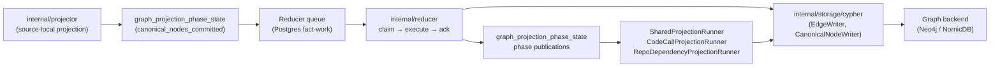
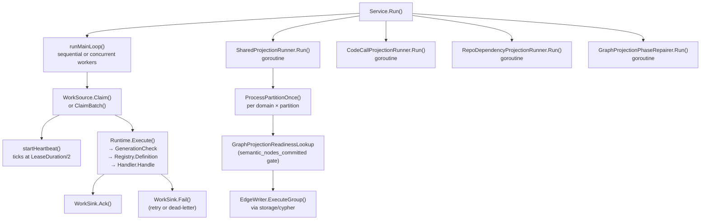

# internal/reducer

`internal/reducer` owns cross-domain materialization, queued repair, and
shared projection that runs after source-local facts have been committed by
the projector. It is the authoritative owner of canonical graph truth for
cross-source and cross-scope domains.

Reducer changes carry the highest correctness risk in the codebase. Wrong
graph truth, query truth, or deployment truth is a product failure. Track the
full path — raw evidence → admitted candidate → projected row → graph write →
query surface — before changing ordering, admission, retries, or
backend-specific behavior. See CLAUDE.md "Correlation Truth Gates".

## Where this fits in the pipeline



## Internal flow



## Domain catalog

All reducer domains are declared in `domain.go` and registered via
`NewDefaultRuntime` / `NewDefaultRegistry` in `defaults.go`. Each domain has an
`OwnershipShape` enforcing cross-source, cross-scope, and either durable
canonical-write or bounded counter-emission requirements.

| Domain constant | Summary |
| --- | --- |
| `DomainWorkloadIdentity` | Resolve canonical workload identity across sources |
| `DomainDeployableUnitCorrelation` | Correlate cross-source deployable-unit evidence before workload admission |
| `DomainCloudAssetResolution` | Resolve canonical cloud asset identity across sources |
| `DomainDeploymentMapping` | Materialize platform bindings across sources |
| `DomainDataLineage` | Resolve lineage across sources and scopes |
| `DomainOwnership` | Resolve ownership and responsibility records |
| `DomainGovernance` | Resolve governance and policy attribution |
| `DomainWorkloadMaterialization` | Materialize canonical workload graph nodes |
| `DomainCodeCallMaterialization` | Materialize canonical code-call edges |
| `DomainSemanticEntityMaterialization` | Materialize Annotation, Typedef, TypeAlias, Component semantic nodes |
| `DomainSQLRelationshipMaterialization` | Materialize canonical SQL relationship edges |
| `DomainInheritanceMaterialization` | Materialize inheritance, override, and alias edges |
| `DomainPackageSourceCorrelation` | Classify package-registry source hints against active repository remotes without ownership promotion |
| `DomainAWSCloudRuntimeDrift` | Publish admitted AWS runtime orphan, unmanaged, unknown, and ambiguous drift findings as canonical reducer facts |

## Intent lifecycle

`Intent` (declared in `intent.go:117`) carries the durable queue contract.
States: `pending` → `claimed` → `running` → `succeeded` / `failed`.

- `IntentStatusPending`, `IntentStatusClaimed`, `IntentStatusRunning`,
  `IntentStatusSucceeded`, `IntentStatusFailed` — `intent.go:65–74`.
- `ResultStatusSucceeded`, `ResultStatusFailed`, `ResultStatusSuperseded` —
  `intent.go:81–87`.
- `ResultStatusSuperseded` short-circuits execution when
  `GenerationCheck` confirms a newer generation is active for the scope.

## Queue claim / execute / ack loop

`Service` (declared in `service.go:54`) coordinates the main loop:

- **Sequential** (`Workers <= 1`): `Claim` → `executeWithTelemetry` →
  `Ack` or `Fail` in order.
- **Concurrent** (`Workers > 1`): N goroutines compete. When `WorkSource`
  implements `BatchWorkSource` and `WorkSink` implements `BatchWorkSink`,
  the batch path reduces Postgres round-trips.
- **Heartbeat**: `startHeartbeat` (`service.go:409`) spawns a goroutine
  that calls `Heartbeat` at `HeartbeatInterval`; the heartbeat is stopped
  before `Ack` or `Fail` to avoid lease extension after the transaction
  commits.

`Service.Run` also starts `SharedProjectionRunner`, `CodeCallProjectionRunner`,
`RepoDependencyProjectionRunner`, and `GraphProjectionPhaseRepairer` as
concurrent goroutines. Any runner error cancels the shared context.

## Graph projection phase coordination

`graph_projection_phase_state` is the durable readiness coordination table.
Phases and keyspaces are declared in `graph_projection_phase.go`.

Key phases:

| Phase constant | Meaning |
| --- | --- |
| `GraphProjectionPhaseCanonicalNodesCommitted` | Projector canonical node writes committed |
| `GraphProjectionPhaseSemanticNodesCommitted` | Semantic entity reducer writes committed |
| `GraphProjectionPhaseDeployableUnitCorrelation` | Deployable-unit correlation pass finished |
| `GraphProjectionPhaseDeploymentMapping` | `deployment_mapping` domain finished one bounded slice |
| `GraphProjectionPhaseWorkloadMaterialization` | `workload_materialization` domain finished |
| `GraphProjectionPhaseCrossSourceAnchorReady` | Reserved for DSL cross-source anchor publication |

`GraphProjectionPhasePublisher` (interface at `graph_projection_phase.go:117`)
is the only write path for phase rows. Use `publishIntentGraphPhase`
(`graph_projection_phase_publish.go`) inside handlers rather than calling the
publisher directly.

`GraphProjectionPhaseRepairQueue` (`graph_projection_phase_repair.go:36`) and
`GraphProjectionPhaseRepairer` (`graph_projection_phase_repair_runner.go:58`)
handle the case where a graph write commits but the subsequent phase
publication fails; the repairer retries exact rows durably.

## Code-call materialization

`ExtractCodeCallRows` turns parser `function_calls` and SCIP call facts into
canonical `CALLS` edges. Native parser calls resolve in this order: same-file
symbols, Go package-qualified import targets, Go method-return chains, Go
same-directory symbols, repository-unique symbols, then imported cross-file
symbols when the prescan import map proves the target file. For
JavaScript-family files, import resolution also honors parser-proven namespace
aliases, CommonJS property requires such as `require("./x").handler`, CommonJS
`module.exports` self-aliases, tsconfig `baseUrl` `resolved_source` metadata,
one bounded hop through static relative re-export barrels, and dynamic
JavaScript imports whose runtime `.js` specifiers point at TypeScript source.
Qualified JavaScript-family calls that match an imported namespace resolve the
imported target before trying same-file trailing-name matches, so controller and
model functions with the same method name do not collapse into self-calls.
Constructor calls, local receiver type metadata, returned and
constructor-argument function-value references, TypeScript type references, and
Function prototype receiver calls such as `callback.call(...)` let `new Type()`,
`value.method()`, type-only imports, worker processors, route-handler callback
objects, callback returns, and function receiver dispatch resolve when parser
evidence proves the local target. Static object registries are resolved only
inside the containing function source, including destructured aliases and
literal bracket keys; runtime-computed keys do not create edges. `JavaScript`
static alias metadata is cached on the code entity index
(`code_call_materialization_index.go:45`) and reused during dynamic call
resolution (`code_call_materialization_dynamic_javascript.go:41`), so
generated bundles with thousands of call sites do not re-parse the same
containing function source for every call. Sources with no static aliases are
cached too; a negative scan is still the proof that the reducer can skip the
expensive regex pass on later calls in the same source span.

For package entrypoint, package bin, package
export, and top-level JavaScript reference files, the repository scoped
`File.uid` may be the caller so executable module bodies can make `main()`,
constructor, member, function-value, and type-reference edges reachable without
treating every library module as a root. Code-call rows now carry
`caller_entity_type` and `callee_entity_type` from the entity index, using
`File` for repository-scoped file-root callers, so the graph writer can use the
exact endpoint label and `uid` instead of a broad label family. The Go
same-directory step applies to functions and type entities from `structs` and
`interfaces`; command packages commonly reuse local helper names such as
`wireAPI` in sibling `cmd/*` directories, so repo-wide bare-name resolution must
stay ambiguous in that case. Go package-qualified resolution maps parser import
metadata such as `github.com/hashicorp/terraform/internal/actions` to matching
repository directories before resolving calls like `actions.NewActions()`, and
honors explicit Go import aliases through parser `alias` metadata. Go
method-return chain resolution uses parser-provided `return_type`,
`chain_receiver_obj_type`, and `chain_receiver_method` metadata, so
`ctx.Actions().GetActionInstance()` can reach `Actions.GetActionInstance`
only after the parser proves that `ctx` has a receiver type whose `Actions`
method returns `Actions`.

For Java, parser-provided `inferred_obj_type` metadata lets receiver-qualified
calls such as `factory.basicAuth(...)` resolve to methods on the parsed
receiver type when local syntax proves the variable, parameter, field, or
inline constructor receiver. Enhanced-for variables use the same receiver
metadata, so loop-local calls such as `alignment.accepts(...)` resolve to the
record or class declared in the loop header. Unqualified calls inside nested
classes use parser-proven `enclosing_class_contexts` as exact candidates, so an
inner helper wins before the reducer tries the enclosing class method. Explicit
outer-this field receivers in Java's named-outer-instance field form use
the enclosing class field type to resolve calls on collaborator objects.
`code_call_materialization_arity.go` converts `argument_count` and
`parameter_count` metadata into `name#arity` candidates before broad name
matching, so overloaded methods such as `basicAuth(String)` and
`basicAuth(String, String)` do not collapse into one reachability result.
When Java parser rows also carry `argument_types` and `parameter_types`,
the reducer adds type-signature candidates such as
`configureBootJarTask(BootJar,TaskProvider)` before falling back to broader
names. That lets class-literal typed Gradle lambdas and helper-call return
values resolve overloaded callback methods without treating every same-name
overload as reached.
Parser rows with `call_kind=java.method_reference` resolve method-reference
syntax such as `this::configureTask` to same-class methods and materialize as
`REFERENCES`, because the source proves reachability through a functional
callback without proving an immediate invocation.
This keeps Java method reachability bounded to evidence from the parsed files
instead of treating every method with the same name as live.
Parser rows with `call_kind=java.reflection_class_reference` and
`call_kind=java.reflection_method_reference` also materialize as `REFERENCES`
when the parser saw literal class or method names in reflection calls. Dynamic
reflection strings stay unmodeled. Java metadata files produce
`call_kind=java.service_loader_provider` and
`call_kind=java.spring_autoconfiguration_class` rows; the reducer uses the
metadata file as the caller and the referenced provider or auto-configuration
class as the callee.

For Python, parser-provided `class_context`, `inferred_obj_type`, and
`constructor_call` metadata keep method and constructor resolution bounded to
evidence in the parsed file. Local constructor assignments and `self` member
calls can both carry receiver type. Constructor calls can reach both the class
entity and its `__init__` method. Class receiver rows with
`call_kind=python.class_reference` materialize as `REFERENCES`, while a
class-qualified method call may resolve to a
unique inherited method name when no exact class-context method exists. That
protects dataclass and model helper paths without making all same-named Python
methods reachable.

Parser metadata rows with `call_kind=go.composite_literal_type_reference`,
`call_kind=typescript.type_reference`, `call_kind=python.class_reference`, or
`call_kind=java.method_reference`, plus Java literal-reflection,
ServiceLoader, and Spring auto-configuration class references, materialize as
deduplicated `REFERENCES` edges. They prove reference roots for dead-code
classification, but must not materialize as `CALLS` because that would make
graph truth claim that type or class references are invocations.

`CodeCallMaterializationHandler` logs `code call materialization completed`
with fact count, repository count, row counts, and timing for fact load,
context build, extraction, intent build, intent upsert, and total duration
(`code_call_materialization.go:62-156`). Keep that signal when changing the
handler; it is the first split used to tell parser extraction cost from
Postgres intent-write cost on large repositories.

SCIP edges bypass the heuristic resolver when both caller and callee locations
map to known entities. Keep the native and SCIP paths idempotent: duplicate
facts for the same caller, callee, and reference line must collapse to one
intent row before graph writes.

## Shared projection runner

`SharedProjectionRunner` (`shared_projection_runner.go:95`) iterates all
shared-projection domains and all partitions each cycle, calling
`ProcessPartitionOnce` for each domain/partition pair. Domains processed:
`platform_infra`, `workload_dependency`, `inheritance_edges`,
`sql_relationships`.

The runner uses exponential back-off (doubling each empty cycle, capped at
`5s`) to avoid sustained high-frequency polling during idle periods. When
intents are blocked on a readiness phase (`BlockedReadiness > 0`), it
re-polls at the base interval without backing off.

`CodeCallProjectionRunner` owns the `code_calls` domain separately because it
rewrites one accepted repo/run unit at a time while preserving repo-wide
retraction semantics. Very large accepted units are processed in capped chunks:
the first chunk retracts when prior durable history exists, and later chunks
from the same source run skip retraction so earlier chunk writes stay
graph-visible. In local-authoritative NornicDB runs it can receive a
`ReducerGraphDrain`; when active reducer graph domains remain, the runner
records a blocked cycle and waits before claiming the code-call partition. The
gate only schedules work. It does not change which rows become `CALLS`,
`REFERENCES`, or `USES_METACLASS`.

Configuration via `LoadSharedProjectionConfig` reads
ESHU_SHARED_PROJECTION_* env vars; see `cmd/reducer/README.md`.

`InheritanceMaterializationHandler` and `SQLRelationshipMaterializationHandler`
load only the `content_entity` rows whose `entity_type` can participate in
their domains (`inheritance_materialization.go:69-77`,
`sql_relationship_materialization.go:60-69`). The filters are correctness
filters, not sampling: every allowed type is still processed, and unsupported
types stay invisible to those domain reducers.
SQL relationship materialization writes trigger-to-table `TRIGGERS` edges and
trigger-to-function `EXECUTES` edges from the same `SqlTrigger` entity when the
parser proves both targets. The `EXECUTES` row is part of code dead-code
reachability for `SqlFunction` routines, so removing it can turn trigger-bound
stored procedures into false cleanup candidates. The helper code in
`sql_relationship_names.go` indexes both qualified names and trailing
unqualified aliases, then
`resolveSQLRelationshipTarget` prefers the same repository and relative path
before falling back only when the SQL name is unique in the repository;
ambiguous cross-file names stay unresolved rather than creating false
reachability.

## Facts-First Bootstrap Ordering

The bootstrap pipeline in `go/cmd/bootstrap-index/main.go` enforces a
multi-pass ordering that the reducer must honor:

```text
Phase 1 — Collection + First-Pass Reduction
  Projector drains and emits canonical nodes. deployment_mapping can remain
  pending because resolved_relationships do not yet exist.

Phase 2 — Backfill
  BackfillAllRelationshipEvidence() (bootstrap-index/main.go:236)
  populates relationship_evidence_facts and publishes readiness rows.

Phase 3 — Deployment Mapping Reopen
  ReopenDeploymentMappingWorkItems() (bootstrap-index/main.go:273)
  reopens deployment_mapping so the reducer can create resolved_relationships.

Phase 4 — Second-Pass Consumers
  Any domain consuming resolved_relationships must have a re-trigger
  mechanism after Phase 3.
```

**Critical rule**: any reducer domain or sub-package that consumes
`resolved_relationships` must have a post-Phase-3 reopen or re-trigger
mechanism. Adding a new consumer without that mechanism creates an E2E-only
bug that is invisible in unit and integration tests.

## Exported surface

Core interfaces:

- `WorkSource`, `Executor`, `WorkSink`, `WorkHeartbeater` — `service.go:22–40`
- `BatchWorkSource`, `BatchWorkSink` — `service.go:43–51`
- `Handler`, `HandlerFunc` — `registry.go:70–78`
- `GraphProjectionPhasePublisher` — `graph_projection_phase.go:117`
- `GraphProjectionPhaseRepairQueue` — `graph_projection_phase_repair.go:36`
- `GraphProjectionPhaseStateLookup` — `graph_projection_phase_repair_runner.go:25`

Key construction functions:

- `NewDefaultRuntime(DefaultHandlers)` — `defaults.go:121` — one-call wiring
  for the standard domain catalog.
- `NewDefaultRegistry(DefaultHandlers)` — `defaults.go:105` — registry only.
- `NewRuntime(Registry)` — `runtime.go:63` — bare runtime over a custom registry.
- `LoadSharedProjectionConfig(getenv)` — `shared_projection_runner.go:476`.
- `BuildSharedProjectionIntent(input)` — `shared_projection.go:53` — stable
  SHA256 intent ID matching the Python implementation.
- `BuildProjectionRows`, `BuildProjectionRowsWithInfrastructurePlatforms` —
  `projection.go:233, 243`.

In-memory runtime types used by focused reducer tests:

- `Runtime` — `runtime.go:55` — bounded in-memory reducer queue over a
  `Registry`.
- `Result`, `RunReport`, `Stats`, and `DomainStats` — `runtime.go:10`,
  `runtime.go:20`, `runtime.go:29`, `runtime.go:40` — terminal execution
  outcome, one-run drain summary, and queue/domain snapshots returned by
  `Runtime.RunOnce` and `Runtime.Stats`.

Domain and intent helpers:

- `ParseDomain(raw)` — `domain.go:24`.
- `IsRetryable(err)` — `intent.go:106`.
- `GraphProjectionPhaseRepairsFromStates` — `graph_projection_phase_repair.go:45`.
- `ExtractOverlayEnvironments` — `projection.go:207`.
- `InferWorkloadKind`, `InferWorkloadClassification` — `projection.go:152, 169`.

## Dependencies

- `internal/storage/cypher` — all canonical graph writes; no direct driver calls.
- `internal/relationships` — evidence kinds consumed by cross-repo resolution
  and provisioning evidence classification (`projection.go:544`).
- `internal/telemetry` — spans, metrics, log attributes.
- `internal/truth` — `truth.Contract`, `truth.Layer` for domain registration.
- `internal/storage/postgres` — Postgres-backed implementations of all
  queue and store interfaces; wired in `cmd/reducer`, not here.

## Telemetry

Spans emitted:

- `SpanReducerRun` — wraps each `executeWithTelemetry` call
  (`service.go:308`).
- `SpanCanonicalWrite` — wraps each `processPartitionWithTelemetry`
  call in `SharedProjectionRunner` (`shared_projection_runner.go:284`).

Key metrics (all prefixed `eshu_dp_`):

- `reducer_run_duration_seconds` — per-intent execution duration, labeled by domain.
- `reducer_queue_wait_duration_seconds` — time from `AvailableAt` to claim start.
- `reducer_executions_total` — intent executions, labeled by domain, queue, status.
- `queue_claim_duration_seconds` — time to acquire one claim from Postgres.
- `shared_projection_cycles_total` — completed shared projection cycles per domain.
- `canonical_write_duration_seconds` — duration of one canonical write cycle.
- `shared_projection_intent_wait_duration_seconds` — per-domain intent queue age.
- `shared_projection_processing_duration_seconds` — per-domain partition processing.
- `shared_projection_step_duration_seconds` — per phase (retract, write, mark_completed).
- `canonical_writes_total` — includes graph-projection repair writes.
- `package_source_correlations_total` — package source-correlation decisions by
  bounded outcome (`exact`, `derived`, `ambiguous`, `unresolved`, `stale`,
  `rejected`) and reducer domain.
- `correlation_rule_matches_total`, `correlation_orphan_detected_total`, and
  `correlation_unmanaged_detected_total` — AWS runtime drift rule execution and
  admitted orphan/unmanaged findings. Unknown and ambiguous findings are exposed
  in reducer summaries, admitted-finding logs, and durable fact evidence. ARNs
  stay in structured logs and fact evidence, not metric labels.

Log phase attributes: `telemetry.PhaseReduction` (main loop),
`telemetry.PhaseShared` (shared projection and repair runner).

## Gotchas / invariants

- **All reducer domains must be cross-source, cross-scope, and truth-emitting**
  — enforced by `OwnershipShape.Validate`; domains either write canonical graph
  truth, publish durable reducer facts such as `aws_cloud_runtime_drift`, or
  emit bounded counters such as `package_source_correlation`.
- **AWS runtime drift publication is graph-neutral for this slice** —
  `AWSCloudRuntimeDriftHandler` writes `reducer_aws_cloud_runtime_drift_finding`
  facts through `PostgresAWSCloudRuntimeDriftWriter`; graph nodes and MCP/API
  read models need their own frozen shape before Cypher lands.
- **Projection must be idempotent** — queue retries, duplicate claims, and
  partial graph writes must converge on the same truth.
- **Generation supersession** — `Runtime.execute` calls `GenerationCheck`
  before dispatching to a handler; stale intents return
  `ResultStatusSuperseded` without touching the graph.
- **`deployment_mapping` requires post-Phase-3 reopen** — the domain
  cannot produce `resolved_relationships` until after
  ReopenDeploymentMappingWorkItems runs in the bootstrap pipeline
  (bootstrap-index/main.go:273).
- **Phase publications and graph writes are not atomic** — if a graph write
  commits but the subsequent `PublishGraphProjectionPhases` call fails, the
  `GraphProjectionPhaseRepairQueue` captures the publication for retry by
  `GraphProjectionPhaseRepairer`. Do not remove the repair queue without
  understanding this failure mode.
- **Edge domain readiness gates** — shared projection domains
  `code_calls`, `sql_relationships`, and `inheritance_edges` gate on
  `canonical_nodes_committed` or `semantic_nodes_committed` being present
  before writing edges (`shared_projection.go:91–99`).
- **Code-call chunks must not retract each other** — a code-call accepted
  unit can exceed `DefaultCodeCallAcceptanceScanLimit`. The runner processes a
  capped slice, marks it complete, and then continues with later slices from
  the same source run. `CodeCallProjectionCurrentRunHistoryLookup` is the guard
  that skips retraction after the first current-run chunk.
- **Bare code-call names are scoped before they are broadened** — same-file
  resolution wins first. Go then allows a same-directory match before the
  repository-unique fallback; if another package has the same bare name, do
  not create a repo-wide edge.
- **Go package and return-chain evidence must stay bounded** — imported
  package calls resolve only through parser import rows and repository
  directory matches. Method-return chains resolve only when one method name has
  one return type inside the same repository.
- **JavaScript-family top-level calls need file-root evidence** — only
  package entrypoint, package bin, and package export files can use the
  repo-scoped `File.uid` caller for top-level calls. Do not promote arbitrary
  module-body calls to roots.
- **`BuildSharedProjectionIntent` produces a stable SHA256 ID** —
  changing any of the identity fields breaks idempotency for in-flight
  intents (`shared_projection.go:59–66`).

## Related docs

- `docs/docs/architecture.md`
- `docs/docs/deployment/service-runtimes.md`
- `docs/docs/reference/telemetry/index.md`
- `docs/docs/reference/local-testing.md`
- `go/cmd/reducer/README.md`
- `go/internal/projector/README.md` (upstream handoff)
- `go/internal/reducer/dsl/README.md`
- `go/internal/reducer/aws/README.md`
- `go/internal/reducer/tags/README.md`
- `go/internal/reducer/tfstate/README.md`
