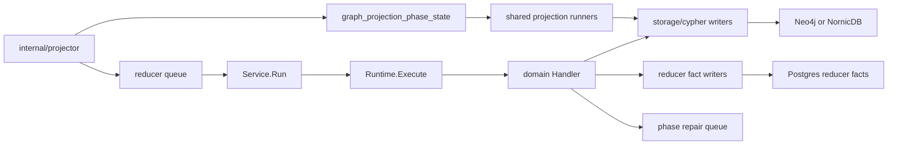

# internal/reducer

`internal/reducer` owns cross-domain materialization, shared projection,
queued repair, and reducer-owned fact publication after source-local facts have
been committed. It is the authority for cross-source graph truth and durable
reducer facts.

Reducer work has a high correctness bar. Before changing a domain, trace the
full path from raw fact evidence to admitted candidate, projected row, graph or
fact write, and API/MCP read surface.

## Runtime Flow



## Core Responsibilities

- Claim reducer intents from Postgres and execute them with lease heartbeats.
- Apply generation supersession before a stale intent can write truth.
- Register reducer domains with ownership and truth contracts.
- Publish graph projection readiness phases after graph writes.
- Retry phase publications through the repair queue when graph writes succeed
  but readiness publication fails.
- Materialize shared edge domains such as code calls, SQL relationships, and
  inheritance only after their required readiness phase exists.
- Publish reducer-owned facts for domains that intentionally do not write graph
  truth in the current slice.

## Domain Catalog

Reducer domains are declared in `domain.go` and registered through
`NewDefaultRuntime` / `NewDefaultRegistry`.

| Domain | Owns |
| --- | --- |
| `workload_identity` | Canonical workload identity across sources. |
| `deployable_unit_correlation` | Cross-source deployable-unit evidence before workload admission. |
| `cloud_asset_resolution` | Canonical cloud asset identity. |
| `deployment_mapping` | Platform binding materialization from resolved relationships. |
| `data_lineage`, `ownership`, `governance` | Cross-domain relationship materialization hooks. |
| `workload_materialization` | Canonical workload graph node projection. |
| `code_call_materialization` | Code-call and reference intent construction from parser and SCIP facts. |
| `semantic_entity_materialization` | Annotation, typedef, type alias, component, and related semantic node projection. |
| `sql_relationship_materialization` | SQL trigger/table/function relationship intent construction. |
| `inheritance_materialization` | Inheritance, override, and alias relationship intent construction. |
| `package_source_correlation` | Package ownership candidates, publication evidence, and manifest-backed consumption truth. |
| `aws_cloud_runtime_drift` | Durable AWS runtime drift findings. |
| `container_image_identity` | Digest-first container image identity facts. |
| `ci_cd_run_correlation` | CI/CD run, artifact, and environment correlation facts. |
| `service_catalog_correlation` | Repository-evidence-gated service-catalog correlation facts. |
| `sbom_attestation_attachment` | SBOM and attestation attachment facts without vulnerability promotion. |
| `supply_chain_impact` | Vulnerability impact findings from explicit package, SBOM, image, or repository evidence. |

Every domain definition must pass `OwnershipShape.Validate`: it must be
cross-source, cross-scope, and either write durable canonical truth or emit a
bounded reducer-owned fact/counter contract.

## Intent Lifecycle

Reducer intents use the fixed lifecycle in `intent.go`:

```text
pending -> claimed -> running -> succeeded | failed
```

`ResultStatusSuperseded` is a terminal execution result, not an intent state.
`Runtime.execute` checks generation freshness before dispatching a handler; a
superseded intent must not touch the graph or reducer fact stores.

`Service.Run` has two execution modes:

- `Workers <= 1`: claim, execute, ack/fail sequentially.
- `Workers > 1`: workers compete for claims; batch claim and batch ack are used
  only when the configured source and sink implement the batch interfaces.

The heartbeat goroutine stops before `Ack` or `Fail`, so lease extension cannot
continue after terminal state is written.

## Phase Coordination

`graph_projection_phase_state` records readiness between source-local
projection, reducer domains, and shared projection runners.

Important phases:

| Phase | Meaning |
| --- | --- |
| `canonical_nodes_committed` | Projector canonical node writes committed. |
| `semantic_nodes_committed` | Reducer semantic entity writes committed. |
| `deployable_unit_correlation` | Deployable-unit correlation completed for a bounded slice. |
| `deployment_mapping` | Deployment mapping completed for a bounded slice. |
| `workload_materialization` | Workload materialization completed. |
| `cross_source_anchor_ready` | Reserved cross-source anchor publication phase. |

Graph writes and phase publications are not atomic. If a graph write commits
but phase publication fails, enqueue the exact phase rows for
`GraphProjectionPhaseRepairer`.

## Bootstrap Ordering

Bootstrap has a facts-first ordering that reducer domains must preserve:

```text
1. Collection and first-pass projection
2. Relationship-evidence backfill
3. Deployment-mapping reopen
4. Second-pass consumers
```

Any reducer domain that consumes `resolved_relationships` needs a reopen or
re-trigger mechanism after the deployment-mapping reopen step. Adding a
consumer without that mechanism creates failures that usually show up only in
end-to-end bootstrap runs.

## Shared Projection

Shared projection turns reducer-built intent rows into graph edges after the
required readiness phase exists.

| Shared domain | Readiness gate |
| --- | --- |
| `code_calls` | `canonical_nodes_committed` |
| `sql_relationships` | `semantic_nodes_committed` |
| `inheritance_edges` | `semantic_nodes_committed` |
| `platform_infra`, `repo_dependency`, `workload_dependency` | Domain-specific intent readiness. |

`CodeCallProjectionRunner` owns `code_calls` separately because it rewrites one
accepted source-run unit at a time and may process large units in chunks.
Only the first current-run chunk retracts prior history; later chunks from the
same run must not retract edges written by earlier chunks.

## Code-Relationship Rules

Do not duplicate the full language-specific call-resolution matrix here. The
canonical contracts are the reducer extraction code and tests:

- `code_call_materialization*.go`
- `code_call_materialization*_test.go`
- `sql_relationship_materialization*.go`
- `inheritance_materialization*.go`
- `docs/public/reference/dead-code-reachability-spec.md`
- `docs/public/reference/relationship-mapping.md`

The package-local invariant is simpler: materialize only relationships proven
by parser, SCIP, content, or reducer evidence, keep ambiguous names unresolved,
and preserve enough endpoint type information for graph writers and dead-code
classification to stay truthful.

## Telemetry

Reducer diagnostics depend on these signals:

- `SpanReducerRun` around each domain execution.
- `SpanCanonicalWrite` around shared projection writes.
- reducer queue wait and run-duration metrics.
- shared projection wait, processing, and step-duration metrics.
- graph projection repair metrics and logs.
- domain-specific bounded counters for package source correlation, AWS drift,
  CI/CD correlation, service-catalog correlation, SBOM attachment, container
  image identity, and supply-chain impact.

When a reducer path is slow, classify whether the cost is fact load,
relationship extraction, intent upsert, graph write, phase publication, or
repair before changing worker counts or timeouts.

## Gotchas

- Do not call graph drivers directly from domain handlers. Canonical graph
  writes go through `internal/storage/cypher`.
- Do not remove graph projection phase repair; it is the recovery path for
  non-atomic graph-write plus phase-publication failures.
- Do not use serialization as a correctness fix for non-idempotent writes.
- Do not turn type/class references into `CALLS`; use `REFERENCES` when source
  text proves reachability without proving invocation.
- SQL trigger-to-function `EXECUTES` edges protect trigger-bound stored
  procedures from false dead-code cleanup candidates.
- Mutable container tags are not image identity unless exactly one projected
  digest observation proves the mapping.
- SBOM component evidence is not vulnerability impact by itself.
- Package source hints are provenance until reducer correlation admits
  ownership or consumption truth.
- Service catalog names and ownership labels are provenance until explicit
  repository evidence admits exact, derived, ambiguous, unresolved, stale, or
  rejected correlation facts.

## Change Checklist

- Add a domain by defining the `Domain`, implementing the handler, registering
  ownership and truth contracts only when the domain is unconditionally wired,
  wiring adapters in `cmd/reducer`, adding telemetry, and writing the failing
  contract test first.
- Change queue claim, batch claim, ack, fail, lease, or heartbeat behavior only
  after mapping the concurrency and idempotency path. Duplicate claims and
  partial failures must converge on the same graph truth.
- Add a graph projection phase by defining the phase, checking keyspace usage,
  updating Postgres readiness storage when needed, and wiring the shared
  projection readiness gate.
- Change shared projection runner config by updating both
  `LoadSharedProjectionConfig` and the reducer command configuration docs.
- Add a `resolved_relationships` consumer only with a post-Phase-3 reopen or
  re-trigger path in bootstrap.

No-Regression Evidence: `go test ./internal/reducer ./internal/storage/postgres ./cmd/reducer -run 'TestPlatformMaterializationHandlerLocksInfrastructurePlatformIDs|TestNewDefaultRegistryWiresPlatformGraphLocker|TestPlatformGraphLocker|TestPlatformGraphLockerForReducer|TestBuildReducerServiceWiresDefaultRuntimeAndQueue' -count=1` proves deployment_mapping platform writes acquire per-Platform.id locks without lowering worker concurrency and skip lock wiring when transactions are unavailable.
Observability Evidence: existing reducer queue conflict fields, fact-work retry counters, deployment_mapping completion logs, graph-write retry WARNs, and Postgres query errors expose blocked, retrying, failed, and completed platform materialization work; no new metric label was needed.

## Verification

```bash
go test ./internal/reducer -count=1
go test ./cmd/reducer -count=1
go run ./cmd/eshu docs verify ../go/internal/reducer --limit 1000 \
  --fail-on contradicted,missing_evidence
```

Run broader storage, query, MCP, and telemetry tests when a reducer change
alters persisted facts, graph writes, API read models, tool routing, or metric
contracts.

## Related Docs

- [Architecture](../../../docs/public/architecture.md)
- [Service Runtimes](../../../docs/public/deployment/service-runtimes.md)
- [Collector And Reducer Readiness](../../../docs/public/reference/collector-reducer-readiness.md)
- [Relationship Mapping](../../../docs/public/reference/relationship-mapping.md)
- [Dead-Code Reachability Spec](../../../docs/public/reference/dead-code-reachability-spec.md)
- [Telemetry Reference](../../../docs/public/reference/telemetry/index.md)
- [Local Testing](../../../docs/public/reference/local-testing.md)
- [Reducer Command](../../cmd/reducer/README.md)
- [Projector Package](../projector/README.md)
