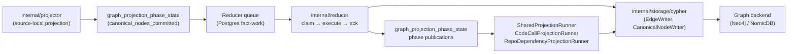
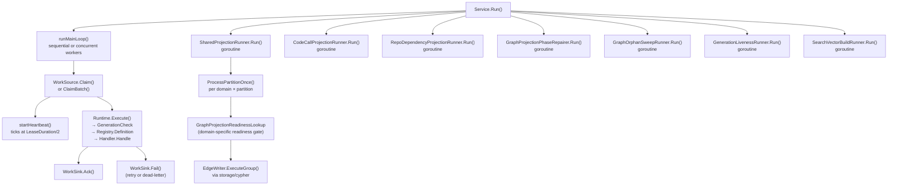

# internal/reducer

`internal/reducer` owns cross-domain materialization, queued repair, and
shared projection that runs after source-local facts have been committed by
the projector. It is the authoritative owner of canonical graph truth for
cross-source and cross-scope domains.

Reducer changes carry the highest correctness risk in the codebase. Wrong
graph truth, query truth, or deployment truth is a product failure. Track the
full path — raw evidence → admitted candidate → projected row → graph write →
query surface — before changing ordering, admission, retries, or
backend-specific behavior. See CLAUDE.md "Correlation Truth Gates".
Code reachability projection computes a bounded transitive reachable set from
root code entities over `CALLS`, `REFERENCES`, and `INHERITS`, preserving the
weakest provenance method on each path so downstream dead-code reads can use
materialized `code_reachability_rows` without promoting weak guesses to truth.
The runner partitions work by the `(scope_id, generation_id, repository_id)`
conflict key and projects disjoint partitions concurrently (bounded by
`ESHU_REDUCER_WORKERS`, clamped to host CPUs); same-key inputs stay in one
ordered partition so the per-repository DELETE+INSERT replacement never races.
Traversal is bounded by `MaxDepth` and `MaxVisited`; a truncated snapshot is
logged and its omitted entities fall back to the legacy incoming-edge lookup
rather than being asserted dead. See
[dead-code-reachability.md](../query/dead-code-reachability.md) for the
concurrency, bounds, backend-parity, and benchmark/observability evidence.

## Where this fits in the pipeline



## Internal flow



## Generation Liveness Recovery

`GenerationLivenessRunner` is the self-healing path for the generation
lifecycle. An `active` generation that reaches canonical-nodes-committed but
makes no forward progress and has no newer same-scope generation to supersede it
sits `active` indefinitely. The runner delegates to
`storage/postgres.GenerationLivenessStore`, which runs two bounded statements per
poll: it supersedes orphaned older `active` generations once a newer same-scope
generation is authoritative, and re-enqueues projector work for wedged actives
past the activation deadline (re-driving reduce -> readiness -> projection over
existing facts). Wedge detection gates on real downstream blockage, not age
alone: a generation is only wedged when it has an outstanding
`shared_projection_intents` row (`completed_at IS NULL`) and no unresolved
reducer fact-work remains for that same generation, and no source-local
projector work is already pending, claimed, running, or retrying. A
healthy quiet scope stays `active` and projected (the projected baseline is "has
been active") with every intent completed; a busy full-corpus bootstrap scope
still moving through reducer work is treated as progressing; and a pending
liveness recovery row is allowed to run before the sweep spends more budget.
Those cases are not re-driven, which prevents false `stuck` alarms on idle
installations and normal bootstrap backlog, and prevents tight budget burn while
recovery is already in flight. A succeeded source-local projector row is the
normal activation lifecycle state, so the bounded recovery upsert may reopen it
when downstream blockage still makes the generation wedged. A per-generation
re-drive budget (`liveness_recovery_attempts` on the work item payload) bounds
retries so a poison scope cannot loop. The conflict domain is `scope_id`; both
statements are idempotent under concurrent reducer workers.
The operator escape hatch is
`POST /api/v0/admin/recover-generations`, which durably re-drives a named scope
set and records the action in the `admin_replay_requests` ledger.

Observability Evidence: `eshu_dp_active_generations` gauges active generations by
`fresh`/`aging`/`stuck` age bucket (`stuck` requires age past the deadline,
outstanding `shared_projection_intents`, no unresolved reducer fact-work for the
same generation, and no source-local projector row already pending, in progress,
so it does not fire on healthy quiet aged scopes, reducer backlog, or in-flight
recovery);
`eshu_dp_generation_liveness_recovered_total`,
`eshu_dp_generation_liveness_superseded_total`, and
`eshu_dp_generation_liveness_failures_total` count sweep outcomes; completion and
failure logs carry the `reduction` phase attribute. No-Regression Evidence: the
runner adds no hot-path Cypher or worker-default change; it re-uses the existing
projector enqueue path under bounded `LIMIT` statements. Verify with
`go test ./internal/reducer -run 'GenerationLiveness' -count=1` and
`go test ./internal/storage/postgres -run 'GenerationLiveness|WedgedActive|OrphanedActive' -count=1`.

## Poison Dead-Letter Liveness Recovery (#4740)

`GenerationLivenessRunner` above only re-drives a scope whose newest generation
is `active`. It does not reach a scope whose newest generation is terminally
`dead_letter`: `dead_letter` is never re-claimed by the normal claim path, and
the wedge-detection NOT EXISTS guard treats same-generation `dead_letter`
reducer work as still "in progress," excluding it from the wedged re-drive
path. Such a scope can never self-heal without an operator or a dedicated
bounded arm.

`PoisonLivenessRunner` closes that gap. It delegates to
`storage/postgres.PoisonLivenessStore`, which runs two bounded, read-only-safe
statements: `CountPoisonDeadLetters` (an aggregate query) and, only when
bounded auto-retry is enabled, `RecoverPoisonDeadLetters` (the re-enqueue
UPDATE). The poison class is: a `fact_work_items` row with `status =
'dead_letter'` whose scope has no strictly-newer `scope_generations` row (same
"strictly newer" `(ingested_at, generation_id)` comparator the
generation-liveness supersede query uses). A scope with any newer generation —
regardless of that newer generation's own status — has already moved on, so the
dead-letter row is historical, not live poison.

The default operational posture is surface-only
(`ESHU_POISON_LIVENESS_AUTO_RETRY_ENABLED=false`): the stuck-gauge is wired
unconditionally in `cmd/reducer` so an operator always sees the poison-class
size, but `PoisonLivenessRunner` itself — and therefore any `dead_letter ->
pending` re-enqueue write — is only constructed when an operator opts in. When
enabled, the bounded arm re-enqueues a dead-letter row to `pending` under a
per-row `poison_recovery_attempts` budget carried in the work item's JSONB
payload (`ESHU_POISON_LIVENESS_MAX_RECOVER_ATTEMPTS`, default 1, mirroring the
`liveness_recovery_attempts` idiom above; no new schema column). A row at or
past the budget ceiling is excluded by the candidate CTE, so a genuinely poison
item stops looping and is left `dead_letter` for an operator to inspect. The
conflict domain is `work_item_id` (the `fact_work_items` primary key): the
recovery UPDATE re-verifies `status = 'dead_letter'` at write time
(`AND target.status = 'dead_letter'` on the target row, not only the read-time
candidate snapshot), so under Read Committed a concurrent reclaim of the exact
same row between the candidate CTE's snapshot and the UPDATE's row lock is
never clobbered — the write-time WHERE re-evaluates (EvalPlanQual recheck)
against the now-committed row and affects zero rows for it instead.

Detection is bounded by a dedicated partial index,
`fact_work_items_dead_letter_poison_idx` (migration `043`), on
`(scope_id, generation_id) WHERE status = 'dead_letter'`. Because `dead_letter`
is terminal, the index only grows on new dead-letters and shrinks when the arm
successfully re-enqueues a row (its status leaves `dead_letter`), so it stays
proportional to the live poison backlog rather than the full `fact_work_items`
table.

No-Regression Evidence: `go test ./internal/storage/postgres/...
./internal/reducer/... ./cmd/reducer ./cmd/ingester -count=1` passes
(4281 tests). Against a throwaway `postgres:16-alpine` instance (set
`ESHU_POISON_LIVENESS_PROOF_DSN`), `go test ./internal/storage/postgres -run
'TestPoisonLivenessIntegration|TestRecoverPoisonDeadLettersQueryDoesNotClobberConcurrentReclaim'
-count=1` proves all four required behaviors: (1) RED — the existing
generation-liveness gauge (`CountActiveGenerationsByAge`) counts 0 of 3 seeded
poison scopes because their newest generation is `failed`, not `active`; GREEN
— `CountPoisonDeadLetters` counts exactly the 3 poison scopes/items and excludes
a healed decoy (`dead_letter` with a newer `active` generation for the same
scope); (2) the bounded arm increments `poison_recovery_attempts` 0->1->2 across
two re-dead-lettered sweeps, then a third sweep at the ceiling affects 0 rows
and leaves the row `dead_letter` for an operator; (3)
`GaugeUsesPartialIndex` forces `enable_seqscan=off` and asserts the
`countPoisonDeadLettersQuery` EXPLAIN plan references
`fact_work_items_dead_letter_poison_idx`, proving the index is usable for this
exact query shape; (4)
`TestRecoverPoisonDeadLettersQueryDoesNotClobberConcurrentReclaim` races a real
concurrent reclaim transaction (`dead_letter -> claimed`) against the sweep's
blocked UPDATE and proves the write-time guard leaves the reclaimed row
untouched (`Recovered = 0`, final status `claimed`, `lease_owner` unchanged,
budget counter not incremented) instead of clobbering it back to `pending`.

Observability Evidence: `eshu_dp_poison_dead_letter_scopes`,
`eshu_dp_poison_dead_letter_items`, and
`eshu_dp_poison_dead_letter_oldest_age_seconds` are observable gauges reporting
the current poison-class size and oldest item age, registered unconditionally
in `cmd/reducer` (`poisonLivenessObserverFor` +
`telemetry.RegisterPoisonLivenessObservableGauges`) so the class is visible
regardless of the auto-retry flag, independent of whether
`PoisonLivenessRunner` itself is constructed. When the runner is constructed
(auto-retry enabled), it records through the shared `*telemetry.Instruments`
contract passed into its `Instruments` field — not an inline meter — via
`recordResult`/`recordFailure`: `eshu_dp_poison_liveness_recovered_total` and
`eshu_dp_poison_liveness_failures_total` count bounded sweep outcomes;
completion and failure logs carry the `reduction` phase attribute and, on
failure, the `poison_liveness_error` failure class.

## Graph Orphan Sweep

`GraphOrphanSweepRunner` runs beside reducer intent workers and shared
projection. It delegates to `storage/cypher.OrphanSweepStore`, which computes
orphan status as a Go-side anti-join between two bounded reads per label
(candidates with no relationship clause, and connected keys via a concrete
relationship-variable `MATCH` anchored on those candidates' identity keys --
see `storage/cypher/README.md` and `storage/cypher/evidence-5147-orphan-sweep-antijoin.md`
for why: every relationship-existence predicate is mis-evaluated on the pinned
NornicDB backends), then marks, clears, and deletes only disconnected nodes in
a closed label set: `Repository`, `Platform`, `EvidenceArtifact`, `File`,
`Directory`, and `Module`. The sweep uses static-label, key-anchored Cypher
writes, a single-owner Postgres partition lease, a per-label batch limit, a
per-label count cap, and a TTL marker (`eshu_orphan_observed_at_unix`) so one
transiently disconnected cycle cannot delete a node immediately; a TOCTOU
re-verify immediately before delete drops any key that reconnected mid-cycle.
Repository sweeps exclude `evidence_source='projector/canonical'`; empty but
active source-local repositories remain canonical-writer truth, not sweep
candidates.

This runner is cleanup, not truth ownership. Relationship retraction,
canonical-node replacement, and reducer-owned materialization still own their
normal invariants. The sweep removes only nodes that remain disconnected after
the TTL and clears the marker when a relationship returns.

No-Regression Evidence: `go test ./internal/storage/cypher -run
'TestDefaultOrphanSweepLabelsIncludesCodeStructureLabels|TestBuildCandidateOrphanNodesQueryUsesStaticLabelNoRelationshipPredicate|TestBuildConnectedKeysQueryUsesConcreteRelationshipVariable|TestBuildClearMarkSweepStatementsAreKeyAnchoredNoRelationshipPredicate|TestOrphanSweepStoreDelaysCodeStructureDeletionDuringProjectionRace|TestGraphOrphanNodeCountsUsesDefaultCodeStructureLabels|TestCanonicalCodeStructureNodesStampOrphanSweepMetadata|TestRepoRelationshipUpsertStamps|TestOrphanSweepStoreUsesInjectedClockForMarkAndCutoff|TestOrphanSweepStoreConvergesAcrossBoundedCyclesForAllDefaultLabels|TestOrphanSweepStoreTOCTOUGuardDropsReconnectedKeyBeforeSweep'
-count=1` proves the bounded static-label, no-relationship-predicate anti-join
read shapes, metadata stamping for relationship-created repositories and
platforms, default coverage for code structure labels, Directory and imported
Module metadata stamping, bounded convergence, newly observed code-structure
orphan retention before TTL expiry, telemetry observer counts, the TOCTOU
guard, and injected-clock TTL behavior. `go test
./internal/storage/cypher -run
TestRepositoryCandidateQueryExcludesSourceLocalCanonicalRepositories -count=1`
proves source-local canonical Repository nodes are outside the sweep predicate.
`go test ./cmd/reducer -run TestProductionWiringConsumesCapabilityDefaults
-count=1` proves the reducer runtime consumes the same closed label default
instead of a stale subset.
`go test ./internal/reducer -run
'TestGraphOrphanSweepRunner|TestServiceStartsGraphOrphanSweepRunner' -count=1`
proves the runner drains available delete batches without lowering worker
concurrency, skips graph mutation when another replica owns the sweep lease, and
starts as a side runner in `Service.Run()`.

Observability Evidence: `GraphOrphanSweepRunner` completion logs include total
and per-label counts, marks, deletes, duration, `phase=reduction`, and
`failure_class=graph_orphan_sweep_error` on failure. The reducer registers
`eshu_dp_graph_orphan_nodes` through `telemetry.RegisterGraphOrphanObservableGauge`;
the metric is labeled only by closed `node_label` values and uses the configured
per-label count cap.

## Cross-scope node ownership (#5007)

The AWS/GCP/Azure CloudResource, EC2-instance, and Kubernetes-workload node row
builders stamp `source_order_key` on every node row — a fixed-width
`(observed_at, source_fact_id)` encoding whose lexicographic order matches the
intended "latest observation, source_fact_id tie-break" order (`sourceOrderKey`
in `source_order_key.go`). Within a scope generation, duplicate-uid rows resolve
to the max order key (`preferMaxSourceOrderKey`) rather than last-fact-by-slice.
Across scopes, `cmd/reducer` wraps these three node writers in the
`internal/graphowner` owner-ledger gate, which resolves the shared node to the
max-order-key contributor via a Postgres advisory-lock + `graph_node_owner`
ledger (NornicDB cannot resolve the concurrent property-write conflict itself,
#5062). See `docs/internal/design/5007-cross-scope-node-ownership.md`.

## Domain catalog

All reducer domains are declared in `domain.go` and registered via
`NewDefaultRuntime` / `NewDefaultRegistry` in `defaults.go`. Each domain has an
`OwnershipShape` enforcing cross-source, cross-scope, and either durable
canonical-write or bounded counter-emission requirements.

`AllDomains` returns every reducer-owned domain sorted lexicographically: the
claim/materialization domains in `knownDomains` plus the shared/edge projection
domains in `allProjectionDomains` (`shared_projection.go`), deduplicated. It is
the single enumeration source for tooling that must list the full domain set —
notably the capability surface inventory and its drift gate — so adding a domain
to either registry automatically adds it there. `allProjectionDomains` is a
superset of the partition worker's `sharedProjectionDomains`: it also covers the
domains driven by dedicated projection runners (`code_calls`, `repo_dependency`,
`deployable_unit_edges`).

`MaterializedEdgeFamilies` (`materialized_edge_families.go`, #5351) returns
`allProjectionDomains` as `[]string`, sorted: the drift-proof enumeration the
Ifá `materialized_edges:<domain>` exhaustiveness gate
(`go/internal/ifa/materialized_edges.go`) binds an Odù expectation to, so a
reducer materialization silently ceasing to produce an edge family is caught.
A domain added to or removed from `allProjectionDomains` moves this
enumeration in the same change; `TestMaterializedEdgeFamiliesLocksToAllProjectionDomains`
locks the two together.

| Domain constant | Summary |
| --- | --- |
| `DomainWorkloadIdentity` | Resolve canonical workload identity across sources |
| `DomainDeployableUnitCorrelation` | Correlate cross-source deployable-unit evidence and write admitted resolved deployment-repo edges |
| `DomainCloudAssetResolution` | Resolve canonical cloud asset identity across sources |
| `DomainDeploymentMapping` | Materialize platform bindings across sources |
| `DomainDataLineage` | Resolve lineage across sources and scopes |
| `DomainOwnership` | Resolve ownership and responsibility records |
| `DomainGovernance` | Resolve governance and policy attribution |
| `DomainWorkloadMaterialization` | Materialize canonical workload graph nodes |
| `DomainCodeCallMaterialization` | Materialize canonical code-call edges |
| `DomainSemanticEntityMaterialization` | Materialize Annotation, Typedef, TypeAlias, Component semantic nodes |
| `DomainSQLRelationshipMaterialization` | Resolve bounded SQL entity metadata into canonical `READS_FROM`, `REFERENCES_TABLE`, `WRITES_TO`, `HAS_COLUMN`, `TRIGGERS`, `EXECUTES`, `INDEXES`, `MIGRATES`, and embedded-query `QUERIES_TABLE` edges; ambiguous or missing FK/write targets are counted and skipped, never guessed (#5410) |
| `DomainShellExecMaterialization` | Materialize canonical shell execution edges |
| `DomainInheritanceMaterialization` | Materialize inheritance, override, and alias edges |
| `DomainPackageSourceCorrelation` | Classify package-registry source hints and package-version publication evidence without ownership promotion |
| `DomainCodeImportRepoEdge` | Project repo→repo `DEPENDS_ON` edges from per-file external import sources correlated to package-registry ownership (`projection/code-imports`) |
| `DomainAWSCloudRuntimeDrift` | Publish admitted AWS runtime orphan, unmanaged, unknown, and ambiguous drift findings as canonical reducer facts |
| `DomainMultiCloudRuntimeDrift` | Publish admitted provider-neutral runtime orphan, unmanaged, ambiguous, and unknown drift findings keyed on canonical `cloud_resource_uid` for AWS, GCP, and Azure |
| `DomainContainerImageIdentity` | Join Git, OCI registry, and runtime image references into digest-keyed reducer facts |
| `DomainCICDRunCorrelation` | Correlate CI/CD runs, artifacts, and environments with artifact identity evidence |
| `DomainServiceCatalogCorrelation` | Correlate service-catalog entities with explicit repository links, repo-local descriptor scope, and ownership evidence without inventing workloads |
| `DomainSBOMAttestationAttachment` | Attach SBOM and attestation documents to image digests only when subject evidence is explicit |
| `DomainSupplyChainImpact` | Publish vulnerability impact findings only when explicit vulnerability, package, SBOM, image, or repository evidence exists |
| `DomainSecurityAlertReconciliation` | Compare provider repository security alerts with Eshu-owned dependency and impact evidence, including alert-seeded impact rows only when owned dependency evidence matches |
| `DomainSecretsIAMTrustChain` | Build durable secrets/IAM read-model facts from redaction-safe AWS IAM, Kubernetes ServiceAccount/workload, and Vault metadata anchors; supports IRSA and EKS Pod Identity identity-provider hops, writes no graph labels/edges/DDL, and preserves unresolved/stale/partial/permission-hidden/unsupported gaps |
| `DomainAWSResourceMaterialization` | Materialize `aws_resource` facts into canonical `CloudResource` nodes; publishes the `cloud_resource_uid` canonical-nodes phase the AWS relationship edge gates on (issue #805) |
| `DomainGCPResourceMaterialization` | Materialize `gcp_cloud_resource` facts into canonical `CloudResource` nodes keyed by `cloudResourceUID(project_id, location, asset_type, full_resource_name)` on the existing `cloud_resource_uid` keyspace; reuses the provider-neutral `CloudResourceNodeWriter`, stores the globally-unique CAI `full_resource_name` as `resource_id` so the GCP relationship edge join resolves endpoints exactly, and publishes the canonical-nodes phase under the distinct `gcp_resource_materialization:<scope>` entity key the GCP relationship edge gates on (issue #2358); see `docs/internal/gcp-cloud-resource-materialization-design.md` |
| `DomainGCPRelationshipMaterialization` | Project `gcp_cloud_relationship` facts into canonical `(:CloudResource)-[:GCP_<TYPE>]->(:CloudResource)` edges, mirroring `DomainAWSRelationshipMaterialization` for GCP; resolves both endpoints by the globally-unique CAI `full_resource_name` against an in-memory join index, gates on the `cloud_resource_uid` canonical-nodes phase published by `gcp_resource_materialization:<scope>`, materializes only `supported` relationships (`partial` treats the target as unresolved, `unsupported` is provenance only), skips+counts unsafe relationship-type tokens, and never fabricates or dangles an edge (issue #2348); see `docs/internal/gcp-cloud-relationship-edge-materialization-design.md` |
| `DomainEC2InstanceNodeMaterialization` | Materialize `ec2_instance_posture` facts into canonical EC2 instance `CloudResource` nodes keyed by `cloudResourceUID(account, region, "aws_ec2_instance", instance_id)` on the existing `cloud_resource_uid` keyspace (the EC2 scanner emits no `aws_resource` inventory fact for instances); carries metadata-only safe identifiers plus derived posture booleans (IMDS, user-data presence, monitoring, public-IP, `instance_profile_arn`) — never user-data content, the raw public IP, or block devices; publishes the `cloud_resource_uid` canonical-nodes phase under the distinct `ec2_instance_node_materialization:<scope>` entity key the future `USES_PROFILE` edge gates on (issue #1146 PR-A); see `docs/internal/design/1146-ec2-instance-node.md` |
| `DomainKubernetesWorkloadMaterialization` | Materialize `kubernetes_live.pod_template` facts into canonical `KubernetesWorkload` nodes keyed by the collector-emitted `object_id`; publishes the `kubernetes_workload_uid` canonical-nodes phase the #388 live-workload edge gates on |
| `DomainKubernetesCorrelationMaterialization` | Project exact live-workload correlation decisions into canonical `RUNS_IMAGE` edges from a `KubernetesWorkload` node to the digest-addressed OCI source node it runs; gates on the `kubernetes_workload_uid` canonical-nodes phase, exact-only, never fabricates or dangles an edge (issue #388 PR3) |
| `DomainKubernetesNamespaceMaterialization` | Materialize `kubernetes_live.namespace` facts into canonical `KubernetesNamespace` nodes keyed by the collector-emitted `object_id` ((cluster_id, namespace) identity); binds an `Environment` node via `TARGETS_ENVIRONMENT` ONLY when a namespace label (`environment` or `app.kubernetes.io/environment`) declares a value in `environment.IsKnownToken`'s known set, tagging it `EvidenceClassNamespaceLabel`; an unrecognized or absent label classifies `StateEnvironmentUnbound` and creates NO `Environment` node. Complete cluster snapshots generation-stamp current nodes and retract reducer-owned nodes absent from that generation, including an empty successful list; partial snapshots and generations containing any quarantined namespace fact remain additive and never retract. Complete-snapshot rows must match the intent cluster before any graph write — the first live-cluster namespace->environment binding (issue #5434) |
| `DomainIAMCanAssumeMaterialization` | Project `aws_iam_permission` trust statements into canonical `(:CloudResource)-[:CAN_ASSUME]->(:CloudResource)` edges from an assuming IAM principal (role/user) to the role whose trust policy grants the assume; gates on the `cloud_resource_uid` canonical-nodes phase (the same gate `aws_relationship_materialization` uses), `effect=Allow` only, skips external / AWS-service / wildcard / account-root / unscanned principals, never fabricates or dangles an edge (issue #1134 PR2) |
| `DomainS3LogsToMaterialization` | Project `s3_bucket_posture` `logging_target_bucket` fields into canonical `(:CloudResource)-[:LOGS_TO]->(:CloudResource)` edges from a source S3 bucket to the target log bucket it delivers server-access logs to; resolves the target by bucket-name equality against an in-memory S3 join index; gates on the `cloud_resource_uid` canonical-nodes phase (the same gate `aws_relationship_materialization` uses); a blank target (logging disabled) is no edge and not a skip; a self-target (bucket logging to itself) is a legal config and DOES emit an edge; cross-account / out-of-scope / unscanned targets are counted, never fabricated or dangled (issue #1144 PR2); see `docs/internal/design/1144-s3-logs-to-edge.md` |
| `DomainS3ExternalPrincipalGrantMaterialization` | Project metadata-only `s3_external_principal_grant` facts into canonical `(:CloudResource)-[:GRANTS_ACCESS_TO]->(:ExternalPrincipal)` graph truth; resolves the source bucket by bucket-name equality against the same S3 in-memory join index, gates on the `cloud_resource_uid` canonical-nodes phase, creates only bounded `ExternalPrincipal` identities keyed by principal kind/value, skips unsupported or unresolved grants with tallies, never creates S3 `CloudResource` nodes, and never propagates raw bucket policy, statement, ACL, condition, action, resource, or object data (issue #1231); see `docs/internal/design/1231-s3-external-principal-grant-projection.md` |
| `DomainRDSPostureMaterialization` | Project `rds_instance_posture` security/operations posture onto existing RDS DB instance and Aurora cluster `CloudResource` nodes; gates on the `cloud_resource_uid` canonical-nodes phase, writes only reducer-owned posture properties, never creates RDS nodes, and leaves KMS/security-group/subnet-group/IAM/parameter/option dependency edges to generic `aws_relationship_materialization` (issue #1233) |
| `DomainEC2UsesProfileMaterialization` | Project `ec2_instance_posture` `instance_profile_arn` into canonical `(:CloudResource)-[:USES_PROFILE]->(:CloudResource)` edges from an EC2 instance to the IAM instance profile it uses; derives the source EC2 instance uid the same way `DomainEC2InstanceNodeMaterialization` does (#1146 PR-A) and resolves the target profile by exact ARN equality against an in-memory `aws_iam_instance_profile` join index; gates on a DUAL `cloud_resource_uid` canonical-nodes readiness — the EC2 instance node phase (`ec2_instance_node_materialization:<scope>`) AND the IAM instance-profile node phase (`aws_resource_materialization:<scope>`), published under different entity keys, so the edge never resolves against a not-yet-materialized endpoint; a blank profile (no attached profile) is no edge and not a skip; cross-account / out-of-scope / unscanned profiles are counted, never fabricated or dangled (issue #1146 PR-B). The first edge in the EC2 → profile → role → `CAN_ESCALATE_TO` blast-radius chain; see `docs/internal/design/1146-ec2-uses-profile-edge.md` |
| `DomainIAMInstanceProfileRoleMaterialization` | Project IAM instance-profile `aws_resource` `role_arns` into canonical `(:CloudResource)-[:HAS_ROLE]->(:CloudResource)` edges from an IAM instance profile to each attached IAM role; resolves role targets by exact ARN equality against an in-memory `aws_iam_role` join index; gates on the `cloud_resource_uid` canonical-nodes phase published by `aws_resource_materialization:<scope>` because both endpoint node families are `aws_resource` CloudResource nodes; profiles with no roles still run the reducer to retract stale HAS_ROLE edges but write zero new edges and are not a skip; cross-account / out-of-scope / unscanned roles are counted, never fabricated or dangled (issue #1299). The middle edge in the EC2 -> profile -> role -> `CAN_ESCALATE_TO` blast-radius chain; see `docs/internal/design/1299-iam-instance-profile-role-edge.md` |
| `DomainEC2InternetExposureMaterialization` | Derive conservative `exposed` / `not_exposed` / `unknown` EC2 internet-exposure state from `ec2_instance_posture`, ENI relationship, and security-group rule facts, then write reducer-owned properties onto existing EC2 `CloudResource` nodes only; gates on the EC2 instance-node `cloud_resource_uid` canonical-nodes phase (`ec2_instance_node_materialization:<scope>`), never persists raw public IP addresses, never treats missing ENI/SG/rule evidence as safe false, and keeps unknown posture as `state=unknown` with no boolean exposure property (issue #1301); see `docs/internal/design/1301-ec2-internet-exposure.md` |
| `DomainEC2BlockDeviceKMSPostureMaterialization` | Derive EC2 block-device KMS posture from `ec2_instance_posture.block_devices[]` joined to scanned `aws_ec2_volume`, `aws_kms_key`, and `ec2_volume_uses_kms_key` facts; writes bounded reducer-owned properties onto existing EC2 `CloudResource` nodes only, gates on DUAL `cloud_resource_uid` readiness for the EC2 instance-node phase (`ec2_instance_node_materialization:<scope>`) and the EBS/KMS resource-node phase (`aws_resource_materialization:<scope>`), never writes raw block-device maps, never calls AWS from the reducer, and keeps missing volume facts, missing KMS key facts, AWS-managed/default keys, detached volumes, and tombstones conservative as `state=unknown` (issue #1304) |
| `DomainS3InternetExposureMaterialization` | Derive conservative `exposed` / `not_exposed` / `unknown` S3 internet-exposure state from `s3_bucket_posture` facts and write reducer-owned properties onto existing S3 `CloudResource` nodes only; gates on the `cloud_resource_uid` canonical-nodes phase, resolves the source bucket through the S3 in-memory join index, never reads or persists raw bucket policy, ACL grants, object keys, or object data, and keeps unknown posture as `state=unknown` with no boolean exposure property (issue #1232); see `docs/internal/design/1232-s3-internet-exposure.md` |
| `DomainIncidentRoutingMaterialization` | Project exact PagerDuty incident-routing evidence into reducer-owned `IncidentRoutingEvidence` graph nodes and intended/applied/live evidence relationships without promoting runtime, image, commit, pull-request, Jira, service-health, or root-cause truth |
| `DomainCodeInterprocEvidence` | Project direct `code_interproc_evidence` facts into reducer-owned `TAINT_FLOWS_TO` edges between existing Function nodes |
| `DomainCodeFunctionSummary` | Persist generation-independent value-flow summaries, param sources, and FunctionID->uid mappings, then run post-persist cross-repo fixpoint projection as isolated `reducer/code-interproc-fixpoint` `TAINT_FLOWS_TO` evidence; the fixpoint partitions durable summary/source/sink snapshots before Program assembly and reuses durable solved component results across reducer restarts; unresolved endpoints are skipped rather than fabricated |

`DomainDeployableUnitCorrelation` writes graph truth only after rule evaluation
admits an exact candidate with a resolved deployment repository. The handler
retracts `reducer/deployable-unit-correlation` edges for the source repository,
writes admitted rows through `DomainDeployableUnitEdges`, and only then
publishes `GraphProjectionPhaseDeployableUnitCorrelation`. Rejected,
ambiguous, endpoint-less, and stale candidates therefore remove prior
deployable-unit truth without fabricating a replacement edge.

## Cross-repo call resolver coverage (issue #3487)

`DomainCodeCallMaterialization` resolves a parser-emitted call to a callee entity
through the ordered dispatch in `code_call_materialization_resolution.go`. Beyond
the language-agnostic stages (same-file scope, import binding, repo-unique name),
some languages register a dedicated `before_repo_fallback` resolver
(`code_call_language_*_resolver.go`) that uses parser-emitted receiver-type or
import evidence to bind a confident cross-file/cross-repo edge before the broad
repo-unique-name guess.

A dedicated resolver requires the language's parser to emit the evidence the
resolver consumes: a receiver type (`inferred_obj_type`) and a `class_context` on
the declaration, or structured imports (`source` + `import_type`) that map a
dotted package path to a repository file. Languages whose parser emits only a
bare call `name` cannot be resolved past the shared repo-unique-name fallback
without parser work, so they are documented as such rather than given a resolver
that has nothing to bind.

| Language | Dedicated resolver | Resolution strategy |
| --- | --- | --- |
| go | yes | package-qualified import binding, method-return chain, same-dir, cross-repo export |
| typescript / tsx | yes | interface-implementer method type inference |
| javascript / jsx | yes | receiver-type method inference (shared receiver-method index) |
| swift | yes | receiver-type method inference (shared receiver-method index) |
| java | yes | imported-receiver binding + type inference (shared JVM resolver) |
| kotlin | yes | imported-receiver binding + type inference (shared JVM resolver, `import`/`alias`, `.kt`) |
| dart | yes | import-call binding |
| elixir | yes | alias-call binding |
| groovy | yes | language-specific binding |
| haskell | yes | qualified-import binding |
| perl | yes | imported-receiver path binding |
| python | yes | import-binding guard + repo fallback |
| rust | yes | trait-method binding |
| c | no | parser emits only bare call `name`/`full_name`; no receiver type. Resolves via shared repo-unique-name fallback only. |
| cpp | no | parser emits only bare call `name`/`full_name`; no `inferred_obj_type` on calls. Shared fallback only. |
| csharp | no | parser emits no `inferred_obj_type`; imports lack `source`/`import_type`. Shared fallback only. |
| scala | no | parser emits no `inferred_obj_type`; imports lack `source`/`import_type`. Shared fallback only. |

The four uncovered languages (c, cpp, csharp, scala) are a parser-capability gap,
not a reducer gap: closing them requires the parsers to emit receiver-type
inference and structured imports first. Until then their cross-repo calls fall
back to the shared repo-unique-name match, which only binds when the called name
is unique across the repository.

The swift/javascript/jsx resolvers and the shared receiver-method index add one
map insertion per indexed function during index construction and one O(1) map
lookup per receiver-typed call before the repo-fallback stage; the dispatch order
is otherwise unchanged.

- No-Regression Evidence: `BenchmarkExtractCodeCallRowsLargeJavaScriptDynamicCalls`
  (`go test ./internal/reducer/ -bench ... -benchmem`), Go 1.x on darwin/arm64,
  large synthetic JavaScript code-call corpus exercising `ExtractCodeCallRows`
  (full index build + resolution). Baseline at `b491df69` (pre-#3487):
  ~9.9–11.8 ms/op, ~1.66 MB/op, 30206–30211 allocs/op. After this change:
  ~11.2–12.0 ms/op median (5 samples), ~1.65 MB/op, 30207–30209 allocs/op.
  Allocation count and bytes/op are flat (slightly lower); ns/op ranges overlap
  within machine noise on a shared host. The added index is O(functions) to build
  and O(1) per call, so there is no algorithmic regression.
- Observability Evidence: resolution provenance is the operator-facing signal for
  this path. The new swift/javascript/jsx resolvers record
  `codeprovenance.MethodTypeInferred` on resolved edges (and leave the edge
  unresolved, with no provenance, when the receiver type is ambiguous or absent),
  so resolved-vs-unresolved cross-repo calls remain visible through the existing
  `resolution_method` provenance on materialized code-call rows without adding a
  new metric or span.

Performance Evidence: #3624 cached the repository-wide normalized import-path
set once per code-call extraction instead of rebuilding it for every unresolved
JavaScript or Python call. On Linux amd64 with Go 1.26.2, the retained worst-case
scope contained 12,403 input envelopes (one repository and 12,402 files), 46,424
functions, and 1,123,223 generic calls. The completed baseline at `b49d9655d`
spent 3,693.17 seconds in extraction; the prototype based on current-main commit
`35443fd4d` completed the same extraction in 35.02 seconds. The candidate
produced 76,832 rows and 61,603 intents. A comparison against the persisted
baseline intents found zero missing, unexpected, or identity/payload-mismatched
rows. The focused darwin/arm64 benchmark with 5,001 repository paths and 1,000
unresolved calls dropped from 433-459 ms and about 681 MB/op to 7.27-7.66 ms and
about 5.8 MB/op. Classification: handler win. The proof does not claim a new
full-corpus queue-zero time.

No-Observability-Change: the cache changes only in-memory call resolution. The
existing `code call materialization completed` log still reports
`extract_duration_seconds`, `code_call_row_count`, and `intent_row_count`, which
show the handler cost and output cardinality without a new metric, span, label,
queue, or runtime setting.

## Workload Signal Confidence Registry

`ExtractWorkloadCandidates` (`candidate_loader.go`) scores whether a repository
defines a deployable workload from provenance signals (Kubernetes resources,
Argo CD applications, Helm charts, Dockerfiles, docker-compose, CloudFormation,
GitHub Actions, Jenkins). Those signal-strength priors used to be float literals
inlined in the `addProvenance` calls with no documented rationale and no test of
their relative ordering (issue #3490). They now live in one documented registry,
`DefaultWorkloadSignalConfidence` in `workload_signal_confidence.go`, keyed by
`WorkloadSignalKind`. Each entry records the value, a `WorkloadSignalTier`, and a
rationale.

The tiers pin the ordering invariant that matters for admission truth: signals
that describe a deployed runtime outrank CI/controller-only provenance, which
only describes where automation runs.

| Tier | Floor | Signals |
| --- | --- | --- |
| `WorkloadTierOrchestratedRuntime` | 0.95 | `k8s_resource` (0.98), `argocd_application` (0.95) |
| `WorkloadTierPackagedRuntime` | 0.90 | `helm_chart` (0.92) |
| `WorkloadTierLocalRuntime` | 0.78 | `dockerfile_runtime` (0.88), `docker_compose_runtime` (0.78) |
| `WorkloadTierTemplate` | 0.50 | `cloudformation_template` (0.58) |
| `WorkloadTierCIProvenance` | 0.00 | `github_actions_workflow` (0.45), `jenkins_pipeline` (0.42) |

`workload_signal_confidence_test.go` pins that every signal has an entry, every
value is in `[0,1]`, runtime signals strictly outrank CI signals, and tier
floors are monotonic. Recalibrate via
`DefaultWorkloadSignalConfidence.WithOverrides(...)`, which validates `[0,1]` and
never mutates the shared default. Full golden-set calibration of the absolute
values remains future work; this registry is the structural prerequisite.

No-Regression Evidence: centralizing the `addProvenance` confidence literals into
`DefaultWorkloadSignalConfidence` (issue #3490) is a pure refactor. Every emitted
provenance confidence is byte-identical to the prior inline literal (the registry
is built once at package init and read by O(1) map lookup), and the provenance
kind strings are unchanged, so `ExtractWorkloadCandidates` output and downstream
deployable-unit admission behavior are unchanged. It adds no graph write, queue
claim, schema, worker, lease, or batch behavior. Proven by `go test
./internal/reducer -count=1`, with the unchanged `candidate_loader_test.go`
confidence expectations still passing and the new
`workload_signal_confidence_test.go` invariants added.

No-Observability-Change: this refactor adds no runtime stage, metric, or span.
Operators continue to read workload-candidate confidence through the existing
deployable-unit correlation reducer facts and graph-projection phase signals.

## GCP Cloud Resource Materialization

`DomainGCPResourceMaterialization` mirrors `DomainAWSResourceMaterialization`
for GCP. It loads the scope generation's `gcp_cloud_resource` facts, projects
them into deterministic `CloudResource` node rows keyed by
`cloudResourceUID(project_id, location, asset_type, full_resource_name)`, and
writes them through the provider-neutral `CloudResourceNodeWriter` (no new
Cypher). Incomplete identities (missing `full_resource_name` or `asset_type`)
are dropped, never fabricated; duplicate facts converge on one node by uid. The
globally-unique Cloud Asset Inventory `full_resource_name` is stored as
`resource_id` so the GCP relationship edge projection (#2348) can resolve
endpoints exactly by name. After the node write succeeds (or is a legitimate
no-op for an empty generation) the handler publishes the
`cloud_resource_uid` `canonical_nodes_committed` readiness phase under the
distinct `gcp_resource_materialization:<scope>` acceptance unit, so the GCP edge
stage gates on GCP node readiness without colliding with the AWS node phase.

No-Regression Evidence: `go test ./internal/reducer -run
'GCPResourceMaterialization|ExtractGCPCloudResourceNodeRows' -count=1` (handler,
node extraction, dedupe, identity-drop, and phase-publish behavior) plus
`go test ./internal/reducer -run '^$' -bench
'BenchmarkExtractGCPCloudResourceNodeRows' -benchmem`: GCP node extraction of
5,000 `gcp_cloud_resource` facts measured 13.0 ms/op vs the proven AWS
`BenchmarkExtractCloudResourceNodeRows` at 17.7 ms/op on the same host — the
bounded O(R) extraction carries the same shape as the AWS substrate, and the
graph write reuses the unchanged `canonicalCloudResourceUpsertCypher` writer, so
no new hot-path Cypher is introduced.

Observability Evidence: the handler emits a `gcp resource materialization
completed` structured completion log carrying `scope_id`, `generation_id`,
`domain`, `fact_count`, `node_count`, and per-stage
`load_facts_duration_seconds` / `extract_duration_seconds` /
`graph_write_duration_seconds` / `phase_publish_duration_seconds` /
`total_duration_seconds`, so an operator can see whether GCP node materialization
is fact-load, extraction, or graph-write bound at 3 AM.

## GCP Relationship Edge Materialization

`DomainGCPRelationshipMaterialization` mirrors `DomainAWSRelationshipMaterialization`
for GCP. It gates on the `cloud_resource_uid` canonical-nodes phase published by
`DomainGCPResourceMaterialization` (the shared `gcp_resource_materialization:<scope>`
acceptance unit), so edges never resolve against uncommitted GCP nodes; the gate
miss is a retryable error so the intent re-enters the durable queue. It loads the
scope generation's `gcp_cloud_resource` and `gcp_cloud_relationship` facts,
builds an in-memory join index keyed by the globally-unique CAI
`full_resource_name`, and resolves both relationship endpoints by exact name —
no per-edge graph round trip, no fuzzy matching.

It honors the provider `support_state` contract: only `supported` relationships
materialize an edge; `partial` relationships treat the target as unresolved (the
collector marks the target opaque/cross-project); `unsupported` relationships are
provenance only. A relationship whose provider type is not a safe Cypher token is
skipped and counted, never failing the batch. Edges are written through the
`GCP_<TYPE>`-prefixed `GCPCloudResourceEdgeWriter` with evidence source
`reducer/gcp-relationships`, distinct from the AWS edge family, and the
prior-generation retract is scoped to that evidence source.

No-Regression Evidence: `go test ./internal/reducer -run
'GCPRelationship|ExtractGCPRelationship' -count=1` and
`go test ./internal/storage/cypher -run 'GCPCloudResourceEdgeWriter' -count=1`
(handler gate/retract/write/error paths, support-state filtering, dedupe,
self-loop, invalid-type skip, and the Cypher writer's MATCH-MATCH-MERGE/retract
shape). Bench `BenchmarkExtractGCPRelationshipEdgeRows` = 30.7 ms/op for 5,000
edges over 10,000 resources vs the AWS `BenchmarkExtractAWSRelationshipEdgeRows`
at 25.9 ms/op on the same host — the same bounded O(R+E) join shape; the GCP edge
writer mirrors the proven AWS `MATCH (source)…MATCH (target)…MERGE` template, so
the only new hot-path Cypher is the `GCP_`-prefixed sibling.

Observability Evidence: the handler emits the `eshu_dp_gcp_relationship_edges_total`
counter dimensioned by bounded `relationship_type` and `join_mode`
(`full_resource_name` / `unresolved` / `partial` / `unsupported` /
`invalid_type` / `empty_type` / `unknown_state`) so an operator can alert on the
GCP edge resolution-failure rate, and wraps the run in the
`reducer.gcp_relationship_materialization` span. The `gcp relationship
materialization completed` structured log carries `scope_id`, `generation_id`,
`domain`, `gcp_resource_fact_count`, `relationship_fact_count`, `edge_count`,
`resolved_count`, `skipped_count`, the same `by_mode` tally,
`unresolved_target_by_type`, `unresolved_source_by_type`, and per-stage
durations, so an operator can answer at 3 AM which GCP relationship target types
are losing edges and why.

### Claim-Time Readiness Enrollment (Ifá P6)

Before this enrollment, `gcp_relationship_materialization` was absent from
BOTH reducer dependency-ordering defenses. The two defenses cover different
sets of sibling domains today, so they are described separately:

- The claim-time readiness CTE
  (`reducerClaimReadinessRequirementsSQL` in
  `go/internal/storage/postgres/reducer_queue_readiness_sql.go`) holds a
  domain unclaimable until its upstream `canonical_nodes_committed` phase
  publishes. The sibling cloud-relationship domains
  (`aws_relationship_materialization`, `azure_relationship_materialization`,
  `workload_cloud_relationship_materialization`) and
  `kubernetes_correlation_materialization` already carry a row here; GCP did
  not, so GCP relationship intents could claim and run before
  `DomainGCPResourceMaterialization` committed the scope's CloudResource
  nodes.
- The non-counting retry-class exemption
  (`nonCountingReducerRetryFailureClasses`, same file) keeps an in-handler
  readiness-gate miss from eroding the reducer's attempt budget. Before this
  change only `secrets_iam` (endpoint) and
  `kubernetes_correlation_materialization` were exempt. The AWS, Azure, and
  workload-cloud relationship siblings have an in-handler `ReadinessLookup`
  miss whose class is NOT yet exempt — a narrower form of the same gap, since
  their claim-time CTE row already blocks the common case (readiness is
  monotonic, so a claimed intent's handler normally sees the same committed
  phase); closing that defense-in-depth gap for them is tracked in #5046. For
  GCP the gap was wide open: with no CTE row the claim gate never blocked, so
  the handler's readiness miss fired on every attempt, and without the
  exemption each `gcp_relationship_nodes_not_ready` retry consumed one of
  `ESHU_REDUCER_MAX_ATTEMPTS` (default 3) — a transient upstream graph-write
  delay on the GCP resource-node dependency then permanently dead-lettered the
  dependent GCP relationship-edge intent instead of waiting for the dependency
  to complete.

The fix adds the missing `('gcp_relationship_materialization',
'cloud_resource_uid', 'canonical_nodes_committed', 'payload_entity_key', '')`
row (identical shape to the AWS/Azure/workload_cloud rows, since the GCP
relationship intent's `EntityKey` already carries the GCP resource domain's
acceptance unit — see [GCP Relationship Edge
Materialization](#gcp-relationship-edge-materialization) above) and exports
`GCPRelationshipNodesNotReadyFailureClass` (mirroring
`KubernetesCorrelationNodesNotReadyFailureClass` and
`SecretsIAMEndpointNotReadyFailureClass`) into
`nonCountingReducerRetryFailureClasses`. This is dependency-ordering, not
serialization: every reducer domain still claims concurrently; a dependent
intent only waits on the specific upstream phase its own edges require to
resolve correctly (accuracy: edges must not resolve against absent nodes).

No-Regression Evidence: the added CTE row is a query-plan no-op for every
other domain. `reducerClaimReadinessGateSQL`'s `NOT EXISTS` subquery
correlates on `readiness_req.domain = work.domain`
(`go/internal/storage/postgres/reducer_queue_readiness_sql.go`), so a new row
for a domain a claim query is not evaluating never participates in that
row's branch. Proven live: `EXPLAIN (ANALYZE, BUFFERS)` of the real
`claimReducerWorkQuery` text (extracted verbatim from the built package)
against Postgres 18 seeded with a representative 60,000-row reducer backlog
(2,000 scopes x 15 domains x 2 statuses, no `graph_projection_phase_state`
rows, i.e. the worst case where every readiness-gated domain must probe the
CTE) filtered to `domain = 'aws_relationship_materialization'` produced
byte-identical plan shape (same join order, same
`fact_work_items_stage_domain_status_idx` bitmap index scan, same
`shared hit=2426/2432` buffer counts) before and after the row addition; the
only delta was the constant-VALUES `CTE Scan on
reducer_claim_readiness_requirements` row/cost estimate moving from
`rows=21 cost=0.42` to `rows=22 cost=0.44` — negligible against the query's
~3024 total cost unit and not a measurable regression against the 896-repo
performance contract. Behavior proof (failing-then-green):
`go test ./internal/storage/postgres -run
'TestReducerQueueClaimWaitsForGCPRelationshipReadinessBehavior|TestReducerQueueFailDefersGCPRelationshipReadinessPastAttemptBudget|TestReducerQueueClaimDoesNotCountGCPRelationshipReadinessDefers|TestClaimBatchDoesNotCountGCPRelationshipReadinessDefers'
-count=1` fails red without the CTE row and the
`nonCountingReducerRetryFailureClasses` enrollment (verified by temporarily
reverting each), and passes green with both. `go test
./internal/storage/postgres ./internal/reducer -race -count=1` stays green.

Observability Evidence: a readiness miss surfaces as the retryable error's
`FailureClass() = "gcp_relationship_nodes_not_ready"`, the same classified-
execution log path as `aws_relationship_nodes_not_ready` and
`kubernetes_correlation_nodes_not_ready`, so an operator can see GCP
relationship intents waiting on GCP resource-node commit. No metric, span,
worker, queue domain, or runtime knob is added or removed; this enrolls an
existing domain into two existing mechanisms.

## Secrets/IAM Trust-Chain Read Model

`DomainSecretsIAMTrustChain` owns the first reducer read model for
`secrets_iam_posture`. Its Postgres loader starts with the trigger
scope/generation, then expands across active generations only through
redaction-safe anchors: `service_account_join_key`, IAM role ARN join values,
web-identity subject fingerprints, Vault policy join keys, and Vault KV path
fingerprints. The reducer classifier admits exact identity chains only when the
path is explicit:

- Kubernetes workload -> ServiceAccount via `k8s_workload_identity_use`
- ServiceAccount -> IAM role through exact IRSA subject fingerprint or EKS Pod
  Identity service-principal trust
- ServiceAccount -> Vault Kubernetes auth role through exact bound service
  account join keys only when the Vault role selectors are not wildcarded
- Vault auth role -> ACL policy -> KV metadata through policy and path
  fingerprints

Wildcard web-identity subjects and wildcard Vault Kubernetes auth-role selectors
remain `privilege_posture_observation` evidence. Missing IAM principals, missing
exact trust, missing workload evidence, stale same-scope generations, hidden
source evidence, unsupported policy layers, and missing Vault policy/KV metadata
become `posture_gap` facts instead of inferred safe or unsafe verdicts. The
writer persists reducer facts only:
`reducer_secrets_iam_identity_trust_chain`,
`reducer_secrets_iam_privilege_posture_observation`,
`reducer_secrets_iam_secret_access_path`, and
`reducer_secrets_iam_posture_gap`.

No-Regression Evidence: `go test ./internal/reducer -run 'SecretsIAM|TrustChain'
-count=1` proves exact IRSA, exact EKS Pod Identity, negative name
coincidence, wildcard/broad trust, wildcard Vault selector rejection, stale
generation, unsupported coverage, and handler write behavior. `go test ./internal/storage/postgres -run
'SecretsIAMTrustChain|LoadSecretsIAMTrustChainEvidence' -count=1` proves the
loader stays active-generation scoped, expands through bounded join anchors, and
reports expansion-limit truncation.

Observability Evidence: `eshu_dp_secrets_iam_reducer_trust_chains_total` is
labeled by `result` and `confidence`; `eshu_dp_secrets_iam_posture_observations_total`
is labeled by bounded `risk_type` and `severity`. The handler summary records
seed fact count, loaded fact count, model counts, written fact count, and
whether the loader truncated.

### GCP IAM grant correlation (#2347)

`DomainSecretsIAMTrustChain` consumes the GCP IAM source-fact mirror —
`gcp_iam_principal` (a service-account grantee, join key = the redaction-safe
member fingerprint) and `gcp_iam_permission_policy` (a `(principal, role,
resource)` grant) — emitted by the GCP collector from Cloud Asset Inventory IAM
bindings. The builder indexes both by the shared principal fingerprint and
projects `gcp_service_account_secret_access` (a direct grant on a Secret Manager
secret) and `gcp_service_account_broad_role` (a broad primitive owner/editor
role) privilege-posture observations. A grant with no matching principal fact
never fabricates an identity; a narrow non-secret grant is consumed (indexed and
joined) but yields no observation. The Postgres evidence loader expands across
active generations on the `principal_fingerprint` anchor so a principal fact and
its grants join even when they land in different generations.

The full GCP workload→service-account→secret chain (graph-projected identity
hops) depends on the GCP impersonation / Workload-Identity trust layer tracked in
#2369; this slice delivers the principal and permission layers as posture truth.

No-Regression Evidence: `go test ./internal/reducer -run 'GCP.*Grant|GCPSecret|GCPBroad|GCPNarrow'
-count=1`, `go test ./internal/collector/secretsiam -run GCP -count=1`,
`go test ./internal/collector/gcpcloud -run GCPSecretsIAM -count=1`, and
`go test ./internal/facts -run SecretsIAM -count=1`. Bench
`BenchmarkSecretsIAMGCPGrantObservations` = 12.7 ms/op for 4,000 grants over
2,000 principals — bounded O(P+G), no new Cypher (the GCP grants surface as
reducer-owned posture facts, not graph writes).

Observability Evidence: GCP grant observations flow through the existing
`eshu_dp_secrets_iam_posture_observations_total` counter, labeled by the bounded
`risk_type` (`gcp_service_account_secret_access` / `gcp_service_account_broad_role`)
and `severity`, so an operator sees GCP standing-access posture alongside the AWS
wildcard-trust posture without a new metric.

## Multi-Cloud Runtime Drift (issues #1997, #1998)

`DomainMultiCloudRuntimeDrift` reuses the AWS structural drift join
(`cloudruntime.Classify`) but keys every candidate on canonical
`cloud_resource_uid` so AWS, GCP, and Azure share one
orphaned/unmanaged/ambiguous/unknown vocabulary instead of three forked paths.
`multicloud.BuildCandidates` skips rows whose provider identity does not resolve
to a canonical uid (counted as unresolved, never fabricated), emits config
evidence only when a config layer is actually present (so an unmanaged resource
is never falsely promoted to managed), and lets a reducer `ambiguous`/`unknown`
override win over the bare structural join so conflicting or unproven ownership
is never presented as managed. `MultiCloudRuntimeDriftHandler` writes
`reducer_multi_cloud_runtime_drift_finding` facts through
`PostgresMultiCloudRuntimeDriftWriter`, read back by
`postgres.MultiCloudRuntimeDriftFindingStore`. The domain is graph-neutral and
additive: it registers only when both a `MultiCloudRuntimeDriftEvidenceLoader`
and writer are wired.

No-Regression Evidence: `go test ./internal/correlation/drift/multicloud
./internal/correlation/rules -count=1` proves the GCP/Azure orphaned, unmanaged,
ambiguous, and unknown classifications, uid keying, unresolved/converged skips,
and declared-config non-overwrite. `go test ./internal/reducer -run 'MultiCloud'
-race -count=1` proves publication, no-emit-before-durable-write, redaction,
idempotent replay (stable fact id and stable_fact_key), and concurrent-worker
key stability. `go test ./internal/storage/postgres -run 'MultiCloud' -count=1`
proves the scope-bounded, active-generation-joined read surface. `go test
./internal/correlation/drift/cloudruntime ./internal/reducer -run
'AWSCloudRuntimeDrift' -count=1` proves the AWS drift path did not regress.

Observability Evidence: the handler reuses the existing
`eshu_dp_correlation_orphan_detected_total`,
`eshu_dp_correlation_unmanaged_detected_total`, and
`eshu_dp_correlation_rule_matches_total` counters, labeled by the bounded
`multi_cloud_runtime_drift` pack name and rule name only — never the canonical
uid, raw identity, provider scope, tags, or addresses. Admitted-finding logs
carry a bounded `drift.provider` label and route the correlation key through
`telemetry.SafeResourceLogAttrs`, so raw provider identities never reach logs.

## S3 External Principal Grant Projection (issue #1231)

`DomainS3ExternalPrincipalGrantMaterialization` loads the same scope
generation's `aws_resource` and `s3_external_principal_grant` facts, resolves
only grants whose source S3 bucket already exists in the CloudResource node
generation, and writes `GRANTS_ACCESS_TO` edges to bounded `ExternalPrincipal`
nodes. Principal identity is stable on `(principal_kind, principal_value)`;
optional account, partition, and service metadata enrich that node only when a
row carries a non-empty value. Unsupported principals, missing identities, and
unscanned source buckets are counted and skipped rather than fabricated.

No-Regression Evidence: `go test ./internal/projector -run
'S3ExternalPrincipalGrant' -count=1`, `go test ./internal/reducer -run
'S3ExternalPrincipalGrant' -count=1`, `go test ./internal/storage/cypher -run
'S3ExternalPrincipalGrant' -count=1`, `go test ./internal/graph -run
'ExternalPrincipal' -count=1`, and `go test ./internal/storage/postgres -run
'S3ExternalPrincipalGrant' -count=1` prove intent emission, exact extraction,
bounded skips, raw-policy redaction, idempotent static-token writes, schema DDL,
and the shared CloudResource readiness gate.

Benchmark Evidence: `go test ./internal/storage/cypher -run '^$' -bench
'BenchmarkS3ExternalPrincipalGrantWriter|BenchmarkS3LogsToEdgeWriter|BenchmarkCloudResourceEdgeWriter|BenchmarkCloudResourceNodeWriter'
-benchmem -benchtime=100x` writes 5,000 node+edge rows at batch size 500 in
`3.28 ms/op` (`6.49 MB/op`, `35,072 allocs/op`) on darwin/arm64 Apple M4 Pro.
The writer is expectedly heavier than the S3 edge-only writer (`1.39 ms/op`)
because it MERGEs both an `ExternalPrincipal` node and a `GRANTS_ACCESS_TO`
edge, but it remains bounded by one batched statement per 500 rows with no
per-edge graph round trip.

Observability Evidence: `reducer.s3_external_principal_grant_materialization`
wraps fact load, readiness, extraction, retract, and graph write. The
completion log carries resource/grant fact counts, edge count, resolved-outcome
and skipped-reason tallies, first-generation retract decision, and stage
durations; the Cypher writer adds `phase=s3_external_principal_grant` and
`label=ExternalPrincipal` metadata for the existing graph query duration and
batch-size metrics.

## RDS Posture Projection (issue #1233)

`DomainRDSPostureMaterialization` is the RDS posture graph slice. It loads the
same scope generation's `aws_resource` and `rds_instance_posture` facts, resolves
only RDS DB instance and Aurora cluster posture facts whose source resource
already exists in the CloudResource node generation, and stamps properties such
as `rds_public_exposure_state`, `rds_storage_encrypted`,
`rds_backup_retention_period`, `rds_deletion_protection`, IAM DB auth,
Performance Insights, CA certificate, parameter/option group names, and curated
security parameters onto the existing node. A `publicly_accessible=true` fact is
only `candidate_public_endpoint`; internet reachability still requires a later
security-group/path derivation.

No-Regression Evidence: `go test ./internal/reducer -run 'RDSPosture' -count=1`
proves source-resource gating, deterministic dedupe, first-generation retract
skip, retryable readiness misses, additive registry wiring, and handler write
counts.

Observability Evidence: `reducer.rds_posture_materialization` wraps fact load,
readiness, extraction, retract, and graph write. The completion log carries
resource/posture counts, node-update count, skip tally, and stage durations; the
Cypher writer adds `phase=rds_posture` and `label=CloudResource:RDSPosture`
metadata for the existing graph query duration and batch-size metrics.

## EC2 Internet Exposure Projection (issue #1301)

`DomainEC2InternetExposureMaterialization` is the conservative EC2 exposure
graph slice. It loads the same scope generation's `ec2_instance_posture`,
`aws_relationship`, and `aws_security_group_rule` facts, derives one
exposed/not_exposed/unknown decision per EC2 instance, and stamps only
reducer-owned `ec2_internet_exposure_*` properties onto existing EC2
`CloudResource` nodes. The decision is exposed only when the instance has a
public IP and an attached security group with internet-reachable ingress.
Missing public-IP, ENI, security-group, or rule evidence stays `unknown` rather
than becoming a safe false; raw public IP addresses are never written.

Benchmark Evidence: `go test ./internal/storage/cypher -run '^$' -bench
BenchmarkEC2InternetExposureNodeWriter -benchmem -count=3` writes 5,000
MATCH-only node-property rows at batch size 500 on darwin/arm64 Apple M4 Pro in
`1.35 ms/op`, `1.33 ms/op`, and `1.33 ms/op` with about `1.97 MB/op` and
`25,068 allocs/op`. The writer uses batched `UNWIND` + `MATCH
(resource:CloudResource {uid})` + `SET`, so it adds no MERGE, CREATE, per-row
graph round trip, or node fabrication path.

No-Regression Evidence: `go test ./internal/reducer -run 'EC2InternetExposure'
-count=1` proves positive, negative, unknown, missing-identity, readiness, stale
retract, and default registry wiring behavior. `go test ./internal/projector
-run EC2InternetExposure -count=1` proves projector enqueue routing and the
`ec2_instance_node_materialization:<scope>` readiness entity key. `go test
./internal/storage/postgres -run EC2InternetExposure -count=1` proves durable
queue gating and `/admin/status` readiness blockage reporting.

Observability Evidence: `reducer.ec2_internet_exposure_materialization` wraps
fact load, readiness, extraction, retract, and graph write. The new
`eshu_dp_ec2_internet_exposure_decisions_total{outcome,reason}` and
`eshu_dp_ec2_internet_exposure_skipped_total{skip_reason}` counters, completion
log tallies, stage-duration fields, Cypher statement metadata
(`phase=ec2_internet_exposure`, `label=CloudResource:EC2InternetExposure`), and
durable readiness blockage key let an operator distinguish truly exposed
instances from missing topology or rule evidence.

## EC2 Block-Device KMS Posture Projection (issue #1304)

`DomainEC2BlockDeviceKMSPostureMaterialization` loads the same generation's
`ec2_instance_posture`, `aws_resource`, and `aws_relationship` facts, then joins
EC2 block-device volume ids to scanned EBS volume metadata and scanned KMS key
metadata. The result is a bounded EC2 node-property decision:
`encrypted`, `not_encrypted`, `mixed`, or `unknown`. `encrypted` requires every
attached block-device volume to resolve to an encrypted `aws_ec2_volume` with an
`ec2_volume_uses_kms_key` relationship and a scanned `aws_kms_key` whose
`key_manager` is `CUSTOMER`; missing volume facts, missing KMS key facts,
AWS-managed/default keys, detached volumes, tombstones, or ambiguous attachment
evidence stay `unknown`.

The domain gates on both `ec2_instance_node_materialization:<scope>` and
`aws_resource_materialization:<scope>` readiness, writes only bounded scalar/list
properties through `EC2BlockDeviceKMSPostureNodeWriter`, and never creates EC2,
EBS, or KMS nodes. No raw block-device maps, volume contents, snapshots, key
policy bodies, or live AWS calls are part of this reducer. Durable benchmark and
operator-evidence details live in
`docs/public/reference/local-performance-envelope.md`.

## PagerDuty IncidentRoutingEvidence graph projection (issue #1168)

`DomainIncidentRoutingMaterialization` is the conservative graph slice for
PagerDuty incident routing. It loads incident-scoped `incident.record` anchors,
Terraform-source `PagerDutyDeclaration` content rows, same-generation applied
PagerDuty service facts, optional live PagerDuty service facts, and coverage
warnings. The extractor writes graph rows only for:

- declared, applied, and live routing slots that all classify as `exact`; or
- exact live PagerDuty service evidence when declared and applied IaC evidence
  are both missing.

All drifted, stale, permission-hidden, ambiguous, unresolved, rejected, derived,
and missing outcomes stay provenance-only and are counted. Rows use deterministic
`IncidentRoutingEvidence` UIDs and the Cypher writer emits only
`HAS_INTENDED_ROUTING`, `HAS_APPLIED_ROUTING`, and `HAS_LIVE_ROUTING`
relationships between evidence nodes. This domain does not create service,
runtime, image, commit, pull-request, Jira, blast-radius, service-health, or
root-cause edges.

No-Regression Evidence: `go test ./internal/reducer -run
'IncidentRouting|DefaultDomainDefinitions.*IncidentRouting' -count=1` proves
exact convergence, live-only no-IaC evidence, unsafe outcome suppression, and
default-domain registration.

Observability Evidence: `eshu_dp_incident_routing_evidence_total` is labeled by
`domain`, bounded `outcome`, `source` (`declared`, `applied`, `observed`, or
`provenance`), and slot `kind`. The handler completion log carries load,
extract, retract, write, and total durations plus materialized/skipped tallies.

## Live-workload RUNS_IMAGE edge projection (issue #388 PR3)

`DomainKubernetesCorrelationMaterialization`
(`kubernetes_correlation_materialization.go`) is the gated graph-write slice that
closes the #388 chain. It mirrors `DomainAWSRelationshipMaterialization` (#805
PR2) and `DomainObservabilityCoverageMaterialization` (#391 PR3):

- It gates on `GraphProjectionKeyspaceKubernetesWorkloadUID` /
  `canonical_nodes_committed` (published by
  `DomainKubernetesWorkloadMaterialization`) so an edge never resolves against a
  workload node that has not committed. The miss is a retryable error so the
  durable queue re-runs the intent rather than failing terminally or writing
  against absent nodes. The durable Postgres claim gate
  (`reducer_queue_claim_query.go`, `reducer_queue_batch.go`) and the blockage
  view (`status_blockage.go`) carry a matching `kubernetes_workload_uid` clause.
- `ExtractKubernetesCorrelationEdgeRows` re-runs the PR1 classifier and promotes
  to an edge **only** an `exact` image decision that resolved both a workload
  node uid (`object_id`) and a digest-addressed OCI source node uid (resolved via
  `SourceImageDigestJoinIndex.ResolveDigestNode`). Derived / ambiguous /
  unresolved / stale / rejected outcomes stay provenance-only; the structural
  `owner_reference` identity decision is a workload→workload edge whose owner
  target is not guaranteed to have a `KubernetesWorkload` node, so it carries no
  `SourceDigest` and is naturally excluded from this image-edge slice. An exact
  decision whose digest resolves no canonical node (tag-only evidence) is counted
  skipped, never written as a dangling edge.
- **CRI-resolved digest promotion (#5432)**: When a pod_template container
  declares a tag-form image ref (e.g. `nginx:1.25`) AND carries a CRI-resolved
  `resolved_image_digest` (from `pod.Status.ContainerStatuses[].ImageID`
  normalized to `repo@sha256:<digest>` form), the classifier routes through
  `classifyImageByCRIDigest` — parsing the resolved digest as a repository+digest
  pair and resolving against the source digest index via the DIGEST path, never
  falling through to the weaker tag classification. When the resolved digest
  matches an active deployment-source observation, the outcome is `exact` /
  `JoinMode=digest` / `ProvenanceOnly=false` (edge-eligible). When the resolved
  digest has NO source observation, the outcome is `unresolved` /
  `driftMissingSource` / provenance-only — the CRI digest is ground truth of what
  is running, and a missing source is unresolved, not tag-derived. Without a
  CRI-resolved digest (Deployments, ReplicaSets, pending pods), behavior stays
  byte-identical to today: tag-form refs fall through to `classifyImageByTag`
  which is always provenance-only `Derived` / `Ambiguous` / `Unresolved`.
  When two containers share a declared tag ref with differing resolved digests,
  `resolvedImageDigestsFromTemplate` applies a first-wins policy — tracked
  follow-up #5517 proposes classifying this as ambiguous rather than picking
  one.
- The write is idempotent on `(workload_uid, RUNS_IMAGE, source_uid)`; rows are
  deduplicated and sorted so retries and reprojections produce a byte-stable
  batch. The conflict key is per-edge, so no serialization workaround is
  introduced (this is not a "serialization is not a fix" case).

Performance Evidence: `go test ./internal/reducer -run '^$' -bench
'BenchmarkExtractKubernetesCorrelationEdgeRows' -benchmem -benchtime=100x`
resolved 5,000 workloads → 5,000 edges in `8.89 ms/op` (`22.4 MB/op`,
`135,221 allocs/op`) on darwin/arm64 (Apple M3 Pro): the pure classifier plus the
O(M) digest→uid index build and O(1) per-edge source resolution, no per-edge
graph round trip and no N+1.
No-Regression Evidence: the edge write reuses the established UNWIND-batched
MATCH-MATCH-MERGE shape; `BenchmarkKubernetesCorrelationEdgeWriter` (in
`go/internal/storage/cypher`) shaped 5,000 edges at batch 500 in `1.14 ms/op`
(`2.16 MB/op`, `25,098 allocs/op`), faster and leaner than the proven
`BenchmarkCloudResourceEdgeWriter` (`1.81 ms/op`, `3.89 MB/op`) and
`BenchmarkObservabilityCoverageEdgeWriter` (`1.71 ms/op`) baselines on the same
input shape and machine, because the row carries fewer properties and a single
static relationship type. `go test ./internal/reducer
./internal/storage/cypher ./internal/storage/postgres ./cmd/reducer -count=1`
proves the exact-only, idempotent-reprojection, readiness-gating,
digest-unresolvable-no-dangle, empty, stale, and owner-reference-excluded cases.
Observability Evidence: the new `eshu_dp_kubernetes_correlation_edges_total`
counter (dimension `resolution_mode`), the `kubernetes correlation
materialization completed` structured log with per-stage durations, edge count,
and `skipped_unresolvable_source`, the
`reducer.kubernetes_correlation_materialization` span, and the
InstrumentedExecutor's `eshu_dp_neo4j_query_duration_seconds` /
`eshu_dp_neo4j_batch_size` on each `phase=kubernetes_correlation_edge` /
`label=RUNS_IMAGE` statement let an operator see live-workload edge throughput
and spot a generation that materialized zero edges, at 3 AM.

## EshuSearchDocument curated search read model (issue #2236)

`DomainEshuSearchDocument` (`eshu_search_document_domain.go`) is the design-430
curated search projection, kept separate from canonical graph writes:

- `ProjectSearchDocuments` (`eshu_search_document_projection.go`) curates a
  bounded per-generation source set (content entities, files, runtime summaries)
  through `searchdocs`, dropping sensitive or excluded candidates and returning
  documents ordered by id with a low-cardinality curation summary.
- `EshuSearchDocumentHandler` (`eshu_search_document.go`) drives one intent by
  streaming: it opens a write session, then `StreamSearchDocumentSources` feeds
  bounded keyset pages that are each projected, curated, and inserted
  incrementally; a single `Finalize` runs the authoritative retire. It aggregates
  the curation summary across pages and emits the canonical-write
  counter/duration plus a structured cycle log
  (`considered`/`included`/`skipped`/`written`/`retired`) with write subphase
  timings for fact upsert, index document upsert, term refresh, term upsert,
  fact retire, stale document retire, and stats upsert. The term refresh timing
  is the generation-scoped clear that runs before refreshed page terms are
  inserted.
  Streaming bounds peak memory to one page regardless of repository size
  (issue #3440).
- `SearchDocumentSourceLoader.StreamSearchDocumentSources`
  (`postgres.EshuSearchDocumentSourceLoader`) keyset-paginates the scope's
  repository content (entities by `entity_id`, files by `relative_path`) so each
  read is bounded by a `LIMIT` rather than loading the whole repository at once.
- `PostgresEshuSearchDocumentWriter` (`eshu_search_document_writer.go`) exposes a
  streaming write: `BeginEshuSearchDocumentWrite` returns a session whose
  `InsertPage` upserts one page (derived facts `reducer_eshu_search_document`,
  `truth_scope.level = derived`, keyed deterministically by scope, generation,
  and document id, plus persisted BM25 documents/terms) without retiring, and
  whose `Finalize` runs the single generation-authoritative retire over the union
  written-id keep-set and upserts stats. `WriteEshuSearchDocuments` is retained
  as a single-shot façade implemented over those primitives. It records bounded
  mutation/error/duration metrics plus `reducer.eshu_search_index_write`.
  `postgres.EshuSearchDocumentStore` reads back only the active generation, so
  superseded generations retire automatically.

Search documents are derived retrieval evidence; this domain performs no graph
write. No-Regression Evidence: the persisted index path adds no SQL statement,
queue, graph write, worker knob, or high-cardinality metric label; it records
OpenTelemetry signals from existing `ExecContext` results and the same SQL
shape. Observability Evidence: `go test ./internal/reducer -run
'TestWriteEshuSearchDocumentsRecordsSearchIndexTelemetry|TestWriteEshuSearchDocumentsRecordsSearchIndexErrors'
-count=1` and `go test ./internal/telemetry -run
'TestSearchIndexInstrumentsRecordBoundedLabels|TestSpanNames' -count=1`.

Observability Evidence: #4529 split the search-document writer's operator
signals by bounded write operation after a remote reducer proof showed
`eshu_search_document` handler time dominated the tail but did not expose which
Postgres mutation was slow. `EshuSearchDocumentWriteResult.Timings` feeds the
cycle log fields `fact_upsert_seconds`, `index_document_upsert_seconds`,
`index_term_refresh_seconds`, `index_term_upsert_seconds`,
`fact_retire_seconds`, `index_term_retire_seconds`,
`index_document_retire_seconds`, and `index_stats_upsert_seconds`.
`index_term_retire_seconds` is retained in the structured log for compatibility;
the current generation-clear lifecycle normally records term removal under
`index_term_refresh_seconds` instead.
`eshu_dp_search_index_write_duration_seconds` also carries the bounded
`operation` label so dashboards can separate `document_upsert`, `term_refresh`,
`term_upsert`, `document_retire`, `stats_upsert`, `page_total`, and
`finalize_total` without scope, generation, document, path, or term labels.
No-Regression Evidence:
`go test ./internal/reducer -run TestWriteEshuSearchDocumentsReportsSubphaseTimings -count=1`
fails without the timing fields and passes once every active write subphase
reports a positive duration in a delayed fake-DB proof.

Performance Evidence: the same #4529 branch proof reran the remote full corpus
against NornicDB PR #230 image `eshu-nornicdb-pr230:6bfaad33` and stopped after
37 completed `eshu_search_document` cycles because the bottleneck was already
unambiguous. The cycles spent 2,119.637s total, with 1,995.050s in
`index_term_upsert_seconds` alone; the slowest cycle spent 141.569s of 147.073s
in the term write. During those writes Postgres reported active `WALInsert`,
`WALWrite`, `BufferContent`, relation `extend`, and `DataFileExtend` waits.
The term writer now relies on the page-level refresh delete plus reducer queue
same-scope conflict fencing and inserts refreshed term rows without PostgreSQL's
`ON CONFLICT DO UPDATE` path. No-Regression Evidence:
`go test ./internal/reducer -run TestWriteEshuSearchDocumentsTermInsertAvoidsConflictUpdate -count=1`
fails if the term insert reintroduces conflict-update churn after the refresh
delete.

Performance Evidence: #4621 current-main proof after #4614
(`current-main-post4614-cap30-20260703T182320Z`, commit
`177e2beb6e33090fa2ac3882a12218e03277554e`, NornicDB main image
`eshu-nornicdb-main:5646d7ee`, 895-repository corpus, 30-minute cap) completed
source-local projection for all 895 repositories but stopped with reducer
backlog still open. In that window `eshu_search_document` completed 137 cycles
with 419 still pending, the persisted search index held 995,121 documents and
27,780,113 term rows, and `index_term_upsert_seconds` summed to 1,940.446s
(14.164s average, 251.732s max). The #4621 local preparation benchmark isolates
one in-process part of that timed subphase: on darwin/arm64 Apple M5 Max,
`go test ./internal/reducer -run '^$' -bench '^BenchmarkBuildSearchIndexTermColumns$' -benchmem -count=5`
over a 2,000-document / 150-term synthetic page (300,000 term rows) measured the
old global row sort at 119.220-131.184ms/op and about 169MB/op, while the
bucketed primary-key-order builder measured 34.029-34.492ms/op and about
92MB/op. Classification: handler win for term-column preparation only; wall
clock still requires a bounded remote proof on the branch.
No-Regression Evidence: `go test ./internal/reducer -count=1` covers the
streaming writer, term lifecycle, and COPY/fallback paths. The focused
regressions `TestWriteSearchIndexTermsCopyPathPreservesPreparedOrder`,
`TestBuildSearchIndexTermColumnsMatchesGlobalSortOrdering`, and
`TestBuildSearchIndexTermColumnsSortsUnorderedDocuments` prove the COPY helper
no longer performs a hidden full-row sort, while the page builder still emits
the same `(term_key, document_id)` primary-key suffix order as the old global
sort even when callers provide documents out of order.
No-Observability-Change: the change adds no metric, span, log field, queue,
worker, SQL statement, graph write, runtime knob, or high-cardinality label.
Operators still diagnose this path through the existing
`index_term_upsert_seconds` cycle log field and the bounded
`eshu_dp_search_index_write_duration_seconds{operation="term_upsert"}` metric.

`SearchVectorBuildRunner` is a side runner that can build derived vector rows
after search documents are active. The command layer wires it when the
semantic-search selector chooses either the deterministic local override or one
governed `search_documents` provider profile. This package owns the runner loop
and depends on narrow pending-list and builder ports. A sweep reads pending
active scopes, builds vectors in bounded document batches, and continues
through independent scope failures while returning a joined error for operator
visibility. The runner writes no graph truth and has no external vector-store
surface.

The production batch path keeps the ordinary 500-document per-scope limit while
20 or more scopes are pending. As the tail narrows, it divides a 10,000-document
budget across the remaining scopes, capped at 10,000 for one scope. Explicit
non-default limits remain fixed. This avoids rescanning a large final scope for
hundreds of 500-row sweeps without increasing the earlier multi-scope batch
cardinality.

Before each production build, the runner advances the vector-scope build fence
and carries that fence plus the observed document-projection revision through
the builder. Postgres checks those tokens again when each metadata and value
batch is written, so a delayed worker cannot overwrite a newer build after
ownership changes.

SearchVectorBuildRunner Evidence: `go test ./internal/reducer -run
'TestSearchVectorBuildRunner|TestServiceStartsSearchVectorBuildRunner'
-count=1` proves bounded pending-scope consumption, per-scope build calls,
failure continuation with joined errors, dependency validation, and side-runner
startup through `Service.Run`. Cycle logs include scanned scope count,
attempted scope count, document count, built vector count, policy-disabled
document count, failed document count, duration, and
`failure_class=search_vector_build_error` when a pending scan or build fails.
No-Regression Evidence: `go test ./internal/searchembedruntime
./internal/searchvector ./internal/storage/postgres ./internal/reducer
./cmd/reducer -count=1` covers per-document provider policy admission and
disabled metadata convergence without reducing runner concurrency.

### search_vector_ready completion signal (#4673)

`RunOnce` optionally publishes a `search_vector_ready` completion signal
through the `ReadyPublisher` port (`SearchVectorBuildReadyPublisher`) after a
bounded sweep completes successfully. The gate is a POST-build re-check, not
the pre-build pending-scope listing: `publishReadyIfCaughtUp` re-queries
`ListPendingSearchVectorScopes` (bounded `Limit: 1`, just enough to know
whether ANY scope remains) after the build and publishes only when that
re-check finds zero. Gating on the pre-build count alone would miss the
sweep that drains the LAST pending scopes (non-zero pre-build count, but
truly caught up after the build) — the exact case the signal exists for. The
re-check runs after BOTH the batch-builder fast path (`SearchVectorBatchBuilder`,
what `searchVectorBuilderAdapter` in `cmd/reducer` wires in production) and
the serial per-scope path, so production — which uses the batch path —
actually publishes the signal. It never publishes after a failed sweep or
when the re-check itself errors.

The signal is keyed by `SearchVectorBuildIdentity` (provider profile, source
class, embedding model, vector index version) — the same tuple
`ListPendingSearchVectorScopes` and the builder ports key their work by. A
ready publish for one identity tuple never satisfies freshness for a
different tuple, which matters during a provider/model/index-version
rollout or when two reducer/API configs share one Postgres. The command
layer wires `ReadyPublisher` to `postgres.EshuSearchVectorBuildReadyStore`
(via a small adapter that converts between the reducer and postgres package's
identical-shaped identity structs — the reducer package stays free of
storage dependencies), which upserts an identity-keyed watermark row in
`search_vector_build_materialization`
(`go/internal/storage/postgres/migrations/040_search_vector_build_materialization.sql`,
`PRIMARY KEY (provider_profile_id, source_class, embedding_model_id, vector_index_version)`),
mirroring the existing `supply_chain_impact_winners_materialization` pattern
so the signal survives across the reducer/query process boundary. A publish
failure is logged (`failure_class=search_vector_ready_publish_error`) rather
than returned, since the bounded sweep itself already succeeded.

`go/internal/query`'s `SemanticSearchHandler` reads the identity-scoped
watermark through `PostgresSearchVectorReadyStore.SearchVectorReadyWatermark`
(configured with the process's own `SearchVectorBuildIdentity`, derived from
the same `searchembedruntime.Config` the vector search backend uses) and
downgrades the `POST /api/v0/search/semantic` truth envelope with the closed
`pending_search_vector` `FreshnessCause`
(`go/internal/query/freshness_causality.go`) when the watermark has never been
published or is older than a 2-minute freshness window (matching the
`SearchVectorBuildRunner` ~30s default poll cadence with headroom); the
`applySearchVectorFreshness` mapping lives in
`go/internal/query/semantic_search_freshness.go`. The downgrade is gated to
vector-backed modes (`semantic`/`hybrid`, via `searchVectorBackedMode` in
`go/internal/query/semantic_search.go`) — an explicit `mode:"keyword"`
request is served entirely by the deterministic lexical index and is never
downgraded by a pending search-vector build.

The reader does not trust an old watermark row by itself. It also checks the
current document projection revision against the identity-scoped vector scope
state and reports the signal absent while any active document projection is
building or failed, or while a non-empty ready projection's vector state is
missing, building, failed, or ready for an older revision. This closes the
interval in which a previously caught-up watermark survives a later projection.

Observability Evidence: before this change an outstanding search-vector build
had no attributable freshness cause on the search read path and no completion
signal an operator could watch. `TestSearchVectorBuildRunnerPublishesReadyWhenNoPendingScopesRemain`,
`TestSearchVectorBuildRunnerDoesNotPublishReadyWithPendingScopes`,
`TestSearchVectorBuildRunnerPublishesReadyAfterDrainingLastPendingScopes`, and
`TestSearchVectorBuildRunnerDoesNotPublishReadyOnBuildFailure`
(`search_vector_build_ready_publisher_test.go`) prove the post-build publish
gating on the serial path;
`TestSearchVectorBuildRunnerBatchPathPublishesReadyAfterDrainingLastPendingScopes`
and `TestSearchVectorBuildRunnerBatchPathDoesNotPublishReadyWithPendingScopes`
(`search_vector_build_runner_batch_test.go`) prove the same gating on the
production batch fast path. `TestSearchVectorReadyWatermarkIsIdentityScopedLive`
(`go/internal/storage/postgres/eshu_search_vector_build_ready_test.go`, gated
on `ESHU_SEARCH_VECTOR_READY_LIVE=1` + `ESHU_POSTGRES_DSN`) proves the
identity-keyed watermark against a live Postgres: a publish for identity A
does not create a row satisfying identity B. `TestApplySearchVectorFreshness*`
(`go/internal/query/semantic_search_freshness_test.go`) prove the
watermark→envelope mapping including the probe-error-is-unavailable case;
`TestSemanticSearchHandlerKeywordModeIgnoresPendingSearchVector` and
`TestSemanticSearchHandlerHybridModeAppliesPendingSearchVector`
(`go/internal/query/semantic_search_vector_freshness_mode_test.go`) prove the
mode gate. No-Regression Evidence: the post-build re-check and publish are a
single bounded (`Limit: 1`) re-query plus one idempotent identity-keyed
upsert, gated strictly after the existing `logResult`/`recordPhaseMetrics`
calls with no change to build behavior, concurrency, or throughput; verified
by `go test ./internal/reducer ./internal/storage/postgres ./internal/query
./cmd/reducer ./internal/mcp -race -count=1`.

## Intent lifecycle

`Intent` (declared in `intent.go:138`) carries the durable queue contract.
States: `pending` → `claimed` → `running` → `succeeded` / `failed`.

- `IntentStatusPending`, `IntentStatusClaimed`, `IntentStatusRunning`,
  `IntentStatusSucceeded`, `IntentStatusFailed` — `intent.go:65–74`.
- `ResultStatusSucceeded`, `ResultStatusFailed`, `ResultStatusSuperseded` —
  `intent.go:81–87`.
- `ResultStatusSuperseded` short-circuits execution when
  `GenerationCheck` confirms a newer generation is active for the scope.

## Queue claim / execute / ack loop

`Service` (declared in `service.go:54`) coordinates the main loop:

- **Sequential** (`Workers <= 1`): `Claim` → `executeWithTelemetry` →
  `Ack` or `Fail` in order.
- **Concurrent** (`Workers > 1`): N goroutines compete. When `WorkSource`
  implements `BatchWorkSource` and `WorkSink` implements `BatchWorkSink`,
  the batch path reduces Postgres round-trips.
- **Heartbeat**: `startHeartbeat` (`service.go:409`) spawns a goroutine
  that calls `Heartbeat` at `HeartbeatInterval`; the heartbeat is stopped
  before `Ack` or `Fail` to avoid lease extension after the transaction
  commits.

`Service.Run` also starts `SharedProjectionRunner`, `CodeCallProjectionRunner`,
`RepoDependencyProjectionRunner`, and `GraphProjectionPhaseRepairer` as
concurrent goroutines. Any runner error cancels the shared context.

## Repo-dependency acceptance-unit concurrency

`RepoDependencyProjectionRunner` shards work by the source-repository
acceptance-unit identity, not by individual edge rows. The fixed shard mapping
keeps a repository's complete retract-then-rewrite cycle on one worker. That is
the per-repo safety gate: work for the same source repository remains serialized
and ordered, while unrelated repositories assigned to different shards can run
concurrently.

The command runtime exposes this lane through
`ESHU_REPO_DEPENDENCY_PROJECTION_WORKERS`. Only `1`, `2`, and `4` are supported;
the backend-aware default is the remotely proven `4` on NornicDB and the
unscaled `1` on Neo4j. Invalid values fall back to that backend default. Values
`1` and `2` remain explicit NornicDB resource-constrained fallbacks. Each
process derives a distinct lease owner by appending its hostname, PID, and a
boot-unique nonce to the
configured owner prefix. The default `45s` whole-cycle deadline covers the
Postgres repository lock, active-lease validation, graph replacement, intent
completion, and Postgres commit. The `5m` lease must exceed that deadline plus
the canonical graph-write timeout and a `30s` margin. Errors, cancellation, and
ambiguous commits retain the shard lease until expiry and force the same owner
to wait out the quarantine. Independent shards continue to run, so this safety
contract does not globally serialize repo-dependency work. Changing the worker
count does not weaken acceptance-unit atomicity and does not inherit the main
reducer's `ESHU_REDUCER_WORKERS` value.

## Graph projection phase coordination

`graph_projection_phase_state` is the durable readiness coordination table.
Phases and keyspaces are declared in `graph_projection_phase.go`.

Key phases:

| Phase constant | Meaning |
| --- | --- |
| `GraphProjectionPhaseCanonicalNodesCommitted` | Projector canonical node writes committed |
| `GraphProjectionPhaseSemanticNodesCommitted` | Semantic entity reducer writes committed |
| `GraphProjectionPhaseDeployableUnitCorrelation` | Deployable-unit correlation pass finished |
| `GraphProjectionPhaseDeploymentMapping` | `deployment_mapping` domain finished one bounded slice |
| `GraphProjectionPhaseWorkloadMaterialization` | `workload_materialization` domain finished |
| `GraphProjectionPhaseCrossSourceAnchorReady` | Reserved for DSL cross-source anchor publication |

`GraphProjectionPhasePublisher` (interface at `graph_projection_phase.go:117`)
is the only write path for phase rows. Use `publishIntentGraphPhase`
(`graph_projection_phase_publish.go`) inside handlers rather than calling the
publisher directly.

Canonical-node materializers publish `GraphProjectionPhaseCanonicalNodesCommitted`
on a per-node-type keyspace so an edge slice can gate on the exact node family it
joins: `GraphProjectionKeyspaceCloudResourceUID` (AWS resource nodes, issue #805)
and `GraphProjectionKeyspaceKubernetesWorkloadUID` (live `KubernetesWorkload`
nodes, issue #388). The durable claim/blockage gate in
`go/internal/storage/postgres` fences each *edge* domain on its node keyspace's
phase; that gate clause is added when the edge domain ships, so this prerequisite
slice publishes the `kubernetes_workload_uid` phase but adds no edge-gate clause.

`GraphProjectionPhaseRepairQueue` (`graph_projection_phase_repair.go:36`) and
`GraphProjectionPhaseRepairer` (`graph_projection_phase_repair_runner.go:58`)
handle the case where a graph write commits but the subsequent phase
publication fails; the repairer retries exact rows durably.

## Code-call materialization

`ExtractCodeCallRows` turns parser `function_calls` and SCIP call facts into
canonical `CALLS` or `REFERENCES` edge intents. Resolution stays evidence
bounded: same-file and parser-proven language metadata win before broader
repository matching, type and reflection references stay `REFERENCES`, and
duplicate facts for the same caller, callee, and reference line collapse before
graph writes.

Keep the detailed resolver ordering, language metadata rules, JavaScript
static-alias cache contract, SCIP bypass, and handler timing log in
[`code-call-materialization.md`](code-call-materialization.md).

No-Regression Evidence: `go test ./internal/reducer -run 'TestCodeCallMaterializationHandlerLoadsActiveCrossRepoSymbolDefinitions|TestExtractCodeCallRowsResolvesCrossRepo|TestCodeCallDefinitionSymbolKeysIgnoreGenerationFields' -count=1` failed before the production handler loaded active cross-scope definition facts, then passed after definition rows supplied stable symbol keys and calls matched those keys before repo-unique fallback. `go test ./internal/storage/postgres -run TestFactStoreLoadActiveCodeCallSymbolDefinitionFacts -count=1` proves the Postgres loader is active-generation, non-tombstone, file-kind, symbol-allowlist, and keyset-page bounded. Ambiguous symbol keys with more than one target are deliberately not indexed, preserving the existing unique-or-unresolved rule.

Observability Evidence: the existing `code call materialization completed` log now includes stable symbol key count, active definition fact count, and active symbol-definition load duration beside the existing fact count, repository count, row counts, and load/extract/intent/upsert timings. The change adds no metric instrument, metric label, span, route, runtime knob, queue table, or graph backend branch.

## Shared projection runner

`SharedProjectionRunner` (`shared_projection_runner.go:95`) iterates
shared-projection domains by domain and partition. `CodeCallProjectionRunner`
owns `code_calls` separately because it preserves repo-wide retraction
semantics while processing large accepted units in capped chunks. Edge domains
stay readiness-gated; the local-authoritative code-call drain gate schedules
work only and never changes admitted graph truth.

Keep the runner loop, back-off behavior, `LoadSharedProjectionConfig`
configuration contract, SQL trigger `EXECUTES` reachability rule, and
inheritance/SQL entity-type filters in
[`shared-projection.md`](shared-projection.md).

## Facts-First Bootstrap Ordering

The bootstrap pipeline in `go/cmd/bootstrap-index/main.go` enforces a
multi-pass ordering that the reducer must honor:

```text
Phase 1 — Collection + First-Pass Reduction
  Projector drains and emits canonical nodes. deployment_mapping can remain
  pending because resolved_relationships do not yet exist.

Phase 2 — Backfill
  BackfillAllRelationshipEvidence() (bootstrap-index/main.go:236)
  populates relationship_evidence_facts and publishes readiness rows.

Phase 3 — Deployment Mapping Reopen
  ReopenDeploymentMappingWorkItems() (bootstrap-index/main.go:273)
  reopens deployment_mapping so the reducer can create resolved_relationships.

Phase 4 — Second-Pass Consumers
  Any domain consuming resolved_relationships must have a re-trigger
  mechanism after Phase 3.
```

**Critical rule**: any reducer domain or sub-package that consumes
`resolved_relationships` must have a post-Phase-3 reopen or re-trigger
mechanism. Adding a new consumer without that mechanism creates an E2E-only
bug that is invisible in unit and integration tests.

## Exported surface

Core interfaces:

- `WorkSource`, `Executor`, `WorkSink`, `WorkHeartbeater` — `service.go:22–40`
- `BatchWorkSource`, `BatchWorkSink` — `service.go:43–51`
- `Handler`, `HandlerFunc` — `registry.go:70–78`
- `GraphProjectionPhasePublisher` — `graph_projection_phase.go:117`
- `GraphProjectionPhaseRepairQueue` — `graph_projection_phase_repair.go:36`
- `GraphProjectionPhaseStateLookup` — `graph_projection_phase_repair_runner.go:25`

Key construction functions:

- `NewDefaultRuntime(DefaultHandlers)` — `defaults.go:137` — one-call wiring
  for the standard domain catalog.
- `NewDefaultRegistry(DefaultHandlers)` — `defaults.go:121` — registry only.
- `NewRuntime(Registry)` — `runtime.go:63` — bare runtime over a custom registry.
- `LoadSharedProjectionConfig(getenv)` — `shared_projection_runner.go:476`.
- `BuildSharedProjectionIntent(input)` — `shared_projection.go:53` — stable
  SHA256 intent ID matching the Python implementation.
- `BuildProjectionRows`, `BuildProjectionRowsWithInfrastructurePlatforms` —
  `projection.go:233, 243`.

In-memory runtime types used by focused reducer tests:

- `Runtime` — `runtime.go:55` — bounded in-memory reducer queue over a
  `Registry`.
- `Result`, `RunReport`, `Stats`, and `DomainStats` — `runtime.go:10`,
  `runtime.go:20`, `runtime.go:29`, `runtime.go:40` — terminal execution
  outcome, one-run drain summary, and queue/domain snapshots returned by
  `Runtime.RunOnce` and `Runtime.Stats`.

Domain and intent helpers:

- `ParseDomain(raw)` — `domain.go:24`.
- `IsRetryable(err)` — `intent.go:127`.
- `GraphProjectionPhaseRepairsFromStates` — `graph_projection_phase_repair.go:45`.
- `ExtractOverlayEnvironments` — `projection.go:207` — the four directory-pattern
  regexes (`overlays/<env>/`, `env|environments/<env>/`, `inventory/<env>`,
  `group_vars/<env>`).
- `helmValuesFilenameEnvironment`, `namespaceEnvironment`,
  `collectNamespaceEnvironmentsFromFileData` — `environment_signals.go` —
  broaden `deploymentEnvironments` detection (issue #5444) beyond
  `ExtractOverlayEnvironments`'s directory patterns: the Helm
  `values-<env>.yaml`/`values.<env>.yaml` filename convention, and the
  destination namespace ArgoCD Applications/ApplicationSets
  (`argocd_applications`/`argocd_applicationsets[].dest_namespace`) and
  Kustomize overlays (`kustomize_overlays[].namespace`) already parse but
  `extractOverlayEnvs` (`candidate_loader.go`) never read. Every candidate is
  alias-gated through `environment.IsKnownToken`/`environment.Canonical`
  (`internal/environment`) so an unrecognized namespace or filename suffix
  never invents an environment.
- `InferWorkloadKind`, `InferWorkloadClassification` — `projection.go:152, 169`.

## Dependencies

- `internal/storage/cypher` — all canonical graph writes; no direct driver calls.
- `internal/relationships` — evidence kinds consumed by cross-repo resolution
  and provisioning evidence classification (`projection.go:544`).
- `internal/telemetry` — spans, metrics, log attributes.
- `internal/truth` — `truth.Contract`, `truth.Layer` for domain registration.
- `internal/storage/postgres` — Postgres-backed implementations of all
  queue and store interfaces; wired in `cmd/reducer`, not here.

## Telemetry

Spans emitted:

- `SpanReducerRun` — wraps each `executeWithTelemetry` call
  (`service.go:308`).
- `SpanCanonicalWrite` — wraps each `processPartitionWithTelemetry`
  call in `SharedProjectionRunner` (`shared_projection_runner.go:284`).

Key metrics (all prefixed `eshu_dp_`):

- `reducer_run_duration_seconds` — per-intent execution duration, labeled by domain.
- `reducer_queue_wait_duration_seconds` — time from `AvailableAt` to claim start.
- `reducer_executions_total` — intent executions, labeled by domain, queue, status.
- `queue_claim_duration_seconds` — time to acquire one claim from Postgres.
- `shared_projection_cycles_total` — completed shared projection cycles per domain.
- `canonical_write_duration_seconds` — duration of one canonical write cycle.
- `shared_projection_intent_wait_duration_seconds` — per-domain intent queue age.
- `shared_projection_processing_duration_seconds` — per-domain partition processing.
- `shared_projection_step_duration_seconds` — per phase (retract, write, mark_completed).
- `canonical_writes_total` — includes graph-projection repair writes.
- `package_source_correlations_total` — package source-correlation decisions by
  bounded outcome (`exact`, `derived`, `ambiguous`, `unresolved`, `stale`,
  `rejected`) and reducer domain. Durable package correlation facts store
  source-hint ownership candidates and package-version publication evidence as
  `provenance_only=true`, while manifest-backed consumption decisions are
  canonical package consumption truth.
- `package_consumption_repo_edges_total` — repo-to-repo `DEPENDS_ON` edge
  intents derived from package consumption-to-owner correlations, dimensioned by
  reducer `domain` (`repo_dependency`) and `outcome`. `projected` counts emitted
  consumer-repo to owner-repo edges; `skipped_no_owner` counts consumers that
  declared package dependencies but resolved no owner this generation and so
  emit a refresh/retraction instead, removing any stale package-consumption edge
  the consumer held in a prior generation. The acceptance source-run id is a
  stable function of the package-registry scope only (not the generation), so
  re-projection across generations targets the same edges idempotently.
- `service_catalog_correlations_total` — service-catalog correlation decisions
  by bounded outcome (`exact`, `derived`, `ambiguous`, `unresolved`, `stale`,
  `rejected`) and reducer domain. Durable service-catalog correlation facts
  store catalog entity, owner, repository, service/workload IDs when explicitly
  supplied by evidence, drift status, candidate repository IDs, and evidence
  fact IDs for API/MCP freshness checks.
- `service_catalog_correlation_guardrails_total` — service-catalog admission
  guardrail events by reducer domain and bounded guardrail
  (`candidate_fanout`, `dropped_ambiguous_candidate`,
  `missing_anchor_entity`). It stays separate from the decision counter so
  correlation outcomes remain closed to admission decisions.
- `observability_coverage_correlations_total` — observability coverage
  correlation decisions by bounded outcome (`exact`, `derived`, `ambiguous`,
  `unresolved`, `stale`, `rejected`, `drifted`, `permission_hidden`), reducer
  domain, and `coverage_signal` (`alarm`, `composite_alarm`, `dashboard`,
  `datasource`, `folder`, `alert_rule`, `log_group`, `trace_sampling`,
  `scrape_target`, `rule`, `metric_route`, `log_route`, `trace_route`,
  `log_signal`, `trace_signal`, `unsupported`).
  Durable `reducer_observability_coverage_correlation` facts record
  which monitored CloudResource nodes have AWS-native coverage versus uncovered
  gaps, and which Grafana-stack declared, applied, or observed metadata identities
  are exact, drifted, stale, permission-hidden, rejected, ambiguous, or unresolved.
  The `DomainObservabilityCoverageCorrelation` domain is fact-only and is **not**
  gated on graph readiness, so the read model populates before any edge lands.
- `observability_coverage_edges_total` — observability `COVERS` graph-edge
  projection outcomes by `coverage_signal` and `resolution_mode` (`arn`,
  `bare_id`, `correlation_anchor`). The separate, gated
  `DomainObservabilityCoverageMaterialization` domain (issue #391 PR3) projects
  only `exact` coverage decisions that resolved a target `CloudResource.uid` into
  one `(:CloudResource)-[:AWS_COVERS_<signal>]->(:CloudResource)` edge per
  `(observability uid, coverage_signal, target uid)`, gated on the
  `GraphProjectionPhaseCanonicalNodesCommitted` readiness phase on the
  `cloud_resource_uid` keyspace (the same gate `aws_relationship_materialization`
  uses) so edges never resolve against uncommitted nodes. Derived, ambiguous,
  unresolved, stale, and rejected coverage stays provenance-only in the read
  model and fabricates no edge. See issue #391 and
  `docs/internal/design/391-observability-coverage-correlation.md` §6/§12.
- `incident_routing_evidence_total` — PagerDuty incident-routing graph evidence
  outcomes by reducer domain, bounded outcome, source class, and slot kind.
  The `DomainIncidentRoutingMaterialization` domain writes exact
  `IncidentRoutingEvidence` graph rows only for full declared/applied/live
  convergence or exact live-only no-IaC evidence; unsafe outcomes stay
  provenance-only and are counted with `source=provenance`.
- `kubernetes_correlations_total` — live Kubernetes correlation decisions by
  bounded outcome (`exact`, `derived`, `ambiguous`, `unresolved`, `stale`,
  `rejected`), reducer domain, and `drift_kind` (`in_sync`, `image_drift`,
  `missing_source`, `stale_source`, `unknown`). Durable
  `reducer_kubernetes_correlation` facts record how each live workload's image
  references and identity edges join to deployment-source image evidence. PR1 is
  fact-only: no graph edge is written; the gated canonical edge and the query/MCP
  read surface are follow-up PRs. See issue #388.
- `ec2_instance_nodes_total` — canonical EC2 instance `CloudResource` graph nodes
  committed by `DomainEC2InstanceNodeMaterialization`, dimensioned by `domain`. The
  handler also publishes the `cloud_resource_uid` / `canonical_nodes_committed`
  readiness phase under the distinct `ec2_instance_node_materialization:<scope>`
  entity key only after the node write succeeds (or is a legitimate no-op for an
  empty generation), emits `ec2_instance_nodes_skipped_total` (dimension
  `skip_reason`: `missing_identity` / `tombstone`), and logs an `ec2 instance node
  materialization completed` structured log with per-stage durations, node count,
  and the skip tally. See issue #1146 PR-A and
  `docs/internal/design/1146-ec2-instance-node.md`.
- `kubernetes_workload_nodes_total` — canonical `KubernetesWorkload` graph nodes
  committed by `DomainKubernetesWorkloadMaterialization`, dimensioned by `domain`.
  The handler also publishes the `kubernetes_workload_uid` /
  `canonical_nodes_committed` readiness phase only after the node write succeeds
  (or is a legitimate no-op for an empty generation), and emits a `kubernetes
  workload materialization completed` structured log with per-stage durations and
  the node count. See issue #388 and
  `docs/internal/design/388-kubernetes-workload-node.md`.
- `DomainKubernetesNamespaceMaterialization` emits NO new metric instrument
  (issue #5434). A malformed `kubernetes_live.namespace` fact still increments
  the existing `instruments.ReducerInputInvalidFacts` counter (new
  `domain`/`fact_kind` attribute values on the existing closed label set), and
  completion is logged via a `kubernetes namespace materialization completed`
  structured log (fact count, node count, environment-bound count, per-stage
  durations) mirroring the workload handler's log shape. No-Observability-Change:
  reusing `kubernetes_workload_nodes_total` for this domain's node count would
  corrupt that counter's KubernetesWorkload-specific meaning, so this domain
  deliberately adds neither a new instrument nor a reused one; a
  `kubernetes_namespace_nodes_total` counter (dimensioned by
  `environment_bound`) is a documented follow-up, not required for #5434.
- `kubernetes_correlation_edges_total` — canonical `RUNS_IMAGE` live-workload
  edges committed by `DomainKubernetesCorrelationMaterialization`, dimensioned by
  `resolution_mode` (`digest`). It counts only materialized exact edges;
  provenance-only correlation and exact decisions whose source digest resolved no
  canonical OCI node (counted in the completion log's
  `skipped_unresolvable_source`) never produce an edge. See issue #388 PR3.

  Benchmark Evidence: `go test ./internal/reducer -run '^$' -bench
  'BenchmarkExtractKubernetesWorkloadNodeRows|BenchmarkBuildSourceImageDigestJoinIndex'
  -benchmem -benchtime=200x` on darwin/arm64 (Apple M3 Pro): node-row extraction
  ran `5.13 ms/op`, `9.34 MB/op`, `150,024 allocs/op` for `5,000` pod-template
  facts (bounded O(W)); the source-side digest→uid join index built in
  `0.93 ms/op`, `1.80 MB/op`, `10,065 allocs/op` for `5,000` manifest facts
  (bounded O(M) build, O(1) resolution, no per-edge round trip and no N+1). The
  cypher write path is benchmarked separately as
  `BenchmarkKubernetesWorkloadNodeWriter` in `go/internal/storage/cypher`.
  No-Regression Evidence: the node-write path reuses the proven CloudResource
  UNWIND-batched MERGE-on-uid writer and the bounded-join shape from #805 §5.1; it
  adds no graph round trip per node or per digest. `go test ./internal/reducer
  -run 'KubernetesWorkload|SourceImageDigestJoinIndex' -count=1` proves the
  object_id node identity, idempotent dedup, tombstone suppression, empty/no-op
  handling, the readiness-phase-after-write-success invariant (and that a failed
  write publishes no phase), and digest→uid resolution including the unresolvable
  and tombstone-only cases. Observability Evidence: the
  `eshu_dp_kubernetes_workload_nodes_total` counter, the `kubernetes workload
  materialization completed` log, and the InstrumentedExecutor's
  `eshu_dp_neo4j_query_duration_seconds` / `eshu_dp_neo4j_batch_size` on each
  `phase=kubernetes_workload` statement let an operator see node throughput and
  graph-write cost at 3 AM.
- `correlation_rule_matches_total`, `correlation_orphan_detected_total`, and
  `correlation_unmanaged_detected_total` — AWS runtime drift rule execution and
  admitted orphan/unmanaged findings. Unknown and ambiguous findings are exposed
  in reducer summaries, admitted-finding logs, and durable fact evidence.
  Admitted-finding logs use `resource.fingerprint`,
  `resource.identity_kind`, and `resource.type` rather than raw ARNs; exact
  ARNs stay in durable fact evidence and controlled read paths, not metric
  labels.

Log phase attributes: `telemetry.PhaseReduction` (main loop),
`telemetry.PhaseShared` (shared projection and repair runner).

## Gotchas / invariants

- **All reducer domains must be cross-source, cross-scope, and truth-emitting**
  — enforced by `OwnershipShape.Validate`; domains either write canonical graph
  truth, publish durable reducer facts such as `aws_cloud_runtime_drift`, or
  emit bounded counters such as `package_source_correlation`.
- **AWS runtime drift publication is graph-neutral for this slice** —
  `AWSCloudRuntimeDriftHandler` writes `reducer_aws_cloud_runtime_drift_finding`
  facts through `PostgresAWSCloudRuntimeDriftWriter`; graph nodes and MCP/API
  read models need their own frozen shape before Cypher lands.
- **Multi-cloud runtime drift shares one path keyed on `cloud_resource_uid`** —
  `MultiCloudRuntimeDriftHandler` reuses the AWS structural join
  (`cloudruntime.Classify`) but joins on the canonical identity keyspace so AWS,
  GCP, and Azure emit one orphaned/unmanaged/ambiguous/unknown vocabulary. It
  writes `reducer_multi_cloud_runtime_drift_finding` facts through
  `PostgresMultiCloudRuntimeDriftWriter`, read back by
  `postgres.MultiCloudRuntimeDriftFindingStore` (issues #1997, #1998). The domain
  is additive: it registers only when both a `MultiCloudRuntimeDriftEvidenceLoader`
  and writer are wired, so an unwired loader leaves the domain unregistered rather
  than dropping intents. The Postgres uid-join evidence loader (joining
  `reducer_cloud_resource_identity`, Terraform-state, and Terraform-config facts
  by `cloud_resource_uid`) and the provider-generalized query/MCP surfaces are the
  next slices; graph nodes stay deferred exactly like the AWS drift domain.
- **Container image identity is digest-first** —
  `ContainerImageIdentityHandler` writes `reducer_container_image_identity`
  facts only for explicit digest or single-tag-to-digest matches. Ambiguous,
  unresolved, and stale tag outcomes stay diagnostic counters until stronger
  evidence proves safe identity. Git parser facts can expose image references
  through `entity_metadata.container_images`; the reducer also accepts the
  older `metadata.container_images` fixture shape for compatibility. CI/CD
  `container_image` artifacts can also seed image identity when they carry an
  artifact digest. The reducer uses the matching CI run's `repository_id` as the
  source anchor, upgrades mutable tag refs to digest refs when both are present,
  and admits digest-only artifacts only when one OCI registry observation proves
  the digest's repository. Digest-only artifacts with multiple registry
  repositories stay ambiguous and produce no canonical write.

  No-Regression Evidence: `go test ./internal/reducer -run
  'TestBuildContainerImageIdentityDecisions(ConsumesCICDArtifactDigestWithRepositoryAnchor|PrefersCICDArtifactDigestOverMutableTag|IgnoresNonContainerCICDArtifacts|RejectsDigestOnlyCICDArtifactWhenRegistryDigestIsAmbiguous)|Test(BuildContainerImageIdentity|ContainerImageIdentity|PostgresContainerImageIdentity)'
  -count=1` proves CI/CD artifact evidence joins through a repository-anchored
  run, prefers immutable digests over mutable tags, ignores non-container
  artifacts, and fails closed for digest collisions. The implementation extends
  the existing in-memory reducer fact pass and registry index; it adds no graph
  round trip, queue domain, worker, schema change, or API/MCP route.

  No-Observability-Change: container image identity decisions continue to emit
  `eshu_dp_container_image_identity_decisions_total` by domain and outcome after
  durable writes succeed. Existing reducer run spans, fact-load timings,
  execution counters, evidence summaries, and durable
  `reducer_container_image_identity` payload fields expose source repository
  anchors, evidence fact IDs, outcomes, identity strength, and missing/ambiguous
  evidence without adding high-cardinality metric labels.
- **SBOM attachment keeps trust dimensions separate** —
  `SBOMAttestationAttachmentHandler` writes
  `reducer_sbom_attestation_attachment` facts for attached verified,
  unverified, parse-only, subject mismatch, ambiguous subject, unknown subject,
  and unparseable outcomes. Component evidence stays evidence only; this
  domain must not emit vulnerability priority or affected-by findings. The
  SBOM attachment index treats multiple distinct attestation subjects as
  ambiguous, not as a first-subject match. OCI referrer rows can seed the
  active evidence walk by subject or referrer digest, but attachment facts are
  emitted only when explicit SBOM document/component or attestation evidence
  proves the subject.
- **Supply-chain impact is evidence-first** —
  `SupplyChainImpactHandler` writes `reducer_supply_chain_impact_finding`
  facts only from explicit vulnerability, affected package, owned
  package-consumption, SBOM component, attachment, or image identity evidence.
  Exact package-manifest or lockfile dependency versions can prove an observed
  package version. The reducer preserves the exact installed version, the
  requested manifest range, the selected fixed version, and the match reason as
  separate finding fields. Version/range evaluation is ecosystem-aware for npm,
  Cargo, Go modules, Pub, Hex, Swift, Composer constraints, NuGet semantic
  versions, Maven version/range ordering, PyPI PEP 440, vendor-backed OS
  package matching, and RubyGems `Gem::Version`-style requirements.
  Swift impact requires exact
  `Package.resolved` remote source-control pin evidence and a source-backed OSV
  `SwiftURL` package identity. Malformed advisory ranges fail closed as
  partial evidence with explicit missing-evidence reasons. Unsupported matcher
  ecosystems do not publish impact findings; the query readiness envelope
  surfaces observed unsupported dependencies as coverage gaps with stable
  reason codes. Npm `package-lock.json`, PHP `composer.lock`, and Ruby Bundler
  `Gemfile.lock` rows also preserve the ordered dependency path, depth,
  direct/transitive flag, and runtime/dev scope when the lockfile proves the
  chain, so vulnerability impact can explain whether a finding came from a
  direct dependency, through an owned transitive chain, or from development-only
  evidence.
  Vulnerability-scoped impact runs also load active manifest dependency facts
  by advisory ecosystem and package name, so exact source dependency evidence
  can publish repository impact before package-registry enrichment catches up.
  Package-registry identity facts can still bound active vulnerability lookups,
  and the active evidence walk expands through package IDs, PURLs, CVEs, SBOM
  document IDs, subject digests, image refs, repository IDs, and CPE criteria
  until no new bounded join key appears. Raw OCI manifest, index,
  tag-observation, and referrer rows can trigger repair and supply digest,
  repository, or image-reference anchors, but impact findings still require
  joined vulnerability, package, SBOM attachment/component, or reducer-owned
  image identity evidence. Package-registry version facts are upstream metadata
  and must not be treated as installed versions. CVSS, EPSS, and KEV stay risk
  signals; they never prove reachability without package or runtime evidence,
  and missing deployment evidence remains visible. Exact repository-scoped
  `reducer_service_catalog_correlation` facts are attached to the finding
  evidence path, but they do not create `service_ids` or `workload_ids` unless
  the fact carries those anchors. Repository-only catalog facts preserve
  `catalog_entity_refs` and `catalog_owner_refs` when present. If the finding
  already has workload evidence and the catalog fact names a catalog entity,
  that entity ref is the service-catalog anchor, so the reducer does not emit
  `service/workload catalog anchor missing`; `service_ids` still stay empty
  unless the catalog fact carries an explicit service id. Catalog evidence that
  lacks a service id, workload id, and catalog entity ref still reports
  `service/workload catalog anchor missing` so API and MCP callers can
  distinguish present but incomplete catalog evidence from absent
  service-catalog correlation evidence.

  No-Regression Evidence: `go test ./internal/reducer -run
  'TestBuildSupplyChainImpactFindings(ConsumesRepositoryOnlyServiceCatalogEvidence|ReportsScopedUnresolvedServiceCatalogEvidence|AttachesWorkloadIdentityWithoutServiceCatalog|AttachesDeploymentLaneEvidence|AttachesRepositoryScopedOperationalAnchors)'
  -count=1` failed before repository-only exact service-catalog evidence
  produced a precise missing-hop reason and before catalog owner/entity anchors
  were preserved on impact findings, then passed after the reducer attached the
  catalog fact while leaving service/workload anchors empty unless explicit IDs
  exist.

  No-Observability-Change: the change only adjusts in-memory finding
  finalization over facts already loaded through
  `ListActiveSupplyChainImpactFacts`; existing reducer counters, persisted
  `evidence_path`, `evidence_fact_ids`, `service_ids`, `workload_ids`,
  `catalog_entity_refs`, `catalog_owner_refs`, and `missing_evidence` remain
  the operator-facing signals.
- **Go-vulnerability reachability is classified, not invented** —
  `ClassifyGoVulnerabilityReachability` joins `vulnerability.go_module_evidence`
  facts (parsed from repository `go.mod` and `go.sum`), Go ecosystem
  `vulnerability.affected_package` facts, and `vulnerability.go_call_reachability`
  facts (parsed from govulncheck JSON output) into one finding per
  (advisory, module, repository) tuple with one of five reachability levels:
  `symbol_reachable`, `package_import_reachable`, `not_called`, `module_only`,
  or `unknown`. Before emitting, the classifier compares the module's
  effective version (replacement when a `replace` directive applied, declared
  `required_version` otherwise) against the advisory's SEMVER ranges and
  fixed versions; safe (post-fix) findings are dropped, advisories with
  missing or unparseable range data are kept with an explicit
  "advisory affected-range evidence missing" note, and findings backed by
  govulncheck evidence bypass the filter because govulncheck already proved
  the binary actually used the vulnerable code. The reducer does not re-run
  govulncheck or re-derive the call-graph; it preserves the
  govulncheck-compatible JSON evidence and records the rule
  (`symbol`/`import`/`not_called`/`module`/`unknown`) used to choose the
  level so API/MCP can explain the decision.
- **Suppression evidence is first-class** —
  Performance Evidence: VEX/operator suppression evaluation runs in-process
  against the bounded fact set the impact handler already loads, so it adds
  no extra queue, lease, or graph write paths. Per finding the work is
  O(suppressions × scope keys) with case-insensitive string compares and
  short-circuit returns; for the largest fact set the handler observes in
  CI fixtures (`TestSupplyChainImpactHandlerLoadsActiveEvidenceAndWritesFindings`
  in `supply_chain_impact_test.go` and the new
  `supply_chain_suppression_handler_test.go` cases) the additional decode
  and evaluate steps stay under one millisecond per finding on the same
  scope, so the existing `go test ./internal/reducer -count=1` gate is the
  baseline.
  No-Regression Evidence: the additions to the bounded Postgres active
  evidence query (`go/internal/storage/postgres/facts_active_supply_chain_impact.go`)
  reuse the existing OR-branch shape and only add four `payload->'scope'->>...`
  predicates and one extra `fact_kind` value; row counts in
  `TestListActiveSupplyChainImpactFactsQueryIncludesVulnerabilitySuppression`
  show the same bounded page semantics, so no new full table scan is
  introduced. Operators can re-run the same `cd go && go test
  ./internal/storage/postgres -count=1` gate to confirm the predicate set
  before/after a change.
  Observability Evidence: `SupplyChainSuppressionDecisions`
  (`eshu_dp_supply_chain_suppression_decisions_total`) is registered in
  `internal/telemetry/instruments.go` and emitted from
  `SupplyChainImpactHandler.emitCounters` with the closed-enum `outcome`
  label (active, not_affected, accepted_risk, false_positive, ignored,
  expired, provider_dismissed, scope_mismatch), so a 3 AM operator can
  detect VEX or operator-policy drift without re-running the reducer.
  `SupplyChainImpactHandler` evaluates `vulnerability.suppression` facts
  against each finding via `EvaluateSupplyChainSuppression`. The decision is
  always populated (`state=active` when nothing matched) and persisted on the
  finding payload, including the source (`vex_statement`, `eshu_policy`,
  `provider_dismissal`), justification, author, timestamps, reason, evidence
  reference, and optional VEX document/statement IDs. Suppressions apply only
  when every populated scope key (`cve_id`, `advisory_id`, `package_id`,
  `purl`, `repository_id`, `subject_digest`, `evidence_path`) matches the
  finding identity; mismatched scope yields the `scope_mismatch` state so the
  finding stays visible and operators can audit drift. Expired suppressions
  surface as `expired` rather than hidden. Provider dismissals are evidence:
  the reducer surfaces them as `provider_dismissed` and never auto-excludes
  the finding from the default API view. The handler emits
  `eshu_dp_supply_chain_suppression_decisions_total` per state so operators
  can detect VEX/policy drift without re-running the reducer.
- **Safe-upgrade remediation is advisory-only** —
  `SupplyChainImpactHandler` attaches a `Remediation` block to every finding
  via `BuildSupplyChainImpactRemediation` (issue #595). The block records the
  installed version, source-reported vulnerable range, selected fixed-version
  source, match reason, first patched version, every published fixed-version
  branch, the manifest range preserved from package consumption evidence, a
  tri-state manifest_allows_fix decision (`allowed`, `blocked`, `unknown`),
  the direct/transitive designation, the parent package the caller would need
  to upgrade for transitive findings, the ecosystem the recommendation was
  computed for, an `exact|partial|unknown` confidence label, and a closed
  reason enum (`direct_upgrade_allowed`, `direct_range_blocked`,
  `transitive_parent_upgrade_required`, `no_patched_version`,
  `multiple_patched_branches`, `package_manager_unsupported`,
  `manifest_range_missing`, `manifest_range_malformed`,
  `installed_version_missing`, `installed_version_malformed`).
  `installed_version_missing` fires when the advisory publishes more than
  one fixed-version branch and Eshu has no parseable installed version
  to anchor the branch selector — without that anchor the lowest fix
  across all branches could be a downgrade or unnecessary cross-major
  bump, so the reducer blanks the recommendation rather than committing
  to either branch. `installed_version_malformed` fires whenever the
  observed version is non-empty but fails the ecosystem-specific version
  parser. The reducer delegates manifest allowance and fixed-branch ordering
  to the same ecosystem-aware matcher families used for impact classification:
  npm, Go modules, PyPI, Maven/Gradle, NuGet, Cargo, Composer, RubyGems, and
  vendor-gated RPM, Debian/dpkg, and Alpine/APK OS packages. Debian and
  Alpine recommendations require vendor advisory provenance, parseable distro
  version ordering, a parseable installed OS package version, and one
  source-attributed fixed branch. OS package evidence without that provenance
  still reports `package_manager_unsupported` with structured missing evidence
  such as `advisory_provenance_missing`, `fixed_version_branch_ambiguous`, or
  `version_ordering_unsupported` rather than guessing. The reducer also
  captures `VulnerableRange` from the same provenance observation that
  supplies `RangeSource`, persists it on the canonical finding payload
  (top-level `vulnerable_range` and inside the `remediation` block), and
  decodes it through the read model so list-route callers see the same
  vulnerable range as the explain route. Eshu never auto-opens a pull
  request from this block; remediation is strictly advisory.

  Performance Evidence: remediation runs in-process over the bounded
  per-finding inputs the impact handler already owns (observed version,
  requested range, fixed versions, dependency chain). Per finding the work
  is O(branches) string compares plus one caret/tilde expansion of the
  manifest range, which the existing comparator engine evaluates without
  any extra fact load, queue claim, lease, or canonical write. The reducer
  handler test suite (`go test ./internal/reducer -count=1`) is the
  baseline; the new `supply_chain_impact_remediation_test.go` cases each
  finish in microseconds on the developer fixture set.
  No-Regression Evidence: `BuildSupplyChainImpactRemediation` is the only
  per-finding addition to `appendSupplyChainImpactFinding`; no Postgres,
  Cypher, queue, or lease path changed. The bounded `findings` slice is
  not re-sorted or re-traversed, so the existing handler throughput and
  the `cd go && go test ./internal/reducer -count=1` gate stay green.
  Observability Evidence: `SupplyChainRemediationDecisions`
  (`eshu_dp_supply_chain_remediation_decisions_total`) is registered in
  `internal/telemetry/instruments.go` and emitted from
  `SupplyChainImpactHandler.emitCounters` with the closed-enum
  `outcome` label (confidence: `exact`, `partial`, `unknown`) and
  `reason` label (closed remediation-reason enum). A 3 AM operator can
  watch how often Eshu produces exact upgrade paths versus how many
  findings still need ecosystem support to graduate from `unknown`
  without re-running the reducer.
- **Advisory provenance is preserved** — multi-source CVE and affected_package
  observations for the same advisory identity are consolidated into one
  finding per `(cve_id, package_id)` anchor. `supplyChainImpactProvenance`
  selects severity, fixed-version, and vulnerable-range using documented
  per-ecosystem source priority (vendor advisory beats GLAD/GHSA/OSV/NVD for
  OS package classes; GHSA beats GLAD/OSV/NVD for language ecosystems) and
  records the selected source, every alternate severity, every source-reported
  fixed-version branch with originating source, and per-source advisory IDs
  with update and withdrawal timestamps. Withdrawn advisories are excluded
  from selection but remain visible as observations so operators can explain
  why a vendor or upstream record was skipped.
- **Detection profile is recorded** — every owned-anchor finding is tagged
  with `DetectionProfile` (`precise` or `comprehensive`) before the writer
  persists the row. Precise requires an exact installed-version anchor
  (lockfile, manifest with pinned version, or SBOM component with an
  explicit version) plus an ecosystem-aware exact match. Comprehensive
  covers range-only manifests, SBOM/CPE-derived image paths without an
  exact version, malformed advisory ranges, and missing observed versions.
  Unsupported matcher ecosystems are not finding rows and are reported by
  readiness instead. PyPI exact lockfile matches qualify as precise only after
  the PEP 440 matcher proves the advisory range or known-fixed boundary. The
  tier is persisted alongside the truth
  labels (status, confidence, runtime_reachability) and missing-evidence
  reasons; readers (API, MCP, parity gate) decide which tier they want.
- **OS package evidence is vendor-gated** — `vulnerability.os_package`
  rows from RPM-family, Debian dpkg, and Alpine apk snapshots can seed
  supply-chain impact only when the row is vendor-class, carries distro and
  distro-version evidence, includes arch and the source-recorded installed
  version, and its `vendor_advisory_source` matches the selected vendor
  advisory source. Debian and Alpine matching is exact-version only; the
  reducer does not try to compare backport or apk release ordering unless a
  source fact names the exact installed version. Third-party, unknown, and
  ambiguous vendor-origin OS package rows are source warnings only; the
  reducer does not use them as image OS-package impact evidence.

  No-Regression Evidence: `go test ./internal/reducer -run
  'TestBuildSupplyChainImpactFindingsUsesVendor(DPKG|APK|RPM)OSPackageEvidence|TestBuildSupplyChainImpactFindingsRejectsLanguageAdvisoryForDPKGOSPackage|TestBuildSupplyChainImpactFindingsSkipsAmbiguousRPMOSPackageEvidence'
  -count=1` failed for dpkg/apk on `origin/main`, then passed after Red Hat RPM
  EVR, Debian dpkg, and Alpine apk facts joined only matching vendor advisory
  evidence; GHSA language advisory evidence against a Debian package and
  ambiguous-origin rows produced no impact finding.
  No-Observability-Change: this is an in-memory admission change over facts
  already loaded by the supply-chain impact handler. Existing reducer run
  spans, reducer duration metrics, reducer execution counters, durable
  finding payloads/evidence paths, warning facts, and API/MCP readiness
  envelopes remain the operator-visible signals; no new queue domain, graph
  write, route, runtime knob, metric instrument, or metric label was added.
- **Pub parity is hosted-lockfile gated** —
  Pub `pubspec.lock` consumption rows can now produce `affected_exact` and
  `not_affected_known_fixed` findings when OSV Pub advisory ranges or fixed
  versions match the exact hosted `pub.dev` version. `pubspec.yaml` ranges,
  git/path dependencies, private-hosted rows, mismatched lockfile names, and
  dependency overrides remain partial or non-evidence and do not publish
  precise Pub impact.

  No-Regression Evidence: `go test ./internal/reducer -run
  'BuildSupplyChainImpactFindingsMatchesPub' -count=1` proves exact hosted
  Pub lockfile rows admit precise findings while manifest range-only rows keep
  missing installed-version evidence.
- **RubyGems parity is exact-version gated** —
  Ruby Bundler lockfile consumption rows can now produce `affected_exact` and
  `not_affected_known_fixed` findings when a RubyGems advisory range or fixed
  version matches the exact installed version. Git and path Bundler
  dependencies still stop at source evidence because `source_ambiguous=true`
  prevents public RubyGems registry admission, and rows without a proven
  lockfile chain keep `direct_dependency=null` instead of guessing directness.

  No-Regression Evidence: `go test ./internal/reducer -run
  'TestBuildSupplyChainImpactFindings.*RubyGems|TestBuildPackageConsumptionDecisions.*RubyGems'
  -count=1` proves Bundler lockfile exact-version impact, known-fixed
  behavior, four-segment RubyGems versions, dependency-chain propagation, and
  git/path ambiguity rejection. The tests are in-memory reducer fixtures; they
  add no Postgres, graph, queue, worker, or hosted-runtime work.

  No-Observability-Change: RubyGems parity only adds reducer-side version
  comparison for already-admitted package-consumption facts. Operators continue
  to diagnose the path through existing parser-stage timing,
  `reducer_package_consumption_correlation`,
  `reducer_supply_chain_impact_finding`, `match_reason`, `dependency_path`,
  `missing_evidence`, and the supply-chain impact API/MCP readiness envelope.
  No metric instrument, span, log key, queue, graph write, scanner worker,
  route, or runtime knob was added.
- **Provider alerts are dependency-gated before impact admission** —
  `SupplyChainImpactHandler` can seed a `reducer_supply_chain_impact_finding`
  from an open `security_alert.repository_alert` only when active owned
  dependency evidence matches the same repository, package identity, and
  manifest path. Provider-scoped repository IDs are preserved separately as
  provider evidence and resolve to canonical Eshu `repository_id` values only
  when owned dependency evidence proves one unambiguous repository match. The
  finding preserves provider advisory IDs, vulnerable range, patched version,
  severity, dependency path, manifest scope, and missing-evidence reasons.
  Provider-only, stale, ambiguous, dismissed, and fixed alerts do not become
  impact rows.
- **Provider alert reconciliation stays explicit** —
  `SecurityAlertReconciliationHandler` writes
  `reducer_security_alert_reconciliation` facts from
  `security_alert.repository_alert`, package-consumption correlation, active
  manifest dependency evidence, and supply-chain impact facts. It preserves
  provider alert state and Eshu impact state in separate payload fields, keeps
  raw `provider_repository_id` separate from canonical `repository_id`,
  classifies rows as matched, unmatched, stale, dismissed, fixed, or
  provider-only, and explains when a provider alert was not admitted into
  impact truth because owned dependency evidence was missing, stale, or
  ambiguous. Its durable replacement identity uses provider, provider alert id
  or number, provider evidence scope, package id, and advisory ids so
  provider-only rows are replaced by later matched or stale rows for the same
  provider alert instead of remaining active beside them.
- **Package ownership is conservative** —
  `PackageSourceCorrelationHandler` writes ownership candidates from registry
  source hints and package-version publication evidence but leaves
  `canonical_writes=0`; manifest dependency facts are the first admitted
  package consumption truth because they combine registry identity with Git
  source declaration. Package identity alone is enough to schedule the
  correlation pass because popular registry responses may omit source hints.
  Publication fact identity includes source-hint kind, fact ID, and version
  scope so repository and homepage hints with the same URL do not overwrite one
  another.
- **Service catalog correlation is repository-evidence gated** —
  `ServiceCatalogCorrelationHandler` writes
  `reducer_service_catalog_correlation` facts for explicit repository-id or
  repository-URL links, and for repo-local catalog descriptors emitted from a
  `git-repository-scope:<repo_id>` source scope when that repository is active.
  Repo-local service descriptors may expose the catalog entity ref as service
  evidence, but workload identity still requires separate workload proof.
  Name-only links are rejected, tombstoned matches are stale, and multiple
  active repository matches are ambiguous. Catalog names, component names, and
  ownership labels never create repository, service, or workload truth by
  themselves.

  No-Regression Evidence: `go test ./internal/reducer -run
  'TestBuildServiceCatalogCorrelationDecisions|TestServiceCatalogCorrelation'
  -count=1` proves explicit URL/id links, provider scoping, name-only rejection,
  ambiguous URL matches, repo-local source-scope admission, tombstoned
  source-scope handling, and unscoped missing-evidence behavior.

  No-Observability-Change: the existing
  `eshu_dp_service_catalog_correlations_total` metric remains labeled by domain
  and outcome; this change only reclassifies source-scope evidence into the
  existing exact/stale/unresolved outcomes.
- **Observability coverage correlation is stable-identity gated** —
  `ObservabilityCoverageCorrelationHandler` writes
  `reducer_observability_coverage_correlation` facts for exact, derived,
  ambiguous, unresolved, stale, rejected, drifted, and permission-hidden outcomes.
  A coverage edge is canonical truth (`exact`, not provenance-only) only when an
  AWS observability object resolves to a monitored CloudResource by a stable
  identity (an alarm whose AWS system dimension value, e.g. `InstanceId`, matches
  a scanned resource id). X-Ray service-name matches stay
  `derived`/provenance-only; metric-name-only alarms (e.g. `AWS/Billing`) are
  `rejected`; non-unique dimension matches are `ambiguous`; tombstoned-only
  matches are `stale`; monitored resources with no resolving coverage emit
  `unresolved` gap findings (bounded to classes with a covered peer in scope).
  Grafana, Prometheus, Mimir, Loki, and Tempo metadata facts are source-class
  correlated as declared/applied/observed evidence only; drifted,
  permission-hidden, unsupported, stale, and ambiguous provider metadata never
  creates a graph edge. The handler reads AWS facts through the existing bounded
  in-memory index, reads observability source fact families through metadata
  identity grouping, redacted dimension values never resolve a target, and the
  correlation domain itself writes no graph edge.
- **Observability `COVERS` edges are exact-only and readiness-gated** —
  `ObservabilityCoverageMaterializationHandler` (the separate
  `DomainObservabilityCoverageMaterialization` domain, issue #391 PR3) re-runs the
  same pure classifier and projects only `exact` coverage decisions that resolved
  a target `CloudResource.uid` into one
  `(:CloudResource)-[:AWS_COVERS_<signal>]->(:CloudResource)` edge per
  `(observability uid, coverage_signal, target uid)`. It gates on the
  `GraphProjectionPhaseCanonicalNodesCommitted` readiness phase (handler
  `ReadinessLookup` + the durable Postgres claim/batch/blockage gate) so edges
  never resolve against uncommitted nodes, retracts prior-generation edges scoped
  to `rel.evidence_source = 'reducer/observability-coverage'`, and fabricates no
  node (two `MATCH`es precede the `MERGE`). Derived X-Ray service coverage
  resolves a service name, not a node, so it is counted skipped and produces no
  edge; ambiguous, unresolved, stale, and rejected coverage never materialize.
  The write is idempotent under retry and partitioned by the scope-generation
  conflict fence, never single-threaded.
- **Live Kubernetes correlation is digest-first and selector-ambiguity-safe** —
  `KubernetesCorrelationHandler` writes `reducer_kubernetes_correlation` facts
  for all six outcomes plus a `drift_kind`. A live image reference joins
  digest-first (`exact`/`in_sync`), then repository+tag (`derived`); a tag that
  resolves to multiple source digests is `ambiguous`/`unknown`; a live image with
  no source is `unresolved`/`missing_source`; a tombstoned-only source is
  `stale`/`stale_source`; an unparseable ref is `rejected`. For workload
  identity, only a Kubernetes `owner_reference` edge is `exact`; a label-selector
  edge that cannot prove exact ownership stays `ambiguous` with an explicit
  `non_promotion` and is **never** promoted to `exact`. The handler reads the
  three settled `kubernetes_live.*` fact kinds for the cluster scope generation
  and joins the cross-scope active deployment-source image facts through a
  bounded in-memory index (no per-edge graph round trip). PR1 writes no graph
  edge.
- **Projection must be idempotent** — queue retries, duplicate claims, and
  partial graph writes must converge on the same truth.
- **Generation supersession** — `Runtime.execute` calls `GenerationCheck`
  before dispatching to a handler; stale intents return
  `ResultStatusSuperseded` without touching the graph.
- **`deployment_mapping` requires post-Phase-3 reopen** — the domain
  cannot produce `resolved_relationships` until after
  ReopenDeploymentMappingWorkItems runs in the bootstrap pipeline
  (bootstrap-index/main.go:273).
- **Phase publications and graph writes are not atomic** — if a graph write
  commits but the subsequent `PublishGraphProjectionPhases` call fails, the
  `GraphProjectionPhaseRepairQueue` captures the publication for retry by
  `GraphProjectionPhaseRepairer`. Do not remove the repair queue without
  understanding this failure mode.
- **Edge domain readiness gates** — shared projection domains
  `code_calls`, `sql_relationships`, and `inheritance_edges` gate on
  their domain-specific readiness phase before writing edges
  (`shared_projection.go:91–99`). `code_calls` and `sql_relationships` require
  `canonical_nodes_committed`; `inheritance_edges` requires
  `semantic_nodes_committed`.
- **Code-call chunks must not retract each other** — a code-call accepted
  unit can exceed `DefaultCodeCallAcceptanceScanLimit`. The runner processes a
  capped slice, marks it complete, and then continues with later slices from
  the same source run. `CodeCallProjectionCurrentRunHistoryLookup` is the guard
  that skips retraction after the first current-run chunk.
- **Bare code-call names are scoped before they are broadened** — same-file
  resolution wins first. Go then allows a same-directory match before the
  repository-unique fallback; if another package has the same bare name, do
  not create a repo-wide edge.
- **Go package and return-chain evidence must stay bounded** — imported
  package calls resolve only through parser import rows and repository
  directory matches. Method-return chains resolve only when one method name has
  one return type inside the same repository.
- **JavaScript-family top-level calls need file-root evidence** — only
  package entrypoint, package bin, and package export files can use the
  repo-scoped `File.uid` caller for top-level calls. Do not promote arbitrary
  module-body calls to roots.
- **`BuildSharedProjectionIntent` produces a stable SHA256 ID** —
  changing any of the identity fields breaks idempotency for in-flight
  intents (`shared_projection.go:59–66`).

No-Regression Evidence: `go test ./internal/reducer ./internal/storage/postgres ./cmd/reducer -run 'TestPlatformMaterializationHandlerLocksInfrastructurePlatformIDs|TestNewDefaultRegistryWiresPlatformGraphLocker|TestPlatformGraphLocker|TestPlatformGraphLockerForReducer|TestBuildReducerServiceWiresDefaultRuntimeAndQueue' -count=1` proves deployment_mapping platform writes acquire per-Platform.id locks without lowering worker concurrency and skip lock wiring when transactions are unavailable.
Observability Evidence: existing reducer queue conflict fields, fact-work retry counters, deployment_mapping completion logs, graph-write retry WARNs, and Postgres query errors expose blocked, retrying, failed, and completed platform materialization work; no new metric label was needed.

No-Regression Evidence: `go test ./internal/reducer -run 'TestSupplyChainCVEGroupRepresentative(UsesSourcePriority|SelectsByPriorityAndSkipsWithdrawn)|TestAdvisorySourcePriorityDoesNotAllocate' -count=1` failed on baseline `4b9128d` because the legacy product representative returned envelope order and `advisorySourcePriority` allocated four times per run; the same command passed after the change on Go 1.26.3. `go test ./internal/reducer -count=1` also passed with pure in-memory fixture envelopes, no graph backend, no reducer queue rows, and the existing provenance tests still producing one consolidated finding per CVE/package anchor.
No-Observability-Change: the change only makes in-memory advisory-source selection deterministic and allocation-free inside existing reducer admission. It does not add a queue, graph write, Postgres query, runtime knob, or metric label; existing `SpanReducerRun`, `reducer_run_duration_seconds`, `reducer_executions_total`, reducer completion logs, and durable finding payloads remain the operator-visible signals for this path.

No-Regression Evidence: `go test ./internal/reducer -run TestSupplyChainImpactHandlerUsesManifestDependencyBeforeRegistryCorrelation -count=1` failed before the impact handler loaded active manifest dependencies, then passed after the reducer consumed advisory-bounded npm lockfile evidence directly. `go test ./internal/reducer ./internal/storage/postgres ./internal/coordinator ./internal/workflow ./cmd/workflow-coordinator ./cmd/collector-package-registry ./cmd/collector-vulnerability-intelligence -count=1` also passed, proving the manifest-dependency read path remains bounded by the existing active dependency index and does not require package-registry completion before exact repository impact.
No-Observability-Change: this uses the existing `ListActivePackageManifestDependencyFacts` Postgres read, reducer run span, reducer duration metric, reducer execution counter, durable evidence path, finding payload, and package-registry/vulnerability collector status rows. No new metric label or graph write path was added.

Performance Evidence: `go test ./internal/reducer -run '^$' -bench BenchmarkAddManifestDependencySupplyChainConsumption -benchmem -count=3` on darwin/arm64 dropped manifest dependency matching from about `52.2 MB/op` and `922k allocs/op` to about `610 KB/op` and `7.3k allocs/op` after affected package match keys were flattened once per reducer execution and dependency keys were built once per manifest dependency.

No-Regression Evidence: `go test ./internal/reducer -run 'TestBuildSecurityAlertReconciliations(FailsClosedForAmbiguousProviderRepositoryScope|ResolvesProviderAlertRepositoryScope)|TestBuildSupplyChainImpactFindings(SkipsAmbiguousProviderRepositoryScope|ResolvesProviderAlertRepositoryScope)' -count=1` failed before provider-alert repository scopes were resolved against canonical owned dependency evidence, then passed after raw provider repository IDs were preserved separately and ambiguous repository-name matches failed closed.
No-Observability-Change: this is an in-memory reducer admission and payload-shape correction over facts already loaded through `ListActiveSupplyChainImpactFacts`; existing reducer run spans, reducer duration metrics, reducer execution counters, durable `reducer_security_alert_reconciliation` payloads, and `reducer_supply_chain_impact_finding` evidence paths remain the operator-visible signals.

No-Regression Evidence: `go test ./internal/reducer -run 'TestBuildSecurityAlertReconciliationsUsesSupportedNpmLockfileEvidence|TestSecurityAlertReconciliationHandlerDefersPackageTriggeredLockfileEvidence' -count=1` failed before security alert reconciliation consumed supported npm lockfile `content_entity` dependency evidence, then passed after the handler loaded active manifest dependency facts and the classifier treated matching lockfile rows as owned dependency evidence. Provider-only rows without local dependency evidence still stay provider-only with a missing-evidence reason, and package-triggered rows defer while matching impact evidence is still pending.
No-Observability-Change: this changes reducer reconciliation over facts loaded through the existing active manifest-dependency read path. It adds no graph write, route, queue domain, worker, metric label, or runtime knob; operators still diagnose the path through existing reducer run spans, reducer execution counters, durable `reducer_security_alert_reconciliation` payload reasons and evidence IDs, fact-load Postgres timings, and API/MCP reconciliation read spans.

No-Regression Evidence: `go test ./internal/reducer -run 'TestSecurityAlertReconciliationHandler(UsesRepositoryFactsForLockfileScope|DefersPackageTriggeredLockfileEvidence)|TestBuildSecurityAlertReconciliationsUsesSupportedNpmLockfileEvidence' -count=1` failed before provider-scoped alerts could match lockfile dependency facts whose repository was stored as a canonical Eshu repository id, then passed after the handler loaded active repository facts before extracting manifest dependency evidence. Provider alerts still fail closed when repository proof is missing or ambiguous because the classifier requires repository id equality or a proven repository-name bridge before using package evidence.
No-Observability-Change: this reuses the existing active repository fact read, active manifest-dependency read, reducer run span, reducer duration metric, reducer execution counter, durable `reducer_security_alert_reconciliation` payload reasons/evidence IDs, fact-load Postgres timings, and API/MCP reconciliation read spans. It adds no queue domain, graph write, route, runtime knob, metric instrument, or metric label.

No-Regression Evidence: `go test ./internal/reducer -run 'TestBuildSupplyChainImpactFindingsUsesProviderAlertManifestDependencyEvidence|TestSupplyChainImpactHandlerUsesRepositoryScopedSecurityAlertLockfileEvidence|TestSupplyChainImpactHandlerUsesManifestDependencyBeforeRegistryCorrelation|TestSecurityAlertReconciliationHandlerUsesRepositoryFactsForLockfileScope' -count=1` failed before provider-scoped security-alert impact could keep lockfile evidence through the scope filter and write a `reducer_supply_chain_impact_finding`, then passed after the impact handler loaded active repository facts before active manifest dependencies and the scope filter allowed manifest facts by already-proven canonical repository id. Provider alerts still fail closed when no repository bridge exists because package evidence is only used after repository id or repository-name proof.
No-Observability-Change: this keeps the existing supply-chain impact reducer domain, writer, queue item shape, API routes, MCP routes, metrics, and runtime knobs. Operators diagnose the path through existing reducer execution counters, reducer run spans, fact-load Postgres timings, durable `reducer_supply_chain_impact_finding` payload evidence paths/evidence IDs, durable security-alert reconciliation payload reasons, and API/MCP impact/reconciliation read spans.

No-Regression Evidence: `go test ./internal/reducer -run 'TestBuildSupplyChainImpactFindingsConnectsProviderAlertRuntimeContext|TestSupplyChainImpactHandlerUsesRepositoryScopedSecurityAlertLockfileEvidence|TestBuildSupplyChainImpactFindingsUsesProviderAlertWithOwnedLockfileEvidence|TestBuildSupplyChainImpactFindingsResolvesProviderAlertRepositoryScope|TestBuildSupplyChainImpactFindingsKeepsRepositoryOnlyRuntimeHopsMissing' -count=1` failed before provider-alert-seeded impact findings ran through the runtime-context finalizer, then passed after provider alert rows attached already-loaded workload identity and service-catalog evidence while repository-only rows still kept missing workload/service evidence explicit.
No-Observability-Change: this reuses the existing supply-chain impact active fact expansion, in-memory runtime-context finalizer, reducer writer, durable `reducer_supply_chain_impact_finding` payload fields, query readiness envelope, API/MCP impact read spans, reducer run spans, and reducer execution counters. It adds no graph write, queue domain, route, runtime knob, metric instrument, or metric label.

No-Regression Evidence: `go test ./internal/reducer -run 'TestBuildSupplyChainImpactFindingsConnectsProviderAlertRuntimeContextFrom(RepositoryScope|RelatedRepositoryScope)' -count=1` failed before supply-chain impact normalized repository-scoped workload identity facts, then passed. The regressions use the emitted reducer workload shape where `scope_id` or `related_scope_ids` carries `git-repository-scope:repository:<id>` and `entity_keys` carries the workload id, so provider-alert impact rows attach real workload evidence instead of leaving `workload evidence missing`.
No-Observability-Change: this only normalizes reducer workload fact scope ids while building supply-chain impact filters and runtime context. It adds no route, graph query, queue, worker, runtime knob, metric instrument, or metric label; operators still diagnose the path through existing reducer run spans, reducer execution counters, durable `reducer_supply_chain_impact_finding` payloads, API/MCP query handler spans, and Postgres query duration metrics.

No-Regression Evidence: `go test ./internal/reducer -run 'TestSupplyChainImpactStableFactKeyIgnoresSourceScopeGeneration|TestSupplyChainImpactStableFactKeyIncludesRepository|TestPostgresSupplyChainImpactWriterPersistsSignalsWithoutPriorityCollapse' -count=1` proves supply-chain impact row storage remains source-scoped while the stable fact key and public finding identity are canonical to the logical vulnerability tuple. Repeated vulnerability-intelligence, package-registry, or mixed-source reducer cycles can preserve source-specific rows without changing the user-facing finding identity.
No-Observability-Change: this changes reducer fact identity fields only. Existing reducer run spans, reducer duration metrics, reducer execution counters, durable `reducer_supply_chain_impact_finding` payloads, query readiness envelopes, and API/MCP read spans remain the operator-visible signals; no queue, graph write, metric label, or runtime knob was added.

No-Regression Evidence: `go test ./internal/reducer -run 'Swift|PackageConsumptionDecisionsMatchesSwift' -count=1` proves exact Swift Package Manager lockfile evidence joins to package identity and OSV `SwiftURL` advisory ranges without admitting branch-only, revision-only, local, or path pins as precise impact.
No-Observability-Change: Swift impact reuses existing supply-chain impact reducer facts, match reasons, missing-evidence fields, query readiness envelopes, API/MCP read spans, and reducer run metrics. It adds no graph write, queue domain, worker, runtime knob, metric instrument, or metric label.

No-Regression Evidence: `go test ./internal/reducer -run 'TestSecurityAlertReconciliationHandlerDefersProviderTriggeredPendingImpactEvidence|TestSecurityAlertReconciliationDefersPackageTriggeredUnmatchedEvidence|TestSecurityAlertReconciliationHandlerUsesRepositoryFactsForLockfileScope|TestSupplyChainImpactHandlerUsesRepositoryScopedSecurityAlertLockfileEvidence' -count=1` failed before provider-triggered reconciliation waited for pending impact evidence, then passed after the same bounded retry guard used for package-triggered repairs covered provider-alert triggers. Provider-only alerts still write provider-only when no owned dependency evidence exists, and retries stop at the existing max-attempt boundary.
No-Regression Evidence: `go test ./internal/reducer -run TestServiceRunLogsClassifiedExecutionFailure -count=1` failed before the service log used the retryable error's `FailureClass()`, then passed after reducer execution logs preserved `failure_class=security_alert_reconciliation_waiting_for_impact`.
No-Observability-Change: this changes the reducer retry/log classification for premature reconciliation only. Existing reducer queue retry status, `failure_class=security_alert_reconciliation_waiting_for_impact`, retry delay, max attempts, reducer run spans, reducer execution counters, durable reconciliation payloads, and API/MCP read spans remain the operator-visible signals; no metric label, queue domain, graph write, route, or runtime knob was added.

No-Regression Evidence: `go test ./internal/reducer -run 'ObservabilityCoverage' -count=1` and `go test ./internal/telemetry -run 'TestMetricDimensionKeys|TestNewInstruments' -count=1` pass for the `observability_coverage_correlation` domain. `BuildObservabilityCoverageDecisions` is a pure in-memory function over the scope generation's AWS and observability source fact envelopes: it builds one bounded AWS coverage index (O(R) over target resources by ARN / bare resource id / correlation anchor — the #805 §5.1 join shape), resolves each AWS observability relationship by O(1) map lookup (O(E)), and groups Grafana-stack metadata by bounded provider/signal/object identity. Durable writes go through the existing `canonicalReducerFactInsertQuery` path. There is no graph write, no new table or schema migration, no per-edge graph round trip, and no N+1; metadata-only outcomes remain provenance-only reducer facts.
Observability Evidence: the `eshu_dp_observability_coverage_correlations_total` counter is dimensioned by `domain`, `outcome` (exact, derived, ambiguous, unresolved, stale, rejected, drifted, permission-hidden), and bounded `coverage_signal`, so an operator can answer at 3 AM which observability signal class is losing coverage and whether the cause is a gap, drift, hidden data, an ambiguous match, stale evidence, or a rejected weak signal. The `EvidenceSummary` and `CanonicalWrites` on the reducer `Result`, plus the existing reducer run spans, execution counters, fact-load Postgres timings, and the durable `reducer_observability_coverage_correlation` payload (`outcome`, `coverage_status`, `source_class`, `source_classes`, `resource_class`, `freshness_state`, `resolution_mode`, `candidate_target_uids`, `evidence_fact_ids`) expose per-intent progress; no graph-write metric is added for provenance-only metadata because the correlation domain performs no graph write.

### SecurityGroup reachability graph (#1135 PR2b, Option D)

No-Regression Evidence: focused Eshu-owned write-path benchmark on Apple M4 Pro, Go test no-op group executor (isolates statement construction/batching from graph round trips). `go test ./internal/storage/cypher -run '^$' -bench BenchmarkSecurityGroupReachabilityWriter -benchmem -benchtime=50x` writes all three reachability surfaces (5000 `:SecurityGroupRule` nodes + 5000 SG→rule edges + 5000 rule→endpoint `TO` edges = 15000 rows) at 4.26ms/op, 7.76MB/op, 75367 allocs/op — ~283ns/row, in the same shape class as the proven baselines on the same machine (`BenchmarkObservabilityCoverageEdgeWriter` 1.72ms/op for 5000 rows ≈ 344ns/row; `BenchmarkKubernetesCorrelationEdgeWriter` 1.32ms/op for 5000 rows ≈ 264ns/row). The writer reuses the identical batched `UNWIND` + `MATCH-MATCH-MERGE`-on-uid shape with static-token / validated-label grouping, so it inherits the COVERS/RUNS_IMAGE no-N+1 profile; the higher absolute op time is the three write surfaces, not a per-row regression. Port and protocol live in the rule NODE key, keeping the relationship MERGE on a static token so NornicDB uses its relationship hot path (avoiding the 20s property-keyed MERGE timeout, #805 §5.3). Rule/endpoint/SG MATCHes anchor on uid (backed by the new `SecurityGroupRule` uid constraint + NornicDB uid index, plus the existing CidrBlock/PrefixList/CloudResource uid indexes), so no MATCH falls back to a label scan. `go test ./internal/reducer ./internal/storage/cypher ./internal/storage/postgres ./internal/projector ./internal/graph ./internal/telemetry ./cmd/reducer -count=1` passes, including the triple-readiness gate (`TestReducerQueueClaimWaitsForSecurityGroupReachabilityTripleReadiness`), idempotent reprojection, per-port distinctness, and graceful-degrade skip cases.

Observability Evidence: the new `eshu_dp_security_group_reachability_rule_nodes_total` (rule nodes committed), `eshu_dp_security_group_reachability_edges_total` (`edge_type` = `sg_rule` / `rule_endpoint`), and `eshu_dp_security_group_reachability_skipped_total` (`skip_reason` = `unresolved_anchor` / `unresolved_endpoint` / `unknown_source`) counters, the `reducer.security_group_reachability_materialization` span, and a structured completion log carrying per-stage durations (load / extract / retract / write) plus the skip tally let an operator answer at 3 AM "are reachability edges landing, and if a generation produced rule nodes but zero `TO` edges, which endpoint family was unscanned?". The durable status-blockage query surfaces which of the three gate keyspaces (`security_group_rule_uid` / `security_group_endpoint_uid` / `cloud_resource_uid`) is the one still uncommitted.

### IAM privilege-escalation graph (#1134 PR3, security-sensitive)

`DomainIAMEscalationMaterialization` projects the merged `aws_iam_permission` facts into conservative `CAN_ESCALATE_TO` edges between IAM principal and target `CloudResource` nodes. `ExtractIAMEscalationEdges` evaluates each principal's escalation primitives against the curated catalog in `iam_escalation_catalog.go` (documented in `docs/internal/design/1134-iam-privilege-escalation-catalog.md`): a primitive arms only when every required action is present in the principal's trusted-Allow set (Allow, unconditioned, no `NotAction`/`NotResource`, not Deny-blocked), and an edge is written only when the target resolves to EXACTLY ONE scanned IAM node. Wildcard/many-resource targets, Deny, condition-gated, `NotAction`, unresolved, and cross-account-unscanned targets materialize no edge and are counted, never dropped silently; `sts:AssumeRole` is deferred to the separate `CAN_ASSUME` trust edge (#1134 PR2). It is EDGE-ONLY on the existing `cloud_resource_uid` keyspace and gates on the `cloud_resource_uid` / `canonical_nodes_committed` readiness phase.

Performance Evidence: focused Eshu-owned write-path benchmark on Apple M4 Pro, no-op group executor (isolates statement construction/batching from graph round trips). `go test ./internal/storage/cypher -run '^$' -bench BenchmarkIAMEscalationEdgeWriter -benchmem` writes 5,000 `CAN_ESCALATE_TO` edges at batch 500 in ~1.33ms/op (~1.97MB/op, ~25,068 allocs/op) — same shape class as the proven `BenchmarkKubernetesCorrelationEdgeWriter` (1.32ms/op for 5,000 rows). The writer reuses the identical batched `UNWIND` + `MATCH-MATCH-MERGE`-on-uid shape with a static `CAN_ESCALATE_TO` relationship type; the escalation primitive set lives in an edge property, never in the MERGE key, keeping the relationship MERGE on a static token so NornicDB uses its relationship hot path (avoiding the 20s property-keyed MERGE timeout, #805 §5.3). Both endpoint MATCHes anchor on the existing CloudResource uid index, so no MATCH falls back to a label scan. Target resolution is bounded in-memory (the #805 §5.1 ARN join index), O(1) per exact match with no per-edge graph round trip and no N+1. `go test ./internal/reducer ./internal/storage/cypher ./internal/telemetry ./cmd/reducer -count=1` passes, including the readiness gate, idempotent reprojection, the conservative skip cases (wildcard/many/Deny/conditioned/NotAction/unresolved), the `sts:AssumeRole` deferral, the self-loop drop, and the multi-primitive merge-into-one-edge case.

Observability Evidence: the new `eshu_dp_iam_escalation_edges_total` (escalation edges committed) and `eshu_dp_iam_escalation_skipped_total` (`skip_reason` = `skipped_ambiguous` / `skipped_unresolved` / `skipped_deny` / `skipped_conditioned` / `skipped_not_action_resource` / `skipped_incomplete` / `deferred_can_assume`) counters, the `reducer.iam_escalation_materialization` span, and a structured completion log carrying per-stage durations (load / extract / retract / write) plus the skip tally let an operator answer at 3 AM "are escalation edges landing, and if a generation produced zero edges, is it because policies use wildcard resources (`skipped_ambiguous`) or because IAM targets were not scanned (`skipped_unresolved`)?". The `cloud_resource_uid` readiness gate is the same durable status-blockage surface the #805 / #1135 edge slices use.

### IAM CAN_PERFORM effective-permission graph (#1134 PR4a/PR4b/PR4c, security-sensitive)

`DomainIAMCanPerformMaterialization` projects the merged `aws_iam_permission`,
`aws_iam_permission_boundary`, and `aws_resource_policy_permission` facts into
conservative `CAN_PERFORM` edges between an IAM principal `CloudResource` node
and the resource `CloudResource` node a catalogued sensitive action applies to.
`ExtractIAMCanPerformEdges` evaluates each scanned principal's trusted-Allow
identity statements, intersects them with attached permissions-boundary managed
policy statements when present, and evaluates exact resource-policy grantees
against the CLOSED catalog in
`iam_can_perform_catalog.go` (documented in
`docs/internal/design/1134-iam-can-perform.md`). An edge is written only when a
catalogued action is granted (Allow, unconditioned, no `NotAction`/`NotResource`,
not Deny-blocked) AND the target resolves to EXACTLY ONE scanned `CloudResource`
node of the catalog-expected resource type. A permissions boundary is a ceiling,
not a grant source: boundary statements must allow the candidate
action/resource, while boundary Deny, missing docs, conditions, `NotAction`, and
`NotResource` suppress the identity edge conservatively. Resource-policy grants
additionally require `principal_arns[]` to resolve to scanned IAM role/user nodes
and the statement Resource patterns to apply to the attached resource. The
granted action set is written as a sorted/deduped edge property `rel.actions`
(never in the MERGE key), alongside `rel.action_count`, `rel.grant_sources`, and
`rel.evaluation_scope` (`identity_policy_only`,
`identity_policy_with_permission_boundary`, `resource_policy_only`,
`identity_and_resource_policy`, or
`identity_and_resource_policy_with_permission_boundary`). Uncatalogued actions,
wildcard/many-resource targets, `*`, public or unscanned principals, Deny,
condition-gated, `NotAction`/`NotResource`, unresolved/cross-account/wrong-type,
self-loops, and boundary-missing-allow cases materialize no edge and are counted,
never dropped silently. It is EDGE-ONLY on the existing `cloud_resource_uid`
keyspace and gates on the `cloud_resource_uid` / `canonical_nodes_committed`
readiness phase.

The honesty boundary is explicit and load-bearing: a PRESENT edge means an
identity policy, resource policy, or both grant the action on the resolved
resource, and when `evaluation_scope` includes `permission_boundary` the attached
permissions boundary was intersected with that identity grant. Conditioned
statements are source provenance only: the scanner stores condition key/operator
names but not values or request context, so no conditioned statement is promoted
to an exact CAN_PERFORM edge. SCPs and session policies are still ignored. A
MISSING edge does NOT mean "cannot perform" — it can mean the action is
uncatalogued, the resource or principal was not scanned or was ambiguous, a
boundary did not allow it, a condition made the grant provenance-only, or a later
evaluator slice has not been implemented. This is why the slice is conservative
and skip-counted rather than claiming a complete effective-permission lattice.

Benchmark Evidence: focused Eshu-owned write-path benchmark, no-op group executor (isolates statement construction/batching from graph round trips). `go test ./internal/storage/cypher -run '^$' -bench 'BenchmarkIAMCanPerformEdgeWriter|BenchmarkIAMEscalationEdgeWriter' -benchmem -count=3` writes 5,000 `CAN_PERFORM` edges at batch 500 in `1.25 ms/op`, `1.24 ms/op`, and `1.24 ms/op` (`~1.97 MB/op`, `25,068 allocs/op`) versus the shipped `BenchmarkIAMEscalationEdgeWriter` baseline at `1.21 ms/op`, `1.21 ms/op`, and `1.20 ms/op` on the identical row shape, staying under the 10% stop threshold. The writer reuses the identical batched `UNWIND` + `MATCH-MATCH-MERGE`-on-uid shape with a static `CAN_PERFORM` relationship type; the granted action set lives in an edge property, never in the MERGE key, keeping the relationship MERGE on a static token so NornicDB uses its relationship hot path. Both endpoint MATCHes anchor on the existing CloudResource uid index, so no MATCH falls back to a label scan. Target resolution is bounded in-memory (the #805 §5.1 ARN join index), O(1) per exact match with no per-edge graph round trip and no N+1. `go test ./internal/reducer ./internal/storage/cypher ./internal/telemetry ./internal/projector ./internal/storage/postgres ./cmd/reducer -count=1` passes, including the readiness gate, idempotent reprojection, the conservative skip cases (uncatalogued / wildcard / many / Deny / conditioned / NotAction / unresolved / self-loop), and the multi-action merge-into-one-edge case.

Observability Evidence: the new `eshu_dp_iam_can_perform_edges_total` (`resolution_mode` = `exact_arn` / `single_glob`), `eshu_dp_iam_can_perform_skipped_total` (`skip_reason` = `skipped_uncatalogued_action` / `skipped_ambiguous` / `skipped_unresolved` / `skipped_deny` / `skipped_conditioned` / `skipped_not_action_resource` / `skipped_self_loop` / `skipped_permission_boundary`), and `eshu_dp_iam_can_perform_conditioned_total` (`confidence` = `provenance_only`) counters, the `reducer.iam_can_perform_materialization` span, and a structured completion log carrying per-stage durations (load / extract / retract / write), `permission_boundary_fact_count`, `conditioned_provenance_only`, and the full skip tally let an operator answer at 3 AM "are CAN_PERFORM edges landing, and if a generation produced zero edges, is it because policies use wildcard resources (`skipped_ambiguous`), the resources were not scanned (`skipped_unresolved`), actions are outside the closed catalog (`skipped_uncatalogued_action`), a permissions boundary did not allow the identity grant (`skipped_permission_boundary`), or conditioned grants were withheld as provenance-only (`conditioned_provenance_only`)?". The `cloud_resource_uid` readiness gate is the same durable status-blockage surface the #805 / #1135 edge slices use.

No-Regression Evidence: PR4c intersects identity-policy CAN_PERFORM grants with
permissions-boundary policy evidence without changing the writer MERGE identity,
queue gate, graph schema, or row shape. `go test ./internal/reducer -run
'PermissionBoundary|NoPermissionBoundary|TestIAMCanPerformHandlerLoadsPermissionBoundaryFacts'
-count=1` covers boundary allow, missing allow, explicit Deny, missing document,
conditioned allow, NotResource, duplicate evidence, boundary statement without
attachment, no-boundary identity scope, and fact-kind loading. `go test
./internal/collector/awscloud/services/iam/awssdk -run
'PermissionBoundary|BoundedManagedPolicyStatements' -count=1` covers one-document
boundary fetch plus the existing attached-policy cap. The after measurement is
focused reducer/collector proof because the change is in-memory extraction and
SDK fact normalization only.

No-Regression Evidence: PR4b reducer follow-up adds `aws_resource_policy_permission`
fact loading and exact resource-policy grant extraction without changing the
relationship MERGE identity. `go test ./internal/reducer -run 'IAMCanPerform'
-count=1` proves identity-only, resource-only, both-source merge, public/unscanned
principal skips, conditioned/NotResource/Deny skips, wrong-resource-pattern
refusal, readiness, and idempotent reprojection behavior. `go test
./internal/storage/cypher -run 'IAMCanPerformEdgeWriter' -count=1` proves
`grant_sources` is a SET property and not part of the `CAN_PERFORM` MERGE key.
The same writer benchmark remains the performance guard because row shape changed
only by one bounded list property: `go test ./internal/storage/cypher -run '^$'
-bench 'BenchmarkIAMCanPerformEdgeWriter|BenchmarkIAMEscalationEdgeWriter'
-benchmem -count=3` produced CAN_PERFORM `1.25/1.24/1.24 ms/op` versus
escalation `1.21/1.21/1.20 ms/op` for 5,000 rows at batch 500 on Apple M4 Pro.

No-Regression Evidence: the review fix moves `skipped_uncatalogued_action`
accounting into `buildIAMCanPerformGrant`, so uncatalogued Allow actions never
arm the grant before the catalog loop. The target-resolution and graph-write
baseline remains the CAN_PERFORM benchmark above: 5,000 edge rows at batch 500,
static `CAN_PERFORM` relationship MERGE, CloudResource uid endpoint MATCHes, and
bounded in-memory ARN lookup. The after measurement for this fix is focused
unit proof, not a new graph benchmark, because no writer, queue, Cypher, batch
size, readiness gate, or graph row shape changed: `go test ./internal/reducer -run 'TestBuildIAMCanPerformGrantCountsUncataloguedActions|TestIAMCanPerformUncatalogued' -count=1` and `go test ./internal/reducer -count=1` pass. The new regression
proves an uncatalogued `cloudwatch:getmetricdata` action is refused and counted,
and the mixed `s3:listbucket` plus `s3:getobject` fixture still writes only the
catalogued action while counting the uncatalogued one.

No-Observability-Change: the fix uses the existing
`eshu_dp_iam_can_perform_skipped_total{skip_reason="skipped_uncatalogued_action"}`
counter, span, structured completion log, and durable readiness blockage path.
It adds no metric instrument, metric label, span name, log field, runtime flag,
queue state, graph label, or API/MCP surface.

No-Regression Evidence: PR4d adds redaction-safe condition operator summaries
to IAM and resource-policy source facts and classifies every conditioned
CAN_PERFORM candidate as provenance-only. Focused tests cover IAM policy
normalization, `aws_iam_permission`, `aws_iam_permission_policy`,
`aws_resource_policy_permission`, S3/KMS resource-policy adapters, conditioned
identity/resource-policy graph refusal, unknown operators, and
`eshu_dp_iam_can_perform_conditioned_total{confidence="provenance_only"}`. The
change is metadata normalization plus in-memory tallying only: no graph schema,
Cypher, queue, readiness gate, MERGE key, or writer row-shape change.

No-Regression Evidence: PR4e expands the reviewed CAN_PERFORM catalog from 9 to
21 actions: `s3:listbucket`, `kms:generatedatakey`,
`secretsmanager:putsecretvalue`, `ssm:getparameters`, `dynamodb:query`,
`dynamodb:scan`, `dynamodb:putitem`, `dynamodb:updateitem`,
`dynamodb:deleteitem`, `ec2:stopinstances`, `rds:stopdbinstance`, and
`lambda:invokefunction`. `go test ./internal/reducer -run
'IAMCanPerform(Catalog|PR4e|ResourceTypeOfARN|UncataloguedAction)' -count=1`
failed before the new catalog entries and Lambda base-function classifier, then
passed. `go test ./internal/reducer -run 'IAMCanPerform' -count=1` keeps the
broader skip taxonomy, duplicate merge, resource-policy, permission-boundary,
conditioned provenance-only, and handler coverage green.

Performance Evidence: `go test ./internal/storage/cypher -run '^$' -bench
'BenchmarkIAMCanPerformEdgeWriter|BenchmarkIAMEscalationEdgeWriter' -benchmem
-benchtime=100x -count=3` keeps the unchanged CAN_PERFORM writer at about
`1.25-1.33 ms/op`, `1.97 MB/op`, and `25,068 allocs/op` for 5,000 rows.

No-Observability-Change: the expansion adds only closed catalog entries and one
base Lambda function ARN classifier. Existing edge, skipped, and conditioned
counters, the `reducer.iam_can_perform_materialization` span, readiness retry
errors, and the completion log still expose projected edge count, bounded skip
reasons, conditioned provenance-only count, fact counts, and stage durations. No
metric label, graph writer shape, Cypher, queue gate, graph property, or API/MCP
surface changes.

## Related docs

- `docs/public/architecture.md`
- `docs/public/deployment/service-runtimes.md`
- `docs/public/reference/telemetry/index.md`
- `docs/public/reference/local-testing.md`
- `go/cmd/reducer/README.md`
- `go/internal/projector/README.md` (upstream handoff)
- `go/internal/reducer/code-call-materialization.md`
- `go/internal/reducer/shared-projection.md`
- `go/internal/reducer/dsl/README.md`
- `go/internal/reducer/tags/README.md`
- `go/internal/reducer/tfstate/README.md`

## Secrets/IAM graph projection evidence (#1347)

No-Regression Evidence: the `secrets_iam_graph_projection` domain is pure
in-memory extraction (`ExtractSecretsIAMGraphRows`, a single linear pass bounded
by read-model output) plus an orchestration handler that calls the
backend-neutral `cypher.SecretsIAMGraphWriter`. The domain is wired into the
additive registry but stays OFF by default: `DomainSecretsIAMGraphProjection`
registers only when `cmd/reducer` constructs a live writer, and that writer is
nil unless `ESHU_REDUCER_SECRETS_IAM_GRAPH_PROJECTION_ENABLED` is set truthy. So
no graph write executes in production from this PR — the registry gate sees a nil
writer and skips the domain, and the handler runs only against a recording writer
in tests. The handler writes all node families before all edge families (so each
edge `MATCH` resolves an already-committed node), retracts-before-reproject
(skipped only on a first-generation first attempt), and counts skipped rows.
Covered by `go test ./internal/reducer -run 'Extract|GraphProjection|AppendAdditiveDomains.*SecretsIAM'`,
`go test ./internal/storage/cypher -run SecretsIAMGraph`, and
`go test ./cmd/reducer -run SecretsIAMGraphProjectionWriter` (flag default-off,
enabled, and malformed-value cases). Cross-scope readiness gating, retry
liveness handling, the §11/§12 repo-local proofs, and ADR #1314 §14
principal/security sign-off are present. Activating the flag remains gated by
the target-bound activation record in #2430, including deployment binding and
flag-on proof.

Observability Evidence: the domain emits the `reducer.secrets_iam_graph_projection`
span and three bounded-enum counters — `eshu_dp_secrets_iam_graph_nodes_written_total`
`{node_type}`, `eshu_dp_secrets_iam_graph_edges_written_total{edge_type}`, and
`eshu_dp_secrets_iam_graph_skipped_total{skip_reason}` — plus a per-phase-duration
completion log. All labels are static extractor constants (no path/ARN/namespace),
and `node_type`/`edge_type`/`skip_reason` plus the span are in the frozen
telemetry contracts asserted by `go test ./internal/telemetry`.

## Secrets/IAM ASSUMES_IAM_ROLE edge promotion (#1379)

The fifth trust-chain edge, `SECRETS_IAM_ASSUMES_IAM_ROLE`, now promotes. The
trust-chain read-model row (`SecretsIAMIdentityTrustChain`) additionally carries
an optional `IAMRoleCloudResourceUID` — the redaction-safe IAM-role
`CloudResource` node uid — and a bounded `IAMRoleAssumeMode`
(`web_identity` / `pod_identity`). The build recomputes the uid at the existing
site (`secretsIAMRoleCloudResourceUID`) as
`cloudResourceUID(account_id, region, "aws_iam_role", role_arn)` from the
`aws_iam_principal` fact the chain already requires (the AWS resource collector
sets `resource_id = role_arn`), so no new collector, source field, or
cross-source join is introduced. The raw ARN is never stored; it is only hashed
into the one-way uid, identical to the AWS resource projection and the
`iam_can_assume` edge slice. When the principal fact omits `account_id`/`region`
the uid stays blank and the extractor keeps the prior skip+count behavior
(`iam_role_endpoint_unresolved_pending_read_model`). The Cypher writer adds a
static-token `MATCH (SecretsIAMServiceAccount)` / `MATCH (CloudResource)` /
`MERGE ...SECRETS_IAM_ASSUMES_IAM_ROLE...` template; a missing `CloudResource`
endpoint is a no-op (never a fabricated node), and the edge's reducer-owned START
node is removed by the existing `DETACH DELETE` retract. See ADR #1314 §5.1/§5.3.

No-Regression Evidence: the read-model build stays a single pass over facts
already loaded (one map lookup + one `cloudResourceUID` hash per exact chain — no
new fact load). The extractor adds one endpoint-pair-deduped edge family to the
same linear `ExtractSecretsIAMGraphRows` pass; the writer adds one no-op-safe
edge template and no new retract statement. The change is exact-only and
endpoint-no-op-safe, so absence of the uid preserves prior behavior and there is
no hot-path regression. Proven by `go test ./internal/reducer ./internal/projector ./internal/storage/cypher ./internal/telemetry ./internal/graph -count=1`,
`go test -race ./internal/reducer -count=1`, and
`golangci-lint run ./internal/reducer/... ./internal/storage/cypher/...` (0 issues)
on Go 1.26.x: build resolves and matches `cloudResourceUID`, blank uid without
account/region, web-identity vs pod-identity assume mode, extractor emits when
resolvable and skips+counts when only the fingerprint is present, duplicate
dedupe, and the projection handler writes/omits the edge end-to-end.

Observability Evidence: no new telemetry surface. The new edge flows through the
existing `eshu_dp_secrets_iam_graph_edges_written_total{edge_type=
SECRETS_IAM_ASSUMES_IAM_ROLE}` counter, and the existing
`eshu_dp_secrets_iam_graph_skipped_total{skip_reason=
iam_role_endpoint_unresolved_pending_read_model}` counter still fires when the
uid is absent, so an operator can chart resolved-vs-skipped IAM-role edges per
generation. The frozen `edge_type`/`skip_reason` dimension keys are unchanged
(`go test ./internal/telemetry`).
### §11/§12 activation proofs (#1381)

The ADR #1314 §11 fixture-truth, §12 performance, repo-local backend
conformance proofs, and §14 principal/security sign-off now exist. Activation
still requires #2430's target deployment decision and flag-on proof before the
in-principle approval binds to one deployment. The flag stays OFF by default and
is unchanged; these are proof artifacts only.

Benchmark Evidence (§12): `BenchmarkSecretsIAMGraphWriter`
(`go/internal/storage/cypher/secrets_iam_graph_writer_bench_test.go`) writes all
four `SecretsIAM*` node families and all five resolvable `SECRETS_IAM_*` edge
families at 5,000 rows each through the no-op group executor, isolating
statement construction and `UNWIND` batching from graph round trips. Measured on
an Apple M4 Pro (`darwin/arm64`), `go test ./internal/storage/cypher -run '^$'
-bench BenchmarkSecretsIAMGraph -benchmem -benchtime=50x -count=3`:

| Writer | ns/op | B/op | allocs/op |
| --- | --- | --- | --- |
| `BenchmarkSecretsIAMGraphWriter` (9 surfaces × 5,000 rows) | ~20,819–38,670 | 53,728–53,729 | 765 |
| `BenchmarkCloudResourceNodeWriter` (1 node surface × 5,000) | ~2,867,595 | 6,327,775 | 25,068 |
| `BenchmarkKubernetesCorrelationEdgeWriter` (1 edge surface × 5,000) | ~1,095,590 | 2,164,620 | 25,097 |
| `BenchmarkObservabilityCoverageEdgeWriter` (1 edge surface × 5,000) | ~1,660,936 | 3,885,912 | 40,100 |
| `BenchmarkSecurityGroupReachabilityWriter` (3 surfaces × 5,000) | ~3,978,295 | 7,759,556 | 75,367 |

The secrets/IAM writer is faster than every shipped baseline because each of its
nine surfaces is one homogeneous static template streamed directly into `UNWIND`
batches (90 batch statements per op, 765 allocs total), with no per-row
token-grouping and no per-edge graph read. This is the §12 "build in-memory once
per scope, no N+1" contract proven: the write side is in the same shape class as
the proven node/edge writers and is far below the §12 ~10% regression stop
threshold against them.

No-Regression Evidence (§11): `TestGraphProjectionFixtureTruth*`
(`go/internal/reducer/secrets_iam_graph_projection_fixture_truth_test.go`) drives
the full load → extract → write orchestration through
`SecretsIAMGraphProjectionHandler` against the in-memory recording writer and
asserts the exact node/edge rows handed to all four node-family and all five
edge-family writer surfaces, plus the skip-counted cases (missing-workload,
missing-vault-hop, missing-secret-path, non-exact states, pod-identity
IAM-role-unresolved) and duplicate-delivery idempotency. The TRUE live-backend
conformance is the BACKEND-GATED
`TestSecretsIAMGraphWriterLiveConformance`
(`go/internal/storage/cypher/secrets_iam_graph_live_test.go`), which writes all
four node families and five edges, reads them back, and proves scoped retract
leaves the retained `KubernetesWorkload` and `CloudResource` endpoints intact — it SKIPs cleanly
unless `ESHU_SECRETS_IAM_GRAPH_LIVE=1` and Bolt env are configured, so the
default test run never fabricates a live proof. Run with
`go test ./internal/storage/cypher ./internal/reducer -run
'SecretsIAMGraph|GraphProjection' -count=1`.

The June 7 proof snapshot in
`docs/internal/design/1314-secrets-iam-graph-promotion-proof-2026-06-07.md`
records NornicDB and Neo4j live writer conformance, shared backend conformance,
schema readback, focused package gates, and the §12 benchmark rerun.

Activation remains blocked: enabling
`ESHU_REDUCER_SECRETS_IAM_GRAPH_PROJECTION_ENABLED` for live execution still
requires #2430's target deployment decision and flag-on proof, which these
repo-local proofs do not grant.

## Cross-scope endpoint-readiness gate (#1380)

The secrets/IAM graph projection writes `SECRETS_IAM_*` edges to endpoint nodes
(`KubernetesWorkload` for `USES_SERVICE_ACCOUNT`, `CloudResource` for
`ASSUMES_IAM_ROLE`) that are materialized in **different** reducer
scopes/generations. The same-scope/same-generation `graph_projection_phase_state`
gate cannot prove a specific cross-scope node committed, so this adds a
**uid-exact** presence primitive: `graph_endpoint_presence(keyspace, uid)`
(Postgres, migration `024`). The CloudResource and KubernetesWorkload node
materializers upsert one presence row per committed node uid, and
`SecretsIAMGraphProjectionHandler` confirms — before retract/write — that every
referenced endpoint uid is present (`EndpointPresenceLookup.MissingUIDs`, one
bounded `uid = ANY($2)` query, no N+1). If any are missing it returns a retryable
`secrets_iam_endpoint_not_ready` error so the durable queue re-enqueues the
intent instead of silently dropping edges.

No-Regression Evidence: the presence write and the gate are **flag-gated** — both
the materializers' `PresenceWriter` and the handler's `PresenceLookup` are nil
unless `ESHU_REDUCER_SECRETS_IAM_GRAPH_PROJECTION_ENABLED` is on, so the default
hot CloudResource/KubernetesWorkload node-commit paths carry **zero** extra write
and the projection keeps its current behavior. Proven by
`TestAWSResourceMaterializationNoPresenceWhenWriterNil`,
`TestPublishEndpointPresenceNilWriterIsNoOp`, and
`TestGraphProjectionGateDisabledWhenLookupNil`. The upsert is idempotent
(`ON CONFLICT (keyspace, uid)`) and safe under concurrent materializer workers —
no worker/batch reduction — verified by
`go test -race ./internal/reducer ./internal/storage/postgres`. Gate behavior is
proven by `TestGraphProjectionGateReEnqueuesWhenEndpointNotReady` (retryable, no
write before retract) and `TestGraphProjectionGateWritesWhenEndpointsReady`.

Observability Evidence: a readiness miss surfaces as the retryable error's
`FailureClass() = "secrets_iam_endpoint_not_ready"`, which the reducer service's
classified-execution log records (the same path as `aws_relationship_nodes_not_ready`),
so an operator can see projection intents waiting on cross-scope endpoints. The
error message names only the bounded keyspace and a missing-count — never a
redactable uid.

Cold-start liveness (#1391): when the flag is first enabled, already-committed
CloudResource and KubernetesWorkload nodes may lack presence rows until those
endpoint scopes re-materialize. The queue now treats
`secrets_iam_endpoint_not_ready` as a non-counting deferred retry: it preserves
the specific failure class, keeps `visible_at`/`next_attempt_at` backoff, and
does not increment `attempt_count` on later claims while that class is pending.
The projection intent therefore keeps re-driving instead of exhausting
`ESHU_REDUCER_MAX_ATTEMPTS` and terminally dropping the generation's edges.

No-Regression Evidence (#1391):

```bash
go test ./internal/storage/postgres -run 'TestReducerQueueFailDefersSecretsIAMEndpointReadinessPastAttemptBudget|TestReducerQueueClaimDoesNotCountSecretsIAMEndpointReadinessDefers|TestClaimBatchDoesNotCountSecretsIAMEndpointReadinessDefers' -count=1
```

This gate failed before the queue dead-lettered an over-budget readiness miss
and claim SQL always consumed `attempt_count`, then passed once deferred retries
became non-counting on both single and batch claim paths. The projection lane
still stays OFF by default until #2430 records the target deployment activation
proof and binds approval to that deployment.

## Workload Cloud Relationship Materialization (#1685)

`DomainWorkloadCloudRelationshipMaterialization` promotes only exact
`aws_resource.workload_id` anchors with an explicit `environment` into canonical
`(:WorkloadInstance)-[:USES]->(:CloudResource)` graph truth. Service-name-only
anchors, config-read evidence, ambiguous multi-workload anchors, missing
environments, missing CloudResource identity, and tombstones remain candidate or
missing-evidence inputs for query surfaces rather than becoming ownership truth.
The handler is additive and registers only when a FactLoader and
`WorkloadCloudRelationshipEdgeWriter` are wired.

The queue gate waits for the CloudResource endpoint family before any
retract/write:

- `cloud_resource_uid/canonical_nodes_committed` for
  `aws_resource_materialization:<scope>`

Workload endpoints are protected by the Cypher writer's exact
`Workload {id}`/`WorkloadInstance.environment` `MATCH` path. Missing workload
materialization is therefore a no-op for that row, not a cross-scope queue block
and not fabricated graph truth.

No-Regression Evidence: `go test ./internal/reducer -run
'WorkloadCloudRelationship' -count=1` proves exact workload-anchor promotion,
environment-specific dedupe, service-name-only rejection, ambiguous-anchor
rejection, CloudResource readiness gating, stale edge retraction, and additive
handler wiring. `go test ./internal/storage/cypher -run
'WorkloadCloudRelationshipWriter' -count=1` proves the writer matches existing
`Workload`/`WorkloadInstance` and `CloudResource` endpoints before MERGEing
`USES`, and that scoped retract deletes only reducer-owned edges. `go test
./internal/query -run 'ServiceCloudResource|Compare' -count=1` proves
service-story reads only materialized `USES` edges as promoted cloud
dependencies, keeps unmaterialized candidates separate, and keeps compare
surfaces aligned with the reducer-owned relationship payload.

Observability Evidence: this slice adds no metric labels or new runtime knobs.
Operators diagnose it through the existing reducer execution span/counter,
retryable readiness errors, `fact_work_items` status/failure fields, graph
query-duration metrics tagged by statement summary
`edge=WORKLOAD_USES_CLOUD_RESOURCE`, and service-story query stage timing. The
queue gate keeps predictable endpoint-readiness waits pending instead of
inflating retry/failure counters.

## Service deployment evidence family (#1985)

The deployment evidence family extends the Stage-1 service materialization
lineage (#1943) without a new table or a new reducer domain. On each
`service_catalog_correlation` intent, `ServiceCatalogCorrelationHandler` (when
both `MaterializationWriter` and `DeploymentRelationshipLoader` are wired) loads
the correlated services' repositories' active resolved deployment relationships
in one bounded `GetResolvedRelationshipsForRepos` call, then emits one
deployment-family `service_evidence_snapshots` row per relationship into the same
service generation as ownership. The row identity is
`ServiceDeploymentEvidenceKey(service_id, identity)` where `identity` is a sha1
digest of the relationship's generation-independent natural key
(`relationship_type`, `source_repo_id`, `target_repo_id`, `source_entity_id`,
`target_entity_id`). The resolver primary key `resolved_id` and the query-layer
`artifact_id` both embed the resolution generation id, so neither is usable as a
diff key; the natural-key digest is the identity-vs-generation split from design
#1231. Only the deployment relationship classes
(`DEPLOYS_FROM`/`DISCOVERS_CONFIG_IN`/`PROVISIONS_DEPENDENCY_FOR`/`RUNS_ON`) are
admitted; dependency edges are a separate follow-up family.

No-Regression Evidence: `go test ./internal/reducer -run
'ServiceDeployment|BuildServiceDeployment|ServiceMaterialization|ServiceCatalogHandler'
-count=1` proves deployment rows carry generation-stable keys (no embedded
`resolved_id`/generation), a changed payload hash flips the generation while an
identical re-materialization is a no-op, dropped relationships are tombstoned,
the deployment family is purely additive (no deployment loader leaves the
generation ownership-only and Stage-1 ownership tests stay green), and the
repo-scoped relationship load runs once per intent. `go test
./internal/storage/postgres -run TestComputeServiceChangedSinceDelta -count=1`
proves the family-generic delta SQL (grouped by `evidence_family`) classifies
deployment added/updated/unchanged/retired/superseded with bounded ordered
samples and reports the deployment family with zero deltas for an
ownership-only fixture, never silently dropping it. The deployment rows reuse the
existing `service_evidence_snapshots_diff_idx` (`generation_id`,
`evidence_family`, `service_evidence_key`) the Stage-1 delta query already
drives, so no new index or schema migration is added. Live-Postgres SQL is
proven by the same fake `Queryer`/`Rows` harness Stage-1 uses; the live SQL gate
is the Postgres integration suite in CI (`scripts/test-verify-package-docs.sh`
keeps the schema/read-model docs in lockstep, and the compose-backed
storage/postgres integration gate exercises the real `service_evidence_snapshots`
table).

Observability Evidence: this slice adds no new metric instrument, label, queue
domain, lease, or runtime knob. The deployment family lands inside the existing
`service_catalog_correlation` reducer execution span/counter and the same
service materialization commit path Stage-1 already instruments; operators
diagnose it through reducer run spans, execution counters, `fact_work_items`
status/failure fields, the durable `service_materialization_generations`/
`service_evidence_snapshots` rows, and the `get_service_changed_since`
API/MCP/CLI read surface that now reports the deployment family alongside
ownership.

## Service runtime evidence family (#1986)

The runtime evidence family extends the same service materialization lineage
(#1943) without a new table or a new reducer domain. On each
`service_catalog_correlation` intent, `ServiceCatalogCorrelationHandler` (when
both `MaterializationWriter` and `RuntimeInstanceLoader` are wired) loads the
correlated services' repositories' materialized runtime instances in one bounded
`GetRuntimeInstancesForRepos` call, then emits one runtime-family
`service_evidence_snapshots` row per instance into the same service generation as
ownership and deployment. The row identity is
`ServiceRuntimeEvidenceKey(service_id, instance)` =
`runtime:<service_id>:<platform_kind>:<environment>:<workload_ref>`, where
`workload_ref` is the durable `WorkloadInstance` id
(`workload-instance:<workload_name>:<environment>`). The reducer projection
(`projection.go`) constructs that instance id and the platform kind from durable
workload/environment identity, and the runtime read model
(`query.buildServiceDeploymentLanes` over `workloadContext["instances"]`,
`entity_workload_context.go`) reads `i.id`, `i.environment`, `p.kind`, `p.name`
off the graph nodes. None of these embed a resolution or materialization
generation id, so the runtime key is generation-stable — unlike the deployment
`resolved_id`, which digests the resolution generation. An instance without a
durable workload ref cannot be keyed and is dropped rather than keyed on an empty
identity.

No-Regression Evidence: `go test ./internal/reducer -run
'ServiceRuntime|BuildServiceRuntime|ServiceMaterialization|ServiceCatalogHandler'
-count=1` proves runtime rows carry generation-stable keys (no embedded
generation/`resolved_id`/`instance_id`), a changed payload hash flips the
generation while an identical re-materialization is a no-op, dropped instances
are tombstoned, the runtime family is purely additive (no runtime loader leaves
the generation without runtime rows and ownership/deployment tests stay green),
and the repo-scoped instance load runs once per intent. `go test
./internal/storage/postgres -run TestComputeServiceChangedSinceDelta -count=1`
proves the family-generic delta SQL (grouped by `evidence_family`) classifies
runtime added/updated/unchanged/retired/superseded with bounded ordered samples
and reports the runtime family with zero deltas for a non-runtime fixture, never
silently dropping it. The runtime rows reuse the existing
`service_evidence_snapshots_diff_idx` (`generation_id`, `evidence_family`,
`service_evidence_key`) the Stage-1 delta query already drives, so no new index
or schema migration is added. Live-Postgres SQL is proven by the same fake
`Queryer`/`Rows` harness Stage-1 uses; the live SQL gate is the Postgres
integration suite in CI.

Observability Evidence: this slice adds no new metric instrument, label, queue
domain, lease, or runtime knob. The runtime family lands inside the existing
`service_catalog_correlation` reducer execution span/counter and the same service
materialization commit path Stage-1 already instruments; operators diagnose it
through reducer run spans, execution counters, `fact_work_items` status/failure
fields, the durable `service_materialization_generations`/
`service_evidence_snapshots` rows, and the `get_service_changed_since`
API/MCP/CLI read surface that now reports the runtime family alongside ownership
and deployment.

### Production runtime instance loader (`GraphServiceRuntimeInstanceLoader`)

The `#1986` emitter above only runs when a `RuntimeInstanceLoader` is wired. The
production loader is `GraphServiceRuntimeInstanceLoader` (`cmd/reducer/main.go`
sets `DefaultHandlers.ServiceRuntimeInstanceLoader = reducer.
GraphServiceRuntimeInstanceLoader{Graph: graphReader}`). It is the graph-backed
analogue of the Postgres deployment loader: for each correlated service's
repository it issues one bounded read of the canonical graph and maps the
materialized `WorkloadInstance`/`Platform` nodes into `ServiceRuntimeInstance`
values. It reads only durable identity (`i.id`, `i.environment`, `i.name`,
`i.materialization_confidence`, `p.kind`, `p.name`) — never a `generation_id`,
`resolved_id`, or `materialization_generation` — so the runtime key stays
generation-stable.

Query shape and selectivity: the loader mirrors the query surface's
WorkloadInstance reads (`entity_workload_context.go`
`fetchWorkloadInstances`/`fetchWorkloadPlatformRows`) so loader truth and API
truth come from the same node reads, using two scalar queries per repository
rather than an OPTIONAL map projection. The query layer enforces this shape for
NornicDB optional-projection safety
(`TestFetchWorkloadContextUsesScalarQueriesForNornicDBOptionalProjectionSafety`),
so the loader follows it deliberately. First the WorkloadInstance read anchors on
the `workload_instance_repo_id` index (`graph/schema.go`:
`CREATE INDEX workload_instance_repo_id ... FOR (i:WorkloadInstance) ON
(i.repo_id)`):

```cypher
MATCH (i:WorkloadInstance {repo_id: $repo_id})
RETURN i.repo_id AS repo_id, i.id AS instance_id, i.name AS workload_name,
       i.environment AS environment,
       i.materialization_confidence AS materialization_confidence
ORDER BY instance_id
```

then the RUNS_ON platforms are read for the exact batch of instance ids, anchored
on the indexed WorkloadInstance ids (`workload_instance_id` /
`nornicdb_workload_instance_id_lookup`) so it is one bounded read rather than a
round trip per instance:

```cypher
MATCH (i:WorkloadInstance)-[:RUNS_ON]->(p:Platform)
WHERE i.id IN $instance_ids
RETURN i.id AS instance_id, p.kind AS platform_kind, p.name AS platform_name
ORDER BY instance_id, platform_kind
```

Both are indexed-anchor scalar reads (no OPTIONAL MATCH, no map projection). The
in-process join keeps an instance that has a durable environment but no inferred
platform (empty platform fields), and an instance with multiple inferred
platforms yields one runtime value per platform, which is correct because each
platform kind is a distinct runtime identity. Expected cardinality is bounded:
the input is the distinct set of correlated service repositories for one
`service_catalog_correlation` intent (small), each repository has a handful of
`WorkloadInstance` nodes, and the `RUNS_ON` fan-out per instance is small. Two
indexed reads run per repository (instances, then their platforms), so total
graph round trips are twice the distinct service-repo count for the intent.

Performance Evidence: this read previously did not execute at all — the loader
was unwired, so the runtime family emitted zero rows in production. The change
adds two bounded, indexed graph reads per correlated service repository (the
WorkloadInstance read then its RUNS_ON platform read), gated behind the
already-additive runtime family (only when `MaterializationWriter` is also
wired), on the `service_catalog_correlation` reduce path that already performs
the ownership and deployment reads. Backend: NornicDB (default
canonical) / Neo4j (compatibility); schema state: the
`workload_instance_repo_id` index from `graph/schema.go` (apply
`eshu-bootstrap-data-plane` before `eshu-bootstrap-index`). No-Regression
Evidence: `go test ./internal/reducer -run
'GraphServiceRuntimeInstanceLoader|ServiceRuntime|ServiceCatalogHandler' -count=1`
proves the loader groups instances by repo, drops rows without a durable
instance id, keeps the platformless instance, returns no instances for
a repo with none, errors (never silently empties) on a nil graph or a graph read
failure, and that the handler still runs exactly one bounded load per intent. The
same suite also drives the runtime family end to end through the real loader
(`TestServiceCatalogHandlerMaterializesRuntimeFromGraphReads` /
`...EmitsNoRuntimeWhenGraphEmpty`): a correlated service repository whose graph
carries a WorkloadInstance/Platform instance materializes a runtime-family
snapshot row whose generation-stable key is derived from the durable graph
identity, and a repository with no graph instances emits none while ownership
still commits.

Graph-truth vs query-truth: the loader reuses the exact WorkloadInstance and
RUNS_ON platform read shapes the query surface already serves
(`entity_workload_context.go`), so the runtime evidence and the
`get_workload_context`/service-story surfaces draw from the same nodes by
construction. Note on local Compose: the default Compose stack runs only the git
collector and ships no `catalog-info.yaml`/`opslevel.yml`/`cortex.yaml` fixture,
so it produces no `service_catalog_correlation` and cannot exercise the runtime
family locally without a dedicated service-catalog-plus-runtime fixture and a
second re-materialization generation. The live-SQL changed-since gate is the
Postgres integration suite in CI; a full Compose changed-since proof would
require adding that service-catalog runtime fixture, which is out of scope for
wiring the loader.

Observability Evidence: no new metric instrument, label, queue domain, lease, or
runtime knob. The loader runs inside the existing `service_catalog_correlation`
reducer execution span/counter; a read failure surfaces as the wrapped
`load runtime instances for repo <id>` error on the intent's
`fact_work_items` status/failure fields, and the resulting rows are diagnosed
through the same `service_evidence_snapshots` rows and
`get_service_changed_since` read surface as the rest of the runtime family.

## Service dependency evidence family (#1987)

The dependencies evidence family extends the same service materialization lineage
(#1943) without a new table, index, or reducer domain. It shares the deployment
family's source verbatim: the same `resolved_relationships` Postgres path and the
same `RepositoryScopedResolvedRelationshipLoader`
(`DeploymentRelationshipLoader`). On each `service_catalog_correlation` intent,
`ServiceCatalogCorrelationHandler` (when both `MaterializationWriter` and
`DeploymentRelationshipLoader` are wired) loads the correlated services'
repositories' resolved cross-repo relationships in ONE bounded
`GetResolvedRelationshipsForRepos` call, then partitions the result by
relationship type: deployment types (`DEPLOYS_FROM` / `DISCOVERS_CONFIG_IN` /
`PROVISIONS_DEPENDENCY_FOR` / `RUNS_ON`) feed the deployment family and dependency
types (`DEPENDS_ON` / `USES_MODULE` / `READS_CONFIG_FROM`) feed the dependencies
family. Each dependency relationship becomes one dependencies-family
`service_evidence_snapshots` row in the same service generation as ownership,
deployment, and runtime.

The row identity is `ServiceDependencyEvidenceKey(service_id, identity)` =
`dependencies:<service_id>:<identity>`, where `identity` is a sha1 digest of the
relationship's generation-independent natural key
(`relationship_type`, `source_repo_id`, `target_repo_id`, `source_entity_id`,
`target_entity_id`) — the same natural-key contract the deployment family uses.
The relationship's `resolved_id` is deliberately NOT used: `resolved_id` is
`relationships.ResolvedRelationshipID(generation_id, …)`, which digests the
resolution `generation_id` into the id (`relationships/models.go:160-168`), so
keying on it would assign every edge a new key each resolution generation and
report 100% false churn. The natural-key digest keeps the same edge stable across
generations so the FULL OUTER JOIN diff classifies it `unchanged`.

No-Regression Evidence: `go test ./internal/reducer -run
'ServiceDependency|BuildServiceDependency|ServiceMaterialization|ServiceCatalogHandler'
-count=1` proves dependency rows carry generation-stable natural-tuple keys (no
embedded generation/`resolved_id`), a changed payload hash flips the generation
while an identical re-materialization is a no-op, dropped relationships are
tombstoned, the dependencies family is purely additive (no loader leaves the
generation without dependency rows and ownership/deployment/runtime tests stay
green), and both the deployment and dependencies families materialize from the
SAME single bounded relationship load. `go test ./internal/storage/postgres -run
TestComputeServiceChangedSinceDelta -count=1` proves the family-generic delta SQL
(grouped by `evidence_family`) classifies dependencies
added/updated/unchanged/retired/superseded with bounded ordered samples and
reports zero deltas for a non-dependency fixture, never silently dropping it. The
dependency rows reuse the existing `service_evidence_snapshots_diff_idx`
(`generation_id`, `evidence_family`, `service_evidence_key`) the Stage-1 delta
query already drives and the `resolved_relationships` repo-scoped read the
deployment family already uses, so no new index or schema migration is added.
Live-Postgres SQL is proven by the same fake `Queryer`/`Rows` harness Stage-1
uses; the live SQL gate is the Postgres integration suite in CI.

Observability Evidence: this slice adds no new metric instrument, label, queue
domain, lease, or runtime knob. The dependencies family lands inside the existing
`service_catalog_correlation` reducer execution span/counter and the same service
materialization commit path Stage-1 already instruments; operators diagnose it
through reducer run spans, execution counters, `fact_work_items` status/failure
fields, the durable `service_materialization_generations`/
`service_evidence_snapshots` rows, and the `get_service_changed_since`
API/MCP/CLI read surface that now reports the dependencies family alongside
ownership, deployment, and runtime.

## Service documentation evidence family (#1988)

The docs evidence family extends the same service materialization lineage (#1943)
without a new table, index, or reducer domain. Unlike the deployment/dependencies
families (resolved relationships, repo-keyed) and the runtime family
(graph-materialized instances, repo-keyed), the docs family is sourced from
`fact_records` and keyed by SERVICE id: documentation facts link to a service
through their target refs (`candidate_refs` / `evidence_refs` /
`linked_entities`), not through a repository generation. On each
`service_catalog_correlation` intent, `ServiceCatalogCorrelationHandler` (when both
`MaterializationWriter` and `DocumentationEvidenceLoader` are wired) loads the
correlated services' referencing documentation facts in ONE bounded
`GetDocumentationEvidenceForServices` call. Each documentation fact
(`documentation_entity_mention`, `documentation_claim_candidate`,
`semantic.documentation_observation`) becomes one docs-family
`service_evidence_snapshots` row in the same service generation as ownership,
deployment, runtime, and dependencies.

The row identity is `ServiceDocumentationEvidenceKey(service_id, identity)` =
`docs:<service_id>:<source_system>:<source_record_id>:<document_id>`, where the
identity is the documentation fact's durable EXTERNAL identity: `source_system`
and `source_record_id` are durable `fact_records` columns (the collector emits a
durable section/document ref into `source_record_id`, e.g. the documentation
section id), and `document_id` is a durable payload field. The fact's `fact_id`
is deliberately NOT used: the documentation collectors digest the `generation_id`
into `FactID`, so keying on it would assign every fact a new key each generation
and report 100% false churn; the read model treats `generation_id` as a scope
constraint only, never as identity. The external-identity tuple keeps the same
fact stable across generations so the FULL OUTER JOIN diff classifies it
`unchanged`. The production loader
(`postgres.ServiceDocumentationEvidenceLoader`) reads the active-generation,
non-tombstone documentation facts that reference the service through the same
JSONB target-ref containment shapes the query-layer documentation read model uses,
so the reducer load and the read surface agree on what "references this service"
means.

### Source ACL state projection (#2163, #1901 vertical)

Each docs-family row also carries the bounded `source_acl_state`
(`allowed|denied|partial|missing|stale`) the collector emits on the documentation
fact's `acl_summary` (`facts.DocumentationACLSummary.SourceACLState`, #2162). The
loader reads it verbatim from `fact.payload->'acl_summary'->>'source_acl_state'`,
`COALESCE`d to the empty string, and `serviceDocumentationEvidencePayload` projects
it into the snapshot payload only when it is one of the bounded states
(`projectedSourceACLState` validates against `facts.ValidSourceACLState`). It is an
access-posture axis kept DISTINCT from freshness (#2138 truth-label taxonomy): the
reducer never folds it into freshness, never upgrades a denied/partial/missing/stale
observation to allowed, and never synthesizes a default the collector did not
assert. When the fact carries no bounded ACL signal the field is omitted from the
payload entirely (absence means "no ACL claim", fail closed). Because it lives in
the hashed observable payload, a changed bounded ACL state flips the row to
`updated` while an unobserved or unchanged state cannot churn the generation. The
documentation evidence fact kinds (`documentation_entity_mention`,
`documentation_claim_candidate`, `semantic.documentation_observation`) do not yet
carry an `acl_summary`, so today the projected payload omits the field for them; the
projection is additive and forward-compatible for when those facts carry the bounded
state. Choosing a conservative default for unobserved sources, and disclosing the
field on the read surface, are deferred to the query child (#2164) and security
review; this reducer slice only carries the collector value verbatim and never
surfaces it.

No-Regression Evidence: `go test ./internal/reducer -run 'TestDocsEvidence' -count=1`
proves the docs payload carries every bounded `source_acl_state` verbatim, omits an
unobserved state, drops a non-bounded value rather than projecting it, and that a
changed bounded state flips the row hash while an identical state stays unchanged
(anti-churn); `go test ./internal/storage/postgres -run
'TestServiceDocumentationEvidenceLoader' -count=1` proves the loader reads
`source_acl_state` from `acl_summary` and scans the empty string when the fact has no
ACL summary. The projection adds one COALESCE'd JSONB text read to the same bounded
per-service documentation query (no new index, scan, join, or row), so it is a
constant-factor addition to an already-bounded read with no new generation, lease,
worker, batch, or queue domain; the row hash is computed by the same
`ServiceEvidencePayloadHash` the family already uses. `go test ./internal/reducer
-race -run 'TestDocsEvidence|TestServiceMaterializationDocsChangeFlipsGeneration|TestServiceCatalogHandlerCommitsDocsFamilyWhenWired'
-count=1` passes under the race detector, confirming the additive field introduces
no shared-state hazard in the existing worker/lease materialization path.

Observability Evidence: No-Observability-Change: this slice adds no metric
instrument, label, span, queue domain, lease, or runtime knob. The ACL field rides
the existing docs-family `service_evidence_snapshots` payload inside the
`service_catalog_correlation` reducer execution span/counter and the same
materialization commit path Stage-1 already instruments; operators observe it
through the existing reducer run spans, execution counters, `fact_work_items`
status/failure fields, and the durable `service_materialization_generations`/
`service_evidence_snapshots` rows. No read surface exposes the value yet (deferred
to #2164), so no new operator-facing signal is required.

No-Regression Evidence: `go test ./internal/reducer -run
'ServiceDocumentation|BuildServiceDocumentation|ServiceMaterialization|ServiceCatalogHandler'
-count=1` proves docs rows carry generation-stable external-identity keys (no
embedded `fact_id`/`generation_id`), a changed payload hash flips the generation
while an identical re-materialization is a no-op, dropped facts are tombstoned,
records without a complete durable identity are dropped rather than keyed on an
empty identity, and the docs family is purely additive (no loader leaves the
generation without docs rows and ownership/deployment/runtime/dependencies tests
stay green). `go test ./internal/storage/postgres -run
'TestComputeServiceChangedSinceDelta|TestServiceDocumentationEvidenceLoader'
-count=1` proves the family-generic delta SQL (grouped by `evidence_family`)
classifies docs added/updated/unchanged/retired/superseded with bounded ordered
samples, reports the docs family unavailable (never zero-delta) when no active
generation exists, reports zero deltas for a non-docs fixture, and the loader
scopes by service, gates on the active generation and non-tombstone documentation
facts, and projects only durable identity. The docs rows reuse the existing
`service_evidence_snapshots_diff_idx` (`generation_id`, `evidence_family`,
`service_evidence_key`) the Stage-1 delta query already drives; the
documentation fact read is bounded per service over the documentation fact kinds
and the active-generation join, so no new index or schema migration is added.
Live-Postgres SQL is proven by the same fake `Queryer`/`Rows` harness Stage-1
uses; the live SQL gate is the Postgres integration suite in CI.

Observability Evidence: this slice adds no new metric instrument, label, queue
domain, lease, or runtime knob. The docs family lands inside the existing
`service_catalog_correlation` reducer execution span/counter and the same service
materialization commit path Stage-1 already instruments; operators diagnose it
through reducer run spans, execution counters, `fact_work_items` status/failure
fields, the durable `service_materialization_generations`/
`service_evidence_snapshots` rows, and the `get_service_changed_since`
API/MCP/CLI read surface that now reports the docs family alongside ownership,
deployment, runtime, and dependencies.

## Service incidents evidence family (#1989)

The incidents evidence family extends the same service materialization lineage
(#1943) without a new table, index, or reducer domain. Like the docs family it is
keyed by SERVICE id, not repository id. Its source is exact PagerDuty
incident-routing evidence: each correlated service's routing slots
(`intended_routing` / `applied_routing` / `live_routing`) become one
incidents-family `service_evidence_snapshots` row per slot in the same service
generation as ownership, deployment, runtime, dependencies, and docs. When both
`MaterializationWriter` and `IncidentEvidenceLoader` are wired,
`ServiceCatalogCorrelationHandler` loads the correlated services' routing evidence
in ONE bounded `GetIncidentEvidenceForServices` call.

The row identity is `ServiceIncidentEvidenceKey(service_id, identity)` =
`incidents:<service_id>:<provider>:<provider_incident_id>:<slot>:<evidence_kind>:<evidence_id>`.
`provider`, `provider_incident_id`, `slot`, and `evidence_kind` are durable. The
`evidence_id` is the source fact's generation-INDEPENDENT `StableFactKey` (for the
applied/live routing facts) or the durable content-entity id (for the intended
slot). It is deliberately NOT the routing graph row's `evidence_id`, which is the
envelope `FactID`: both `collector/terraformstate/pagerduty_applied.go` and
`collector/pagerduty/config_envelope.go` build `FactID =
StableID(..., {..., generation_id})`, and the collector envelope tests assert
`FactID` differs across generations while `StableFactKey` does not — so keying on
`FactID` would report 100% false churn. The applied fact's `state_generation_id`
(per-run metadata) is excluded from both the key and the hashed payload. A record
missing any durable identity component is dropped rather than keyed on a
generation-bearing or empty identity.

Production loader WIRED (correlation truth). The production
`IncidentEvidenceLoader` is wired in `cmd/reducer` through
`postgres.ServiceIncidentEvidenceLoader`. It resolves PagerDuty provider service
ids to Eshu catalog service ids only through durable reducer facts:
`reducer_service_catalog_correlation` maps catalog service id to repository id,
and `reducer_incident_repository_correlation` maps provider service id to
repository id. Both joins admit only active, non-tombstoned `exact` / `derived`
rows with `provenance_only=false`, and a repository must map to exactly one active
catalog service before any incident evidence is attached. Repositories with
multiple active catalog service ids fail closed, and name fingerprints or service
names are never used for attribution.

The loader returns applied and live routing slots from active
`incident_routing.applied_pagerduty_resource` and
`incident_routing.observed_pagerduty_service` facts whose provider object id
matches the incident's provider service id. It returns the source fact's
generation-independent `stable_fact_key` as the incidents `evidence_id`, not the
generation-bearing `fact_id`. The intended/declared routing slot remains absent
from production service evidence until it has a durable provider-service-id to
catalog-service-id attribution path; this preserves correlation truth rather than
promoting name-only declarations.

No-Regression Evidence: `go test ./internal/reducer -run
'ServiceIncident|BuildServiceIncident|ServiceMaterialization|ServiceCatalogHandler'
-count=1` proves incidents rows carry generation-stable durable-identity keys (no
embedded `fact_id`/`generation_id`/`state_generation_id`), the same durable
routing row keys identically across generations (anti-churn cross-generation
stability), a changed payload hash flips the generation while an identical
re-materialization is a no-op, dropped rows are tombstoned, records without a
complete durable identity are dropped, and the family is purely additive (no
loader leaves the generation without incidents rows and the prior families' tests
stay green). `go test ./internal/storage/postgres -run
'TestServiceIncidentEvidence|TestComputeServiceChangedSinceDelta' -count=1`
proves the production Postgres loader is bounded by requested service ids, active
generations, exact/derived non-provenance correlations, unambiguous repository
ownership, and StableFactKey evidence identity; the family-generic delta SQL
(grouped by `evidence_family`) classifies incidents
added/updated/unchanged/retired/superseded with bounded ordered samples, reports
no false incident deltas for an unchanged generation, and reports zero deltas for
the other families on an incidents-only change. The incidents rows reuse the
existing `service_evidence_snapshots_diff_idx` (`generation_id`, `evidence_family`,
`service_evidence_key`) for changed-since diffs, and the production loader adds
narrow partial read indexes for service-catalog service ids, incident repository
correlations, incident anchors, and applied/live provider-service routing facts.
Live-Postgres SQL is proven by the same fake `Queryer`/`Rows` harness Stage-1
uses; the live SQL gate is the Postgres integration suite in CI.

Observability Evidence: this slice adds no new metric instrument, label, queue
domain, lease, or runtime knob. The incidents family lands inside the existing
`service_catalog_correlation` reducer execution span/counter and the same service
materialization commit path Stage-1 already instruments; operators diagnose it
through reducer run spans, execution counters, `fact_work_items` status/failure
fields, the durable `service_materialization_generations`/
`service_evidence_snapshots` rows, and the `get_service_changed_since`
API/MCP/CLI read surface that now reports the incidents family alongside the prior
five.

## Durable incident → repository correlation (#2161)

`DomainIncidentRepositoryCorrelation` is the prerequisite durable edge for
scoped-token incident-context reads (#2144). It correlates a PagerDuty incident
to its owning config repository through a **structural** join, never the
PagerDuty service name. The chain is durable end to end:
`incident.Service.ID` → an `incident_routing.applied_pagerduty_resource` fact
whose `provider_object_id` equals that id → that fact's Terraform
`(backend_kind, locator_hash)` → the single owning config repository resolved by
the shared `tfstatebackend.Resolver`. The same backend-locator resolver the
config/state and cloud-runtime drift domains use anchors ownership, so every
backend-ownership consumer agrees.

The handler reuses the exact/derived/ambiguous/rejected discipline of
`service_catalog_correlation`. `BuildIncidentRepositoryCorrelations` groups
applied rows by provider service id and resolves each distinct backend locator
once (memoized). Only a single owning repository across an unambiguous backend
emits a durable edge: `exact` when the provider id matched by raw equality,
`derived` when it matched after normalization. A blank provider id
(name-fingerprint only) is `rejected`, the same provider id applied under two
distinct backend locators or claimed by more than one repo is `ambiguous`
(fork/mirror disagreement never false-merges), and a backend no Eshu repo owns is
`unresolved`. Every non-edge outcome stays `provenance_only` with no
`repository_id`, so the downstream #2144 scoped predicate is fail-closed: an
incident with no durable repository edge is not visible to a scoped token. The
writer persists `reducer_incident_repository_correlation` facts keyed
deterministically by `(scope, generation, provider, provider_service_id)`, so
retries and an `exact`→`ambiguous` flip converge on one row via
`ON CONFLICT (fact_id) DO UPDATE`. The domain is additive: it registers only when
both `AppliedPagerDutyServiceRoutingLoader` and
`IncidentRepositoryCorrelationWriter` are wired, and a nil
`BackendRepositoryResolver` leaves every correlation unresolved (no edge).

Performance Evidence: this is a hot-path reducer domain.
Baseline: no prior implementation (new additive domain; the prior #2144/#2161
investigation found no durable join and shipped nothing on this path).
After: `go test ./internal/reducer -run '^$' -bench
BenchmarkBuildIncidentRepositoryCorrelations -benchmem -count=1` on Apple M4 Pro
(go1.26, arm64) classifies 512 applied service rows fanned over 4 distinct
backend locators in ~168µs/op, 279KB/op, 2583 allocs/op. Input shape: 512 rows,
512 distinct provider service ids, 4 distinct `(backend_kind, locator_hash)`
keys. Terminal counts: 512 decisions, with the `stubBackendRepositoryResolver`
consulted exactly once per distinct backend locator (asserted by
`TestBuildIncidentRepositoryCorrelationsMemoizesResolver`), so resolver load —
the only cross-scope query in the path — scales with distinct backends, not with
incident count. The classification is O(rows) with map-bounded resolution; it
runs once per `incident_repository_correlation` intent inside the existing
reducer worker pool, adding no new lease, queue domain, or batch knob.

No-Regression Evidence: `go test ./internal/reducer ./cmd/reducer
./internal/storage/postgres -count=1` and `go test ./internal/reducer -race -run
'IncidentRepositoryCorrelation|BuildIncidentRepositoryCorrelations' -count=1`
prove exact/derived edges, name-only rejection, unresolved/ambiguous/fork-mirror
no-edge, resolver memoization, deterministic idempotent fact ids, loader null
handling, and the resolver adapter's no-owner/ambiguous-owner/single-owner
translation. No existing reducer projection path is modified, so the touched
hot-path packages' prior suites stay green.

Observability Evidence: `eshu_dp_incident_repository_correlations_total` is
labeled by bounded `domain` and `outcome`
(exact/derived/ambiguous/unresolved/rejected) only — never repo ids, provider
service ids, or backend locators. The handler `EvidenceSummary` records
`evaluated`, per-outcome counts, and `facts_written` so an operator can see at
3 AM how often a confident tenant-safe edge was found versus how often routing
stayed provenance-only, alongside the existing reducer run span,
`fact_work_items` status/failure fields, and the durable
`reducer_incident_repository_correlation` rows.

## Service vulnerabilities evidence family (#1990, #2127)

The vulnerabilities evidence family extends the same service materialization
lineage (#1943) without a new table, index, or reducer domain. Each row is one
durable advisory-affects-package pair for a service. The row identity is
`ServiceVulnerabilityEvidenceKey(service_id, identity)` =
`vulnerabilities:<service_id>:<canonical_id>:<package_ecosystem>:<package_name>`.
The canonical advisory id (CVE/GHSA) and the affected package (ecosystem + name)
are durable external identities; observable fields (severity, KEV, EPSS,
source-confidence) are hashed into the payload so a change flips the row to
`updated`. The identity carries no evidence `fact_id` or per-scan generation id,
so an unchanged advisory hashes identically across re-materializations and
classifies as `unchanged` instead of churning every generation.

Production loader WIRED (correlation truth). Unlike the incidents family, the
vulnerabilities loader is repo-scoped, not service-scoped, and is wired in
production. The source is the durable `reducer_supply_chain_impact_finding` fact
(`supply_chain_impact_writer.go`), keyed by `repository_id` — the materialized,
dependency-derived impact a `DomainSupplyChainImpact` run already publishes. A
service is attributed an advisory ONLY when its repository carries a matching
impact finding: there is NO fuzzy advisory-to-service name match. The handler
resolves each correlated service to its repository through
`serviceRepositoryIndex(decisions)` (the same durable join the deployment,
dependencies, and runtime families use), loads all repositories' findings in ONE
bounded `ServiceVulnerabilityAdvisoryLoader.GetSupplyChainAdvisoriesForRepos`
call, and partitions the result per service by repository id. The Postgres
implementation (`storage/postgres/service_vulnerability_advisory_loader.go`)
reads active, non-tombstone findings filtered by `payload->>'repository_id'`,
paged by the `fact_id` keyset, and maps each finding to a
`ServiceVulnerabilityRecord` (canonical id = `cve_id` then `advisory_id`,
ecosystem, package name, primary advisory id, severity from
`provenance.selected_severity_label`, KEV from `known_exploited`, EPSS from
`epss_probability`, source confidence from `confidence`). A service whose
repository has no finding simply carries no vulnerabilities rows; a nil loader
leaves the generation without vulnerabilities rows, so the family stays additive.

No-Regression Evidence: `go test ./internal/reducer -run
'Vulnerab|BuildServiceVulnerability|ServiceMaterialization|ServiceCatalogHandler'
-count=1` and `go test ./internal/storage/postgres -run
'SupplyChainAdvisoriesForRepos' -count=1` prove: a service is attributed an
advisory only when its repository has a matching finding (positive,
`TestServiceCatalogHandlerCommitsVulnerabilitiesFamilyWhenWired` asserts the load
is bounded to exactly `[repo-checkout]`), a finding on a different repository is
never attributed (negative,
`TestServiceCatalogHandlerAttributesVulnerabilityOnlyViaRepositoryFinding`), the
repo-scoped load runs once and is bounded, the family is additive (a nil loader
leaves the generation without vulnerabilities rows and prior families' tests stay
green), an identical re-materialization is a no-op while a changed payload hash
flips the generation, retired rows are tombstoned, and records without a complete
durable identity are dropped. The finding read reuses the active-generation join
and the new partial index `fact_records_supply_chain_impact_repository_lookup_idx`
(`payload->>'repository_id'`, `fact_id ASC`, `generation_id`) under the
`reducer_supply_chain_impact_finding` + `is_tombstone = FALSE` predicate; the
vulnerabilities snapshot rows reuse the existing
`service_evidence_snapshots_diff_idx`. Baseline before: the vulnerabilities loader
was nil in `cmd/reducer`, so the family never populated in production. After: one
bounded per-intent repository-scoped Postgres read with no graph read or write.
Live-Postgres SQL is proven by the same fake `Queryer`/`Rows` harness Stage-1
uses; the live SQL gate is the Postgres integration suite in CI.

Observability Evidence: this slice adds no new metric instrument, label, queue
domain, lease, or runtime knob. The vulnerabilities family lands inside the
existing `service_catalog_correlation` reducer execution span/counter and the same
service materialization commit path Stage-1 already instruments; operators
diagnose it through reducer run spans, execution counters, `fact_work_items`
status/failure fields, the durable `service_materialization_generations`/
`service_evidence_snapshots` rows, and the `get_service_changed_since`
API/MCP/CLI read surface that now reports the vulnerabilities family alongside the
prior families. The new Postgres read is visible through the existing
`InstrumentedDB` query spans/duration metrics for the reducer store.

## Cloud inventory identity admission (issues #1997, #1998)

`DomainCloudInventoryAdmission` admits provider cloud-inventory source facts
(`aws_resource`, `gcp_cloud_resource`, `azure_cloud_resource`) for the current
generation into the shared canonical `cloud_resource_uid` keyspace. The handler
(`cloud_inventory_admission.go`) resolves each record's provider raw identity —
AWS ARN, GCP Cloud Asset Inventory full resource name, Azure ARM resource id —
through the pure `internal/correlation/cloudinventory` resolver, folds records
that share a uid into one admitted canonical CloudResource row, and publishes
reducer-owned read-model facts through `PostgresCloudInventoryAdmissionWriter`
(`cloud_inventory_admission_writer.go`, fact kind
`reducer_cloud_resource_identity`).

The admission slice is graph-neutral. Canonical graph node/edge projection
stays in separate domains; the admission writer publishes the
`reducer_cloud_resource_identity` Postgres read model consumed by the
cloud-inventory API/MCP readback and the shared multi-cloud drift join. The
evidence layer is preserved: declared, applied, and observed are distinct
inputs, and a provider observation never overwrites declared IaC truth — the
admitted row records `management_origin` as the strongest contributing layer
(declared > applied > observed) plus per-layer evidence flags. Blank,
malformed, ambiguous, and unsupported identities are counted in the admission
summary and never fabricated into a uid. Additive evidence loaders may attach
safe readback-only metadata to already admitted resources: tag evidence
surfaces keyed `tag_value_fingerprints`, and Azure identity observations
surface capped `identity_policy_evidence` rows containing only bounded classes
and keyed fingerprints. Tag facts and identity facts never admit resources on
their own, and raw tag values, principal GUIDs, ARM identities, and assignment
scopes do not cross the readback boundary.

No-Regression Evidence: this slice is additive and does not change any existing
hot-path query, lease, batch size, worker count, or graph write. Baseline:
`DomainCloudInventoryAdmission` did not exist; existing reducer domains are
untouched (verified by `go test ./internal/reducer -count=1`). After: one bounded
per-generation admission that loads provider cloud-inventory source facts for a
single `(scope_id, generation_id)`, resolves identity in-memory (one SHA-256 per
record, no I/O), and upserts one canonical fact per admitted uid through the
existing `canonicalReducerFactInsertQuery` `ON CONFLICT (fact_id) DO UPDATE`
path the workload-identity and AWS-drift writers already use. Backend: Postgres
`fact_records` only; no NornicDB/Neo4j graph write. Input shape: provider
inventory records bounded to one scan generation. Terminal counts: exactly one
canonical row per admitted `cloud_resource_uid`; re-admission of the same
generation upserts the same `fact_id` (proven by
`TestPostgresCloudInventoryAdmissionWriterIsIdempotentByUID`) and 8 concurrent
workers converge to one row per uid with no duplicates and no MERGE race (proven
by `TestCloudInventoryAdmissionConcurrentWorkersConverge`, run under `-race`).
Why safe: the `fact_id` is a deterministic hash of `(scope_id, generation_id,
cloud_resource_uid)`, so the conflict key is the partition key — retries and
concurrent workers converge instead of duplicating, and no serialization,
worker-count reduction, or batch-size-1 workaround is used.

Observability Evidence: this slice adds one bounded metric instrument,
`eshu_dp_cloud_inventory_admissions_total` (`CloudInventoryAdmissions`), with
two bounded enum labels only — `provider` (aws/gcp/azure) and `outcome`
(admitted/ambiguous/unsupported/unresolved). No resource id, name, project id,
subscription id, ARN, or raw identity ever reaches a label. Operators diagnose
admission completeness and identity-resolution gaps at 3 AM by reading the
admitted-vs-ambiguous/unsupported/unresolved split per provider, alongside the
existing reducer execution spans/counters and `fact_work_items` status/failure
fields. The durable canonical rows (`reducer_cloud_resource_identity`) carry the
admission summary counts and per-layer evidence flags for read-side audit.

## Code-call resolution provenance (#2223)

Each materialized code-call, reference, and Python metaclass row carries a
`resolution_method` from the closed
[ADR #2222](../../../docs/internal/design/2222-resolution-provenance-code-edges.md)
vocabulary (`go/internal/codeprovenance`). `resolveGenericCallee` returns the
resolver branch that produced the match; SCIP rows carry `scip`, metaclass rows
carry `declared`, and the secondary constructor edge carries `type_inferred`.
The method is descriptive, never admissive. Graph persistence of the tiered
confidence derived from this method is owned by #2224.

No-Regression Evidence: `go test ./internal/reducer -run 'ResolutionMethod|MetaclassRowsCarry' -count=1`
and `go test ./internal/codeprovenance -count=1` fail before the resolution
method is threaded out of the resolver and pass after. The change adds one
string key (`resolution_method`) to each already-emitted row and one return
value to `resolveGenericCallee`; it introduces no new fact scan, graph query,
queue domain, lease, worker, or per-call loop. Dedupe keys, row counts, and
intent volume are unchanged because the new field rides on existing rows, so
reducer extraction cost and Postgres intent-write cost are unchanged. No graph
backend write changes land in this PR, so no backend/version timing applies.

No-Observability-Change: this change adds no route, graph query, queue domain,
worker, lease, runtime knob, metric instrument, or metric label. The existing
`code call materialization completed` completion log (fact, repository, and row
counts plus per-phase timings) stays the operator signal; the new field appears
inside existing durable intent payloads.

### Cross-repo Go package-export resolution (#2717)

`resolveGenericCallee` gains a final Go-only branch that resolves a
package-qualified call to a function exported by another repository, emitting the
`cross_repo_export_package` resolution method (tier 0.70). A generation-level
index (`goExportByImportPath`, built once in `buildCodeEntityIndex`) maps each
Go package import path — anchored on the defining repo's declared `go.mod`
module path plus the file directory — to the exported top-level functions defined
for it. Accuracy is first: a call resolves only when the caller's exact import
path joins to exactly one exported (capitalized) function in a different repo;
zero, unexported, ambiguous (two repos exporting the same name for one import
path), or same-repo candidates stay unresolved rather than guess. The durable
callee id is the function's generation-independent `content.CanonicalEntityID`
`uid`, so the resolved edge is stable across reprojection. The SCIP-moniker
cross-repo tier is a follow-up (function definition facts carry no SCIP symbol
today).

No-Regression Evidence: `go test ./internal/reducer -run 'CrossRepoExport'
-count=1` and `go test ./internal/codeprovenance ./internal/resolutionparity
-count=1` fail before the branch/method exist and pass after. The branch runs
only after all same-repo branches return empty, and the export index is built
once per generation by reusing the file facts `buildCodeEntityIndex` already
scans — it adds no new fact scan, graph query, queue domain, lease, worker, or
per-call loop, and row/dedupe/intent volume is unchanged because the field rides
on existing rows.

No-Observability-Change: #2717 adds no route, graph query, queue domain, worker,
lease, runtime knob, metric, or metric label; the existing `code call
materialization completed` completion log stays the operator signal.

## DOCUMENTS edges (#2231)

`DocumentationEdgeMaterializationHandler` (domain
`documentation_materialization`) projects `DOCUMENTS` edges from documentation
entity mentions to the code entities or workloads they resolve to, into the new
`documentation_edges` shared-projection domain. It is correlation-truth strict:
only a mention whose `resolution_status` is `exact` and that carries exactly one
candidate ref produces an edge; ambiguous, unmatched, and multi-candidate
mentions do not. A candidate whose kind is `service` is dropped because no
Service graph node exists — provenance never fabricates a node. The source
`DocumentationSection` node is identity-only (uid derived from the logical
document/section pair, plus a bounded excerpt handle); section bodies stay in
the Postgres content/fact store (design 430). Documentation is scope-scoped, so
full-refresh retracts anchor on `section.scope_id`, not a repository id. Delta
generation retracts are narrower: changed and deleted git documentation paths
are mapped to stable document ids, while storage also supports section-uid scoped
cleanup for future sources that emit explicit section deltas. The repository
delta input is file-granular, so changed documentation files use document-id
cleanup to remove stale edges from sections deleted inside the same file.
External documentation sources such as Confluence are not matched by repository
path metadata.

No-Regression Evidence: `go test ./internal/reducer -run 'DocumentationEdge' -count=1`,
`go test ./internal/storage/cypher -run 'Documentation' -count=1`, and
`go test ./internal/reducer ./internal/storage/cypher ./cmd/reducer -count=1`
fail before the domain exists and pass after. The handler runs one bounded
fact-kind scan (`documentation_entity_mention`) per scope generation, builds
edge rows with no new graph read, and writes through the existing batched
`UNWIND … MERGE` shared-projection edge path; cardinality is bounded by exact
mention count. The domain-list guard tests were updated to include the new
domain. For #2321 delta retraction, `go test ./internal/reducer -run
'TestDocumentationMaterializationHandler(ScopesDeltaRetractToDocuments|DeletedOnlyDeltaRetractsWithoutWrites)|TestBuildDocumentation(RetractRowsKeepsMalformedDeltaScoped|DeltaScopeIgnoresExternalDocumentPathMetadata)'
-count=1` and `go test ./internal/storage/cypher -run
'Test(BuildRetractDocumentationEdgesBy(DocumentID|SectionUID)|EdgeWriterRetractEdgesDocumentation(DeltaUses(Document|Section)Scope|RejectsDeltaWithoutIdentity))'
-count=1` prove identity-scoped cleanup, deleted-document cleanup without
writes, external-doc path isolation, and fail-closed malformed delta rows.

No-Observability-Change: the new domain reuses the shared-projection edge writer
and its existing batch counters, statement summaries, and graph query-duration
metrics, plus a `documentation materialization started`/`completed` log pair in
the existing reducer log style. Delta documentation retraction uses the same
executor path, retry classification, timeout handling, and query-duration
metrics. No new metric instrument or label is added.

## INSTANTIATES edges (#2229)

`extractGenericCodeCallRows` now additionally emits an `INSTANTIATES` edge
`(Function|File)-[:INSTANTIATES]->(Class|Struct|Enum)` when a `constructor_call`
resolves to a concrete type. The edge is additive: the existing `CALLS` edges to
the type and its constructor are unchanged, so call-graph reachability is
preserved while construction becomes separately queryable. It carries
`type_inferred` provenance (ADR #2222) because it rides the constructor
resolution, and is deduplicated per caller→type pair regardless of how many
construction sites exist.

No-Regression Evidence: `go test ./internal/reducer -run 'Instantiates|CodeCall' -count=1`
and `go test ./internal/storage/cypher -run 'Instantiates|CodeCall|RetractCodeCall' -count=1`
fail before the edge exists and pass after. The change adds one bounded helper
call per constructor-call row inside the existing code-call pass (one endpoint
type lookup, no new resolution, scan, or graph query); the INSTANTIATES template
is the same batched `UNWIND … MERGE` keyed on `uid` as the code-call templates,
and the code-call retract was extended so re-projection stays idempotent.
Cardinality is bounded by constructor-call sites (gap analysis #2228).

No-Observability-Change: INSTANTIATES rides the existing code-call edge-write
path; the per-statement edge summary now reports `relationship=INSTANTIATES`, and
the existing code-call materialization completion log, edge batch counters, and
graph query-duration metrics expose the writes with no new metric or label.

## IMPLEMENTS edges (#2229)

`ExtractInheritanceRows` now also emits `IMPLEMENTS` edges
`(Class|Struct|Enum)-[:IMPLEMENTS]->(Interface)` from the parser-emitted
`implemented_interfaces` metadata, reusing the same content-entity scan, the same
name-resolution `entityIndex`, and the same inheritance edge-write domain as
`INHERITS`/`OVERRIDES`/`ALIASES`. An implemented interface that does not resolve
to a known `Interface`/`Protocol` entity creates no edge. The inheritance retract
(`buildInheritanceRetractStatements`) was extended to clean stale `IMPLEMENTS` edges
so re-projection stays idempotent.

No-Regression Evidence: `go test ./internal/reducer -run 'Inheritance|Implements' -count=1`,
`go test ./internal/storage/cypher -run 'Inheritance|Implements|RetractInheritance' -count=1`,
and `go test ./internal/parser -run 'EmitsImplementedInterfaces' -count=1` fail
before the IMPLEMENTS field/edge exist and pass after. The change adds one
metadata read and a bounded inner loop over a type's declared interfaces inside
the existing per-entity pass; it adds no new content-entity scan, no new graph
query shape (the IMPLEMENTS template is the same batched `UNWIND … MERGE` keyed on
`uid` as the inheritance templates), and no new traversal. Edge volume is bounded
by interface count per type, far below call volume (gap analysis #2228).

No-Observability-Change: IMPLEMENTS rides the existing inheritance edge-write
path. The per-statement edge summary now reports `relationship=IMPLEMENTS`, and
the existing inheritance materialization spans, edge batch counters, and graph
query-duration metrics expose the writes with no new metric instrument or label.

Promotion note (#2867): inheritance edges (INHERITS/IMPLEMENTS/OVERRIDES/ALIASES)
are no longer written directly by the handler. `InheritanceMaterializationHandler`
now emits durable shared-projection intents — one per-repo whole-scope refresh
intent that owns the retract plus one write-only per-edge intent under an
edge-unique file-scoped partition key — and the partitioned shared-projection
runner projects them through the #2898 refresh fence. The retract Cypher and edge
templates are unchanged; only the path that reaches them moved. See
`shared-projection.md` (SQL and inheritance domains).

The refresh fence is generation-local (#5554). Exact same-generation retries
reuse deterministic intent IDs and remain completed; if a later generation
reuses `source_run_id`, its per-edge rows wait for that generation's own refresh
completion. The N=1/2/4 Ifá matrix drives the SQL gen-2 delta after gen 1 and
asserts the accumulated exact seven-edge set before comparing graph digests.

## EXPLAINS edges (#2230)

`RationaleEdgeMaterializationHandler` (domain `rationale_materialization`)
projects `EXPLAINS` edges from intent-comment rationale to the code entities the
comments precede, into the new `rationale_edges` shared-projection domain. The
parser attaches `rationale_comments` (WHY/HACK/NOTE/TODO/FIXME, line-adjacent
only) to functions/classes; the field flows through the content-entity metadata
passthrough. Each distinct (entity, comment kind, comment text) yields one
identity-stable `Rationale` node (`rationale:<entity>:<kind>:<excerpt_hash>`,
identity-only) and one EXPLAINS edge. The comment text stays in the Postgres
content/fact store (design 430); the graph node carries identity and a bounded
`excerpt_hash` only. Rationale is repo-scoped for full refreshes, so those
retracts anchor on `rationale.repo_id`; delta generation retracts instead
anchor on target code-entity `path` values carried from the repository delta
fact so one changed file cannot delete another file's EXPLAINS truth.

No-Regression Evidence: `go test ./internal/reducer -run 'RationaleEdge' -count=1`,
`go test ./internal/storage/cypher -run 'Rationale' -count=1`,
`go test ./internal/parser -run 'PythonEmitsRationale' -count=1`, and
`go test ./internal/reducer ./internal/storage/cypher ./cmd/reducer -count=1`
fail before the domain exists and pass after. For #2257 delta retraction,
`go test ./internal/reducer -run
'TestRationaleMaterializationHandler(ScopesDeltaRetractToFiles|DeletedOnlyDeltaRetractsWithoutWrites)|TestBuildRationaleRetractRowsKeepsMalformedDeltaScoped|TestLoadRationaleMaterializationFactsUsesSingleLegacyFallback'
-count=1` and `go test ./internal/storage/cypher -run
'Test(BuildRetractRationaleEdgeStatementsByFilePath|RationaleRetractCoversEveryWriteTargetLabel|EdgeWriterRetractEdgesRationale(DeltaRunsPerLabelStatementsSequentially|RejectsDeltaWithoutFilePaths))'
-count=1` prove deleted-only delta cleanup, file-path-scoped graph retraction,
and fail-closed malformed delta rows. The handler runs one repository plus
content-entity fact-kind load when the backing store supports kind filters, or
one legacy full-generation fallback load otherwise, builds edge rows with no
new graph read, and writes through the existing batched `UNWIND … MERGE`
shared-projection edge path; cardinality is bounded by intent-comment count
and, for delta retracts, by the changed/deleted file-path count.

No-Observability-Change: the new domain reuses the shared-projection edge writer
and its existing batch counters, statement summaries, and graph query-duration
metrics, plus a `rationale materialization started`/`completed` log pair in the
existing reducer log style. No new metric instrument or label is added.

## Endpoint-presence uid NUL-byte fix (#2844)

`apiEndpointRepoPathPresenceKey` (`endpoint_repo_path_presence.go`) synthesizes
the `(repo_id, path)` presence uid the #2809 handles_route/runs_in readiness gate
keys on. It previously joined `repo_id + "\x00" + path` and wrote the result to
the Postgres text `graph_endpoint_presence.uid` column. Postgres rejects NUL
bytes in text (`invalid byte sequence for encoding "UTF8": 0x00`, SQLSTATE
22021), so the presence upsert crashed and dead-lettered `workload_materialization`
for every endpoint-exposing repo, permanently starving the handles_route/runs_in
gate. The uid is now a SHA-256 hex digest of `repo_id + NUL + path`: the NUL stays
in the hash input (collision-free, separator-unambiguous) and never reaches
Postgres; the stored uid is hex and Postgres-safe.

No-Regression Evidence: `go test ./internal/reducer -run
'TestAPIEndpointRepoPathPresenceKeyShape|RepoPathPresence|FilterRowsByReadiness'
-count=1` — the regression test asserts the synthesized uid contains no NUL byte
and is deterministic, distinct across repos/paths, and separator-unambiguous; it
fails on the prior raw-join key and passes on the hashed key. The change swaps a
string concat for one SHA-256 over two short strings on the flag-gated presence
publish path (a no-op when the writer is nil), so it adds no measurable cost to
the endpoint commit path and no new graph write or query.

Observability Evidence: an operator sees the fix as `workload_materialization`
intents reaching `succeeded` instead of `dead_letter` with the
`record api endpoint repo/path presence: ... SQLSTATE 22021` error, the
`graph_endpoint_presence` table gaining rows for endpoint-exposing repos, and the
`handles_route`/`runs_in` shared-projection intents completing instead of looping
on "skipped intents until semantic readiness is committed". No new metric
instrument, label, span, or log line is added.

## Workload-materialization per-repo readiness key (#2891)

`HANDLES_ROUTE` and `RUNS_IN` edges never projected even after the #2844 presence
fix: their workload-materialization phase gate could never match. The readiness
lookup (`graph_projection_phase_state.go`) is an EXACT match on
`(scope_id, acceptance_unit_id, source_run_id, generation_id, keyspace, phase)`,
but the `handles_route`/`runs_in` intents run in the CODE stage and built their
lookup key from their own acceptance unit and code-stage `source_run`, while the
`workload_materialization` phase is published in the WORKLOAD stage under that
intent's EntityKeys and its own `source_run` (= its generation). Acceptance unit
(`repository:` vs the workload intent's basename `repo:`/`workload:` EntityKey)
AND `source_run` (code run vs workload run) both mismatched, so the lookup missed
forever and every row deferred at the phase gate — the working #2844 presence
second-gate was never reached. `code_calls` was unaffected because its intent and
its prerequisite phase are both published by the code stage with identical keys.

The fix is one deterministic helper,
`workloadMaterializationRepoReadinessKey(scopeID, repoID, generationID)`
(`shared_projection_readiness.go`), used on BOTH sides so they cannot drift:
`AcceptanceUnitID = repoID` (the `repository:<id>` graph_id the intent carries as
`repo_id` and the workload candidate carries as `RepoID`), `SourceRunID =
GenerationID` (so a code-stage row reconstructs it without knowing the workload
stage's run), `Keyspace = service_uid`. The workload-materialization handler
(`workload_materialization_handler.go`) ADDITIVELY publishes one phase row under
this key per distinct repo it materialized endpoints/workloads for on the
candidate path, and per repository `graph_id` in scope on the zero-candidate path
(so a route-only repo's gate still resolves) — the existing per-EntityKey workload
phase publications are kept for the other consumers that depend on them. The
consumer (`filterRowsByReadiness`) derives the lookup key via this helper for
`DomainHandlesRoute`/`DomainRunsIn` only, in BOTH the prefetch key-collection and
per-row lookup loops; every other domain still uses
`graphProjectionPhaseKeyForIntent` byte-identically. The #2844 presence
second-gate (`symbolRuntimePresenceGate` + `filterRowsByTargetPresence`) stays
unchanged and authoritative: among phase-ready rows it still decides
present(project) vs absent(terminal), so a non-deployed/route-only repo never
silently projects a wrong edge.

No-Regression Evidence: `go test ./internal/reducer -run
'RepoReadiness|FilterRowsByReadiness|WorkloadMaterializationHandler|HandlesRoute|RunsIn'
-count=1` — `TestWorkloadMaterializationRepoReadinessKeyRoundTrips` proves the
publisher and consumer keys are byte-equal for the same `(scope, repo,
generation)`; `TestFilterRowsByReadinessHandlesRouteResolvesViaRepoKey`
reproduces the live mismatch (intent au=`repository:r_…`/srun=code-run) and proves
the row now resolves when the ONLY published phase row is the repo-keyed one;
`TestFilterRowsByReadinessHandlesRouteOldStyleKeyStillMisses` proves an old-style
`repo:<id>`/srun=gen row alone does NOT resolve it (no silent edge);
`TestFilterRowsByReadinessCodeCallsKeyUnchanged` proves `code_calls` keying is
unchanged and the new repo-keyed row does not resolve it. The change is additive:
on the candidate path it appends one phase row per materialized repo (no extra
fact load); on the zero-candidate path it adds one bounded `repository`-kind fact
query (one row per repo). It introduces no new graph write, Cypher, lease, or
worker, and the non-symbol-runtime key derivation is untouched. `go test
./internal/storage/postgres ./cmd/reducer -count=1` confirms the durable phase
store and reducer wiring are unaffected. The publisher additionally retracts each repo's stale (other-generation) presence in both symbol-runtime keyspaces before opening its phase gate, so a generation with no endpoint/workload row for a repo cannot let the presence gate see a prior generation's target as present and project a stale edge (`TestPublishRepoReadinessPhasesRetractsStalePresenceBeforeOpeningGate`).

Observability Evidence: an operator sees the fix as `handles_route`/`runs_in`
shared-projection intents completing (`Function-[:HANDLES_ROUTE]->Endpoint` and
`Function-[:RUNS_IN]->Workload` edges appearing) instead of looping on "skipped
intents until semantic readiness is committed", while `workload_materialization`
intents continue to `succeed` and `graph_endpoint_presence`/repo-workload presence
rows continue to be written. The repo-keyed readiness rows land in
`graph_projection_phase_state` under `acceptance_unit_id = repository:<id>`,
`source_run_id = <generation_id>`, `keyspace = service_uid`, `phase =
workload_materialization`, alongside the existing per-EntityKey rows. No new
metric instrument, label, span, or log line is added.

## Package-Consumption Repo Dependency Edges

`PackageSourceCorrelationHandler` now joins its package consumption decisions to
the exact/derived owner and publisher decisions (on package id) and projects
consumer-repo `DEPENDS_ON` owner-repo edges through the shared repo-dependency
projection lane (`DomainRepoDependency`), reusing `BuildSharedProjectionIntent`
and the existing `RepoDependencyIntentWriter`. The join is gated on a wired
intent writer: when nil (no repo-dependency lane configured) the handler stays
fact-only and projects nothing, so the package-registry deployment profile is
unchanged (#3579, unblocks #3504).

Only `exact`/`derived` owner resolutions are projected; `ambiguous`,
`unresolved`, `stale`, and `rejected` outcomes carry no single indexed owner and
are dropped. Self-references (consumer == owner) are dropped. Multiple packages
resolving to the same consumer/owner pair collapse to one edge whose
`evidence_count` records the backing package count. The edge carries the
distinct `evidence_source = projection/package-consumption` (separate from
`resolver/cross-repo`), so `groupRepoDependencyUpsertRows` projects and retracts
it as its own per-source group without colliding with cross-repo edges. The
intent id is a deterministic hash of the acceptance identity (`scope_id`,
`generation_id`, a stable `package_consumption_repo_dependency:<scope>:<gen>`
`source_run_id`) plus the `repo:<consumer>-><owner>` partition key, so
re-projecting the same scope yields the same intent id and the downstream
`DEPENDS_ON` MERGE is idempotent under retries and re-projection. The wall clock
feeds only `created_at`, never the id hash. The acceptance source-run id is a
stable function of the package-registry scope only (not the generation), so the
shared repo-dependency lane treats a new generation's edge as a refresh of the
prior edge on the same consumer acceptance unit.

No-Regression Evidence: `go test ./internal/reducer ./internal/telemetry
-count=1` — the focused `TestBuildPackageConsumptionRepoDependencyIntents*`,
`TestBuildPackageConsumptionRepoEdgeRefreshIntents*`,
`TestPackageConsumptionRepoEdgeSourceRunID*`, and
`TestPackageSourceCorrelationHandlerEmitsRefreshIntentWhenOwnerDisappears` cases
cover the owner edge, publication-derived edge,
ambiguous/unresolved/self/missing-consumer skips, multi-package dedupe
(`evidence_count = 2`), cross-generation acceptance-key stability (idempotent
refresh), and refresh-on-disappear (a consumer that resolves no owner emits a
package-consumption retraction so its stale edge is removed). The join is bounded O(C) over the
scope's package consumption decisions against an O(1) owner map built once from
the exact/derived owner/publisher decisions; it introduces no full-fleet scan,
no per-edge graph round trip, and no new Cypher — projection reuses the
unchanged shared repo-dependency MERGE lane, so the hot path is unchanged.

Observability Evidence: the handler emits the new
`eshu_dp_package_consumption_repo_edges_total` counter dimensioned by reducer
`domain` (`repo_dependency`) and `outcome` (`projected` for emitted edges,
`skipped_no_owner` for consumers that declared package dependencies but resolved
no owner this generation and instead emit a refresh/retraction), so an operator
can confirm the package-consumption projection lane is producing edges and see
which consumers were refreshed without an owner. The `EvidenceSummary` also
appends `repo_dependency_edges=<n>` per package-source correlation result. The
acceptance source-run id is a stable function of the package-registry scope only
(`package_consumption_repo_dependency:<scope>`), never the generation, so the
shared repo-dependency lane reconstructs the same consumer acceptance unit across
generations: a new generation refreshes the consumer's package-consumption edges
in place, and a consumer whose owner disappears emits a retraction so the stale
edge is removed instead of orphaned.

## Materialization edge-confidence weights (#3518)

The settled confidence stamped onto materialized graph edges
(`PROVISIONS_PLATFORM`, runtime-services `DEPENDS_ON`, and the `RUNS_ON`
fallback) is sourced from named, documented constants in
`materialization_edge_confidence.go` instead of bare Cypher literals. Each
weight is injected into its UNWIND batch statement as the statement-scoped
`$edge_confidence` parameter via `executeBatchedWithParams`, so the graph-write
template carries no magic number and the value has a single documented home.
These weights are deliberately separate from the per-`EvidenceKind`
`DefaultConfidenceRegistry` priors: the registry feeds pre-admission
corroboration math, whereas these are the post-admission confidence written onto
an already-materialized edge.

No-Regression Evidence: this is a pure value-parameterization. Each bare literal
(`0.98` PROVISIONS_PLATFORM, `0.9` repo/workload `DEPENDS_ON`) is replaced by the
identical constant passed as a fixed statement-scoped scalar parameter; the
UNWIND batch shape, MERGE identity, anchors, predicates, and index usage are
unchanged, so the materialization hot path has no plan change and no measurable
regression. `go test ./internal/reducer -count=1` (2312 tests) stays green.

No-Observability-Change: no metrics, spans, or structured logs are added or
altered; only the in-query confidence literal is sourced from a documented
constant. Edge-property values written to the graph are byte-for-byte identical
to before.

## Materialization phase sub-duration telemetry (#3624)

The reducer result now carries `Result.SubDurations` (a `map[string]float64` of
per-phase handler timings) and the service log line emits them as
`sub_duration_<key>_seconds` attributes. This surfaces the materialization
long pole identified in #3624 — the `platform_graph` conflict domain shared by
`WorkloadMaterialization`, `DeploymentMapping`, `WorkloadIdentity`, and
`DeployableUnitCorrelation` serializes ~26k intents per scope — so an operator
(and the remote full-corpus e2e proof) can see which phase dominates. The
underlying serialization fix is tracked in #3672 (conflict-key partitioning);
this change is observability only.

Benchmark Evidence (Apple M5 Max, darwin/arm64, `workload_materialization_subduration_bench_test.go`):
building `SubDurations` is ~190 ns/op at 2 allocs/op; the incremental log-path
cost of the 7 added attributes is ~1.6 µs/op. Backend-agnostic (no graph write
changed). Input shape: a fully-populated workload-materialization timing struct.

No-Regression Evidence: this change adds no graph read/write and no new Cypher;
it only converts an already-computed internal timing struct into a result map
and log attributes. The materialization hot-path query shapes, batching, MERGE
identity, and conflict domains are unchanged, so there is no measurable
regression — `go test ./internal/reducer -count=1` (8950 tests) stays green.

Observability Evidence: adds per-phase `sub_duration_<key>_seconds` structured-log
attributes to the reducer result log line (via `recordReducerResult` in
`service.go` / `service_batch.go`), giving operators per-phase visibility into the
materialization drain so the long pole is diagnosable from logs at 3 AM.

## Sub-Duration Telemetry — Long-Pole Domains (issue #3624)

This section tracks the observability-only instrumentation added to the four
highest-pending materialization domains identified in issue #3624 (~26k total
intents, ~3,255 pending per domain). No graph write shapes, worker counts,
batch sizes, or conflict keys were changed.

### Two emission channels: durations vs. signals

Per-phase **wall-times** live in `Result.SubDurations` and are emitted by the
service layer (`recordReducerResult` in `service.go`) as
`sub_duration_<key>_seconds`. Non-duration **diagnostic signals** (counts and
flags) live in a separate `Result.SubSignals` map and are emitted as
`sub_signal_<key>` with **no** `_seconds` suffix. Splitting the channels keeps
the suffix honest: `written_rows=42` renders as `sub_signal_written_rows=42`,
never `sub_duration_written_rows_seconds=42` (which an operator could misread as
42 seconds).

The two signals are produced by a single shared helper,
`materializationDiagnosticSignals(inputReady bool, writtenRows int)` in
`materialization_diagnostics.go`, so every domain sets both keys with identical
encoding and the contract cannot drift.

- `input_ready` — **input presence**, not write count. `1.0` when the handler's
  upstream input was present; `0.0` on an ordering stall (the handler ran before
  its inputs existed). For the writer-based domains input presence means the
  request carried entity keys (the writer runs unconditionally, so zero writes
  is genuine empty work, NOT a stall). For the fact-loading domains it means a
  non-empty projection context was built from the loaded facts.
- `written_rows` — count of canonical writes (writer-based domains) or durable
  intent rows (intent-emitting domains) produced this run.

### Domains Instrumented

| Domain | Handler file | SubDurations (`sub_duration_*_seconds`) | input_ready (`sub_signal_input_ready`) |
|--------|-------------|------------------------------------------|-----------------------------------------|
| `deployment_mapping` | `platform_materialization.go` | `platform_write`, `load_facts`, `infra_extract`, `infra_graph_write`, `cross_repo_resolve`, `workload_replay`, `phase_publish`, `total` | 1.0 when request has entity keys; 0.0 only if absent (stall). Zero writes with input present = genuine empty work, not a stall. |
| `workload_identity` | `workload_identity.go` | `graph_write`, `phase_publish`, `total` | 1.0 when request has entity keys; 0.0 if absent. Zero writes with input present = genuine empty work. |
| `inheritance_materialization` | `inheritance_materialization.go` | `load_facts`, `build_intents`, `upsert_intents`, `total` | 1.0 when a projection context was built from facts (even if no inheritance entities → genuine empty); 0.0 only when no repo context found (ordering stall). |
| `code_call_materialization` | `code_call_materialization.go` | `load_facts`, `build_context`, `load_symbols`, `extract_rows`, `build_intents`, `upsert_intents`, `total` | 1.0 when a projection context was built; 0.0 when no context (ordering stall). |

All four domains emit `sub_signal_input_ready` and `sub_signal_written_rows`.

### Reachable diagnostic states

- **deployment_mapping / workload_identity** (writer-based): all three states
  reachable — work-happened (`input_ready=1, written_rows>0`), genuine-empty
  (`input_ready=1, written_rows=0`), stall (`input_ready=0`).
- **inheritance_materialization** (intent-emitting): all three states reachable.
  Genuine-empty (`input_ready=1, written_rows=0`) occurs when a projection
  context exists but the loaded facts carry no inheritance content entities, so
  `ExtractInheritanceRows` yields no repos and the handler returns at the
  context-present/no-entities branch before emitting any refresh intent (codex
  #3681). Work-happened (`input_ready=1, written_rows>=1`) and stall
  (`input_ready=0, written_rows=0`, no context) round out the three states.
- **code_call_materialization** (intent-emitting): a present projection context
  always emits ≥1 whole-scope refresh intent per repo, so genuine-empty
  (`input_ready=1, written_rows=0`) is **not reachable** through `Handle`.
  Reachable states are work-happened (`input_ready=1, written_rows>=1`, where a
  context with no code-call edges still yields one refresh intent) and stall
  (`input_ready=0, written_rows=0`, no context). The handler still passes
  `materializationDiagnosticSignals(true, 0)` on the defensive
  `len(intentRows)==0` branch so the signal stays correct if upstream behavior
  ever changes.

### Deferred Domains (follow-up PR)

The remaining long-pole domains from issue #3624 are deferred to a follow-up PR
to keep this change focused and reviewable:
- `sql_relationship_materialization`
- `shell_exec_materialization`
- `deployable_unit_correlation`
- `workload_materialization` (already has SubDurations; needs `SubSignals`
  input_ready + written_rows backfill)

### Operator Diagnostic Pattern

To diagnose an ordering stall vs. genuine empty work at 3 AM, read the
`reducer execution succeeded` log line for a domain:

```
sub_signal_input_ready=0                       → upstream data not ready (ordering stall)
sub_signal_input_ready=1 + sub_signal_written_rows=0 → input present, genuinely no rows (NOT a stall)
sub_signal_input_ready=1 + sub_signal_written_rows=N → normal work, N rows produced
sub_duration_load_facts_seconds=N              → fact load wall time (may indicate large fact set)
sub_duration_graph_write_seconds=N             → graph write wall time (may indicate backend contention)
sub_duration_phase_publish_seconds=N           → phase-gate publication cost
sub_duration_total_seconds=N                   → end-to-end handler wall time
```

All attributes appear on the `reducer execution succeeded` log line emitted by
`recordReducerResult` in `service.go`, alongside `handler_duration_seconds` and
`queue_wait_seconds`. Duration keys are `sub_duration_<key>_seconds`; signal
keys are `sub_signal_<key>` (no `_seconds`).

### Observability Evidence

New attributes added per domain (all emitted via `Result.SubDurations` /
`Result.SubSignals` → service layer log attributes — no new Cypher, no graph
writes changed):

- **deployment_mapping**: durations `sub_duration_{platform_write,load_facts,infra_extract,infra_graph_write,cross_repo_resolve,workload_replay,phase_publish,total}_seconds`; signals `sub_signal_input_ready`, `sub_signal_written_rows`
- **workload_identity**: durations `sub_duration_{graph_write,phase_publish,total}_seconds`; signals `sub_signal_input_ready`, `sub_signal_written_rows`
- **inheritance_materialization**: durations `sub_duration_{load_facts,build_intents,upsert_intents,total}_seconds`; signals `sub_signal_input_ready`, `sub_signal_written_rows`. An `inheritance materialization fact inputs` log line (emitted on every exit path, including the empty/stall early returns) carries `content_entity_facts` and `entities_with_declared_parent` so an intermittent rc-12 (`INHERITS`) gate flake is root-causable from logs (#3873): low `content_entity_facts` = partial upstream fact set; `entities_with_declared_parent > 0` with `edge_count = 0` = declared parents resolving to no in-corpus entity.
- **code_call_materialization**: durations `sub_duration_{load_facts,build_context,load_symbols,extract_rows,build_intents,upsert_intents,total}_seconds`; signals `sub_signal_input_ready`, `sub_signal_written_rows`

### No-Regression Evidence

Timing wrappers are `time.Now()` diffs around existing work — same pattern as
`workload_materialization_subduration_bench_test.go` which measured ~190 ns/op /
2 allocs/op for the map construction step. The added `SubSignals` map is one
allocation of two float64 entries per intent. No Cypher, no graph writes, no
worker counts, no batch sizes changed.

Full reducer test suite (`go test ./internal/reducer/... -count=1`) stays green.
TDD tests in `materialization_subduration_test.go` cover, per domain,
work-happened / genuine-empty (writer-based domains plus inheritance's
context-present/no-entities case) / stall, asserting `input_ready` and reading
`written_rows` from `SubSignals` (not `result.CanonicalWrites`) so a missing-key
defect fails red.

## Supply-Chain Impact Handler Attribution (#4429)

`supply_chain_impact` now emits reducer result sub-durations and bounded
sub-signals for the handler path that dominated a full-corpus run in #3624. The
change is diagnostic only: it does not change fact selection predicates, active
evidence expansion, matching logic, suppression evaluation, reducer fact writes,
Cypher, graph writes, worker counts, batch sizes, or queue conflict keys.

No-Regression Evidence: `go test ./internal/reducer -run
TestSupplyChainImpactHandlerSubDurationsAndSignals -count=1` failed first
because `SupplyChainImpactHandler.Handle` returned nil `SubDurations`, then
passed after the handler populated timing and signal maps. The added work is
bounded to `time.Now()` diffs around existing phases plus one small result map
for durations and one small signal map for counts/flags; no Postgres query shape
or graph/backend write path changed.

Observability Evidence: the existing reducer service log path emits the new
durations as `sub_duration_{load_scope_facts,load_repository_facts,
load_manifest_dependencies,load_active_evidence,load_python_reachability,
load_jvm_reachability,security_alert_scoping,build_findings,
evaluate_suppressions,write_findings,emit_counters,total}_seconds` and the
bounded counts/flags as
`sub_signal_{input_ready,written_rows,scope_facts,repository_facts,
manifest_dependency_facts,active_evidence_facts,python_reachability_facts,
jvm_reachability_facts,post_scope_facts,security_alert_scoping_applied,
security_alert_scoped_out_facts,findings,active_evidence_truncated}`. These
fields let an operator separate source fact load, broad active-evidence
expansion, reachability enrichment, provider security-alert narrowing,
in-memory finding/suppression work, durable reducer fact writes, and counter
emission from the single `handler_duration_seconds` value without adding new
metrics or labels.

## Shared-Projection Partition Telemetry (#3624 Phase 1)

Phase 1 adds per-(domain, partition) attribution instruments to the
`SharedProjectionRunner` drain path. These are the missing signals called out in
the #3624 root-cause analysis.

### New Instruments

- **`eshu_dp_shared_projection_partition_processing_seconds`** — histogram of
  full `ProcessPartitionOnce` wall time labeled by `domain` and
  `partition_id` (0-based slot). This is the primary long-pole signal: read
  `max by (domain, partition_id)` to find which (domain, partition)
  pair dominates the drain cycle. The `partition_id` dimension is bounded by
  `ESHU_SHARED_PROJECTION_PARTITION_COUNT` (operator-configured, ≤64 by
  convention).

- **`eshu_dp_shared_projection_intents_completed_total`** — counter of intents
  marked completed per `domain`. Combine with an intent-emit counter
  to compute per-domain drain rate (completed/s) and pending backlog depth
  without a per-scrape table scan.

Graph-write gate-acquire wait is already covered by the existing
`eshu_dp_graph_write_backpressure_wait_seconds` instrument (labeled by
`operation`), which records every write that blocked for a permit from the
shared `ESHU_GRAPH_WRITE_MAX_IN_FLIGHT` pool. No new gate-wait instrument is
needed.

### Observability Evidence

`eshu_dp_shared_projection_partition_processing_seconds` and
`eshu_dp_shared_projection_intents_completed_total` provide the per-domain
attribution missing before this change. An operator running Grafana against the
next corpus run can identify the long-pole domain and its partition distribution
from metrics alone, without strace or DB forensics.

Verified by three focused tests in `shared_projection_runner_test.go`:
- `TestRecordSharedProjectionPartitionMetrics_HistogramAndCounter` — emission
  and label correctness under a real `sdkmetric.ManualReader`.
- `TestRecordSharedProjectionPartitionMetrics_SkipsZeroDuration` — no spurious
  zero-bucket emission for idle cycles.
- `TestRecordSharedProjectionPartitionMetrics_CardinalityBounded` — data points
  carry no forbidden unbounded labels (intent_id, scope_id, generation_id,
  acceptance_unit_id, repository_id).

### Performance Evidence

Phase 2 remote measurement pending. These instruments exist so the next corpus
run can provide the per-domain latency distribution that will confirm the Phase
2 scaling parameters (`ESHU_SHARED_PROJECTION_PARTITION_COUNT`,
`ESHU_SHARED_PROJECTION_WORKERS`). No scaling changes land in Phase 1.

### No-Regression Evidence

Both instruments record via two concurrency-safe OTEL calls
(`Float64Histogram.Record`, `Int64Counter.Add`) in the existing
`processPartitionWithTelemetry` path. No new goroutine, query, lease claim,
graph write, or queue behavior is introduced. The recording path holds no shared
mutable state — all inputs (`domain`, `partitionID`, `totalDurationSeconds`,
`result.ProcessedIntents`) are call-local. Verified by
`go test ./internal/reducer ./cmd/reducer ./internal/telemetry -count=1 -race`
(2678 tests, all passing).

## B-13: repo_dependency gate bypass for scope-generation source runs (#3859)

### No-Regression Evidence

The change touches `accepted_generation_active_gate.go`, a per-intent
predicate in the `RepoDependencyProjectionRunner` hot path.
`requiresRelationshipGenerationGate` is a pure string comparison that runs
before conditionally calling `isActive(generationID)`. For code-import
(`code_import_repo_dependency[:<scope>]`) and package-consumption
(`package_consumption_repo_dependency[:<scope>]`) source runs the function
skips the `IsGenerationActive` Postgres round-trip entirely; for cross-repo
resolver (`repo_dependency[:<scope>]`) source runs behavior is byte-identical
to the pre-fix path. Net effect: one unnecessary Postgres query removed per
deferred code-import and package-consumption intent per cycle (those queries
always returned `false` before the fix — querying a generation ID that is
never in `relationship_generations`). Verified by
`go test ./internal/reducer/ ./cmd/reducer/ ./internal/storage/postgres -count=1`
(all three packages: ok, 0 failures).

### No-Observability-Change

No new metrics, spans, or log lines are emitted. The existing cycle-level
counters (`eshu_dp_shared_projection_intents_completed_total{domain="repo_dependency"}`,
`ProcessedIntents`, `StaleIntents`) will increase as the stuck intents drain.
The gate-decision observability gap is tracked as follow-up issue #3860.

## Route Entry Endpoint Extraction Pairing (#4041)

Performance Evidence: framework endpoint extraction stays an in-memory pass over
parser-emitted framework semantics. The baseline path iterated flattened
`route_paths` and attached one shared normalized method set to every path; the
after path uses `route_entries` when present, preserving one method/path pair per
entry and avoiding any graph, Postgres, queue, or filesystem I/O. On Apple M5
Max, `go test ./internal/reducer -run '^$' -bench
BenchmarkFrameworkAPIEndpointSignalsRouteEntries -benchmem -count=3` extracted
100 route entries in 39.0us/op, 33.1us/op, and 31.8us/op with 75.4KB/op and 705
allocs/op.

Benchmark Evidence: the benchmark input is one parser file with 100 exact
`route_entries` and no terminal queue, graph rows, or database rows because the
extractor is a pure in-memory reducer helper. The after measurement above is the
full post-change path used before endpoint-signal merge.

No-Regression Evidence: `go test ./internal/parser -run
'TestDefaultEngineParsePathGo(EmitsDeadCodeRegistrationRoots|EmitsMixedCaseServeMuxRouteEntry|IgnoresUnknownHandleFuncReceivers)'
-count=1` proves Go `net/http` route entries still emit exact handlers, including
mixed-case `ServeMux` local variables. `go test ./internal/reducer -run
'TestFrameworkAPIEndpointSignalsPreserveRouteEntryMethodPairs|HandlesRoute|APIEndpoint'
-count=1` proves endpoint extraction consumes paired `route_entries` before
falling back to legacy flattened lists, so `/payments` does not inherit `GET`
from a separate `GET /status` route.

Observability Evidence: No-Observability-Change: this is a pure extraction
correction inside existing reducer fact processing. It adds no route, graph
query, graph write, queue domain, worker, runtime knob, metric instrument,
metric label, span, or log line; operators continue to diagnose endpoint and
`HANDLES_ROUTE` projection through the existing reducer run spans, execution
counters, projection intent payloads, and shared projection status/readiness
surfaces.

## Laravel `Class@method` Route Resolution (#5513)

No-Regression Evidence: Laravel string-callable route handlers now add a bounded
set of exact candidates during `handles_route`/`runs_in` intent extraction:
`Class@method` adds `Class.method`; a fully-qualified class additionally adds the
parser's short `Class.method` representation. The baseline for non-Laravel
frameworks is byte-identical (one candidate and the same path-first,
repository-second exact map lookups). A Laravel `@` token therefore adds at most
two candidates; it never falls back to the bare method, performs no graph or
Postgres read, and preserves the existing uniqueness fence, so a wrong or
ambiguous controller still emits no edge. Focused proof:
`go test ./internal/reducer -run 'Test(BuildHandlesRouteIntentRows.*(PHP|Laravel|AtJoined)|BuildRunsInIntentRowsEmitsPHPLaravelAtJoinedRouteMatches)' -count=1`
and `go test ./internal/query -run '^TestRouteQueryProofMatrix$/^(php_laravel|php_symfony)$' -count=1`.

No-Observability-Change: the change only selects an existing exact Function
candidate before the existing shared-projection intent is built. It adds no
route, graph query or write shape, queue domain, worker, lease, runtime knob,
metric instrument, metric label, span, status field, or log key. Operators keep
diagnosing the path through existing reducer execution counters/spans,
`handles_route` shared-intent status, and `HANDLES_ROUTE` graph/query truth.

## Reducer-Derived Package Correlation Typed Decode (#4799)

No-Regression Evidence: package ownership, consumption, and publication
correlations move from hand-built residual maps to factschema typed structs,
canonical schemas, fixturepack payloads, and generated registry rows. The
runtime shape is still in-process reducer fact decode plus existing package
correlation writes; no queue domain, graph query, graph write, worker, or
runtime knob changes.

| Surface | Before | After |
| --- | --- | --- |
| Governed reducer-derived package correlation facts | Hand-built maps, no factschema schema coverage | Typed reducerderived v1 structs, canonical schemas, fixturepack valid/invalid payloads |
| Malformed persisted package correlation facts | Missing `package_id` could be skipped by consumers without a typed quarantine path | Missing `package_id` is rejected by the decode wrapper and counted as input-invalid while valid sibling facts continue |
| Payload-usage manifest coverage | 103 governed struct-backed fact kinds | 106 governed struct-backed fact kinds |
| Fact-kind registry coverage | 3 reducer_derived schema-version rows | 6 reducer_derived schema-version rows, adding ownership, consumption, and publication package correlations |
| Code coverage report | 4,190 files, 200,453 / 267,133 statements covered | 4,195 files, 200,707 / 267,639 statements covered |

Benchmark Evidence: `go test ./internal/reducer -run '^$' -bench
BenchmarkBuildSupplyChainImpactIndexWithQuarantine -benchmem -count=1` covered
the supply-chain index path with 2,000 advisories, each carrying one CVE, one
affected package, one OS package, and one reducer package-consumption
correlation. Result on this branch:
`BenchmarkBuildSupplyChainImpactIndexWithQuarantine-18 213 5379859 ns/op
6557235 B/op 100123 allocs/op`.

No-Observability-Change: malformed typed reads feed the existing
`eshu_dp_reducer_input_invalid_facts_total` counter, the structured
`reducer input_invalid fact quarantined` log, and
`Result.SubSignals["input_invalid_facts"]`. Normal reducer runs remain covered
by `eshu_dp_reducer_executions_total`, `eshu_dp_reducer_run_duration_seconds`,
and the durable `reducer_package_*` facts. The typed payload helpers and decode
wrappers emit no metric of their own because they do not add a new operational
stage.

## Ifá P3 determinism-matrix teeth: `ifadeterminismteeth` build tag (#4396)

No-Regression Evidence: `gcpCloudResourceNodeRow` (gcp_resource_materialization.go)
now calls `ifaTeethStampCloudResourceRow(row)` unconditionally before returning
every GCP `CloudResource` row. In every normal, CI, and production build
(build tag `!ifadeterminismteeth`, `gcp_resource_materialization_teeth_off.go`)
that call is a compiled-in no-op — it neither mutates `row` nor allocates — so
`ExtractGCPCloudResourceNodeRows`'s output, `WriteCloudResourceNodes`'s Cypher
parameters, and the committed graph are byte-identical to before this change.
Confirmed with the package's existing table-driven tests
(`go test ./internal/reducer -run TestExtractGCPCloudResourceNodeRows -count=1`,
`go test ./internal/storage/cypher -run TestCloudResourceNodeWriter -count=1`)
and `TestCanonicalCloudResourceUpsertCypherExcludesTeethClauseByDefault`
(go/internal/storage/cypher), which fails the build if either teeth clause
ever leaks into the default Cypher constant.

Only `go build -tags ifadeterminismteeth ./cmd/reducer` links the real stamp
(`gcp_resource_materialization_teeth.go`), which now writes TWO properties per
row, persisted by matching build-tag-gated Cypher SET clauses in
`go/internal/storage/cypher/cloud_resource_node_writer_teeth.go`:

- `ifa_teeth_seq` — a process-global monotonic sequence number
  (`ifaTeethSequenceCounter`), incremented once per `CloudResource` row this
  reducer process builds. This is the counter issue #4396 slice 5 originally
  shipped, then found MEASURABLY INERT on the single-scope demo-org cassette
  alone: `concurrentreplay.Driver` has exactly one work unit for ANY worker
  count on that fixture, so N never changes commit order, and all three
  N=1/N=2/N=4 cells produced the identical canonical digest
  (`48f30267f1c0773d137d14c64ae008e7fe0a5a39db481f524ac07d8ddcb09310`) with
  the counter alone. Slice 6b fixes the ROOT cause the inertness exposed —
  not the counter: `scripts/verify-ifa-determinism.sh` now also drives a
  synthetic multi-scope cassette
  (`go/internal/synth/gcp.GenerateMultiScope` via `ifa synth-cassette`, K
  disjoint GCP project scopes) into the same cell alongside the unmodified
  demo-org cassette, giving `concurrentreplay.Driver` K+1 genuinely
  independent work units. With more than one work unit, `-workers N` actually
  varies commit interleaving into `fact_work_items`, and this reducer's own
  worker pool (`ESHU_REDUCER_WORKERS`) races to claim and process those rows
  in an order that also varies — so `ifa_teeth_seq` is reintroduced as a real
  interleaving-sensitive signal, not an inert one.
- `ifa_teeth_write_order` — wall-clock nanoseconds (`time.Now().UnixNano()`),
  stamped unconditionally alongside the counter. This stays wired as the
  fault's guaranteed-red FLOOR: even if a future fixture change made the
  counter inert again, two independent process invocations reading wall-clock
  nanoseconds are vanishingly unlikely to collide, so `--teeth` can never
  flake green for lack of a divergent signal.

This is issue #4396's deliberately non-idempotent write: at least one of the
two stamped values depends on this reducer process's own commit/processing
order or its own process start time, so `scripts/verify-ifa-determinism.sh
--teeth` sees the digest diverge across N=1/N=2/N=4 and fails on purpose,
proving the graph-determinism matrix catches a real non-idempotent write
instead of passing vacuously. Per Serialization-Is-Not-A-Fix, the correct
response to that (or to any real) divergence is never to lower N, retry, or
serialize workers.

**Recorded slice 6b proof (2026-07-09):** `bash
scripts/verify-ifa-determinism.sh --teeth --keep` against the multi-scope
cassette pair (demo-org + `ifa synth-cassette -seed 4396 -projects 8
-resources 64`, 9 work units) produced three DIFFERENT canonical digests —
N=1 `96a68dfc3bfa89c8a59793cf2a51ec66e0265245f1c90128d1fbb3dbebe4ae5a`, N=2
`0dacc0881163611f067e110cd38ba7d9dfd0a576093a58a0d4ebda14d75932e5`, N=4
`af2f494f6676d0d6734c741020e6b08c393f0b440ea0e3bbd2ad45350681230b` — and the
script's own `TEETH: CAUGHT` acceptance branch fired. Correlating each
`CloudResource` node's stable `resource_id` across the three kept canonical
dumps confirms `ifa_teeth_seq` itself (not only the wall-clock floor)
diverges by interleaving: 591/622 nodes differ between N=1 and N=2, 558/622
between N=1 and N=4, 488/622 between N=2 and N=4 — e.g. the same
`//compute.googleapis.com/projects/acme-demo-gcp-00/computeName/synth-compute-30`
resource got `ifa_teeth_seq=340` at N=1 vs. `ifa_teeth_seq=57` at N=2.
`ifa_teeth_write_order` differed for all 622/622 nodes on every pair, as
expected of the guaranteed-red floor. This is the direct proof that
reintroducing the counter alongside the multi-scope fixture actually restored
its interleaving sensitivity — see `go/internal/ifa/graphdump/README.md`'s
"Multi-scope matrix (slice 6b)" entry for the full recorded run including the
matching NORMAL (non-`--teeth`) green matrix over the same 9-work-unit
fixture.

No-Observability-Change: the no-op path in every normal build adds no new
metric, log, or span, and changes no existing one. The `ifadeterminismteeth`
build only ever runs inside `scripts/verify-ifa-determinism.sh --teeth`
against a scratch Compose stack that is torn down at the end of that run; it
is not a runtime mode any deployed binary can reach.

## GCP CloudResource literal `row.<key>` property fix (#4995)

`gcpCloudResourceNodeRow` (`gcp_resource_materialization.go`) previously
omitted all 7 anchor/identity keys — `workload_id`, `service_name`,
`service_anchor_status`, `service_anchor_source`, `service_anchor_reason`,
`service_anchor_names`, and `service_anchor_name_tokens` — from every GCP
`CloudResource` row map, mirroring how the AWS row builder
(`aws_resource_service_anchor.go`) omits the same keys when
`cloudResourceServiceAnchorFields` finds no service-anchor decision.
`canonicalCloudResourceUpsertCypher`'s shared `SET` clause
(`go/internal/storage/cypher/cloud_resource_node_writer.go`) unconditionally
reads all 7 `row.<key>` references for every batch row. An audit of every
`row.<key>` reference in that 23-clause `SET` statement plus the `MERGE`
anchor confirms these 7 were the complete set of keys the statement reads but
the GCP row previously omitted; `evidence_source` is injected onto every row by
`WriteCloudResourceNodes`, and all remaining keys were already populated.

Proved-The-Theory-First: the pinned NornicDB backend
(`timothyswt/nornicdb-cpu-bge:v1.1.9`, the default in `docker-compose.yaml`)
does not evaluate a missing `UNWIND` row map key as `null` in a `SET` clause.
Against an isolated, uniquely-named Compose project
(`-p eshu-4995-probe`, host ports 17474/17687), `UNWIND $rows AS row MERGE
(n:Probe {uid: row.uid}) SET n.missing = row.workload_id` with
`rows=[{"uid":"x2"}]` persisted `n.missing` as the literal string
`"{uid: 'x2'}.workload_id"` — a stringified dump of the bound `row` map plus
the missing property name — never `null`. Reproduced with the exact
production statement text (all 23 `SET` clauses) and a multi-key row: every
missing key stringified the same way. A positive control (`row.workload_id`
present as `"svc-alpha"`) confirmed the correct value is set normally when the
key exists, isolating the defect to the missing-key path specifically. GCP has
no service-anchor source today, so it always hit the missing-key path on every
node.

This is not only a raw-property defect. Two downstream consumers acted on the
corrupted literals:

- `service_anchor_reason`'s corrupted literal was non-empty, so
  `serviceTraceCloudDependencyCandidateMissingEvidence`
  (`go/internal/query/service_story_trace_path.go`) would surface it verbatim
  as the "missing evidence" reason text in service-story trace output for any
  GCP `CloudResource` candidate, instead of falling through to the correct
  `candidate_status`-derived reason.
- `service_name`'s corrupted literal was already masked in the API read by a
  targeted `if serviceName == "row.service_name" { serviceName = "" }` drop in
  `cloudResourceRowFromGraph` (`go/internal/query/cloud_resources.go`) — but
  that only cleaned the read; the corrupted `"row.service_name"`-shaped literal
  was still persisted to the graph node itself.

`cloudResourceCandidateStatus`'s `service_anchor_status` switch
(`go/internal/query/cloud_resource_candidates.go`) already fell through to its
`default` branch for both the corrupted literal and a real empty string, so
that specific classification was unaffected.

Fix: `gcpCloudResourceNodeRow` now sets all 7 keys explicitly (`""` for the 6
scalar keys — `workload_id`, `service_name`, and the 4 scalar
`service_anchor_*` keys — and `[]string{}` for `service_anchor_names`) —
present keys with the correct GCP no-anchor parity value, never omitted ones.
The shared Cypher, the AWS row builder, and the API-side `service_name`
placeholder drop are all unchanged.

Known latent parity gap (tracked separately, not fixed here): the AWS row
builder (`cloudResourceServiceAnchorFields` in
`aws_resource_service_anchor.go`) omits these same 7 keys whenever
`decision.Status == ""` (a resource with no service-anchor decision), so an AWS
`CloudResource` with no explicit anchor tag hits the identical
missing-key-stringifies defect. In practice AWS resources commonly carry an
explicit anchor tag, which is why this surfaced as a GCP-only symptom; the
AWS/writer-level fix is a follow-up outside this change's scope.

No-Regression Evidence:
`go test ./internal/reducer -run TestExtractGCPCloudResourceNodeRowsSetsExplicitServiceAnchorParityKeys -count=1`
proves all 7 keys are present (not merely equal to `""`, which a missing key
would also satisfy via `anyToString(nil) == ""`) with the correct empty
values; the test was confirmed red for each missing key and green with all 7
set. `go test ./internal/reducer ./internal/storage/cypher -count=1` covers the
full reducer and shared-writer suites with no regressions. The before/after
NornicDB probe above was re-run against the fixed row shape end-to-end through
the real `canonicalCloudResourceUpsertCypher` statement, confirming
`r.workload_id`, `r.service_anchor_status`, `r.service_anchor_names`, and
`r.service_anchor_name_tokens` persist as `""`, `""`, `[]`, and `""`
respectively instead of the stringified-row literal.

No-Observability-Change: no metric, span, log field, or status field changes.
This is a row-shape correction in an existing materialization path; the
existing `gcp resource materialization completed` log and
`eshu_dp_reducer_*`/materialization-duration instruments are unaffected.

## Cross-Provider image_reference Typed Decode (#4685)

The `container_image_identity` domain read every provider's image_reference
evidence through raw `payloadStr(...)`/map lookups: `addAWSImageReference`,
`addAzureImageReference`, `addGCPImageReference`, plus the ci.artifact,
ci.workflow_image_evidence, and ci.run reads in
`container_image_identity_evidence.go`. This migrates the whole shared family
to the `sdk/go/factschema` typed decode seam in one change (the per-cloud waves
#4568/#4632 deliberately deferred these kinds: typing one provider while the
shared consumer still read the others raw would have left the typed structs as
hollow contracts). Each read now decodes through a `Decode…` wrapper
(`factschema_decode_imagereference.go`, `decodeCICDRun`/`decodeCICDArtifact`/
`decodeCICDWorkflowImageEvidence`) routed through `partitionDecodeFailures`, so
a fact missing a required identity field is quarantined as a per-fact
`input_invalid` dead-letter instead of building a malformed image reference from
empty-string segments (e.g. `123456789012.dkr.ecr..amazonaws.com/team/api@…`
when `region` is absent). The typed evidence extractors moved to
`container_image_identity_typed_evidence.go` to keep both files under the
500-line cap. The now-unused raw `cicdRunKey` map reader was deleted.

No-Regression Evidence: this is an output-preserving migration for valid facts.
The B-7 golden-corpus gate stays green with zero drift —
`COMPOSE_PROJECT_NAME=gc4685 ESHU_POSTGRES_PORT=55433 NEO4J_BOLT_PORT=57688
NEO4J_HTTP_PORT=57475 GATE_API_PORT=58081 GATE_MCP_PORT=58091 bash
scripts/verify-golden-corpus-gate.sh` reported `417 pass, 0 required-fail,
0 advisory-warn` and `PASS: B-7 golden corpus gate green`, proving the
projected graph and query truth for valid image_reference facts is byte-
identical (no B-12 snapshot change). Behavior proof (failing-then-green):
`go test ./internal/reducer -run
TestContainerImageIdentityHandlerQuarantines -count=1` — the six per-provider
quarantine tests (aws missing region, azure missing owning_arm_resource_id,
gcp missing owning_full_resource_name, ci.artifact missing run_id,
ci.workflow_image_evidence missing repository_id, ci.run missing run_id) each
fail red against the pre-migration raw-lookup code (`input_invalid_facts = 0`,
a silent empty identity) and pass green after the seam routing;
`TestContainerImageIdentityHandlerQuarantineReplayIsIdempotent` proves the
quarantine decision is deterministic across replays. `go test
./internal/reducer ./internal/payloadusage ./cmd/reducer -count=1` and
`cd sdk/go/factschema && go test . -count=1` stay green. The #4573
payload-usage manifest grows from 108 to 111 governed struct-backed fact kinds
(the three cloud image_reference kinds now decode through a typed seam and are
mapped in `go/internal/payloadusage/schema.go`; the OCI and CI/CD image kinds
this domain also reads were already mapped under their own families).

No-Observability-Change: a quarantined malformed image_reference fact feeds the
existing `eshu_dp_reducer_input_invalid_facts_total` counter (labeled
`domain`=`container_image_identity`, an existing label value), the structured
`reducer input_invalid fact quarantined` log, and
`Result.SubSignals["input_invalid_facts"]`. Normal runs of the domain remain
covered by `eshu_dp_container_image_identity_decisions_total` plus
`eshu_dp_reducer_executions_total` and `eshu_dp_reducer_run_duration_seconds`.
The decode wrappers and typed evidence extractors add no new operational stage
and emit no metric of their own.

## Code-call self-loop tally (#5332)

`recordCodeCallSelfLoopWritten` (`code_call_materialization_extract.go`) runs
once per `extractCodeCallRowsWithIndex` call, after row extraction, sorting,
and dedup. For each materialized row it compares `caller_entity_id` and
`callee_entity_id`; a match is genuine recursion (the caller and callee
resolve to the same entity), not the #5332 parser defect the Dart AST rewrite
removed (a declaration self-read as a call to itself — see
`go/internal/parser/dart/calls.go`). Row writing is unchanged: every row,
self-loop or not, is still returned and written. The pass only tallies
self-loops per `lang` (carried onto each row by
`appendCodeCallRow`/`copyOptionalCodeCallField` in
`code_call_materialization_index_rows.go`) and logs the tally once if any were
found.

Performance Evidence: the added work is a single extra `range` over the
already-materialized `rows` slice — a map increment (`tally[lang]++`) and one
string comparison per row, no allocation on the zero-self-loop path (the
common case; `tally` and `total` are only used if `total > 0`) — plus at most
one `slog.Info` call for the whole batch, not per row. It runs after the
existing sort, so it does not change algorithmic complexity: extraction stays
O(n log n) in row count, dominated by the pre-existing `sort.Slice` a few
lines above. It adds no Cypher, no graph write, no Postgres query, and no
additional pass over the source `envelopes`.

No-Regression Evidence: baseline (before this change) had no counter and no
log line on this path; after, every row is still returned unchanged
(`len(rows)` and row contents are identical — proven by
`TestExtractCodeCallRowsWritesGenuineSelfLoop`, which asserts the self-loop
row is present with `caller_entity_id == callee_entity_id` and the `lang`
field intact) and one bounded map-plus-log pass runs afterward. Input shape:
one `code_call` row per resolved call edge, the same shape
`extractCodeCallRowsWithIndex` already produces per repository batch; the
tally is O(rows) with a small (language-cardinality) map, not O(rows^2) or
graph-sized, so it adds no measurable per-row cost at any corpus scale. `go
test ./internal/reducer -run
'CodeCallRows|SelfLoop|Instantiates|CodeCall' -count=1` passes.

Observability Evidence: `recordCodeCallSelfLoopWritten` logs one
`slog.Info("code call self loop written", "event",
"code_call_self_loop_written", "total", <count>, "by_lang", <map[lang]count>)`
line per materialization pass that contains at least one self-loop row (no
log line when `total == 0`). An operator greps
`code_call_self_loop_written` to see recursion-edge volume per source
language over time; a sudden spike in one language's count — or a language
that starts appearing that previously had none — flags a future parser
self-loop regression in that language before it silently changes fan-in/call-
count graph signals corpus-wide (the failure class #5332 fixed for Dart).
`TestExtractCodeCallRowsLogsSelfLoopTallyByLanguage` proves the log entry's
shape (`event`, `total`, `by_lang` keyed by language) end to end through the
real extraction path, not a re-implementation.

## #5421 — one URL normalizer for git remote keys

Benchmark Evidence: `go test ./internal/repositoryidentity -bench
BenchmarkNormalizedRemoteKey -benchmem -count=3 -benchtime=500ms` (Apple M5 Max,
darwin/arm64, 12 representative input shapes per op): ~5,332 ns/op, 4,355 B/op,
82 allocs/op (~444 ns/input, ~6.8 allocs/input). The re-parse validation guard
(N1) added ~60% over the pre-guard shape; the SCP canonicalization through
NormalizeRemoteURL (Codex P1) added further cost by constructing an https:// URL
and calling NormalizeRemoteURL + url.Parse for SCP inputs instead of simple
string operations. This is the price of matching the collector's identity path
for SCP hints — not a hot-loop function (runs once per hint/repository pair).

No-Regression Evidence: `go test ./internal/repositoryidentity ./internal/reducer
-count=1` (39 value-pinning cases, all green); `go test ./internal/query
./internal/mcp ./internal/payloadusage -count=1` (all green); `golangci-lint run`
(0 issues); `scripts/verify-golden-corpus-gate.sh` (431 pass, 0 fail — 34s
elapsed); `scripts/verify-package-docs.sh` (present).

No-Observability-Change: no route, graph query shape, queue table, worker, lease,
runtime knob, metric instrument, metric label, span, or log key is added, removed,
or changed. `canonicalPackageSourceURLKey` is a pure in-process value function;
operators diagnose correlation outcomes through existing reducer run spans,
execution counters, and `eshu_dp_reducer_*` metrics. The normalization path
produces the same graph truth (431/0 golden gate), so existing query/MCP/test
surface observability is unaffected.

## GitHub Actions @ref pin signal (#5372)

`resolvedRelationshipEvidenceArtifacts` (`cross_repo_evidence_artifacts.go`)
projects `ref_value`/`ref_pinned` onto the `EvidenceArtifact` graph node for
`GITHUB_ACTIONS_*` evidence kinds only. `ref_value` is the raw `@ref` a
GitHub Actions action/workflow step pins to (read from the evidence-preview
`Details` fields `first_party_ref_version`/`action_ref_name`/
`workflow_ref_name`, populated by `go/internal/relationships`);
`ref_pinned` is `true` only when `ref_value` is a full-length (40- or
64-hex) commit SHA, via the shared `go/internal/ghactionsref` package's
`Pinned` classifier -- the same classifier the query-package read-model path
(`go/internal/query/repository_deployment_evidence_read_model.go`) uses, so
the graph-projection path and the read-model path agree. Both fields are
omitted together when the evidence carries no ref at all (a local `./`
reusable workflow, a Docker action). The kind gate matters because
`first_party_ref_version` is also populated by unrelated evidence families
(Terraform, Ansible, Chef, ...); without it, this projection would fabricate
a GitHub Actions pin-safety label on those.

No-Regression Evidence: this follows the existing byte-level-citation
projection pattern above (issue #3636) exactly -- an additive, conditionally
populated pair of scalar properties on the same evidence-preview walk, no new
MATCH/MERGE anchor, no additional graph round trip. `go test
./internal/ghactionsref ./internal/relationships ./internal/reducer
./internal/query ./internal/storage/cypher -count=1` stays green. The 20-repo
golden corpus carries no GitHub Actions workflow fixtures (confirmed by
`rg -l "GITHUB_ACTIONS|\.github/workflows" testdata/cassettes/
testdata/golden/e2e-20repo-snapshot.json` returning no matches before this
change), so `scripts/verify-golden-corpus-gate.sh` exercises no code path this
change touches and is expected no-diff.

No-Observability-Change: no metrics, spans, or structured logs are added or
altered; ref_value/ref_pinned flow as evidence-fact and graph-node-property
data only, following the existing citation-field pattern.
