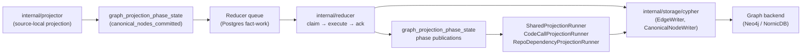
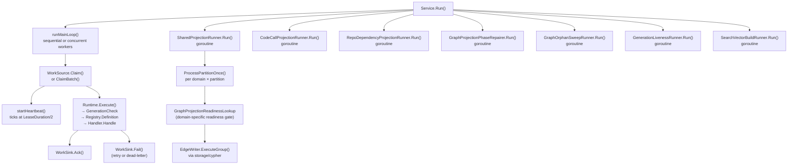

# internal/reducer

`internal/reducer` owns cross-domain materialization, queued repair, and
shared projection that runs after source-local facts have been committed by
the projector. It is the authoritative owner of canonical graph truth for
cross-source and cross-scope domains.
Dependency-neutral domain, intent, result, and handler vocabulary lives in
[`contract`](contract/README.md); root aliases preserve existing imports while
family packages move below the parent without an import cycle. Root domain
constants re-export the contract catalog, including shared-projection names.
`ParseDomain` admits the known reducer validation identifiers, including the
three reserved non-registrable identifiers; shared-projection names remain a
separate catalog.

Reducer changes carry the highest correctness risk in the codebase. Wrong
graph truth, query truth, or deployment truth is a product failure. Track the
full path — raw evidence → admitted candidate → projected row → graph write →
query surface — before changing ordering, admission, retries, or
backend-specific behavior. See CLAUDE.md "Correlation Truth Gates".
Code reachability projection computes a bounded transitive reachable set from
root code entities over `CALLS`, `REFERENCES`, and `INHERITS`, preserving the
weakest provenance method on each path so downstream dead-code reads can use
materialized `code_reachability_rows` without promoting weak guesses to truth.
The runner partitions work by the `(scope_id, generation_id, repository_id)`
conflict key and projects disjoint partitions concurrently (bounded by
`ESHU_REDUCER_WORKERS`, clamped to host CPUs); same-key inputs stay in one
ordered partition so the per-repository DELETE+INSERT replacement never races.
Traversal is bounded by `MaxDepth` and `MaxVisited`; a truncated snapshot is
logged and its omitted entities fall back to the legacy incoming-edge lookup
rather than being asserted dead. See
[dead-code-reachability.md](../query/dead-code-reachability.md) for the
concurrency, bounds, backend-parity, and benchmark/observability evidence.

## Where this fits in the pipeline

```mermaid
flowchart LR
  Projector["internal/projector\n(source-local projection)"] --> ProjPhase["graph_projection_phase_state\n(canonical_nodes_committed)"]
  ProjPhase --> ReducerQ["Reducer queue\n(Postgres fact-work)"]
  ReducerQ --> Reducer["internal/reducer\nclaim → execute → ack"]
  Reducer --> CypherWrite["internal/storage/cypher\n(EdgeWriter, CanonicalNodeWriter)"]
  CypherWrite --> GraphBackend["Graph backend\n(Neo4j / NornicDB)"]
  Reducer --> PhasePublish["graph_projection_phase_state\nphase publications"]
  PhasePublish --> SharedRunners["SharedProjectionRunner\nCodeCallProjectionRunner\nRepoDependencyProjectionRunner"]
  SharedRunners --> CypherWrite
```

## Internal flow

```mermaid
flowchart TB
  Service["Service.Run()"] --> MainLoop["runMainLoop()\nsequential or concurrent workers"]
  MainLoop --> Claim["WorkSource.Claim()\nor ClaimBatch()"]
  Claim --> Heartbeat["startHeartbeat()\nticks at LeaseDuration/2"]
  Claim --> Execute["Runtime.Execute()\n→ GenerationCheck\n→ Registry.Definition\n→ Handler.Handle"]
  Execute --> Ack["WorkSink.Ack()"]
  Execute --> Fail["WorkSink.Fail()\n(retry or dead-letter)"]
  Service --> SPR["SharedProjectionRunner.Run()\ngoroutine"]
  Service --> CCPR["CodeCallProjectionRunner.Run()\ngoroutine"]
  Service --> RDPR["RepoDependencyProjectionRunner.Run()\ngoroutine"]
  Service --> Repair["GraphProjectionPhaseRepairer.Run()\ngoroutine"]
  Service --> Orphans["GraphOrphanSweepRunner.Run()\ngoroutine"]
  Service --> Liveness["GenerationLivenessRunner.Run()\ngoroutine"]
  Service --> SearchVectors["SearchVectorBuildRunner.Run()\ngoroutine"]
  SPR --> ProcessPartition["ProcessPartitionOnce()\nper domain × partition"]
  ProcessPartition --> ReadinessGate["GraphProjectionReadinessLookup\n(domain-specific readiness gate)"]
  ReadinessGate --> EdgeWriter["EdgeWriter.ExecuteGroup()\nvia storage/cypher"]
```

## Package documentation map

This README carries the package overview, the exported surface, dependencies,
and the load-bearing invariants. The reducer accretes one domain per issue, so
the domain-by-domain detail lives in focused sibling docs to keep this file
under the repository's 500-line cap (issue #5786):

- [`domain-catalog.md`](domain-catalog.md) — the full `Domain` constant table
  and the workload signal confidence registry.
- [`recovery-runners.md`](recovery-runners.md) — generation liveness
  recovery, poison dead-letter liveness recovery, the graph orphan sweep, and
  cross-scope node ownership.
- [`cloud-projections.md`](cloud-projections.md) — GCP cloud resource and
  relationship materialization, the secrets/IAM trust-chain read model, and
  the S3/RDS/EC2/PagerDuty projections.
- [`multi-cloud-runtime-drift.md`](multi-cloud-runtime-drift.md) — GCP/Azure
  runtime drift provider partitioning and the read-side AWS aggregation.
- [`search-and-runtime-projections.md`](search-and-runtime-projections.md) —
  the live-workload `RUNS_IMAGE` edge projection and the curated
  `EshuSearchDocument` search read model.
- [`queue-and-runners.md`](queue-and-runners.md) — intent lifecycle, the
  queue claim/execute/ack loop, repo-dependency and graph-projection-phase
  concurrency, and facts-first bootstrap ordering.
- [`telemetry.md`](telemetry.md) — the full span and metric contract.
- [`gotchas-supply-chain-and-vulnerabilities.md`](gotchas-supply-chain-and-vulnerabilities.md) —
  domain-shape, drift, SBOM, supply-chain-impact, suppression, and
  ecosystem-parity invariants.
- [`container-image-identity.md`](container-image-identity.md) — digest-first
  identity admission, logical-key retirement, rolling-upgrade cutover fencing,
  and the `EvidenceAsOf` stale-writer guard.
- [`gotchas-correlation-queue-and-graph-security.md`](gotchas-correlation-queue-and-graph-security.md) —
  service-catalog and observability correlation, Kubernetes correlation,
  queue/generation invariants, code-call edge rules, and the
  security-sensitive SecurityGroup/IAM graph projections.
- [`code-call-materialization.md`](code-call-materialization.md) — the
  `code_call_materialization` resolver contract.
- [`shared-projection.md`](shared-projection.md) — the shared projection
  runner's intent identity and partition config.

Per-issue performance, benchmark, and observability evidence that used to
accumulate in this README now lands in `docs/internal/evidence/` (see
[Related docs](#related-docs)); `scripts/verify-performance-evidence.sh`
accepts markers from that directory as well as from this file.

## Cross-repo call resolver coverage (issue #3487)

`DomainCodeCallMaterialization` resolves a parser-emitted call to a callee entity
through the ordered dispatch in `code_call_materialization_resolution.go`. Beyond
the language-agnostic stages (same-file scope, import binding, repo-unique name),
some languages register a dedicated `before_repo_fallback` resolver
(`code_call_language_*_resolver.go`) that uses parser-emitted receiver-type or
import evidence to bind a confident cross-file/cross-repo edge before the broad
repo-unique-name guess.

A dedicated resolver requires the language's parser to emit the evidence the
resolver consumes: a receiver type (`inferred_obj_type`) and a `class_context` on
the declaration, or structured imports (`source` + `import_type`) that map a
dotted package path to a repository file. Languages whose parser emits only a
bare call `name` cannot be resolved past the shared repo-unique-name fallback
without parser work, so they are documented as such rather than given a resolver
that has nothing to bind.

| Language | Dedicated resolver | Resolution strategy |
| --- | --- | --- |
| go | yes | package-qualified import binding, method-return chain, same-dir, cross-repo export |
| typescript / tsx | yes | interface-implementer method type inference |
| javascript / jsx | yes | receiver-type method inference (shared receiver-method index) |
| swift | yes | receiver-type method inference (shared receiver-method index) |
| java | yes | imported-receiver binding + type inference (shared JVM resolver) |
| kotlin | yes | imported-receiver binding + type inference (shared JVM resolver, `import`/`alias`, `.kt`) |
| dart | yes | import-call binding |
| elixir | yes | alias-call binding |
| groovy | yes | language-specific binding |
| haskell | yes | qualified-import binding |
| perl | yes | imported-receiver path binding |
| python | yes | import-binding guard + repo fallback |
| rust | yes | trait-method binding |
| c | no | parser emits only bare call `name`/`full_name`; no receiver type. Resolves via shared repo-unique-name fallback only. |
| cpp | no | parser emits only bare call `name`/`full_name`; no `inferred_obj_type` on calls. Shared fallback only. |
| csharp | no | parser emits no `inferred_obj_type`; imports lack `source`/`import_type`. Shared fallback only. |
| scala | no | parser emits no `inferred_obj_type`; imports lack `source`/`import_type`. Shared fallback only. |

The four uncovered languages (c, cpp, csharp, scala) are a parser-capability gap,
not a reducer gap: closing them requires the parsers to emit receiver-type
inference and structured imports first. Until then their cross-repo calls fall
back to the shared repo-unique-name match, which only binds when the called name
is unique across the repository.

The swift/javascript/jsx resolvers and the shared receiver-method index add one
map insertion per indexed function during index construction and one O(1) map
lookup per receiver-typed call before the repo-fallback stage; the dispatch order
is otherwise unchanged.

The dedicated-resolver benchmark, the #3624 import-path-cache measurement, and
their observability notes moved to
[`docs/internal/evidence/3487-cross-repo-call-resolver-benchmark-evidence.md`](../../../docs/internal/evidence/3487-cross-repo-call-resolver-benchmark-evidence.md)
(issue #5786). The coverage table above stays in this file:
`go/internal/accuracygate/golden_gate_test.go`
(`TestAccuracyResolverMatrixMatchesPublishedDoc`) reads this file directly and
parses it, so it must resolve at this path.

## Exported surface

Core interfaces:

- `WorkSource`, `Executor`, `WorkSink`, `WorkHeartbeater` — `service.go:22–40`
- `BatchWorkSource`, `BatchWorkSink` — `service.go:43–51`
- `Handler`, `HandlerFunc` — `registry.go:70–78`
- `GraphProjectionPhasePublisher` — `graph_projection_phase.go:117`
- `GraphProjectionPhaseRepairQueue` — `graph_projection_phase_repair.go:36`
- `GraphProjectionPhaseStateLookup` — `graph_projection_phase_repair_runner.go:25`

Exported constants:

- `DefaultSharedProjectionLeaseOwnerPrefix` and
  `DefaultCodeCallProjectionLeaseOwnerPrefix` — the semantic fallback labels
  shared by zero-value runner configs and the production process-unique owner
  loader. Keeping them here prevents the two paths from drifting.
- `RepoRefreshIntentType` — `shared_projection_worker_refresh_fence.go:44` — the
  `intent_type` payload value a repo-wide refresh intent carries. Exported
  because the graph-write side reads it back rather than keeping its own copy:
  `storage/cypher`'s rationale retract selects whole-scope repositories by
  matching it, and a drifted copy there would match nothing, silently stop the
  whole-scope retract, and leave stale EXPLAINS edges with no error and no dead
  letter.
- `RepoWideRetractDomains()` — `shared_projection_worker_refresh_fence.go:100` —
  the sorted set of domains whose retract the per-repo refresh intent owns, read
  from the same map `domainHasRepoWideRetract` uses. Exported for the same
  reason as the constant above: `storage/cypher` keeps its own table splitting
  these domains into the narrowed and un-narrowed halves of the whole-scope
  retract, and a domain fenced here but missing there gets a whole-repository
  DELETE bound to the batch-wide repository list (#6166) with no test iterating
  over it. `TestWholeScopeRetractDomainsCoversFencedSet` compares the two sets.

Key construction functions:

- `NewDefaultRuntime(DefaultHandlers)` — `defaults.go:137` — one-call wiring
  for the standard domain catalog.
- `NewDefaultRegistry(DefaultHandlers)` — `defaults.go:121` — registry only.
- `NewRuntime(Registry)` — `runtime.go:63` — bare runtime over a custom registry.
- `LoadSharedProjectionConfig(getenv)` — `shared_projection_runner.go:476`.
- `BuildSharedProjectionIntent(input)` — `shared_projection.go:53` — stable
  SHA256 intent ID matching the Python implementation.
- `BuildProjectionRows`, `BuildProjectionRowsWithInfrastructurePlatforms` —
  `projection.go:233, 243`.

In-memory runtime types used by focused reducer tests:

- `Runtime` — `runtime.go:55` — bounded in-memory reducer queue over a
  `Registry`.
- `Result`, `RunReport`, `Stats`, and `DomainStats` — `runtime.go:10`,
  `runtime.go:20`, `runtime.go:29`, `runtime.go:40` — terminal execution
  outcome, one-run drain summary, and queue/domain snapshots returned by
  `Runtime.RunOnce` and `Runtime.Stats`.

Domain and intent helpers:

- `ParseDomain(raw)` — `domain.go:24`.
- `IsRetryable(err)` — `intent.go:127`.
- `GraphProjectionPhaseRepairsFromStates` — `graph_projection_phase_repair.go:45`.
- `ExtractOverlayEnvironments` — `projection.go:207` — the four directory-pattern
  regexes (`overlays/<env>/`, `env|environments/<env>/`, `inventory/<env>`,
  `group_vars/<env>`).
- `helmValuesFilenameEnvironment`, `namespaceEnvironment`,
  `collectNamespaceEnvironmentsFromFileData` — `environment_signals.go` —
  broaden `deploymentEnvironments` detection (issue #5444) beyond
  `ExtractOverlayEnvironments`'s directory patterns: the Helm
  `values-<env>.yaml`/`values.<env>.yaml` filename convention, and the
  destination namespace ArgoCD Applications/ApplicationSets
  (`argocd_applications`/`argocd_applicationsets[].dest_namespace`) and
  Kustomize overlays (`kustomize_overlays[].namespace`) already parse but
  `extractOverlayEnvs` (`candidate_loader.go`) never read. Every candidate is
  alias-gated through `environment.IsKnownToken`/`environment.Canonical`
  (`internal/environment`) so an unrecognized namespace or filename suffix
  never invents an environment.
- ArgoCD Application source evidence points from the control repository that
  contains the Application to the deployed repository in `repoURL`.
  Workload-instance materialization reverses that edge when selecting the
  deployed repository, while ApplicationSet deploy-source evidence keeps its
  existing reverse-normalized direction. The committed production/stage
  fixture test proves both canonical environment instances and their
  `INSTANCE_OF` and `DEPLOYMENT_SOURCE` graph writes. This direction correction
  adds no query or loop, and existing workload materialization logs and stats
  remain the operator-facing diagnostic surface.
- `InferWorkloadKind`, `InferWorkloadClassification` — `projection.go:152, 169`.

## Dependencies

- `internal/storage/cypher` — all canonical graph writes; no direct driver calls.
- `internal/relationships` — evidence kinds consumed by cross-repo resolution
  and provisioning evidence classification (`projection.go:544`).
- `internal/telemetry` — spans, metrics, log attributes.
- `internal/truth` — `truth.Contract`, `truth.Layer` for domain registration.
- `internal/storage/postgres` — Postgres-backed implementations of all
  queue and store interfaces; wired in `cmd/reducer`, not here.

## Telemetry

Spans emitted:

- `SpanReducerRun` — wraps each `executeWithTelemetry` call
  (`service.go:308`).
- `SpanCanonicalWrite` — wraps each `processPartitionWithTelemetry`
  call in `SharedProjectionRunner` (`shared_projection_runner.go:284`).

Metrics are prefixed `eshu_dp_` and span every domain: per-intent duration and
status (`reducer_run_duration_seconds`, `reducer_executions_total`), queue
wait and claim timing (`reducer_queue_wait_duration_seconds`,
`queue_claim_duration_seconds`), shared-projection cycle and phase duration
(`shared_projection_cycles_total`, `shared_projection_step_duration_seconds`),
and one bounded-outcome decision counter per correlation/materialization
domain (package source, package-consumption edges, service catalog,
observability coverage, incident routing, Kubernetes correlation, EC2/
Kubernetes node materialization, AWS/multi-cloud runtime drift).

Log phase attributes: `telemetry.PhaseReduction` (main loop),
`telemetry.PhaseShared` (shared projection and repair runner).

See [`telemetry.md`](telemetry.md) for the full per-metric contract,
including which domains are fact-only versus graph-gated and the dimension
values each counter carries.

## Gotchas / invariants

- **This package's tests read shell files outside `go/`** —
  `ifa_family_registry_parse_test.go` resolves
  `scripts/lib/ifa_family_registry/rows/` through `runtime.Caller` and parses
  the committed shell rows, binding each family's declared `blocker_kind` and
  `wait_key` to the real handler's write shape. Renaming or moving that
  directory breaks `go test ./internal/reducer` with an error that names a Go
  package, in a repo where the shell side is owned by a different lane. The
  registry is `scripts/lib/ifa_family_registry.sh`; its schema comment is the
  contract those tests check against.
- **The Ifá contract-layer CI gate runs this WHOLE package** —
  `.github/workflows/static-contract-gates.yml`'s `Verify Ifa contract-layer
  gate` runs `go test ./internal/reducer -count=1` with no `-run` filter (a
  hand-maintained test-name regex went stale twice and silently stopped
  selecting tests that had landed). Any test anywhere in `internal/reducer` can
  now turn that gate red, which is a wider blast radius than the file list in
  its trigger block suggests.
- **All reducer domains must be cross-source, cross-scope, and truth-emitting**
  — enforced by `OwnershipShape.Validate`; domains either write canonical graph
  truth, publish durable reducer facts, or emit bounded counters.
- **Projection must be idempotent** — queue retries, duplicate claims, and
  re-projection across generations must converge on the same graph truth.
- **Generation supersession** — `Runtime.execute` calls `GenerationCheck`
  before dispatching to `Handler.Handle`; a superseded intent returns without
  projecting stale truth.
- **CI/CD generation, git-workflow-evidence and `deployment_mapping`
  invariants live in
  [`gotchas-cicd-and-deployment.md`](gotchas-cicd-and-deployment.md)** — split
  out of this file for the 500-line Markdown cap (#5786; the #6061 restructure
  is what grew it past the cap again).
- **Phase publications and graph writes are not atomic** — if a graph write
  commits but the phase publication fails, `GraphProjectionPhaseRepairQueue`
  captures the retry.
- **Container image identity is digest-first and active-set authoritative** —
  only explicit digests or single-tag-to-digest matches enter a complete,
  immutable digest-v3 support set. Publication atomically moves the scope's
  `active_set_id` after checking the exact claim and activation epoch.
  Reclassification selects a replacement set, demotion selects an explicit
  empty set, and completeness warnings carry only affected prior supports; see
  `container-image-identity.md`.
- **SecurityGroup/IAM graph projections are conservative and security-sensitive**
  — `CAN_ESCALATE_TO` and `CAN_PERFORM` edges are written only for exact,
  unambiguous, non-conditioned grants; see
  `gotchas-correlation-queue-and-graph-security.md`.

See [`gotchas-supply-chain-and-vulnerabilities.md`](gotchas-supply-chain-and-vulnerabilities.md)
for the full domain-shape, drift, container-image, SBOM, supply-chain-impact,
suppression, and ecosystem-parity invariants, and
[`gotchas-correlation-queue-and-graph-security.md`](gotchas-correlation-queue-and-graph-security.md)
for service-catalog/observability correlation, Kubernetes correlation,
queue/generation invariants, code-call edge rules, and the security-sensitive
SecurityGroup/IAM graph projections.

## Where a new helper goes

A generic helper — a payload accessor, a string normalizer, a scope or identity
derivation — belongs in `payloadcore`, not in this directory. "Generic" means it
would still be meaningful with the family whose file it sits in deleted. Adding
one here is how this root regrew: `firstNonBlank`, `boolPayload` and
`ociRepositoryID` spent their lives inside `container_image_identity_registry.go`
while a dozen unrelated families called them, and a filename-based survey could
not see it (#6061).

A handler, writer, lookup or decision is the owning family's product and stays
with the family even when several families read it.

The exception is a symbol with real consumers on BOTH sides of a family
boundary. A family may never import this root, so a shape the root and a family
both need has to live below both: `iampolicy` holds the IAM permission-statement
and grant vocabulary the root's escalation slice shares with the `iamcan`
family, and `cloudjoin` holds the CloudResource join index and node uid the AWS
relationship, security-group, escalation and `iamcan` slices all resolve against
(#6061). Neither is a dumping ground: a helper only one side uses belongs on
that side.

Decode-failure classification and per-fact quarantine belong in `factdecode`.
The per-fact-kind `decode*` seams belong in `schemadecode`: they import the
per-domain `factschema` packages, which `factdecode`'s import budget excludes.
An earlier rule sent each to "the family that owns that kind", but measured, most
have no single owner — the ci.run seams are called from both ci_cd_run
correlation and container-image identity, the codegraph seams from five families
(sql_relationship, codeimportrepo, code_call_materialization, service_catalog,
shell_exec). A seam is named for the fact kind it decodes, not for an owner.

Reading the facts for one scope generation, and classifying whether a failed
read should retry, belong in `factload`. Per-domain fact-kind filtering on top
of that read stays with the calling family. A batched fact write — the row
shape, the statement fragments, chunking, and last-write-wins deduplication by
fact ID — belongs in `factwrite`; a domain's own admission or classification
logic stays with the family even when it calls into `factwrite` to publish.

## Related docs

- `docs/public/architecture.md`
- `docs/public/deployment/service-runtimes.md`
- `docs/public/reference/telemetry/index.md`
- `docs/public/reference/local-testing.md`
- `go/cmd/reducer/README.md`
- `go/internal/projector/README.md` (upstream handoff)
- `go/internal/reducer/code-call-materialization.md`
- `go/internal/reducer/shared-projection.md`
- `go/internal/reducer/payloadcore/README.md`
- `go/internal/reducer/factdecode/README.md`
- `go/internal/reducer/factload/README.md`
- `go/internal/reducer/factwrite/README.md`
- `go/internal/reducer/schemadecode/README.md`
- `go/internal/reducer/packagesourcecore/README.md`
- `go/internal/reducer/cloudjoin/README.md`
- `go/internal/reducer/iampolicy/README.md`
- `go/internal/reducer/iamcan/README.md`
- `go/internal/reducer/codeintel/README.md`
- `go/internal/reducer/secretsiam/README.md`
- `go/internal/reducer/dsl/README.md`
- `go/internal/reducer/tags/README.md`
- `go/internal/reducer/tfstate/README.md`
- `docs/internal/evidence/` — per-issue performance, benchmark, and
  observability evidence records relocated from this README (issue #5786).
