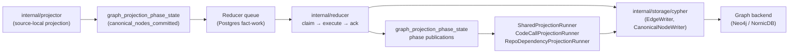
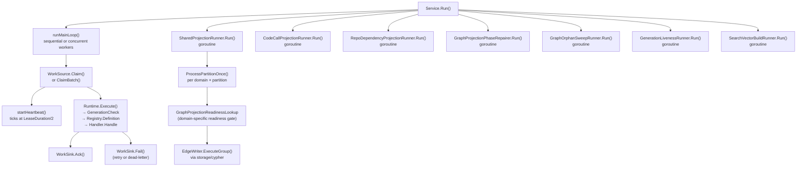

# internal/reducer

`internal/reducer` owns cross-domain materialization, queued repair, and
shared projection that runs after source-local facts have been committed by
the projector. It is the authoritative owner of canonical graph truth for
cross-source and cross-scope domains.

Reducer changes carry the highest correctness risk in the codebase. Wrong
graph truth, query truth, or deployment truth is a product failure. Track the
full path — raw evidence → admitted candidate → projected row → graph write →
query surface — before changing ordering, admission, retries, or
backend-specific behavior. See CLAUDE.md "Correlation Truth Gates".
Code reachability projection computes a bounded transitive reachable set from
root code entities over `CALLS`, `REFERENCES`, and `INHERITS`, preserving the
weakest provenance method on each path so downstream dead-code reads can use
materialized `code_reachability_rows` without promoting weak guesses to truth.
The runner partitions work by the `(scope_id, generation_id, repository_id)`
conflict key and projects disjoint partitions concurrently (bounded by
`ESHU_REDUCER_WORKERS`, clamped to host CPUs); same-key inputs stay in one
ordered partition so the per-repository DELETE+INSERT replacement never races.
Traversal is bounded by `MaxDepth` and `MaxVisited`; a truncated snapshot is
logged and its omitted entities fall back to the legacy incoming-edge lookup
rather than being asserted dead. See
[dead-code-reachability.md](../query/dead-code-reachability.md) for the
concurrency, bounds, backend-parity, and benchmark/observability evidence.

## Where this fits in the pipeline

```mermaid
flowchart LR
  Projector["internal/projector\n(source-local projection)"] --> ProjPhase["graph_projection_phase_state\n(canonical_nodes_committed)"]
  ProjPhase --> ReducerQ["Reducer queue\n(Postgres fact-work)"]
  ReducerQ --> Reducer["internal/reducer\nclaim → execute → ack"]
  Reducer --> CypherWrite["internal/storage/cypher\n(EdgeWriter, CanonicalNodeWriter)"]
  CypherWrite --> GraphBackend["Graph backend\n(Neo4j / NornicDB)"]
  Reducer --> PhasePublish["graph_projection_phase_state\nphase publications"]
  PhasePublish --> SharedRunners["SharedProjectionRunner\nCodeCallProjectionRunner\nRepoDependencyProjectionRunner"]
  SharedRunners --> CypherWrite
```

## Internal flow

```mermaid
flowchart TB
  Service["Service.Run()"] --> MainLoop["runMainLoop()\nsequential or concurrent workers"]
  MainLoop --> Claim["WorkSource.Claim()\nor ClaimBatch()"]
  Claim --> Heartbeat["startHeartbeat()\nticks at LeaseDuration/2"]
  Claim --> Execute["Runtime.Execute()\n→ GenerationCheck\n→ Registry.Definition\n→ Handler.Handle"]
  Execute --> Ack["WorkSink.Ack()"]
  Execute --> Fail["WorkSink.Fail()\n(retry or dead-letter)"]
  Service --> SPR["SharedProjectionRunner.Run()\ngoroutine"]
  Service --> CCPR["CodeCallProjectionRunner.Run()\ngoroutine"]
  Service --> RDPR["RepoDependencyProjectionRunner.Run()\ngoroutine"]
  Service --> Repair["GraphProjectionPhaseRepairer.Run()\ngoroutine"]
  Service --> Orphans["GraphOrphanSweepRunner.Run()\ngoroutine"]
  Service --> Liveness["GenerationLivenessRunner.Run()\ngoroutine"]
  Service --> SearchVectors["SearchVectorBuildRunner.Run()\ngoroutine"]
  SPR --> ProcessPartition["ProcessPartitionOnce()\nper domain × partition"]
  ProcessPartition --> ReadinessGate["GraphProjectionReadinessLookup\n(domain-specific readiness gate)"]
  ReadinessGate --> EdgeWriter["EdgeWriter.ExecuteGroup()\nvia storage/cypher"]
```

## Package documentation map

This README carries the package overview, the exported surface, dependencies,
and the load-bearing invariants. The reducer accretes one domain per issue, so
the domain-by-domain detail lives in focused sibling docs to keep this file
under the repository's 500-line cap (issue #5786):

- [`domain-catalog.md`](domain-catalog.md) — the full `Domain` constant table
  and the workload signal confidence registry.
- [`recovery-runners.md`](recovery-runners.md) — generation liveness
  recovery, poison dead-letter liveness recovery, the graph orphan sweep, and
  cross-scope node ownership.
- [`cloud-projections.md`](cloud-projections.md) — GCP cloud resource and
  relationship materialization, the secrets/IAM trust-chain read model, and
  the S3/RDS/EC2/PagerDuty projections.
- [`multi-cloud-runtime-drift.md`](multi-cloud-runtime-drift.md) — GCP/Azure
  runtime drift provider partitioning and the read-side AWS aggregation.
- [`search-and-runtime-projections.md`](search-and-runtime-projections.md) —
  the live-workload `RUNS_IMAGE` edge projection and the curated
  `EshuSearchDocument` search read model.
- [`queue-and-runners.md`](queue-and-runners.md) — intent lifecycle, the
  queue claim/execute/ack loop, repo-dependency and graph-projection-phase
  concurrency, and facts-first bootstrap ordering.
- [`telemetry.md`](telemetry.md) — the full span and metric contract.
- [`gotchas-supply-chain-and-vulnerabilities.md`](gotchas-supply-chain-and-vulnerabilities.md) —
  domain-shape, drift, SBOM, supply-chain-impact, suppression, and
  ecosystem-parity invariants.
- [`container-image-identity.md`](container-image-identity.md) — digest-first
  identity admission, logical-key retirement, rolling-upgrade cutover fencing,
  and the `EvidenceAsOf` stale-writer guard.
- [`gotchas-correlation-queue-and-graph-security.md`](gotchas-correlation-queue-and-graph-security.md) —
  service-catalog and observability correlation, Kubernetes correlation,
  queue/generation invariants, code-call edge rules, and the
  security-sensitive SecurityGroup/IAM graph projections.
- [`code-call-materialization.md`](code-call-materialization.md) — the
  `code_call_materialization` resolver contract.
- [`shared-projection.md`](shared-projection.md) — the shared projection
  runner's intent identity and partition config.

Per-issue performance, benchmark, and observability evidence that used to
accumulate in this README now lands in `docs/internal/evidence/` (see
[Related docs](#related-docs)); `scripts/verify-performance-evidence.sh`
accepts markers from that directory as well as from this file.

## Cross-repo call resolver coverage (issue #3487)

`DomainCodeCallMaterialization` resolves a parser-emitted call to a callee entity
through the ordered dispatch in `code_call_materialization_resolution.go`. Beyond
the language-agnostic stages (same-file scope, import binding, repo-unique name),
some languages register a dedicated `before_repo_fallback` resolver
(`code_call_language_*_resolver.go`) that uses parser-emitted receiver-type or
import evidence to bind a confident cross-file/cross-repo edge before the broad
repo-unique-name guess.

A dedicated resolver requires the language's parser to emit the evidence the
resolver consumes: a receiver type (`inferred_obj_type`) and a `class_context` on
the declaration, or structured imports (`source` + `import_type`) that map a
dotted package path to a repository file. Languages whose parser emits only a
bare call `name` cannot be resolved past the shared repo-unique-name fallback
without parser work, so they are documented as such rather than given a resolver
that has nothing to bind.

| Language | Dedicated resolver | Resolution strategy |
| --- | --- | --- |
| go | yes | package-qualified import binding, method-return chain, same-dir, cross-repo export |
| typescript / tsx | yes | interface-implementer method type inference |
| javascript / jsx | yes | receiver-type method inference (shared receiver-method index) |
| swift | yes | receiver-type method inference (shared receiver-method index) |
| java | yes | imported-receiver binding + type inference (shared JVM resolver) |
| kotlin | yes | imported-receiver binding + type inference (shared JVM resolver, `import`/`alias`, `.kt`) |
| dart | yes | import-call binding |
| elixir | yes | alias-call binding |
| groovy | yes | language-specific binding |
| haskell | yes | qualified-import binding |
| perl | yes | imported-receiver path binding |
| python | yes | import-binding guard + repo fallback |
| rust | yes | trait-method binding |
| c | no | parser emits only bare call `name`/`full_name`; no receiver type. Resolves via shared repo-unique-name fallback only. |
| cpp | no | parser emits only bare call `name`/`full_name`; no `inferred_obj_type` on calls. Shared fallback only. |
| csharp | no | parser emits no `inferred_obj_type`; imports lack `source`/`import_type`. Shared fallback only. |
| scala | no | parser emits no `inferred_obj_type`; imports lack `source`/`import_type`. Shared fallback only. |

The four uncovered languages (c, cpp, csharp, scala) are a parser-capability gap,
not a reducer gap: closing them requires the parsers to emit receiver-type
inference and structured imports first. Until then their cross-repo calls fall
back to the shared repo-unique-name match, which only binds when the called name
is unique across the repository.

The swift/javascript/jsx resolvers and the shared receiver-method index add one
map insertion per indexed function during index construction and one O(1) map
lookup per receiver-typed call before the repo-fallback stage; the dispatch order
is otherwise unchanged.

- No-Regression Evidence: `BenchmarkExtractCodeCallRowsLargeJavaScriptDynamicCalls`
  (`go test ./internal/reducer/ -bench ... -benchmem`), Go 1.x on darwin/arm64,
  large synthetic JavaScript code-call corpus exercising `ExtractCodeCallRows`
  (full index build + resolution). Baseline at `b491df69` (pre-#3487):
  ~9.9–11.8 ms/op, ~1.66 MB/op, 30206–30211 allocs/op. After this change:
  ~11.2–12.0 ms/op median (5 samples), ~1.65 MB/op, 30207–30209 allocs/op.
  Allocation count and bytes/op are flat (slightly lower); ns/op ranges overlap
  within machine noise on a shared host. The added index is O(functions) to build
  and O(1) per call, so there is no algorithmic regression.
- Observability Evidence: resolution provenance is the operator-facing signal for
  this path. The new swift/javascript/jsx resolvers record
  `codeprovenance.MethodTypeInferred` on resolved edges (and leave the edge
  unresolved, with no provenance, when the receiver type is ambiguous or absent),
  so resolved-vs-unresolved cross-repo calls remain visible through the existing
  `resolution_method` provenance on materialized code-call rows without adding a
  new metric or span.

Performance Evidence: #3624 cached the repository-wide normalized import-path
set once per code-call extraction instead of rebuilding it for every unresolved
JavaScript or Python call. On Linux amd64 with Go 1.26.2, the retained worst-case
scope contained 12,403 input envelopes (one repository and 12,402 files), 46,424
functions, and 1,123,223 generic calls. The completed baseline at `b49d9655d`
spent 3,693.17 seconds in extraction; the prototype based on current-main commit
`35443fd4d` completed the same extraction in 35.02 seconds. The candidate
produced 76,832 rows and 61,603 intents. A comparison against the persisted
baseline intents found zero missing, unexpected, or identity/payload-mismatched
rows. The focused darwin/arm64 benchmark with 5,001 repository paths and 1,000
unresolved calls dropped from 433-459 ms and about 681 MB/op to 7.27-7.66 ms and
about 5.8 MB/op. Classification: handler win. The proof does not claim a new
full-corpus queue-zero time.

No-Observability-Change: the cache changes only in-memory call resolution. The
existing `code call materialization completed` log still reports
`extract_duration_seconds`, `code_call_row_count`, and `intent_row_count`, which
show the handler cost and output cardinality without a new metric, span, label,
queue, or runtime setting.

This section stays in this file rather than moving to
[`domain-catalog.md`](domain-catalog.md): `go/internal/accuracygate/golden_gate_test.go`
(`TestAccuracyResolverMatrixMatchesPublishedDoc`) reads this file directly and
parses the coverage table above, so the table must resolve at this path.

## Exported surface

Core interfaces:

- `WorkSource`, `Executor`, `WorkSink`, `WorkHeartbeater` — `service.go:22–40`
- `BatchWorkSource`, `BatchWorkSink` — `service.go:43–51`
- `Handler`, `HandlerFunc` — `registry.go:70–78`
- `GraphProjectionPhasePublisher` — `graph_projection_phase.go:117`
- `GraphProjectionPhaseRepairQueue` — `graph_projection_phase_repair.go:36`
- `GraphProjectionPhaseStateLookup` — `graph_projection_phase_repair_runner.go:25`

Key construction functions:

- `NewDefaultRuntime(DefaultHandlers)` — `defaults.go:137` — one-call wiring
  for the standard domain catalog.
- `NewDefaultRegistry(DefaultHandlers)` — `defaults.go:121` — registry only.
- `NewRuntime(Registry)` — `runtime.go:63` — bare runtime over a custom registry.
- `LoadSharedProjectionConfig(getenv)` — `shared_projection_runner.go:476`.
- `BuildSharedProjectionIntent(input)` — `shared_projection.go:53` — stable
  SHA256 intent ID matching the Python implementation.
- `BuildProjectionRows`, `BuildProjectionRowsWithInfrastructurePlatforms` —
  `projection.go:233, 243`.

In-memory runtime types used by focused reducer tests:

- `Runtime` — `runtime.go:55` — bounded in-memory reducer queue over a
  `Registry`.
- `Result`, `RunReport`, `Stats`, and `DomainStats` — `runtime.go:10`,
  `runtime.go:20`, `runtime.go:29`, `runtime.go:40` — terminal execution
  outcome, one-run drain summary, and queue/domain snapshots returned by
  `Runtime.RunOnce` and `Runtime.Stats`.

Domain and intent helpers:

- `ParseDomain(raw)` — `domain.go:24`.
- `IsRetryable(err)` — `intent.go:127`.
- `GraphProjectionPhaseRepairsFromStates` — `graph_projection_phase_repair.go:45`.
- `ExtractOverlayEnvironments` — `projection.go:207` — the four directory-pattern
  regexes (`overlays/<env>/`, `env|environments/<env>/`, `inventory/<env>`,
  `group_vars/<env>`).
- `helmValuesFilenameEnvironment`, `namespaceEnvironment`,
  `collectNamespaceEnvironmentsFromFileData` — `environment_signals.go` —
  broaden `deploymentEnvironments` detection (issue #5444) beyond
  `ExtractOverlayEnvironments`'s directory patterns: the Helm
  `values-<env>.yaml`/`values.<env>.yaml` filename convention, and the
  destination namespace ArgoCD Applications/ApplicationSets
  (`argocd_applications`/`argocd_applicationsets[].dest_namespace`) and
  Kustomize overlays (`kustomize_overlays[].namespace`) already parse but
  `extractOverlayEnvs` (`candidate_loader.go`) never read. Every candidate is
  alias-gated through `environment.IsKnownToken`/`environment.Canonical`
  (`internal/environment`) so an unrecognized namespace or filename suffix
  never invents an environment.
- `InferWorkloadKind`, `InferWorkloadClassification` — `projection.go:152, 169`.

## Dependencies

- `internal/storage/cypher` — all canonical graph writes; no direct driver calls.
- `internal/relationships` — evidence kinds consumed by cross-repo resolution
  and provisioning evidence classification (`projection.go:544`).
- `internal/telemetry` — spans, metrics, log attributes.
- `internal/truth` — `truth.Contract`, `truth.Layer` for domain registration.
- `internal/storage/postgres` — Postgres-backed implementations of all
  queue and store interfaces; wired in `cmd/reducer`, not here.

## Telemetry

Spans emitted:

- `SpanReducerRun` — wraps each `executeWithTelemetry` call
  (`service.go:308`).
- `SpanCanonicalWrite` — wraps each `processPartitionWithTelemetry`
  call in `SharedProjectionRunner` (`shared_projection_runner.go:284`).

Metrics are prefixed `eshu_dp_` and span every domain: per-intent duration and
status (`reducer_run_duration_seconds`, `reducer_executions_total`), queue
wait and claim timing (`reducer_queue_wait_duration_seconds`,
`queue_claim_duration_seconds`), shared-projection cycle and phase duration
(`shared_projection_cycles_total`, `shared_projection_step_duration_seconds`),
and one bounded-outcome decision counter per correlation/materialization
domain (package source, package-consumption edges, service catalog,
observability coverage, incident routing, Kubernetes correlation, EC2/
Kubernetes node materialization, AWS/multi-cloud runtime drift).

Log phase attributes: `telemetry.PhaseReduction` (main loop),
`telemetry.PhaseShared` (shared projection and repair runner).

See [`telemetry.md`](telemetry.md) for the full per-metric contract,
including which domains are fact-only versus graph-gated and the dimension
values each counter carries.

## Gotchas / invariants

- **All reducer domains must be cross-source, cross-scope, and truth-emitting**
  — enforced by `OwnershipShape.Validate`; domains either write canonical graph
  truth, publish durable reducer facts, or emit bounded counters.
- **Projection must be idempotent** — queue retries, duplicate claims, and
  re-projection across generations must converge on the same graph truth.
- **Generation supersession** — `Runtime.execute` calls `GenerationCheck`
  before dispatching to `Handler.Handle`; a superseded intent returns without
  projecting stale truth.
- **Artifact-only CI/CD generations are patches** — a generation containing a
  `ci.artifact` but no `ci.run` rebuilds the complete bounded run snapshot from
  the newest older generation containing `ci.run`, then unions exact keys from
  current live artifacts and overlays current-generation control rows. It does not
  depend on an immediately preceding derived snapshot: queue supersession can
  legitimately prevent that snapshot from being published. Rebuilding the
  latest normal run window keeps its unaffected runs visible behind the
  active-generation fence without resurrecting runs that a newer normal window
  omitted. A generation containing any `ci.run` remains a normal full
  replacement. For a
  patched run, current-generation artifacts replace retained artifacts even
  when the current payload has no digest. The latest normal run generation is
  the lower bound for ancillary evidence. A live artifact for an omitted run may
  recover only that run's older `ci.run` anchor; its pre-baseline artifact,
  environment, workflow-image, deployment, trigger, and step evidence stays
  absent. Retained workflow-image evidence reloads by recovered repository and
  keeps the existing exact-commit versus repository-fallback rule inside that
  window. A payload-empty artifact tombstone uses its opaque stable key only to
  remove matching baseline or later evidence. It never seeds a run, and a key
  already absent from the window is a no-op. A valid tombstone is control
  evidence and is not quarantined as a malformed live artifact. Current
  non-artifact facts replace retained history
  only by the exact `(fact kind, stable key)` pair, so workflow-image,
  environment, deployment, trigger, and step tombstones retract their older
  evidence without crossing fact-kind or unrelated-key boundaries. Every valid
  current tombstone is removed before typed classification; a blank identity
  fails the patch closed.
  The reducer result reports every rebuilt decision as `evaluated`; `preserved`
  remains zero because no prior derived decision is copied. Outcome totals
  describe the complete snapshot written for the target generation.
  Deployment events join by commit SHA rather than run key, so the history read
  reloads them after recovering the run and the normal classifier reselects the
  environment. The active container-image loader returns support-grain rows;
  correlation groups rows that agree on the same non-empty digest and image
  reference before deciding cardinality, preserving all support fact IDs. Two
  different image references for one digest remain ambiguous. Evidence IDs on
  unaffected rebuilt decisions are best-effort links to retained superseded
  facts. Each newer full CI/CD run window immediately rebases the patch
  baseline; after retention, an older retained-source link may no longer
  resolve.
- **Git workflow evidence crosses scopes by repository owner** — a normal or
  rebuilt CI run snapshot supplies the distinct typed `repository_id` values.
  Before deriving image references, the handler asks the fact store for active
  Git `ci.workflow_image_evidence` in the matching default and explicit-ref
  scopes. The reducer decodes those rows again and rejects malformed payloads,
  foreign owners, wrong fact kinds, and duplicate fact IDs. The storage read is
  capped and fails closed rather than truncating evidence. Static workflow
  generations and direct workflow-file deletions trigger
  `container_image_identity`; its durable completion event reopens only current
  `ci_cd_run_correlation` work, so Git-before-CI and CI-before-Git activation
  orders converge without serializing either collector.
- **`deployment_mapping` requires post-Phase-3 reopen** — any domain
  consuming `resolved_relationships` needs its own post-Phase-3 reopen
  mechanism (see `queue-and-runners.md`'s Facts-First Bootstrap Ordering).
- **Phase publications and graph writes are not atomic** — if a graph write
  commits but the phase publication fails, `GraphProjectionPhaseRepairQueue`
  captures the retry.
- **Container image identity is digest-first and active-set authoritative** —
  only explicit digests or single-tag-to-digest matches enter a complete,
  immutable digest-v3 support set. Publication atomically moves the scope's
  `active_set_id` after checking the exact claim and activation epoch.
  Reclassification selects a replacement set, demotion selects an explicit
  empty set, and completeness warnings carry only affected prior supports; see
  `container-image-identity.md`.
- **SecurityGroup/IAM graph projections are conservative and security-sensitive**
  — `CAN_ESCALATE_TO` and `CAN_PERFORM` edges are written only for exact,
  unambiguous, non-conditioned grants; see
  `gotchas-correlation-queue-and-graph-security.md`.

See [`gotchas-supply-chain-and-vulnerabilities.md`](gotchas-supply-chain-and-vulnerabilities.md)
for the full domain-shape, drift, container-image, SBOM, supply-chain-impact,
suppression, and ecosystem-parity invariants, and
[`gotchas-correlation-queue-and-graph-security.md`](gotchas-correlation-queue-and-graph-security.md)
for service-catalog/observability correlation, Kubernetes correlation,
queue/generation invariants, code-call edge rules, and the security-sensitive
SecurityGroup/IAM graph projections.

## Related docs

- `docs/public/architecture.md`
- `docs/public/deployment/service-runtimes.md`
- `docs/public/reference/telemetry/index.md`
- `docs/public/reference/local-testing.md`
- `go/cmd/reducer/README.md`
- `go/internal/projector/README.md` (upstream handoff)
- `go/internal/reducer/code-call-materialization.md`
- `go/internal/reducer/shared-projection.md`
- `go/internal/reducer/dsl/README.md`
- `go/internal/reducer/tags/README.md`
- `go/internal/reducer/tfstate/README.md`
- `docs/internal/evidence/` — per-issue performance, benchmark, and
  observability evidence records relocated from this README (issue #5786).
