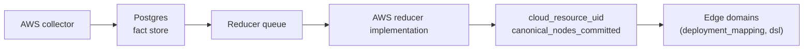

# internal/reducer/aws

`reducer/aws` records the accepted contract for the AWS cloud-resource reducer
family. The package names the projector components and readiness checkpoints
that AWS reducer implementations must publish. No live projection logic exists
here.

## Where this fits in the pipeline

## Purpose

Pin the `RuntimeContract` component list and readiness checkpoints for AWS
canonical projection so contract docs, test fixtures, and reducer wiring share
one source of truth. `DefaultRuntimeContract` and `RuntimeContractTemplate`
return defensive copies, and `RuntimeContract.Validate` rejects blank component
or checkpoint metadata before fixtures accept the contract.

## Ownership boundary

- Owns: the AWS reducer contract (`RuntimeContract`, `PublishedCheckpoint`)
  and its `Validate` shape.
- Does not own: live AWS collection, materialization, or graph writes. None
  of those exist in this package today.

## Exported surface

- `PublishedCheckpoint{Keyspace, Phase}` — `contract.go:13`.
- `RuntimeContract{Components, Checkpoints}` — `contract.go:19`.
- `RuntimeContract.Validate` — `contract.go:52`.
- `DefaultRuntimeContract()` — `contract.go:41` — defensive copy of the
  accepted scaffold.
- `RuntimeContractTemplate()` — `contract.go:48` — alias for
  `DefaultRuntimeContract`; used by contract fixtures.

The accepted contract:

- Components: `resource_projector`, `relationship_projector`,
  `dns_projector`, `image_projector`.
- Checkpoint: `cloud_resource_uid` at `canonical_nodes_committed`.

## Dependencies

- `go/internal/reducer` — `GraphProjectionKeyspace` and
  `GraphProjectionPhase` constants only.

## Telemetry

None. Contract types only; runtime telemetry belongs to the reducer code that
implements these components.

## Gotchas / invariants

- This package does not produce facts, enqueue work, or publish phase rows at
  runtime. Treat it as a contract package, not deployable behavior.
- The single accepted checkpoint is a Phase 1 canonical-nodes publication
  (`canonical_nodes_committed`). Downstream domains that consume
  `resolved_relationships` populated from AWS canonical nodes still require
  the standard post-Phase-3 reopen mechanism described in
  `docs/internal/agent-guide.md`
  "Facts-First Bootstrap Ordering"; that reopen lives outside this package.
- `Validate` enforces non-blank components and checkpoint fields, but does not
  verify that the listed component names correspond to any concrete
  implementation.

## Related docs

- `docs/public/architecture.md`
- `go/internal/reducer/README.md`
- `go/internal/reducer/dsl/README.md`
- `go/internal/reducer/tfstate/README.md`
