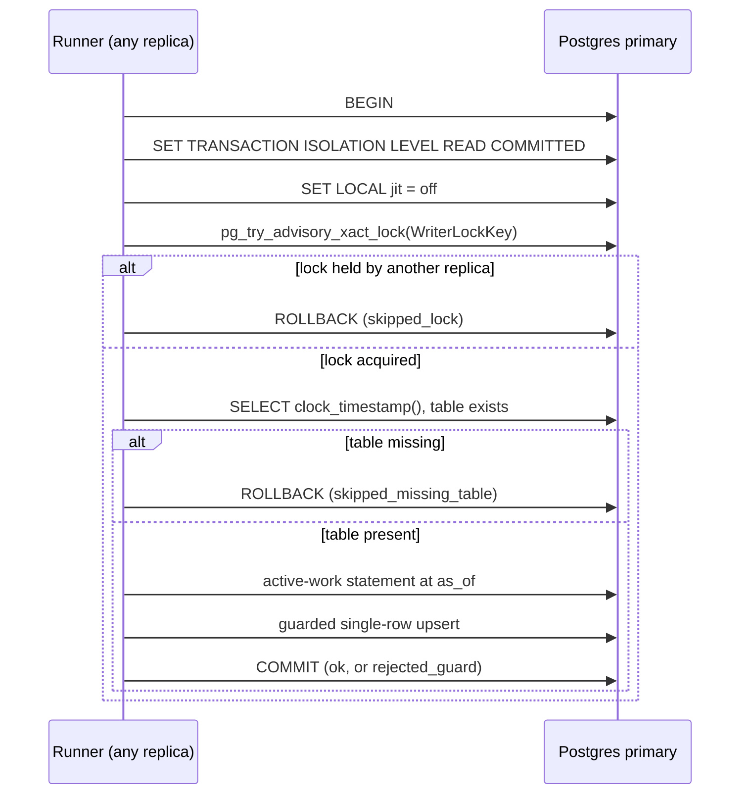

# Status summary writer

## Purpose

This package is the reducer-owned periodic writer of the status summary read
model (#7009). The status routes' active-work statement reads 45k-153k buffers
on a deep backlog. `Runner` runs it on a fixed cadence and stores the whole
result as one row in `status_summary_snapshots`, so a reader can replace the
statement with a single primary-key lookup. The table, row codec, upsert, read,
and advisory lock live in `go/internal/storage/postgres/status/summary`; the
statement and its digest live in `go/internal/storage/postgres`
(`ReadActiveWorkSummaryEntries`, `ActiveWorkSummarySourceSHA256`).

## Where it runs

`go/cmd/reducer/status_summary_wiring.go` builds the runner when
`ESHU_STATUS_SUMMARY_WRITER_ENABLED=true` (default `false`) and sets
`reducer.Service.StatusSummaryWriter`; `Service` starts it beside the other
side runners. With the flag off no runner exists, no goroutine starts, and no
writer SQL runs. `ESHU_STATUS_SUMMARY_WRITER_INTERVAL` sets the cadence
(default `10s`, from the 1.0 s median pass measured on the ops-qa read replica;
minimum `5s`); a value below `5s` or one that does not parse fails reducer
startup.

## One pass

- **as_of** is the database clock read after the lock, so it is monotonic
  across replicas whose host clocks differ.
- **Outcomes** (closed set): `ok`, `skipped_lock`, `skipped_missing_table`,
  `rejected_guard`, `error`.
- **Deadline**: a pass is cancelled after two intervals.
- **Cadence**: the next pass starts on the first interval boundary after the
  previous one ends. Passes never overlap or queue.
- **Errors** are counted and logged with their SQLSTATE; the next tick retries.
  A shutdown mid-pass rolls back and is not counted.

## Concurrency

The writer claims no queue rows and takes no row locks except on its own model
row. Its only shared state is the advisory lock and the one row. Two replicas
cannot compute in the same tick (the lock), an older pass cannot overwrite a
newer row (the strict `as_of` guard), and a killed pass leaves the previous row
whole (single-row upsert in the pass transaction). The live tests prove each
claim, plus zero writer-attributable lock waits beside the production reducer
claim and Ack loop.

## Telemetry

| signal | name |
| --- | --- |
| counter | `eshu_dp_status_summary_writer_passes_total{model_key, outcome}` |
| histogram | `eshu_dp_status_summary_writer_pass_duration_seconds{model_key, outcome}` |
| counter | `eshu_dp_status_summary_writer_overrun_total{model_key}` |
| gauge | `eshu_dp_status_summary_writer_up{model_key}` (1 while the loop runs) |
| span | `reducer.status_summary.pass` with model key, outcome, as_of, pass ms, row count |
| logs | Info at start; Warn per overrun, per guard rejection, and once per process for a missing table; Error with `sqlstate` per failed pass |

The age of the stored row is a reader-side signal and is not exported here.

## Proof

- `runner_test.go`, `cadence_test.go`: hermetic pass order, lock skip, missing
  table, guard rejection, every failure step, deadline, pacing and overruns,
  shutdown, the interval floor, and the metrics.
- `runner_live_test.go`: on PostgreSQL 18, the stored row equals the live
  statement at its `as_of` at several live fractions and when empty, a killed
  pass keeps the old row, guard rejection, missing table, digest replacement,
  a pass pinned to READ COMMITTED under a REPEATABLE READ database
  default, and a second writer skipping while the first holds the lock.
- `contention_live_test.go`: two writers at the 5 s minimum for 30 s beside the
  production claim and Ack loop with a backlog spike. A seeded wait first
  proves the lock sampler can see a writer-caused wait.
- `enrollment_test.go`: hermetic guard that every live proof is selected by
  the blocking gate's `-run` filter and that the gate passes the DSN, the
  disposable opt-in, and the fail-closed switch.

The live tests need `ESHU_STATUS_SUMMARY_PROOF_DSN` and
`ESHU_STATUS_SUMMARY_PROOF_DISPOSABLE=1` (see `fixture_test.go`). They run in
the blocking `reducer-contention-gate` workflow, where
`ESHU_REQUIRE_STATUS_SUMMARY_WRITER_PROOF=1` turns a missing DSN into a
failure, and in the advisory `live-postgres-readiness` job, which the live-test
ledger requires for `postgres_ci` rows.

## Follow-ups

- The age of the stored row is not exported by the writer. A per-process "last
  as_of this process wrote" gauge misfires on replicas that always skip the
  lock, so the reader slices (PR-C, PR-F) own a row-derived age gauge
  (`now() - as_of` of the stored row) and the stale alert.
- Reader staleness: with the 10 s default interval and the 2.09 s replica replay
  lag p95 measured on ops-qa, the ruling's formula `3 x interval + lag p95`
  gives 32.09 s, so the reader's `ESHU_STATUS_SUMMARY_STALE_AFTER` default
  should be at least 33 s.
