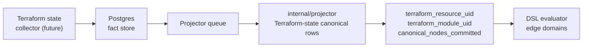

# internal/reducer/tfstate

`reducer/tfstate` records the accepted reducer-facing contract for Terraform
state-derived canonical projection. The package names the projector components
and readiness checkpoints that downstream work depends on. Live source-local
projection now belongs to `internal/projector`, where committed facts are
turned into canonical graph nodes.

## Where this fits in the pipeline

## Purpose

Pin the `RuntimeContract` component list and readiness checkpoints for
Terraform state canonical projection so ADRs, test fixtures, and future
reducer work share one source of truth. The exported helpers return defensive
copies, and `RuntimeContract.Validate` rejects blank contract metadata before
fixtures accept it.

## Ownership boundary

- Owns: the Terraform state reducer-facing contract (`RuntimeContract`,
  `PublishedCheckpoint`) and its `Validate` shape.
- Does not own: live Terraform state collection or graph writes. Source-local
  graph writes live in `internal/projector`; collector parsing lives in
  `internal/collector/terraformstate`.

## Exported surface

- `PublishedCheckpoint{Keyspace, Phase}` — `contract.go:13`.
- `RuntimeContract{Components, Checkpoints}` — `contract.go:20`.
- `RuntimeContract.Validate` — `contract.go:55`.
- `DefaultRuntimeContract()` — `contract.go:43` — defensive copy.
- `RuntimeContractTemplate()` — `contract.go:50` — alias for
  `DefaultRuntimeContract`.

The accepted scaffold:

- Components: `resource_projector`, `module_projector`, `output_projector`.
- Checkpoints:

| Keyspace | Phase |
| --- | --- |
| `terraform_resource_uid` | `canonical_nodes_committed` |
| `terraform_module_uid` | `canonical_nodes_committed` |

## Dependencies

- `go/internal/reducer` — `GraphProjectionKeyspace` and
  `GraphProjectionPhase` constants only.

## Telemetry

None. Runtime telemetry for Terraform-state graph writes follows the projector
canonical-write stage.

## Gotchas / invariants

- This package does not produce facts, enqueue work, or publish phase rows at
  runtime. It records the contract that runtime code must satisfy.
- Both accepted checkpoints are Phase 1 (`canonical_nodes_committed`)
  publications. Downstream domains that consume `resolved_relationships`
  derived from Terraform state canonical rows still require the post-Phase-3
  reopen mechanism described in CLAUDE.md "Facts-First Bootstrap Ordering".
  That reopen lives outside this package.
- `Validate` enforces non-blank components and checkpoint fields; it does
  not check that the listed component names map to any concrete
  implementation.
- `DefaultRuntimeContract` and `RuntimeContractTemplate` both use
  `slices.Clone`; do not take pointers to the internal default and mutate it.

## Related docs

- `docs/docs/architecture.md`
- `go/internal/reducer/README.md`
- `go/internal/reducer/aws/README.md`
- `go/internal/reducer/dsl/README.md`
