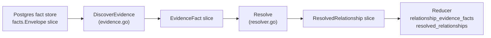
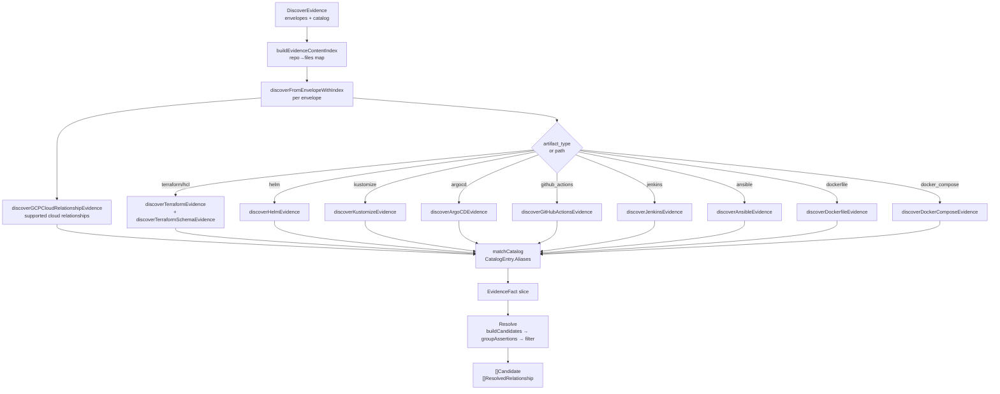

# Relationships

## Purpose

`relationships` extracts IaC and provider relationship evidence from fact
envelopes and resolves that evidence into typed cross-repository relationships
before reducer admission. It covers Terraform, Terraform provider schemas,
Terragrunt, Helm, Kustomize, Argo CD, GitHub Actions, Jenkins, Ansible,
Dockerfile, Docker Compose, and supported GCP cloud relationship signals.

The package describes evidence rather than inventing deployment truth.
Extractors emit `EvidenceFact` values; the `Resolve` function promotes them to
`ResolvedRelationship` values only when confidence meets the threshold and no
rejection assertion exists. Ambiguous signals stay ambiguous until a stronger
contract — such as an explicit `Assertion` — admits them.

## Where this fits in the pipeline

`DiscoverEvidence` and `Resolve` are called from `internal/reducer` during the
relationship evidence domain pass, not from the projector.

## Internal flow

## Lifecycle / workflow

`DiscoverEvidence` receives a slice of `facts.Envelope` values and a
`CatalogEntry` slice that maps repository IDs to known aliases. It calls
`buildEvidenceContentIndex` to build a `map[repoID][]file` index used by
template-driven ArgoCD extractors. It then routes each envelope to one or more
extractors based on `artifact_type` and file path heuristics. Every extractor
calls `matchCatalog`, which uses a per-`DiscoverEvidence` alias index to match
candidate strings against `CatalogEntry.Aliases`. Matching is case-insensitive
and boundary-aware: exact aliases, URL path segments, image path segments before
tag delimiters, and known config-file suffixes match; short aliases do not match
inside larger hyphenated repository slugs. The private Terraform registry
provider alias rule is preserved. A per-call `seen` map deduplicates facts
within a single pass.

GCP cloud relationship evidence is routed before the file/content guard because
`gcp_cloud_relationship` facts are cloud facts, not repository files. The
extractor emits `EvidenceKindGCPCloudRelationship` only for supported provider
relationships whose source and target full resource names each match exactly
one distinct repository in the catalog. Partial, unsupported, ambiguous,
one-sided, or self matches emit no evidence. `gcp_image_reference`,
`gcp_iam_policy_observation`, `gcp_dns_record`, and collection-warning facts
remain owned by their image-identity, secrets/IAM, DNS, or audit paths.

Argo CD Application evidence accepts the legacy singular `source_repo` field and
the positional `source_repos`, `source_paths`, `source_roots`, and
`source_revisions` fields emitted by the YAML parser. Each matched source
repository produces its own `EvidenceKindArgoCDAppSource` fact without shifting
path, root, or revision details across source indexes. The
ApplicationSet extractor keeps generator discovery sources separate from
template deploy sources so the reducer can preserve discovery versus deployment
intent.

Schema-driven Terraform extraction (`discoverTerraformSchemaEvidence`) uses
`RegisterSchemaDrivenTerraformExtractors` to bootstrap extractors from
packaged provider schemas at first call. Each schema-derived extractor runs
`InferIdentityKeys` on the resource attributes to pick a stable candidate name
key, then calls `matchCatalog` with confidence derived from whether a known
identity key was found (`0.78`) or only the resource block name was available
(`0.55`).

`Resolve` groups `EvidenceFact` values into `Candidate` buckets by
`(SourceEntityID, TargetEntityID, RelationshipType)`, applies rejection and
explicit assertion overrides from `Assertion` values, filters by
`confidenceThreshold` (default `DefaultConfidenceThreshold` = 0.75), and
returns both the candidate list and the promoted `ResolvedRelationship` slice.
Inferred candidate confidence starts with the strongest evidence fact, then
adds bounded corroboration from distinct facts in the same bucket. A single
fact stays at its per-fact confidence; corroborating facts are combined with a
missing-probability model and capped to a diminishing share of the remaining
distance to certainty so repeated hints do not fabricate `1.0` confidence.
Explicit `assert` decisions still override inferred confidence to `1.0`, while
`reject` decisions still suppress inferred output.

## Exported surface

- `DiscoverEvidence(envelopes, catalog)` — scan envelopes for IaC evidence;
  returns a deduplicated `[]EvidenceFact` (`evidence.go:18`)
- `Resolve(evidenceFacts, assertions, confidenceThreshold)` — group evidence
  into `[]Candidate`, apply `Assertion` overrides, filter by confidence, and
  return both slices (`resolver.go:62`)
- `DedupeEvidenceFacts(facts)` — collapse exact-duplicate `EvidenceFact`
  values while preserving discovery order (`resolver.go:16`)
- `ResolvedRelationshipID(generationID, r, ordinal)` — build the durable
  Postgres identity for a resolved relationship (`models.go:163`)
- `RegisterSchemaDrivenTerraformExtractors(schemaDir)` — bootstrap schema-
  driven Terraform resource extractors from a provider schema directory;
  returns a `map[string]int` summarizing registered resource types per
  provider (`terraform_schema.go:49`)
- `DefaultConfidenceThreshold` — 0.75; minimum confidence to promote an
  inferred candidate to a resolved relationship (`resolver.go:12`)

### Core types

- `EvidenceFact` — one raw observed signal: `EvidenceKind`, `RelationshipType`,
  `SourceRepoID`, `TargetRepoID`, `Confidence`, `Rationale`, `Details`
  (`models.go:109`)
- `EvidenceKind` — string enum of evidence origins: `EvidenceKindTerraformAppRepo`,
  `EvidenceKindTerraformModuleSource`, `EvidenceKindHelmChart`,
  `EvidenceKindArgoCDAppSource`, `EvidenceKindGitHubActionsReusableWorkflow`,
  `EvidenceKindJenkinsSharedLibrary`, `EvidenceKindAnsibleRoleReference`,
  `EvidenceKindGCPCloudRelationship`, and 20+ others (`models.go:13`)
- `RelationshipType` — string enum of edge semantics: `RelDeploysFrom`,
  `RelUsesModule`, `RelProvisionsDependencyFor`, `RelDiscoversConfigIn`,
  `RelReadsConfigFrom`, `RelRunsOn`, `RelDependsOn` (`models.go:79`)
- `Candidate` — aggregated machine-generated relationship with combined
  `Confidence`, `EvidenceCount`, and merged `Details` (`models.go:134`)
- `ResolvedRelationship` — canonical relationship emitted after resolution;
  carries `ResolutionSource` (`inferred` or `assertion`) (`models.go:147`)
- `Assertion` — explicit human or control-plane override with `Decision`
  `"assert"` or `"reject"` (`models.go:122`)
- `CatalogEntry` — maps one `RepoID` to its `Aliases` slice used by
  `matchCatalog` (`evidence.go:11`)
- `Generation` — lifecycle record for one resolution run (`models.go:171`)

## Dependencies

- `internal/facts` — `facts.Envelope`; the durable fact model this package
  reads. The envelope's `Payload` map carries `artifact_type`, `relative_path`,
  `content`, `repo_id`, `parsed_file_data`, and provider-specific GCP
  relationship fields.
- `internal/terraformschema` — `terraformschema.LoadProviderSchema`,
  `terraformschema.InferIdentityKeys`, `terraformschema.ClassifyResourceCategory`;
  consumed by `RegisterSchemaDrivenTerraformExtractors` and the Terraform
  schema extractor path in `terraform_schema.go`.

Reducer admission lives in `internal/reducer`. This package supplies evidence
and resolved relationships; it never writes to the graph or queue directly.

## Telemetry

This package does not emit its own metrics, spans, or structured logs.
Extraction outcomes are surfaced by the reducer when admitted and by
`internal/storage/postgres` when persisted as evidence rows.

Benchmark Evidence: `BenchmarkMatchCatalogLargeCatalog` on Apple M4 Pro with
about 10k catalog aliases and mixed URL, image, exact, false-positive, and
non-match candidates improved from `17628716 ns/op`, `5123080 B/op`, and
`160030 allocs/op` to `120441-125631 ns/op`, `4400 B/op`, and `101 allocs/op`
after replacing per-candidate catalog scans with the boundary-aware matcher
index.

No-Regression Evidence: resolver confidence aggregation is an in-memory
candidate-bucket calculation. It adds no graph write, queue claim, storage
schema, worker, lease, batch, or reducer scheduling behavior. `Resolve` still
returns the same candidate and resolved relationship shapes, with the existing
`confidence` and `evidence_count` fields carrying the score and support count.

No-Observability-Change: operators already inspect admitted relationship
confidence and evidence count through the reducer/Postgres relationship
evidence path. This package still emits no telemetry directly; diagnosis uses
the existing reducer admission and relationship persistence signals.

## Operational notes

- If relationship evidence is sparse for a repository, check that its
  `CatalogEntry.Aliases` includes the names actually referenced in IaC files
  (repo short name, org/repo form, and any known aliases). `matchCatalog`
  intentionally rejects alias matches embedded inside larger hyphenated slugs;
  add the full target slug as an alias when that longer value is legitimate.
- `RegisterSchemaDrivenTerraformExtractors` is called lazily on first
  `discoverTerraformSchemaEvidence` call. If the schema directory is missing
  or empty, schema-driven extraction silently produces no evidence. Call the
  function explicitly during process startup to surface schema loading errors
  early.
- ArgoCD ApplicationSet template evaluation (`argocd_template_params.go`)
  requires that generator config files exist in the same envelope batch passed
  to `DiscoverEvidence`. Template parameters not present in the content index
  will leave the template unresolved and no evidence will be emitted for those
  dynamic sources.
- GCP cloud relationship evidence depends on catalog aliases for both endpoint
  full resource names. If only the target name matches, or if either endpoint
  matches more than one repository, discovery intentionally emits no evidence.
- Confidence thresholds in `Resolve` are applied to bounded aggregate
  confidence. A single high-confidence signal is still sufficient to promote a
  candidate, and corroborating lower-tier facts can lift a candidate only within
  the cap described above. Exact duplicates should be removed before resolving
  so they do not inflate `EvidenceCount` or confidence.

## Extension points

- **Add a new extractor** — add a new `discover*Evidence` function following
  the existing pattern, wire it into `discoverFromEnvelopeWithIndex` in
  `evidence.go`, add a corresponding `EvidenceKind` constant to `models.go`,
  and add a test file. The extractor must call `matchCatalog` and respect the
  `seen` deduplication map.
- **Add a new relationship type** — add a `RelationshipType` constant to
  `models.go` and use it in the appropriate extractor. Document the admission
  semantics if the reducer needs a new domain for this edge kind.
- **Add a new Terraform resource extractor** — add a provider schema `.json.gz`
  to `internal/terraformschema/schemas/` and regenerate or call
  `RegisterSchemaDrivenTerraformExtractors` with the updated directory.

## Gotchas / invariants

- Extractors must be deterministic over the same input bytes. Repeated runs
  over the same snapshot must produce the same `EvidenceFact` set (`doc.go`).
- `Resolve` groups every evidence fact it receives and deduplicates only the
  resolved output. Call `DedupeEvidenceFacts` or rely on extractor `seen` maps
  before resolving when identical facts can repeat; keep distinct corroborating
  facts so `EvidenceCount` remains truthful.
- `Assertion.Decision` must be exactly `"assert"` or `"reject"`. Values that
  do not match either string are silently ignored by `groupAssertions`.
- Terraform registry sources (three-part `namespace/provider/type` form) are
  explicitly excluded from module-source evidence because they reference a
  public registry module, not a repository alias.
- Terragrunt helper function calls such as `get_repo_root()` and
  `path_relative_to_include()` are stripped by
  `normalizeTerraformEvidencePathExpression` before alias matching. Paths that
  contain unsupported helper expressions produce no evidence.

## Related docs

- `docs/public/architecture.md` — ownership table and pipeline overview
- `docs/public/reference/local-testing.md` — verification gates
- `go/internal/terraformschema/README.md` — provider schema loader details
- `go/internal/iacreachability/README.md` — complement: reachability analysis
