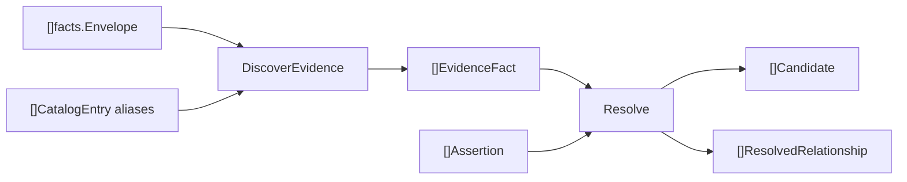

# Relationships

## Purpose

`relationships` extracts deployment and dependency evidence from fact envelopes
before reducer admission. It recognizes Terraform, Terraform provider-schema,
Terragrunt, Helm, Kustomize, Argo CD, GitHub Actions, Jenkins, Ansible,
Dockerfile, and Docker Compose signals.

The package reports evidence. It does not decide graph truth.

## Ownership Boundary

This package owns evidence extraction, evidence deduplication, candidate
building, assertion handling, and confidence-based promotion to
`ResolvedRelationship` values. The reducer owns persistence, admission into
relationship tables, and any later graph materialization.

## Core Flow

`DiscoverEvidence` routes each envelope by artifact type and path, uses catalog
aliases to match referenced repositories, and deduplicates evidence within the
pass. `Resolve` groups evidence by source, target, and relationship type, applies
assertions, and promotes only candidates that meet the confidence threshold.

## Exported Surface

See `doc.go` and `go doc ./internal/relationships` for the full contract. The
durable surface is:

- `DiscoverEvidence`
- `DedupeEvidenceFacts`
- `Resolve`
- `ResolvedRelationshipID`
- `RegisterSchemaDrivenTerraformExtractors`
- model types: `CatalogEntry`, `EvidenceFact`, `Assertion`, `Candidate`,
  `ResolvedRelationship`, `Generation`
- enums: `EvidenceKind`, `RelationshipType`, `ResolutionSource`

## Dependencies

`relationships` reads `facts.Envelope` from `internal/facts` and uses
`internal/terraformschema` for schema-driven Terraform resource extraction. It
does not write Postgres rows, graph nodes, or queue work items directly.

## Telemetry

This package emits no metrics, spans, or structured logs. Reducer and storage
callers surface extraction/admission counts and persistence failures.

## Gotchas / Invariants

- Extractors must be deterministic for the same envelopes, catalog, and schema
  inputs.
- Ambiguous signals stay as low-confidence evidence unless an explicit
  assertion admits them.
- `DefaultConfidenceThreshold` is `0.75`; do not lower it to force graph truth.
- `CatalogEntry.Aliases` should include real repo names and known aliases, but
  overly short aliases can match unrelated text.
- Terraform registry source strings are not repository aliases by themselves.
- Argo CD multi-source applications preserve source/path/root/revision tuple
  alignment by source index.
- ApplicationSet template extraction needs the generator files in the same
  envelope batch.
- `Assertion.Decision` accepts only `assert` and `reject`.

## Focused Tests

- `go test ./internal/relationships -run TestDiscoverEvidence -count=1`
- `go test ./internal/relationships -run TestResolve -count=1`
- `go test ./internal/relationships -run TestDiscoverStructuredArgoCDEvidence -count=1`
- `go test ./internal/relationships -run TestDiscoverDockerComposeEvidence -count=1`
- `go test ./internal/relationships -run TestRelationshipPlatformFixture -count=1`

## Related Docs

- `docs/public/architecture.md`
- `docs/public/reference/local-testing.md`
- `go/internal/terraformschema/README.md`
- `go/internal/iacreachability/README.md`
