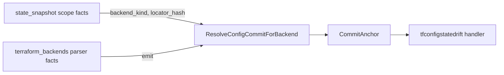

# tfstatebackend

Resolver that joins a Terraform state snapshot to the config repo commit
that declared its backend.

Implements the prerequisite join for chunk #43
(`docs/superpowers/plans/2026-05-10-tfstate-config-state-drift-design.md`).
This is the Phase 0 signature freeze; the canonical-row query lands in
Phase 1.

## Pipeline position

## Exported surface

- `ResolveConfigCommitForBackend(ctx, backendKind, locatorHash)` —
  returns the latest sealed config snapshot owning the backend, or one
  of two typed errors.
- `CommitAnchor` — the resolver output: repo id, scope id, commit hash,
  observed-at timestamp.
- `ErrNoConfigRepoOwnsBackend` — operator-owned state; classifier
  must not run.
- `ErrAmbiguousBackendOwner` — more than one repo claims the join
  key; drift candidate must be rejected as `structural_mismatch`.

## Selection rule

"Latest" = highest `CommitObservedAt`. Ties break by `CommitID`
lexicographic ascending. The rule is deterministic and ADR-able.

## Known limitations (v1)

- Single config repo per `(backend_kind, locator_hash)`. Multi-owner
  resolution is a future ADR.
- No support for state files that were never committed to a repo
  (operator-managed buckets). The resolver returns
  `ErrNoConfigRepoOwnsBackend` in this case.
- No cross-repo dependency resolution (state in repo A, modules in
  repo B). The terraform_backends parser fact must live in the same
  repo as the state.

## Phase 0 status

Stub only. `ResolveConfigCommitForBackend` returns
`ErrNoConfigRepoOwnsBackend` unconditionally. The canonical-row query
against `projector.TerraformBackend` lands in Phase 1 (Agent A).
