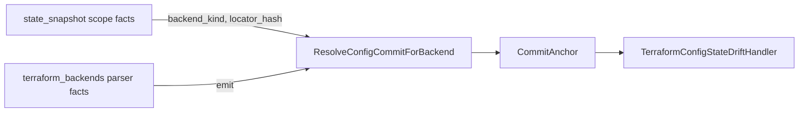

# tfstatebackend

Resolver that joins a Terraform state snapshot to the config repo commit
that declared its backend.

Implements the prerequisite join for chunk #43
(`docs/superpowers/plans/2026-05-10-tfstate-config-state-drift-design.md`).
This is the Phase 0 signature freeze; the canonical-row query lands in
Phase 1.

## Pipeline position

## Exported surface

- `Resolver` (`resolver.go:62`) — holds the canonical-row query port and
  exposes `ResolveConfigCommitForBackend`.
- `NewResolver(query)` (`resolver.go:73`) — constructor; nil query is
  permitted and yields a "no owner" resolver useful before the storage
  adapter is wired.
- `Resolver.ResolveConfigCommitForBackend(ctx, backendKind, locatorHash)`
  (`resolver.go:97`) — returns the latest sealed config snapshot owning
  the backend, or one of two typed errors.
- `ResolveConfigCommitForBackend(ctx, backendKind, locatorHash)`
  (`resolver.go:166`) — deprecated free-function shim that delegates to a
  zero-state Resolver; preserved for Phase 0 callers.
- `TerraformBackendQuery` (`resolver.go:48`) — the narrow port the
  resolver depends on; implementations expose
  `ListTerraformBackendsByLocator`.
- `TerraformBackendRow` (`resolver.go:33`) — one sealed config-side row.
- `CommitAnchor` (`resolver.go:14`) — the resolver output: repo id,
  scope id, commit hash, observed-at timestamp.
- `ErrNoConfigRepoOwnsBackend` (`resolver.go:80`) — operator-owned
  state; classifier must not run.
- `ErrAmbiguousBackendOwner` (`resolver.go:87`) — more than one repo
  claims the join key; drift candidate must be rejected as
  `structural_mismatch`.

## Selection rule

"Latest" = highest `CommitObservedAt`. Ties break by `CommitID`
lexicographic ascending. The rule is deterministic and ADR-able.

## Known limitations (v1)

- Single config repo per `(backend_kind, locator_hash)`. Multi-owner
  resolution is a future ADR.
- No support for state files that were never committed to a repo
  (operator-managed buckets). The resolver returns
  `ErrNoConfigRepoOwnsBackend` in this case.
- No cross-repo dependency resolution (state in repo A, modules in
  repo B). The terraform_backends parser fact must live in the same
  repo as the state.

## Implementation status

Phase 1: the resolver groups, sorts, and selects from the rows returned
by an injected `TerraformBackendQuery`. The query implementation is the
caller's responsibility — the resolver does not own a backend adapter.
Phase 0's free-function `ResolveConfigCommitForBackend` is retained as a
deprecated stub that always returns `ErrNoConfigRepoOwnsBackend`; the
shim is scheduled for removal in the follow-up adapter-wiring chunk and
carries a `TODO(#43-followup):` comment in `resolver.go` documenting
that lifecycle.

The real `TerraformBackendQuery` implementation against the canonical
graph or `projector.TerraformBackend` rows lives outside this package
and is wired by the reducer handler before the drift domain becomes
active in production.
