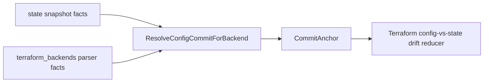

# internal/relationships/tfstatebackend

`tfstatebackend` resolves a Terraform state snapshot to the config repository
commit that declared the matching backend. The drift reducer uses this commit
anchor before comparing Terraform config and Terraform state evidence.

## Runtime Flow



## Core Responsibilities

- Depend on the narrow `TerraformBackendQuery` port.
- Resolve `(backend_kind, locator_hash)` to the latest sealed config snapshot.
- Return typed errors when no owner exists or ownership is ambiguous.
- Keep state-snapshot and config-snapshot scopes separate until the reducer
  builds a drift candidate.

The production query implementation is
`go/internal/storage/postgres/tfstate_backend_canonical.go`, wired into reducer
default handlers by `cmd/reducer/main.go`.

## Selection Rule

The resolver selects the row with the highest `CommitObservedAt`. Ties break by
`CommitID` in lexicographic ascending order. This keeps repeated runs
deterministic for the same fact set.

## Limitations

- Exactly one config repository may own a `(backend_kind, locator_hash)` key.
- Operator-managed state with no matching config backend returns
  `ErrNoConfigRepoOwnsBackend`.
- Ambiguous ownership returns `ErrAmbiguousBackendOwner`; the drift path rejects
  the candidate as a structural mismatch.
- Cross-repo module ownership is not resolved here. The backend fact must live
  in the config repository snapshot that owns the state backend.

## Verification

```bash
go test ./internal/relationships/tfstatebackend -count=1
go test ./internal/correlation/drift/tfconfigstate ./internal/reducer/tfstate -count=1
go run ./cmd/eshu docs verify ../go/internal/relationships/tfstatebackend \
  --limit 1000 --fail-on contradicted,missing_evidence
```

Run the relevant Postgres storage tests when changing the backend query adapter.

## Related Docs

- [Relationships Package](../README.md)
- [Local Testing](../../../../docs/public/reference/local-testing.md)
- [Terraform-State Collector](../../collector/terraformstate/README.md)
