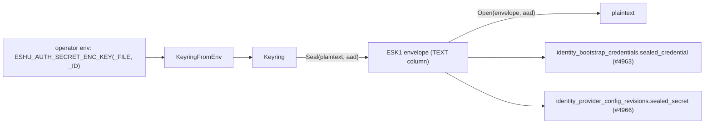

# secretcrypto

## Purpose

`secretcrypto` is the shared at-rest encryption substrate for Eshu's
reversible identity secrets (epic #4962): the one-time admin bootstrap
credential (#4963) and provider-config write-only secrets such as OIDC
client secrets and SAML signing keys (#4966). It is the only place in the
codebase that seals or opens AES-256-GCM envelopes for these secrets; every
consumer imports this package rather than reimplementing the primitive.

Before this package, `go/internal` had no reversible encryption at all.
`bcrypt` (one-way password hashing) and `go/internal/redact` (irreversible
SHA-256/HMAC masking) cover the existing secret-handling surface, but neither
can produce a plaintext back out. secretcrypto fills that gap: secrets that
must be readable again by an authorized process, such as an operator
retrieving a bootstrap password or an OIDC client exchanging a token, rather
than only verified or redacted.

## Where this fits



Callers own the database columns, the AAD construction, and all telemetry.
This package only holds the keyring and the seal/open primitive.

## Exported surface

- `KeyID` — identifies which DEK sealed an envelope; embedded in the envelope
  text so `Open` can resolve the right key without external state.
- `Keyring` — immutable, concurrency-safe holder of one or more 32-byte
  AES-256 DEKs, with one designated primary.
- `NewKeyring(primary KeyID, keys map[KeyID][]byte) (*Keyring, error)` —
  fails closed on any misconfiguration (missing primary, empty keyring, wrong
  key length, a `KeyID` containing `.`).
- `(*Keyring) Seal(plaintext, aad []byte) (string, error)` — encrypts under
  the primary key with a fresh `crypto/rand` nonce and returns the envelope.
- `(*Keyring) Open(envelope string, aad []byte) ([]byte, error)` — decrypts
  and verifies an envelope, or returns `ErrDecrypt`.
- `ErrDecrypt` — the single, opaque error `Open` returns for every failure
  mode.
- `KeyringFromEnv(getenv func(string) string) (*Keyring, error)` — builds a
  single-primary-key `Keyring` from `ESHU_AUTH_SECRET_ENC_KEY(_FILE, _ID)`.
- `ErrKeyNotConfigured` — the error `KeyringFromEnv` returns when no DEK is
  set; callers decide whether that is fatal.

## Envelope format

```
ESK1.<key_id>.<b64url(nonce)>.<b64url(ciphertext||gcm_tag)>
```

- `ESK1` is the scheme and version tag.
- `key_id` records which DEK sealed the envelope. This is the rotation seam:
  `Open` looks the key up by this id rather than always trying the keyring's
  primary, so an old envelope keeps decrypting after a new primary key is
  introduced.
- `nonce` is 12 raw bytes, freshly generated by `crypto/rand` on every
  `Seal` call. It is never derived from the plaintext or reused.
- `ciphertext` is the AES-GCM output, which already has the authentication
  tag appended (Go's `cipher.AEAD.Seal` does this internally), so there is no
  separate tag field to track.
- `nonce` and `ciphertext` use unpadded base64url so the whole envelope is
  safe to store in any `TEXT` column and safe to embed in a URL or JSON
  string without further escaping.

## AAD (additional authenticated data)

AAD is never stored in the envelope. Every caller reconstructs the same
bytes deterministically from the row it is sealing, so a ciphertext copied
into a different row fails to decrypt (a cut-and-paste / confused-deputy
defense):

- One-time admin bootstrap credential (#4963):
  `eshu:onetime-admin:v1|<tenant>|<workspace>`
- Provider config secret (#4966):
  `eshu:provider-secret:v1|<provider_config_id>|<revision_id>`

Passing the wrong AAD to `Open` is indistinguishable from any other
decryption failure: it also returns `ErrDecrypt`.

## Fail-closed contract

- `Open` never returns partial plaintext. Any failure (unrecognized
  `key_id`, GCM tag mismatch, truncated or malformed envelope structure, or
  an AAD mismatch) returns only `ErrDecrypt`. There is no error variant
  that leaks which check failed, so `Open` cannot be used as an oracle to
  narrow down a forged envelope.
- `KeyringFromEnv` never invents a key. If neither
  `ESHU_AUTH_SECRET_ENC_KEY` nor `ESHU_AUTH_SECRET_ENC_KEY_FILE` is set, it
  returns `ErrKeyNotConfigured` rather than generating an ephemeral one. This
  is a deliberate divergence from `runtime.ResolveAPIKey`
  (`go/internal/runtime/api_key.go:66`), which auto-generates an ephemeral
  API bearer token when none is set. That shortcut is safe for a bearer
  token because a fresh one can simply be reissued. It is not safe for a
  DEK: an ephemeral key would make every envelope sealed before the process
  restart permanently undecryptable, since nothing persisted the key that
  sealed them. Whether an absent DEK is fatal at startup is a policy
  decision left to the caller (#4963's bootstrap-credential path only
  requires one when `ESHU_AUTH_BOOTSTRAP_MODE=generated` or an existing
  provider revision has a sealed secret).
- `NewKeyring` rejects a misconfigured keyring outright: a missing primary,
  an empty keyring, a key of the wrong length, or a `KeyID` containing `.`
  (which would make the envelope ambiguous to parse), instead of building a
  keyring that would silently seal or open with the wrong key.

## Key sourcing (`ESHU_AUTH_SECRET_ENC_KEY*`)

| Var | Notes |
|---|---|
| `ESHU_AUTH_SECRET_ENC_KEY` | Base64 of the 32 raw DEK bytes. |
| `ESHU_AUTH_SECRET_ENC_KEY_FILE` | Path to a file holding the same base64 text. Takes precedence over the inline variable when both are set, mirroring `ESHU_AZURE_REDACTION_KEY_FILE`'s file-over-inline precedence (`go/internal/envregistry/entries_collectors.go:119`). |
| `ESHU_AUTH_SECRET_ENC_KEY_ID` | Optional label for the primary key's `KeyID`. Defaults to the first 8 hex characters of SHA-256(key): a fingerprint for operator visibility and rotation bookkeeping, not a secret. |

## Rotation

1. Generate a new 32-byte DEK and add it to the keyring's key set (a new
   entry alongside every still-needed old key).
2. Point the DEK-sourcing configuration's primary at the new key.
3. New `Seal` calls use the new primary; existing envelopes sealed under an
   old key still `Open` because the key id travels with the envelope.
4. Retire an old key only after every envelope it sealed has been re-sealed
   or is no longer needed.

`KeyringFromEnv` currently sources exactly one DEK (the primary). Loading a
multi-key keyring with retired-but-still-openable keys from the environment
is not built yet; call `NewKeyring` directly with the fuller key set when
that is needed.

## What this package does not do

- No database, HTTP, or CLI wiring. Startup wiring belongs to the caller
  (#4963, #4966), not here.
- No telemetry. Counting seal/open operations, successes, and failures is a
  caller concern once this package is wired into a runtime path.
- No KMS integration. The `KeyID -> []byte` indirection in `Keyring` is the
  seam a future KMS-backed key resolver could use without changing the
  envelope format or any caller, but that resolver does not exist yet.

## Dependencies

Standard library only (`crypto/aes`, `crypto/cipher`, `crypto/rand`,
`crypto/sha256`, `encoding/base64`). No internal package imports.

## Telemetry

None. See "What this package does not do" above.
