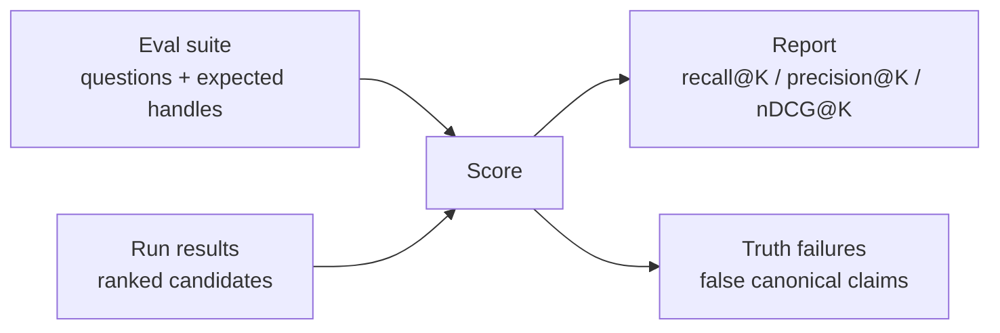

# Semantic Eval

## Purpose

`semanticeval` owns the metric contract for issue #396's semantic retrieval
evaluation. It scores current exact Eshu behavior and future NornicDB-backed
semantic or hybrid retrieval with the same inputs.

The package is pure Go and has no database, graph, HTTP, MCP, or model
dependencies. Callers provide eval cases and ranked result handles.

## Flow

## Invariants

- Eval cases must name at least one required expected handle.
- `false_canonical_claims` increments when a candidate reports `exact` truth
  for a handle whose case only permits a lower maximum truth class.
- Semantic candidates are allowed in results, but they must not masquerade as
  canonical truth.
- The package scores handles only; it does not dereference files, entities, or
  graph relationships.

## Metrics

- `recall_at_k`: required handles found in the first `K` candidates.
- `precision_at_k`: relevant handles found in the first `K` candidates divided
  by `K`.
- `ndcg_at_k`: graded rank quality from expected relevance values.
- `false_canonical_claims`: semantic or stale handles claimed as exact truth.
- `forbidden_hits`: must-not-include handles that appeared in the first `K`.

## Adding Cases

Start with `testdata/suite.json` when shaping a new checked-in case. Keep
questions realistic, but use handles and scopes that are safe for the repository
where the fixture lives. Do not paste private code, raw secrets, customer names,
or unredacted production incident text into eval files.

Each case should include:

- one stable `id`
- the operator or developer `question`
- the narrowest available `scope`
- at least one required `expected` handle
- `must_not_include` handles for common wrong answers when they matter

Use `max_truth` to prevent semantic evidence from being counted as canonical
graph truth. For example, a runbook snippet that helps answer a question should
normally be `semantic_candidate`, not `exact`.

## Related Docs

- `docs/docs/adrs/2026-05-15-nornicdb-semantic-retrieval-evaluation.md`
- `docs/docs/reference/truth-label-protocol.md`
