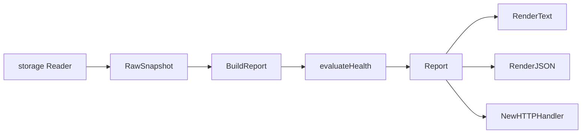

# Status

## Purpose

`status` turns raw runtime counts, queue state, generation lifecycle rows, and
collector status snapshots into one operator-facing report. The CLI, HTTP admin
surface, and runtime status views use this package so operators see the same
health model everywhere.

## Ownership Boundary

This package owns `Reader`, `RawSnapshot`, `Report`, health evaluation,
text/JSON rendering, the `/admin/status` handler adapter, and retry-policy
metadata attachment. It does not own queue persistence, HTTP routing, or metric
emission. Storage packages read the raw rows; `status` projects and renders
them.

## Core Flow

`BuildReport` is pure. Keep I/O in the `Reader` implementation or HTTP handler
and keep derived operator fields in the report projection.

## Exported Surface

See `doc.go` and `go doc ./internal/status` for the full contract. The important
groups are:

- report substrate: `Reader`, `RawSnapshot`, `Options`
- projected output: `Report`, `HealthSummary`, `StageSummary`, `FlowSummary`
- queue and generation views: `QueueSnapshot`, `QueueFailureSnapshot`,
  `DomainBacklog`, `QueueBlockage`, `GenerationHistorySnapshot`,
  `GenerationTransitionSnapshot`
- runtime extensions: `CoordinatorSnapshot`, `RegistryCollectorSnapshot`,
  `AWSCloudScanStatus`, `AWSFreshnessSnapshot`, `TerraformStateReport`
- helpers: `LoadReport`, `BuildReport`, `RenderText`, `RenderJSON`,
  `NewHTTPHandler`, `WithRetryPolicies`, `MergeRetryPolicies`

JSON field names and health state strings are operator contracts.

## Dependencies

`status` imports `internal/buildinfo` for the rendered version string. It does
not import storage or telemetry packages.

## Telemetry

This package emits no metrics or spans. It is itself an operator signal surface.
Queue failure messages, conflict keys, safe locator hashes, and failure details
may appear in status output, but they must not be promoted to metric labels.

## Gotchas / Invariants

- Health priority is `stalled`, then `degraded`, then `progressing`, then
  `healthy`.
- Shared projection backlog is unfinished graph-visible work. Lease-only worker
  activity stays visible without blocking `healthy`.
- `DomainBacklogs` are capped by `Options.DomainLimit` to keep CLI and admin
  output bounded.
- `CoordinatorSnapshot` is optional. Nil means the runtime did not wire the
  coordinator status source.
- AWS cloud status keeps scanner state separate from fact commit state.
- AWS freshness status is aggregate only; resource IDs, ARNs, event IDs, and
  raw payloads stay out of the report.
- Terraform-state status uses safe locator hashes and grouped warning kinds,
  not raw state paths, bucket names, or object keys.

## Focused Tests

- `go test ./internal/status -run TestBuildReport -count=1`
- `go test ./internal/status -run TestRenderJSON -count=1`
- `go test ./internal/status -run TestHTTPHandler -count=1`
- `go test ./internal/status -run TestRenderStatusIncludes -count=1`

## Related Docs

- `docs/public/reference/runtime-admin-api.md`
- `docs/public/reference/cli-reference.md`
- `docs/public/reference/telemetry/index.md`
- `docs/public/architecture.md`
