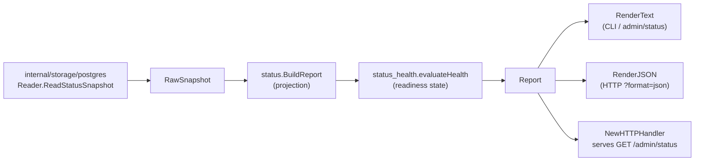

# Status

## Purpose

`status` projects raw Go data-plane runtime counts into operator-facing status
reports. It owns the `Report` type consumed by the CLI, the HTTP admin surface,
and the runtime process-level status view. The package defines the `Reader`
interface that Postgres storage backends implement and provides helpers for
building, health evaluation, rendering, and serving status output in both text
and JSON formats.

## Ownership boundary

This package owns: the `Reader` interface and `RawSnapshot` input type; the
projection from `RawSnapshot` to `Report`; health-state derivation
(`evaluateHealth`); text and JSON rendering (`RenderText`, `RenderJSON`); the
`NewHTTPHandler` adapter for operator admin endpoints; and retry-policy
attachment via `WithRetryPolicies`.

It does not own: queue persistence (that belongs to `internal/storage/postgres`),
metric or span emission (that belongs to `internal/telemetry`), or HTTP routing
(that belongs to `internal/query` and `internal/runtime`).

See `CLAUDE.md` §Preserve Service Boundaries for the project-wide ownership
table.

## Internal flow

## Exported surface

See `doc.go` for the godoc contract. Key types and functions:

### Core report types

- `RawSnapshot` — read-only substrate: scope counts, generation counts, stage
  counts, domain backlogs, queue blockages, retry policies, queue snapshot,
  latest failure metadata, and the optional `CoordinatorSnapshot`
- `Report` — operator-facing projection of `RawSnapshot`; the fields below are
  the stable output surface
- `Reader` — two-method interface that storage implementations satisfy:
  `ReadStatusSnapshot` returns the full snapshot, and
  `ReadStatusSnapshotFiltered(ctx, asOf, SnapshotSelection)` returns a snapshot
  whose optional, expensive sections (collector fact evidence, registry
  collectors — both `fact_records`-derived) are gathered only when the
  `SnapshotSelection` requests them; excluded sections stay at their zero value.
  `ReadStatusSnapshot` is equivalent to `ReadStatusSnapshotFiltered` with
  `FullSnapshotSelection()`, so surfaces that never render those sections (e.g.
  the index status endpoint) skip the full-table aggregates at repository scale

### Snapshot sub-types

- `QueueSnapshot` — aggregate queue pressure: total, outstanding, pending,
  in-flight, retrying, succeeded, failed, dead-letter, oldest outstanding age,
  overdue claims
- `QueueFailureSnapshot` — latest failed work item context (stage, domain,
  failure class, message, details); rendered in status payloads, never in
  metric labels
- `QueueBlockage` — conflict-domain-blocked work: stage, domain, conflict
  domain, conflict key, blocked count, oldest age
- `CollectorGenerationDeadLetterSnapshot` — commit failures that happened
  before projector work items existed, including dead-lettered count,
  unresolved replay-requested count, replay attempts, and oldest dead-letter age
- `DomainBacklog` — backlog depth and active in-flight work for one reducer or
  projection domain
- `ScopeActivitySnapshot` — active, changed, unchanged scope counts for
  incremental-refresh operator view
- `GenerationHistorySnapshot` — active, pending, completed, superseded, failed,
  other generation counts
- `GenerationTransitionSnapshot` — one recent scope-generation lifecycle row
  with trigger kind, freshness hint, and timestamps
- `RetryPolicySummary` — one stage's bounded retry settings (max attempts,
  retry delay)
- `CoordinatorSnapshot` — optional workflow-coordinator state: collector
  instances, run and work-item status counts, completeness counts, active and
  overdue claims, and optional `RecentFailures`
- `CollectorBackpressureSnapshot` — bounded claim-aware collector pressure by
  collector family/instance/source-system tuple: pending, claimed, retrying,
  terminal, expired, active and overdue claims, collector-generation dead
  letters, oldest ages, next retry delay, and aggregate failure-class counts
  without scope ids, source locators, generation ids, payloads, or raw failure
  messages
- `CoordinatorRecentFailures` — failure counts bounded to a recent window
  (failed runs, blocked completeness, terminal work items) that drive the
  degraded health state; cumulative counts stay available as detail
- `CollectorInstanceSummary` — one configured collector runtime instance
- `CollectorRuntimeStatus` — derived coordinator/direct collector runtime
  classification for `coordinator_managed`, `direct_mode`, `disabled`,
  `unregistered`, and explicit `profile_gated` status rows; persisted
  source/reducer fact evidence is reflected as bounded source names and counts
  without payload identifiers
- `CollectorFactEvidence` — aggregate active fact metadata by collector kind,
  optional coordinator instance, evidence source (`source_facts` or
  `reducer_facts`), bounded source systems, count, and timestamps; it never
  carries raw payload, source URI, source record ID, repository name, package
  name, or resource ID
- `RegistryCollectorSnapshot` — bounded OCI and package-registry runtime status
  counts for configured instances, active scopes, recent completed generations,
  last completed timestamp, retryable/terminal failures, and failure classes
  without private registry object names
- `RegistryMetadataTargetCount` — package-registry metadata target counts by
  ecosystem for planned, completed, skipped, stale, failed, and rate-limited
  work. Skipped rows come from stable `package_registry.warning` reason codes
  and do not expose package names, registry URLs, or credential material.
- `AWSCloudScanStatus` — per AWS `(collector_instance_id, account_id, region,
  service_kind)` scanner status, commit status, API call count, throttle count,
  warning count, and budget/credential flags
- `AWSFreshnessSnapshot` — aggregate AWS Config/EventBridge freshness trigger
  status counts and oldest queued age; does not expose resource identifiers
- `VulnerabilitySourceState` — per vulnerability source target checkpoint,
  freshness, retry, result count, warning count, and terminal state; does not
  expose raw advisory payloads, source URLs, package names, or API keys
- `SemanticExtractionStatus` — optional LLM-assisted extraction liveness. The
  zero-key default is `unavailable` with code hints and documentation
  observations disabled; deterministic indexing, reducer projection, API reads,
  MCP tools, and docs verification stay unaffected and healthy.
- `AnswerNarrationStatus` — optional governed answer narration posture. The
  zero-key default is `unavailable` with deterministic answer packets available
  as the canonical fallback; status output is limited to state, reason,
  retention, policy hash, and validator reason-code metadata.
- `TerraformStateLocatorSerial` — most recent observed serial per
  Terraform-state scope, keyed by safe locator hash so the report never carries
  raw bucket names, S3 keys, or local paths
- `TerraformStateLocatorWarning` — recent `terraform_state_warning` fact row,
  bounded per locator or Git backend-source handle by
  `MaxTerraformStateRecentWarnings`; source-level rows may include a
  public-safe `SourceHandle` plus severity/actionability classification. Git
  unresolved-backend warnings use `BackendKind=git` so summaries do not expose
  the unresolved S3 locator that could not be safely formed.
- `TerraformStateWarningSummary` — aggregate warning totals by warning kind,
  reason, public scope class, severity, and actionability for release-gate
  readback
- `TerraformStateReport` — operator-facing tfstate section attached to
  `Report.TerraformState`; carries sorted serial rows, recent warnings, and
  warnings grouped by safe locator hash and warning kind plus a compact warning
  summary

### Freshness drilldown contracts

- `GenerationLifecycleFilter` / `GenerationLifecycleRecord` /
  `GenerationLifecyclePage` — bounded scope-generation drilldown: one ordered,
  limit-clamped page of active/pending/superseded/completed/failed generations
  with the owning scope identity, per-generation `GenerationQueueStatus` rollup,
  and `GenerationLatestFailure`. `HasScopeSelector` drives not-found instead of
  confident emptiness.
- `ChangedSinceFilter` / `ChangedSinceSummary` / `ChangedSinceCategoryDelta` —
  bounded repository-scope changed-since delta: a diff of one prior generation's
  fact set against the current active generation's fact set, grouped into the
  `ChangedSinceCategory` evidence buckets (files, content entities, facts) and
  the closed `ChangedSinceClassification` verdict set (added, updated, unchanged,
  retired, superseded). Counts are exact; `ChangedSinceFilter.Normalize` clamps
  the per-classification sample handles to `MaxChangedSinceSampleLimit`. The
  `Unavailable` flag separates a scope with no current active generation from a
  genuinely empty delta. Service-scope deltas are not modeled here yet.

### Projection functions

- `LoadReport(ctx, reader, asOf, opts)` — reads snapshot through `Reader` and
  calls `BuildReport`
- `BuildReport(raw, opts)` — pure projection; derives scope activity and
  generation history from counts when the storage reader does not populate them
  directly; caps domain backlogs to `Options.DomainLimit` (default 5)
- `DefaultOptions()` — stall threshold 10 minutes, domain limit 5
- `ControlPlane(report)` — pure projection of an already-built `Report` into the
  unified operator read model (`OperatorControlPlane`): queue depth with
  claim-latency and stuck-work signals, reducer-domain backlogs, collector-family
  promotion verdicts with the newest proof artifact, and dead-letter state classed
  by reducer domain and collector-generation commit. Performs no I/O, so the
  `GET /api/v0/status/operator-control-plane` route and `get_operator_control_plane`
  MCP tool add no database or graph cost beyond the shared snapshot read.

  No-Regression Evidence: additive in-memory projection over the existing status
  snapshot; the shared `/api/v0/status/pipeline` read path is unchanged and no new
  DB or graph query is issued. Verified by `go test ./internal/status ./internal/query ./internal/mcp`.
  Observability Evidence: the read model surfaces correlation IDs (`scope_id`,
  `generation_id`, `domain`, `collector_kind`, `failure_class`) that match the
  existing runtime metric and span labels; no new metrics introduced.

### Collector promotion proofs

`CollectorPromotionProofs(report, opts)` projects the runtime collector evidence
into a deterministic, credential-safe **promotion proof** per collector family or
instance. It is the machine-checkable readiness report a reviewer uses to promote
or reject a collector without manually stitching together claim, fact, reducer,
and telemetry state.

The catalog is the spine. `DefaultCollectorCatalog()` is built from
`scope.AllCollectorKinds()`, so every known family yields at least one proof
(a no-instance proof when nothing is configured) and adding a collector to
`scope.AllCollectorKinds()` automatically surfaces a readiness lane — there is no
separate checklist to drift. `KnownCollectorKinds()` exposes the catalog spine as
strings.

Promotion states (closed vocabulary, reused by the readiness read model):

| State | Meaning |
| --- | --- |
| `implemented` | Healthy, fresh evidence that reached reducer readback. The only "ready to promote" state. |
| `partial` | Some evidence, but the implemented contract is not yet met (reducer readback pending, claims inactive, or a fixture-only lane). |
| `failed` | Runtime health degraded (failures, dead-letters, credential/budget). |
| `stale` | Newest evidence older than `CollectorPromotionOptions.StaleAfter`. |
| `gated` | Claim-driven family with claims disabled, or hidden by an active runtime profile gate. |
| `disabled` | Registered family disabled by config or deactivated by reconciliation. |
| `permission_hidden` | Hidden from the caller by an active permission scope; the proof is redacted to instance-free metadata. |
| `unsupported` | Known family with no configured instance and no runtime evidence. |

Precedence is fixed: disabled, then failed, then gated, then stale, then
implemented/partial, so the most actionable blocker is reported first. Each proof
carries the underlying runtime category and health, claim state, reducer readback
availability (`available`/`pending`/`unavailable`), aggregate observation count,
bounded source-system names, shared telemetry handles, and safe blocker strings.
`implemented` requires reducer readback evidence, and a lane marked
`FixtureOnly` is never promoted to implemented — proof automation does not claim
live readiness from fixture-only evidence.

The global `RenderJSON`/`RenderText` surfaces emit promotion proofs only for
collectors that are **present** in the report (`collector_promotion_proofs` is
omitted when none are present). The full-fleet enumeration — including
no-instance and unsupported lanes — is produced by calling
`CollectorPromotionProofs` with the default catalog and is exposed through the
dedicated collector-readiness read model.

`No-Regression Evidence:` `CollectorPromotionProofs` is a pure in-memory
projection over `CollectorRuntimeStatuses(report)` (O(collectors)); it performs
no I/O, no graph or Cypher access, and runs only inside the already-bounded
status render. Covered by `go test ./internal/status ./internal/scope -count=1`.
`No-Observability-Change:` reuses the existing `/admin/status` text/JSON signal;
adds no metrics, spans, or logs.

### Health states

`evaluateHealth` maps queue and generation state to one of four operator-visible
states (in priority order):

| State | Condition |
| --- | --- |
| `stalled` | Overdue claims, or outstanding backlog with no in-flight work past `StallAfter` |
| `degraded` | Dead-letter items, unresolved collector generation dead letters or replay requests, failed items, failed generations, or recent workflow-coordinator failures present. Coordinator failures use `RecentFailures` (a bounded window) when known so aged all-time failures no longer keep the state degraded; absent a window, cumulative coordinator counts apply |
| `progressing` | Work queued, in flight, pending generation work, or outstanding shared projection intents with active partition leases or still below `StallAfter` |
| `healthy` | No outstanding queue backlog or shared projection backlog |

### Rendering and serving

- `RenderText(report)` — compact multi-line text for CLI and plain-text admin
  endpoints; includes health, queue, retry policies, collector generation
  dead-letter state, scope activity, generation history, stage summaries,
  domain backlogs, queue blockages, coordinator state, collector backpressure,
  derived collector runtime classification, collector promotion proofs for
  present collectors, registry collector state, AWS cloud scan state, AWS
  freshness backlog state, semantic extraction status with redacted provider
  profile rows, answer narration fallback status, and flow lanes
- `RenderJSON(report)` — stable JSON payload for machine-readable consumption;
  field names are part of the operator contract
- `NewHTTPHandler(reader, opts)` — returns an `http.Handler` that serves `GET`
  and `HEAD`; accepts `?format=text` or `?format=json`, defaults to text for
  plain requests and JSON when `Accept: application/json` is set

### Retry policy helpers

- `DefaultRetryPolicies()` — projector and reducer defaults (3 attempts, 30 s
  delay)
- `WithRetryPolicies(reader, policies...)` — decorator that attaches static
  retry metadata to any `Reader` without Postgres persistence
- `WithSemanticProviderProfiles(reader, profiles...)` — decorator that attaches
  static, redacted semantic provider profile metadata without loading
  credentials or persisting profile handles
- `MergeRetryPolicies(base, overrides...)` — merges policy sets keyed by stage,
  later entries win

### Flow lanes

`FlowSummary` describes three operator-facing lanes in the report: `collector`,
`projector`, and `reducer`. Each lane carries a `Lane`, `Source`, `Progress`,
and `Backlog` field that together give a quick one-line read on each component.

## Dependencies

- `internal/buildinfo` — `AppVersion()` for the version field in rendered output
- `internal/tfstatewarning` — closed Terraform-state warning
  severity/actionability classification shared with collector emission

This package does not import `internal/telemetry`, `internal/storage`, or any
HTTP routing packages. It is imported by `internal/query`, `internal/runtime`,
and the CLI.

## Telemetry

This package emits no metrics or spans. It is itself an operator-facing signal
surface. The `QueueFailureSnapshot` values it carries come from the queue-failure
records that `internal/storage/postgres` reads; those values must not be
promoted to metric labels because they carry high-cardinality message and details
strings.
Collector generation dead-letter state is a status surface only. Runtime
metrics derive aggregate gauges from it; failure messages and payload references
stay out of metric labels.

No-Regression Evidence: `go test ./internal/status ./internal/storage/postgres
-run 'Test(RenderStatusIncludesCollectorBackpressure|ReadWorkflowCollectorBackpressureStatus|ReadCoordinatorSnapshotIncludesCollectorBackpressure|ReadCoordinatorSnapshotHandlesNullableDeactivatedAtAndCreatedAtBacklogFallback|ReadCoordinatorSnapshotClampsNegativeOldestPendingAge)'
-count=1` proves `/admin/status` text and JSON render bounded
`coordinator.collector_backpressure` rows, the Postgres status reader wires the
rows into the coordinator snapshot, workflow retry/terminal/expired counts come
from `workflow_work_items`, collector-generation dead letters come from
`collector_generation_dead_letters`, and the SQL omits scope ids, source-run
ids, generation ids, acceptance-unit ids, payloads, and raw failure messages.
Input shape: one collector family/instance/source-system row with pending,
claimed, retrying, terminal, expired, active-claim, overdue-claim, and
dead-letter counts. Backend: Postgres status read path with no queue mutation.

No-Observability-Change: collector backpressure is an additive status projection
only. It adds no route, worker, queue mutation, lease mutation, runtime knob,
metric name, metric label, span name, log field, or high-cardinality telemetry
value. Operators diagnose provider throttling, retry storms, terminal collector
failures, expired claims, and recovery pressure through the existing
`/admin/status` text/JSON surface plus existing `workflow_work_items`,
`workflow_claims`, `collector_generation_dead_letters`, Postgres query spans,
and `eshu_dp_postgres_query_duration_seconds`.

## Gotchas / invariants

- **JSON shapes are operator contract.** Every exported JSON field name is
  consumed by operators and automation. Changes require coordination with the
  CLI reference doc (`docs/public/reference/cli-reference.md`) and the HTTP API
  doc (`docs/public/reference/http-api.md`).
- **`QueueFailureSnapshot` must not appear in metrics.** Its fields (`FailureMessage`,
  `FailureDetails`) can be multi-hundred-character strings from graph backend
  errors. They are bounded to 240 characters in text rendering but are never
  used as metric label values.
- **`CoordinatorSnapshot` is optional.** When the workflow coordinator is not
  wired, `RawSnapshot.Coordinator` is nil and `Report.Coordinator` is nil.
  Callers must nil-check before rendering coordinator lines.
- **Collector runtime classification is derived.** `CollectorRuntimeStatuses`
  uses coordinator rows, durable direct status rows already present in the
  report, and bounded active fact metadata. It does not call Kubernetes, Docker,
  or another deployment inventory API, so a pod with no coordinator row, no
  durable status row, and no active persisted facts remains outside the central
  status contract.
- **Source systems are source identities, not collector kinds.** Direct-source
  collectors such as Confluence can emit `collector_kind=documentation` facts
  with `source_systems=["confluence"]`. Status keeps both values so the fact
  model stays source-neutral while operators can still see which documentation
  source is active. Git repository-ingestion facts are included in the same
  persisted source-fact evidence path so repository observations do not appear
  as zero when repository readbacks are populated.
- **AWS cloud status separates scan and commit.** `AWSCloudScanStatus.Status`
  describes scanner-side outcome such as `partial`, `credential_failed`, or
  `failed`; `CommitStatus` describes whether the fenced fact transaction later
  committed. A row with scanner status `succeeded` and commit status
  `committed` is healthy even if older retry metadata is still present; current
  degraded rows must expose the AWS scan-status evidence source and bounded
  failure reason in `CollectorRuntimeStatus.Detail`.
- **AWS freshness status is aggregate only.** `AWSFreshnessSnapshot` shows
  queued, claimed, handed-off, and failed trigger counts plus oldest queued age.
  Resource IDs, ARNs, event IDs, and raw payloads stay out of the status
  contract.
- **Package-registry metadata status is aggregate only.** `metadata_targets`
  groups package-registry work and warning facts by ecosystem. It reports
  planned, completed, skipped, stale, failed, and rate-limited counts without
  package names, private registry URLs, metadata URLs, or credentials.
- **`BuildReport` is a pure function.** It can be called in tests without any
  storage dependency. Use it to unit-test health logic, flow summaries, and
  domain backlog ordering.
- **Shared projection work blocks healthy.** Once the fact queue is drained,
  outstanding `DomainBacklog` rows represent shared projection intents that still
  need to become graph-visible. Active shared-projection partition leases count
  as `DomainBacklog.InFlight`, but a lease-only row with zero outstanding
  intents is worker activity rather than unfinished graph work, so it remains
  visible without blocking `healthy`.
- **`DomainBacklogs` are capped.** `BuildReport` applies `topDomainBacklogs`
  with `Options.DomainLimit` (default 5) to prevent unbounded output when the
  reducer has many domains.
- **`QueueBlockage` rows use `ConflictKey` for prerequisite diagnostics.**
  Postgres status reads may emit one row per missing prerequisite keyspace, but
  `Blocked` is the distinct work-item count for the domain so aggregate status
  buckets do not double-count a row that waits on multiple prerequisites. The
  `ConflictKey` field is surfaced in text and JSON but must not be added as a
  metric label.
- **`RetryPolicySummary` is normalized.** Both `cloneRetryPolicies` and
  `MergeRetryPolicies` deduplicate by stage and sort alphabetically before
  returning. Do not rely on insertion order.
- **Terraform-state warning summaries are public-safe.** Use
  `TerraformStateReport.WarningSummary` for release-gate or public API readback.
  Raw warning rows carry safe locator hashes or Git source handles and source
  strings and belong only in bounded admin status, not broad public gate output.
- **`evaluateHealth` returns `stalled` before `degraded`.** Overdue claims and
  stalled queues take priority over dead-letter state in the health verdict.

## Related docs

- `docs/public/reference/cli-reference.md` — status CLI surfaces such as
  `eshu index-status` and API-backed admin reads
- `docs/public/reference/http-api/status-admin.md` — `/admin/status` endpoint shape
- `docs/public/reference/telemetry/index.md` — health vs completeness signal guidance
- `docs/public/architecture.md` — pipeline and ownership table
