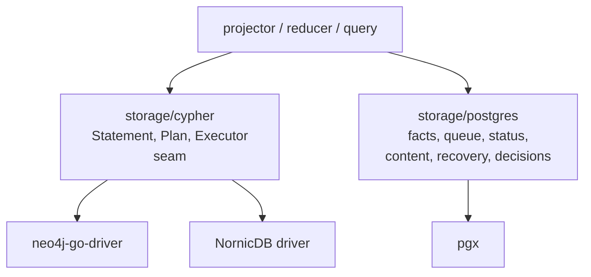

# Storage

`storage` contains the concrete persistence adapters for Eshu. This directory
is a navigation root, not a Go package. Each child package owns `README.md`,
`doc.go`, and scoped `AGENTS.md` so humans and coding agents get the same
package boundary before editing storage code.

Postgres stores facts, queue state, content, status, and recovery data.
The Cypher subpackage defines backend-neutral graph write contracts behind
the `Executor` seam. Neo4j and NornicDB compatibility must stay behind that
seam and documented dialect adapters.

## Layout

| Subdirectory | Owns |
| --- | --- |
| `cypher/` | Backend-neutral Cypher write contracts, `Executor` seam, canonical writers, statement builders, instrumentation |
| `postgres/` | Facts, queue, status, content, recovery, decisions — all Postgres-backed durable state |
| `neo4j/` | Neo4j-specific driver adapter (currently a thin stub; the active driver path lives in caller-side wiring) |

## Per-package documentation convention

Every Go package directory under `go/internal/storage/` carries `doc.go`,
`README.md`, and `AGENTS.md`. Open the child READMEs for flow diagrams and
operational notes; open child `AGENTS.md` files for scoped editing rules,
read-first docs, and proof gates.

## Dependencies

This directory has no Go source of its own. Per-adapter dependencies are
documented in `storage/cypher/README.md`, `storage/postgres/README.md`,
and `storage/neo4j/README.md`.

## Telemetry

Adapter-specific telemetry is documented in each subpackage README. The
shared contract lives in `internal/telemetry`.

## Related docs

- `docs/public/architecture.md`
- `docs/public/reference/nornicdb-tuning.md`
- `docs/public/reference/nornicdb-pitfalls.md`
