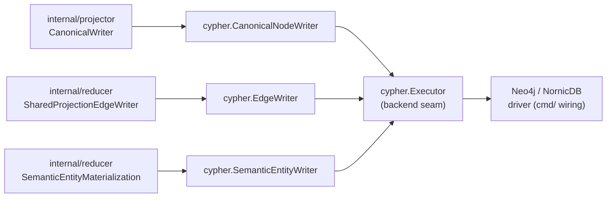
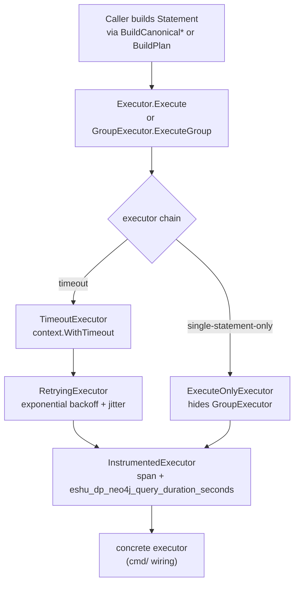

# storage/cypher

`storage/cypher` owns backend-neutral Cypher write contracts, canonical writers,
edge helpers, statement metadata, retry/timeout wrappers, and write
instrumentation for Eshu's canonical graph. Every write path that touches the
graph backend goes through this package.

## Where this fits in the pipeline

## Internal flow

## Lifecycle / workflow

Callers build `Statement` values via statement builder functions
(`BuildCanonicalWorkloadUpsert` and related, `BuildRetractRepoDependencyEdges` and
related, `BuildPlan`) and pass them to a writer
(`CanonicalNodeWriter`, `EdgeWriter`, `SemanticEntityWriter`) or directly to
an `Executor`.

`CanonicalNodeWriter.Write` executes all canonical writes in named phases:
`retract`, `repository_cleanup`, `repository`, `directories`, `files`,
`entities`, `entity_retract`, `entity_containment`, `terraform_state`,
`oci_registry`, `modules`, and `structural_edges`. When the executor
implements `GroupExecutor`, all phases are sent in a single atomic transaction.
When it implements
`PhaseGroupExecutor`, each phase executes as a bounded group. Otherwise phases
run sequentially.

The `repository_cleanup` phase is the only replacement barrier left in the
canonical node path. Directory rows use depth-ordered `MERGE` after the
repository is present. File rows update current nodes in place with
`MATCH (f:File {path: row.path})`, then send only missing rows through a
`WHERE NOT EXISTS { MATCH (:File {path: row.path}) }` guard before `MERGE`.
Nested files require a parent `Directory` match for the directory containment
edge. Repository-root files use a separate Repository-contained statement shape
so package entrypoint files can materialize without inventing a root
`Directory`. This avoids NornicDB's expensive `DETACH DELETE` cost for current
directories or files. Entity property filtering also keeps high-volume analysis
metadata such as `dead_code_root_kinds` and `exactness_blockers` out of
canonical graph rows; the dead-code API merges that evidence from the content
store by entity ID.

Terraform-state rows are written as `TerraformResource`, `TerraformModule`, and
`TerraformOutput` nodes keyed by `uid`. The rows keep lineage, serial, provider
binding, tag-key hashes, and hashed correlation anchors on the node without
creating cloud-resource joins. Those joins are reducer work after the
Terraform-state readiness checkpoints exist.

OCI registry rows are written as `OciRegistryRepository`,
`ContainerImage`/`OciImageManifest`, `ContainerImageIndex`/`OciImageIndex`,
`ContainerImageDescriptor`/`OciImageDescriptor`,
`ContainerImageTagObservation`/`OciImageTagObservation`, and
`OciImageReferrer` nodes keyed by `uid`. Manifests, indexes, and descriptors
use digest-backed descriptor identity; tag observations keep
`identity_strength=weak_tag` and point at a resolved digest without making the
tag the stable image key.

`EdgeWriter.WriteEdges` maps a `reducer.Domain` to a batched UNWIND Cypher
template and dispatches rows in batches of `BatchSize` (default
`DefaultBatchSize` = 500). Domain-specific sub-batch sizes are available for
`DomainCodeCalls`, `DomainInheritanceEdges`, and `DomainSQLRelationships`.
`DomainCodeCalls` writes direct call evidence as `CALLS`, JSX component plus Go
and TypeScript type-reference evidence as `REFERENCES`, and Python metaclass
evidence as `USES_METACLASS`. When reducer rows include
`caller_entity_type` and `callee_entity_type`, code-call and code-reference
writes use the exact endpoint label plus `uid`; incomplete legacy rows still
use the label-family fallback.
`DomainSQLRelationships` writes SQL table, column, view, function, index, and
trigger evidence with label-scoped endpoints. Trigger rows can emit both
`TRIGGERS` to a `SqlTable` and `EXECUTES` to a `SqlFunction`; the latter is
part of dead-code reachability for stored routines and must stay in the
relationship retraction set.

The executor chain is composed in `cmd/` wiring. A typical production chain
wraps a concrete driver executor with `TimeoutExecutor` → `RetryingExecutor` →
`InstrumentedExecutor`.

`RetryingExecutor` detects transient Neo4j errors (deadlock, lock timeout) and
NornicDB MERGE unique conflicts and retries with exponential backoff and jitter.
It does not retry the group path because `session.ExecuteWrite` already handles
that internally.

## Exported surface

**Core types**

- `Statement` — one executable Cypher statement: `Operation`, `Cypher`,
  `Parameters`
- `Plan` — deterministic write plan for one source-local materialization; built
  by `BuildPlan`
- `Operation` — string constant for write type; defined variants:
  `OperationUpsertNode`, `OperationDeleteNode`, `OperationCanonicalUpsert`
- `Executor` — the backend seam: `Execute(ctx, Statement) error`; every
  concrete backend implements this
- `GroupExecutor` — extension of `Executor` for atomic multi-statement writes
- `PhaseGroupExecutor` — extension for bounded phase-grouped writes
- `Adapter` — source-local record writer that builds and executes a `Plan`

**Executor wrappers** (composable chain links)

- `InstrumentedExecutor` — wraps `Executor` with OTEL span and
  `eshu_dp_neo4j_query_duration_seconds` histogram
- `RetryingExecutor` — wraps `Executor` with exponential backoff/jitter for
  transient Neo4j and NornicDB errors
- `TimeoutExecutor` — bounds individual statements with a child context;
  returns `GraphWriteTimeoutError` on deadline
- `ExecuteOnlyExecutor` — hides `GroupExecutor` from callers that must not use
  large atomic groups

**Canonical writers**

- `CanonicalNodeWriter` — writes `projector.CanonicalMaterialization` in strict
  phase order; constructed with `NewCanonicalNodeWriter`; configure per-label
  batch sizes via `WithEntityLabelBatchSize` and containment mode via
  `WithEntityContainmentInEntityUpsert`
- `EdgeWriter` — writes shared-domain edge rows for
  `reducer.SharedProjectionEdgeWriter`; constructed with `NewEdgeWriter`
- `SemanticEntityWriter` — writes semantic entity (Annotation, Module, etc.)
  nodes; five constructors select the Cypher row shape

**Statement builders**

- `BuildPlan(materialization)` — converts a `graph.Materialization` to a
  source-local `Plan`
- `BuildCanonical*Upsert` functions — construct `Statement` values for canonical
  domain nodes: `BuildCanonicalWorkloadUpsert`,
  `BuildCanonicalWorkloadInstanceUpsert`, `BuildCanonicalRuntimePlatformUpsert`,
  `BuildCanonicalInfrastructurePlatformUpsert`,
  `BuildCanonicalDeploymentSourceUpsert`, `BuildCanonicalRepoDependencyUpsert`,
  `BuildCanonicalWorkloadDependencyUpsert`, `BuildCanonicalCodeCallUpsert`,
  `BuildCanonicalRepoRelationshipUpsert`, `BuildCanonicalRunsOnUpsert`
- Statement retraction builders — produce edge and node retraction statements:
  `BuildRetractInfrastructurePlatformEdges`, `BuildRetractRepoDependencyEdges`,
  `BuildRetractWorkloadDependencyEdges`, `BuildRetractCodeCallEdges`,
  `BuildRetractInheritanceEdges`, `BuildRetractSQLRelationshipEdges`,
  `BuildRetractSQLRelationshipEdgeStatements`, `BuildDeleteOrphanPlatformNodes`

**Read / check**

- `CypherReader` — interface for read-only existence queries
- `CanonicalNodeChecker` — short-circuit guard built from `CypherReader`;
  `HasCanonicalCodeTargets` avoids expensive label-free MATCH scans when no
  canonical code nodes exist

**Errors**

- `GraphWriteTimeoutError` — emitted by `TimeoutExecutor`; implements
  `Retryable() bool` and `FailureClass() string`
- `WrapRetryableNeo4jError(err)` — wraps transient errors for the edge writer

## Dependencies

- `internal/graph` — `graph.Materialization`, `graph.Record`, `graph.Result`
  for source-local plan building
- `internal/projector` — `projector.CanonicalMaterialization` and row types
  consumed by `CanonicalNodeWriter`
- `internal/reducer` — `reducer.Domain` constants and
  `reducer.SharedProjectionIntentRow` consumed by `EdgeWriter`
- `internal/telemetry` — `telemetry.Instruments`, span and attribute helpers

Concrete Neo4j/NornicDB driver adapters live in `cmd/` wiring packages, not in
this package. This package owns the backend-neutral writer contracts; `cmd/`
owns the wiring. NornicDB owns the promoted runtime path. Any additional
Cypher/Bolt backend must run these shared statements or use a small, documented
adapter seam.

## Telemetry

- `eshu_dp_neo4j_query_duration_seconds` — histogram per statement;
  `operation=write` or `operation=write_group`
- `eshu_dp_neo4j_batch_size` — batch row count per `UNWIND` statement; grouped
  Neo4j/Bolt execution records one point per statement with bounded
  `operation`, `write_phase`, and `node_type` labels when metadata is present
- `eshu_dp_neo4j_batches_executed_total` — counter labeled by `operation` plus
  bounded statement metadata when available
- `eshu_dp_neo4j_deadlock_retries_total` — counter in `RetryingExecutor` labeled
  by `write_phase`
- `eshu_dp_canonical_atomic_writes_total` / `eshu_dp_canonical_atomic_fallbacks_total`
  — whether `CanonicalNodeWriter` used the group or sequential path
- `eshu_dp_canonical_phase_duration_seconds` — labeled by phase name
- `eshu_dp_canonical_projection_duration_seconds` / `eshu_dp_canonical_retract_duration_seconds`
  — canonical write and retract totals
- `eshu_dp_shared_edge_write_groups_total` / `eshu_dp_shared_edge_write_group_duration_seconds`
  / `eshu_dp_shared_edge_write_group_statement_count` — edge writer group metrics
- `eshu_dp_code_call_edge_batches_total` / `eshu_dp_code_call_edge_batch_duration_seconds`
  — code-call-specific edge metrics
- Spans: `neo4j.execute` and `neo4j.execute_group` from `InstrumentedExecutor`

## Operational notes

- Manual Neo4j or NornicDB production-profile performance runs must apply
  `eshu-bootstrap-data-plane` before indexing. `eshu-bootstrap-index` applies the
  Postgres bootstrap schema, but it does not apply graph indexes or constraints;
  runs that skip the data-plane schema step are setup diagnostics, not backend
  acceptance evidence.
- `eshu_dp_neo4j_deadlock_retries_total` rising signals concurrent MERGE
  contention on shared nodes (Repository, Directory, Module); check worker
  concurrency before raising `RetryingExecutor.MaxRetries`.
- `eshu_dp_canonical_atomic_fallbacks_total` > 0 means the executor does not
  implement `GroupExecutor`; write ordering relies on sequential phase execution
  which is slower and non-atomic.
- `eshu_dp_canonical_phase_duration_seconds{phase="retract"}` elevated for
  non-first generations indicates stale node volume or an unselective cleanup
  shape; source-local entity retractions and containment refreshes must stay
  anchored on concrete labels (`Function`, `Class`, `K8sResource`, etc.) so
  graph backends can use the schema indexes instead of scanning all canonical
  nodes.
- `GraphWriteTimeoutError` surfaces as `failure_class=graph_write_timeout` in
  projector/reducer queue rows; the `TimeoutHint` field names the env var to
  tune.

## Extension points

- `Executor` — implement this interface for any new graph backend; no changes
  to writers or callers are needed
- `GroupExecutor` / `PhaseGroupExecutor` — optional extensions; writers detect
  them at runtime and prefer the grouped path
- `CanonicalNodeWriter` builder options — `WithFileBatchSize`,
  `WithEntityBatchSize`, `WithEntityLabelBatchSize`,
  `WithEntityContainmentInEntityUpsert`,
  `WithBatchedEntityContainmentInEntityUpsert` — tune per-backend without
  branching callers
- New statement builders — add a `BuildCanonicalWorkloadUpsert`-style function
  or a `BuildRetractRepoDependencyEdges`-style function for each new canonical
  domain node or edge type; no writer changes needed

## Gotchas / invariants

- All writes must be idempotent (`doc.go`). `MERGE`-based Cypher and
  `ON CONFLICT DO NOTHING` patterns enforce this; do not replace MERGE with
  CREATE.
- `OperationCanonicalUpsert` is for canonical domain nodes (workloads, files,
  entities). `OperationUpsertNode` / `OperationDeleteNode` are for
  source-local `SourceLocalRecord` writes. Do not mix them.
- `CanonicalNodeWriter` phase order is strict: parent nodes (Repository,
  Directory) must exist before child nodes (File, Entity) because later phases
  use MATCH on these nodes. Identity cleanup phases run immediately before the
  corresponding MERGE phase, and `directories` are sorted by `Depth` ascending
  (`canonical_node_writer_phases.go`).
- OCI registry writes must keep `MERGE` anchored on concrete labels plus `uid`.
  Tags are mutable observations; do not use `tag` or `source_tag` as the
  manifest/index identity key. OCI labels participate in the stale-entity
  retract family, and `canonicalNodeRetractEntityLabels` includes that family in
  the generated cleanup list.
- Repository-root `File` rows are the exception to the Directory parent rule:
  they must attach directly to `Repository` through `REPO_CONTAINS` because
  `buildDirectoryChain` intentionally does not create a synthetic Directory for
  the repository root.
- Canonical entity containment refreshes prune stale `CONTAINS` edges from
  current `Class` and `Function` parents. Keep those cleanup statements
  label-anchored on `uid`; unlabelled UID anchors are portable Cypher but can
  miss the NornicDB and Neo4j hot path for this package's schema.
- Code reference writes must allow type targets (`Struct`, `Interface`,
  `TypeAlias`) as well as callable targets. Do not route Go composite-literal
  or TypeScript type references through `CALLS`; dead-code queries depend on
  incoming `REFERENCES` to model type usage without inventing invocation truth.
- Code-call endpoint labels are whitelist values, not caller-controlled Cypher.
  `EdgeWriter` accepts exact `Function`, `Class`, `File`, `Interface`,
  `Struct`, and `TypeAlias` labels for code relationship endpoints. This keeps
  Java, Go, Python, and TypeScript rows on NornicDB's bounded label-plus-`uid`
  lookup path instead of the broader label-family fallback. Unknown or missing
  labels still fall back to the older query shape for legacy rows.
- SQL relationship endpoint labels are also whitelist values. `EdgeWriter`
  routes `SqlTrigger` to `SqlTable` with `TRIGGERS`, `SqlTrigger` to
  `SqlFunction` with `EXECUTES`, and `SqlFunction` / `SqlView` to `SqlTable`
  with table-reference edges. Keep `EXECUTES` in both write and retract paths,
  or trigger-bound stored routines can look unreachable to dead-code queries.
- Canonical stale entity retractions run after current entity upserts and are
  emitted per projectable label, not as broad label-family `MATCH (n)` scans or
  giant `uid IN` exclusion filters. Current nodes have already been stamped with
  the new `generation_id`, so stale cleanup can use generation-only deletion
  while keeping each graph lookup bounded to one schema label.
- Terraform backend, import, moved, removed, check, and lockfile-provider
  labels are part of the projectable Terraform cleanup set. New Terraform
  parser buckets need an explicit entry there before stale-node cleanup can
  retract old facts.
- Stale File-to-entity `CONTAINS` edges are removed when stale entity nodes are
  retracted. Do not add a separate per-file relationship refresh unless a future
  ADR changes the canonical entity lifecycle; that shape is easier to make slow
  or backend-specific than the current label-anchored retraction path.
- Repository cleanup first deletes an existing `Repository` found by unique
  `path` when its `id` differs from the current repository id, then the
  `repository` phase runs the normal id-based MERGE. Keeping this in a separate
  `PhaseGroupExecutor` phase lets NornicDB validate the unique `path` after the
  delete commits and before the new id owns that path.
- `RetryingExecutor.ExecuteGroup` does not retry; the inner `ExecuteWrite`
  session call already handles transient errors for the group path
  (`retrying_executor.go:87`).
- `ExecuteOnlyExecutor` intentionally hides `GroupExecutor`. Use it when the
  caller must not hold a large atomic transaction (e.g., during source-local
  ingestion that runs concurrently with canonical projection).
- `isNornicDBMergeUniqueConflict` treats commit-time unique constraint
  violations on MERGE Cypher as retryable because a concurrent writer may have
  created the intended node between match and commit (`retrying_executor.go:129`).
- Backend dialect differences (Cypher syntax, transaction shape, constraint
  behavior) belong in documented seams here or in `cmd/` wiring. Do not add
  product-specific branches in callers, and do not create a separate writer
  stream for Neo4j unless a future ADR explicitly rejects the shared contract.
- Performance work should first improve this package's shared writer/query
  shape. Only add backend-specific behavior after proving the shared Cypher
  contract cannot express the needed correctness or performance property.

## Related docs

- `docs/docs/architecture.md` — pipeline and ownership table
- `docs/docs/reference/telemetry/index.md` — metric and span reference
- `docs/docs/adrs/2026-04-22-nornicdb-graph-backend-candidate.md`
- `docs/docs/adrs/2026-04-17-neo4j-deadlock-elimination-batch-isolation.md`
- `go/internal/projector/README.md` — how `CanonicalNodeWriter` is wired
