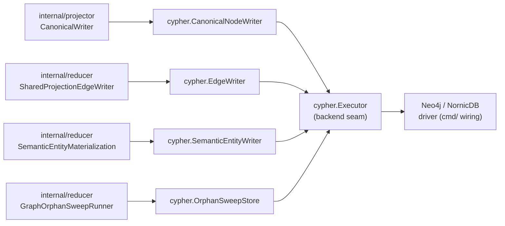
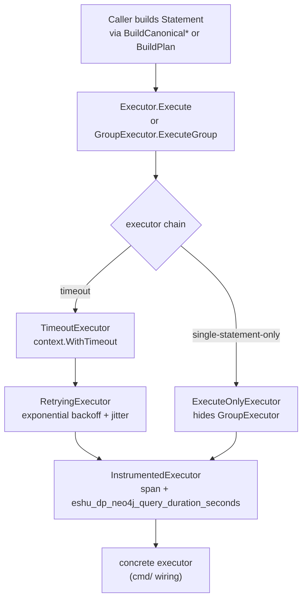

# storage/cypher

`storage/cypher` owns backend-neutral Cypher write contracts, canonical writers,
edge helpers, statement metadata, retry/timeout wrappers, and write
instrumentation for Eshu's canonical graph. Every write path that touches the
graph backend goes through this package.

## Where this fits in the pipeline

## Internal flow

## Lifecycle / workflow

Callers build `Statement` values via statement builder functions
(`BuildCanonicalWorkloadUpsert` and related, `BuildRetractRepoDependencyEdges` and
related, `BuildPlan`) and pass them to a writer
(`CanonicalNodeWriter`, `EdgeWriter`, `SemanticEntityWriter`) or directly to
an `Executor`.

`RetractableNodeEntityLabels()` exposes the canonical retract phase's node label
set (the union of the per-domain retract sets) as a stable, sorted slice. It is
the lockstep source the replay depth-coverage gate (C-13, #4366) mirrors so every
retractable node type is required to have a delta/tombstone replay scenario;
adding a label to a retract set makes that gate demand a new scenario for it.

`canonicalNodeRetractInfraEntityLabels` retains `CrossplaneClaim` even though
no writer has emitted that label since #5347 (a Crossplane Claim is edge-only:
it stays a `K8sResource` node, and the `SATISFIED_BY` edge to its
`CrossplaneXRD` is the classification). The entry is a legacy-node reaper, not
dead code: a graph provisioned before #5347 can still hold nodes carrying the
literal `CrossplaneClaim` label, and only this retract entry's `DETACH DELETE`
sweeps them once a full reconciliation generation re-projects the Claim as a
`K8sResource` node plus a `SATISFIED_BY` edge. Dropping the entry would orphan
those legacy nodes forever for a deployment that upgrades straight from a
pre-#5347 binary to a post-#5478 one with no intervening release that still
retracted the label. Issue #5478 removed the label from every registry that
only affects live query classification (infra category/family lookups,
resource-investigation label fanout, repository infrastructure listings, the
collector/content-shape/projector bucket-to-label projection tables, and the
`claim_unique`/uid/fulltext graph schema entries stay untouched pending a
future change once no legacy nodes remain) but kept it in this retract
registry and its lockstep specs (`specs/replay-depth-requirements.v1.yaml`,
`specs/replay-coverage-manifest.v1.yaml`) for exactly this reason.

No-Regression Evidence: this file's `Statement` shape, batch size, and
dispatch order are unchanged by #5478 -- `canonicalNodeRetractInfraEntityLabels`
is restored to its pre-#5478 membership (`CrossplaneClaim` re-added), so the
generated retract Cypher text, its UNWIND/DETACH DELETE plan, and the phase
ordering in `canonical_node_writer_retract.go` are byte-identical to the
`origin/main` baseline; only dead QUERY-CLASSIFICATION predicates (never
executed for a Claim under the edge-only model) were removed elsewhere in this
change. `go test ./internal/storage/cypher -run
'TestCanonicalNodeWriterRetractRetainsCrossplaneClaimForLegacySweep|TestCanonicalNodeWriterRetractCoversStructuralFamiliesFromIssue3987|TestCanonicalNodeWriterRetractCoversProjectableEntityLabels'
-count=1` proves the retract registry still retracts `CrossplaneClaim` and
stays internally consistent. No before/after benchmark applies: no Cypher
statement shape changed.

No-Observability-Change: the retract phase emits the same statement summaries
and operation metadata it always has for the infra entity-label family; no
metric, span, or log was added, removed, or renamed by this change.

`OrphanSweepStore` is the cleanup seam for disconnected graph nodes that remain
after owned retractions. It only handles the closed labels
`Repository`, `Platform`, `EvidenceArtifact`, `File`, `Directory`, and
`Module`. On both pinned NornicDB backends every relationship-existence
predicate is mis-evaluated (`NOT (n)--()` always false, `(n)--()` always true,
`COUNT { (n)--() } = 0` always true regardless of relationship state -- see
`docs/public/reference/nornicdb-pitfalls.md`), so the store never issues one.
Instead it computes orphan status as a Go-side
anti-join between two bounded reads per label:

- **S1 candidates** (`BuildCandidateOrphanNodesQuery`): every node matching
  `evidence_source IS NOT NULL` (plus the Repository-only exclusion below),
  with its identity key and current `eshu_orphan_observed_at_unix` marker.
  Contains no relationship clause at all. The read is `ORDER BY` the identity
  key and takes only keys `> $cursor`, and the store advances a process-local
  per-label cursor every cycle, so a label with more nodes than the count limit
  is paged deterministically across cycles. This guarantees forward progress
  past a candidate window that happens to be entirely connected (the cursor
  wraps back to the label start once a short page signals the end) instead of
  re-reading the same window and never discovering orphans beyond it.
- **S2 connected keys** (`BuildConnectedKeysQuery`): `UNWIND $keys AS
  candidate_key MATCH (n:Label {key: candidate_key})-[r]-(m) RETURN DISTINCT
  n.key AS key` -- the only relationship primitive proven reliable on both
  pinned backends: a concrete relationship variable in a MATCH anchored on
  caller-supplied identity keys, never a negated or counted pattern-existence
  predicate. The UNWIND binding variable is deliberately not named `key`:
  reusing the RETURN alias as the UNWIND variable silently returns zero rows
  on the pinned NornicDB backends instead of erroring. `readConnectedKeys`
  splits the key list into
  `defaultOrphanSweepConnectedKeysChunkSize`-sized (500) round trips rather
  than anchoring one statement on an arbitrarily large key list: this
  statement's own cost scales super-linearly with key-list size on both
  pinned backends (measured ~4.7s at 5,000 keys unchunked vs ~0.6s chunked at
  500/round trip -- see `evidence-5147-orphan-sweep-antijoin.md` and
  `docs/public/reference/cypher-performance.md`). Below the chunk size this
  is exactly one round trip, unchanged from before chunking was added.

`orphans = candidates - connected` is computed in Go. The store then issues at
most three key-anchored writes per label, each `UNWIND $keys AS candidate_key
MATCH (n:Label {key: candidate_key}) ...`, never a relationship predicate or
`DETACH DELETE`: **clear** (`REMOVE eshu_orphan_observed_at_unix` for marked
nodes that are now connected), **mark** (`SET eshu_orphan_observed_at_unix`
for unmarked orphans, capped at the batch limit), and **sweep** (`DELETE n`
for marked orphans aged past the TTL cutoff, capped at the batch limit).
Immediately before sweep, the store re-runs the S2 read restricted to the
keys about to be deleted and drops any that reconnected between the
top-of-cycle read and the delete (a TOCTOU guard against a concurrent
projector). Each clear/mark/sweep write **re-applies** the same
evidence/ownership guard (and the appropriate marker/age predicate) that S1
used, rather than matching on label+key alone: a key whose ownership changed
between the read and the write -- for example a `Repository {id}` re-created by
canonical projection as `evidence_source='projector/canonical'` in the window
before its relationships attach -- is then skipped by the write, not deleted.

The per-label identity key mirrors the canonical writers' MERGE identity:
`id` for Repository/Platform/EvidenceArtifact, `path` for File/Directory,
`name` for Module. Repository's reads and writes exclude
`evidence_source='projector/canonical'` so active source-local repository
nodes remain owned by the canonical writer even when a repository has no graph
relationships yet. `Module.name` is not unique across node classes (canonical
imported modules are MERGEd on `{name}` with no `uid`; semantic module entities
are MERGEd on `{uid}` and also carry a name), so the Module sweep -- which owns
only the canonical imports -- additionally restricts S1, S2, and its writes to
`n.uid IS NULL`; without this a connected same-name semantic module would mask
a canonical orphan and the writes would target the semantic node too.

The steady no-orphan state (a label whose S1 candidates are all connected,
none marked) issues exactly two reads (S1, S2) and zero writes; a label with
no matching nodes at all skips S2 entirely (one read, zero writes). A label
with unmarked orphans, reconnected markers, or aged markers issues the S1/S2
reads plus only the clear/mark/sweep writes whose key set is non-empty.

No-Regression Evidence: `go test ./internal/storage/cypher -run
'TestDefaultOrphanSweepLabelsIncludesCodeStructureLabels|TestBuildCandidateOrphanNodesQueryUsesStaticLabelNoRelationshipPredicate|TestBuildConnectedKeysQueryUsesConcreteRelationshipVariable|TestBuildClearMarkSweepStatementsAreKeyAnchoredNoRelationshipPredicate|TestOrphanSweepStoreComputesSetDifferenceAndOrdersClearBeforeMark|TestOrphanSweepStoreDeletesAgedOrphansAndPreservesConnected|TestOrphanSweepStoreBoundsMarkAndSweepToBatchLimit|TestOrphanSweepStoreConvergesAcrossBoundedCyclesForAllDefaultLabels|TestOrphanSweepStoreDelaysCodeStructureDeletionDuringProjectionRace|TestOrphanSweepStoreTOCTOUGuardDropsReconnectedKeyBeforeSweep|TestGraphOrphanNodeCountsUsesDefaultCodeStructureLabels'
-count=1` proves the default closed label set includes code structure nodes,
every builder rejects the relationship-existence forbidden patterns
(`)--(`, `NOT (`, `COUNT {`, `EXISTS {`), the Go-side anti-join computes the
correct orphan/connected/clear/mark/sweep key sets against a scripted fixture
that exercises the real production code, aging and batch bounds hold, the
TTL clock is injectable for deterministic cleanup, and the TOCTOU guard drops
a key that reconnects mid-cycle. `go test ./internal/storage/cypher -run
'TestRepositoryCandidateQueryExcludesSourceLocalCanonicalRepositories' -count=1`
proves the sweep never targets source-local canonical Repository nodes.
`go test ./internal/storage/cypher -run
'TestRepoRelationshipUpsertStamps|TestInfrastructurePlatformUpsert|TestBatchedWriteEdgesParameterFidelity'
-count=1` proves relationship-created repository and platform targets carry
`evidence_source` / `generation_id` metadata so the sweep can distinguish Eshu
nodes from backend-local graph objects. `go test ./internal/storage/cypher
-run
'TestReadConnectedKeysIssuesOneRoundTripAtOrBelowChunkSize|TestReadConnectedKeysChunksAboveChunkSizeAndUnionsResults|TestReadConnectedKeysChunkPropagatesReaderErrorMidway'
-count=1` proves the S2 chunk boundary (one round trip at or below the chunk
size), the union/dedup of results across chunks above it, and that a reader
error on a later chunk surfaces rather than being silently swallowed. The
committed live regression `go test
./internal/storage/cypher -run
'TestLiveOrphanAntiJoinReplacesBrokenNotDashDashPredicate' -count=1` (env-gated
on `ESHU_CYPHER_BOLT_DSN`) first reproduces the historical `NOT (n)--()` no-op
on a true orphan on the live backend, then proves the anti-join store marks,
ages, sweeps the orphan, clears a relinked node's marker, and preserves
connected nodes across two injected-clock cycles; verified on both the pinned
v1.1.11 and PR261/compose-default NornicDB images (see
`evidence-5147-orphan-sweep-antijoin.md`).

Observability Evidence: `OrphanSweepStore` statement summaries and operation
metadata flow through the existing `InstrumentedExecutor` metrics and spans.
The reducer-level `eshu_dp_graph_orphan_nodes` observable gauge reports bounded
per-label counts; the runner logs per-label count, mark, delete, duration, and
failure class for each cycle.

`CanonicalNodeWriter.Write` executes all canonical writes in named phases:
`retract`, `repository_cleanup`, `repository`, `directories`, `files`,
`entities`, `entity_retract`, `entity_containment`, `terraform_state`,
`oci_registry`, `package_registry_*`, `modules`, `structural_edges`, and
`package_registry_*_edges`. When the executor
implements `GroupExecutor`, all phases are sent in a single atomic transaction
EXCEPT the deferred `package_registry_*_edges`
phases, which are partitioned into a second `ExecuteGroup` dispatched only
after the first commits (`partitionDeferredPackageRegistryEdgePhases`). When it
implements
`PhaseGroupExecutor`, each phase executes as a bounded group. Otherwise phases
run sequentially.

The `repository_cleanup` phase is the only replacement barrier left in the
canonical node path, and it is skipped for first-generation scopes because no
prior repository identity can exist for that source-local scope. Directory rows
use depth-ordered `MERGE` after the
repository is present. File rows update current nodes in place with
`MATCH (f:File {path: row.path})`, then send only missing rows through a
`WHERE NOT EXISTS { MATCH (:File {path: row.path}) }` guard before `MERGE`.
Nested files require a parent `Directory` match for the directory containment
edge. Repository-root files use a separate Repository-contained statement shape
so package entrypoint files can materialize without inventing a root
`Directory`. This avoids NornicDB's expensive `DETACH DELETE` cost for current
directories or files. Entity property filtering also keeps high-volume analysis
metadata such as `dead_code_root_kinds` and `exactness_blockers` out of
canonical graph rows; the dead-code API merges that evidence from the content
store by entity ID.

Current-file structural edge refresh statements `UNWIND` the bounded file-path
chunk and then seed from indexed `File.path` with
`MATCH (f:File {path: file_path})` before expanding `IMPORTS` or directory
`CONTAINS` relationships. This keeps the cleanup candidate set path-first
instead of relationship-scan-first on NornicDB while preserving the same Cypher
semantics for Neo4j-compatible backends. The file-path list is de-duplicated
before chunking so duplicate input rows cannot repeat the same relationship
delete inside one statement.
Positive string-slice retract statements can be chunked through
`ChunkPositiveStringSliceRetractStatement`; negative `NOT IN` stale cleanup is
intentionally excluded from chunking.
Stale-file retracts anchor on `Repository {id}` and traverse `REPO_CONTAINS`
before applying the generation and keep-list predicates. This avoids starting
from the full `File` label population when a webhook-triggered re-index needs
to remove files that disappeared from one repository.
Delta canonical materializations skip `repository_cleanup` and negative
full-generation stale cleanup. Deleted files are removed by positive
`UNWIND $file_paths AS file_path` path-seeded chunks, changed files update in
place, now-empty deleted-file ancestor directories are removed leaf-first, and
post-upsert entity cleanup is label-scoped plus `n.path IN $file_paths` so
unchanged files and entities survive a file-scoped resync.

No-Regression Evidence: Current-main full-corpus validation on NornicDB v1.1.9
reached post-bootstrap `source_local` refresh and then retried 12 projector
items after the delta deleted-file retract statement
`UNWIND $file_paths AS file_path MATCH (f:File {path: file_path}) ... DETACH
DELETE f` hit the 2 minute canonical write budget. The failing input shape was
positive file-path worklists with source-local fact counts from hundreds to
about 10k, while ungranted Postgres locks stayed at 0. The red tests
`TestChunkPositiveStringSliceRetractStatementSplitsPositiveUnwindList` and
`TestNornicDBPhaseGroupExecutorChunksDeltaDeletedFileRetractPaths` failed with
one chunk/execute call before the fix. Green evidence:
`GOCACHE=$WORKTREE/.gocache go test ./internal/storage/cypher ./cmd/ingester
-run 'TestChunkPositiveStringSliceRetractStatement|TestNornicDBPhaseGroupExecutor(ChunksPositiveRetractFilePaths|ChunksDeltaDeletedFileRetractPaths|DoesNotChunkNegativeRetractFilePaths|NoDrainFallsBackToExistingPath)'
-count=1` and `GOCACHE=$WORKTREE/.gocache go test ./internal/storage/cypher
./cmd/ingester -count=1` pass. The change preserves the emitted Cypher and
only splits the existing positive worklist into the established 25-path
statement chunks; negative keep-list cleanup remains a single statement.

No-Observability-Change: chunked delta retracts still flow through the existing
NornicDB phase-group sequential retract path, statement summaries, retry/error
wrapping, canonical write spans, phase duration metrics, and `canonical phase
failed` logs. The change adds no metric name, metric label, worker, queue
domain, runtime knob, backend branch, or new graph-write route.

No-Regression Evidence: `go test ./internal/storage/cypher -run
'TestChunkPositiveStringSliceRetractStatement|TestCanonicalNodeRefreshStructuralEdgesSeedsFromFilePath|TestCanonicalNodeRefreshStructuralEdgesKeepFilePathChunks|TestCanonicalNodeWriterDeduplicatesRetractFilePaths|TestCanonicalNodeWriterKeepsEmptyDirectoryPathList'
-count=1` proves the indexed `UNWIND` seed shape, protects the current-file
structural refresh chunk budget, de-duplicates repeated current-file identities,
keeps empty directory identity lists encoded as Cypher lists, and preserves
current-file keep-list semantics.

No-Regression Evidence: `go test ./internal/storage/cypher ./cmd/ingester
./cmd/bootstrap-index ./cmd/projector -count=1` keeps canonical writer, NornicDB
phase-group executor, bootstrap, and projector wiring covered after adding
source-local canonical writer tracing and repository-anchored stale-file
retracts.

Observability Evidence: statement summaries and operation metadata stay on each
chunked statement, and source-local canonical writes now wrap the writer in
`canonical.write` plus the retract phase in `canonical.retract`. Phase failures
also emit a structured `canonical phase failed` log with scope, generation,
repo, phase, mode, statement count, duration, and error, while existing
`canonical phase-group write` logs and graph failure details still identify the
phase and sanitized first statement.

No-Regression Evidence: `go test ./internal/storage/cypher -run
'TestCanonicalNodeWriterScopesDeltaProjectionToTouchedFiles|TestDeltaEmptyDirectoryRetractStatementsRunLeafFirst' -count=1`
proves delta projection skips repository replacement and negative
full-generation cleanup, deletes only deleted file paths, removes now-empty
deleted-file ancestor directories leaf-first, and scopes stale entity cleanup to
touched file paths.

No-Observability-Change: delta cleanup uses existing canonical write phases,
statement metadata, `canonical.write` spans, phase duration metrics, and phase
failure logs. It adds no metric name, metric label, worker, retry policy, or
backend-specific branch.

No-Regression Evidence: GitLab `NEEDS` and `DEFINES_JOB` retracts are bounded
mixed-phase relationship deletes. The red replay-tier baseline on NornicDB
v1.1.9 (`timothyswt/nornicdb-cpu-bge:v1.1.9@sha256:9a5126d306a48c01869809da47a869a4521b9328a7ab1c855327f5fd7541e4cd`)
used the two-generation replaydelta cassette with one `.gitlab-ci.yml`, one
pipeline, and three surviving jobs. Gen1 wrote `test -> build`; gen2 changed
only the source job's `needs` metadata to `deploy`. Before Drain-marking the
GitLab relationship retracts and matching production's mixed-phase autocommit
path in the live replay executor,
`ESHU_REPLAY_TIER_HTTP_PORT=7574 ESHU_REPLAY_TIER_BOLT_PORT=7787 bash scripts/verify-replay-tier.sh`
failed with old `test -> build` `NEEDS` count `1`, wanted `0`. After the change,
the same command passed against real NornicDB in 4 seconds, and
`TestDeltaTombstoneGraphTruth` read back old `test -> build` count `0` plus new
`test -> deploy` count `1`. Focused local proof also passed:
`go test ./internal/storage/cypher -run 'TestGitlabEdgeStatements|TestStatementDrainFieldsAreZeroValueByDefault' -count=1`,
`go test ./internal/replay/offlinetier -run 'TestDeltaMaterializationGitlabNeedsChangesBetweenSurvivingJobs|TestDeltaTombstoneGraphTruth' -count=1`,
`go test ./internal/replaycoverage ./cmd/replay-coverage-gate ./internal/replay/offlinetier ./internal/storage/cypher -count=1`,
and `make pre-pr`, including the graph-write race lane. Terminal graph row
counts are bounded by the cassette: one pipeline source, three job source UIDs,
one stale `NEEDS` edge deleted, and one current `NEEDS` edge merged.

No-Observability-Change: GitLab edge retracts still execute through the
canonical `structural_edges` phase and retain existing statement metadata,
`canonical.write` spans, phase duration metrics, NornicDB phase-group logs, and
reconciliation drift recording for autocommit retracts. The change adds no
metric name, metric label, queue, worker, retry policy, runtime knob, or new
backend branch.

Code-call shared projection routes `CALLS`, `REFERENCES`, and `USES_METACLASS`
through label-scoped batched edge statements when endpoint labels are known.
Each code-call statement carries a bounded route summary with relationship,
source label, target label, and row count so slow shared-edge logs can be tied
back to the exact Cypher shape without exposing file paths or entity IDs.

Inheritance shared projection retracts seed cleanup from the child entity label
and indexed `repo_id` or `path`, then expand only that child's outgoing
`INHERITS`, `OVERRIDES`, `ALIASES`, and `IMPLEMENTS` relationships. Do not
collapse these back to `MATCH (child)-[rel:...]->() WHERE child.repo_id IN ...`
or `child.path IN ...`; that relationship-scan-first shape was measured as the
dominant `inheritance_edges` shared-projection cost on NornicDB.

Performance Evidence: a bounded NornicDB PR #230 run isolated one
`inheritance_edges` shared projection cycle at `133.410836794s` total, with
`retract_duration_seconds=133.408286922`, `selection_duration_seconds=0.000874641`,
`write_duration_seconds=0.00000081`, `mark_completed_duration_seconds=0.001031401`,
and `indexed_selection=true`. The old retract shape started from an unbound
relationship expansion and only filtered the child node by `repo_id` afterward.
The new repo-wide shape `UNWIND`s repo IDs, `MATCH`es
`Function|Class|Interface|Trait|Struct|Enum|Protocol` children by indexed
`repo_id`, and then expands the outgoing inheritance relationship; the delta
file-scoped shape does the same by indexed `path`. NornicDB source evidence for
the PR #230 checkout shows bound relationship `DELETE` tests using a source-node
anchor before relationship expansion.

No-Observability-Change: shared projection cycle logs already split selection,
lease claim, retract, write, and mark-complete durations and identified retract
as the slow layer. The updated Cypher still executes through
`EdgeWriter.RetractEdges`, existing statement summaries, retry wrapping, graph
write spans, and shared-edge logs; no metric name, metric label, queue domain,
worker, lease, timeout, runtime knob, or backend-specific branch changes.

Repo-dependency retract executes repository relationship edge cleanup,
`RUNS_ON` cleanup, and evidence-artifact cleanup as separate sequential
statements because grouped deletes under-apply on NornicDB v1.1.11. The
`projection/code-imports` producer is capability-limited to repo-to-repo
`DEPENDS_ON`, so its retract executes only repository relationship and evidence
artifact cleanup; it never opens the impossible `RUNS_ON` transaction. Exact
source equality owns the omission: prefix lookalikes and every other evidence
source retain all three roles. A mismatched code-import write fails closed
before backend execution. Single-repository cycles retain direct `$repo_id`
anchors, and the repo-dependency runner remains one repo-owned partition.

Performance Evidence: the retained 896-repository run attributed `362.94s` to
the impossible code-import `RUNS_ON` role, exceeding the `158s` worthwhile-work
threshold by `204.94s`. On the quiet retained graph, the alternative indexed
traversal saved only milliseconds, so that rewrite was deferred. The complete
proof and exactness table are in
[`evidence-5208-code-import-runs-on-omit.md`](evidence-5208-code-import-runs-on-omit.md).

No-Regression Evidence: `go test ./internal/storage/cypher -run
'TestEdgeWriterRetractEdgesRepoDependency|TestEdgeWriterWriteEdgesRejectsCodeImportRunsOn|TestRepoDependencyRetractSummariesShareRelationshipEdgeTypes'
-count=1` proves code-import executes two sequential roles, other and
prefix-collision sources execute three, malformed code-import `RUNS_ON` writes
fail closed, and the existing source-capable roles keep their bound delete
shapes.

Observability Evidence: executed roles retain `shared edge retract statement
completed`. The source-capability omission emits `shared edge retract role
omitted` with `domain`, `evidence_source`, `statement_role`, `repo_count`, and
bounded `reason=source_capability`. The
`eshu_dp_shared_edge_runs_on_retract_omissions_total` counter increments once
per omitted role with bounded `domain` and `reason` labels. No worker, lease,
partition, retry, timeout, or backend branch changes.

Terraform-state rows are written as `TerraformResource`, `TerraformModule`, and
`TerraformOutput` nodes keyed by `uid`. The rows keep lineage, serial, provider
binding, tag-key hashes, and hashed correlation anchors on the node without
creating cloud-resource joins. Those joins are reducer work after the
Terraform-state readiness checkpoints exist. `TerraformResource` also gets a
bounded, allowlisted subset of the resource's classified attributes flattened
onto prefixed scalar node properties (`tf_attr_*`) via an additive
`r += row.attrs` merge on the existing upsert template — see
`terraform_attribute_promotion.go` and its redaction guard against the full
IAM policy documents the drift package's attribute allowlist also carries
(#5441).

OCI registry rows are written as `OciRegistryRepository`,
`ContainerImage`/`OciImageManifest`, `ContainerImageIndex`/`OciImageIndex`,
`ContainerImageDescriptor`/`OciImageDescriptor`,
`ContainerImageTagObservation`/`OciImageTagObservation`, and
`OciImageReferrer` nodes keyed by `uid`. OCI image, descriptor, tag, and
referrer rows carry `repository_id` as the durable repository join key instead
of writing repository publication or observation relationships in the canonical
hot path. Manifests, indexes, and descriptors keep their image-family labels
because API queries anchor on those labels. Digest-backed descriptor identity is
the stable image key; tag observations keep `identity_strength=weak_tag` and
point at a resolved digest without making the tag the stable image key.

A `ContainerImageTagObservation` node's `first_observed_at` property (issue
#5459, the first queryable node-property timestamp in the canonical graph) is
written with `ON CREATE SET t.first_observed_at = row.observed_at` inside the
identity MERGE (`canonicalOCIImageTagObservationUpsertCypher`), so it is fixed
once at node creation and never overwritten by a later observation.
`oci_tag_first_observed_prove_theory_live_test.go` records three shapes that
were disproven live on NornicDB first: a self-referencing `CASE`/`coalesce`
guard inside the same `UNWIND ... MERGE ... SET` regresses to last-write-wins
(the MERGE binding shadows the persisted property as null for any
same-statement self-read), and even a separate DEFERRED
`MATCH ... WHERE t.first_observed_at IS NULL SET ...` failed the live
golden-corpus pipeline because the deferred MATCH did not surface the
multi-label node across the write group's transaction boundary. `ON CREATE`
reads no persisted property, so it is genuine set-once in one statement with no
self-reference and no cross-transaction dependency — idempotent under replay
and concurrency-safe (a re-MERGE never re-fires `ON CREATE`).
`go/internal/query`'s `TagHistoryHandler` reads this property to
answer "what digest was `repo:tag` first observed as, and in what order did
its digests change" over the existing `container_image_tag_observation_ref`
index on `image_ref`.

Package-registry rows are written as `Package`/`PackageRegistryPackage`,
`PackageVersion`/`PackageRegistryPackageVersion`, and
`PackageDependency`/`PackageRegistryPackageDependency` nodes keyed by `uid`.
Package and package-version nodes carry PURL, BOMRef, package manager, and
source-debug identity fields; dependency nodes carry the same fields for the
target package identity.
This phase emits `HAS_VERSION`, `DECLARES_DEPENDENCY`, and
`DEPENDS_ON_PACKAGE` for package-native dependency metadata only; source
repository hints are not promoted to ownership or publication edges until
reducer correlation supplies corroborating evidence. NornicDB phase-group
execution commits package, version, dependency target package, and dependency
writes in separate ordered phase groups because later statements `MATCH`
identities created by earlier package-registry statements. Dependency target
packages and primary package rows are deduplicated before the `UNWIND MERGE`
batch so repeated rows for the same package cannot attempt the same
`Package.uid` create more than once in a NornicDB transaction. The canonical
writer also gates package-registry package identity writes by sorted package
UID across primary packages, package versions, dependency source packages, and
dependency target packages before dispatching to the backend. Same-UID package
observations therefore serialize inside one projector process while distinct
package UIDs still reach the backend concurrently. Primary package duplicates
keep the newest observed source fact and use source fact id, then stable fact
key, as deterministic tie-breakers before sorting by UID.

No-Regression Evidence: `go test ./internal/storage/cypher -run
'TestCanonicalNodeWriter(SerializesConcurrentDuplicatePackageUIDs|SerializesDependencyTargetPackageUIDs|AllowsConcurrentDistinctPackageUIDs|BuildsPackageRegistryStatements|SeparatesPackageRegistryPhaseGroups|DeduplicatesPackageRegistryDependencyTargets|DeduplicatesPackageRegistryPackages)|TestPackageRegistryIdentityLockKeysCoverPackageSources'
-count=1` proves duplicate primary and dependency-target package UID writes
serialize before backend execution, distinct package UIDs still execute
concurrently, package/version/dependency phases stay ordered, and duplicate
package rows are deduplicated before graph-write batches.

Observability Evidence: `canonical.write` spans now include
`package_registry_identity_lock_key_count` and
`package_registry_identity_lock_wait_seconds` when a materialization carries
package-registry identities. Slow same-UID waits emit a structured
`canonical package registry identity lock acquired` log with `package_uid_min`,
scope, repo, generation, key count, and wait seconds. Existing phase spans,
duration metrics, phase failure logs, phase-group chunk summaries, retry logs,
and queue failure payloads still expose true backend conflicts and retries.

No-Regression Evidence: `go test ./internal/projector ./internal/storage/cypher -run 'TestBuildCanonicalMaterializationExtractsPackageRegistry|TestCanonicalNodeWriterBuildsPackageRegistryStatements' -count=1`
proves package-registry identity fields (`purl`, `bom_ref`,
`package_manager`, and source-debug fields) survive fact-to-row extraction and
the ordered Cypher row builders without changing package/version/dependency
phase ordering.

No-Observability-Change: identity fields are additional node properties on
existing package-registry phase groups. The existing canonical phase spans,
duration metrics, statement summaries, row counts, and phase failure logs still
diagnose stuck, slow, or failed package-registry graph writes.

`EdgeWriter.WriteEdges` maps a `reducer.Domain` to a batched UNWIND Cypher
template and dispatches rows in batches of `BatchSize` (default
`DefaultBatchSize` = 500). Domain-specific sub-batch sizes are available for
`DomainCodeCalls`, `DomainInheritanceEdges`, `DomainSQLRelationships`, and
`DomainShellExec`.
`DomainCodeCalls` writes direct call evidence as `CALLS`, JSX component plus Go
and TypeScript type-reference evidence as `REFERENCES`, and Python metaclass
evidence as `USES_METACLASS`. When reducer rows include
`caller_entity_type` and `callee_entity_type`, code-call and code-reference
writes use the exact endpoint label plus `uid`; incomplete legacy rows still
use the label-family fallback.
`DomainSQLRelationships` writes SQL table, column, view, function, index,
trigger, and embedded-query evidence with label-scoped endpoints. Function rows
can emit `QUERIES_TABLE` to a `SqlTable`; trigger rows can emit both `TRIGGERS`
to a `SqlTable` and `EXECUTES` to a `SqlFunction`; index rows emit `INDEXES` to
a `SqlTable` (#5330); table rows emit FK-correct `REFERENCES_TABLE` to another
`SqlTable`, and function/procedure rows emit `WRITES_TO` to a `SqlTable`
(#5410); `SqlMigration` rows emit `MIGRATES` to the
`SqlTable`/`SqlView`/`SqlFunction`/`SqlTrigger`/`SqlIndex` objects a migration
file touches (#5346). `EXECUTES` remains part of
dead-code reachability for stored routines and must stay in the relationship
retraction set.
`DomainShellExec` writes `Function-[:EXECUTES_SHELL]->ShellCommand` from parser
command-call evidence. The ShellCommand node is keyed by a deterministic uid and
stores API, language, source path, and line number only; raw command text,
arguments, and environment values are not graph properties.

On NornicDB, reducer wiring sets `SQLRelationshipSequentialWrites`: SQL edge
statements use auto-commit `Execute` even when the shared executor supports
managed groups. The pinned backend acknowledges the managed-transaction shape
without persisting its relationships. This does not serialize workers or reduce
row batching; production already grouped one SQL statement per transaction. A
concurrency regression holds two reducer calls inside auto-commit execution at
the same time, while the live backend proof repeats each MERGE to lock duplicate
delivery at one edge.

No-Regression Evidence: `go test ./internal/storage/cypher -run
'TestEdgeWriter(WriteEdgesShellExec|RetractEdgesShellExecDeltaUsesFileScope)'
-count=1` covers the static-token MERGE shape and file-scoped retract. The
writer adds one `UNWIND` + `MATCH Function uid` + `MERGE ShellCommand uid`
write statement and no per-row graph round trip. Shell-exec retracts run the
edge delete first, then a same-scope `ShellCommand` orphan cleanup anchored by
indexed repo or path so removed command-call churn does not grow future retract
anchors. That cleanup (`EdgeWriter.cleanupOrphanShellCommands`) is the same
S1/S2 Go-side anti-join shape as `OrphanSweepStore` (see "`OrphanSweepStore`
is the cleanup seam..." above): it reads candidate uids, reads which of those
uids currently have any relationship via a concrete relationship variable,
computes the anti-join in Go, and deletes only the non-connected uids by
explicit key, through `EdgeWriter.Reader`. It never relies on a
relationship-existence predicate (#5310; see
docs/public/reference/nornicdb-pitfalls.md).

No-Observability-Change: shell-exec writes use the existing
`EdgeWriter.WriteEdges` / `RetractEdges` path, statement summaries,
retry wrapping, shared-edge write metrics, and domain labels. No new metric
instrument, runtime knob, or graph backend branch was added.

`DomainRunsIn` writes `Function-[:RUNS_IN]->Workload` edges that bind a proven
route-handler Function to the deployed runtime it runs in (#2722, under epic
#2703/#2710). The reducer scopes the source to exactly the entrypoint Functions
`handles_route` resolves, so a binding is produced only for an exact, unambiguous
handler resolution and never for every Function in the repo. The upsert is
MATCH-anchored through the handler's Repository:
`MATCH (func:Function {uid: row.function_id}) MATCH (repo:Repository {id:
row.repo_id})-[:DEFINES]->(workload:Workload) MERGE (func)-[rel:RUNS_IN]->
(workload)`. The traversal is bounded by the indexed `Repository.id` anchor and
fans out only to the workloads that one repository DEFINES, so no unused index is
added — the bounded-anchor reasoning mirrors `handles_route`. Expected
cardinality is at most one edge per (handler Function, Workload the repo
DEFINES); a handler serving many routes still produces one intent per
(Function, repo).

Ambiguity is represented, not collapsed. The code-call materialization stage that
builds these intents loads only repository and file facts and never runs the
workload admission/correlation that decides how many Workload nodes a repo
ultimately DEFINES, so it cannot count them at intent-build time. It therefore
marks every edge `rel.ambiguous = true` with a deliberately conservative
`rel.confidence` (0.5): each edge is a candidate member of the repo's workload
set, never an asserted single-workload binding. A repo that DEFINES exactly one
Workload still yields exactly one edge, and a consumer derives exactness by
counting the MATCH fan-out at query time. `RUNS_IN` shares the
`workload_materialization` readiness phase and `service_uid` keyspace with
`handles_route` because Workload nodes commit in that phase under that keyspace.
Operators see the domain in the shared-projection partition worker telemetry
alongside the other drained domains, and retraction removes only edges owned by
`evidence_source='reducer/runs-in'` for the re-projected repositories, anchored on
the source `Function.repo_id`.

No-Regression Evidence: `go test ./internal/reducer ./internal/storage/cypher
-count=1` proves the runs_in intent scoping (one intent per resolved handler
Function, skips for unknown/ambiguous/handler-less entries), the conservative
`ambiguous=true` representation, the readiness phase/keyspace and domain
enumeration, and the edge-writer UNWIND MATCH-MATCH-MERGE Cypher plus row map
(rows missing `function_id`/`repo_id` are dropped) and scoped retract.

Observability Evidence: `runs_in` is drained by the shared-projection partition
worker like every other shared domain, so its statement summaries and operation
metadata appear in the same `canonical.write`/retract telemetry path; no new
observability surface is introduced.

`IncidentRoutingEvidenceWriter` is a reducer-owned graph writer for PagerDuty
incident routing. It writes only `IncidentRoutingEvidence` nodes and static
`HAS_INTENDED_ROUTING`, `HAS_APPLIED_ROUTING`, or `HAS_LIVE_ROUTING`
relationships between evidence nodes. The writer rejects out-of-vocabulary or
unsafe slot values before building Cypher, uses batched `UNWIND` statements,
and retracts only rows owned by `evidence_source='reducer/incident-routing'`
for the current scope.

No-Regression Evidence: `go test ./internal/storage/cypher -run
'IncidentRoutingEvidenceWriter' -count=1` proves static relationship tokens,
slot validation, scoped retraction, and grouped execution for the
incident-routing writer.

`SecretsIAMGraphWriter` is the reducer-owned secrets/IAM graph projection writer
(ADR #1314): four `SecretsIAM*` node families (uid-only `MERGE`) and five
resolvable `SECRETS_IAM_*` edge families (`MATCH`/`MATCH`/`MERGE`, so a missing
endpoint is a no-op never a fabricated node), plus scope+evidence-scoped retract.
It interpolates no data-driven Cypher token: identity is always the uid (nodes)
or the two endpoint uids plus the static relationship token (edges). The live
reducer projection that drives it stays OFF by default behind
`ESHU_REDUCER_SECRETS_IAM_GRAPH_PROJECTION_ENABLED`; ADR #1314 §14 sign-off and
repo-local proofs exist, but #2430 must bind activation to one target deployment
and record flag-on proof before production enablement.

Benchmark Evidence: `BenchmarkSecretsIAMGraphWriter`
(`secrets_iam_graph_writer_bench_test.go`) measures statement construction and
`UNWIND` batching for all four node families and five edges at 5,000 rows each
through the no-op group executor (ADR #1314 §12). On an Apple M4 Pro
(`darwin/arm64`, `-benchtime=50x -count=3`) it runs ~20.8–38.7 µs/op,
53,728–53,729 B/op, 765 allocs/op — faster than
`BenchmarkCloudResourceNodeWriter` (~2.87 ms/op),
`BenchmarkKubernetesCorrelationEdgeWriter` (~1.10 ms/op), and
`BenchmarkSecurityGroupReachabilityWriter` (~3.98 ms/op) because each surface is
one homogeneous static template streamed straight into batches with no per-row
token-grouping and no per-edge graph read. The write side has no N+1 and stays in
the proven node/edge writer shape class, far under the §12 ~10% regression stop
threshold. Reproduce with `go test ./internal/storage/cypher -run '^$' -bench
BenchmarkSecretsIAMGraph -benchmem -benchtime=50x`.

No-Regression Evidence: `go test ./internal/storage/cypher -run SecretsIAMGraph
-count=1` proves node/edge Cypher shape, uid-only MERGE identity, scoped retract
with no endpoint deletion, and batching. The ADR #1314 §11 TRUE live-backend
conformance is the BACKEND-GATED `TestSecretsIAMGraphWriterLiveConformance`
(`secrets_iam_graph_live_test.go`): it writes all four node families and five
edges, reads them back, and proves scoped retract leaves the retained
`KubernetesWorkload` and `CloudResource` endpoints intact. It SKIPs cleanly
unless `ESHU_SECRETS_IAM_GRAPH_LIVE=1` and Bolt env are set, so the default run
never fabricates a live proof. The June 7 proof snapshot in
`docs/internal/design/1314-secrets-iam-graph-promotion-proof-2026-06-07.md`
records successful NornicDB and Neo4j live writer conformance plus shared
backend conformance; production activation remains blocked on #2430's
target-bound activation record.

Observability Evidence: no new metric name is introduced by the writer; the
reducer projection domain owns the bounded-enum node/edge/skip counters and the
per-phase-duration completion log documented in `go/internal/reducer/README.md`.

The executor chain is composed in `cmd/` wiring. A typical production chain
wraps a concrete driver executor with `TimeoutExecutor` → `RetryingExecutor` →
`InstrumentedExecutor`.

`RetryingExecutor` detects transient Neo4j errors (deadlock, lock timeout,
retryable driver `ConnectivityError`) and NornicDB MERGE unique conflicts and
retries with exponential backoff and jitter. A driver `ConnectivityError`
wrapping `CommitFailedDeadError` is not retried in place because its commit
outcome is unknown. Durable callers may later replay still-pending idempotent
work after backoff. The same loop covers `Execute` and `ExecuteGroup`; group retries stay
limited to safe driver-level transient failures or all-MERGE NornicDB commit
conflicts so re-execution remains idempotent.

No-Regression Evidence: `go test ./internal/storage/cypher -run
'TestRetryingExecutor(RetriesDriverConnectivityError|ConnectivityErrorExhaustionRemainsQueueRetryable)|TestWrapRetryableNeo4jError'
-count=1` proves typed Neo4j driver connectivity failures retry locally and
remain reducer-queue retryable after the local retry budget is exhausted.

Observability Evidence: no new metric name was needed. Existing
`neo4j transient error, retrying` structured logs,
`eshu_dp_neo4j_deadlock_retries_total{write_phase,reason}`, graph query spans,
and queue `failure_class` rows expose retry attempts, operation labels,
bounded retry classes, exhausted retry errors, and dead-letter prevention.
The counter name is legacy and now tracks this package's broader transient
graph-write retry class. Its closed `reason` enum is `connectivity_error`,
`transient_error`, `write_conflict`, or `commit_unique_conflict`; raw errors,
repository ids, node ids, and statements stay out of metric labels.

## Exported surface

**Core types**

- `Statement` — one executable Cypher statement: `Operation`, `Cypher`,
  `Parameters`
- `Plan` — deterministic write plan for one source-local materialization; built
  by `BuildPlan`
- `Operation` — string constant for write type; defined variants:
  `OperationUpsertNode`, `OperationDeleteNode`, `OperationCanonicalUpsert`
- `Executor` — the backend seam: `Execute(ctx, Statement) error`; every
  concrete backend implements this
- `GroupExecutor` — extension of `Executor` for atomic multi-statement writes
- `PhaseGroupExecutor` — extension for bounded phase-grouped writes
- `Adapter` — source-local record writer that builds and executes a `Plan`

**Executor wrappers** (composable chain links)

- `InstrumentedExecutor` — wraps `Executor` with OTEL span and
  `eshu_dp_neo4j_query_duration_seconds` histogram
- `RetryingExecutor` — wraps `Executor` with exponential backoff/jitter for
  transient Neo4j and NornicDB errors
- `TimeoutExecutor` — bounds individual statements with a child context;
  returns `GraphWriteTimeoutError` on deadline
- `ExecuteOnlyExecutor` — hides `GroupExecutor` from callers that must not use
  large atomic groups

**Canonical writers**

- `CanonicalNodeWriter` — writes `projector.CanonicalMaterialization` in strict
  phase order; constructed with `NewCanonicalNodeWriter`; configure per-label
  batch sizes via `WithEntityLabelBatchSize` and containment mode via
  `WithEntityContainmentInEntityUpsert`
- `EdgeWriter` — writes shared-domain edge rows for
  `reducer.SharedProjectionEdgeWriter`; constructed with `NewEdgeWriter`
- `EdgeWriter` also materializes deployable-unit correlation rows from
  `reducer.DomainDeployableUnitEdges` into
  `(:Repository)-[:CORRELATES_DEPLOYABLE_UNIT]->(:Repository)` edges. The query
  shape is batched `UNWIND` + `MATCH` source repository + `MATCH` deployment
  repository + static-token `MERGE`; missing endpoints are no-ops and stale
  rows retract only evidence source `reducer/deployable-unit-correlation`.
- `OrphanSweepStore` — counts, marks, clears, and deletes aged
  zero-relationship graph nodes from the closed cleanup label set; constructed
  with `NewOrphanSweepStore`
- `CloudResourceEdgeWriter` — writes canonical AWS relationship edges between
  `CloudResource` nodes for the AWS relationship materialization reducer domain
  (issue #805 PR 2); constructed with `NewCloudResourceEdgeWriter`. Uses batched
  `UNWIND` + `MATCH` source / `MATCH` target / static-type `MERGE` edge so a
  missing endpoint is a no-op, idempotent on
  `(source_uid, relationship_type, target_uid)`, with an evidence-source-scoped
  retract
- `CloudResourceContainerImageEdgeWriter` — writes canonical
  `(:CloudResource)-[:AWS_lambda_function_uses_image]->(:ContainerImage)` edges
  for the additive `DomainAWSCloudImageMaterialization` reducer domain (issue
  #5450); constructed with `NewCloudResourceContainerImageEdgeWriter`. Same
  batched `UNWIND` + `MATCH` source `CloudResource` / `MATCH` target
  `ContainerImage` / static-token `MERGE` shape as `CloudResourceEdgeWriter`,
  but the Cypher relationship-type token is a fixed constant validated against
  a closed single-member vocabulary (mirroring `IAMCanAssumeEdgeWriter`'s
  `CAN_ASSUME`) rather than `CloudResourceEdgeWriter`'s open per-relationship-type
  `AWS_<raw type>` derivation, because this domain only ever resolves one raw
  AWS relationship type (`lambda_function_uses_image`); idempotent on
  `(source_uid, target_uid)`, with an evidence-source-scoped
  (`reducer/aws-cloud-image`) retract that never touches either endpoint's node

  Performance Evidence: `go test ./internal/storage/cypher -run '^$' -bench
  BenchmarkCloudResourceContainerImageEdgeWriter -benchmem -benchtime=100ms
  -count=6` shaped 5,000 edges at batch 500 in `~1.72 ms/op` (`3.61 MB/op`,
  `35,071 allocs/op`) on darwin/arm64 (Apple M4 Pro), no-op group executor.
  No-Regression Evidence: same order of magnitude as, and fewer allocations
  than, the sibling `BenchmarkCloudResourceEdgeWriter` baseline
  (`~1.6 ms/op`, `3.89 MB/op`, `40,099 allocs/op`) on the same corpus and batch
  size — see `docs/internal/aws-relationship-edge-materialization-design.md`
  §12.
- `S3InternetExposureNodeWriter` — writes reducer-owned S3 internet-exposure
  properties onto existing S3 `CloudResource` nodes (issue #1232); constructed
  with `NewS3InternetExposureNodeWriter(executor, reader, batchSize)`. Uses
  batched `UNWIND` + `MERGE (resource:CloudResource {uid})` (issue #5652: a
  bare `MATCH` anchor here silently drops its `SET` on the pinned production
  NornicDB v1.1.11 image). Never-create is enforced in Go instead of at the
  anchor clause: `PostureExistenceReader` confirms a candidate uid already
  exists via a separate read before the row ever reaches the write, so a
  missing bucket node is dropped before the statement runs rather than
  fabricated by `MERGE`. See `posture_node_existence.go` and
  `docs/internal/evidence/5652-nornic-bare-match-writeloss.md`. Unknown
  exposure rows set `s3_internet_exposure_state=unknown` and remove the
  boolean `s3_internet_exposed` property. Retract removes only
  `s3_internet_exposure_*` properties scoped by reducer evidence source and
  scope id.
- `EC2InternetExposureNodeWriter` — writes reducer-owned EC2 internet-exposure
  properties onto existing EC2 `CloudResource` nodes (issue #1301); constructed
  with `NewEC2InternetExposureNodeWriter(executor, reader, batchSize)`. Same
  MERGE-plus-existence-read fix as `S3InternetExposureNodeWriter` above
  (issue #5652): a missing EC2 instance node is dropped in Go before the
  write, never fabricated. Unknown exposure rows set
  `ec2_internet_exposure_state=unknown` and remove the boolean
  `ec2_internet_exposed` property. Retract removes only
  `ec2_internet_exposure_*` properties scoped by reducer evidence source and
  scope id.

No-Regression Evidence: deployable-unit edge writes use the shared static-token
`EdgeWriter` path with no per-row graph reads. On Apple M4 Pro (`darwin/arm64`),
`go test ./internal/storage/cypher -run '^$' -bench 'BenchmarkDeployableUnitCorrelationEdgeWriter|BenchmarkKubernetesCorrelationEdgeWriter' -benchmem -benchtime=20x -count=3`
writes 5,000 `CORRELATES_DEPLOYABLE_UNIT` rows at `2.94-3.05 ms/op`,
`7.32 MB/op`, and `80,052-80,053 allocs/op`. The lean dedicated
`BenchmarkKubernetesCorrelationEdgeWriter` baseline on the same run measured
`1.16-1.23 ms/op`, `2.16 MB/op`, and `25,098 allocs/op`; the deployable-unit
path is heavier because it carries the generic shared-intent row map and
admission metadata, but it remains one batched no-N+1 write surface.

No-Observability-Change: deployable-unit writes flow through
`EdgeWriter.WriteEdges` / `RetractEdges`, existing retry wrapping, grouped
execution, shared-edge group metrics, statement summaries, and failure logs. The
change adds no metric name, metric label, worker, queue domain, runtime knob, or
backend-specific branch.

  Benchmark Evidence: `go test ./internal/storage/cypher -run '^$' -bench
  BenchmarkEC2InternetExposureNodeWriter -benchmem -count=3` writes 5,000 rows
  at batch 500 in `1.35 ms/op`, `1.33 ms/op`, and `1.33 ms/op` on darwin/arm64
  Apple M4 Pro, about `1.97 MB/op` and `25,068 allocs/op`.
  No-Regression Evidence: `go test ./internal/storage/cypher -run
  EC2InternetExposure -count=1` proves empty-row no-op behavior,
  MERGE-anchored SET on a confirmed-existing uid, never-create for an
  unconfirmed uid, scope/evidence annotation, unknown boolean removal, raw
  public-IP redaction, and property-only retract.
  Observability Evidence: statement summaries and operation metadata
  (`phase=ec2_internet_exposure`, `label=CloudResource:EC2InternetExposure`)
  ride each statement for the existing InstrumentedExecutor
  `eshu_dp_neo4j_query_duration_seconds` and `eshu_dp_neo4j_batch_size`
  metrics; the reducer handler owns the EC2 exposure domain counters and
  completion log.
- `EC2BlockDeviceKMSPostureNodeWriter` — writes reducer-owned EC2 block-device
  KMS posture properties onto existing EC2 `CloudResource` nodes (issue #1304);
  constructed with `NewEC2BlockDeviceKMSPostureNodeWriter(executor, reader,
  batchSize)`. Same MERGE-plus-existence-read fix as `S3InternetExposureNodeWriter`
  above (issue #5652): a missing EC2 node is dropped in Go, before the write,
  via `PostureExistenceReader`, rather than fabricated. Scoped retract removes
  only `ec2_block_device_*` posture fields owned by
  `reducer/ec2-block-device-kms-posture`.
- `S3ExternalPrincipalGrantWriter` — writes metadata-only S3 bucket-policy
  access evidence as `(:CloudResource)-[:GRANTS_ACCESS_TO]->(:ExternalPrincipal)`
  graph truth for issue #1231; constructed with
  `NewS3ExternalPrincipalGrantWriter`. Uses batched `UNWIND` + `MATCH
  (source:CloudResource {uid})` so missing source buckets cannot be fabricated,
  `MERGE (principal:ExternalPrincipal {uid})` on a stable principal kind/value
  identity, and a static `GRANTS_ACCESS_TO` relationship token validated against
  a closed vocabulary before interpolation. Optional principal account,
  partition, and service metadata update only when the incoming row carries a
  non-empty value, so partial later facts cannot clear bounded identity
  metadata. Retract deletes only reducer-owned edges scoped by edge `scope_id`
  and `evidence_source`, leaving global `ExternalPrincipal` identities in place.

  Benchmark Evidence: `go test ./internal/storage/cypher -run '^$' -bench
  'BenchmarkS3ExternalPrincipalGrantWriter|BenchmarkS3LogsToEdgeWriter|BenchmarkCloudResourceEdgeWriter|BenchmarkCloudResourceNodeWriter'
  -benchmem -benchtime=100x` shaped 5,000 node+edge rows at batch 500 in
  `3.28 ms/op` (`6.49 MB/op`, `35,072 allocs/op`) on darwin/arm64 Apple M4 Pro,
  with no per-row graph round trip.
  No-Regression Evidence: `go test ./internal/storage/cypher -run
  S3ExternalPrincipalGrant -count=1` proves the source `MATCH`, bounded
  `ExternalPrincipal` MERGE, static relationship token, optional-metadata
  preservation, raw-policy redaction, batching, and scoped retract.
  Observability Evidence: statement summaries and operation metadata
  (`phase=s3_external_principal_grant`, `label=ExternalPrincipal`) ride each
  statement for the InstrumentedExecutor's graph query duration and batch-size
  metrics; the reducer handler owns the domain span and completion log.
- `KubernetesWorkloadNodeWriter` — writes canonical `KubernetesWorkload` nodes
  for the live-workload materialization reducer domain (issue #388);
  constructed with `NewKubernetesWorkloadNodeWriter`. Batched `UNWIND` +
  `MERGE (w:KubernetesWorkload {uid: row.uid})` on the collector-emitted
  `object_id` only, mutable properties `SET` separately, idempotent under
  retries and duplicate facts. Mirrors the proven CloudResource node writer so
  it engages the same schema-backed uid lookup; the #388 edge slice (PR3)
  resolves its workload endpoint against these nodes
- `KubernetesNamespaceNodeWriter` — writes canonical `KubernetesNamespace` nodes
  for the namespace environment-alias binding reducer domain (issue #5434);
  constructed with `NewKubernetesNamespaceNodeWriter`. Batched `UNWIND` +
  `MERGE (n:KubernetesNamespace {uid: row.uid})` on the collector-emitted
  `object_id` only. Routes each row to one of two Cypher variants purely by
  whether `row.environment` is non-empty:
  `canonicalKubernetesNamespaceUpsertCypher` (no `Environment` node, clears
  stale `environment`/`evidence_class` from a prior bound generation) or
  `canonicalKubernetesNamespaceWithEnvironmentUpsertCypher` (also `MERGE`s
  `(:Environment {name: row.environment})` and a `TARGETS_ENVIRONMENT` edge —
  the same edge type `batchCanonicalRepoEvidenceArtifactWithEnvironmentUpsertCypher`
  uses for the repo-manifest environment-alias path). A namespace with no
  alias-recognized label NEVER reaches the with-environment variant, so it can
  never fabricate environment truth. Both upsert variants stamp the current
  generation. After a complete cluster snapshot, the writer runs a
  cluster- and evidence-source-scoped stale-node retract; an empty complete
  snapshot therefore removes the last namespace, while partial snapshots never
  enter the absent-node retract path.
- `EC2InstanceNodeWriter` — writes canonical EC2 instance `:CloudResource` nodes
  for the EC2 instance node materialization reducer domain (issue #1146 PR-A);
  constructed with `NewEC2InstanceNodeWriter`. Batched `UNWIND` +
  `MERGE (r:CloudResource {uid: row.uid})` on the canonical
  `cloud_resource_uid` identity only, with the ten derived posture
  booleans/scalars (IMDS, user-data presence, monitoring, public-IP,
  `instance_profile_arn`, tenancy, Nitro) `SET` separately. Reuses the existing
  `:CloudResource` label + `cloud_resource_uid_unique` constraint (no new schema
  DDL); the only difference from the #805 CloudResource node writer is the extra
  posture `SET` properties. NEVER carries user-data content (only the
  `user_data_present` boolean), the raw public IP, or per-volume block devices.
  The future `USES_PROFILE` edge (#1146 PR-B) resolves its instance endpoint
  against these nodes
- `KubernetesCorrelationEdgeWriter` — writes canonical `RUNS_IMAGE` edges from a
  `KubernetesWorkload` node to the digest-addressed OCI source node it runs, for
  the live-workload correlation materialization reducer domain (issue #388 PR3);
  constructed with `NewKubernetesCorrelationEdgeWriter`. Batched `UNWIND` +
  `MATCH (w:KubernetesWorkload {uid})` / `MATCH (img:<OciImage*> {uid})` /
  static-type `MERGE (w)-[rel:RUNS_IMAGE]->(img)` so a missing endpoint is a
  no-op (never a fabricated node), grouped by the source-node label which is
  validated against the closed OCI source vocabulary
  (`OciImageManifest`/`OciImageIndex`/`OciImageDescriptor`) before
  interpolation. Idempotent on `(workload_uid, RUNS_IMAGE, source_uid)`, with an
  evidence-source-scoped, edge-`scope_id`-filtered retract

  Performance Evidence: `go test ./internal/storage/cypher -run '^$' -bench
  BenchmarkKubernetesCorrelationEdgeWriter -benchmem -benchtime=200x` shaped
  5,000 edges at batch 500 in `1.14 ms/op` (`2.16 MB/op`, `25,098 allocs/op`) on
  darwin/arm64 (Apple M3 Pro), no-op group executor.
  No-Regression Evidence: faster and leaner than the proven
  `BenchmarkCloudResourceEdgeWriter` (`1.81 ms/op`, `3.89 MB/op`) and
  `BenchmarkObservabilityCoverageEdgeWriter` (`1.71 ms/op`) baselines on the same
  machine and input shape because the row carries fewer properties and one static
  relationship type; the write is bounded by `ceil(E/batchSize)` statements with
  no per-edge graph round trip. `go test ./internal/storage/cypher -run
  TestKubernetesCorrelationEdgeWriter -count=1` proves the MATCH-MATCH-MERGE
  shape, the closed-vocabulary source-label hardening, batching, atomic grouping,
  scope/evidence annotation, and the edge-scoped retract.
  Observability Evidence: statement summaries and operation metadata
  (`phase=kubernetes_correlation_edge`, `label=RUNS_IMAGE`) ride each statement
  for the InstrumentedExecutor's `eshu_dp_neo4j_query_duration_seconds` /
  `eshu_dp_neo4j_batch_size`; the reducer handler owns the
  `eshu_dp_kubernetes_correlation_edges_total` counter and completion log.
- `IAMEscalationEdgeWriter` — writes canonical `CAN_ESCALATE_TO` privilege-
  escalation edges between an IAM principal `CloudResource` node and the IAM
  target `CloudResource` node it can escalate to, for the IAM escalation
  materialization reducer domain (issue #1134 PR3); constructed with
  `NewIAMEscalationEdgeWriter`. Batched `UNWIND` +
  `MATCH (p:CloudResource {uid})` / `MATCH (t:CloudResource {uid})` /
  static-type `MERGE (p)-[rel:CAN_ESCALATE_TO]->(t)` so a missing endpoint is a
  no-op (never a fabricated node). Both endpoints are the uniform `CloudResource`
  label and the relationship type is the static `CAN_ESCALATE_TO` token, so the
  writer interpolates no data-driven token. The escalation primitive set lives in
  an edge property (`rel.primitives`), never in the MERGE key — so the MERGE keys
  on the stable `(principal_uid, CAN_ESCALATE_TO, target_uid)` identity and stays
  on NornicDB's relationship hot path. Idempotent on that triple, with an
  evidence-source-scoped, edge-`scope_id`-filtered retract. Security-sensitive: it
  persists only the conservatively-resolved rows the extractor produced.

  Performance Evidence: `go test ./internal/storage/cypher -run '^$' -bench
  BenchmarkIAMEscalationEdgeWriter -benchmem` shaped 5,000 edges at batch 500 in
  `~1.33 ms/op` (`~1.97 MB/op`, `~25,068 allocs/op`) on darwin/arm64 (Apple M4
  Pro), no-op group executor — same shape class as the proven `RUNS_IMAGE`
  (`1.14 ms/op`) and reachability writers; bounded by `ceil(E/batchSize)`
  statements with no per-edge graph round trip.
  No-Regression Evidence: the edge family adds one static-token MERGE shape over
  two uid-indexed CloudResource anchors, identical to the already-measured #388 /
  #1135 writers; `go test ./internal/storage/cypher -run TestIAMEscalation
  -count=1` proves the static-type MATCH-MATCH-MERGE, the primitive-out-of-MERGE-
  key contract, batching, scope/evidence annotation, and the edge-scoped retract.
  Observability Evidence: statement summaries and operation metadata
  (`phase=iam_escalation_edge`, `label=CAN_ESCALATE_TO`) ride each statement for
  the InstrumentedExecutor's `eshu_dp_neo4j_query_duration_seconds` /
  `eshu_dp_neo4j_batch_size`; the reducer handler owns the
  `eshu_dp_iam_escalation_edges_total` / `eshu_dp_iam_escalation_skipped_total`
  counters and completion log.
- `IAMCanPerformEdgeWriter` — writes canonical `CAN_PERFORM`
  effective-permission edges between an IAM principal `CloudResource` node and the
  resource `CloudResource` node an identity or resource policy grants a catalogued
  sensitive action on, for the IAM CAN_PERFORM materialization reducer domain
  (issue #1134 PR4a/PR4b reducer); constructed with
  `NewIAMCanPerformEdgeWriter`. Batched `UNWIND` +
  `MATCH (p:CloudResource {uid})` / `MATCH (r:CloudResource {uid})` /
  static-type `MERGE (p)-[rel:CAN_PERFORM]->(r)` so a missing endpoint is a no-op
  (never a fabricated node). Both endpoints are the uniform `CloudResource` label
  and the relationship type is the static `CAN_PERFORM` token, so the writer
  interpolates no data-driven token. The granted action set lives in an edge
  property (`rel.actions`), never in the MERGE key — so the MERGE keys on the
  stable `(principal_uid, CAN_PERFORM, resource_uid)` identity and stays on
  NornicDB's relationship hot path; the edge also carries `rel.action_count`,
  `rel.grant_sources`, and the honesty label `rel.evaluation_scope`. Idempotent
  on that triple, with an evidence-source-scoped, edge-`scope_id`-filtered
  retract. Security-sensitive: it persists only the conservatively-resolved rows
  the extractor produced.

  Benchmark Evidence: `go test ./internal/storage/cypher -run '^$' -bench
  'BenchmarkIAMCanPerformEdgeWriter|BenchmarkIAMEscalationEdgeWriter' -benchmem
  -count=3` shaped 5,000 edges at batch 500 in `1.25 ms/op`, `1.24 ms/op`, and
  `1.24 ms/op` (`~1.97 MB/op`, `25,068 allocs/op`), no-op group executor,
  versus the shipped `CAN_ESCALATE_TO` writer baseline at `1.21 ms/op`,
  `1.21 ms/op`, and `1.20 ms/op` on the identical row shape, under the 10% stop
  threshold; bounded by `ceil(E/batchSize)` statements with no per-edge graph
  round trip.
  No-Regression Evidence: the edge family adds one static-token MERGE shape over
  two uid-indexed CloudResource anchors, identical to the already-measured #1134
  PR3 / #388 / #1135 writers; `go test ./internal/storage/cypher -run
  TestIAMCanPerform -count=1` proves the static-type MATCH-MATCH-MERGE, the
  actions/grant-sources-out-of-MERGE-key contract, the evaluation-scope honesty
  label, batching, scope/evidence annotation, and the edge-scoped retract.
  Observability Evidence: statement summaries and operation metadata
  (`phase=iam_can_perform_edge`, `label=CAN_PERFORM`) ride each statement for the
  InstrumentedExecutor's `eshu_dp_neo4j_query_duration_seconds` /
  `eshu_dp_neo4j_batch_size`; the reducer handler owns the
  `eshu_dp_iam_can_perform_edges_total` / `eshu_dp_iam_can_perform_skipped_total`
  counters and completion log.
- `RDSPostureNodeWriter` — stamps RDS security and operations posture properties
  onto existing RDS DB instance and Aurora cluster `CloudResource` nodes for the
  RDS posture materialization reducer domain (issue #1233); constructed with
  `NewRDSPostureNodeWriter(executor, reader, batchSize)`. Batched `UNWIND` +
  `MERGE (r:CloudResource {uid})` + `SET` (issue #5652: a bare `MATCH` anchor
  here silently drops its `SET` on the pinned production NornicDB v1.1.11
  image). Node-property-only is preserved in Go, not at the anchor clause: the
  writer reads which candidate uids already exist via `PostureExistenceReader`
  before writing and drops rows for uids that do not, so a missing RDS node is
  a no-op and the writer never fabricates a CloudResource. The scoped retract
  matches only nodes with `rds_posture_scope_id` and
  `rds_posture_evidence_source`, then `REMOVE`s only reducer-owned `rds_*`
  posture fields.

  No-Regression Evidence: `go test ./internal/storage/cypher -run
  RDSPosture -count=1` proves empty-row no-op behavior, MERGE-anchored SET on
  a confirmed-existing uid, never-create for an unconfirmed uid,
  scope/evidence annotation, and property-only retract.
  Observability Evidence: statement summaries and operation metadata
  (`phase=rds_posture`, `label=CloudResource:RDSPosture`) ride each statement
  for the existing InstrumentedExecutor `eshu_dp_neo4j_query_duration_seconds`
  and `eshu_dp_neo4j_batch_size` metrics; no new metric name or label was
  required.
- `EC2BlockDeviceKMSPostureNodeWriter` — stamps bounded EC2 block-device KMS
  posture properties (`ec2_block_device_kms_state`, reason, volume counts,
  unresolved count, sorted volume ids, and sorted KMS key ids) onto existing EC2
  `CloudResource` nodes for issue #1304. It is node-property-only: a missing EC2
  node is dropped in Go via `PostureExistenceReader` before the write runs, so
  the writer never creates CloudResource nodes even though its statement is
  MERGE-anchored (issue #5652), and the scoped retract removes only
  reducer-owned `ec2_block_device_*` properties.

  Tests cover empty-row no-op behavior, MERGE-anchored SET on a
  confirmed-existing uid, never-create for an unconfirmed uid,
  scope/evidence annotation, and property-only retract. Statement
  summaries and operation metadata (`phase=ec2_block_device_kms_posture`,
  `label=CloudResource:EC2BlockDeviceKMSPosture`) ride each statement for the
  existing graph query duration and batch-size metrics. Durable benchmark
  evidence lives in `docs/public/reference/local-performance-envelope.md`.
- `SemanticEntityWriter` — writes semantic entity (Annotation, Module, etc.)
  nodes; five constructors select the Cypher row shape

**Statement builders**

- `BuildPlan(materialization)` — converts a `graph.Materialization` to a
  source-local `Plan`
- `BuildCanonical*Upsert` functions — construct `Statement` values for canonical
  domain nodes: `BuildCanonicalWorkloadUpsert`,
  `BuildCanonicalWorkloadInstanceUpsert`, `BuildCanonicalRuntimePlatformUpsert`,
  `BuildCanonicalInfrastructurePlatformUpsert`,
  `BuildCanonicalDeploymentSourceUpsert`, `BuildCanonicalRepoDependencyUpsert`,
  `BuildCanonicalWorkloadDependencyUpsert`, `BuildCanonicalCodeCallUpsert`,
  `BuildCanonicalRepoRelationshipUpsert`, `BuildCanonicalRunsOnUpsert`
- Statement retraction builders — produce edge and node retraction statements:
  `BuildRetractInfrastructurePlatformEdges`, `BuildRetractRepoDependencyEdges`,
  `BuildRetractWorkloadDependencyEdges`, `BuildRetractCodeCallEdgeStatements`,
  `BuildRetractCodeCallEdgeStatementsByFilePath`,
  `BuildRetractInheritanceEdgeStatements`, `BuildRetractInheritanceEdgeStatementsByFilePath`,
  `BuildRetractSQLRelationshipEdgeStatements`,
  `BuildRetractSQLRelationshipEdgeStatementsByFilePath`

**Read / check**

- `CypherReader` — interface for read-only existence queries
- `CanonicalNodeChecker` — short-circuit guard built from `CypherReader`;
  `HasCanonicalCodeTargets` avoids expensive label-free MATCH scans when no
  canonical code nodes exist

**Errors**

- `GraphWriteTimeoutError` — emitted by `TimeoutExecutor`; implements
  `Retryable() bool` and `FailureClass() string`
- `WrapRetryableNeo4jError(err)` — wraps transient errors for the edge writer

## Dependencies

- `internal/graph` — `graph.Materialization`, `graph.Record`, `graph.Result`
  for source-local plan building
- `internal/projector` — `projector.CanonicalMaterialization` and row types
  consumed by `CanonicalNodeWriter`
- `internal/reducer` — `reducer.Domain` constants and
  `reducer.SharedProjectionIntentRow` consumed by `EdgeWriter`
- `internal/telemetry` — `telemetry.Instruments`, span and attribute helpers

Concrete Neo4j/NornicDB driver adapters live in `cmd/` wiring packages, not in
this package. This package owns the backend-neutral writer contracts; `cmd/`
owns the wiring. NornicDB owns the promoted runtime path. Any additional
Cypher/Bolt backend must run these shared statements or use a small, documented
adapter seam.

## Telemetry

- `eshu_dp_neo4j_query_duration_seconds` — histogram per statement;
  `operation=write` or `operation=write_group`
- `eshu_dp_neo4j_batch_size` — batch row count per `UNWIND` statement; grouped
  Neo4j/Bolt execution records one point per statement with bounded
  `operation`, `write_phase`, and `node_type` labels when metadata is present
- `eshu_dp_neo4j_batches_executed_total` — counter labeled by `operation` plus
  bounded statement metadata when available
- `eshu_dp_neo4j_deadlock_retries_total` — legacy counter in
  `RetryingExecutor` labeled by `write_phase` and bounded `reason`; counts
  transient graph-write retries, including deadlocks, lock timeouts, retryable
  driver connectivity errors, and retryable NornicDB commit conflicts
- `eshu_dp_canonical_atomic_writes_total` / `eshu_dp_canonical_atomic_fallbacks_total`
  — whether `CanonicalNodeWriter` used the group or sequential path
- `eshu_dp_canonical_phase_duration_seconds` — labeled by phase name
- `eshu_dp_canonical_projection_duration_seconds` / `eshu_dp_canonical_retract_duration_seconds`
  — canonical write and retract totals
- `eshu_dp_shared_edge_write_groups_total` / `eshu_dp_shared_edge_write_group_duration_seconds`
  / `eshu_dp_shared_edge_write_group_statement_count` — edge writer group metrics
- `eshu_dp_shared_edge_runs_on_retract_omissions_total` — impossible `RUNS_ON`
  retracts omitted by bounded source-capability reason and projection domain
- `eshu_dp_code_call_edge_batches_total` / `eshu_dp_code_call_edge_batch_duration_seconds`
  — code-call-specific edge metrics
- `eshu_dp_graph_orphan_nodes` — reducer-registered observable gauge labeled
  by closed `node_label` values for bounded zero-relationship node counts
- Spans: `neo4j.execute` and `neo4j.execute_group` from `InstrumentedExecutor`

## Operational notes

- Manual Neo4j or NornicDB production-profile performance runs must apply
  `eshu-bootstrap-data-plane` before indexing. `eshu-bootstrap-index` applies the
  Postgres bootstrap schema, but it does not apply graph indexes or constraints;
  runs that skip the data-plane schema step are setup diagnostics, not backend
  acceptance evidence.
- `eshu_dp_neo4j_deadlock_retries_total` rising signals transient graph-write
  retry pressure. Check structured retry logs first: deadlocks or NornicDB
  unique conflicts usually point at concurrent MERGE contention on shared nodes
  (Repository, Directory, Module), while driver `ConnectivityError` points at
  backend reachability, pool pressure, restart, or network churn. Check worker
  concurrency before raising `RetryingExecutor.MaxRetries`.
- `eshu_dp_canonical_atomic_fallbacks_total` > 0 means the executor does not
  implement `GroupExecutor`; write ordering relies on sequential phase execution
  which is slower and non-atomic.
- `eshu_dp_canonical_phase_duration_seconds{phase="retract"}` elevated for
  non-first generations indicates stale node volume or an unselective cleanup
  shape; source-local entity retractions and containment refreshes must stay
  anchored on concrete labels (`Function`, `Class`, `K8sResource`, etc.) so
  graph backends can use the schema indexes instead of scanning all canonical
  nodes.
- Repository-scoped cleanup runs only when the materialization carries a
  repository id. Non-repository collectors such as OCI registry and package
  registry write their own canonical nodes and must not issue `File`,
  `Directory`, or repo-bound entity cleanup against a populated graph.
- `GraphWriteTimeoutError` surfaces as `failure_class=graph_write_timeout` in
  projector/reducer queue rows; the `TimeoutHint` field names the env var to
  tune.

No-Regression Evidence: `go test ./internal/storage/cypher -run
TestCanonicalNodeWriterSkipsRepositoryRetractForNonRepositoryProjection -count=1`
proves OCI/package canonical materializations no longer emit repository-scoped
retract statements. The remote full-corpus Compose gate on 2026-05-19 drained
`896` git scopes, `1` OCI registry scope, `1` package registry scope, and `1`
Terraform-state scope with projector `917` succeeded / `58` superseded, reducer
`7458` succeeded, and no `projection failed`, `graph_write_timeout`, failed,
retrying, or dead-letter rows.

Observability Evidence: existing `eshu_dp_canonical_phase_duration_seconds`,
`eshu_dp_projector_stage_duration_seconds`, and structured `projection failed`
logs expose the phase, source system, generation id, failure class, and timeout
hint when repository cleanup is slow or mis-scoped.

Performance Evidence: a 2026-05-21 full-corpus remote Compose run against
NornicDB v1.1.1 plus the transaction-router fix drained `896` accepted
repositories but dead-lettered one OCI registry `source_local` item after three
`120s` `graph_write_timeout` attempts in `phase=oci_registry`. Focused probes
against the populated graph showed 20-row multi-label OCI node-only `MERGE`
completed in `5ms`, while 20-row `PUBLISHES_DESCRIPTOR` relationship writes
took about `51s` and relationship `CREATE` variants still timed out at `30s` to
`65s`. A single-label `MERGE` plus `SET n:ContainerImage` probe completed in
`6ms` but did not persist the added label in NornicDB, so the canonical OCI
writer keeps multi-label node identities for query accuracy and skips
relationship writes until a measured relationship writer exists.

Performance Evidence: after removing OCI registry relationship writes, the
`oci-relfix-full-20260521T233652Z` remote Compose proof with pprof enabled
reached queue-zero at `2026-05-21T23:52:03Z`: fact work items were `8389/8389`
succeeded with `0` failed, retrying, or dead-letter rows. The OCI registry
collector completed `1` configured scope; the `oci_registry` canonical phase
wrote `4` statements in about `40ms`, and the source-local OCI projection
completed `212` facts in about `69ms`. Shared projections also completed
`344592/344592` code-call rows and `1188/1188` repo-dependency rows. A
preserved-volume restart then recovered the API, MCP, reducer, ingester,
workflow, webhook, and collectors, and reached a no-pending queue sample again
with only succeeded work rows.

No-Regression Evidence: `go test ./internal/storage/cypher -run
'TestCanonicalNodeWriter(BuildsOCIRegistryStatements|OCIRegistrySkipsRelationshipWrites|OCIRegistryKeepsImageFamilyLabels)' -count=1`
proves OCI canonical statements retain digest/tag/referrer nodes, keep
image-family labels used by the read surface, and do not emit `PUBLISHES_*` or
`OBSERVED_*` relationship writes in the hot path.

Observability Evidence: existing canonical phase duration metrics, projector
stage duration metrics, and structured `projection failed` logs expose the
`oci_registry` phase, source system, generation id, and NornicDB error text.
Workflow and fact work-item rows surface the same failed projection through
retry, failed, and dead-letter state without adding a new metric label.

### AWS relationship edge writer (issue #805 PR 2)

`CloudResourceEdgeWriter` projects resolved `aws_relationship` facts into
relationship-type-specific
`(:CloudResource)-[:AWS_<raw relationship_type>]->(:CloudResource)` edges while
keeping the original `relationship_type` property for readback. Both endpoints
anchor on the `CloudResource.uid` uniqueness constraint and the
`nornicdb_cloud_resource_uid_lookup` index PR 1 added, so the two `MATCH`es are
schema-backed lookups, not label scans; the logical identity remains
`(source, relationship_type, target)`, including case. Full design and decision
record: `docs/internal/aws-relationship-edge-materialization-design.md`
§5–§11.

Benchmark Evidence: `go test ./internal/storage/cypher -run '^$' -bench
BenchmarkCloudResourceEdgeWriter -benchmem -count=1` on darwin/arm64 (Apple M3
Pro), no-op group executor so the number isolates Eshu-side work: `5,000`
resolved edge rows shaped into relationship-type-grouped batched
`MATCH-MATCH-MERGE` statements at the default `500`/UNWIND ran `2.31 ms/op`,
`3.89 MB/op`, `40,099 allocs/op`. The write side is bounded by distinct
relationship types times `ceil(E_type/batchSize)` statements, so there is no
per-edge round trip and no N+1. The bounded in-memory join is proven separately
by `BenchmarkExtractAWSRelationshipEdgeRows` in `go/internal/reducer`.

Performance Evidence: a remote NornicDB-backed Compose probe against a
populated graph showed the previous property-map relationship `MERGE` timed out
at `20s` for 12 rows, while the static relationship-type `MERGE` completed in
`0-1ms` per 12-row relationship-type batch for the same endpoint and row shape.
The same probe retracted 24 temporary edges with the evidence-source/scope
delete in about `2.1s`. A follow-up probe confirmed NornicDB accepts the
case-preserving lower-case static token shape (`AWS_uses_kms_key`) with a `0ms`
single-row upsert. `go test ./internal/storage/cypher -run
TestCloudResourceEdgeWriter -count=1` proves the MATCH-MATCH-MERGE shape,
batching, atomic group dispatch, evidence-source-scoped retract, unsafe
relationship-type rejection, case-preserving identity, and no-fabrication
invariant.

Observability Evidence: every edge statement and group flows through the
production `InstrumentedExecutor`, recording
`eshu_dp_neo4j_query_duration_seconds` (operation=write) and
`eshu_dp_neo4j_batch_size`. The reducer handler adds the
`eshu_dp_aws_relationship_edges_total` counter dimensioned by
`relationship_type` and `join_mode`
(arn / bare_id / correlation_anchor / unresolved), the
`reducer.aws_relationship_materialization` span, and an `aws relationship
materialization completed` structured log with per-stage durations and the
resolved/unresolved tallies, so an operator can tell which AWS relationship
target types are losing edges and whether it is because the target service was
not scanned in this scope.

### Kubernetes live-workload node writer (issue #388)

`KubernetesWorkloadNodeWriter` materializes `kubernetes_live.pod_template` facts
into canonical `KubernetesWorkload` nodes for the live-workload materialization
reducer domain. The write is a batched `UNWIND $rows AS row` +
`MERGE (w:KubernetesWorkload {uid: row.uid})` on the collector-emitted
`object_id` only, with mutable properties `SET` separately, so duplicate facts
and reducer retries converge on one node rather than fabricating or duplicating
graph state. The node `uid` is the live object identity (`object_id`); the raw
Kubernetes `metadata.uid` is carried as the `workload_uid` property only, never
the node identity. The MERGE anchors on the `kubernetes_workload_uid_unique`
constraint and the `nornicdb_kubernetes_workload_uid_lookup` index (both added
to `go/internal/graph/schema.go`), so the upsert is a schema-backed uid lookup,
not a label scan. The #388 edge slice (PR3) resolves its workload endpoint
against these nodes exactly as the AWS relationship edge resolves against
`CloudResource` nodes. Design and decision record:
`docs/internal/design/388-kubernetes-workload-node.md`.

Benchmark Evidence: `go test ./internal/storage/cypher -run '^$' -bench
BenchmarkKubernetesWorkloadNodeWriter -benchmem -benchtime=200x` on darwin/arm64
(Apple M3 Pro), no-op group executor so the number isolates Eshu-side statement
construction and batching: `5,000` pod-template-backed node rows shaped into
default `500`/UNWIND batches ran `2.73 ms/op`, `6.33 MB/op`, `25,069
allocs/op` — within noise of the proven `BenchmarkCloudResourceNodeWriter`
baseline on the same machine and input shape (`2.76 ms/op`, `6.33 MB/op`,
`25,068 allocs/op`), because the writer reuses the identical UNWIND-batched
MERGE-on-uid shape. No-Regression Evidence: the new node-write path adds no new
per-row cost over the established CloudResource node writer; the write is bounded
by `ceil(W/batchSize)` statements with no per-node round trip and no N+1.
`go test ./internal/storage/cypher -run TestKubernetesWorkloadNodeWriter
-count=1` proves the MERGE-on-uid identity, batching, atomic group dispatch,
evidence-source annotation, and empty-rows no-op.

Observability Evidence: every node statement and group flows through the
production `InstrumentedExecutor`, recording
`eshu_dp_neo4j_query_duration_seconds` (operation=canonical_upsert) and
`eshu_dp_neo4j_batch_size`; each statement carries `phase=kubernetes_workload`
and `label=KubernetesWorkload` statement metadata. The reducer handler adds the
`eshu_dp_kubernetes_workload_nodes_total` counter (dimension: `domain`), a
`kubernetes workload materialization completed` structured log with per-stage
durations (fact load, extract, graph write, phase publish) and the node count,
so an operator can see how many live-workload nodes one generation committed —
the substrate the later edge slice resolves against — and spot a generation that
committed zero nodes.

## Extension points

- `Executor` — implement this interface for any new graph backend; no changes
  to writers or callers are needed
- `GroupExecutor` / `PhaseGroupExecutor` — optional extensions; writers detect
  them at runtime and prefer the grouped path
- `CanonicalNodeWriter` builder options — `WithFileBatchSize`,
  `WithEntityBatchSize`, `WithEntityLabelBatchSize`,
  `WithEntityContainmentInEntityUpsert`,
  `WithBatchedEntityContainmentInEntityUpsert` — tune per-backend without
  branching callers
- New statement builders — add a `BuildCanonicalWorkloadUpsert`-style function
  or a `BuildRetractRepoDependencyEdges`-style function for each new canonical
  domain node or edge type; no writer changes needed

## Gotchas / invariants

- All writes must be idempotent (`doc.go`). `MERGE`-based Cypher and
  `ON CONFLICT DO NOTHING` patterns enforce this; do not replace MERGE with
  CREATE.
- `OperationCanonicalUpsert` is for canonical domain nodes (workloads, files,
  entities). `OperationUpsertNode` / `OperationDeleteNode` are for
  source-local `SourceLocalRecord` writes. Do not mix them.
- `CanonicalNodeWriter` phase order is strict: parent nodes (Repository,
  Directory) must exist before child nodes (File, Entity) because later phases
  use MATCH on these nodes. Identity cleanup phases run immediately before the
  corresponding MERGE phase, and `directories` are sorted by `Depth` ascending
  (`canonical_node_writer_phases.go`).
- OCI registry writes must keep `MERGE` anchored on concrete labels plus `uid`.
  Tags are mutable observations; do not use `tag` or `source_tag` as the
  manifest/index identity key. OCI labels participate in the stale-entity
  retract family, and `canonicalNodeRetractEntityLabels` includes that family in
  the generated cleanup list. OCI registry repository truth is derived from the
  `repository_id` property on digest, descriptor, index, tag-observation, and
  referrer nodes. Do not reintroduce `PUBLISHES_*` or `OBSERVED_*`
  relationships in the canonical writer without same-corpus performance proof
  that the relationship writer no longer dominates `phase=oci_registry`.
- Package-registry writes must keep `MERGE` anchored on `uid` for `Package`,
  `PackageVersion`, and `PackageDependency` labels. Do not add `Repository`
  matches or ownership edges to `package_registry_canonical_writer.go`; source
  hints need reducer admission first.
- Orphan sweep statements must stay on the closed label set and must never
  contain a relationship-existence predicate (`NOT (n)--()`, `(n)--()`, or
  `COUNT { (n)--() } = 0` are all mis-evaluated on the pinned NornicDB
  backends -- see `docs/public/reference/nornicdb-pitfalls.md`). Orphan status
  must be computed as a Go-side anti-join between a label+evidence_source scan
  (S1) and a concrete-relationship-variable MATCH anchored on caller-supplied
  identity keys (S2); the clear/mark/sweep writes must stay key-anchored
  (`UNWIND $keys AS candidate_key MATCH (n:Label {key: candidate_key}) ...`)
  and keep the TTL marker before deletion. Do not replace the sweep with
  `DETACH DELETE`, dynamic labels, an unlabelled graph scan, or any relationship
  pattern-existence predicate; dangling relationships are owned by the
  relationship retractors, not this cleanup runner. Immediately before the
  sweep delete, re-verify connectivity for exactly the keys about to be
  deleted (TOCTOU guard) rather than trusting the top-of-cycle read.

  No-Regression Evidence: `go test ./internal/projector ./internal/storage/cypher -count=1`
  on 2026-05-22 covered package-registry phase ordering with 1 package, 1
  version, and 1 dependency row. `go test ./internal/storage/cypher -run
  'TestCanonicalNodeWriterBuildsPackageRegistryStatements|TestCanonicalNodeWriterSeparatesPackageRegistryPhaseGroups|TestCanonicalNodeWriterDeduplicatesPackageRegistryDependencyTargets'
  -count=1` covers the dependency-target package split and duplicate target
  rows. The change preserves the same Cypher templates and only splits NornicDB
  phase-group commits so dependent `MATCH` statements see prior identities.
  Remote full-corpus run `vulnerability-targets-20260524T050624Z` proved the
  split plus projector retry wrapper survived repeated NornicDB package
  unique-conflict retries without a dead-letter.

  Observability Evidence: `CanonicalNodeWriter` phase logs now expose
  `phase=package_registry_packages`, `phase=package_registry_versions`, and
  `phase=package_registry_dependencies`; projector canonical-write logs expose
  `package_registry_package_count`, `package_registry_version_count`, and
  `package_registry_dependency_count`.
- Repository-root `File` rows are the exception to the Directory parent rule:
  they must attach directly to `Repository` through `REPO_CONTAINS` because
  `buildDirectoryChain` intentionally does not create a synthetic Directory for
  the repository root.
- Canonical entity containment refreshes prune stale `CONTAINS` edges from
  current `Class` and `Function` parents. Keep those cleanup statements
  label-anchored on `uid`; unlabelled UID anchors are portable Cypher but can
  miss the NornicDB and Neo4j hot path for this package's schema.
- Code reference writes must allow type targets (`Struct`, `Interface`,
  `TypeAlias`) as well as callable targets. Do not route Go composite-literal
  or TypeScript type references through `CALLS`; dead-code queries depend on
  incoming `REFERENCES` to model type usage without inventing invocation truth.
- Code-call endpoint labels are whitelist values, not caller-controlled Cypher.
  `EdgeWriter` accepts exact `Function`, `Class`, `File`, `Interface`,
  `Struct`, and `TypeAlias` labels for code relationship endpoints. This keeps
  Java, Go, Python, and TypeScript rows on NornicDB's bounded label-plus-`uid`
  lookup path instead of the broader label-family fallback. Unknown or missing
  labels still fall back to the older query shape for legacy rows.
- SQL relationship endpoint labels are also whitelist values. `EdgeWriter`
  routes `Function` to `SqlTable` with `QUERIES_TABLE`, `SqlTrigger` to
  `SqlTable` with `TRIGGERS`, `SqlTrigger` to `SqlFunction` with `EXECUTES`,
  `SqlIndex` to `SqlTable` with `INDEXES`,
  `SqlMigration` to `SqlTable`/`SqlView`/`SqlFunction`/`SqlTrigger`/`SqlIndex`
  with `MIGRATES` (#5346),
  `SqlFunction`/`SqlView` to `SqlTable`/`SqlView` with `READS_FROM`,
  `SqlFunction` to `SqlTable` with `WRITES_TO`, and `SqlTable` to `SqlTable`
  with `REFERENCES_TABLE` (#5410). Keep
  `EXECUTES` in both write and retract paths, or trigger-bound stored routines
  can look unreachable to dead-code queries.
- Canonical stale entity retractions run after current entity upserts and are
  emitted per projectable label, not as broad label-family `MATCH (n)` scans or
  giant `uid IN` exclusion filters. Current nodes have already been stamped with
  the new `generation_id`, so stale cleanup can use generation-only deletion
  while keeping each graph lookup bounded to one schema label.
- Terraform backend, import, moved, removed, check, and lockfile-provider
  labels are part of the projectable Terraform cleanup set. New Terraform
  parser buckets need an explicit entry there before stale-node cleanup can
  retract old facts.
- Stale File-to-entity `CONTAINS` edges are removed when stale entity nodes are
  retracted. Do not add a separate per-file relationship refresh unless a future
  ADR changes the canonical entity lifecycle; that shape is easier to make slow
  or backend-specific than the current label-anchored retraction path.
- Repository cleanup first deletes an existing `Repository` found by unique
  `path` when its `id` differs from the current repository id, then the
  `repository` phase runs the normal id-based MERGE. Keeping this in a separate
  `PhaseGroupExecutor` phase lets NornicDB validate the unique `path` after the
  delete commits and before the new id owns that path.
- `RetryingExecutor.ExecuteGroup` retries on commit-time UNIQUE conflicts
  when every statement in the group is MERGE-shaped, sharing the same
  `runWithRetry` loop as `Execute` (`retrying_executor.go:52`). Driver-
  level `session.ExecuteWrite` continues to handle Neo.TransientError.*
  codes for the group path; the Eshu retry layer adds coverage for
  Neo.ClientError.Transaction.TransactionCommitFailed when the message
  classifies as a NornicDB commit-time UNIQUE conflict. Mixed groups
  containing non-MERGE statements are not retried, preserving
  idempotency safety.
- `ExecuteOnlyExecutor` intentionally hides `GroupExecutor`. Use it when the
  caller must not hold a large atomic transaction (e.g., during source-local
  ingestion that runs concurrently with canonical projection).
- `isNornicDBMergeUniqueConflict` treats commit-time unique constraint
  violations on MERGE Cypher as retryable because a concurrent writer may have
  created the intended node between match and commit
  (`retrying_executor.go:212`). `isNornicDBCommitTimeUniqueConflict`
  matches both the older `failed to commit implicit transaction:...`
  wrapping and the v1.0.45+ `commit failed: constraint violation:...` /
  `TransactionCommitFailed` wrapping so the classifier stays current
  across pinned binaries (`retrying_executor.go:227`).
- Backend dialect differences (Cypher syntax, transaction shape, constraint
  behavior) belong in documented seams here or in `cmd/` wiring. Do not add
  product-specific branches in callers, and do not create a separate writer
  stream for Neo4j unless a future ADR explicitly rejects the shared contract.
- Performance work should first improve this package's shared writer/query
  shape. Only add backend-specific behavior after proving the shared Cypher
  contract cannot express the needed correctness or performance property.

`WorkloadCloudRelationshipWriter` writes reducer-owned `USES` edges from
existing workload instances to existing cloud resources. Its write shape is
batched `UNWIND`, `MATCH (resource:CloudResource {uid})`, `MATCH
(workload:Workload {id})<-[:INSTANCE_OF]-(instance:WorkloadInstance)` plus an
exact `instance.environment = row.environment` filter, then
`MERGE (instance)-[:USES]->(resource)` with mutable evidence and source
provenance fields in `SET`. It never creates endpoint nodes; a missing workload
instance, missing environment match, or missing CloudResource is a graph no-op
for that row. Retract matches only
`(:WorkloadInstance)-[rel:USES]->(:CloudResource)` with the reducer evidence
source and scope filter.

No-Regression Evidence: `go test ./internal/storage/cypher -run
'WorkloadCloudRelationshipWriter' -count=1` proves static relationship-token
interpolation, MATCH-only endpoint anchoring, relationship-property-free MERGE,
and evidence-scoped retract. The writer follows the same one batched statement
per chunk pattern as the existing CloudResource edge writers. `go test
./internal/storage/cypher -run '^$' -bench
'Benchmark(CloudResourceEdgeWriter|WorkloadCloudRelationshipWriter)$' -benchmem
-count=1` on Apple M4 Pro measured the existing CloudResource edge writer at
1.803331 ms/op and the workload-cloud writer at 3.121138 ms/op for the same
5000-row, batch-500, no-op group-executor shape, preserving bounded batched
dispatch with no N+1 graph calls.

Observability Evidence: each statement carries phase
`workload_cloud_relationship_edge`, entity label
`WORKLOAD_USES_CLOUD_RESOURCE`, and a bounded summary with row count. Existing
Cypher instrumentation records graph query duration, batch size, retries, and
statement summary; no new metric labels or backend-specific branches are added.

## Code-edge resolution provenance (#2224)

The batched `CALLS`, `REFERENCES`, and `USES_METACLASS` templates
(`canonical_code_call_edges.go`) and the label-scoped builders now read
`rel.confidence`, `rel.reason`, and `rel.resolution_method` from the row instead
of stamping a literal `confidence = 0.95`. `applyCodeCallProvenance` derives the
tiered confidence and reason from the reducer-emitted `resolution_method` (ADR
[#2222](../../../docs/internal/design/2222-resolution-provenance-code-edges.md))
via `go/internal/codeprovenance`. Rows without a method read as `unspecified`
and keep the legacy `0.95`, so freshly reprojected edges carry an explicit
method while un-reprojected legacy edges keep prior behavior.

No-Regression Evidence: `go test ./internal/storage/cypher -run 'CodeCall|Provenance|Parameterized|Confidence' -count=1`
plus the full `go test ./internal/storage/cypher -count=1` pass; the new tests
fail against the previous literal `0.95`. The `MATCH`/`MERGE`/`UNWIND` batch
shape, endpoint label families, and batch sizes are unchanged — only the `SET`
clause changes from two literals to three row-sourced scalar properties, adding
no new `MATCH`, traversal, index lookup, or statement. Marginal cost is three
bounded scalars per row in the already-batched `$rows` parameter, so per-batch
write cost is invariant in plan shape.

Observability Evidence: the existing `CodeCallEdgeDuration` histogram and
`CodeCallEdgeBatches` counter (`telemetry.go`) plus the per-statement
`domain=code_calls relationship=… rows=…` summary expose any edge-write
regression without new metric labels or backend branches; provenance is carried
as edge properties, not as new instrumentation.

## INVOKES_CLOUD_ACTION cloud-action edges (#2723)

`canonical_invokes_cloud_action_edges.go` projects
`Function-[:INVOKES_CLOUD_ACTION]->CloudAction` for the `invokes_cloud_action`
shared-projection domain. The reducer
(`go/internal/reducer/invokes_cloud_action_intents.go`) emits an intent only when
a Go AWS SDK call site carries a non-empty `receiver_sdk_service`, its method
maps to an action via the explicit `cloudActionByServiceMethod` table, that
action is in the closed CAN_PERFORM catalog, and the call's containing entity is
a `Function`. The batched `UNWIND` upsert `MATCH`es the caller `Function` by
`uid` and creates the `CloudAction` target inline with
`MERGE (action:CloudAction {id: row.action_id})`, so there is no
cross-acceptance-unit `MATCH` dependency the way `HANDLES_ROUTE` waits on
`Endpoint` materialization. The `CloudAction` label is `id`-keyed by the
`cloud_action_id` constraint (and the `nornicdb_cloud_action_id_lookup` index on
NornicDB), so the inline `MERGE` is an O(1) lookup rather than a label scan. The
retract deletes only the `INVOKES_CLOUD_ACTION` edges whose source
`Function.repo_id IN $repo_ids` and `rel.evidence_source = $evidence_source`,
leaving the shared id-keyed `CloudAction` node in place.

No-Regression Evidence: `go test ./internal/reducer ./internal/storage/cypher
./internal/graph -count=1` plus the focused
`go test ./internal/storage/cypher -run 'InvokesCloudAction' -count=1` and
`go test ./internal/reducer -run 'InvokesCloudAction' -count=1` passes; the
edge-writer and reducer tests fail before the new dispatch/producer exist.
Cardinality is bounded at most one edge per `(Function, catalog-action)` that is
provably invoked: the reducer deduplicates by `(function uid, action)` and the
mapping table is closed to ~19 catalog actions, so a file with many SDK calls
collapses to a small constant set of edges. The write adds one `UNWIND`
statement that does one `Function` `uid` `MATCH`, one `id`-keyed `CloudAction`
`MERGE`, and one relationship `MERGE` per row — all index-backed, no traversal or
label scan — so the plan shape matches the existing `HANDLES_ROUTE`/`CALLS`
batched edge writes.

Observability Evidence: the edge write rides the existing per-statement
`domain=invokes_cloud_action` shared-projection route summary and the shared
edge-write duration/batch telemetry in `telemetry.go`, so a slow or oversized
cloud-action batch is attributable to the domain at 3 AM without new metric
names or labels. Provenance (`confidence`, `resolution_method`,
`evidence_source`) is carried as edge properties, not as new instrumentation.

## Statement-parameter sanitization (`phase_group_sanitize.go`)

`SanitizeStatement`/`SanitizeStatements`/`SanitizeStatementParameters` strip the
`_eshu_*` diagnostic parameters (`StatementMetadataPhaseKey` and siblings) that
`annotateCanonicalWritePhases` and the per-writer phase taggers attach for
grouping, ordering, and logging. Those keys are never referenced by a Cypher
template and MUST NOT reach the Bolt driver: on NornicDB an unreferenced
parameter on a grouped `DETACH DELETE` makes the delete silently no-op.
`StatementsAllUseOperation` lets an executor detect an all-retract phase, which
must run as sequential auto-commit statements rather than one managed
transaction. These are the single source of truth for the backend executors in
`cmd/ingester` (`nornicDBPhaseGroupExecutor`) and `cmd/bootstrap-index`, and for
the offline replay tier's `livePhaseGroupExecutor`; see issue #4186.

No-Regression Evidence: #4186 (PR #4192) extracts the strip-`_`-prefixed-keys
logic that `cmd/ingester` and `cmd/bootstrap-index` already ran inline into the
shared `Sanitize*`/`StatementsAllUseOperation` helpers and routes both callers
through them. Baseline = `origin/main` `cb5a79a28`; after = this change. The
production NornicDB graph-write path is byte-for-byte unchanged: the same keys
are stripped at the same call sites, and the empty/non-empty/all-retract
semantics are identical (verified by `go test ./cmd/ingester ./cmd/bootstrap-index
./internal/storage/cypher -count=1`, all green, plus the live tier on the pinned
NornicDB image `timothyswt/nornicdb-cpu-bge:v1.1.6`). The only behavioral change
is in the test-only `livePhaseGroupExecutor` (an `_test.go` mirror, not a
production hot path), which now matches production. Input shape: the R-17 delta
cassette (repo + 3 directories, one tombstone); terminal graph truth is the gen2
read-back (tombstoned directory count 0, survivors count 1) asserted by
`scripts/verify-replay-tier.sh`, which passes after the change and failed before.
The sanitizer adds no graph round-trip and only allocates a replacement map when
a diagnostic key is present (the no-diagnostics path returns the input map), so
there is no added hot-path cost over the prior inline implementations.

No-Observability-Change: the change adds no graph query, graph write, queue
domain, worker, runtime knob, metric, span, log field, or status field.
Per-phase canonical-write logging (`canonical phase group completed`) and the
existing write-duration/atomic-write telemetry are untouched; operators continue
to attribute a slow or failed retract phase exactly as before.

## Ifá P3 determinism-matrix teeth: `ifadeterminismteeth` build tag (#4396)

`canonicalCloudResourceUpsertCypher` (cloud_resource_node_writer.go) is now
`baseCloudResourceUpsertCypher + teethCloudResourceUpsertExtraSet`, both
untyped string constants, so the concatenation is itself a compile-time
constant. `teethCloudResourceUpsertExtraSet` is `""` in every normal, CI, and
production build (build tag `!ifadeterminismteeth`,
`cloud_resource_node_writer_teeth_off.go`), making
`canonicalCloudResourceUpsertCypher` byte-identical to the statement this
package executed before this change — see
`TestCanonicalCloudResourceUpsertCypherExcludesTeethClauseByDefault`, which
fails the default build if that ever stops being true.

No-Regression Evidence: confirmed with
`go test ./internal/storage/cypher -run TestCloudResourceNodeWriter -count=1`
and the exclusion test above; `WriteCloudResourceNodes`'s executed Cypher,
batching, and transaction shape are unchanged in every normal build.

No-Observability-Change: no metric, span, log, or status field is added or
changed by the default (`!ifadeterminismteeth`) build.

Only `go build -tags ifadeterminismteeth` (never a normal/CI/production
build) links `cloud_resource_node_writer_teeth.go`'s two extra SET clauses,
persisting `go/internal/reducer`'s `ifaTeethStampCloudResourceRow` values onto
the committed node as `r.ifa_teeth_seq` (a process-global monotonic counter,
reintroduced in issue #4396 slice 6b after slice 5 found it inert on the
single-scope demo-org cassette alone — a multi-scope synthetic cassette now
makes it interleaving-sensitive again) and `r.ifa_teeth_write_order`
(wall-clock nanoseconds, the fault's guaranteed-red floor) —
`scripts/verify-ifa-determinism.sh --teeth` uses at least one of these two
deliberately non-idempotent values to prove the graph-determinism matrix
actually catches a real non-idempotent write. See
`go/internal/reducer/README.md`'s matching section for the fuller writeup of
why these values diverge across worker counts.

## GitHub Actions @ref pin signal (#5372)

`batchCanonicalRepoEvidenceArtifactUpsertCypher` (`canonical_relationships.go`)
gains two `SET` lines, `artifact.ref_value = row.ref_value` and
`artifact.ref_pinned = row.ref_pinned`, following the same pattern as the
existing `start_line`/`end_line`/`commit_sha` properties. `repoEvidenceArtifactRowsFromIntent`
(`edge_writer_row_metadata.go`) carries the two fields through from the reducer's
evidence-artifact map onto the graph-write row when present; it does not
compute them -- `go/internal/reducer/cross_repo_evidence_artifacts.go` is the
sole place `ref_pinned` is classified (via `go/internal/ghactionsref`'s
`Pinned`), scoped to `GITHUB_ACTIONS_*` evidence kinds. Both fields are
omitted together when the row carries no `ref_value`.

No-Regression Evidence: additive `SET` properties on the existing
`EvidenceArtifact` upsert template -- no new `MATCH`/`MERGE` anchor, no
additional graph round trip, no plan change (same shape as the #3636
citation-field precedent). `go test ./internal/storage/cypher -count=1`
stays green.

No-Observability-Change: no metric, span, or log is added or changed; the two
new properties flow as graph-node data only.

## Retract helper split (#5528)

`edge_writer_retract.go` was split along a move-only seam to keep headroom under
the 500-line source cap: the `RetractEdges` dispatch, its
`execute*RetractStatements` helpers, and `buildRetractStatement` stay in
`edge_writer_retract.go`; the pure, receiverless row/scope-collection helpers
(`collectRepoIDs`, `collectScopeIDs`, `collectDeltaFilePaths`,
`documentationRetractScope`, `collectDocumentationDeltaScope`,
`buildDocumentationDeltaRetractStatements`) moved verbatim to
`edge_writer_retract_scope.go`.

No-Regression Evidence: pure code motion -- the moved region is byte-identical to
the pre-split source, and no retract Cypher statement, `MATCH`/`DETACH DELETE`
shape, batch size, or dispatch path changed, so there is no plan change and no
runtime delta. `go test ./internal/storage/cypher -count=1` stays green.

No-Observability-Change: no metric, span, or log is added, moved, or changed;
statement summaries and operation metadata still flow through the unchanged
`RetractEdges` path.

## Related docs

- `docs/public/architecture.md` — pipeline and ownership table
- `docs/public/reference/telemetry/index.md` — metric and span reference
- `docs/public/reference/backend-conformance.md`
- `docs/public/reference/cypher-performance.md`
- `go/internal/projector/README.md` — how `CanonicalNodeWriter` is wired
