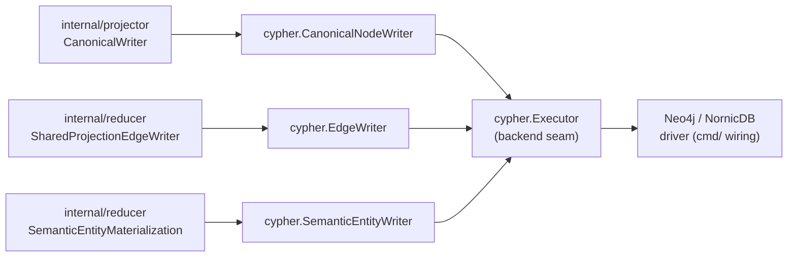
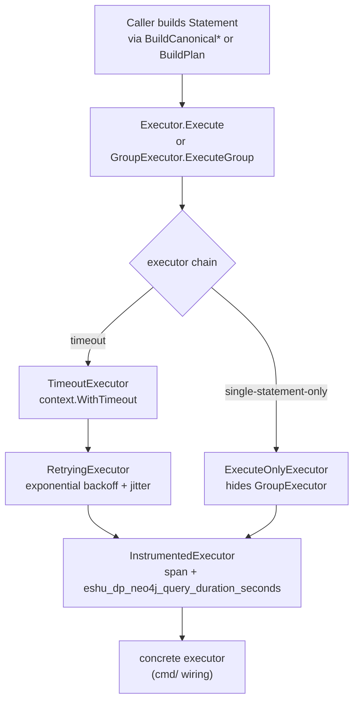

# storage/cypher

`storage/cypher` owns backend-neutral Cypher write contracts, canonical writers,
edge helpers, statement metadata, retry/timeout wrappers, and write
instrumentation for Eshu's canonical graph. Every write path that touches the
graph backend goes through this package.

## Where this fits in the pipeline

## Internal flow

## Lifecycle / workflow

Callers build `Statement` values via statement builder functions
(`BuildCanonicalWorkloadUpsert` and related, `BuildRetractRepoDependencyEdges` and
related, `BuildPlan`) and pass them to a writer
(`CanonicalNodeWriter`, `EdgeWriter`, `SemanticEntityWriter`) or directly to
an `Executor`.

`CanonicalNodeWriter.Write` executes all canonical writes in named phases:
`retract`, `repository_cleanup`, `repository`, `directories`, `files`,
`entities`, `entity_retract`, `entity_containment`, `terraform_state`,
`oci_registry`, `modules`, and `structural_edges`. When the executor
implements `GroupExecutor`, all phases are sent in a single atomic transaction.
When it implements
`PhaseGroupExecutor`, each phase executes as a bounded group. Otherwise phases
run sequentially.

The `repository_cleanup` phase is the only replacement barrier left in the
canonical node path, and it is skipped for first-generation scopes because no
prior repository identity can exist for that source-local scope. Directory rows
use depth-ordered `MERGE` after the
repository is present. File rows update current nodes in place with
`MATCH (f:File {path: row.path})`, then send only missing rows through a
`WHERE NOT EXISTS { MATCH (:File {path: row.path}) }` guard before `MERGE`.
Nested files require a parent `Directory` match for the directory containment
edge. Repository-root files use a separate Repository-contained statement shape
so package entrypoint files can materialize without inventing a root
`Directory`. This avoids NornicDB's expensive `DETACH DELETE` cost for current
directories or files. Entity property filtering also keeps high-volume analysis
metadata such as `dead_code_root_kinds` and `exactness_blockers` out of
canonical graph rows; the dead-code API merges that evidence from the content
store by entity ID.

Current-file structural edge refreshes seed from indexed `File.path` before
expanding `IMPORTS` or directory `CONTAINS` relationships. This keeps the
cleanup candidate set path-first instead of relationship-scan-first on NornicDB
while preserving the same Cypher semantics for Neo4j-compatible backends.
Positive string-slice retract statements can be chunked through
`ChunkPositiveStringSliceRetractStatement`; negative `NOT IN` stale cleanup is
intentionally excluded from chunking.
Stale-file retracts anchor on `Repository {id}` and traverse `REPO_CONTAINS`
before applying the generation and keep-list predicates. This avoids starting
from the full `File` label population when a webhook-triggered re-index needs
to remove files that disappeared from one repository.

No-Regression Evidence: `go test ./internal/storage/cypher -run
'TestChunkPositiveStringSliceRetractStatement|TestCanonicalNodeRefreshStructuralEdgesSeedsFromFilePath'
-count=1` proves the indexed seed shape and protects current-file keep-list
semantics.

No-Regression Evidence: `go test ./internal/storage/cypher ./cmd/ingester
./cmd/bootstrap-index ./cmd/projector -count=1` keeps canonical writer, NornicDB
phase-group executor, bootstrap, and projector wiring covered after adding
source-local canonical writer tracing and repository-anchored stale-file
retracts.

Observability Evidence: statement summaries and operation metadata stay on each
chunked statement, and source-local canonical writes now wrap the writer in
`canonical.write` plus the retract phase in `canonical.retract`. Phase failures
also emit a structured `canonical phase failed` log with scope, generation,
repo, phase, mode, statement count, duration, and error, while existing
`canonical phase-group write` logs and graph failure details still identify the
phase and sanitized first statement.

Code-call shared projection routes `CALLS`, `REFERENCES`, and `USES_METACLASS`
through label-scoped batched edge statements when endpoint labels are known.
Each code-call statement carries a bounded route summary with relationship,
source label, target label, and row count so slow shared-edge logs can be tied
back to the exact Cypher shape without exposing file paths or entity IDs.

Terraform-state rows are written as `TerraformResource`, `TerraformModule`, and
`TerraformOutput` nodes keyed by `uid`. The rows keep lineage, serial, provider
binding, tag-key hashes, and hashed correlation anchors on the node without
creating cloud-resource joins. Those joins are reducer work after the
Terraform-state readiness checkpoints exist.

OCI registry rows are written as `OciRegistryRepository`,
`ContainerImage`/`OciImageManifest`, `ContainerImageIndex`/`OciImageIndex`,
`ContainerImageDescriptor`/`OciImageDescriptor`,
`ContainerImageTagObservation`/`OciImageTagObservation`, and
`OciImageReferrer` nodes keyed by `uid`. OCI image, descriptor, tag, and
referrer rows carry `repository_id` as the durable repository join key instead
of writing repository publication or observation relationships in the canonical
hot path. Manifests, indexes, and descriptors keep their image-family labels
because API queries anchor on those labels. Digest-backed descriptor identity is
the stable image key; tag observations keep `identity_strength=weak_tag` and
point at a resolved digest without making the tag the stable image key.

Package-registry rows are written as `Package`/`PackageRegistryPackage`,
`PackageVersion`/`PackageRegistryPackageVersion`, and
`PackageDependency`/`PackageRegistryPackageDependency` nodes keyed by `uid`.
Package and package-version nodes carry PURL, BOMRef, package manager, and
source-debug identity fields; dependency nodes carry the same fields for the
target package identity.
This phase emits `HAS_VERSION`, `DECLARES_DEPENDENCY`, and
`DEPENDS_ON_PACKAGE` for package-native dependency metadata only; source
repository hints are not promoted to ownership or publication edges until
reducer correlation supplies corroborating evidence. NornicDB phase-group
execution commits package, version, dependency target package, and dependency
writes in separate ordered phase groups because later statements `MATCH`
identities created by earlier package-registry statements. Dependency target
packages and primary package rows are deduplicated before the `UNWIND MERGE`
batch so repeated rows for the same package cannot attempt the same
`Package.uid` create more than once in a NornicDB transaction. The canonical
writer also gates package-registry package identity writes by sorted package
UID across primary packages, package versions, dependency source packages, and
dependency target packages before dispatching to the backend. Same-UID package
observations therefore serialize inside one projector process while distinct
package UIDs still reach the backend concurrently. Primary package duplicates
keep the newest observed source fact and use source fact id, then stable fact
key, as deterministic tie-breakers before sorting by UID.

No-Regression Evidence: `go test ./internal/storage/cypher -run
'TestCanonicalNodeWriter(SerializesConcurrentDuplicatePackageUIDs|SerializesDependencyTargetPackageUIDs|AllowsConcurrentDistinctPackageUIDs|BuildsPackageRegistryStatements|SeparatesPackageRegistryPhaseGroups|DeduplicatesPackageRegistryDependencyTargets|DeduplicatesPackageRegistryPackages)|TestPackageRegistryIdentityLockKeysCoverPackageSources'
-count=1` proves duplicate primary and dependency-target package UID writes
serialize before backend execution, distinct package UIDs still execute
concurrently, package/version/dependency phases stay ordered, and duplicate
package rows are deduplicated before graph-write batches.

Observability Evidence: `canonical.write` spans now include
`package_registry_identity_lock_key_count` and
`package_registry_identity_lock_wait_seconds` when a materialization carries
package-registry identities. Slow same-UID waits emit a structured
`canonical package registry identity lock acquired` log with package UID,
scope, repo, generation, key count, and wait seconds. Existing phase spans,
duration metrics, phase failure logs, phase-group chunk summaries, retry logs,
and queue failure payloads still expose true backend conflicts and retries.

No-Regression Evidence: `go test ./internal/projector ./internal/storage/cypher -run 'TestBuildCanonicalMaterializationExtractsPackageRegistry|TestCanonicalNodeWriterBuildsPackageRegistryStatements' -count=1`
proves package-registry identity fields (`purl`, `bom_ref`,
`package_manager`, and source-debug fields) survive fact-to-row extraction and
the ordered Cypher row builders without changing package/version/dependency
phase ordering.

No-Observability-Change: identity fields are additional node properties on
existing package-registry phase groups. The existing canonical phase spans,
duration metrics, statement summaries, row counts, and phase failure logs still
diagnose stuck, slow, or failed package-registry graph writes.

`EdgeWriter.WriteEdges` maps a `reducer.Domain` to a batched UNWIND Cypher
template and dispatches rows in batches of `BatchSize` (default
`DefaultBatchSize` = 500). Domain-specific sub-batch sizes are available for
`DomainCodeCalls`, `DomainInheritanceEdges`, and `DomainSQLRelationships`.
`DomainCodeCalls` writes direct call evidence as `CALLS`, JSX component plus Go
and TypeScript type-reference evidence as `REFERENCES`, and Python metaclass
evidence as `USES_METACLASS`. When reducer rows include
`caller_entity_type` and `callee_entity_type`, code-call and code-reference
writes use the exact endpoint label plus `uid`; incomplete legacy rows still
use the label-family fallback.
`DomainSQLRelationships` writes SQL table, column, view, function, index, and
trigger evidence with label-scoped endpoints. Trigger rows can emit both
`TRIGGERS` to a `SqlTable` and `EXECUTES` to a `SqlFunction`; the latter is
part of dead-code reachability for stored routines and must stay in the
relationship retraction set.

`IncidentRoutingEvidenceWriter` is a reducer-owned graph writer for PagerDuty
incident routing. It writes only `IncidentRoutingEvidence` nodes and static
`HAS_INTENDED_ROUTING`, `HAS_APPLIED_ROUTING`, or `HAS_LIVE_ROUTING`
relationships between evidence nodes. The writer rejects out-of-vocabulary or
unsafe slot values before building Cypher, uses batched `UNWIND` statements,
and retracts only rows owned by `evidence_source='reducer/incident-routing'`
for the current scope.

No-Regression Evidence: `go test ./internal/storage/cypher -run
'IncidentRoutingEvidenceWriter' -count=1` proves static relationship tokens,
slot validation, scoped retraction, and grouped execution for the
incident-routing writer.

The executor chain is composed in `cmd/` wiring. A typical production chain
wraps a concrete driver executor with `TimeoutExecutor` → `RetryingExecutor` →
`InstrumentedExecutor`.

`RetryingExecutor` detects transient Neo4j errors (deadlock, lock timeout,
driver `ConnectivityError`) and NornicDB MERGE unique conflicts and retries
with exponential backoff and jitter. The same loop covers `Execute` and
`ExecuteGroup`; group retries stay limited to driver-level transient failures
or all-MERGE NornicDB commit conflicts so re-execution remains idempotent.

No-Regression Evidence: `go test ./internal/storage/cypher -run
'TestRetryingExecutor(RetriesDriverConnectivityError|ConnectivityErrorExhaustionRemainsQueueRetryable)|TestWrapRetryableNeo4jError'
-count=1` proves typed Neo4j driver connectivity failures retry locally and
remain reducer-queue retryable after the local retry budget is exhausted.

Observability Evidence: no new metric name was needed. Existing
`neo4j transient error, retrying` structured logs,
`eshu_dp_neo4j_deadlock_retries_total{write_phase}`, graph query spans, and
queue `failure_class` rows expose retry attempts, operation labels, exhausted
retry errors, and dead-letter prevention. The counter name is legacy and now
tracks this package's broader transient graph-write retry class.

## Exported surface

**Core types**

- `Statement` — one executable Cypher statement: `Operation`, `Cypher`,
  `Parameters`
- `Plan` — deterministic write plan for one source-local materialization; built
  by `BuildPlan`
- `Operation` — string constant for write type; defined variants:
  `OperationUpsertNode`, `OperationDeleteNode`, `OperationCanonicalUpsert`
- `Executor` — the backend seam: `Execute(ctx, Statement) error`; every
  concrete backend implements this
- `GroupExecutor` — extension of `Executor` for atomic multi-statement writes
- `PhaseGroupExecutor` — extension for bounded phase-grouped writes
- `Adapter` — source-local record writer that builds and executes a `Plan`

**Executor wrappers** (composable chain links)

- `InstrumentedExecutor` — wraps `Executor` with OTEL span and
  `eshu_dp_neo4j_query_duration_seconds` histogram
- `RetryingExecutor` — wraps `Executor` with exponential backoff/jitter for
  transient Neo4j and NornicDB errors
- `TimeoutExecutor` — bounds individual statements with a child context;
  returns `GraphWriteTimeoutError` on deadline
- `ExecuteOnlyExecutor` — hides `GroupExecutor` from callers that must not use
  large atomic groups

**Canonical writers**

- `CanonicalNodeWriter` — writes `projector.CanonicalMaterialization` in strict
  phase order; constructed with `NewCanonicalNodeWriter`; configure per-label
  batch sizes via `WithEntityLabelBatchSize` and containment mode via
  `WithEntityContainmentInEntityUpsert`
- `EdgeWriter` — writes shared-domain edge rows for
  `reducer.SharedProjectionEdgeWriter`; constructed with `NewEdgeWriter`
- `CloudResourceEdgeWriter` — writes canonical AWS relationship edges between
  `CloudResource` nodes for the AWS relationship materialization reducer domain
  (issue #805 PR 2); constructed with `NewCloudResourceEdgeWriter`. Uses batched
  `UNWIND` + `MATCH` source / `MATCH` target / static-type `MERGE` edge so a
  missing endpoint is a no-op, idempotent on
  `(source_uid, relationship_type, target_uid)`, with an evidence-source-scoped
  retract
- `S3InternetExposureNodeWriter` — writes reducer-owned S3 internet-exposure
  properties onto existing S3 `CloudResource` nodes (issue #1232); constructed
  with `NewS3InternetExposureNodeWriter`. Uses batched `UNWIND` + `MATCH
  (resource:CloudResource {uid})` and never `MERGE`, so a missing bucket node is
  a no-op rather than a fabricated node. Unknown exposure rows set
  `s3_internet_exposure_state=unknown` and remove the boolean
  `s3_internet_exposed` property. Retract removes only
  `s3_internet_exposure_*` properties scoped by reducer evidence source and
  scope id.
- `EC2InternetExposureNodeWriter` — writes reducer-owned EC2 internet-exposure
  properties onto existing EC2 `CloudResource` nodes (issue #1301); constructed
  with `NewEC2InternetExposureNodeWriter`. Uses batched `UNWIND` + `MATCH
  (resource:CloudResource {uid})` and never `MERGE`, so a missing EC2 instance
  node is a no-op rather than a fabricated node. Unknown exposure rows set
  `ec2_internet_exposure_state=unknown` and remove the boolean
  `ec2_internet_exposed` property. Retract removes only
  `ec2_internet_exposure_*` properties scoped by reducer evidence source and
  scope id.

  Benchmark Evidence: `go test ./internal/storage/cypher -run '^$' -bench
  BenchmarkEC2InternetExposureNodeWriter -benchmem -count=3` writes 5,000 rows
  at batch 500 in `1.35 ms/op`, `1.33 ms/op`, and `1.33 ms/op` on darwin/arm64
  Apple M4 Pro, about `1.97 MB/op` and `25,068 allocs/op`.
  No-Regression Evidence: `go test ./internal/storage/cypher -run
  EC2InternetExposure -count=1` proves empty-row no-op behavior, uid-anchored
  MATCH+SET, no node fabrication, scope/evidence annotation, unknown boolean
  removal, raw public-IP redaction, and property-only retract.
  Observability Evidence: statement summaries and operation metadata
  (`phase=ec2_internet_exposure`, `label=CloudResource:EC2InternetExposure`)
  ride each statement for the existing InstrumentedExecutor
  `eshu_dp_neo4j_query_duration_seconds` and `eshu_dp_neo4j_batch_size`
  metrics; the reducer handler owns the EC2 exposure domain counters and
  completion log.
- `EC2BlockDeviceKMSPostureNodeWriter` — writes reducer-owned EC2 block-device
  KMS posture properties onto existing EC2 `CloudResource` nodes (issue #1304);
  constructed with `NewEC2BlockDeviceKMSPostureNodeWriter`. Uses batched
  `UNWIND` + `MATCH (resource:CloudResource {uid})` + `SET`, never `MERGE` or
  `CREATE`, so missing EC2 nodes are no-ops rather than fabricated nodes. Scoped
  retract removes only `ec2_block_device_*` posture fields owned by
  `reducer/ec2-block-device-kms-posture`.
- `S3ExternalPrincipalGrantWriter` — writes metadata-only S3 bucket-policy
  access evidence as `(:CloudResource)-[:GRANTS_ACCESS_TO]->(:ExternalPrincipal)`
  graph truth for issue #1231; constructed with
  `NewS3ExternalPrincipalGrantWriter`. Uses batched `UNWIND` + `MATCH
  (source:CloudResource {uid})` so missing source buckets cannot be fabricated,
  `MERGE (principal:ExternalPrincipal {uid})` on a stable principal kind/value
  identity, and a static `GRANTS_ACCESS_TO` relationship token validated against
  a closed vocabulary before interpolation. Optional principal account,
  partition, and service metadata update only when the incoming row carries a
  non-empty value, so partial later facts cannot clear bounded identity
  metadata. Retract deletes only reducer-owned edges scoped by edge `scope_id`
  and `evidence_source`, leaving global `ExternalPrincipal` identities in place.

  Benchmark Evidence: `go test ./internal/storage/cypher -run '^$' -bench
  'BenchmarkS3ExternalPrincipalGrantWriter|BenchmarkS3LogsToEdgeWriter|BenchmarkCloudResourceEdgeWriter|BenchmarkCloudResourceNodeWriter'
  -benchmem -benchtime=100x` shaped 5,000 node+edge rows at batch 500 in
  `3.28 ms/op` (`6.49 MB/op`, `35,072 allocs/op`) on darwin/arm64 Apple M4 Pro,
  with no per-row graph round trip.
  No-Regression Evidence: `go test ./internal/storage/cypher -run
  S3ExternalPrincipalGrant -count=1` proves the source `MATCH`, bounded
  `ExternalPrincipal` MERGE, static relationship token, optional-metadata
  preservation, raw-policy redaction, batching, and scoped retract.
  Observability Evidence: statement summaries and operation metadata
  (`phase=s3_external_principal_grant`, `label=ExternalPrincipal`) ride each
  statement for the InstrumentedExecutor's graph query duration and batch-size
  metrics; the reducer handler owns the domain span and completion log.
- `KubernetesWorkloadNodeWriter` — writes canonical `KubernetesWorkload` nodes
  for the live-workload materialization reducer domain (issue #388);
  constructed with `NewKubernetesWorkloadNodeWriter`. Batched `UNWIND` +
  `MERGE (w:KubernetesWorkload {uid: row.uid})` on the collector-emitted
  `object_id` only, mutable properties `SET` separately, idempotent under
  retries and duplicate facts. Mirrors the proven CloudResource node writer so
  it engages the same schema-backed uid lookup; the #388 edge slice (PR3)
  resolves its workload endpoint against these nodes
- `EC2InstanceNodeWriter` — writes canonical EC2 instance `:CloudResource` nodes
  for the EC2 instance node materialization reducer domain (issue #1146 PR-A);
  constructed with `NewEC2InstanceNodeWriter`. Batched `UNWIND` +
  `MERGE (r:CloudResource {uid: row.uid})` on the canonical
  `cloud_resource_uid` identity only, with the ten derived posture
  booleans/scalars (IMDS, user-data presence, monitoring, public-IP,
  `instance_profile_arn`, tenancy, Nitro) `SET` separately. Reuses the existing
  `:CloudResource` label + `cloud_resource_uid_unique` constraint (no new schema
  DDL); the only difference from the #805 CloudResource node writer is the extra
  posture `SET` properties. NEVER carries user-data content (only the
  `user_data_present` boolean), the raw public IP, or per-volume block devices.
  The future `USES_PROFILE` edge (#1146 PR-B) resolves its instance endpoint
  against these nodes
- `KubernetesCorrelationEdgeWriter` — writes canonical `RUNS_IMAGE` edges from a
  `KubernetesWorkload` node to the digest-addressed OCI source node it runs, for
  the live-workload correlation materialization reducer domain (issue #388 PR3);
  constructed with `NewKubernetesCorrelationEdgeWriter`. Batched `UNWIND` +
  `MATCH (w:KubernetesWorkload {uid})` / `MATCH (img:<OciImage*> {uid})` /
  static-type `MERGE (w)-[rel:RUNS_IMAGE]->(img)` so a missing endpoint is a
  no-op (never a fabricated node), grouped by the source-node label which is
  validated against the closed OCI source vocabulary
  (`OciImageManifest`/`OciImageIndex`/`OciImageDescriptor`) before
  interpolation. Idempotent on `(workload_uid, RUNS_IMAGE, source_uid)`, with an
  evidence-source-scoped, edge-`scope_id`-filtered retract

  Performance Evidence: `go test ./internal/storage/cypher -run '^$' -bench
  BenchmarkKubernetesCorrelationEdgeWriter -benchmem -benchtime=200x` shaped
  5,000 edges at batch 500 in `1.14 ms/op` (`2.16 MB/op`, `25,098 allocs/op`) on
  darwin/arm64 (Apple M3 Pro), no-op group executor.
  No-Regression Evidence: faster and leaner than the proven
  `BenchmarkCloudResourceEdgeWriter` (`1.81 ms/op`, `3.89 MB/op`) and
  `BenchmarkObservabilityCoverageEdgeWriter` (`1.71 ms/op`) baselines on the same
  machine and input shape because the row carries fewer properties and one static
  relationship type; the write is bounded by `ceil(E/batchSize)` statements with
  no per-edge graph round trip. `go test ./internal/storage/cypher -run
  TestKubernetesCorrelationEdgeWriter -count=1` proves the MATCH-MATCH-MERGE
  shape, the closed-vocabulary source-label hardening, batching, atomic grouping,
  scope/evidence annotation, and the edge-scoped retract.
  Observability Evidence: statement summaries and operation metadata
  (`phase=kubernetes_correlation_edge`, `label=RUNS_IMAGE`) ride each statement
  for the InstrumentedExecutor's `eshu_dp_neo4j_query_duration_seconds` /
  `eshu_dp_neo4j_batch_size`; the reducer handler owns the
  `eshu_dp_kubernetes_correlation_edges_total` counter and completion log.
- `IAMEscalationEdgeWriter` — writes canonical `CAN_ESCALATE_TO` privilege-
  escalation edges between an IAM principal `CloudResource` node and the IAM
  target `CloudResource` node it can escalate to, for the IAM escalation
  materialization reducer domain (issue #1134 PR3); constructed with
  `NewIAMEscalationEdgeWriter`. Batched `UNWIND` +
  `MATCH (p:CloudResource {uid})` / `MATCH (t:CloudResource {uid})` /
  static-type `MERGE (p)-[rel:CAN_ESCALATE_TO]->(t)` so a missing endpoint is a
  no-op (never a fabricated node). Both endpoints are the uniform `CloudResource`
  label and the relationship type is the static `CAN_ESCALATE_TO` token, so the
  writer interpolates no data-driven token. The escalation primitive set lives in
  an edge property (`rel.primitives`), never in the MERGE key — so the MERGE keys
  on the stable `(principal_uid, CAN_ESCALATE_TO, target_uid)` identity and stays
  on NornicDB's relationship hot path. Idempotent on that triple, with an
  evidence-source-scoped, edge-`scope_id`-filtered retract. Security-sensitive: it
  persists only the conservatively-resolved rows the extractor produced.

  Performance Evidence: `go test ./internal/storage/cypher -run '^$' -bench
  BenchmarkIAMEscalationEdgeWriter -benchmem` shaped 5,000 edges at batch 500 in
  `~1.33 ms/op` (`~1.97 MB/op`, `~25,068 allocs/op`) on darwin/arm64 (Apple M4
  Pro), no-op group executor — same shape class as the proven `RUNS_IMAGE`
  (`1.14 ms/op`) and reachability writers; bounded by `ceil(E/batchSize)`
  statements with no per-edge graph round trip.
  No-Regression Evidence: the edge family adds one static-token MERGE shape over
  two uid-indexed CloudResource anchors, identical to the already-measured #388 /
  #1135 writers; `go test ./internal/storage/cypher -run TestIAMEscalation
  -count=1` proves the static-type MATCH-MATCH-MERGE, the primitive-out-of-MERGE-
  key contract, batching, scope/evidence annotation, and the edge-scoped retract.
  Observability Evidence: statement summaries and operation metadata
  (`phase=iam_escalation_edge`, `label=CAN_ESCALATE_TO`) ride each statement for
  the InstrumentedExecutor's `eshu_dp_neo4j_query_duration_seconds` /
  `eshu_dp_neo4j_batch_size`; the reducer handler owns the
  `eshu_dp_iam_escalation_edges_total` / `eshu_dp_iam_escalation_skipped_total`
  counters and completion log.
- `IAMCanPerformEdgeWriter` — writes canonical identity-policy-only `CAN_PERFORM`
  effective-permission edges between an IAM principal `CloudResource` node and the
  resource `CloudResource` node an identity policy grants a catalogued sensitive
  action on, for the IAM CAN_PERFORM materialization reducer domain (issue #1134
  PR4a); constructed with `NewIAMCanPerformEdgeWriter`. Batched `UNWIND` +
  `MATCH (p:CloudResource {uid})` / `MATCH (r:CloudResource {uid})` /
  static-type `MERGE (p)-[rel:CAN_PERFORM]->(r)` so a missing endpoint is a no-op
  (never a fabricated node). Both endpoints are the uniform `CloudResource` label
  and the relationship type is the static `CAN_PERFORM` token, so the writer
  interpolates no data-driven token. The granted action set lives in an edge
  property (`rel.actions`), never in the MERGE key — so the MERGE keys on the
  stable `(principal_uid, CAN_PERFORM, resource_uid)` identity and stays on
  NornicDB's relationship hot path; the edge also carries `rel.action_count` and
  the honesty label `rel.evaluation_scope = identity_policy_only`. Idempotent on
  that triple, with an evidence-source-scoped, edge-`scope_id`-filtered retract.
  Security-sensitive: it persists only the conservatively-resolved rows the
  extractor produced.

  Benchmark Evidence: `go test ./internal/storage/cypher -run '^$' -bench
  'BenchmarkIAMCanPerformEdgeWriter|BenchmarkIAMEscalationEdgeWriter' -benchmem
  -count=3` shaped 5,000 edges at batch 500 in `~1.28 ms/op` (`~1.97 MB/op`,
  `25,068 allocs/op`), no-op group executor — within ~3% of the shipped
  `CAN_ESCALATE_TO` writer baseline on the identical row shape, well under the 10%
  stop threshold; bounded by `ceil(E/batchSize)` statements with no per-edge graph
  round trip.
  No-Regression Evidence: the edge family adds one static-token MERGE shape over
  two uid-indexed CloudResource anchors, identical to the already-measured #1134
  PR3 / #388 / #1135 writers; `go test ./internal/storage/cypher -run
  TestIAMCanPerform -count=1` proves the static-type MATCH-MATCH-MERGE, the
  actions-out-of-MERGE-key contract, the `identity_policy_only` honesty label,
  batching, scope/evidence annotation, and the edge-scoped retract.
  Observability Evidence: statement summaries and operation metadata
  (`phase=iam_can_perform_edge`, `label=CAN_PERFORM`) ride each statement for the
  InstrumentedExecutor's `eshu_dp_neo4j_query_duration_seconds` /
  `eshu_dp_neo4j_batch_size`; the reducer handler owns the
  `eshu_dp_iam_can_perform_edges_total` / `eshu_dp_iam_can_perform_skipped_total`
  counters and completion log.
- `RDSPostureNodeWriter` — stamps RDS security and operations posture properties
  onto existing RDS DB instance and Aurora cluster `CloudResource` nodes for the
  RDS posture materialization reducer domain (issue #1233); constructed with
  `NewRDSPostureNodeWriter`. Batched `UNWIND` +
  `MATCH (r:CloudResource {uid})` + `SET` keeps the writer node-property-only:
  a missing RDS node is a no-op and the writer never `MERGE`s or `CREATE`s a
  CloudResource. The scoped retract matches only nodes with
  `rds_posture_scope_id` and `rds_posture_evidence_source`, then `REMOVE`s only
  reducer-owned `rds_*` posture fields.

  No-Regression Evidence: `go test ./internal/storage/cypher -run
  RDSPosture -count=1` proves empty-row no-op behavior, uid-anchored MATCH+SET,
  no node fabrication, scope/evidence annotation, and property-only retract.
  Observability Evidence: statement summaries and operation metadata
  (`phase=rds_posture`, `label=CloudResource:RDSPosture`) ride each statement
  for the existing InstrumentedExecutor `eshu_dp_neo4j_query_duration_seconds`
  and `eshu_dp_neo4j_batch_size` metrics; no new metric name or label was
  required.
- `EC2BlockDeviceKMSPostureNodeWriter` — stamps bounded EC2 block-device KMS
  posture properties (`ec2_block_device_kms_state`, reason, volume counts,
  unresolved count, sorted volume ids, and sorted KMS key ids) onto existing EC2
  `CloudResource` nodes for issue #1304. It is node-property-only: a missing EC2
  node is a no-op, the writer never creates CloudResource nodes, and the scoped
  retract removes only reducer-owned `ec2_block_device_*` properties.

  Tests cover empty-row no-op behavior, uid-anchored MATCH+SET, no node
  fabrication, scope/evidence annotation, and property-only retract. Statement
  summaries and operation metadata (`phase=ec2_block_device_kms_posture`,
  `label=CloudResource:EC2BlockDeviceKMSPosture`) ride each statement for the
  existing graph query duration and batch-size metrics. Durable benchmark
  evidence lives in `docs/public/reference/local-performance-envelope.md`.
- `SemanticEntityWriter` — writes semantic entity (Annotation, Module, etc.)
  nodes; five constructors select the Cypher row shape

**Statement builders**

- `BuildPlan(materialization)` — converts a `graph.Materialization` to a
  source-local `Plan`
- `BuildCanonical*Upsert` functions — construct `Statement` values for canonical
  domain nodes: `BuildCanonicalWorkloadUpsert`,
  `BuildCanonicalWorkloadInstanceUpsert`, `BuildCanonicalRuntimePlatformUpsert`,
  `BuildCanonicalInfrastructurePlatformUpsert`,
  `BuildCanonicalDeploymentSourceUpsert`, `BuildCanonicalRepoDependencyUpsert`,
  `BuildCanonicalWorkloadDependencyUpsert`, `BuildCanonicalCodeCallUpsert`,
  `BuildCanonicalRepoRelationshipUpsert`, `BuildCanonicalRunsOnUpsert`
- Statement retraction builders — produce edge and node retraction statements:
  `BuildRetractInfrastructurePlatformEdges`, `BuildRetractRepoDependencyEdges`,
  `BuildRetractWorkloadDependencyEdges`, `BuildRetractCodeCallEdges`,
  `BuildRetractInheritanceEdges`, `BuildRetractSQLRelationshipEdges`,
  `BuildRetractSQLRelationshipEdgeStatements`, `BuildDeleteOrphanPlatformNodes`

**Read / check**

- `CypherReader` — interface for read-only existence queries
- `CanonicalNodeChecker` — short-circuit guard built from `CypherReader`;
  `HasCanonicalCodeTargets` avoids expensive label-free MATCH scans when no
  canonical code nodes exist

**Errors**

- `GraphWriteTimeoutError` — emitted by `TimeoutExecutor`; implements
  `Retryable() bool` and `FailureClass() string`
- `WrapRetryableNeo4jError(err)` — wraps transient errors for the edge writer

## Dependencies

- `internal/graph` — `graph.Materialization`, `graph.Record`, `graph.Result`
  for source-local plan building
- `internal/projector` — `projector.CanonicalMaterialization` and row types
  consumed by `CanonicalNodeWriter`
- `internal/reducer` — `reducer.Domain` constants and
  `reducer.SharedProjectionIntentRow` consumed by `EdgeWriter`
- `internal/telemetry` — `telemetry.Instruments`, span and attribute helpers

Concrete Neo4j/NornicDB driver adapters live in `cmd/` wiring packages, not in
this package. This package owns the backend-neutral writer contracts; `cmd/`
owns the wiring. NornicDB owns the promoted runtime path. Any additional
Cypher/Bolt backend must run these shared statements or use a small, documented
adapter seam.

## Telemetry

- `eshu_dp_neo4j_query_duration_seconds` — histogram per statement;
  `operation=write` or `operation=write_group`
- `eshu_dp_neo4j_batch_size` — batch row count per `UNWIND` statement; grouped
  Neo4j/Bolt execution records one point per statement with bounded
  `operation`, `write_phase`, and `node_type` labels when metadata is present
- `eshu_dp_neo4j_batches_executed_total` — counter labeled by `operation` plus
  bounded statement metadata when available
- `eshu_dp_neo4j_deadlock_retries_total` — legacy counter in
  `RetryingExecutor` labeled by `write_phase`; counts transient graph-write
  retries, including deadlocks, lock timeouts, driver connectivity errors, and
  retryable NornicDB commit conflicts
- `eshu_dp_canonical_atomic_writes_total` / `eshu_dp_canonical_atomic_fallbacks_total`
  — whether `CanonicalNodeWriter` used the group or sequential path
- `eshu_dp_canonical_phase_duration_seconds` — labeled by phase name
- `eshu_dp_canonical_projection_duration_seconds` / `eshu_dp_canonical_retract_duration_seconds`
  — canonical write and retract totals
- `eshu_dp_shared_edge_write_groups_total` / `eshu_dp_shared_edge_write_group_duration_seconds`
  / `eshu_dp_shared_edge_write_group_statement_count` — edge writer group metrics
- `eshu_dp_code_call_edge_batches_total` / `eshu_dp_code_call_edge_batch_duration_seconds`
  — code-call-specific edge metrics
- Spans: `neo4j.execute` and `neo4j.execute_group` from `InstrumentedExecutor`

## Operational notes

- Manual Neo4j or NornicDB production-profile performance runs must apply
  `eshu-bootstrap-data-plane` before indexing. `eshu-bootstrap-index` applies the
  Postgres bootstrap schema, but it does not apply graph indexes or constraints;
  runs that skip the data-plane schema step are setup diagnostics, not backend
  acceptance evidence.
- `eshu_dp_neo4j_deadlock_retries_total` rising signals transient graph-write
  retry pressure. Check structured retry logs first: deadlocks or NornicDB
  unique conflicts usually point at concurrent MERGE contention on shared nodes
  (Repository, Directory, Module), while driver `ConnectivityError` points at
  backend reachability, pool pressure, restart, or network churn. Check worker
  concurrency before raising `RetryingExecutor.MaxRetries`.
- `eshu_dp_canonical_atomic_fallbacks_total` > 0 means the executor does not
  implement `GroupExecutor`; write ordering relies on sequential phase execution
  which is slower and non-atomic.
- `eshu_dp_canonical_phase_duration_seconds{phase="retract"}` elevated for
  non-first generations indicates stale node volume or an unselective cleanup
  shape; source-local entity retractions and containment refreshes must stay
  anchored on concrete labels (`Function`, `Class`, `K8sResource`, etc.) so
  graph backends can use the schema indexes instead of scanning all canonical
  nodes.
- Repository-scoped cleanup runs only when the materialization carries a
  repository id. Non-repository collectors such as OCI registry and package
  registry write their own canonical nodes and must not issue `File`,
  `Directory`, or repo-bound entity cleanup against a populated graph.
- `GraphWriteTimeoutError` surfaces as `failure_class=graph_write_timeout` in
  projector/reducer queue rows; the `TimeoutHint` field names the env var to
  tune.

No-Regression Evidence: `go test ./internal/storage/cypher -run
TestCanonicalNodeWriterSkipsRepositoryRetractForNonRepositoryProjection -count=1`
proves OCI/package canonical materializations no longer emit repository-scoped
retract statements. The remote full-corpus Compose gate on 2026-05-19 drained
`896` git scopes, `1` OCI registry scope, `1` package registry scope, and `1`
Terraform-state scope with projector `917` succeeded / `58` superseded, reducer
`7458` succeeded, and no `projection failed`, `graph_write_timeout`, failed,
retrying, or dead-letter rows.

Observability Evidence: existing `eshu_dp_canonical_phase_duration_seconds`,
`eshu_dp_projector_stage_duration_seconds`, and structured `projection failed`
logs expose the phase, source system, generation id, failure class, and timeout
hint when repository cleanup is slow or mis-scoped.

Performance Evidence: a 2026-05-21 full-corpus remote Compose run against
NornicDB v1.1.1 plus the transaction-router fix drained `896` accepted
repositories but dead-lettered one OCI registry `source_local` item after three
`120s` `graph_write_timeout` attempts in `phase=oci_registry`. Focused probes
against the populated graph showed 20-row multi-label OCI node-only `MERGE`
completed in `5ms`, while 20-row `PUBLISHES_DESCRIPTOR` relationship writes
took about `51s` and relationship `CREATE` variants still timed out at `30s` to
`65s`. A single-label `MERGE` plus `SET n:ContainerImage` probe completed in
`6ms` but did not persist the added label in NornicDB, so the canonical OCI
writer keeps multi-label node identities for query accuracy and skips
relationship writes until a measured relationship writer exists.

Performance Evidence: after removing OCI registry relationship writes, the
`oci-relfix-full-20260521T233652Z` remote Compose proof with pprof enabled
reached queue-zero at `2026-05-21T23:52:03Z`: fact work items were `8389/8389`
succeeded with `0` failed, retrying, or dead-letter rows. The OCI registry
collector completed `1` configured scope; the `oci_registry` canonical phase
wrote `4` statements in about `40ms`, and the source-local OCI projection
completed `212` facts in about `69ms`. Shared projections also completed
`344592/344592` code-call rows and `1188/1188` repo-dependency rows. A
preserved-volume restart then recovered the API, MCP, reducer, ingester,
workflow, webhook, and collectors, and reached a no-pending queue sample again
with only succeeded work rows.

No-Regression Evidence: `go test ./internal/storage/cypher -run
'TestCanonicalNodeWriter(BuildsOCIRegistryStatements|OCIRegistrySkipsRelationshipWrites|OCIRegistryKeepsImageFamilyLabels)' -count=1`
proves OCI canonical statements retain digest/tag/referrer nodes, keep
image-family labels used by the read surface, and do not emit `PUBLISHES_*` or
`OBSERVED_*` relationship writes in the hot path.

Observability Evidence: existing canonical phase duration metrics, projector
stage duration metrics, and structured `projection failed` logs expose the
`oci_registry` phase, source system, generation id, and NornicDB error text.
Workflow and fact work-item rows surface the same failed projection through
retry, failed, and dead-letter state without adding a new metric label.

### AWS relationship edge writer (issue #805 PR 2)

`CloudResourceEdgeWriter` projects resolved `aws_relationship` facts into
relationship-type-specific
`(:CloudResource)-[:AWS_<raw relationship_type>]->(:CloudResource)` edges while
keeping the original `relationship_type` property for readback. Both endpoints
anchor on the `CloudResource.uid` uniqueness constraint and the
`nornicdb_cloud_resource_uid_lookup` index PR 1 added, so the two `MATCH`es are
schema-backed lookups, not label scans; the logical identity remains
`(source, relationship_type, target)`, including case. Full design and decision
record: `docs/internal/aws-relationship-edge-materialization-design.md`
§5–§11.

Benchmark Evidence: `go test ./internal/storage/cypher -run '^$' -bench
BenchmarkCloudResourceEdgeWriter -benchmem -count=1` on darwin/arm64 (Apple M3
Pro), no-op group executor so the number isolates Eshu-side work: `5,000`
resolved edge rows shaped into relationship-type-grouped batched
`MATCH-MATCH-MERGE` statements at the default `500`/UNWIND ran `2.31 ms/op`,
`3.89 MB/op`, `40,099 allocs/op`. The write side is bounded by distinct
relationship types times `ceil(E_type/batchSize)` statements, so there is no
per-edge round trip and no N+1. The bounded in-memory join is proven separately
by `BenchmarkExtractAWSRelationshipEdgeRows` in `go/internal/reducer`.

Performance Evidence: a remote NornicDB-backed Compose probe against a
populated graph showed the previous property-map relationship `MERGE` timed out
at `20s` for 12 rows, while the static relationship-type `MERGE` completed in
`0-1ms` per 12-row relationship-type batch for the same endpoint and row shape.
The same probe retracted 24 temporary edges with the evidence-source/scope
delete in about `2.1s`. A follow-up probe confirmed NornicDB accepts the
case-preserving lower-case static token shape (`AWS_uses_kms_key`) with a `0ms`
single-row upsert. `go test ./internal/storage/cypher -run
TestCloudResourceEdgeWriter -count=1` proves the MATCH-MATCH-MERGE shape,
batching, atomic group dispatch, evidence-source-scoped retract, unsafe
relationship-type rejection, case-preserving identity, and no-fabrication
invariant.

Observability Evidence: every edge statement and group flows through the
production `InstrumentedExecutor`, recording
`eshu_dp_neo4j_query_duration_seconds` (operation=write) and
`eshu_dp_neo4j_batch_size`. The reducer handler adds the
`eshu_dp_aws_relationship_edges_total` counter dimensioned by
`relationship_type` and `join_mode`
(arn / bare_id / correlation_anchor / unresolved), the
`reducer.aws_relationship_materialization` span, and an `aws relationship
materialization completed` structured log with per-stage durations and the
resolved/unresolved tallies, so an operator can tell which AWS relationship
target types are losing edges and whether it is because the target service was
not scanned in this scope.

### Kubernetes live-workload node writer (issue #388)

`KubernetesWorkloadNodeWriter` materializes `kubernetes_live.pod_template` facts
into canonical `KubernetesWorkload` nodes for the live-workload materialization
reducer domain. The write is a batched `UNWIND $rows AS row` +
`MERGE (w:KubernetesWorkload {uid: row.uid})` on the collector-emitted
`object_id` only, with mutable properties `SET` separately, so duplicate facts
and reducer retries converge on one node rather than fabricating or duplicating
graph state. The node `uid` is the live object identity (`object_id`); the raw
Kubernetes `metadata.uid` is carried as the `workload_uid` property only, never
the node identity. The MERGE anchors on the `kubernetes_workload_uid_unique`
constraint and the `nornicdb_kubernetes_workload_uid_lookup` index (both added
to `go/internal/graph/schema.go`), so the upsert is a schema-backed uid lookup,
not a label scan. The #388 edge slice (PR3) resolves its workload endpoint
against these nodes exactly as the AWS relationship edge resolves against
`CloudResource` nodes. Design and decision record:
`docs/internal/design/388-kubernetes-workload-node.md`.

Benchmark Evidence: `go test ./internal/storage/cypher -run '^$' -bench
BenchmarkKubernetesWorkloadNodeWriter -benchmem -benchtime=200x` on darwin/arm64
(Apple M3 Pro), no-op group executor so the number isolates Eshu-side statement
construction and batching: `5,000` pod-template-backed node rows shaped into
default `500`/UNWIND batches ran `2.73 ms/op`, `6.33 MB/op`, `25,069
allocs/op` — within noise of the proven `BenchmarkCloudResourceNodeWriter`
baseline on the same machine and input shape (`2.76 ms/op`, `6.33 MB/op`,
`25,068 allocs/op`), because the writer reuses the identical UNWIND-batched
MERGE-on-uid shape. No-Regression Evidence: the new node-write path adds no new
per-row cost over the established CloudResource node writer; the write is bounded
by `ceil(W/batchSize)` statements with no per-node round trip and no N+1.
`go test ./internal/storage/cypher -run TestKubernetesWorkloadNodeWriter
-count=1` proves the MERGE-on-uid identity, batching, atomic group dispatch,
evidence-source annotation, and empty-rows no-op.

Observability Evidence: every node statement and group flows through the
production `InstrumentedExecutor`, recording
`eshu_dp_neo4j_query_duration_seconds` (operation=canonical_upsert) and
`eshu_dp_neo4j_batch_size`; each statement carries `phase=kubernetes_workload`
and `label=KubernetesWorkload` statement metadata. The reducer handler adds the
`eshu_dp_kubernetes_workload_nodes_total` counter (dimension: `domain`), a
`kubernetes workload materialization completed` structured log with per-stage
durations (fact load, extract, graph write, phase publish) and the node count,
so an operator can see how many live-workload nodes one generation committed —
the substrate the later edge slice resolves against — and spot a generation that
committed zero nodes.

## Extension points

- `Executor` — implement this interface for any new graph backend; no changes
  to writers or callers are needed
- `GroupExecutor` / `PhaseGroupExecutor` — optional extensions; writers detect
  them at runtime and prefer the grouped path
- `CanonicalNodeWriter` builder options — `WithFileBatchSize`,
  `WithEntityBatchSize`, `WithEntityLabelBatchSize`,
  `WithEntityContainmentInEntityUpsert`,
  `WithBatchedEntityContainmentInEntityUpsert` — tune per-backend without
  branching callers
- New statement builders — add a `BuildCanonicalWorkloadUpsert`-style function
  or a `BuildRetractRepoDependencyEdges`-style function for each new canonical
  domain node or edge type; no writer changes needed

## Gotchas / invariants

- All writes must be idempotent (`doc.go`). `MERGE`-based Cypher and
  `ON CONFLICT DO NOTHING` patterns enforce this; do not replace MERGE with
  CREATE.
- `OperationCanonicalUpsert` is for canonical domain nodes (workloads, files,
  entities). `OperationUpsertNode` / `OperationDeleteNode` are for
  source-local `SourceLocalRecord` writes. Do not mix them.
- `CanonicalNodeWriter` phase order is strict: parent nodes (Repository,
  Directory) must exist before child nodes (File, Entity) because later phases
  use MATCH on these nodes. Identity cleanup phases run immediately before the
  corresponding MERGE phase, and `directories` are sorted by `Depth` ascending
  (`canonical_node_writer_phases.go`).
- OCI registry writes must keep `MERGE` anchored on concrete labels plus `uid`.
  Tags are mutable observations; do not use `tag` or `source_tag` as the
  manifest/index identity key. OCI labels participate in the stale-entity
  retract family, and `canonicalNodeRetractEntityLabels` includes that family in
  the generated cleanup list. OCI registry repository truth is derived from the
  `repository_id` property on digest, descriptor, index, tag-observation, and
  referrer nodes. Do not reintroduce `PUBLISHES_*` or `OBSERVED_*`
  relationships in the canonical writer without same-corpus performance proof
  that the relationship writer no longer dominates `phase=oci_registry`.
- Package-registry writes must keep `MERGE` anchored on `uid` for `Package`,
  `PackageVersion`, and `PackageDependency` labels. Do not add `Repository`
  matches or ownership edges to `package_registry_canonical_writer.go`; source
  hints need reducer admission first.

  No-Regression Evidence: `go test ./internal/projector ./internal/storage/cypher -count=1`
  on 2026-05-22 covered package-registry phase ordering with 1 package, 1
  version, and 1 dependency row. `go test ./internal/storage/cypher -run
  'TestCanonicalNodeWriterBuildsPackageRegistryStatements|TestCanonicalNodeWriterSeparatesPackageRegistryPhaseGroups|TestCanonicalNodeWriterDeduplicatesPackageRegistryDependencyTargets'
  -count=1` covers the dependency-target package split and duplicate target
  rows. The change preserves the same Cypher templates and only splits NornicDB
  phase-group commits so dependent `MATCH` statements see prior identities.
  Remote full-corpus run `vulnerability-targets-20260524T050624Z` proved the
  split plus projector retry wrapper survived repeated NornicDB package
  unique-conflict retries without a dead-letter.

  Observability Evidence: `CanonicalNodeWriter` phase logs now expose
  `phase=package_registry_packages`, `phase=package_registry_versions`, and
  `phase=package_registry_dependencies`; projector canonical-write logs expose
  `package_registry_package_count`, `package_registry_version_count`, and
  `package_registry_dependency_count`.
- Repository-root `File` rows are the exception to the Directory parent rule:
  they must attach directly to `Repository` through `REPO_CONTAINS` because
  `buildDirectoryChain` intentionally does not create a synthetic Directory for
  the repository root.
- Canonical entity containment refreshes prune stale `CONTAINS` edges from
  current `Class` and `Function` parents. Keep those cleanup statements
  label-anchored on `uid`; unlabelled UID anchors are portable Cypher but can
  miss the NornicDB and Neo4j hot path for this package's schema.
- Code reference writes must allow type targets (`Struct`, `Interface`,
  `TypeAlias`) as well as callable targets. Do not route Go composite-literal
  or TypeScript type references through `CALLS`; dead-code queries depend on
  incoming `REFERENCES` to model type usage without inventing invocation truth.
- Code-call endpoint labels are whitelist values, not caller-controlled Cypher.
  `EdgeWriter` accepts exact `Function`, `Class`, `File`, `Interface`,
  `Struct`, and `TypeAlias` labels for code relationship endpoints. This keeps
  Java, Go, Python, and TypeScript rows on NornicDB's bounded label-plus-`uid`
  lookup path instead of the broader label-family fallback. Unknown or missing
  labels still fall back to the older query shape for legacy rows.
- SQL relationship endpoint labels are also whitelist values. `EdgeWriter`
  routes `SqlTrigger` to `SqlTable` with `TRIGGERS`, `SqlTrigger` to
  `SqlFunction` with `EXECUTES`, and `SqlFunction` / `SqlView` to `SqlTable`
  with table-reference edges. Keep `EXECUTES` in both write and retract paths,
  or trigger-bound stored routines can look unreachable to dead-code queries.
- Canonical stale entity retractions run after current entity upserts and are
  emitted per projectable label, not as broad label-family `MATCH (n)` scans or
  giant `uid IN` exclusion filters. Current nodes have already been stamped with
  the new `generation_id`, so stale cleanup can use generation-only deletion
  while keeping each graph lookup bounded to one schema label.
- Terraform backend, import, moved, removed, check, and lockfile-provider
  labels are part of the projectable Terraform cleanup set. New Terraform
  parser buckets need an explicit entry there before stale-node cleanup can
  retract old facts.
- Stale File-to-entity `CONTAINS` edges are removed when stale entity nodes are
  retracted. Do not add a separate per-file relationship refresh unless a future
  ADR changes the canonical entity lifecycle; that shape is easier to make slow
  or backend-specific than the current label-anchored retraction path.
- Repository cleanup first deletes an existing `Repository` found by unique
  `path` when its `id` differs from the current repository id, then the
  `repository` phase runs the normal id-based MERGE. Keeping this in a separate
  `PhaseGroupExecutor` phase lets NornicDB validate the unique `path` after the
  delete commits and before the new id owns that path.
- `RetryingExecutor.ExecuteGroup` retries on commit-time UNIQUE conflicts
  when every statement in the group is MERGE-shaped, sharing the same
  `runWithRetry` loop as `Execute` (`retrying_executor.go:52`). Driver-
  level `session.ExecuteWrite` continues to handle Neo.TransientError.*
  codes for the group path; the Eshu retry layer adds coverage for
  Neo.ClientError.Transaction.TransactionCommitFailed when the message
  classifies as a NornicDB commit-time UNIQUE conflict. Mixed groups
  containing non-MERGE statements are not retried, preserving
  idempotency safety.
- `ExecuteOnlyExecutor` intentionally hides `GroupExecutor`. Use it when the
  caller must not hold a large atomic transaction (e.g., during source-local
  ingestion that runs concurrently with canonical projection).
- `isNornicDBMergeUniqueConflict` treats commit-time unique constraint
  violations on MERGE Cypher as retryable because a concurrent writer may have
  created the intended node between match and commit
  (`retrying_executor.go:212`). `isNornicDBCommitTimeUniqueConflict`
  matches both the older `failed to commit implicit transaction:...`
  wrapping and the v1.0.45+ `commit failed: constraint violation:...` /
  `TransactionCommitFailed` wrapping so the classifier stays current
  across pinned binaries (`retrying_executor.go:227`).
- Backend dialect differences (Cypher syntax, transaction shape, constraint
  behavior) belong in documented seams here or in `cmd/` wiring. Do not add
  product-specific branches in callers, and do not create a separate writer
  stream for Neo4j unless a future ADR explicitly rejects the shared contract.
- Performance work should first improve this package's shared writer/query
  shape. Only add backend-specific behavior after proving the shared Cypher
  contract cannot express the needed correctness or performance property.

## Related docs

- `docs/public/architecture.md` — pipeline and ownership table
- `docs/public/reference/telemetry/index.md` — metric and span reference
- `docs/public/reference/backend-conformance.md`
- `docs/public/reference/cypher-performance.md`
- `go/internal/projector/README.md` — how `CanonicalNodeWriter` is wired
