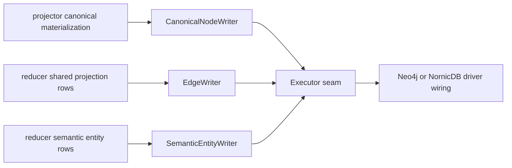

# storage/cypher

## Purpose

`storage/cypher` owns backend-neutral graph write contracts for Eshu. It builds
Cypher `Statement` values, writes canonical nodes and edges, wraps graph writes
with timeout, retry, and telemetry behavior, and keeps Neo4j and NornicDB behind
the same `Executor` seam.

Concrete driver sessions do not live here. Runtime wiring in `cmd/` chooses the
backend executor and composes the wrapper chain.

## Ownership boundary

This package owns:

- source-local write planning through `Adapter`, `BuildPlan`,
  `OperationUpsertNode`, and `OperationDeleteNode`
- canonical node writes through `CanonicalNodeWriter` and `BuildCanonical*`
  statement builders
- reducer-owned shared projection edges through `EdgeWriter`
- semantic entity row variants through `SemanticEntityWriter`
- execution contracts through `Executor`, `GroupExecutor`,
  `PhaseGroupExecutor`, and `ExecuteOnlyExecutor`
- write wrappers through `TimeoutExecutor`, `RetryingExecutor`, and
  `InstrumentedExecutor`
- statement metadata, batch metrics, spans, phase logs, and timeout errors

This package does not own driver sessions, backend startup, graph schema DDL, or
runtime-specific backend selection. Those concerns stay in `cmd/` wiring and
the storage adapter packages. Writers and callers must not branch on
`ESHU_GRAPH_BACKEND`.

## Exported surface

Use `go doc ./internal/storage/cypher` for the complete exported contract.
The stable surface groups into these roles:

| Role | Exported surface |
| --- | --- |
| Statement planning | `Statement`, `Plan`, `BuildPlan`, `Operation` |
| Canonical nodes | `CanonicalNodeWriter`, `BuildCanonical*Upsert`, `BuildRetract*` |
| Shared edges | `EdgeWriter`, `DefaultBatchSize`, domain row mapping |
| Semantic entities | `SemanticEntityWriter` constructors |
| Execution seam | `Executor`, `GroupExecutor`, `PhaseGroupExecutor`, `ExecuteOnlyExecutor` |
| Wrappers | `TimeoutExecutor`, `RetryingExecutor`, `InstrumentedExecutor` |
| Diagnostics | `GraphWriteTimeoutError`, statement metadata keys, retry helpers |
| Reads/checks | `CypherReader`, `CanonicalNodeChecker` |

The package-level contract in `doc.go` carries the godoc-facing invariants:
writes are idempotent, retry-safe, backend-neutral, and label-anchored where the
graph schema needs selectivity.

## Dependencies

- `internal/graph` supplies source-local materialization records for
  `BuildPlan`.
- `internal/projector` supplies `CanonicalMaterialization` and canonical row
  types consumed by `CanonicalNodeWriter`.
- `internal/reducer` supplies reducer domain constants and
  `SharedProjectionIntentRow` values consumed by `EdgeWriter`.
- `internal/telemetry` supplies instruments, span names, and bounded attribute
  helpers.

The backend seam is `Executor`, not a graph-driver type. New graph backends must
run the shared Cypher statements or introduce a narrow, documented adapter seam.

## Telemetry

This package emits graph-write telemetry that operators use to answer: which
phase is slow, which batch is large, which retry path fired, and which write
mode the runtime used.

| Signal | Purpose |
| --- | --- |
| `neo4j.execute`, `neo4j.execute_group` | Single and grouped write spans. |
| `eshu_dp_neo4j_query_duration_seconds` | Write duration by operation and bounded metadata. |
| `eshu_dp_neo4j_batch_size` | Rows per batched `UNWIND` statement. |
| `eshu_dp_neo4j_batches_executed_total` | Batched statements executed. |
| `eshu_dp_neo4j_deadlock_retries_total` | Retried graph write conflicts. |
| `eshu_dp_canonical_atomic_writes_total` | Canonical writes by atomic or phase mode. |
| `eshu_dp_canonical_atomic_fallbacks_total` | Writes that could not use the full atomic group path. |
| `eshu_dp_canonical_phase_duration_seconds` | Per-phase canonical write duration. |
| `eshu_dp_canonical_projection_duration_seconds` | End-to-end canonical projection duration. |
| `eshu_dp_canonical_retract_duration_seconds` | Canonical retract duration. |
| `eshu_dp_shared_edge_write_groups_total` | Grouped shared-edge writes. |
| `eshu_dp_shared_edge_write_group_duration_seconds` | Shared-edge group duration. |
| `eshu_dp_shared_edge_write_group_statement_count` | Statements per shared-edge group. |
| `eshu_dp_code_call_edge_batches_total` | Code-call edge batches. |
| `eshu_dp_code_call_edge_batch_duration_seconds` | Code-call edge batch duration. |

Structured logs include canonical phase failures and shared-edge route summaries
with domain, evidence source, execution mode, row counts, route count,
statement count, batch size, duration, and bounded statement summaries. Do not
add file paths, symbols, or fact IDs to metric labels.

## Gotchas / invariants

### Execution order

`CanonicalNodeWriter.Write` executes these phases in strict order:

1. `retract`
2. `repository_cleanup`
3. `repository`
4. `directories`
5. `files`
6. `entities`
7. `entity_retract`
8. `entity_containment`
9. `terraform_state`
10. `oci_registry`
11. `package_registry`
12. `modules`
13. `structural_edges`

The writer prefers one `GroupExecutor.ExecuteGroup` call for all statements.
If only `PhaseGroupExecutor` is available, each phase is grouped separately.
Otherwise statements run sequentially while preserving phase order.

This order is a correctness contract. Repository cleanup must commit before the
repository `MERGE`. Directories must exist before nested files. Files must exist
before entity containment. Current entity upserts must run before stale entity
cleanup so cleanup can use generation and label anchors instead of giant
negative keep lists.

### Hot-path write rules

- All hot-path writes must be idempotent. Use `MERGE` for graph identity and
  split mutable properties into `SET`.
- `RetryingExecutor.ExecuteGroup` retries commit-time NornicDB UNIQUE conflicts
  only when every statement in the group is MERGE-shaped.
- `ExecuteOnlyExecutor` intentionally hides `GroupExecutor`; use it when the
  caller must avoid large atomic graph transactions.
- Do not serialize workers to hide MERGE races. Retry idempotent writes or
  redesign the conflict domain.
- Dynamic endpoint labels must come from package-owned allowlists, not caller
  input.
- Backend-specific behavior belongs only in narrow seams such as schema DDL,
  executor constructors, retry classification, query builders, or measured
  writer options.

### Current canonical shapes

- First-generation scopes skip `repository_cleanup`; no prior repository
  identity can exist for that source-local scope.
- Non-repository collectors, including OCI registry and package registry, must
  not issue repo-bound `File`, `Directory`, or entity cleanup.
- Directory rows are written depth-first. Repository-root files attach directly
  to `Repository` with `REPO_CONTAINS`; the writer does not invent a synthetic
  root `Directory`.
- Entity writes keep high-volume analysis metadata such as
  `dead_code_root_kinds` and `exactness_blockers` in the content store unless a
  graph query owns a measured need for those properties.
- Terraform-state writes create Terraform nodes keyed by `uid`; they do not
  create cloud-resource joins. Reducer correlation owns that admission.
- OCI registry writes keep digest-backed identity on repository, manifest,
  index, descriptor, tag-observation, and referrer nodes. Tag observations stay
  weak mutable evidence and must not become manifest or index identity.
- OCI image, descriptor, tag, and referrer rows carry `repository_id` as the
  durable repository join key. Do not reintroduce `PUBLISHES_*` or `OBSERVED_*`
  relationship writes in the canonical hot path without same-corpus performance
  proof.
- Package-registry writes create package, package-version, and
  package-dependency nodes keyed by `uid`. Source repository hints are not
  ownership or publication edges until reducer correlation supplies
  corroborating evidence.
- Code-call rows may write `CALLS`, `REFERENCES`, or `USES_METACLASS`; Go and
  TypeScript type references must stay `REFERENCES`.
- SQL trigger rows can write `TRIGGERS` and `EXECUTES`. Keep `EXECUTES` in both
  write and retract paths so trigger-bound stored routines do not look dead.
- `EdgeWriter` batches reducer domains with `UNWIND` and defaults to
  `DefaultBatchSize` (`500`). Code-call, inheritance, and SQL relationship
  domains can use domain-specific group batch sizes.

### Evidence kept here

No-Regression Evidence: `go test ./internal/storage/cypher -run
TestCanonicalNodeWriterSkipsRepositoryRetractForNonRepositoryProjection -count=1`
proves OCI/package canonical materializations no longer emit repository-scoped
retract statements. The remote full-corpus Compose gate on 2026-05-19 drained
`896` git scopes, `1` OCI registry scope, `1` package registry scope, and `1`
Terraform-state scope with projector `917` succeeded / `58` superseded, reducer
`7458` succeeded, and no `projection failed`, `graph_write_timeout`, failed,
retrying, or dead-letter rows.

Performance Evidence: a 2026-05-21 full-corpus remote Compose run against
NornicDB v1.1.1 plus the transaction-router fix drained `896` accepted
repositories but dead-lettered one OCI registry `source_local` item after three
`120s` `graph_write_timeout` attempts in `phase=oci_registry`. Focused probes
against the populated graph showed 20-row multi-label OCI node-only `MERGE`
completed in `5ms`, while 20-row `PUBLISHES_DESCRIPTOR` relationship writes
took about `51s` and relationship `CREATE` variants still timed out at `30s` to
`65s`. A single-label `MERGE` plus `SET n:ContainerImage` probe completed in
`6ms` but did not persist the added label in NornicDB, so the canonical OCI
writer keeps multi-label node identities for query accuracy and skips
relationship writes until a measured relationship writer exists.

Performance Evidence: after removing OCI registry relationship writes, the
`oci-relfix-full-20260521T233652Z` remote Compose proof with pprof enabled
reached queue-zero at `2026-05-21T23:52:03Z`: fact work items were `8389/8389`
succeeded with `0` failed, retrying, or dead-letter rows. The OCI registry
collector completed `1` configured scope; the `oci_registry` canonical phase
wrote `4` statements in about `40ms`, and the source-local OCI projection
completed `212` facts in about `69ms`. Shared projections also completed
`344592/344592` code-call rows and `1188/1188` repo-dependency rows. A
preserved-volume restart then recovered the API, MCP, reducer, ingester,
workflow, webhook, and collectors, and reached a no-pending queue sample again
with only succeeded work rows.

No-Regression Evidence: `go test ./internal/storage/cypher -run
'TestCanonicalNodeWriter(BuildsOCIRegistryStatements|OCIRegistrySkipsRelationshipWrites|OCIRegistryKeepsImageFamilyLabels)' -count=1`
proves OCI canonical statements retain digest/tag/referrer nodes, keep
image-family labels used by the read surface, and do not emit `PUBLISHES_*` or
`OBSERVED_*` relationship writes in the hot path.

Observability Evidence: existing `eshu_dp_canonical_phase_duration_seconds`,
`eshu_dp_projector_stage_duration_seconds`, workflow/fact work-item rows, and
structured `projection failed` logs expose the phase, source system, generation
id, failure class, timeout hint, and NornicDB error text for slow or mis-scoped
canonical writes.

No-Regression Evidence: `go test ./internal/storage/cypher -count=1` covers
writer phase order, repository cleanup, file update/create shapes, typed
code-call and SQL endpoints, OCI/package/Terraform canonical rows, retry
classification, timeout wrapping, and instrumentation contracts.

No-Observability-Change: this README rewrite does not change runtime behavior.
The package remains covered by the metrics, spans, status rows, and structured
logs listed above.

## Related docs

- `go/internal/storage/cypher/AGENTS.md` - mandatory scoped agent guidance for
  this package.
- `docs/public/reference/cypher-performance.md` - required Cypher performance
  workflow.
- `docs/public/reference/nornicdb-pitfalls.md` - known NornicDB compatibility
  traps.
- `docs/public/reference/nornicdb-tuning.md` - operator-facing NornicDB knobs.
- `docs/public/reference/telemetry/index.md` - metric and span reference.
- `go/internal/projector/README.md` - canonical projection caller.
- `go/internal/reducer/README.md` - shared projection caller.
