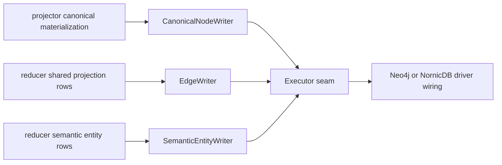

# storage/cypher

`storage/cypher` owns backend-neutral graph write contracts for Eshu. It builds
Cypher `Statement` values, writes canonical nodes and edges, wraps graph writes
with timeout/retry/telemetry behavior, and keeps Neo4j and NornicDB behind the
same `Executor` seam.

Concrete driver sessions do not live here. Runtime wiring in `cmd/` chooses the
backend executor and composes the wrapper chain.

## Pipeline Position



## Package Responsibilities

| Area | Owned here |
| --- | --- |
| Source-local writes | `Adapter`, `BuildPlan`, `OperationUpsertNode`, `OperationDeleteNode`. |
| Canonical node writes | `CanonicalNodeWriter` and `BuildCanonical*` statement builders. |
| Shared projection edges | `EdgeWriter` domain routing, row maps, batching, and retractions. |
| Semantic entities | `SemanticEntityWriter` row-shape variants and stale semantic retractions. |
| Execution seam | `Executor`, `GroupExecutor`, `PhaseGroupExecutor`, and `ExecuteOnlyExecutor`. |
| Write wrappers | `TimeoutExecutor`, `RetryingExecutor`, and `InstrumentedExecutor`. |
| Diagnostics | Statement metadata, batch metrics, spans, phase logs, and timeout errors. |

## Execution Flow

Callers build `Statement` values through builders or writers. The typical
runtime chain is:

```text
caller -> TimeoutExecutor -> RetryingExecutor -> InstrumentedExecutor -> driver executor
```

`TimeoutExecutor` adds a bounded child context and returns
`GraphWriteTimeoutError` with `failure_class=graph_write_timeout`.

`RetryingExecutor` retries transient Neo4j errors and NornicDB commit-time
UNIQUE conflicts when the originating statement or grouped statement set is
MERGE-shaped and therefore idempotent on re-execution.

`InstrumentedExecutor` records `neo4j.execute` / `neo4j.execute_group` spans,
query duration, batch size, and batch count metrics.

`ExecuteOnlyExecutor` forwards single statements while hiding `GroupExecutor`.
Use it when the caller must avoid large atomic graph transactions.

## Canonical Write Phases

`CanonicalNodeWriter.Write` executes these phases in strict order:

1. `retract`
2. `repository_cleanup`
3. `repository`
4. `directories`
5. `files`
6. `entities`
7. `entity_retract`
8. `entity_containment`
9. `terraform_state`
10. `oci_registry`
11. `package_registry`
12. `modules`
13. `structural_edges`

The writer prefers one `GroupExecutor.ExecuteGroup` call for all statements.
When the executor implements only `PhaseGroupExecutor`, each phase is grouped
separately. Otherwise the writer runs statements sequentially while preserving
phase order.

This order is a correctness contract. Repository cleanup must commit before the
repository MERGE. Directories must exist before nested files. Files must exist
before entity containment. Current entity upserts must run before stale entity
cleanup so cleanup can use generation and label anchors instead of large
negative keep lists.

## Current Write Shapes

Repository cleanup removes conflicting `Repository` identity by id or path only
for non-first-generation repository scopes. First-generation scopes skip that
phase because no prior repository identity can exist for the scope.

OCI registry rows are written as `OciRegistryRepository`,
`ContainerImage`/`OciImageManifest`, `ContainerImageIndex`/`OciImageIndex`,
`ContainerImageDescriptor`/`OciImageDescriptor`,
`ContainerImageTagObservation`/`OciImageTagObservation`, and
`OciImageReferrer` nodes keyed by `uid`. OCI image, descriptor, tag, and
referrer rows carry `repository_id` as the durable repository join key instead
of writing repository publication or observation relationships in the canonical
hot path. Manifests, indexes, and descriptors keep their image-family labels
because API queries anchor on those labels. Digest-backed descriptor identity is
the stable image key; tag observations keep `identity_strength=weak_tag` and
point at a resolved digest without making the tag the stable image key.

Package-registry rows are written as `Package`/`PackageRegistryPackage`,
`PackageVersion`/`PackageRegistryPackageVersion`, and
`PackageDependency`/`PackageRegistryPackageDependency` nodes keyed by `uid`.
This phase emits `HAS_VERSION`, `DECLARES_DEPENDENCY`, and
`DEPENDS_ON_PACKAGE` for package-native dependency metadata only; source
repository hints are not promoted to ownership or publication edges until
reducer correlation supplies corroborating evidence. NornicDB phase-group
execution commits package, version, and dependency writes in separate ordered
phase groups because version and dependency statements `MATCH` identities
created by earlier package-registry statements.

Directory rows are written depth-first. File rows update existing `File.path`
nodes before sending missing rows through guarded MERGE statements. Repository
root files attach directly to `Repository` with `REPO_CONTAINS`; the writer
does not invent a synthetic root `Directory`.

Entity writes keep high-volume analysis metadata such as
`dead_code_root_kinds` and `exactness_blockers` out of graph rows. The API
merges that evidence from the content store when it is needed.

Terraform-state writes create `TerraformResource`, `TerraformModule`, and
`TerraformOutput` nodes keyed by `uid`. They do not create cloud-resource joins;
that admission happens in reducer correlation after readiness facts exist.

`EdgeWriter` batches reducer domains with `UNWIND` and defaults to
`DefaultBatchSize` (`500`). Code-call, inheritance, and SQL relationship
domains can use domain-specific group batch sizes. Code calls may write
`CALLS`, `REFERENCES`, or `USES_METACLASS`; SQL trigger rows can write both
`TRIGGERS` and `EXECUTES`.

## Required Invariants

- All hot-path writes must be idempotent. Use `MERGE` for graph identity and
  split mutable properties into `SET`.
- Keep endpoint labels whitelisted. Dynamic label values must never come from
  untrusted row data.
- Do not add direct Neo4j or NornicDB driver calls in this package.
- Do not branch on `ESHU_GRAPH_BACKEND` in writers or callers. Backend-specific
  behavior belongs in narrow seams such as schema DDL, executor constructors,
  retry classification, or measured writer options.
- Do not serialize workers as a fix for MERGE races. Retry idempotent writes or
  redesign the conflict domain.
- Do not move source hints from OCI or Package Registry into repository
  ownership edges without reducer admission evidence.
- Keep SQL `EXECUTES` writes and retractions aligned; trigger-bound stored
  routines depend on that edge for dead-code reachability.

## Observability

This package emits these graph-write signals:

| Signal | Purpose |
| --- | --- |
| `neo4j.execute`, `neo4j.execute_group` | Statement and grouped-write spans. |
| `eshu_dp_neo4j_query_duration_seconds` | Single and grouped graph write duration. |
| `eshu_dp_neo4j_batch_size` | Rows per batched `UNWIND` statement. |
| `eshu_dp_neo4j_batches_executed_total` | Batched statements executed. |
| `eshu_dp_neo4j_deadlock_retries_total` | Retried graph write conflicts. |
| `eshu_dp_canonical_atomic_writes_total` | Canonical writes by atomic or phase mode. |
| `eshu_dp_canonical_atomic_fallbacks_total` | Writes that could not use full atomic grouping. |
| `eshu_dp_canonical_phase_duration_seconds` | Per-phase canonical write duration. |
| `eshu_dp_canonical_projection_duration_seconds` | End-to-end canonical projection duration. |
| `eshu_dp_shared_edge_write_groups_total` | Grouped shared-edge writes. |
| `eshu_dp_shared_edge_write_group_duration_seconds` | Shared-edge group duration. |
| `eshu_dp_shared_edge_write_group_statement_count` | Statements per shared-edge group. |
| `eshu_dp_code_call_edge_batches_total` | Code-call edge batches. |
| `eshu_dp_code_call_edge_batch_duration_seconds` | Code-call edge batch duration. |

**Statement builders**

- `BuildPlan(materialization)` — converts a `graph.Materialization` to a
  source-local `Plan`
- `BuildCanonical*Upsert` functions — construct `Statement` values for canonical
  domain nodes: `BuildCanonicalWorkloadUpsert`,
  `BuildCanonicalWorkloadInstanceUpsert`, `BuildCanonicalRuntimePlatformUpsert`,
  `BuildCanonicalInfrastructurePlatformUpsert`,
  `BuildCanonicalDeploymentSourceUpsert`, `BuildCanonicalRepoDependencyUpsert`,
  `BuildCanonicalWorkloadDependencyUpsert`, `BuildCanonicalCodeCallUpsert`,
  `BuildCanonicalRepoRelationshipUpsert`, `BuildCanonicalRunsOnUpsert`
- Statement retraction builders — produce edge and node retraction statements:
  `BuildRetractInfrastructurePlatformEdges`, `BuildRetractRepoDependencyEdges`,
  `BuildRetractWorkloadDependencyEdges`, `BuildRetractCodeCallEdges`,
  `BuildRetractInheritanceEdges`, `BuildRetractSQLRelationshipEdges`,
  `BuildRetractSQLRelationshipEdgeStatements`, `BuildDeleteOrphanPlatformNodes`

**Read / check**

- `CypherReader` — interface for read-only existence queries
- `CanonicalNodeChecker` — short-circuit guard built from `CypherReader`;
  `HasCanonicalCodeTargets` avoids expensive label-free MATCH scans when no
  canonical code nodes exist

**Errors**

- `GraphWriteTimeoutError` — emitted by `TimeoutExecutor`; implements
  `Retryable() bool` and `FailureClass() string`
- `WrapRetryableNeo4jError(err)` — wraps transient errors for the edge writer

## Dependencies

- `internal/graph` — `graph.Materialization`, `graph.Record`, `graph.Result`
  for source-local plan building
- `internal/projector` — `projector.CanonicalMaterialization` and row types
  consumed by `CanonicalNodeWriter`
- `internal/reducer` — `reducer.Domain` constants and
  `reducer.SharedProjectionIntentRow` consumed by `EdgeWriter`
- `internal/telemetry` — `telemetry.Instruments`, span and attribute helpers

Concrete Neo4j/NornicDB driver adapters live in `cmd/` wiring packages, not in
this package. This package owns the backend-neutral writer contracts; `cmd/`
owns the wiring. NornicDB owns the promoted runtime path. Any additional
Cypher/Bolt backend must run these shared statements or use a small, documented
adapter seam.

## Telemetry

- `eshu_dp_neo4j_query_duration_seconds` — histogram per statement;
  `operation=write` or `operation=write_group`
- `eshu_dp_neo4j_batch_size` — batch row count per `UNWIND` statement; grouped
  Neo4j/Bolt execution records one point per statement with bounded
  `operation`, `write_phase`, and `node_type` labels when metadata is present
- `eshu_dp_neo4j_batches_executed_total` — counter labeled by `operation` plus
  bounded statement metadata when available
- `eshu_dp_neo4j_deadlock_retries_total` — counter in `RetryingExecutor` labeled
  by `write_phase`
- `eshu_dp_canonical_atomic_writes_total` / `eshu_dp_canonical_atomic_fallbacks_total`
  — whether `CanonicalNodeWriter` used the group or sequential path
- `eshu_dp_canonical_phase_duration_seconds` — labeled by phase name
- `eshu_dp_canonical_projection_duration_seconds` / `eshu_dp_canonical_retract_duration_seconds`
  — canonical write and retract totals
- `eshu_dp_shared_edge_write_groups_total` / `eshu_dp_shared_edge_write_group_duration_seconds`
  / `eshu_dp_shared_edge_write_group_statement_count` — edge writer group metrics
- `eshu_dp_code_call_edge_batches_total` / `eshu_dp_code_call_edge_batch_duration_seconds`
  — code-call-specific edge metrics
- Spans: `neo4j.execute` and `neo4j.execute_group` from `InstrumentedExecutor`

No-Regression Evidence: `go test ./internal/storage/cypher -run
TestCanonicalNodeWriterSkipsRepositoryRetractForNonRepositoryProjection -count=1`
proves OCI/package canonical materializations no longer emit repository-scoped
retract statements. The remote full-corpus Compose gate on 2026-05-19 drained
`896` git scopes, `1` OCI registry scope, `1` package registry scope, and `1`
Terraform-state scope with projector `917` succeeded / `58` superseded, reducer
`7458` succeeded, and no `projection failed`, `graph_write_timeout`, failed,
retrying, or dead-letter rows.

Observability Evidence: existing `eshu_dp_canonical_phase_duration_seconds`,
`eshu_dp_projector_stage_duration_seconds`, and structured `projection failed`
logs expose the phase, source system, generation id, failure class, and timeout
hint when repository cleanup is slow or mis-scoped.

Performance Evidence: a 2026-05-21 full-corpus remote Compose run against
NornicDB v1.1.1 plus the transaction-router fix drained `896` accepted
repositories but dead-lettered one OCI registry `source_local` item after three
`120s` `graph_write_timeout` attempts in `phase=oci_registry`. Focused probes
against the populated graph showed 20-row multi-label OCI node-only `MERGE`
completed in `5ms`, while 20-row `PUBLISHES_DESCRIPTOR` relationship writes
took about `51s` and relationship `CREATE` variants still timed out at `30s` to
`65s`. A single-label `MERGE` plus `SET n:ContainerImage` probe completed in
`6ms` but did not persist the added label in NornicDB, so the canonical OCI
writer keeps multi-label node identities for query accuracy and skips
relationship writes until a measured relationship writer exists.

Performance Evidence: after removing OCI registry relationship writes, the
`oci-relfix-full-20260521T233652Z` remote Compose proof with pprof enabled
reached queue-zero at `2026-05-21T23:52:03Z`: fact work items were `8389/8389`
succeeded with `0` failed, retrying, or dead-letter rows. The OCI registry
collector completed `1` configured scope; the `oci_registry` canonical phase
wrote `4` statements in about `40ms`, and the source-local OCI projection
completed `212` facts in about `69ms`. Shared projections also completed
`344592/344592` code-call rows and `1188/1188` repo-dependency rows. A
preserved-volume restart then recovered the API, MCP, reducer, ingester,
workflow, webhook, and collectors, and reached a no-pending queue sample again
with only succeeded work rows.

No-Regression Evidence: `go test ./internal/storage/cypher -run
'TestCanonicalNodeWriter(BuildsOCIRegistryStatements|OCIRegistrySkipsRelationshipWrites|OCIRegistryKeepsImageFamilyLabels)' -count=1`
proves OCI canonical statements retain digest/tag/referrer nodes, keep
image-family labels used by the read surface, and do not emit `PUBLISHES_*` or
`OBSERVED_*` relationship writes in the hot path.

Observability Evidence: existing canonical phase duration metrics, projector
stage duration metrics, and structured `projection failed` logs expose the
`oci_registry` phase, source system, generation id, and NornicDB error text.
Workflow and fact work-item rows surface the same failed projection through
retry, failed, and dead-letter state without adding a new metric label.

## Extension points

- `Executor` — implement this interface for any new graph backend; no changes
  to writers or callers are needed
- `GroupExecutor` / `PhaseGroupExecutor` — optional extensions; writers detect
  them at runtime and prefer the grouped path
- `CanonicalNodeWriter` builder options — `WithFileBatchSize`,
  `WithEntityBatchSize`, `WithEntityLabelBatchSize`,
  `WithEntityContainmentInEntityUpsert`,
  `WithBatchedEntityContainmentInEntityUpsert` — tune per-backend without
  branching callers
- New statement builders — add a `BuildCanonicalWorkloadUpsert`-style function
  or a `BuildRetractRepoDependencyEdges`-style function for each new canonical
  domain node or edge type; no writer changes needed

Structured logs include canonical phase failures and shared-edge route summaries
with domain, evidence source, execution mode, row counts, route count, statement
count, batch size, duration, and bounded statement summaries.

## Change Checklist

Before changing a Cypher hot path, read
`docs/public/reference/cypher-performance.md` and the current backend behavior
for the pinned graph binary.

For new or changed canonical node writes:

- All writes must be idempotent (`doc.go`). `MERGE`-based Cypher and
  `ON CONFLICT DO NOTHING` patterns enforce this; do not replace MERGE with
  CREATE.
- Add or update the builder and focused statement tests.
- Confirm the identity key is stable and MERGE-shaped.
- Preserve phase order and metadata tags.
- `OperationCanonicalUpsert` is for canonical domain nodes (workloads, files,
  entities). `OperationUpsertNode` / `OperationDeleteNode` are for
  source-local `SourceLocalRecord` writes. Do not mix them.
- `CanonicalNodeWriter` phase order is strict: parent nodes (Repository,
  Directory) must exist before child nodes (File, Entity) because later phases
  use MATCH on these nodes. Identity cleanup phases run immediately before the
  corresponding MERGE phase, and `directories` are sorted by `Depth` ascending
  (`canonical_node_writer_phases.go`).
- OCI registry writes must keep `MERGE` anchored on concrete labels plus `uid`.
  Tags are mutable observations; do not use `tag` or `source_tag` as the
  manifest/index identity key. OCI labels participate in the stale-entity
  retract family, and `canonicalNodeRetractEntityLabels` includes that family in
  the generated cleanup list. OCI registry repository truth is derived from the
  `repository_id` property on digest, descriptor, index, tag-observation, and
  referrer nodes. Do not reintroduce `PUBLISHES_*` or `OBSERVED_*`
  relationships in the canonical writer without same-corpus performance proof
  that the relationship writer no longer dominates `phase=oci_registry`.
- Package-registry writes must keep `MERGE` anchored on `uid` for `Package`,
  `PackageVersion`, and `PackageDependency` labels. Do not add `Repository`
  matches or ownership edges to `package_registry_canonical_writer.go`; source
  hints need reducer admission first.

  No-Regression Evidence: `go test ./internal/projector ./internal/storage/cypher -count=1`
  on 2026-05-22 covered package-registry phase ordering with 1 package, 1
  version, and 1 dependency row. The change preserves the same Cypher templates
  and only splits NornicDB phase-group commits so dependent `MATCH` statements
  see prior identities.

  Observability Evidence: `CanonicalNodeWriter` phase logs now expose
  `phase=package_registry_packages`, `phase=package_registry_versions`, and
  `phase=package_registry_dependencies`; projector canonical-write logs expose
  `package_registry_package_count`, `package_registry_version_count`, and
  `package_registry_dependency_count`.
- Repository-root `File` rows are the exception to the Directory parent rule:
  they must attach directly to `Repository` through `REPO_CONTAINS` because
  `buildDirectoryChain` intentionally does not create a synthetic Directory for
  the repository root.
- Canonical entity containment refreshes prune stale `CONTAINS` edges from
  current `Class` and `Function` parents. Keep those cleanup statements
  label-anchored on `uid`; unlabelled UID anchors are portable Cypher but can
  miss the NornicDB and Neo4j hot path for this package's schema.
- Code reference writes must allow type targets (`Struct`, `Interface`,
  `TypeAlias`) as well as callable targets. Do not route Go composite-literal
  or TypeScript type references through `CALLS`; dead-code queries depend on
  incoming `REFERENCES` to model type usage without inventing invocation truth.
- Code-call endpoint labels are whitelist values, not caller-controlled Cypher.
  `EdgeWriter` accepts exact `Function`, `Class`, `File`, `Interface`,
  `Struct`, and `TypeAlias` labels for code relationship endpoints. This keeps
  Java, Go, Python, and TypeScript rows on NornicDB's bounded label-plus-`uid`
  lookup path instead of the broader label-family fallback. Unknown or missing
  labels still fall back to the older query shape for legacy rows.
- SQL relationship endpoint labels are also whitelist values. `EdgeWriter`
  routes `SqlTrigger` to `SqlTable` with `TRIGGERS`, `SqlTrigger` to
  `SqlFunction` with `EXECUTES`, and `SqlFunction` / `SqlView` to `SqlTable`
  with table-reference edges. Keep `EXECUTES` in both write and retract paths,
  or trigger-bound stored routines can look unreachable to dead-code queries.
- Canonical stale entity retractions run after current entity upserts and are
  emitted per projectable label, not as broad label-family `MATCH (n)` scans or
  giant `uid IN` exclusion filters. Current nodes have already been stamped with
  the new `generation_id`, so stale cleanup can use generation-only deletion
  while keeping each graph lookup bounded to one schema label.
- Terraform backend, import, moved, removed, check, and lockfile-provider
  labels are part of the projectable Terraform cleanup set. New Terraform
  parser buckets need an explicit entry there before stale-node cleanup can
  retract old facts.
- Stale File-to-entity `CONTAINS` edges are removed when stale entity nodes are
  retracted. Do not add a separate per-file relationship refresh unless a future
  design record changes the canonical entity lifecycle; that shape is easier to
  make slow or backend-specific than the current label-anchored retraction path.
- Repository cleanup first deletes an existing `Repository` found by unique
  `path` when its `id` differs from the current repository id, then the
  `repository` phase runs the normal id-based MERGE. Keeping this in a separate
  `PhaseGroupExecutor` phase lets NornicDB validate the unique `path` after the
  delete commits and before the new id owns that path.
- `RetryingExecutor.ExecuteGroup` retries on commit-time UNIQUE conflicts
  when every statement in the group is MERGE-shaped, sharing the same
  `runWithRetry` loop as `Execute` (`retrying_executor.go:52`). Driver-
  level `session.ExecuteWrite` continues to handle Neo.TransientError.*
  codes for the group path; the Eshu retry layer adds coverage for
  Neo.ClientError.Transaction.TransactionCommitFailed when the message
  classifies as a NornicDB commit-time UNIQUE conflict. Mixed groups
  containing non-MERGE statements are not retried, preserving
  idempotency safety.
- `ExecuteOnlyExecutor` intentionally hides `GroupExecutor`. Use it when the
  caller must not hold a large atomic transaction (e.g., during source-local
  ingestion that runs concurrently with canonical projection).
- `isNornicDBMergeUniqueConflict` treats commit-time unique constraint
  violations on MERGE Cypher as retryable because a concurrent writer may have
  created the intended node between match and commit
  (`retrying_executor.go:212`). `isNornicDBCommitTimeUniqueConflict`
  matches both the older `failed to commit implicit transaction:...`
  wrapping and the v1.0.45+ `commit failed: constraint violation:...` /
  `TransactionCommitFailed` wrapping so the classifier stays current
  across pinned binaries (`retrying_executor.go:227`).
- Backend dialect differences (Cypher syntax, transaction shape, constraint
  behavior) belong in documented seams here or in `cmd/` wiring. Do not add
  product-specific branches in callers, and do not create a separate writer
  stream for Neo4j unless a future design record explicitly rejects the shared contract.
- Performance work should first improve this package's shared writer/query
  shape. Only add backend-specific behavior after proving the shared Cypher
  contract cannot express the needed correctness or performance property.
- Add no-regression or benchmark evidence when the shape changes.

For new or changed shared projection domains:

- Add the reducer domain contract first.
- Add the `EdgeWriter` Cypher template and row-map support.
- Test positive, empty, skipped-row, duplicate, and retraction behavior.
- Prove the query has a selective label plus identity anchor.

For executor wrapper changes:

- Preserve `Executor` first.
- Implement `GroupExecutor` or `PhaseGroupExecutor` only when the wrapper can
  preserve idempotency and bounded transaction behavior.
- Keep timeout, retry, and telemetry behavior visible in tests.

## Operational Notes

- Run `eshu-bootstrap-data-plane` before production-profile Neo4j or NornicDB
  performance proofs. Without graph schema, shared Cypher can look falsely slow.
- `eshu_dp_neo4j_deadlock_retries_total` rising usually points to MERGE
  contention on shared identities such as repositories, directories, modules,
  or graph relationship endpoints.
- `eshu_dp_canonical_atomic_fallbacks_total > 0` means the wired executor does
  not expose the full group path.
- Slow `retract` or `entity_retract` phases usually mean stale volume, missing
  schema, or a cleanup shape that lost its concrete label anchor.
- `GraphWriteTimeoutError.TimeoutHint` names the env var that owns the graph
  write budget.

No-Regression Evidence: `go test ./internal/storage/cypher -count=1` covers
writer phase order, repository cleanup, file update/create shapes, typed
code-call and SQL endpoints, OCI/package/Terraform canonical rows, retry
classification, timeout wrapping, and instrumentation contracts.

No-Observability-Change: this README rewrite does not change runtime behavior.
The package remains covered by the metrics, spans, and structured logs listed
above.

## Related Docs

- `go/internal/storage/cypher/AGENTS.md` - mandatory scoped agent guidance for
  this package.
- `docs/public/reference/cypher-performance.md` - required Cypher performance
  workflow.
- `docs/public/reference/nornicdb-pitfalls.md` - known NornicDB compatibility
  traps.
- `docs/public/reference/nornicdb-tuning.md` - operator-facing NornicDB knobs.
- `docs/public/reference/telemetry/index.md` - metric and span reference.
- `go/internal/projector/README.md` - canonical projection caller.
- `go/internal/reducer/README.md` - shared projection caller.
