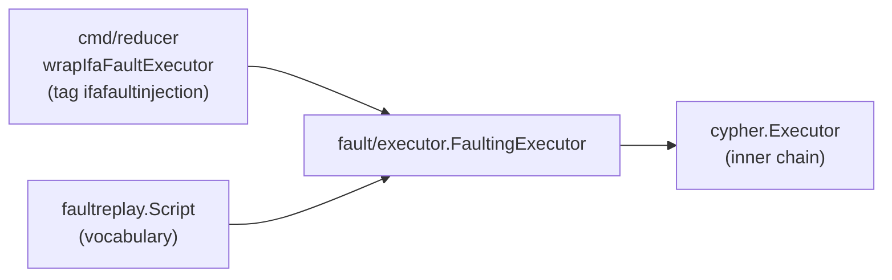

# storage/cypher/fault/executor

Test-only fault-injection decorator for the Cypher `Executor` seam.

## What lives here

- `fault.go` (build tag `ifafaultinjection`) — `FaultingExecutor`, which
  wraps a parent-package `cypher.Executor` and applies two scripted faults
  from the `faultreplay` vocabulary: fail-graph-write-once-then-succeed
  (queue-retry and executor-retry lanes) and
  restart-backend-between-phase-groups. Unscripted capabilities delegate to
  the inner executor; an inner that lacks a grouped, phase-grouped, or
  probe surface fails closed instead of silently skipping.
- `marker.go` (same tag) — the once-fired marker and restart trigger
  record: how an out-of-process gate learns the fault fired and on which
  statement. Split from `fault.go` to hold the repo's 500-line file cap.
- `off.go` (build tag `!ifafaultinjection`) — `NewFaultingExecutor` as a
  no-op returning the inner executor unchanged, so default builds link no
  fault machinery.

## Where this fits



The only production caller is `go/cmd/reducer/ifa_fault_wiring.go`, which
constructs the decorator from `ESHU_IFA_FAULT_SCRIPT` and arms its
executor-retry lane below the reducer's persistent `RetryingExecutor`.
The deferred Docker gate `scripts/verify-ifa-fault-injection.sh` is the
live proof; unit proof is the tagged tests in this directory.

## Invariants

- No Cypher text lives here: the decorator matches on statement ordinals
  and substrings but never authors statements, so a move cannot change
  projected graph truth.
- No production, CI, or default-tag build links `FaultingExecutor` — only
  the `off.go` stub. The `test-verify-ifa-fault-injection.sh` gate asserts
  both files exist and carry their build tags.
- `cypher` (the parent package) never imports this package. The dependency
  runs one way — `fault/executor -> cypher` for the `Executor`,
  `Statement`, and capability interfaces — so the seam stays cycle-free.

## Proof

```sh
cd go
go test ./internal/storage/cypher/fault/executor/... -count=1
go test -tags ifafaultinjection ./internal/storage/cypher/fault/executor/... -count=1
```
