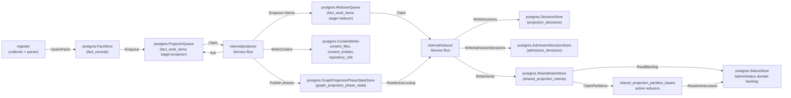
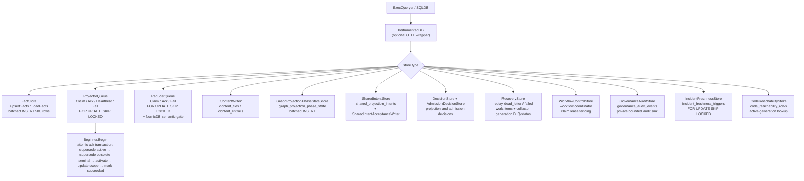

# storage/postgres

`storage/postgres` owns Eshu's relational persistence layer: facts, queue state,
content store, status, recovery data, projection and admission decisions,
webhook refresh triggers, shared projection intents, AWS scan status, and
workflow coordination tables. It is the single durable source of truth for
pipeline state that projector, reducer, ingester, collectors, and the API
surface all share.

## Where this fits in the pipeline

## Internal flow

## Lifecycle / workflow

The detailed lifecycle contract lives in
[`lifecycle-and-workflow-guide.md`](lifecycle-and-workflow-guide.md). Keep that
guide current when changing bootstrap DDL ordering, fact persistence, projector
or reducer queue behavior, workflow fencing, graph projection phase state,
webhook triggers, AWS scan status, or runtime drift evidence loading.

How retired, removed, tombstoned, and superseded evidence is kept out of
active-generation reads — the candidate-case matrix, the two retirement
mechanisms, and the index/pointer-bounded retraction shape — is documented in
[`retirement-proof-matrix.md`](retirement-proof-matrix.md) and proven by
`proof_domain_retirement_test.go` here plus `retirement_retract_proof_test.go`
in `internal/reducer`.

High-signal invariants for this package:

- Bootstrap DDL is idempotent and ordered through `BootstrapDefinitions`.
- `code_reachability_rows` stores reducer-materialized code reachable-set rows
  by active source generation, and `code_reachability_repository_watermarks`
  records the completed intent timestamp covered by each repository snapshot so
  empty reachable sets do not loop forever; query dead-code reads consult the
  rows before the compatibility scan over completed shared projection intents.
- Fact writes batch at 500 rows, deduplicate `fact_id` within a batch, sanitize
  JSONB control bytes, and skip unchanged pending-or-active generations by
  `FreshnessHint`.
- Projector claims preserve one active source-local generation per `scope_id`,
  reclaim expired leases before fresh work, coalesce stale same-scope work, and
  atomically ack by superseding stale active generation, superseding older
  terminal same-scope generations, activating the target generation, updating
  the scope pointer, and marking work succeeded.
- Reducer claims share the lease/retry contract and add domain filters plus the
  NornicDB semantic gate for `semantic_entity_materialization` while
  source-local projection is in flight. A reducer claim also supersedes
  unleased older-generation reducer rows once the same scope has a newer active
  generation, and status/drain/observer reads exclude those inactive rows from
  live readiness while preserving the durable work item for audit history.
- Workflow, AWS pagination, AWS scan-status, webhook, incident freshness, and
  hosted tenant/workspace grant stores use fencing, coalescing, or idempotent
  conflict keys so stale workers or replayed deliveries cannot overwrite newer
  durable truth.
- `GovernanceAuditStore` validates every event through
  `governanceaudit.NormalizeEvent`, derives a deterministic event id from the
  normalized safe fields, and uses `ON CONFLICT DO NOTHING` so retried writes
  are idempotent without storing raw principals, source names, prompts,
  provider responses, credential handles, private URLs, or token values.
- Tenant/workspace grant storage persists opaque tenant and workspace IDs,
  redacted display-handle hashes, scope grants, and repository grants. Active
  reads and claimed fact commits apply status, tombstone, effective-at, expiry,
  subject-class, and policy-revision predicates inside SQL before returning
  rows or writing source facts.
- Scoped API token storage is additive: it persists only opaque tenant and
  workspace IDs, token hashes, subject hashes, active bounds, expiry,
  revocation, and policy revision hashes without storing raw bearer tokens or
  changing current API, MCP, graph, collector, or workflow enforcement.
- Browser session storage is additive and hash-only: it persists session and
  CSRF digests, tenant/workspace IDs, optional scoped-token audit hashes, active
  grant bounds, expiry, revocation, and the current workspace policy revision
  without storing raw cookies, CSRF tokens, bearer tokens, tenant names, or
  workspace names. Session resolution joins active tenants/workspaces and
  re-checks the persisted policy revision against the workspace row before
  refreshing last-seen state, so policy changes invalidate stale dashboard
  sessions instead of extending them.
- Identity subject storage is additive and dormant until later enforcement
  slices opt in. It persists users, provider configs and revisions, external
  subject links, email history, local credential hashes, MFA factor handles,
  tenant memberships, roles, grants, sessions, service principals,
  service-principal role assignments, and token metadata with opaque IDs,
  hashes, and credential handles only. It does not replace existing
  shared-token or scoped-token behavior.
- Repository ref readbacks stay bounded by the `repository_refs` primary key
  `(repo_id, ref_kind, name)` and default-ref index; writers replace only a
  fresh ref set carried by the current materialization so content-only
  generations do not erase branch metadata.
- Documentation fact readbacks stay bounded by visible finding/source/packet
  indexes plus `fact_records_documentation_target_refs_idx`, a partial JSONB GIN
  index over documentation target-reference payloads.
- Eshu search-document projection writes derived document facts and a persisted
  BM25 read index in the same reducer retry path. `eshu_search_index_documents`
  stores active-generation document payloads and lengths,
  `eshu_search_index_terms` stores term frequencies by bounded term key, and
  `eshu_search_index_stats` stores corpus size and average length so API/MCP
  search reads do not rebuild a full corpus per request. Vector metadata and
  value rows store derived embedding lifecycle state plus bounded numeric
  payloads by active generation, provider profile, source class, model, content
  hash, and index version without promoting vector similarity to graph truth.
  The pending sweeper re-enqueues scopes whose active search documents exist but
  stats are missing.
  `EshuSearchVectorPendingStore` lists active repository scopes whose curated
  search documents do not yet have ready vector metadata/value rows for the
  configured provider profile, source class, model id, and vector index
  version, allowing reducer vector builds to converge without request-time
  scans.
- Relationship evidence backfill stays bounded to latest active repository
  facts, file/content facts, and `gcp_cloud_relationship` facts. GCP
  relationship facts are included explicitly because they are provider-resource
  facts without repository file content, while the resolver still requires
  distinct catalog matches before evidence is persisted. Streaming commit-time
  evidence discovery remains repository-scope only; cloud-scope relationship
  facts enter repository generations through deferred backfill.
- Deferred relationship maintenance coordinates sharded ingesters through
  `deferred_maintenance_barriers` and
  `deferred_maintenance_barrier_arrivals`. Each shard records its local batch
  drain in the current epoch; only the shard that completes the epoch runs
  maintenance. Maintenance no longer serializes on one fleet-wide exclusive
  advisory lock, and it no longer holds every active repository's lock in one
  long transaction (issue #3482). Evidence discovery reads the whole committed
  fact corpus once (cross-repo relationships need every repository's facts), but
  the writes commit in bounded independent per-repository-batch transactions.
  Each batch transaction takes only its own repositories' exclusive advisory
  locks, namespaced under `deferred_relationship_maintenance` and acquired in
  sorted repository order to stay deadlock-free, re-reads those repositories'
  active generations under the lock, writes their evidence and readiness, and
  commits to release the locks before the next batch. Normal source generation
  commits take the matching shared lock for only their own repository partition
  (see `deferred_maintenance_lock.go`). The deployment-mapping reopen runs in its
  own transaction and the barrier-completion marker in another, so no step holds
  a fleet-wide lock. A commit therefore waits only for the in-flight batch that
  holds its repository, and a stall on one batch blocks at most that batch's
  repositories. If a shard arrives with a different shard count while an epoch is
  open, storage fails closed instead of creating competing epochs.
- `value_flow_fixpoint_components` stores reducer-owned solved value-flow
  component results by content-derived component key, so unchanged components
  can be reused across reducer restarts and replicas without re-solving.

No-Regression Evidence: scoped hot-path notes live in
[`evidence-notes.md`](evidence-notes.md), including #2059 claimed fact commit
tenant-grant fencing. No-Observability-Change: #2059 adds no new signal shape.

No-Regression Evidence: `go test ./internal/storage/postgres -run
'TestIngestionStore(CommitScopeGenerationTakesSharedMaintenanceBarrier|RunDeferredRelationshipMaintenanceTakesPerRepoExclusiveBarrier|ShardDrainBarrier)|TestBootstrapDefinitionsIncludeDeferredMaintenanceBarrier'
-count=1` covers the per-repo shared source-commit barrier and per-repo deferred
maintenance barrier, the multi-shard drain rendezvous, and bootstrap DDL.

### Deferred maintenance lock partitioning (issue #3482)

Deferred relationship maintenance previously ran under one fleet-wide exclusive
Postgres advisory lock (constant key `deferredMaintenanceBarrierLockKey`), so a
single in-flight or stalled maintenance pass serialized every ingester's
generation commits across the whole fleet. The first partitioning increment
keyed the lock per repository but still acquired every active repository's
exclusive lock inside one corpus-wide maintenance transaction, so the
whole-corpus entrypoint kept fleet-wide serialization: a stall held every
repository's lock until the entire pass committed. The write conflict domain is
actually per source repository: evidence rows are keyed by each repository's
active `generation_id` and are content-addressed (`evidence_id`, `ON CONFLICT
(evidence_id) DO NOTHING`), so disjoint repositories never touch overlapping
rows. Maintenance now commits in bounded independent per-repository-batch
transactions, each taking only its own batch's locks via the established
two-argument `pg_advisory_xact_lock[_shared](hashtext($namespace),
hashtext($repo))` pattern.

- Backend: Postgres advisory locks (transaction level). Lock semantics verified
  against Postgres docs: shared and exclusive modes on `(classid, objid)` keys;
  many shared holders coexist, one exclusive holder excludes shared+exclusive on
  the same key; disjoint keys never contend; transaction-level locks release at
  commit/rollback.
- Input shape: N active source repositories per maintenance epoch, processed in
  ceil(N / `deferredMaintenanceRepoBatchSize`) independent transactions
  (batch size 32). Peak exclusive locks held at once = batch size, not N. Commit
  shared locks acquired = 1 per generation commit (its own repository).
- Conflict domain: one repository partition key. Lock ordering: sorted unique
  repository keys within a batch, identical across all callers, so overlapping
  multi-repository acquisitions cannot deadlock.
- Idempotency/retry: evidence writes are idempotent (`ON CONFLICT DO NOTHING`)
  and readiness upserts are keyed by generation. Each batch commits
  independently; a rolled-back or failed batch releases its advisory locks at
  transaction end, and re-running the pass converges to the same terminal state
  (committed batches are skipped or re-applied idempotently). A repository whose
  active generation disappears between the snapshot read and the batch lock is
  skipped under the lock-current re-read.
- Leader liveness under the split transactions: in the sharded path the leader
  commits its barrier arrival, runs maintenance in independent batch
  transactions, then marks barrier completion in its own transaction. If the
  leader crashes after arrival but before completion, the epoch stays open
  (uncompleted) because `ensureDeferredMaintenanceBarrierEpoch` reuses an open
  epoch and `recordDeferredMaintenanceBarrierArrival` upserts. On the next drain
  cycle every shard re-arrives into that open epoch and any shard that observes a
  full arrival count re-runs the idempotent maintenance and marks completion, so
  waiters cannot block forever. Concurrent re-run leaders are safe because
  maintenance is per-repo-locked and idempotent.
- Key alignment (correctness): a git repository scope sets
  `PartitionKey = repo.ID` and emits a repository fact whose payload `repo_id`
  is the same `repo.ID` (`collector/git_source_processing.go`). The commit
  shared lock keys on `PartitionKey` and maintenance keys on the active
  generations' `repo_id`, so both resolve to the same partition for the same
  repository and the shared/exclusive fence holds. Non-repository scopes (for
  example cloud partitions) never appear in the repository-only active
  generations query, so maintenance takes no exclusive lock on their partition
  and those commits correctly no longer wait on repository maintenance at all.

Performance Evidence: before, the whole-corpus pass held all N active-repo
exclusive locks in one transaction, so peak simultaneous repo locks = N and an
unrelated commit blocked for the whole pass (effective concurrency = 1
maintenance pass fleet-wide). After, writes commit in independent per-batch
transactions, so peak simultaneous repo locks = batch size and locks release
between batches. `TestWholeCorpusMaintenanceNeverHoldsFleetWideLockSet` drives
the whole-corpus entrypoint over 4 repos at batch size 2 and asserts peak held
<= batch size (it fails at peak = 4 on the single-transaction design).
`TestWholeCorpusMaintenanceDoesNotBlockUnrelatedCommit` proves a commit on a
repo not in the in-flight batch is not blocked, and
`TestDisjointRepoMaintenanceRunsConcurrently` proves disjoint passes run in
parallel while a same-repo commit still correctly waits then proceeds. Reproduce:
`go test ./internal/storage/postgres -run
'TestWholeCorpusMaintenance|TestDisjointRepoMaintenanceRunsConcurrently|TestMaintenanceTakesPerRepoExclusiveLocksInOrder'
-race -count=1`. This is a Concurrency/Scheduling win: it removes fleet-wide
serialization without lowering worker counts or batch sizes.

Observability Evidence: `RunDeferredRelationshipMaintenance` records
`instruments.DeferredBackfillDuration` and `instruments.DeferredBackfillEvidence`
and logs `deferred_backfill_completed evidence_facts=... readiness_rows=...
duration_s=... batch_size=...`; each batch's per-repo lock acquisition emits the
exclusive-lock SQL per repository so contention is attributable to a single
repository partition in a single batch rather than an opaque global barrier. An
operator can see which repository's batch is slow via the per-repo lock waits and
the backfill duration/evidence counters instead of a single fleet-wide stall.

### Multi-cloud runtime drift evidence loader (issues #1997, #1998)

`PostgresMultiCloudRuntimeDriftEvidenceLoader` is the concrete
`reducer.MultiCloudRuntimeDriftEvidenceLoader` that backs
`DomainMultiCloudRuntimeDrift`. It builds the provider-neutral drift join on one
canonical `cloud_resource_uid` keyspace so AWS, GCP, and Azure share a single
path. The loader runs three bounded reads: (1) observed inventory facts
(`aws_resource`, `gcp_cloud_resource`, `azure_cloud_resource`) for one
`(scope_id, generation_id)`, resolving each provider's native raw identity (ARN,
full resource name, ARM id) into the shared uid through
`cloudinventory.ResolveProviderIdentity`; (2) active `terraform_state_resource`
rows whose provider-native identity (matched from `attributes.arn`,
`attributes.id`, or `attributes.self_link`) re-resolves to one of those uids,
bounded by a JSON allowlist of the observed identities so a stale generation
cannot widen the join. AWS ARNs and GCP full resource names are case-significant
and match exactly; Azure ARM ids are case-insensitive per Azure and the shared
`cloud_resource_uid` lower-cases them before hashing, so the Azure side of the
state-to-observed join is case-folded (the `match_key` CTE lower-cases only
`/subscriptions/`-rooted identities, and the loader maps the returned state
identity back to the observed uid via an exact lookup first and an Azure-only
case-folded lookup second) so a state row whose `attributes.id` differs only in
casing still joins instead of reading as orphaned, while AWS/GCP casing
differences stay distinct. Read (3) loads Terraform config rows resolved per state backend
owner through the same shared `tfstatebackend` resolver the AWS drift domain uses,
joined to state by Terraform address. Observed-only resolves to orphaned,
cloud+state without config to unmanaged, conflicting state owners for one uid to
ambiguous, and an unresolved config owner to unknown. The loader never invents a
second keyspace, never fabricates a uid for an unresolved identity, and never
promotes a provider observation over declared Terraform config.

No-Regression Evidence: `go test ./internal/storage/postgres -run 'TestPostgresMultiCloudRuntimeDriftEvidenceLoader' -count=1` proves the loader joins observed+state+config by uid across the three providers, classifies orphaned/unmanaged/ambiguous/unknown, resolves a Terraform state identity to the same uid as the observed fact, drops identities that cannot key into the shared keyspace, rejects blank scope/generation and a nil DB, short-circuits the state/config scans on an empty observed set (one query only), and stays stable under concurrent loads. `TestPostgresMultiCloudRuntimeDriftEvidenceLoaderAzureStateCaseInsensitiveJoin` adds the case-fold proof: an Azure state row whose `attributes.id` differs only in casing from the observed `arm_resource_id` still joins and reads as unmanaged, while AWS ARN and GCP full-resource-name casing differences stay distinct uids and read as orphaned, and the state-join SQL is asserted to case-fold only the `/subscriptions/` keyspace. The observed scan reuses `listMultiCloudObservedResourcesForGenerationQuery`, served by the existing `fact_records_scope_generation_idx (scope_id, generation_id, fact_kind, observed_at DESC)` partial-key prefix; the state scan (`listActiveStateResourcesForMultiCloudIdentitiesQuery`) is bounded by the observed-identity JSON allowlist and the `ingestion_scopes.active_generation_id` join, with `is_tombstone = FALSE` on both reads and no full-table scan; the Azure `match_key` fold keeps the state-side join an equijoin on a computed key (no per-row function scan against the allowlist). `go test ./internal/storage/postgres ./internal/reducer -race -count=1` passed; the case-fold is read-side only beside the unchanged AWS drift loader, so the AWS path does not regress.

No-Observability-Change: the loader adds no table, route, worker, queue domain, graph write, metric name, or metric label. It is wrapped by the new `reducer.multi_cloud_runtime_drift_evidence_load` span whose child `postgres.query` spans expose the observed, state, and config sub-scans; the publication handler already emits the bounded multi-cloud drift counters and the canonical `reducer_multi_cloud_runtime_drift_finding` payload, and the Postgres instrumentation wrapper still emits `eshu_dp_postgres_query_duration_seconds{store=...,operation=...}` for each read. Loader-side decode and unresolved-identity skips are surfaced through the redaction-aware `multi_cloud_observed_unresolved` and `multi_cloud_state_payload_decode` warning logs (fact kind plus redacted resource attributes only).

## Exported surface

The full exported store inventory lives in
[`exported-surface-guide.md`](exported-surface-guide.md). Keep that guide in
lockstep with public constructors, schema helpers, reducer/query adapters, and
callable store contracts.

Primary groups:

- Database adapters: `ExecQueryer`, `Transaction`, `Beginner`, `SQLDB`,
  `SQLTx`, `InstrumentedDB`.
- Fact, queue, recovery, status, workflow, and webhook stores.
- Governance audit store for validation-safe private event persistence,
  authorized bounded detailed reads, retention pruning, and aggregate-only
  status readback.
- Generation retention store for bounded superseded-generation cleanup,
  hashed retention events, changed-since expiry proof, and identity-safe
  content pruning.
- Service-scoped incident evidence loader for the incidents service-evidence
  family. It resolves PagerDuty provider service ids to catalog service ids
  through active exact/derived reducer correlation facts and fails closed for
  ambiguous repository ownership.
- Installed advisory target readers for active OS package and active attached
  SBOM component evidence used by vulnerability-intelligence planning.
- Content stores and content writers, including bounded entity-batch
  concurrency and Postgres pool-budget notes.
- Graph projection phase, shared projection intent, acceptance, freshness, and
  readiness helpers used by reducer domains.
- Projection and admission decision stores for reducer-owned write decisions
  and scope/generation/domain-bounded correlation admission explanations.
- Fact indexes for reducer-owned package and service-catalog correlations,
  including service-catalog candidate repository IDs used by ambiguous
  repository-scoped API/MCP readbacks.
- Terraform and AWS drift adapters that keep reducer joins bounded by scope,
  generation, ARN allowlists, backend ownership, and active read-model indexes.
- `EshuSearchDocumentStore` reads curated design-430 search documents
  (`reducer_eshu_search_document`) for a scope's active generation, bounded by
  repository, source kind, and a capped page.
- `EshuSearchVectorPendingStore` reads only active repository scopes with
  unbuilt or stale vector sidecar rows for active search documents, bounded by
  scope limit and vector identity.
- `FunctionSummaryStore`, `FunctionSourceStore`, `FunctionGraphIDStore`, and
  `ValueFlowFixpointComponentStore` persist the durable value-flow inputs and
  solved component results used by the reducer's post-summary fixpoint.

## Dependencies

- `internal/facts` — `facts.Envelope`
- `internal/projector` — `projector.ScopeGenerationWork`, `projector.Result`,
  `projector.IsRetryable`
- `internal/reducer` — `reducer.Domain`, `reducer.SharedProjectionIntentRow`,
  `reducer.GraphProjectionReadinessLookup`, `reducer.AcceptedGenerationLookup`
- `internal/recovery` — recovery store interface contracts
- `internal/scope` — `scope.ScopeKind`, `scope.GenerationStatus`,
  `scope.TriggerKind`
- `internal/status` — status store interface contracts
- `internal/telemetry` — `telemetry.Instruments` for `InstrumentedDB`
- `internal/workflow` — `workflow.ClaimSelector`, `workflow.ClaimMutation`
- `database/sql` — standard library

## Telemetry

- `eshu_dp_postgres_query_duration_seconds` — histogram per SQL operation,
  labeled `operation=read|write` and `store=<StoreName>`; recorded by
  `InstrumentedDB`
- Spans: `postgres.exec` and `postgres.query` from `InstrumentedDB`; carry
  `db.system=postgresql`, `db.operation`, and `eshu.store` attributes
- `AWSPaginationCheckpointStore` records AWS checkpoint load, save, resume,
  expiry, and failure events through
  `eshu_dp_aws_pagination_checkpoint_events_total`.
- `PostgresAWSCloudRuntimeDriftEvidenceLoader` logs malformed AWS runtime
  resource rows with `resource.fingerprint`, `resource.identity_kind`, and
  `resource.type`; it does not put raw ARNs, Terraform addresses, or
  secret-shaped resource names in operator logs.

To add instrumentation to a store, wrap the `ExecQueryer` passed to its
constructor with `InstrumentedDB{Inner: db, StoreName: "my_store", ...}`.

## Operational notes

- `eshu_dp_postgres_query_duration_seconds{store="queue", operation="read"}`
  elevated means claim latency is high; check `FOR UPDATE SKIP LOCKED`
  contention and index coverage on `fact_work_items`.
- `eshu_dp_postgres_query_duration_seconds{store="facts", operation="write"}`
  elevated means fact batch writes are slow; check connection pool and batch
  size (default 500).
- Dead-letter items accumulate in `fact_work_items` when `attempt_count >=
  MaxAttempts`; use `RecoveryStore` to replay after investigating
  `failure_class`.
- `ErrProjectorClaimRejected` or `ErrReducerClaimRejected` in logs means a
  heartbeat or ack arrived after lease expiry; the original worker must stop and
  not retry the ack.
- `graph_projection_phase_state` rows gate reducer edge domains. If missing
  for a scope generation, check `GraphProjectionPhaseRepairQueueStore` depth and
  projector logs for `publish_phases` stage errors.
- `graph_endpoint_presence` (migration `024`, `GraphEndpointPresenceStore`) is
  the uid-exact, **cross-scope** endpoint-readiness primitive for the secrets/IAM
  graph projection (issue #1380). Keyed by `(keyspace, uid)`, it is written
  idempotently by the CloudResource and KubernetesWorkload node materializers
  only when the projection feature is enabled, and read via `MissingUIDs` (one
  bounded `uid = ANY(...)` query). Unlike `graph_projection_phase_state` it proves
  a *specific node* committed, which the scope/generation-keyed phase table
  cannot express across scopes.
- `secrets_iam_endpoint_not_ready` is a non-counting reducer retry class. It
  stays `retrying` with normal backoff and preserves the specific failure class,
  but single and batch claims do not increment `attempt_count` while that class
  is pending. This lets cross-scope endpoint readiness wait past
  `ESHU_REDUCER_MAX_ATTEMPTS` without terminally dropping edges.

No-regression and observability proof for this retry class lives in
[`evidence-notes.md`](evidence-notes.md#reducer-endpoint-readiness-retry-1391).

## Extension points

- New store — implement against `ExecQueryer`; wrap with `InstrumentedDB` for
  observability; add a `*SchemaSQL()` function and register in
  `BootstrapDefinitions` if the store needs a new table.
- New queue domain — extend `ReducerQueue.Claim` domain filter; add the domain
  constant in `internal/reducer`.
- New schema table — add a `Definition` to `bootstrapDefinitions` in
  `schema.go`; keep DDL idempotent; place FK-dependent tables after their
  referenced tables in the slice.

## Gotchas / invariants

Detailed query, queue, fact-readback, runtime, and fencing invariants live in
[`gotchas-and-invariants.md`](gotchas-and-invariants.md). Keep that companion
note current when changing storage behavior that touches those contracts.

Additional historical no-regression notes for incident freshness, incident
routing, workflow terminal failure, readiness gating, owned dependency targets,
and advisory targets live in [`evidence-notes.md`](evidence-notes.md).

## Related docs

- `docs/public/architecture.md` — pipeline and ownership table
- `docs/public/deployment/service-runtimes.md` — runtime lanes and Postgres config
- `docs/public/reference/telemetry/index.md` — metric and span reference
- `docs/public/reference/local-testing.md` — Postgres verification gates
- ADR: `docs/public/reference/backend-conformance.md`
- ADR: `docs/public/reference/graph-backend-operations.md`

## ServiceCatalogIDResolver evidence (#2877 / #2863)

`ServiceCatalogIDResolver` (`service_catalog_id_resolver.go`) resolves a workload
id to its durable catalog service id over `reducer_service_catalog_correlation`
facts, the bridge the service intelligence report's incident lane needs (the
incident loader keys on the catalog service id, the service story exposes the
workload id).

Performance Evidence: the resolve query filters
`fact_kind = 'reducer_service_catalog_correlation'` and
`payload->>'workload_id' = $1` under the active-generation join, backed by the new
partial index `fact_records_service_catalog_correlations_workload_idx` that leads
with `(payload->>'workload_id')`. Before it, no index led with `workload_id` (the
`_repository_idx` keyed it third), so a workload lookup scanned the
fact-kind-filtered partition; with it the resolve is an index seek bounded by the
active-generation correlation rows for one workload (typically 1, fail-closed when
> 1). The report route adds one resolve plus one bounded incident load per
request, only when the incident source is wired.

No-Regression Evidence: no existing index, query, or write path is altered; the
added `CREATE INDEX IF NOT EXISTS ... WHERE fact_kind = '...'` is a small partial
index over an already-maintained fact kind, alongside its sibling partial indexes.
Validated by focused unit tests (fake `Queryer`) and the schema index test
(`schema_service_catalog_test.go`); the cost argument rests on the index
left-prefix match above, mirroring the proven `ServiceIncidentEvidenceLoader`
pattern rather than a live benchmark in this PR.

Observability Evidence: the resolver wraps failures with `%w` so callers attribute
the cause; the consuming report handler logs `serviceintel.incident_load_error`
and `serviceintel.incident_ambiguous_catalog_service`, and the route is covered by
the existing API request-duration/error metrics middleware. The resolver adds no
new metric or span of its own.

### Bounded incident read for the report surface

`ServiceIncidentEvidenceLoader.GetIncidentEvidenceForServicesBounded`
(`serviceIncidentEvidenceBoundedQuery` = the unbounded join plus `LIMIT $2`) caps
the rows one report request loads. The reducer materialization path keeps the
unbounded `GetIncidentEvidenceForServices` because it must observe every routed
incident; only the read surface caps the load.

Performance Evidence: the report source passes `reportIncidentEvidenceRowLimit`
(512), far above the surfaced incident bound (`serviceintel.maxReportIncidents` =
50) and the few evidence slots per incident, so a `get_service_intelligence_report`
call can no longer scan/load an unbounded incident history while still reading
more than enough distinct incidents for the composer's truncation flag to fire.
No-Regression Evidence: the unbounded query and the reducer path are byte-for-byte
unchanged (the bounded query is `serviceIncidentEvidenceQuery + "\nLIMIT $2"`),
proven by `TestServiceIncidentEvidenceBoundedQueryAppliesRowLimit`.
Observability Evidence: load failures on the bounded path are logged by the report
source as `serviceintel.incident_load_error` (workload id + catalog service id);
no new metric or span is added.

## Repository catalog cache on the ingestion hot path (#3481)

`commitScopeGeneration` previously reloaded the entire repository identity
catalog on every scope generation commit via an unbounded
`SELECT payload FROM fact_records WHERE fact_kind = 'repository'`
(`listRepositoryCatalogQuery`). On the live ops-qa fleet (≈907 repositories) this
made per-commit cost scale with the whole fleet (O(all repositories) per commit),
degrading the reducer/correlation pipeline. The catalog only carries repository
identity (RepoID plus aliases) and changes only when a repository-identity fact is
committed, so it is now loaded once into a per-store
`repositoryCatalogCache` (`ingestion_catalog_cache.go`), shared across a
process's concurrent commit goroutines, and reused across commits.
The cache invalidates after a generation that introduces a previously unknown
repository **or changes a known repository's identity aliases** (slug/name), so
onboarding and renames both become visible to the next commit; rare new-repo and
deferred-backfill reload paths still read the freshest catalog directly.

Connection handling (issue #3521 P1): the cold-cache catalog load runs on the
**open ingestion transaction's connection** (`repositoryCatalog(ctx, tx)`), not by
asking the pool for a second connection while the tx is open. Acquiring a second
connection mid-transaction would block forever under a saturated pool or
`ESHU_POSTGRES_MAX_OPEN_CONNS=1`, deadlocking the committer. Reading on the tx is
also correct: the catalog is loaded before this generation's own repository facts
are written, so it observes committed global identity exactly as before. Pinned by
`TestIngestionStoreLoadsCatalogOnOpenTransaction`, whose fake flags any catalog
read served by the outer pool while a transaction is open.

Accuracy: the catalog feeds only cross-repo evidence matching and new-repo
detection. A commit's own repository facts are not evidence targets for
themselves, and a just-onboarded repository is repaired by
`backfillRelationshipEvidenceForNewRepositories` (in-transaction, sees this tx's
writes) and the deferred `BackfillAllRelationshipEvidence` pass. Because
`DiscoverEvidence` matches via `CatalogEntry.Aliases`, invalidation also fires when
a known repo's slug/name drifts (issue #3521 P2) — otherwise a renamed repo's
cross-repo evidence would be silently dropped until an unrelated change evicted the
cache. The committed-generation identity is computed with the same
`repositoryCatalogEntryFromMap` helper the catalog loader uses, so the alias-drift
comparison is exact. Correctness is pinned by
`TestIngestionStoreReloadsRepositoryCatalogAfterNewRepository`,
`TestIngestionStoreReloadsCatalogWhenKnownRepoAliasDrifts`, and the unchanged
proof-domain evidence flows (`proof_domain_*_test.go`).

Concurrency: the cache is shared across concurrent collector commit goroutines
(the store is passed as an interface value with value-receiver methods, so the
cache field is a pointer). A mutex guards the in-memory snapshot and the single
cold load; it never spans the per-commit Postgres transaction, and the cold load
runs on the caller's own already-held transaction connection, so no write
serialization and no cross-worker connection contention is added. Proven by
`TestIngestionStoreSharedCatalogCacheIsConcurrencySafe` under `-race` and the full
package under `-race` (970 tests, no data races). The cold load runs on the same
transaction that holds the per-repository deferred-maintenance advisory lock added
in #3517, so it neither serializes against nor deadlocks that partitioned lock.

Performance Evidence: `BenchmarkIngestionStoreCatalogLoadsPerCommit`
(`ingestion_catalog_cache_bench_test.go`), 1000 repositories × 200 known-repo
commits, fake Postgres harness (`countingCatalogDB`, catalog served on the tx
connection). Baseline (per-commit reload, `catalogCache = nil`): 1.000
catalog_loads/commit, 303,202,406 ns/op, 290,795,342 B/op, 3,629,277 allocs/op.
Cached (this change): 0.005 catalog_loads/commit (one amortized load), 93,123,660
ns/op, 109,414,945 B/op, 637,417 allocs/op — a ~200x drop in global catalog
reloads, 3.25x faster, 2.66x less memory, 5.7x fewer allocations.
`TestIngestionStoreReusesRepositoryCatalogAcrossCommits` asserts the O(1) load
contract (5 commits → 1 load).

Observability Evidence: the `load_repository_catalog` commit-stage structured log
carries `catalog_cache_hit` (bool) and `catalog_loads_total` (cumulative fresh
loads); a `repository_catalog_invalidated` stage log fires when a new repo or an
alias drift evicts the cache, with `current_generation_repo_count`. An operator can
confirm at 3 AM that the hot path is cache-hitting (not reloading per commit) and
see exactly when a reload was triggered, using only the ingestion commit logs.
