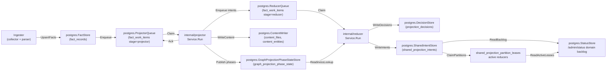
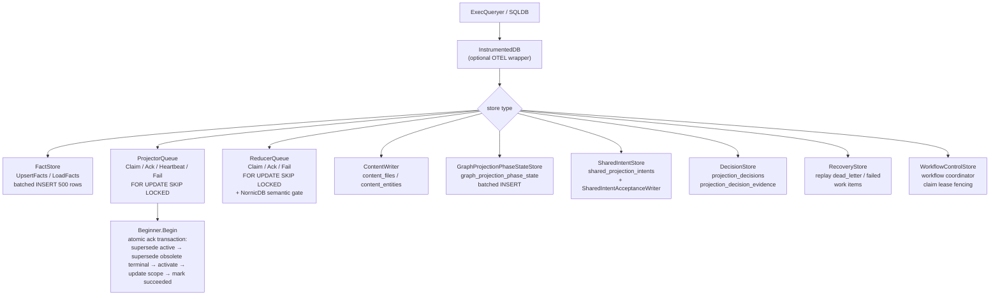

# storage/postgres

`storage/postgres` owns Eshu's relational persistence layer: facts, queue state,
content store, status, recovery data, decisions, webhook refresh triggers,
shared projection intents, AWS scan status, and workflow coordination tables.
It is the single durable source of truth for pipeline state that projector,
reducer, ingester, collectors, and the API surface all share.

## Where this fits in the pipeline

## Internal flow

## Lifecycle / workflow

The detailed lifecycle contract lives in
[`lifecycle-and-workflow-guide.md`](lifecycle-and-workflow-guide.md). Keep that
guide current when changing bootstrap DDL ordering, fact persistence, projector
or reducer queue behavior, workflow fencing, graph projection phase state,
webhook triggers, AWS scan status, or runtime drift evidence loading.

High-signal invariants for this package:

- Bootstrap DDL is idempotent and ordered through `BootstrapDefinitions`.
- Fact writes batch at 500 rows, deduplicate `fact_id` within a batch, sanitize
  JSONB control bytes, and skip unchanged pending-or-active generations by
  `FreshnessHint`.
- Projector claims preserve one active source-local generation per `scope_id`,
  reclaim expired leases before fresh work, coalesce stale same-scope work, and
  atomically ack by superseding stale active generation, superseding older
  terminal same-scope generations, activating the target generation, updating
  the scope pointer, and marking work succeeded.
- Reducer claims share the lease/retry contract and add domain filters plus the
  NornicDB semantic gate for `semantic_entity_materialization` while
  source-local projection is in flight.
- Workflow, AWS pagination, AWS scan-status, and webhook stores use fencing
  keys so stale workers or replayed deliveries cannot overwrite newer durable
  truth.

## Exported surface

The full exported store inventory lives in
[`exported-surface-guide.md`](exported-surface-guide.md). Keep that guide in
lockstep with public constructors, schema helpers, reducer/query adapters, and
callable store contracts.

Primary groups:

- Database adapters: `ExecQueryer`, `Transaction`, `Beginner`, `SQLDB`,
  `SQLTx`, `InstrumentedDB`.
- Fact, queue, recovery, status, workflow, and webhook stores.
- Content stores and content writers, including bounded entity-batch
  concurrency and Postgres pool-budget notes.
- Graph projection phase, shared projection intent, acceptance, freshness, and
  readiness helpers used by reducer domains.
- Terraform and AWS drift adapters that keep reducer joins bounded by scope,
  generation, ARN allowlists, backend ownership, and active read-model indexes.

## Dependencies

- `internal/facts` — `facts.Envelope`
- `internal/projector` — `projector.ScopeGenerationWork`, `projector.Result`,
  `projector.IsRetryable`
- `internal/reducer` — `reducer.Domain`, `reducer.SharedProjectionIntentRow`,
  `reducer.GraphProjectionReadinessLookup`, `reducer.AcceptedGenerationLookup`
- `internal/recovery` — recovery store interface contracts
- `internal/scope` — `scope.ScopeKind`, `scope.GenerationStatus`,
  `scope.TriggerKind`
- `internal/status` — status store interface contracts
- `internal/telemetry` — `telemetry.Instruments` for `InstrumentedDB`
- `internal/workflow` — `workflow.ClaimSelector`, `workflow.ClaimMutation`
- `database/sql` — standard library

## Telemetry

- `eshu_dp_postgres_query_duration_seconds` — histogram per SQL operation,
  labeled `operation=read|write` and `store=<StoreName>`; recorded by
  `InstrumentedDB`
- Spans: `postgres.exec` and `postgres.query` from `InstrumentedDB`; carry
  `db.system=postgresql`, `db.operation`, and `eshu.store` attributes
- `AWSPaginationCheckpointStore` records AWS checkpoint load, save, resume,
  expiry, and failure events through
  `eshu_dp_aws_pagination_checkpoint_events_total`.
- `PostgresAWSCloudRuntimeDriftEvidenceLoader` logs malformed AWS runtime
  resource rows with `resource.fingerprint`, `resource.identity_kind`, and
  `resource.type`; it does not put raw ARNs, Terraform addresses, or
  secret-shaped resource names in operator logs.

To add instrumentation to a store, wrap the `ExecQueryer` passed to its
constructor with `InstrumentedDB{Inner: db, StoreName: "my_store", ...}`.

## Operational notes

- `eshu_dp_postgres_query_duration_seconds{store="queue", operation="read"}`
  elevated means claim latency is high; check `FOR UPDATE SKIP LOCKED`
  contention and index coverage on `fact_work_items`.
- `eshu_dp_postgres_query_duration_seconds{store="facts", operation="write"}`
  elevated means fact batch writes are slow; check connection pool and batch
  size (default 500).
- Dead-letter items accumulate in `fact_work_items` when `attempt_count >=
  MaxAttempts`; use `RecoveryStore` to replay after investigating
  `failure_class`.
- `ErrProjectorClaimRejected` or `ErrReducerClaimRejected` in logs means a
  heartbeat or ack arrived after lease expiry; the original worker must stop and
  not retry the ack.
- `graph_projection_phase_state` rows gate reducer edge domains. If missing
  for a scope generation, check `GraphProjectionPhaseRepairQueueStore` depth and
  projector logs for `publish_phases` stage errors.

## Extension points

- New store — implement against `ExecQueryer`; wrap with `InstrumentedDB` for
  observability; add a `*SchemaSQL()` function and register in
  `BootstrapDefinitions` if the store needs a new table.
- New queue domain — extend `ReducerQueue.Claim` domain filter; add the domain
  constant in `internal/reducer`.
- New schema table — add a `Definition` to `bootstrapDefinitions` in
  `schema.go`; keep DDL idempotent; place FK-dependent tables after their
  referenced tables in the slice.

## Gotchas / invariants

- `ProjectorQueue.Ack` runs five SQL statements inside a transaction. Pass a
  `SQLDB` or an `InstrumentedDB` wrapping
  a `SQLDB`; a plain `ExecQueryer` without `Beginner` will cause Ack to fail.
- `upsertFacts` deduplicates by `fact_id` before batching (`facts.go:206`).
  Skipping deduplication causes `SQLSTATE 21000` on `ON CONFLICT DO UPDATE`
  when the same `fact_id` appears twice in one batch.
- `ListFactsByKind` keeps a stable `(observed_at, fact_id)` keyset cursor
  (`facts_filtered.go:71`). Lowering the page size below the write batch size
  can make reducer-only reads spend most of their time in Postgres round trips
  rather than extraction or graph writes.
- `ListFactsByKindAndPayloadValue` is only for top-level JSON payload fields
  that are part of a reducer domain's truth contract. Do not use it to paper
  over missing parser metadata or to guess at nested payload shape.
- Shared projection intents are idempotent by `intent_id`. Writers should
  upsert the same row on retry rather than minting a new ID. The 2000-row
  upsert batch keeps each statement below Postgres' parameter limit while
  avoiding small-batch round trips on code-call-heavy repositories.
- Current source-run history is distinct from prior acceptance-unit history.
  `HasCompletedAcceptanceUnitDomainIntents` intentionally ignores
  `source_run_id` so new accepted runs can detect prior graph state;
  `HasCompletedAcceptanceUnitSourceRunDomainIntents` includes `source_run_id`
  so chunked code-call projection can skip only same-run retractions.
- `ListOwnedPackageDependencyTargets` serves workflow-coordinator derivation.
  Package-registry callers use package-level identities so repeated versions of
  one package cannot starve later packages. Vulnerability-intelligence callers
  use package-version identities. The rotation offset lets bounded full-corpus
  runs advance past the first sorted page without changing worker counts or
  query scope.
- `ListActivePackageManifestDependencyFacts` serves both package-source
  correlation and supply-chain impact. The query stays indexed on active Git
  dependency entities by `(package_manager, entity_name)`, so vulnerability
  impact can load repository lockfile evidence for one advisory package without
  waiting for package-registry enrichment to finish.
- `ListActiveSupplyChainImpactFacts` includes provider security alerts in the
  same package/repository-bounded read used for vulnerability, package, SBOM,
  image, and service evidence. This lets alert-seeded impact admission reuse
  active owned dependency evidence without scanning all repository alerts.
  Reducer reconciliation keeps provider-scoped repository IDs separate from
  canonical `repository_id` values, so Postgres fact payloads should preserve
  both when the source uses a provider-owned repository namespace.
- Advisory evidence reads stay bounded by first-class advisory identity fields,
  package IDs, or PURLs before active-generation validation. Performance
  Evidence: issue #868 changed the read path from a broad active vulnerability
  CTE to selector-first identity branches backed by
  `fact_records_vulnerability_active_*_lookup_v2_idx`; representative
  preserved-volume proof returned `CVE-2021-44228` in 0.691s cold and
  0.435s/0.439s warm, while `EXPLAIN ANALYZE` completed the present-CVE SQL in
  472.419ms using those indexes. No-Observability-Change: the API route still
  emits `query.advisory_evidence`, Postgres query duration metrics, truth
  envelope metadata, status/error bodies, `count`, `limit`, `truncated`, and
  `next_cursor`; no graph query, queue, reducer lane, worker, runtime knob, or
  metric label changed.
- The NornicDB semantic gate in `ReducerQueue.Claim` is gated on a boolean
  parameter and must not be removed without an ADR; it prevents
  `semantic_entity_materialization` storms on NornicDB label indexes.
- `WorkflowControlStore` claim mutations use `ErrWorkflowClaimRejected` for
  fenced writes; callers must stop processing when this error is returned.
- `WorkflowControlStore.FailClaimTerminal` uses a dense seven-argument SQL
  mutation because terminal failures do not requeue and therefore do not need a
  `visible_at` placeholder. Do not leave skipped parameter numbers in workflow
  claim SQL; Postgres must infer every prepared-statement parameter type before
  it can persist the terminal failure.
- `AWSScanStatusStore` mutations must keep their fencing guards. A stale AWS
  worker must not overwrite per-tuple scanner or commit state from a newer
  claim. ObserveAWSScan and CommitAWSScan stay pinned to the exact
  `(generation_id, fencing_token)` so stale collectors cannot clobber a newer
  owner. StartAWSScan accepts a cross-generation overwrite when the prior
  row is terminal OR the new `last_started_at` is strictly newer than the
  stored value (or the row has none), which lets a fresh workflow generation
  reclaim the per-target slot after an orphaned `running`/`pending` row was
  left by a collector that died mid-flight. Without this widening one
  orphaned row blocks every future generation and the workflow runtime spins
  stale-fence retries — see issue #612.
- `AWSScanStatusStore` returns `awscloud.ErrScanStatusStaleFence` when a
  mutation affects zero rows; callers wrap and route the failed claim to
  terminal (the AWS claimed runtime does this via
  `awsruntime.FailureClassStaleFence`) instead of looping it on the
  retryable queue.
- `WebhookTriggerStore` treats webhook payloads as trigger evidence only. The
  Git collector must still fetch the repository before freshness becomes true.
- `AWSFreshnessStore` treats AWS Config and EventBridge events as trigger
  evidence only. The AWS collector must still scan the affected service tuple
  before cloud inventory becomes fresh.
- Schema definitions in `bootstrapDefinitions` are applied in slice order.
  Tables with foreign key constraints on other tables must appear after their
  dependencies.

No-Regression Evidence: workflow terminal failure mutation coverage includes
`go test ./internal/storage/postgres -run TestWorkflowControlStoreFailClaimTerminalUsesDensePostgresParameters -count=1`
and a remote Postgres integration run of
`TestWorkflowControlStoreIntegrationFailClaimTerminalRecordsFailureWithoutParameterHole`.
The change preserves claim fencing, retryable requeue `visible_at`, claim
ordering, worker counts, and workflow status semantics.

No-Observability-Change: existing `workflow_work_items.last_failure_class`,
`workflow_claims.failure_class`, fenced mutation errors, collector logs, and
`/api/v0/index-status` continue to expose terminal workflow failures and active
claim counts; no new telemetry dimension was required.

No-Regression Evidence: owned dependency target selection is covered by
`go test ./internal/storage/postgres -run 'TestListOwnedPackageDependencyTargetsQuery|TestOwnedPackageDependencyTargetLimit' -count=1`.
The query remains scoped to active Git dependency facts, adds package-level
selection for package-registry derivation, keeps package-version selection for
vulnerability derivation, and rotates bounded reads by caller-provided offset.

No-Observability-Change: existing Postgres query-duration telemetry,
workflow-run `requested_scope_set`, workflow work-item status rows, collector
claim status, and `/api/v0/index-status` expose whether derived targets were
planned, repeated, completed, retried, or failed. The target reader adds no new
metric labels and does not include package names or versions in telemetry
labels.

## Related docs

- `docs/public/architecture.md` — pipeline and ownership table
- `docs/public/deployment/service-runtimes.md` — runtime lanes and Postgres config
- `docs/public/reference/telemetry/index.md` — metric and span reference
- `docs/public/reference/local-testing.md` — Postgres verification gates
- ADR: `docs/public/reference/backend-conformance.md`
- ADR: `docs/public/reference/graph-backend-operations.md`
