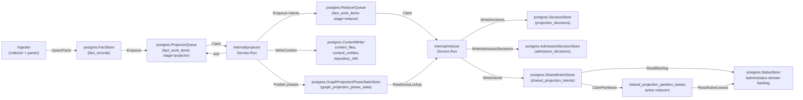
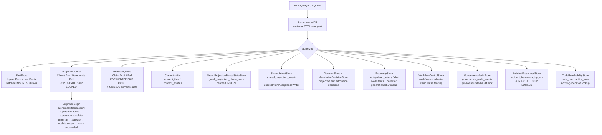

# storage/postgres

`storage/postgres` owns Eshu's relational persistence layer: facts, queue state,
content store, status, recovery data, projection and admission decisions,
webhook refresh triggers, shared projection intents, AWS scan status, and
workflow coordination tables. It is the single durable source of truth for
pipeline state that projector, reducer, ingester, collectors, and the API
surface all share.

## Where this fits in the pipeline

## Internal flow

## Lifecycle / workflow

The detailed lifecycle contract lives in
[`lifecycle-and-workflow-guide.md`](lifecycle-and-workflow-guide.md). Keep that
guide current when changing bootstrap DDL ordering, fact persistence, projector
or reducer queue behavior, workflow fencing, graph projection phase state,
webhook triggers, AWS scan status, or runtime drift evidence loading.

How retired, removed, tombstoned, and superseded evidence is kept out of
active-generation reads — the candidate-case matrix, the two retirement
mechanisms, and the index/pointer-bounded retraction shape — is documented in
[`retirement-proof-matrix.md`](retirement-proof-matrix.md) and proven by
`proof_domain_retirement_test.go` here plus `retirement_retract_proof_test.go`
in `internal/reducer`.

High-signal invariants for this package:

- Bootstrap DDL is idempotent and ordered through `BootstrapDefinitions`.
- `code_reachability_rows` stores reducer-materialized code reachable-set rows
  by active source generation, and `code_reachability_repository_watermarks`
  records the completed intent timestamp covered by each repository snapshot so
  empty reachable sets do not loop forever; query dead-code reads consult the
  rows before the compatibility scan over completed shared projection intents.
- Fact writes batch at 500 rows, deduplicate `fact_id` within a batch, sanitize
  JSONB control bytes, and skip unchanged pending-or-active generations by
  `FreshnessHint`.
- Projector claims preserve one active source-local generation per `scope_id`,
  reclaim expired leases before fresh work, coalesce stale same-scope work, and
  atomically ack by superseding stale active generation, superseding older
  terminal same-scope generations, activating the target generation, updating
  the scope pointer, and marking work succeeded.
- Reducer claims share the lease/retry contract and add domain filters plus the
  NornicDB semantic gate for `semantic_entity_materialization` while
  source-local projection is in flight. A reducer claim also supersedes
  unleased older-generation reducer rows once the same scope has a newer active
  generation, and status/drain/observer reads exclude those inactive rows from
  live readiness while preserving the durable work item for audit history.
- Workflow, AWS pagination, AWS scan-status, webhook, incident freshness, and
  hosted tenant/workspace grant stores use fencing, coalescing, or idempotent
  conflict keys so stale workers or replayed deliveries cannot overwrite newer
  durable truth.
- `GovernanceAuditStore` validates every event through
  `governanceaudit.NormalizeEvent`, derives a deterministic event id from the
  normalized safe fields, and uses `ON CONFLICT DO NOTHING` so retried writes
  are idempotent without storing raw principals, source names, prompts,
  provider responses, credential handles, private URLs, or token values.
- Tenant/workspace grant storage persists opaque tenant and workspace IDs,
  redacted display-handle hashes, scope grants, and repository grants. Active
  reads and claimed fact commits apply status, tombstone, effective-at, expiry,
  subject-class, and policy-revision predicates inside SQL before returning
  rows or writing source facts.
- Scoped API token storage is additive: it persists only opaque tenant and
  workspace IDs, token hashes, subject hashes, active bounds, expiry,
  revocation, and policy revision hashes without storing raw bearer tokens or
  changing current API, MCP, graph, collector, or workflow enforcement.
- Browser session storage is additive and hash-only: it persists session and
  CSRF digests, tenant/workspace IDs, optional scoped-token audit hashes, active
  grant bounds, expiry, revocation, the current workspace policy revision, and
  optional OIDC provider-proof metadata: provider config id, subject hash,
  validation time, and stale-after time. It does not store raw cookies, CSRF
  tokens, bearer tokens, provider tokens, raw group names, tenant names, or
  workspace names. Session resolution joins active tenants/workspaces, revokes
  stale OIDC-backed sessions before returning auth, treats upgraded OIDC rows
  with missing provider-proof timestamps as reauthentication-required, and
  re-checks the persisted policy revision against the workspace row before
  refreshing last-seen state, so provider-proof staleness, missing proof
  metadata, and policy changes invalidate dashboard sessions instead of
  extending them.
- Identity subject storage persists users, provider configs, local credential
  hashes, MFA handles, roles, grants, sessions, service principals, and token
  metadata with opaque IDs, hashes, and credential handles only. Local identity
  adds one-time bootstrap, invitation-only signup, bcrypt password proof,
  recovery-code MFA proof, lockout, resets, disablement, and time-boxed
  break-glass windows without storing raw proofs. Bootstrap uses a transaction
  advisory lock; invite acceptance and break-glass consumption serialize in SQL.
  It does not replace existing shared-token or scoped-token behavior.
- SAML SSO storage is additive to the identity schema. It persists only
  AuthnRequest digests, RelayState digests, replay digests, status, and
  timestamps. It never stores raw RelayState, SAMLResponse, assertions, NameID,
  group values, certificates, or IdP metadata XML. SAML external-subject
  resolution uses hash-only provider, subject, and group-claim inputs and
  requires active provider, user, tenant/workspace membership, admin role, and
  all-scope role grant rows before returning an all-scope session context.
- Repository ref readbacks stay bounded by the `repository_refs` primary key
  `(repo_id, ref_kind, name)` and default-ref index; writers replace only a
  fresh ref set carried by the current materialization so content-only
  generations do not erase branch metadata.
- Documentation fact readbacks stay bounded by visible finding/source/packet
  indexes plus `fact_records_documentation_target_refs_idx`, a partial JSONB GIN
  index over documentation target-reference payloads.
- Eshu search-document projection writes derived document facts and a persisted
  BM25 read index in the same reducer retry path. `eshu_search_index_documents`
  stores active-generation document payloads and lengths,
  `eshu_search_index_terms` stores term frequencies by bounded term key, and
  `eshu_search_index_stats` stores corpus size and average length so API/MCP
  search reads do not rebuild a full corpus per request. Vector metadata and
  value rows store derived embedding lifecycle state plus bounded numeric
  payloads by active generation, provider profile, source class, model, content
  hash, and index version without promoting vector similarity to graph truth.
  The pending sweeper re-enqueues scopes whose active search documents exist but
  stats are missing.
  `EshuSearchVectorPendingStore` lists active repository scopes whose curated
  search documents do not yet have ready vector metadata/value rows for the
  configured provider profile, source class, model id, and vector index
  version, allowing reducer vector builds to converge without request-time
  scans.
- Relationship evidence backfill stays bounded to latest active repository
  facts, file/content facts, and `gcp_cloud_relationship` facts. GCP
  relationship facts are included explicitly because they are provider-resource
  facts without repository file content, while the resolver still requires
  distinct catalog matches before evidence is persisted. Streaming commit-time
  evidence discovery remains repository-scope only; cloud-scope relationship
  facts enter repository generations through deferred backfill.
- Deferred relationship maintenance coordinates sharded ingesters through
  `deferred_maintenance_barriers` and
  `deferred_maintenance_barrier_arrivals`. Each shard records its local batch
  drain in the current epoch; only the shard that completes the epoch runs
  maintenance. Maintenance no longer serializes on one fleet-wide exclusive
  advisory lock, and it no longer holds every active repository's lock in one
  long transaction (issue #3482). Evidence discovery reads the whole committed
  fact corpus once (cross-repo relationships need every repository's facts), but
  the writes commit in bounded independent per-repository-batch transactions.
  Each batch transaction takes only its own repositories' exclusive advisory
  locks, namespaced under `deferred_relationship_maintenance` and acquired in
  sorted repository order to stay deadlock-free, re-reads those repositories'
  active generations under the lock, writes their evidence and readiness, and
  commits to release the locks before the next batch. Normal source generation
  commits take the matching shared lock for only their own repository partition
  (see `deferred_maintenance_lock.go`). The deployment-mapping reopen runs in its
  own transaction and the barrier-completion marker in another, so no step holds
  a fleet-wide lock. A commit therefore waits only for the in-flight batch that
  holds its repository, and a stall on one batch blocks at most that batch's
  repositories. If a shard arrives with a different shard count while an epoch is
  open, storage fails closed instead of creating competing epochs.
- `value_flow_fixpoint_components` stores reducer-owned solved value-flow
  component results by content-derived component key, so unchanged components
  can be reused across reducer restarts and replicas without re-solving.

No-Regression Evidence: scoped hot-path notes live in
[`evidence-notes.md`](evidence-notes.md), including #2059 claimed fact commit
tenant-grant fencing. No-Observability-Change: #2059 adds no new signal shape.

No-Regression Evidence: `go test ./internal/storage/postgres -run
'TestIngestionStore(CommitScopeGenerationTakesSharedMaintenanceBarrier|RunDeferredRelationshipMaintenanceTakesPerRepoExclusiveBarrier|ShardDrainBarrier)|TestBootstrapDefinitionsIncludeDeferredMaintenanceBarrier'
-count=1` covers the per-repo shared source-commit barrier and per-repo deferred
maintenance barrier, the multi-shard drain rendezvous, and bootstrap DDL.

### Deferred maintenance lock partitioning (issue #3482)

Deferred relationship maintenance commits bounded per-repository-batch
transactions keyed with two-argument transaction advisory locks
(`hashtext(namespace), hashtext(repo)`), while normal generation commits take the
matching shared lock for their repository partition. Locks are acquired in sorted
repository order, evidence/readiness writes are idempotent, open barrier epochs
are recoverable by later shard arrivals, and non-repository scopes no longer wait
on repository maintenance.

Performance/concurrency evidence: `TestWholeCorpusMaintenanceNeverHoldsFleetWideLockSet`,
`TestWholeCorpusMaintenanceDoesNotBlockUnrelatedCommit`, and
`TestDisjointRepoMaintenanceRunsConcurrently` prove peak locks stay at batch size,
unrelated commits avoid the current batch, and disjoint passes run in parallel.
Reproduce with `go test ./internal/storage/postgres -run
'TestWholeCorpusMaintenance|TestDisjointRepoMaintenanceRunsConcurrently|TestMaintenanceTakesPerRepoExclusiveLocksInOrder'
-race -count=1`. Observability stays on the existing deferred-backfill metrics and
per-repository batch logs so operators can attribute contention to one partition.

### Multi-cloud runtime drift evidence loader (issues #1997, #1998)

`PostgresMultiCloudRuntimeDriftEvidenceLoader` backs
`DomainMultiCloudRuntimeDrift` by joining observed cloud inventory, active
Terraform state, and Terraform config through one canonical `cloud_resource_uid`
keyspace. The reads are bounded by `(scope_id, generation_id)`, observed-identity
allowlists, active generation joins, and tombstone filters; Azure ARM ids are
case-folded only for `/subscriptions/` identities, while AWS/GCP identity casing
stays exact.

No-regression evidence: `TestPostgresMultiCloudRuntimeDriftEvidenceLoader` proves
provider joins, classification, empty-set short-circuiting, nil/blank rejection,
and concurrent stability; `TestPostgresMultiCloudRuntimeDriftEvidenceLoaderAzureStateCaseInsensitiveJoin`
pins the Azure-only case-fold. No new storage telemetry shape is added; reducer
spans, `postgres.query` child spans, publication counters, and redaction-aware
decode/unresolved warning logs carry the operator signal.

## Exported surface

The full exported store inventory lives in
[`exported-surface-guide.md`](exported-surface-guide.md). Keep that guide in
lockstep with public constructors, schema helpers, reducer/query adapters, and
callable store contracts.

Primary groups:

- Database adapters: `ExecQueryer`, `Transaction`, `Beginner`, `SQLDB`,
  `SQLTx`, `InstrumentedDB`.
- Fact, queue, recovery, status, workflow, and webhook stores.
- Governance audit store for validation-safe private event persistence,
  authorized bounded detailed reads, retention pruning, and aggregate-only
  status readback.
- Generation retention store for bounded superseded-generation cleanup,
  hashed retention events, changed-since expiry proof, and identity-safe
  content pruning.
- Service-scoped incident evidence loader for the incidents service-evidence
  family. It resolves PagerDuty provider service ids to catalog service ids
  through active exact/derived reducer correlation facts and fails closed for
  ambiguous repository ownership.
- Installed advisory target readers for active OS package and active attached
  SBOM component evidence used by vulnerability-intelligence planning.
- Content stores and content writers, including bounded entity-batch
  concurrency and Postgres pool-budget notes.
- Graph projection phase, shared projection intent, acceptance, freshness, and
  readiness helpers used by reducer domains.
- Hosted isolation and dashboard auth stores, including tenant/workspace
  grants, scoped API tokens, browser sessions, OIDC login state and group-role
  mappings, and dormant identity subject tables.
- Projection and admission decision stores for reducer-owned write decisions
  and scope/generation/domain-bounded correlation admission explanations.
- Fact indexes for reducer-owned package and service-catalog correlations,
  including service-catalog candidate repository IDs used by ambiguous
  repository-scoped API/MCP readbacks.
- Terraform and AWS drift adapters that keep reducer joins bounded by scope,
  generation, ARN allowlists, backend ownership, and active read-model indexes.
- `EshuSearchDocumentStore` reads curated design-430 search documents
  (`reducer_eshu_search_document`) for a scope's active generation, bounded by
  repository, source kind, and a capped page.
- `EshuSearchVectorPendingStore` reads only active repository scopes with
  unbuilt or stale vector sidecar rows for active search documents, bounded by
  scope limit and vector identity.
- `FunctionSummaryStore`, `FunctionSourceStore`, `FunctionGraphIDStore`, and
  `ValueFlowFixpointComponentStore` persist the durable value-flow inputs and
  solved component results used by the reducer's post-summary fixpoint.

## Dependencies

- `internal/facts` — `facts.Envelope`
- `internal/projector` — `projector.ScopeGenerationWork`, `projector.Result`,
  `projector.IsRetryable`
- `internal/reducer` — `reducer.Domain`, `reducer.SharedProjectionIntentRow`,
  `reducer.GraphProjectionReadinessLookup`, `reducer.AcceptedGenerationLookup`
- `internal/recovery` — recovery store interface contracts
- `internal/scope` — `scope.ScopeKind`, `scope.GenerationStatus`,
  `scope.TriggerKind`
- `internal/status` — status store interface contracts
- `internal/telemetry` — `telemetry.Instruments` for `InstrumentedDB`
- `internal/workflow` — `workflow.ClaimSelector`, `workflow.ClaimMutation`
- `database/sql` — standard library

## Telemetry

- `eshu_dp_postgres_query_duration_seconds` — histogram per SQL operation,
  labeled `operation=read|write` and `store=<StoreName>`; recorded by
  `InstrumentedDB`
- Spans: `postgres.exec` and `postgres.query` from `InstrumentedDB`; carry
  `db.system=postgresql`, `db.operation`, and `eshu.store` attributes
- `AWSPaginationCheckpointStore` records AWS checkpoint load, save, resume,
  expiry, and failure events through
  `eshu_dp_aws_pagination_checkpoint_events_total`.
- `PostgresAWSCloudRuntimeDriftEvidenceLoader` logs malformed AWS runtime
  resource rows with `resource.fingerprint`, `resource.identity_kind`, and
  `resource.type`; it does not put raw ARNs, Terraform addresses, or
  secret-shaped resource names in operator logs.

To add instrumentation to a store, wrap the `ExecQueryer` passed to its
constructor with `InstrumentedDB{Inner: db, StoreName: "my_store", ...}`.

## Operational notes

- `eshu_dp_postgres_query_duration_seconds{store="queue", operation="read"}`
  elevated means claim latency is high; check `FOR UPDATE SKIP LOCKED`
  contention and index coverage on `fact_work_items`.
- `eshu_dp_postgres_query_duration_seconds{store="facts", operation="write"}`
  elevated means fact batch writes are slow; check connection pool and batch
  size (default 500).
- Dead-letter items accumulate in `fact_work_items` when `attempt_count >=
  MaxAttempts`; use `RecoveryStore` to replay after investigating
  `failure_class`.
- `ErrProjectorClaimRejected` or `ErrReducerClaimRejected` in logs means a
  heartbeat or ack arrived after lease expiry; the original worker must stop and
  not retry the ack.
- `graph_projection_phase_state` rows gate reducer edge domains. If missing
  for a scope generation, check `GraphProjectionPhaseRepairQueueStore` depth and
  projector logs for `publish_phases` stage errors.
- `graph_endpoint_presence` (migration `024`, `GraphEndpointPresenceStore`) is
  the uid-exact, **cross-scope** endpoint-readiness primitive for the secrets/IAM
  graph projection (issue #1380). Keyed by `(keyspace, uid)`, it is written
  idempotently by the CloudResource and KubernetesWorkload node materializers
  only when the projection feature is enabled, and read via `MissingUIDs` (one
  bounded `uid = ANY(...)` query). Unlike `graph_projection_phase_state` it proves
  a *specific node* committed, which the scope/generation-keyed phase table
  cannot express across scopes.
- `secrets_iam_endpoint_not_ready` is a non-counting reducer retry class. It
  stays `retrying` with normal backoff and preserves the specific failure class,
  but single and batch claims do not increment `attempt_count` while that class
  is pending. This lets cross-scope endpoint readiness wait past
  `ESHU_REDUCER_MAX_ATTEMPTS` without terminally dropping edges.

No-regression and observability proof for this retry class lives in
[`evidence-notes.md`](evidence-notes.md#reducer-endpoint-readiness-retry-1391).

## Extension points

- New store — implement against `ExecQueryer`; wrap with `InstrumentedDB` for
  observability; add a `*SchemaSQL()` function and register in
  `BootstrapDefinitions` if the store needs a new table.
- New queue domain — extend `ReducerQueue.Claim` domain filter; add the domain
  constant in `internal/reducer`.
- New schema table — add a `Definition` to `bootstrapDefinitions` in
  `schema.go`; keep DDL idempotent; place FK-dependent tables after their
  referenced tables in the slice.

## Gotchas / invariants

Detailed query, queue, fact-readback, runtime, and fencing invariants live in
[`gotchas-and-invariants.md`](gotchas-and-invariants.md). Keep that companion
note current when changing storage behavior that touches those contracts.

Additional historical no-regression notes for incident freshness, incident
routing, workflow terminal failure, readiness gating, owned dependency targets,
and advisory targets live in [`evidence-notes.md`](evidence-notes.md).

## Related docs

- `docs/public/architecture.md` — pipeline and ownership table
- `docs/public/deployment/service-runtimes.md` — runtime lanes and Postgres config
- `docs/public/reference/telemetry/index.md` — metric and span reference
- `docs/public/reference/local-testing.md` — Postgres verification gates
- ADR: `docs/public/reference/backend-conformance.md`
- ADR: `docs/public/reference/graph-backend-operations.md`

## ServiceCatalogIDResolver evidence (#2877 / #2863)

`ServiceCatalogIDResolver` (`service_catalog_id_resolver.go`) resolves a workload
id to its durable catalog service id over `reducer_service_catalog_correlation`
facts, the bridge the service intelligence report's incident lane needs (the
incident loader keys on the catalog service id, the service story exposes the
workload id).

The resolve query is bounded by active-generation
`reducer_service_catalog_correlation` facts and the partial
`fact_records_service_catalog_correlations_workload_idx` index leading with
`payload->>'workload_id'`. It fails closed on ambiguity and is covered by focused
resolver tests plus `schema_service_catalog_test.go`. Failures are wrapped with
`%w`, while the report handler contributes the existing incident-load logs and API
request metrics.

### Bounded incident read for the report surface

`ServiceIncidentEvidenceLoader.GetIncidentEvidenceForServicesBounded`
(`serviceIncidentEvidenceBoundedQuery` = the unbounded join plus `LIMIT $2`) caps
the rows one report request loads. The reducer materialization path keeps the
unbounded `GetIncidentEvidenceForServices` because it must observe every routed
incident; only the read surface caps the load.

The report source passes `reportIncidentEvidenceRowLimit` (512), above the
surfaced incident bound but below unbounded history. The reducer path keeps the
unbounded query; the report query appends `LIMIT $2`, pinned by
`TestServiceIncidentEvidenceBoundedQueryAppliesRowLimit`. Load failures use the
existing `serviceintel.incident_load_error` log.

## Repository catalog cache on the ingestion hot path (#3481)

`commitScopeGeneration` uses a per-store `repositoryCatalogCache` instead of
reloading the whole repository fact catalog on every commit. The cache contains
repository identity and aliases, is shared safely across commit goroutines, and
invalidates when a generation introduces a new repository or changes a known
repository's slug/name. Cold loads run on the open ingestion transaction's
connection to avoid pool self-deadlock at `ESHU_POSTGRES_MAX_OPEN_CONNS=1`.

Accuracy and concurrency are pinned by
`TestIngestionStoreLoadsCatalogOnOpenTransaction`,
`TestIngestionStoreReloadsRepositoryCatalogAfterNewRepository`,
`TestIngestionStoreReloadsCatalogWhenKnownRepoAliasDrifts`,
`TestIngestionStoreSharedCatalogCacheIsConcurrencySafe`, and the proof-domain
flows. `BenchmarkIngestionStoreCatalogLoadsPerCommit` showed a 1000-repo/200-commit
harness dropping from 1.000 to 0.005 catalog loads per commit, with about 3.25x
faster runtime and lower memory/allocations. Operator proof is in
`load_repository_catalog` (`catalog_cache_hit`, `catalog_loads_total`) and
`repository_catalog_invalidated` structured logs.

## Scope-bounded relationship backfill catalog (#3500)

When a generation onboards a new repository, `commitScopeGeneration` runs
`backfillRelationshipEvidenceForNewRepositories` so pre-existing source repos
that reference the new repo gain cross-repo evidence the streaming pass (which
only sees the current batch) could not see. Before #3500 this path built the
`DiscoverEvidence` catalog matcher from the **whole fleet** catalog and then
discarded every result not targeting a new repo via `filterEvidenceByTargetRepo`,
so matcher build and per-fact match memory grew O(all repositories) on every
onboarding commit.

`repositoryScopedCatalog` now narrows the matcher input to just the repositories
the generation onboarded, the same scope-bounded model the AWS relationship
hash-join (`reducer/aws_relationship_join.go`) uses. `DiscoverEvidence` is a pure
function of `(envelopes, catalog)` and every emitted `EvidenceFact.TargetRepoID`
is a catalog entry, so matching against the new-repo-scoped catalog yields exactly
the evidence the full-catalog pass produced and then filtered. The post-filter is
removed because the scoped catalog cannot emit evidence for any other target.

Accuracy is pinned by `TestRepositoryScopedCatalogBoundsToNewRepos` (the scope is
exactly the new-repo entries regardless of fleet size) and
`TestBackfillScopedCatalogDiscoversSameEvidenceAsFullCatalog` (scoped discovery
equals the prior full-catalog-then-filter result edge-for-edge).

Benchmark Evidence: `BenchmarkBackfillDiscoveryFullCatalog` vs
`BenchmarkBackfillDiscoveryScoped` on Apple M4 Pro (`go test -bench
BenchmarkBackfillDiscovery -benchmem`, one source fact per fleet repo, fixed
two-repo onboarding delta). At a 5000-repo fleet the scoped path drops catalog
matcher memory from `5009964 B/op`/`65117 allocs/op` to `1508890 B/op`/`25072
allocs/op` (about 3.3x less memory, 2.6x fewer allocations); at 1000 repos from
`968620 B/op`/`13058 allocs/op` to `338582 B/op`/`5045 allocs/op`. The matcher
build and the discarded full-catalog evidence set no longer scale with fleet
size, so onboarding-commit correlation memory scales with the onboarding delta.
No-Observability-Change: the backfill emits no new metric, span, or log shape;
existing `relationship_backfill` commit-stage timing and the evidence-persist
rows still surface the path, now with bounded matcher cost.

### Content-scoped per-commit fact load (#3570)

The #3500 scope bound narrowed the catalog matcher but left the per-commit fact
load at O(all source facts): `backfillRelationshipEvidenceForNewRepositories`
still ran `loadLatestRelationshipFacts`, which scans every repository's
latest-generation `content`/`file`/`gcp_cloud_relationship` facts on every
onboarding commit, ships them all to Go, and iterates them all through
`DiscoverEvidence`. So onboarding-commit *time* still grew with fleet size.

`loadOnboardedRepoScopedRelationshipFacts` replaces that load on the per-commit
path. It runs `listOnboardedRepoScopedRelationshipFactRecordsQuery`, the
latest-generation sibling of the full query, with an added predicate
`lower(payload::text) LIKE ANY($1)`. The anchors come from
`backfillRelationshipAnchorTerms`: `relationships.CatalogPayloadAnchors` over the
newly onboarded repositories' catalog entries, plus the unconditional
`argoCDOverSelectAnchors`. The corpus-wide deferred path
(`BackfillAllRelationshipEvidence`) now scopes its load the same way — see
[Corpus-wide deferred fact load (#3569)](#corpus-wide-deferred-fact-load-3569).

The predicate is a **provable superset** of the facts the in-memory
`catalogMatcher` could match against the new-repo-scoped catalog. The matcher
accepts an alias only when its tokens appear as a consecutive token subsequence
of a candidate string, so every alias token a match needs is a substring of the
lowercased candidate. Content/file payloads store candidate strings verbatim
(file bodies are raw UTF-8 under `content`/`content_body`; `parsed_file_data` is
nested JSON whose `/`, `.`, and `-` survive escaping), and gcp facts store the
resource names verbatim, so every needed token is a substring of
`lower(payload::text)`. Two correctness carve-outs:

- **Private Terraform registry modules.** For a catalog alias
  `terraform-modules-<provider>` the matcher resolves via
  `privateTerraformRegistryProvider`, where only the `<provider>` path segment
  appears in the payload, never the full alias. `CatalogPayloadAnchors` therefore
  also emits the captured `<provider>` suffix as an anchor.
- **ArgoCD ApplicationSet template synthesis (two-phase load).**
  `discoverArgoCDDocumentEvidence` renders candidate repoURLs by substituting
  template parameters harvested from a *different* config repository's content and
  from `normalizePlatformToken`'d path basenames, so the matched token need not
  appear in the ArgoCD fact's own payload. ArgoCD-shaped facts are over-selected
  unconditionally via `argoCDOverSelectAnchors` (`kind: Application`,
  `kind: ApplicationSet`, `argocd_applications`, `argocd_applicationsets`,
  `"artifact_type":"argocd"`) — that is **phase one**. But an ApplicationSet's git
  file generator targets an *external* config repo, and the deploy repoURL is
  synthesized from that config file's params (e.g. `team` + `service`), so the
  newly-onboarded deploy repo's alias appears in neither the ApplicationSet
  payload nor the config file. Neither the alias anchors nor the ArgoCD markers
  select that external config file, so phase one alone would drop the deploy edge.
  **Phase two** repairs this: `ResolveArgoCDGeneratorConfigRepos` parses the loaded
  ApplicationSets' generator repoURLs, resolves the config repos against the full
  catalog, and `loadArgoCDGeneratorConfigFacts` reloads those repos' generator-path
  (`.yaml`/`.yml`/`.json`) content/file facts, which `mergeRelationshipFacts` folds
  into the scoped load so the content index `DiscoverEvidence` builds is complete.
  `backfillScopedCatalog` additionally adds the config repos' catalog entries
  because the deploy edge resolves the intermediate config repoURL against the
  catalog before the target — the same intermediate-match pattern as GCP source
  resolution. Adding a config repo cannot create a spurious edge: the deploy target
  must still be a catalog entry (a new repo), and the config repo is excluded as a
  deploy target by discovery.

Over-selection is safe; under-selection would drop correlation truth. Accuracy is
pinned by `TestCatalogPayloadAnchorsSelectsEveryExtractorFamily` (one matching
fact per extractor family, including the private-registry module and the
ApplicationSet, is selected), the central
`TestScopedFactLoadEqualsFullLoadForScopedCatalog` gate (discovery over the
anchor-scoped load equals discovery over the full corpus, edge-for-edge, on a
mixed corpus that genuinely excludes non-matching facts), and
`TestTwoPhaseScopedLoadIncludesExternalArgoCDConfig` (the two-phase load discovers
the external-config-synthesized ApplicationSet deploy edge that a single marker-only
phase drops, matching the full-corpus result edge-for-edge).

Benchmark Evidence: `BenchmarkBackfillDiscoveryFullFleet{1k,5k}` vs
`BenchmarkBackfillDiscoveryScopedFleet{1k,5k}` in
`go/internal/relationships/catalog_anchor_bench_test.go` on Apple M5 Max
(`go test ./internal/relationships -run '^$' -bench BenchmarkBackfillDiscovery
-benchmem`, one source fact per fleet repo, fixed one-repo onboarding delta).
Per-commit discovery cost for the full-load path is `7930898 ns/op`
(`784070 B/op`, `12972 allocs/op`) at a 1000-repo fleet and `38288156 ns/op`
(`3721535 B/op`, `65002 allocs/op`) at 5000 repos — linear in fleet size. The
content-scoped path is `14093 ns/op` (`3537 B/op`, `48 allocs/op`) at 1000 repos
and `13914 ns/op` (`3545 B/op`, `48 allocs/op`) at 5000 repos — flat. Per-commit
backfill time and memory now scale with the onboarding delta, not the fleet.

No-Observability-Change: the per-commit backfill emits no new metric, span, or
log shape; the existing `relationship_backfill` commit-stage timing and the
evidence-persist rows still surface the path, now reading a bounded fact set.

### Corpus-wide deferred fact load (#3569)

The #3570 scope bound covered the per-commit path, but the corpus-wide deferred
backfill (`BackfillAllRelationshipEvidence`, invoked by
`RunDeferredRelationshipMaintenance` during ingester maintenance and bootstrap
seeding) still ran `loadLatestRelationshipFacts`, which scanned **every**
repository's latest-generation `content`/`file`/`gcp_cloud_relationship` facts,
shipped them all to Go, and iterated them all through `DiscoverEvidence` on every
pass. So deferred-pass *time* stayed O(all source facts) as the fleet grew, even
though the discovered evidence is bounded by the facts that actually reference a
catalog repository.

`BackfillAllRelationshipEvidence` now calls the shared
`loadAnchorScopedRelationshipFacts` two-phase loader with the **full** catalog as
both the anchor source and the ArgoCD config-resolution catalog. Unlike the
per-commit path (anchors over the onboarding delta), the deferred pass treats
every repository as an eligible target, so anchors derive from
`CatalogPayloadAnchors(fullCatalog)` unioned with `argoCDOverSelectAnchors`. The
load runs `listOnboardedRepoScopedRelationshipFactRecordsQuery`
(`lower(payload::text) LIKE ANY($1)`) plus the phase-two ArgoCD generator-config
reload, exactly as the per-commit path does. `loadLatestRelationshipFacts` and
its unbounded query are removed.

Because the anchor predicate is the same **provable superset** of the facts
`DiscoverEvidence` can match against a catalog (the matcher accepts an alias only
when its tokens are a substring of the lowercased payload; private-registry
provider suffixes and ArgoCD template synthesis are the two carve-outs handled by
`CatalogPayloadAnchors` and `argoCDOverSelectAnchors` + phase two), scoping the
deferred load to the full-catalog anchors yields **identical** relationship truth
to the prior full-corpus load. The only facts excluded are those that match no
catalog anchor at all — facts that reference no repository and therefore could
form no edge.

Accuracy is pinned by `TestCorpusWideAnchorScopedLoadEqualsFullLoad`
(`go/internal/relationships/catalog_anchor_superset_test.go`): discovery over the
full-catalog anchor-scoped load equals discovery over the full corpus,
edge-for-edge, on a mixed corpus whose orphan facts are genuinely excluded. The
scope-bounding query selection is pinned by
`TestBackfillAllRelationshipEvidenceUsesScopedFactQuery` and
`TestBackfillAllRelationshipEvidenceShortCircuitsWithoutAnchors`
(`go/internal/storage/postgres/ingestion_backfill_deferred_scope_test.go`): the
deferred backfill issues the parameterised anchor-scoped query (never the
full-corpus query) and issues no fact query at all when the catalog has no usable
anchors, while still publishing backward-evidence readiness.

Benchmark Evidence: `BenchmarkDeferredBackfillDiscoveryFullFleet{1k,5k}` vs
`BenchmarkDeferredBackfillDiscoveryScopedFleet{1k,5k}` in
`go/internal/relationships/catalog_anchor_bench_test.go` on Apple M5 Max
(`go test ./internal/relationships -run '^$' -bench BenchmarkDeferredBackfillDiscovery
-benchmem`, one edge-forming fact plus four orphan facts per fleet repo,
whole-fleet catalog). At a 1000-repo fleet deferred discovery drops from
`25082833 ns/op` (`42771906 B/op`, `383025 allocs/op`) to `4549356 ns/op`
(`3721903 B/op`, `39899 allocs/op`) — about 5.5x faster, 11x less memory. At 5000
repos it drops from `145086120 ns/op` (`211665884 B/op`, `1915095 allocs/op`) to
`23943981 ns/op` (`19111233 B/op`, `200008 allocs/op`) — about 6x faster, 11x
less memory. Both yield the same evidence set. The orphan facts the full corpus
shipped and iterated no longer reach `DiscoverEvidence`.

No-Observability-Change: the deferred backfill emits no new metric, span, or log
shape; the existing `relationship.backfill_deferred` span, the
`DeferredBackfillDuration`/`DeferredBackfillEvidence` instruments, and the
`deferred_backfill_completed` log line still surface the path, now recording a
bounded fact load. A shrinking `DeferredBackfillDuration` against a growing fleet
is the operator-visible signal that the scope bound is in effect.
