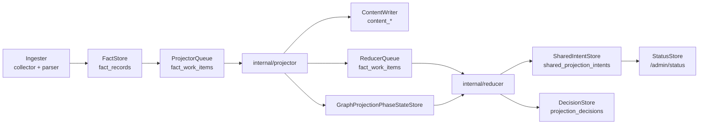

# storage/postgres

`storage/postgres` owns Eshu's relational persistence layer. It stores facts,
queue state, content rows, status data, recovery rows, workflow coordination,
webhook refresh triggers, AWS scan status, shared projection intents, and
reducer-owned read models.

This package is the durable coordination point between ingesters, projectors,
reducers, collectors, and API/MCP reads. It does not make graph truth decisions;
it preserves the state that lets other packages make and observe those
decisions.

## Runtime Flow



All stores accept narrow database interfaces (`ExecQueryer`, `Queryer`,
`Beginner`) so tests can use focused fakes and command wiring can wrap the
connection with `InstrumentedDB`.

## Store Groups

| Area | Main stores | Contract |
| --- | --- | --- |
| Facts and generations | `FactStore`, `IngestionStore` | Persist source facts, scope generations, active generation pointers, and freshness de-dupe. |
| Queues | `ProjectorQueue`, `ReducerQueue`, `QueueObserverStore` | Claim, heartbeat, ack, fail, retry, dead-letter, and observe work items. |
| Content | `ContentWriter`, `ContentStore` | Persist file and entity content for query surfaces. |
| Projection phases | `GraphProjectionPhaseStateStore`, `GraphProjectionPhaseRepairQueueStore` | Publish graph readiness rows and repair missing phase publication. |
| Shared projection | `SharedIntentStore`, `SharedIntentAcceptanceWriter`, `SharedProjectionAcceptanceStore` | Store reducer-owned edge intents and acceptance history. |
| Status and recovery | `StatusStore`, `StatusRequestStore`, `RecoveryStore` | Feed admin status, async status requests, and replay failed work. |
| Workflow and webhooks | `WorkflowControlStore`, `WebhookTriggerStore` | Fence collector claims and persist provider refresh triggers. |
| AWS stores | `AWSScanStatusStore`, `AWSPaginationCheckpointStore`, `AWSFreshnessStore`, `AWSCloudRuntimeDriftFindingStore` | Persist bounded AWS scan, checkpoint, freshness, and drift read-model state. |
| Drift and reachability | `PostgresDriftEvidenceLoader`, `PostgresTerraformBackendQuery`, `IaCReachabilityStore` | Provide reducer adapters for Terraform config/state drift and IaC reachability. |
| Reducer fact read models | active fact queries and reducer writers for package, image, CI/CD, service-catalog, SBOM, and supply-chain domains | Keep API/MCP reads bounded by indexed fact kind, scope, repository, digest, package, CVE, owner, or subject handles. |

## Core Contracts

- Schema bootstrap is idempotent and ordered. DDL helpers use `IF NOT EXISTS`,
  and tables with foreign keys must appear after referenced tables in
  `BootstrapDefinitions`.
- `graph_schema_applications` stores the graph backend/schema fingerprint after
  `eshu-bootstrap-data-plane` applies graph DDL. Preserved-volume restarts use
  it to skip repeated NornicDB constraint/index checks when the schema is
  unchanged.
- Fact writes deduplicate by `fact_id` before batching. Skipping
  `deduplicateEnvelopes` can trigger `SQLSTATE 21000` in a multi-row
  `ON CONFLICT DO UPDATE`.
- Fact payloads pass through `sanitizeJSONB` before insert so binary or
  non-UTF-8 repository content does not poison Postgres JSONB writes.
- `CommitScopeGeneration` de-dupes against the newest pending or active
  same-scope generation. Failed generations do not satisfy the skip path, so a
  failed first projection remains retryable.
- `ProjectorQueue.Claim` preserves one active source-local generation per
  `scope_id` with `FOR UPDATE SKIP LOCKED`, oldest-ready-row selection,
  expired-lease priority, stale duplicate reclaim, and supersession of older
  same-scope generations.
- `ProjectorQueue.Ack` is a four-step transaction: supersede stale active
  generation, activate target generation, update scope pointer, mark work
  succeeded. It requires a `Beginner` such as `SQLDB` or `InstrumentedDB` around
  `SQLDB`.
- `ReducerQueue.Claim` owns the NornicDB semantic gate. When enabled,
  `semantic_entity_materialization` waits for source-local projection to stop
  competing for graph label indexes.
- `StatusStore` merges `fact_work_items`, pending `shared_projection_intents`,
  and active shared projection leases so `/admin/status` does not report
  healthy before reducer-owned edges become graph-visible.
- Reducer-owned read models use partial indexes for active facts such as
  package correlations, container-image identity, CI/CD run correlations,
  service-catalog correlations, SBOM/attestation attachments, and
  supply-chain impact. Do not add an API/MCP read path that scans all
  `fact_records` rows.
- Workflow, projector, reducer, AWS checkpoint, and AWS scan-status mutations
  are lease- or fencing-token-aware. A rejected fenced write means the caller no
  longer owns the work and must stop.
- Scheduled collector target admission is guarded by
  `CreateRunWithWorkItemsIfNoOpenTargets`. It skips duplicate non-terminal
  targets and uses the deterministic run id plus target tuple as an idempotency
  key during preserved-volume restarts.

## AWS And Drift Boundaries

`PostgresAWSCloudRuntimeDriftEvidenceLoader` loads AWS rows from one
`(scope_id, generation_id)` and joins Terraform state only through the current
AWS ARN allowlist. Unknown or ambiguous Terraform backend ownership stays
unknown or ambiguous; it is not proof that configuration is absent.

`PostgresDriftEvidenceLoader` compares Terraform config and state through a
shared dot-path address contract. State-side flattening in
`tfstate_drift_evidence_state_row.go` must stay byte-identical to the parser
encoding in `go/internal/parser/hcl/terraform_resource_attributes.go`.
Module-aware drift joining uses forward-slash paths with the standard `path`
package, not `path/filepath`.

AWS checkpoint, freshness, and scan-status stores hold trigger and scanner
state only. The AWS collector must still scan the affected tuple before cloud
inventory becomes fresh.

## Content Writer Pool Budget

`ContentWriter` resolves entity-batch concurrency once in `NewContentWriter`.
Auto-default concurrency is `runtime.NumCPU()` clamped to 4; explicit overrides
can opt up to 8 with `ESHU_CONTENT_WRITER_BATCH_CONCURRENCY` or
`WithBatchConcurrency`. Peak Postgres demand is roughly
`ESHU_PROJECTOR_WORKERS * ESHU_CONTENT_WRITER_BATCH_CONCURRENCY` plus collector,
status, and heartbeat connections. When that exceeds the configured Postgres
pool, `database/sql` queues connection acquisition and throughput drops.

## Telemetry

Wrap stores with `InstrumentedDB` in command wiring to emit
`eshu_dp_postgres_query_duration_seconds` and `postgres.exec` /
`postgres.query` spans. Set `StoreName` to a short stable label such as
`facts`, `queue`, `status`, or `workflow`.

Other package-owned signals:

- `eshu_dp_aws_pagination_checkpoint_events_total` records AWS checkpoint load,
  save, resume, expiry, and failure events.
- Queue claim latency also appears in `eshu_dp_queue_claim_duration_seconds`.
- Status, workflow-run state, target suppression logs, and phase readiness are
  visible through `/admin/status`, workflow tables, and structured logs.

## Operational Notes

- High `eshu_dp_postgres_query_duration_seconds{store="queue"}` usually means
  claim contention or missing index coverage on `fact_work_items`.
- High `eshu_dp_postgres_query_duration_seconds{store="facts"}` usually means
  fact batch writes or connection-pool pressure.
- `ErrProjectorClaimRejected`, `ErrReducerClaimRejected`, or
  `ErrWorkflowClaimRejected` means a lease or fence rejected the mutation. The
  worker must stop instead of retrying the terminal write.
- Missing `graph_projection_phase_state` rows block edge domains. Check the
  repair queue and projector `publish_phases` logs before changing reducer
  readiness behavior.
- Dead-letter rows should be replayed with `RecoveryStore` only after the
  underlying `failure_class` has been investigated.

## Verification

```bash
go test ./internal/storage/postgres -count=1
go run ./cmd/eshu docs verify ../go/internal/storage/postgres --limit 1000 \
  --fail-on contradicted,missing_evidence
```

Use focused tests when touching a store. Queue changes need claim, heartbeat,
ack/fail, retry, and stale-lease cases. Drift changes need cross-package tests
that prove parser and state dot-path encoding still match.

## Related Docs

- [Postgres Change Guide](change-guide.md)
- [Architecture](../../../../docs/public/architecture.md)
- [Service Runtimes](../../../../docs/public/deployment/service-runtimes.md)
- [Telemetry Reference](../../../../docs/public/reference/telemetry/index.md)
- [Local Testing](../../../../docs/public/reference/local-testing.md)
- [NornicDB Tuning](../../../../docs/public/reference/nornicdb-tuning.md)
