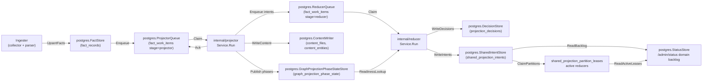
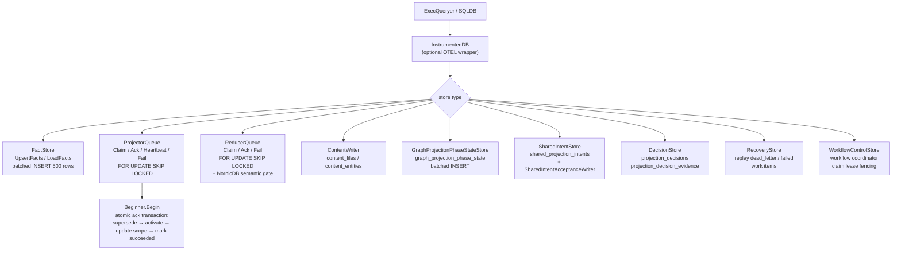

# storage/postgres

`storage/postgres` owns Eshu's relational persistence layer: facts, queue state,
content store, status, recovery data, decisions, shared projection intents, and
workflow coordination tables. It is the single durable source of truth for
pipeline state that projector, reducer, ingester, and the API surface all share.

## Where this fits in the pipeline

## Internal flow

## Lifecycle / workflow

### Schema bootstrap

`ApplyBootstrap` (or `ApplyBootstrapWithoutContentSearchIndexes`) applies all
`BootstrapDefinitions` in order. Each `Definition` carries a name and SQL DDL.
`ValidateDefinitions` enforces uniqueness. Schema DDL is idempotent
(`CREATE TABLE IF NOT EXISTS`, `CREATE INDEX IF NOT EXISTS`).

### Fact persistence

`FactStore.UpsertFacts` batches facts into multi-row INSERT statements of up
to 500 rows (17 columns each, well under the Postgres 65535-parameter limit).
`deduplicateEnvelopes` removes duplicate `fact_id` values within each batch
before sending to avoid `SQLSTATE 21000` on `ON CONFLICT DO UPDATE` when a
generation contains self-overwrites.

`FactStore.ListFactsByKind` uses the same 500-row page size for kind-filtered
reads (`facts_filtered.go:77`). Reducer domains such as semantic entities and
code calls use this path to avoid full-generation loads and thousands of tiny
Postgres round trips on large repositories. `ListFactsByKindAndPayloadValue`
adds a top-level JSON payload allowlist (`facts_filtered.go:115`) for reducer
domains whose correctness contract is tied to `content_entity.entity_type`,
such as inheritance and SQL relationships. Both paths select the full
`facts.Envelope` column shape before calling the shared scanner, so filtered
reads keep schema version, collector, fencing, and source-confidence metadata.

`sanitizeJSONB` strips `\u0000` escape sequences and raw control bytes
(`0x00–0x1F` except tab/newline/CR) from payloads before INSERT to prevent
`SQLSTATE 22P05` and `SQLSTATE 22P02` errors on repositories with binary or
non-UTF-8 content.

`CommitScopeGeneration` compares the incoming generation `FreshnessHint` with
the newest pending or active generation for the same scope. When the hint is
unchanged, the commit path logs and skips the redundant write so local polling
can observe files without recommitting identical snapshots or superseding
in-flight projector work. Failed generations do not satisfy this check, so a
failed first projection can still be retried by the next snapshot.

### Projector queue

`ProjectorQueue.Claim` uses `SELECT ... FOR UPDATE SKIP LOCKED` with a
per-scope in-flight conflict guard and an oldest-ready-row guard. Concurrent
claimers for the same `scope_id` must all target the same oldest ready work
item, so a worker cannot skip a locked older row and start a newer generation
for the same repository. Before selecting a candidate, claim coalesces older
same-scope projector rows and their pending or failed `scope_generations` to
`superseded` when a newer generation exists. That covers waiting rows and
obsolete terminal failures, so durable snapshot history remains available
without leaving stale local polling generations in the live backlog or health
summary.
`ProjectorQueue.Heartbeat` applies the same freshness check to a live claimed
or running row. When a newer pending or active generation exists for the scope,
heartbeat marks the older row and its generation `superseded` in one statement
and returns `projector.ErrWorkSuperseded` so the worker stops without acking
stale graph state.
Expired `claimed` or `running` rows are ordered ahead of ordinary pending rows
so stale leases are reclaimed before fresh work makes the status surface look
permanently overdue. Claim also demotes expired same-scope duplicate in-flight
rows back to `retrying` when a live sibling or a newly claimed sibling owns the
scope, which repairs queue state left by older owner crashes or claim races
without breaking the one-active-generation invariant. `Ack` runs a four-step atomic
transaction: supersede stale active generation → activate target generation →
update scope pointer → mark work succeeded. If `projector.IsRetryable(cause)`
returns true and `attempt_count < MaxAttempts`, `Fail` transitions to
`retrying` instead of `dead_letter`.

### Reducer queue

`ReducerQueue.Claim` extends the projector model with domain filtering and
NornicDB-specific semantic gates. When the NornicDB gate is active (`$5 = true`),
`semantic_entity_materialization` items are blocked while any source-local
projection is in-flight, preventing cross-scope contention on NornicDB label
indexes. The gate is disabled for Neo4j.

`NewReducerGraphDrain` exposes a small read-side gate for code-call projection.
It checks whether reducer-owned graph domains are still pending, claimed,
running, or retrying so the local-authoritative NornicDB profile can avoid
overlapping code-call edge writes with semantic, inheritance, SQL relationship,
deployment, or workload graph materialization.

### Shared projection intents

`SharedIntentStore` stores durable shared projection intents for reducer-owned
edge domains. `ListPendingAcceptanceUnitIntents` reads one bounded
scope/unit/run slice, while
`HasCompletedAcceptanceUnitSourceRunDomainIntents` answers whether that exact
source run has already completed a chunk. Code-call projection uses the latter
lookup to process very large accepted units in chunks without retracting edges
written by earlier chunks from the same run.

### Graph projection phase state

`GraphProjectionPhaseStateStore` persists `canonical_nodes_committed` phase
markers after `cypher.CanonicalNodeWriter.Write` completes. The
`NewGraphProjectionReadinessLookup` and `NewGraphProjectionReadinessPrefetch`
factories return `reducer.GraphProjectionReadinessLookup` implementations used
by edge-domain reducer workers to gate on canonical node availability before
writing edges.

### Workflow control

`WorkflowControlStore` persists workflow coordinator control-plane state with
fenced claim leases. `ErrWorkflowClaimRejected` is returned when a claim
mutation is rejected because the current owner no longer holds the lease.

## Exported surface

**Database interfaces**

- `ExecQueryer` — combined read/write adapter; accepted by all store
  constructors
- `Transaction` — `ExecQueryer` + `Commit`/`Rollback`
- `Beginner` — `Begin(ctx) (Transaction, error)`; implemented by `SQLDB`
- `SQLDB` — adapts `*sql.DB`; `SQLTx` adapts `*sql.Tx`
- `InstrumentedDB` — wraps `ExecQueryer` with OTEL spans and
  `pcg_dp_postgres_query_duration_seconds`

**Fact store**

- `FactStore` / `NewFactStore` — `UpsertFacts`, `LoadFacts`, `ListFacts`,
  `ListFactsByKind`, `ListFactsByKindAndPayloadValue`, `CountFacts`

**Queue stores**

- `ProjectorQueue` / `NewProjectorQueue` — `Claim`, `Ack`, `Heartbeat`, `Fail`,
  `Enqueue`; `ErrProjectorClaimRejected`
- `ReducerQueue` / `NewReducerQueue` — `Claim`, `Ack`, `Fail`, `Enqueue`
  (batch); `ErrReducerClaimRejected`
- `QueueObserverStore` / `NewQueueObserverStore` — queue depth, age, and
  blockage queries for the status surface

**Content stores**

- `ContentStore` / `NewContentStore` — `GetFileContent`, `GetEntityContent`,
  `SearchFileContent`, `SearchEntityContent`; `FileContentRow`, `EntityContentRow`
- `ContentWriter` / `NewContentWriter` — writes `content_files` and
  `content_entities`

**Phase state**

- `GraphProjectionPhaseStateStore` / `NewGraphProjectionPhaseStateStore` —
  batched upsert of phase state rows
- `GraphProjectionPhaseRepairQueueStore` / `NewGraphProjectionPhaseRepairQueueStore`
  — repair queue for phase re-publish
- `NewGraphProjectionReadinessLookup` / `NewGraphProjectionReadinessPrefetch`
  — implement `reducer.GraphProjectionReadinessLookup`

**Shared projection**

- `SharedIntentStore` / `NewSharedIntentStore` — reads
  `shared_projection_intents` and writes shared projection intents in bounded
  multi-row batches (`shared_intents_upsert.go:62`). It also exposes history
  lookups for prior acceptance-unit completion and current source-run chunk
  completion.
- `SharedIntentAcceptanceWriter` / `NewSharedIntentAcceptanceWriter` — writes
  intent acceptance rows; `NewSharedIntentAcceptanceWriterWithInstruments` adds
  metrics
- `CodeCallIntentWriter` / `NewCodeCallIntentWriter` — type alias for
  `SharedIntentAcceptanceWriter`
- `SharedProjectionAcceptanceStore` / `NewSharedProjectionAcceptanceStore`

**Status**

- `StatusStore` / `NewStatusStore` — reads scope, generation, queue, blockage,
  failure, coordinator, and domain backlog aggregates. `status_queries.go`
  merges `fact_work_items` with pending `shared_projection_intents` and active
  `shared_projection_partition_leases` for domain backlog rows. Lease-only rows
  stay visible even after the last pending intent is claimed, so `/admin/status`
  does not report healthy while reducer-owned shared projection work is still
  becoming graph-visible and does not report stalled while a reducer lease is
  actively moving that domain. The same store also runs the bounded
  `terraformStateLastSerialQuery` and `terraformStateRecentWarningsQuery` from
  `tfstate_status.go` so the admin status response carries one row per
  Terraform-state safe locator hash plus up to
  `MaxTerraformStateRecentWarnings` recent warning facts grouped by
  `warning_kind`.

**Decision store**

- `DecisionStore` / `NewDecisionStore` — upserts `projection_decisions` and
  `projection_decision_evidence`; `DecisionFilter` for scoped reads

**Recovery**

- `RecoveryStore` / `NewRecoveryStore` — replays `dead_letter` and `failed`
  work items to `pending`

**Status**

- `StatusStore` / `NewStatusStore` — scope counts, generation counts, stage
  counts, queue depth
- `StatusRequestStore` / `NewStatusRequestStore` — async status request
  persistence

**Ingestion**

- `IngestionStore` / `NewIngestionStore` — scope and generation upserts

**Relationships**

- `RelationshipStore` / `NewRelationshipStore` — relationship evidence facts
  and backfill
- `RepoScopeResolver` — resolves scope IDs from repository identifiers

**Workflow coordination**

- `WorkflowControlStore` / `NewWorkflowControlStore` — claim, heartbeat,
  release with lease fencing; `ErrWorkflowClaimRejected`, `ClaimSelector`,
  `ClaimMutation`

**Schema bootstrap**

- `BootstrapDefinitions`, `ApplyBootstrap`,
  `ApplyBootstrapWithoutContentSearchIndexes`, `EnsureContentSearchIndexes`,
  `ValidateDefinitions`, `ApplyDefinitions`
- Per-table DDL helpers: `DecisionSchemaSQL`, `RelationshipSchemaSQL`,
  `SharedIntentSchemaSQL`, `SharedProjectionAcceptanceSchemaSQL`,
  `GraphProjectionPhaseStateSchemaSQL`, `GraphProjectionPhaseRepairQueueSchemaSQL`,
  `WorkflowControlSchemaSQL`, `WorkflowCoordinatorStateSchemaSQL`,
  `IaCReachabilitySchemaSQL`

**IaC reachability**

- `IaCReachabilityStore` / `NewIaCReachabilityStore` — IaC-to-workload
  reachability rows; `IaCReachabilityRow`, `IaCReachability`, `IaCFinding`

**Freshness checks** (implement `reducer` interfaces)

- `NewAcceptedGenerationLookup` / `NewAcceptedGenerationPrefetch`
- `NewGenerationFreshnessCheck` / `NewPriorGenerationCheck`

**Terraform drift adapters** (implement reducer drift ports for chunk #163)

- `PostgresTerraformBackendQuery` (`tfstate_backend_canonical.go:48`) — answers
  `tfstatebackend.TerraformBackendQuery` from durable parser facts; recomputes
  each row's locator hash with `terraformstate.LocatorHash`.
- `PostgresDriftEvidenceLoader` (`tfstate_drift_evidence.go:51`) — builds the
  per-address `tfconfigstate.AddressedRow` slice from config + state + prior
  generation facts; skips the prior lookup when current serial is zero. The
  config and backend queries gate on `jsonb_array_length > 0` so files with
  empty parser buckets are not decoded.
- `IngestionStore.EnqueueConfigStateDriftIntents` (`drift_enqueue.go:55`) —
  Phase 3.5 trigger that enqueues one `config_state_drift` reducer intent per
  active `state_snapshot:*` scope after bootstrap Phase 3 finishes.

## Dependencies

- `internal/facts` — `facts.Envelope`
- `internal/projector` — `projector.ScopeGenerationWork`, `projector.Result`,
  `projector.IsRetryable`
- `internal/reducer` — `reducer.Domain`, `reducer.SharedProjectionIntentRow`,
  `reducer.GraphProjectionReadinessLookup`, `reducer.AcceptedGenerationLookup`
- `internal/recovery` — recovery store interface contracts
- `internal/scope` — `scope.ScopeKind`, `scope.GenerationStatus`,
  `scope.TriggerKind`
- `internal/status` — status store interface contracts
- `internal/telemetry` — `telemetry.Instruments` for `InstrumentedDB`
- `internal/workflow` — `workflow.ClaimSelector`, `workflow.ClaimMutation`
- `database/sql` — standard library

## Telemetry

- `pcg_dp_postgres_query_duration_seconds` — histogram per SQL operation,
  labeled `operation=read|write` and `store=<StoreName>`; recorded by
  `InstrumentedDB`
- Spans: `postgres.exec` and `postgres.query` from `InstrumentedDB`; carry
  `db.system=postgresql`, `db.operation`, and `pcg.store` attributes

To add instrumentation to a store, wrap the `ExecQueryer` passed to its
constructor with `InstrumentedDB{Inner: db, StoreName: "my_store", ...}`.

## Operational notes

- `pcg_dp_postgres_query_duration_seconds{store="queue", operation="read"}`
  elevated means claim latency is high; check `FOR UPDATE SKIP LOCKED`
  contention and index coverage on `fact_work_items`.
- `pcg_dp_postgres_query_duration_seconds{store="facts", operation="write"}`
  elevated means fact batch writes are slow; check connection pool and batch
  size (default 500).
- Dead-letter items accumulate in `fact_work_items` when `attempt_count >=
  MaxAttempts`; use `RecoveryStore` to replay after investigating
  `failure_class`.
- `ErrProjectorClaimRejected` or `ErrReducerClaimRejected` in logs means a
  heartbeat or ack arrived after lease expiry; the original worker must stop and
  not retry the ack.
- `graph_projection_phase_state` rows gate reducer edge domains. If missing
  for a scope generation, check `GraphProjectionPhaseRepairQueueStore` depth and
  projector logs for `publish_phases` stage errors.

## Extension points

- New store — implement against `ExecQueryer`; wrap with `InstrumentedDB` for
  observability; add a `*SchemaSQL()` function and register in
  `BootstrapDefinitions` if the store needs a new table.
- New queue domain — extend `ReducerQueue.Claim` domain filter; add the domain
  constant in `internal/reducer`.
- New schema table — add a `Definition` to `bootstrapDefinitions` in
  `schema.go`; keep DDL idempotent; place FK-dependent tables after their
  referenced tables in the slice.

## Gotchas / invariants

- `ProjectorQueue.Ack` runs four SQL statements inside a transaction
  (`projector_queue.go:105`). Pass a `SQLDB` or an `InstrumentedDB` wrapping
  a `SQLDB`; a plain `ExecQueryer` without `Beginner` will cause Ack to fail.
- `upsertFacts` deduplicates by `fact_id` before batching (`facts.go:206`).
  Skipping deduplication causes `SQLSTATE 21000` on `ON CONFLICT DO UPDATE`
  when the same `fact_id` appears twice in one batch.
- `ListFactsByKind` keeps a stable `(observed_at, fact_id)` keyset cursor
  (`facts_filtered.go:71`). Lowering the page size below the write batch size
  can make reducer-only reads spend most of their time in Postgres round trips
  rather than extraction or graph writes.
- `ListFactsByKindAndPayloadValue` is only for top-level JSON payload fields
  that are part of a reducer domain's truth contract. Do not use it to paper
  over missing parser metadata or to guess at nested payload shape.
- Shared projection intents are idempotent by `intent_id`. Writers should
  upsert the same row on retry rather than minting a new ID. The 2000-row
  upsert batch keeps each statement below Postgres' parameter limit while
  avoiding small-batch round trips on code-call-heavy repositories.
- Current source-run history is distinct from prior acceptance-unit history.
  `HasCompletedAcceptanceUnitDomainIntents` intentionally ignores
  `source_run_id` so new accepted runs can detect prior graph state;
  `HasCompletedAcceptanceUnitSourceRunDomainIntents` includes `source_run_id`
  so chunked code-call projection can skip only same-run retractions.
- The NornicDB semantic gate in `ReducerQueue.Claim` is gated on a boolean
  parameter and must not be removed without an ADR; it prevents
  `semantic_entity_materialization` storms on NornicDB label indexes.
- `WorkflowControlStore` claim mutations use `ErrWorkflowClaimRejected` for
  fenced writes; callers must stop processing when this error is returned.
- Schema definitions in `bootstrapDefinitions` are applied in slice order.
  Tables with foreign key constraints on other tables must appear after their
  dependencies.

## Related docs

- `docs/docs/architecture.md` — pipeline and ownership table
- `docs/docs/deployment/service-runtimes.md` — runtime lanes and Postgres config
- `docs/docs/reference/telemetry/index.md` — metric and span reference
- `docs/docs/reference/local-testing.md` — Postgres verification gates
- ADR: `docs/docs/adrs/2026-04-22-nornicdb-graph-backend-candidate.md`
- ADR: `docs/docs/adrs/2026-04-20-embedded-local-backends-implementation-plan.md`
