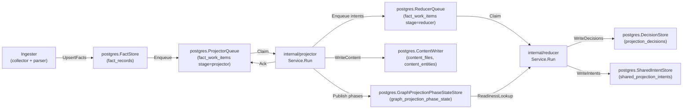
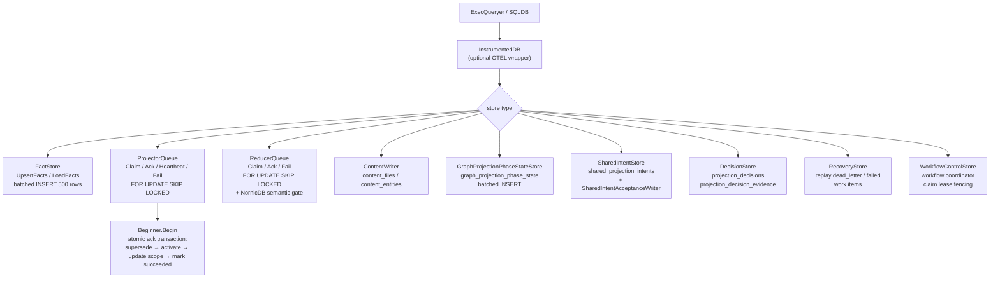

# storage/postgres

`storage/postgres` owns PCG's relational persistence layer: facts, queue state,
content store, status, recovery data, decisions, shared projection intents, and
workflow coordination tables. It is the single durable source of truth for
pipeline state that projector, reducer, ingester, and the API surface all share.

## Where this fits in the pipeline

## Internal flow

## Lifecycle / workflow

### Schema bootstrap

`ApplyBootstrap` (or `ApplyBootstrapWithoutContentSearchIndexes`) applies all
`BootstrapDefinitions` in order. Each `Definition` carries a name and SQL DDL.
`ValidateDefinitions` enforces uniqueness. Schema DDL is idempotent
(`CREATE TABLE IF NOT EXISTS`, `CREATE INDEX IF NOT EXISTS`).

### Fact persistence

`FactStore.UpsertFacts` batches facts into multi-row INSERT statements of up
to 500 rows (13 columns each, well under the Postgres 65535-parameter limit).
`deduplicateEnvelopes` removes duplicate `fact_id` values within each batch
before sending to avoid `SQLSTATE 21000` on `ON CONFLICT DO UPDATE` when a
generation contains self-overwrites.

`sanitizeJSONB` strips `\u0000` escape sequences and raw control bytes
(`0x00–0x1F` except tab/newline/CR) from payloads before INSERT to prevent
`SQLSTATE 22P05` and `SQLSTATE 22P02` errors on repositories with binary or
non-UTF-8 content.

`CommitScopeGeneration` compares the incoming generation `FreshnessHint` with
the active generation for the scope. When the hint is unchanged, the commit path
logs and skips the redundant write so local polling can observe files without
recommitting identical snapshots.

### Projector queue

`ProjectorQueue.Claim` uses `SELECT ... FOR UPDATE SKIP LOCKED` with a
per-scope in-flight conflict guard and an oldest-ready-row guard. Concurrent
claimers for the same `scope_id` must all target the same oldest ready work
item, so a worker cannot skip a locked older row and start a newer generation
for the same repository. Expired `claimed` or `running` rows are ordered ahead
of ordinary pending rows so stale leases are reclaimed before fresh work makes
the status surface look permanently overdue. Claim also demotes expired
same-scope duplicate in-flight rows back to `retrying` when a live sibling or a
newly claimed sibling owns the scope, which repairs queue state left by older
owner crashes or claim races without breaking the one-active-generation
invariant. `Ack` runs a four-step atomic
transaction: supersede stale active generation → activate target generation →
update scope pointer → mark work succeeded. If `projector.IsRetryable(cause)`
returns true and `attempt_count < MaxAttempts`, `Fail` transitions to
`retrying` instead of `dead_letter`.

### Reducer queue

`ReducerQueue.Claim` extends the projector model with domain filtering and
NornicDB-specific semantic gates. When the NornicDB gate is active (`$5 = true`),
`semantic_entity_materialization` items are blocked while any source-local
projection is in-flight, preventing cross-scope contention on NornicDB label
indexes. The gate is disabled for Neo4j.

### Graph projection phase state

`GraphProjectionPhaseStateStore` persists `canonical_nodes_committed` phase
markers after `cypher.CanonicalNodeWriter.Write` completes. The
`NewGraphProjectionReadinessLookup` and `NewGraphProjectionReadinessPrefetch`
factories return `reducer.GraphProjectionReadinessLookup` implementations used
by edge-domain reducer workers to gate on canonical node availability before
writing edges.

### Workflow control

`WorkflowControlStore` persists workflow coordinator control-plane state with
fenced claim leases. `ErrWorkflowClaimRejected` is returned when a claim
mutation is rejected because the current owner no longer holds the lease.

## Exported surface

**Database interfaces**

- `ExecQueryer` — combined read/write adapter; accepted by all store
  constructors
- `Transaction` — `ExecQueryer` + `Commit`/`Rollback`
- `Beginner` — `Begin(ctx) (Transaction, error)`; implemented by `SQLDB`
- `SQLDB` — adapts `*sql.DB`; `SQLTx` adapts `*sql.Tx`
- `InstrumentedDB` — wraps `ExecQueryer` with OTEL spans and
  `pcg_dp_postgres_query_duration_seconds`

**Fact store**

- `FactStore` / `NewFactStore` — `UpsertFacts`, `LoadFacts`, `ListFacts`,
  `CountFacts`

**Queue stores**

- `ProjectorQueue` / `NewProjectorQueue` — `Claim`, `Ack`, `Heartbeat`, `Fail`,
  `Enqueue`; `ErrProjectorClaimRejected`
- `ReducerQueue` / `NewReducerQueue` — `Claim`, `Ack`, `Fail`, `Enqueue`
  (batch); `ErrReducerClaimRejected`
- `QueueObserverStore` / `NewQueueObserverStore` — queue depth, age, and
  blockage queries for the status surface

**Content stores**

- `ContentStore` / `NewContentStore` — `GetFileContent`, `GetEntityContent`,
  `SearchFileContent`, `SearchEntityContent`; `FileContentRow`, `EntityContentRow`
- `ContentWriter` / `NewContentWriter` — writes `content_files` and
  `content_entities`

**Phase state**

- `GraphProjectionPhaseStateStore` / `NewGraphProjectionPhaseStateStore` —
  batched upsert of phase state rows
- `GraphProjectionPhaseRepairQueueStore` / `NewGraphProjectionPhaseRepairQueueStore`
  — repair queue for phase re-publish
- `NewGraphProjectionReadinessLookup` / `NewGraphProjectionReadinessPrefetch`
  — implement `reducer.GraphProjectionReadinessLookup`

**Shared projection**

- `SharedIntentStore` / `NewSharedIntentStore` — reads
  `shared_projection_intents`
- `SharedIntentAcceptanceWriter` / `NewSharedIntentAcceptanceWriter` — writes
  intent acceptance rows; `NewSharedIntentAcceptanceWriterWithInstruments` adds
  metrics
- `CodeCallIntentWriter` / `NewCodeCallIntentWriter` — type alias for
  `SharedIntentAcceptanceWriter`
- `SharedProjectionAcceptanceStore` / `NewSharedProjectionAcceptanceStore`

**Decision store**

- `DecisionStore` / `NewDecisionStore` — upserts `projection_decisions` and
  `projection_decision_evidence`; `DecisionFilter` for scoped reads

**Recovery**

- `RecoveryStore` / `NewRecoveryStore` — replays `dead_letter` and `failed`
  work items to `pending`

**Status**

- `StatusStore` / `NewStatusStore` — scope counts, generation counts, stage
  counts, queue depth
- `StatusRequestStore` / `NewStatusRequestStore` — async status request
  persistence

**Ingestion**

- `IngestionStore` / `NewIngestionStore` — scope and generation upserts

**Relationships**

- `RelationshipStore` / `NewRelationshipStore` — relationship evidence facts
  and backfill
- `RepoScopeResolver` — resolves scope IDs from repository identifiers

**Workflow coordination**

- `WorkflowControlStore` / `NewWorkflowControlStore` — claim, heartbeat,
  release with lease fencing; `ErrWorkflowClaimRejected`, `ClaimSelector`,
  `ClaimMutation`

**Schema bootstrap**

- `BootstrapDefinitions`, `ApplyBootstrap`,
  `ApplyBootstrapWithoutContentSearchIndexes`, `EnsureContentSearchIndexes`,
  `ValidateDefinitions`, `ApplyDefinitions`
- Per-table DDL helpers: `DecisionSchemaSQL`, `RelationshipSchemaSQL`,
  `SharedIntentSchemaSQL`, `SharedProjectionAcceptanceSchemaSQL`,
  `GraphProjectionPhaseStateSchemaSQL`, `GraphProjectionPhaseRepairQueueSchemaSQL`,
  `WorkflowControlSchemaSQL`, `WorkflowCoordinatorStateSchemaSQL`,
  `IaCReachabilitySchemaSQL`

**IaC reachability**

- `IaCReachabilityStore` / `NewIaCReachabilityStore` — IaC-to-workload
  reachability rows; `IaCReachabilityRow`, `IaCReachability`, `IaCFinding`

**Freshness checks** (implement `reducer` interfaces)

- `NewAcceptedGenerationLookup` / `NewAcceptedGenerationPrefetch`
- `NewGenerationFreshnessCheck` / `NewPriorGenerationCheck`

## Dependencies

- `internal/facts` — `facts.Envelope`
- `internal/projector` — `projector.ScopeGenerationWork`, `projector.Result`,
  `projector.IsRetryable`
- `internal/reducer` — `reducer.Domain`, `reducer.SharedProjectionIntentRow`,
  `reducer.GraphProjectionReadinessLookup`, `reducer.AcceptedGenerationLookup`
- `internal/recovery` — recovery store interface contracts
- `internal/scope` — `scope.ScopeKind`, `scope.GenerationStatus`,
  `scope.TriggerKind`
- `internal/status` — status store interface contracts
- `internal/telemetry` — `telemetry.Instruments` for `InstrumentedDB`
- `internal/workflow` — `workflow.ClaimSelector`, `workflow.ClaimMutation`
- `database/sql` — standard library

## Telemetry

- `pcg_dp_postgres_query_duration_seconds` — histogram per SQL operation,
  labeled `operation=read|write` and `store=<StoreName>`; recorded by
  `InstrumentedDB`
- Spans: `postgres.exec` and `postgres.query` from `InstrumentedDB`; carry
  `db.system=postgresql`, `db.operation`, and `pcg.store` attributes

To add instrumentation to a store, wrap the `ExecQueryer` passed to its
constructor with `InstrumentedDB{Inner: db, StoreName: "my_store", ...}`.

## Operational notes

- `pcg_dp_postgres_query_duration_seconds{store="queue", operation="read"}`
  elevated means claim latency is high; check `FOR UPDATE SKIP LOCKED`
  contention and index coverage on `fact_work_items`.
- `pcg_dp_postgres_query_duration_seconds{store="facts", operation="write"}`
  elevated means fact batch writes are slow; check connection pool and batch
  size (default 500).
- Dead-letter items accumulate in `fact_work_items` when `attempt_count >=
  MaxAttempts`; use `RecoveryStore` to replay after investigating
  `failure_class`.
- `ErrProjectorClaimRejected` or `ErrReducerClaimRejected` in logs means a
  heartbeat or ack arrived after lease expiry; the original worker must stop and
  not retry the ack.
- `graph_projection_phase_state` rows gate reducer edge domains. If missing
  for a scope generation, check `GraphProjectionPhaseRepairQueueStore` depth and
  projector logs for `publish_phases` stage errors.

## Extension points

- New store — implement against `ExecQueryer`; wrap with `InstrumentedDB` for
  observability; add a `*SchemaSQL()` function and register in
  `BootstrapDefinitions` if the store needs a new table.
- New queue domain — extend `ReducerQueue.Claim` domain filter; add the domain
  constant in `internal/reducer`.
- New schema table — add a `Definition` to `bootstrapDefinitions` in
  `schema.go`; keep DDL idempotent; place FK-dependent tables after their
  referenced tables in the slice.

## Gotchas / invariants

- `ProjectorQueue.Ack` runs four SQL statements inside a transaction
  (`projector_queue.go:346`). Pass a `SQLDB` or an `InstrumentedDB` wrapping
  a `SQLDB`; a plain `ExecQueryer` without `Beginner` will cause Ack to fail.
- `upsertFacts` deduplicates by `fact_id` before batching (`facts.go:192`).
  Skipping deduplication causes `SQLSTATE 21000` on `ON CONFLICT DO UPDATE`
  when the same `fact_id` appears twice in one batch.
- The NornicDB semantic gate in `ReducerQueue.Claim` is gated on a boolean
  parameter and must not be removed without an ADR; it prevents
  `semantic_entity_materialization` storms on NornicDB label indexes.
- `WorkflowControlStore` claim mutations use `ErrWorkflowClaimRejected` for
  fenced writes; callers must stop processing when this error is returned.
- Schema definitions in `bootstrapDefinitions` are applied in slice order.
  Tables with foreign key constraints on other tables must appear after their
  dependencies.

## Related docs

- `docs/docs/architecture.md` — pipeline and ownership table
- `docs/docs/deployment/service-runtimes.md` — runtime lanes and Postgres config
- `docs/docs/reference/telemetry/index.md` — metric and span reference
- `docs/docs/reference/local-testing.md` — Postgres verification gates
- ADR: `docs/docs/adrs/2026-04-22-nornicdb-graph-backend-candidate.md`
- ADR: `docs/docs/adrs/2026-04-20-embedded-local-backends-implementation-plan.md`
