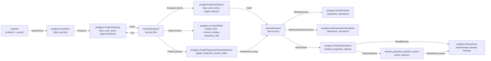
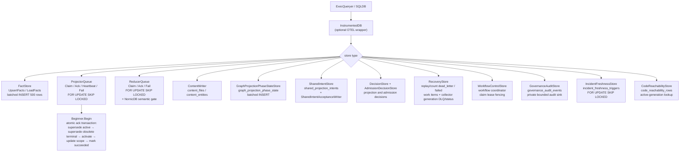

# storage/postgres

`storage/postgres` owns Eshu's relational persistence layer: facts, queue state,
content store, status, recovery data, projection and admission decisions,
webhook refresh triggers, shared projection intents, AWS scan status, and
workflow coordination tables. It is the single durable source of truth for
pipeline state that projector, reducer, ingester, collectors, and the API
surface all share.

## Where this fits in the pipeline



## Internal flow



## Lifecycle / workflow

The detailed lifecycle contract lives in
[`lifecycle-and-workflow-guide.md`](lifecycle-and-workflow-guide.md). Keep that
guide current when changing bootstrap DDL ordering, fact persistence, projector
or reducer queue behavior, workflow fencing, graph projection phase state,
webhook triggers, AWS scan status, or runtime drift evidence loading.

How retired, removed, tombstoned, and superseded evidence is kept out of
active-generation reads — the candidate-case matrix, the two retirement
mechanisms, and the index/pointer-bounded retraction shape — is documented in
[`retirement-proof-matrix.md`](retirement-proof-matrix.md) and proven by
`proof_domain_retirement_test.go` here plus `retirement_retract_proof_test.go`
in `internal/reducer`.

High-signal invariants for this package:

- Bootstrap DDL is idempotent and ordered through `BootstrapDefinitions`.
- Cold-bootstrap content search indexing has a separate durable lifecycle in
  `content_substring_index_state`. Deferred schema creates the content tables
  without the three exact trigram GINs for file content, entity source, and
  entity names; bootstrap-index builds the identical
  indexes after source-local projection drains, runs `ANALYZE`, verifies their
  catalog shape, and only then publishes `ready`. Normal schema bootstrap and
  upgrades retain the indexes and initialize the lifecycle from their actual
  validity; no steady-state path drops them.
- `code_reachability_rows` stores reducer-materialized code reachable-set rows
  by active source generation, and `code_reachability_repository_watermarks`
  records the completed intent timestamp covered by each repository snapshot so
  empty reachable sets do not loop forever; query dead-code reads consult the
  rows before the compatibility scan over completed shared projection intents.
- Fact writes batch at 500 rows, deduplicate `fact_id` within a batch, remove
  JSONB-incompatible U+0000 characters and control bytes without changing
  literal source text such as `\u0000`, and skip unchanged pending-or-active
  generations by `FreshnessHint`.
- Projector claims preserve one active source-local generation per `scope_id`,
  reclaim expired leases before fresh work, coalesce stale same-scope work, and
  atomically ack by superseding stale active generation, superseding older
  terminal same-scope generations, activating the target generation, updating
  the scope pointer, and marking work succeeded.
- Generation liveness reopens `source_local` only for blockage that replay can
  advance. Exact cross-repository `repo_dependency` source runs stay owned by
  the shared resolver before and after backward evidence commits; the stuck-age
  gauge uses the same exclusion. Other domains and lookalike source runs remain
  recoverable.
- Reducer claims share the lease/retry contract and add domain filters plus the
  NornicDB semantic gate for `semantic_entity_materialization` while
  source-local projection is in flight. A reducer claim also supersedes
  unleased older-generation reducer rows once the same scope has a newer active
  generation, and status/drain/observer reads exclude those inactive rows from
  live readiness while preserving the durable work item for audit history.
  Supersession composes with the readiness gate rather than racing ahead of it
  (#4445): a stale row for a readiness-gated domain
  (`reducer_claim_readiness_requirements`) is held out of the supersede sweep
  for as long as the outer candidate query would also refuse to claim it on
  readiness grounds, so a still-pending gate never gets permanently
  terminalized into the unreplayable `superseded` status the instant a newer
  generation activates.
- Workflow, AWS pagination, AWS scan-status, webhook, incident freshness, and
  hosted tenant/workspace grant stores use fencing, coalescing, or idempotent
  conflict keys so stale workers or replayed deliveries cannot overwrite newer
  durable truth.
- `GovernanceAuditStore` validates every event through
  `governanceaudit.NormalizeEvent`, derives a deterministic event id from the
  normalized safe fields, and uses `ON CONFLICT DO NOTHING` so retried writes
  are idempotent without storing raw principals, source names, prompts,
  provider responses, credential handles, private URLs, or token values.
- Tenant/workspace grant storage persists opaque tenant and workspace IDs,
  redacted display-handle hashes, scope grants, and repository grants. Active
  reads and claimed fact commits apply status, tombstone, effective-at, expiry,
  subject-class, and policy-revision predicates inside SQL before returning
  rows or writing source facts.
- Scoped API token storage is additive: it persists only opaque tenant and
  workspace IDs, token hashes, subject hashes, active bounds, expiry,
  revocation, and policy revision hashes without storing raw bearer tokens or
  changing current API, MCP, graph, collector, or workflow enforcement.
- Browser session storage is additive and hash-only: it persists session and
  CSRF digests, tenant/workspace IDs, optional scoped-token audit hashes, active
  grant bounds, expiry, revocation, the current workspace policy revision, and
  optional OIDC provider-proof metadata: provider config id, subject hash,
  validation time, and stale-after time. It does not store raw cookies, CSRF
  tokens, bearer tokens, provider tokens, raw group names, tenant names, or
  workspace names. Session resolution joins active tenants/workspaces, revokes
  stale OIDC-backed sessions before returning auth, treats upgraded OIDC rows
  with missing provider-proof timestamps as reauthentication-required, and
  re-checks the persisted policy revision against the workspace row before
  refreshing last-seen state, so provider-proof staleness, missing proof
  metadata, and policy changes invalidate dashboard sessions instead of
  extending them.
- Identity subject storage persists users, provider configs, local credential
  hashes, MFA handles, roles, grants, sessions, service principals, and token
  metadata with opaque IDs, hashes, and credential handles only. Local identity
  adds one-time bootstrap, invitation-only signup, bcrypt password proof,
  recovery-code MFA proof, lockout, resets, disablement, and time-boxed
  break-glass windows without storing raw proofs. Bootstrap uses a transaction
  advisory lock; invite acceptance and break-glass consumption serialize in SQL.
  It does not replace existing shared-token or scoped-token behavior.
- SAML SSO storage is additive to the identity schema. It persists only
  AuthnRequest digests, RelayState digests, replay digests, status, and
  timestamps. It never stores raw RelayState, SAMLResponse, assertions, NameID,
  group values, certificates, or IdP metadata XML. SAML external-subject
  resolution uses hash-only provider, subject, and group-claim inputs and
  requires active provider, user, tenant/workspace membership, and role rows.
  Admin sessions (owner/tenant_admin role) return AllScopes=true fail-open.
  Non-admin sessions return PermissionCatalogEnforced=true with a
  permission-catalog snapshot derived from active role grants. Resolution does
  not require an active grant row; a user with an active role but zero grants
  still resolves with an empty catalog snapshot (issue #3712).
- Repository ref readbacks stay bounded by the `repository_refs` primary key
  `(repo_id, ref_kind, name)` and default-ref index; writers replace only a
  fresh ref set carried by the current materialization so content-only
  generations do not erase branch metadata.
- Documentation finding reads retain three distinct partial indexes. Migration
  065 creates the order-first index for the ordinary unfiltered page, migration
  066 creates the filter-first index for fully selective six-filter pages, and the final schema
  plus migration 003 retain `fact_records_documentation_findings_visible_idx`
  for ACL-filtered total and grouped aggregate scans. Source, packet, and
  target-reference reads retain their existing indexes. Free-text
  `list_documentation_facts` search remains unchanged and has no dedicated
  expression index because the measured candidates imposed too much write cost.

Performance Evidence: the checked-in aggregate planner proof executes the
production total, grouped, and inventory builders against a 200,000-row,
5%-ACL-visible fixture and requires the aggregate-visible index. The opt-in
live run selected it for total/grouped/inventory in 7.123/5.524/5.311 ms with
10,000 rows, 10,351 shared hits, and zero shared reads per builder.
On the same 200,000-row theory fixture, the production no-filter page moved
from a 200.842 ms parallel scan and sort to a 0.202 ms order-index scan; the
fully selective six-filter page moved from 19.229 ms to a 0.360 ms filter-index scan.
Their 51-row and 66-row digests stayed identical. The exact 500-row production
finding batch measured a 1.243x median write ratio for the final three-index
shape, below the 1.50x rejection threshold.
Search-index candidates for
the five-field documentation-fact query were rejected because the fastest
candidate increased the exact 500-row production batch median from 4.207 ms to
9.257 ms (2.20x); the scoped candidate reached 9.786 ms (2.33x). The complete
production search over 1.6 million rows completed in 1,503.519 ms on the named
local proof profile, so the accepted change does not alter free-text search.
The full measurements and rejected-candidate ledger are in
[`docs/internal/evidence/5275-documentation-query-plans.md`](../../../../docs/internal/evidence/5275-documentation-query-plans.md).

No-Regression Evidence: the unfiltered and fully selective list shapes return
the same 51-row and 66-row digests before and after their indexes. The
5%-visibility theory shim had bidirectional set difference 0/0 and digest
`1f713158f4cc5b3d724244b56cbeb292`; the live production-builder proof
independently returned the expected 10,000 visible rows. The live migration
test keeps all three findings indexes valid through invalid-build recovery and
proves repeated and concurrent bootstrap calls leave their definitions
unchanged.

No-Observability-Change: no metric, span, route, worker, queue, lease, or runtime
setting changes. Operators continue to see both reads through `postgres.query`
spans and `eshu_dp_postgres_query_duration_seconds`, with `db.operation` set to
`list_documentation_findings` or `list_documentation_facts`.
- Eshu search-document projection writes derived document facts and a persisted
  BM25 read index in the same reducer retry path. `eshu_search_index_documents`
  stores active-generation document payloads and lengths,
  `eshu_search_index_terms` stores term frequencies by bounded term key, and
  `eshu_search_index_stats` stores corpus size and average length so API/MCP
  search reads do not rebuild a full corpus per request. Vector metadata and
  value rows store derived embedding lifecycle state plus bounded numeric
  payloads by active generation, provider profile, source class, model, content
  hash, and index version without promoting vector similarity to graph truth.
  The pending sweeper re-enqueues scopes whose active search documents exist but
  stats are missing. `EshuSearchVectorScopeStateStore` schedules vector work
  from versioned projection state rather than a corpus-wide fact scan. Its
  completion gate rejects unequal counts cheaply, then performs one exact
  materialized set difference over the scope's index documents, metadata, and
  values. Each bounded relation is scanned once, avoiding a nested value lookup
  for every document in a complete scope. The retired
  `EshuSearchVectorPendingStore` remains only as an equivalence reference.
  The startup seeder also counts this projection and inserts conservative
  `building` vector-scope rows in tens of milliseconds; exact readiness stays
  in the bounded scheduler instead of blocking reducer startup. Production
  vector metadata and value batches are write-time fenced by active generation,
  ready projection revision, current building vector-scope fence, and projected
  document content hash. Legacy callers without scope-state ownership retain
  the unfenced batch path.
- Relationship evidence backfill stays bounded to latest active repository
  facts, file/content facts, and `gcp_cloud_relationship` facts. GCP
  relationship facts are included explicitly because they are provider-resource
  facts without repository file content, while the resolver still requires
  distinct catalog matches before evidence is persisted. Streaming commit-time
  evidence discovery remains repository-scope only; cloud-scope relationship
  facts enter repository generations through deferred backfill.
- Deferred relationship maintenance coordinates sharded ingesters through
  `deferred_maintenance_barriers` and
  `deferred_maintenance_barrier_arrivals`. Each shard records its local batch
  drain in the current epoch; only the shard that completes the epoch runs
  maintenance. Maintenance no longer serializes on one fleet-wide exclusive
  advisory lock, and it no longer holds every active repository's lock in one
  long transaction (issue #3482). Evidence discovery reads the whole committed
  fact corpus once (cross-repo relationships need every repository's facts), but
  the writes commit in bounded independent per-repository-batch transactions.
  Each batch transaction takes only its own repositories' exclusive advisory
  locks, namespaced under `deferred_relationship_maintenance` and acquired in
  sorted repository order to stay deadlock-free, re-reads those repositories'
  active generations under the lock, writes their evidence and readiness, and
  commits to release the locks before the next batch. Normal source generation
  commits take the matching shared lock for only their own repository partition
  (see `deferred_maintenance_lock.go`). The deployment-mapping reopen runs in its
  own transaction and the barrier-completion marker in another, so no step holds
  a fleet-wide lock. A commit therefore waits only for the in-flight batch that
  holds its repository, and a stall on one batch blocks at most that batch's
  repositories. If a shard arrives with a different shard count while an epoch is
  open, storage fails closed instead of creating competing epochs.
- `value_flow_fixpoint_components` stores reducer-owned solved value-flow
  component results by content-derived component key, so unchanged components
  can be reused across reducer restarts and replicas without re-solving.

No-Regression Evidence: scoped hot-path notes live in
[`evidence-notes.md`](evidence-notes.md), including #2059 claimed fact commit
tenant-grant fencing. No-Observability-Change: #2059 adds no new signal shape.

### Current IaC inventory index (#5262)

Migration `067_iac_active_inventory_index.sql` adds a concurrent partial
expression index for active-generation Terraform resource, module, and data
source discovery. It leads with `(scope_id, generation_id)` and carries only
entity kind, name, and id; source bodies and other large payload fields remain
outside the index. `PostgresIaCInventoryStore` uses this shape to select exact
current identities before graph hydration and to compute caller-authorized
search and bounded facets.

Performance Evidence: on the retained 8,080,369-row `fact_records` corpus, a
same-data rollback-only comparison returned the same current IaC set (symmetric
difference 0/0). The existing broad index shape took 1,351.841 ms with 851,388
local reads; the partial expression index took 93.671 ms with 24,723 reads. The
predicate selected about 24,610 rows, roughly 0.3 percent of the fact corpus,
which bounds index write amplification.

No-Observability-Change: this is a read index and adds no queue, lease, worker,
metric, span, or log contract. Existing Postgres query spans and the IaC handler
latency/error signals cover the read path.

No-Regression Evidence: `go test ./internal/storage/postgres -run
'TestIngestionStore(CommitScopeGenerationTakesSharedMaintenanceBarrier|RunDeferredRelationshipMaintenanceTakesPerRepoExclusiveBarrier|ShardDrainBarrier)|TestBootstrapDefinitionsIncludeDeferredMaintenanceBarrier'
-count=1` covers the per-repo shared source-commit barrier and per-repo deferred
maintenance barrier, the multi-shard drain rendezvous, and bootstrap DDL.

No-Regression Evidence: `go test ./internal/storage/postgres -run
'TestResolveSAMLExternalSubject' -count=1` covers the #3712 SAML resolution
fix. Read path only: one `resolveSAMLExternalSubjectQuery` (Postgres GROUP BY +
BOOL_OR on mr.role_id, no rg JOIN, ORDER BY effective_at DESC + workspace_id
ASC, LIMIT 1) plus one `resolveLocalIdentityRolesQuery` on the non-admin path.
No new hot Cypher, no worker, no lease, no queue. Admin-role determination is
now membership-based (`mr.role_id IN ('owner','tenant_admin')`) matching local
and OIDC paths; non-admin subjects get `PermissionCatalogEnforced=true` with a
catalog snapshot from `resolvePermissionGrantsForRoles`. Resolution does not
require an active grant row (rg JOIN removed); grant absence yields an empty
catalog snapshot, not a login denial. Observability: fail-closed `slog.ErrorContext`
on role/grant resolution errors so an operator can distinguish a
permission-catalog outage from any other login failure.

No-Regression Evidence: source-fair projector claims and reducer batch claims
keep the existing worker count, batch size, lease expiry priority, same-scope
projector representative, reducer conflict-key fencing, retry,
stale-generation, and dead-letter paths intact while adding source-aware tie
breakers to admission. Reducer batch claim predicates are backed by
`fact_work_items_reducer_source_claim_idx`, a partial expression index over the
normalized reducer intent `source_system`, domain, status, visibility, lease,
and deterministic claim-order columns.
`go test ./internal/storage/postgres ./internal/telemetry -run
'Test(ProjectorQueue|ReducerQueue|ClaimBatch).*Source|TestQueueObserverStoreSource|TestSourceQueueObserverQueriesUseBoundedSourceSystem|TestRegisterObservableGauges'
-count=1` covers the source-admission ordering and bounded metric registration.
Performance Evidence: disposable Postgres 18-alpine, reducer claim benchmark
input shape `ESHU_REDUCER_CLAIM_BENCH_DEPTHS=10000`, one source, 10,000 pending
reducer rows, single `ReducerQueue.Claim` path unchanged by this PR. Baseline
`origin/main` samples were 20.3 ms, 22.4 ms, and 22.3 ms/op; after samples were
20.6 ms, 23.7 ms, and 22.0 ms/op with the same 34 KiB/op and 145-147 allocs/op
range. The first source-fair draft used per-row source-rank counts and was
rejected after a 10,000-row run was interrupted at 132 seconds; the landed
reducer batch query instead uses a pre-aggregated in-flight source count, a
source-head priority, and the partial source expression index above.
Observability Evidence: `eshu_dp_queue_source_depth` and
`eshu_dp_queue_source_oldest_age_seconds` expose queue pressure by bounded
`queue`, `source_system`, and `status` labels. Projector metrics derive
`source_system` from `ingestion_scopes.source_system`; reducer metrics prefer
the reducer intent payload `source_system` and fall back to the scope source so
operators can distinguish noisy-source starvation from ordinary backlog.
No-Regression Evidence: the PR #4083 review fix changes only the source queue
observer `GROUP BY` clauses from the ambiguous `source_system` alias to selected
expression ordinals. `go test ./internal/storage/postgres -run
TestSourceQueueObserverQueriesUseBoundedSourceSystem -count=1` failed before
the fix and passed after it; `ESHU_REDUCER_FAIRNESS_PROOF_DSN=<disposable
Postgres 18-alpine DSN> go test ./internal/storage/postgres -run
TestQueueObserverStoreSourceQueriesRunOnPostgres -count=1 -v` proved the
`SourceQueueDepths` and `SourceQueueOldestAge` queries execute against live
Postgres with one projector source row and one reducer source row. Performance
Evidence: this is a correctness-of-shape fix over the same queue observer scan,
with no added join, predicate, or row expansion. Observability Evidence: the
same `eshu_dp_queue_source_depth` and `eshu_dp_queue_source_oldest_age_seconds`
metrics continue to expose the source labels; the fix restores their scrape
path instead of adding a new telemetry surface.

### Deferred maintenance lock partitioning (issue #3482)

Deferred relationship maintenance commits bounded per-repository-batch
transactions keyed with two-argument transaction advisory locks
(`hashtext(namespace), hashtext(repo)`), while normal generation commits take the
matching shared lock for their repository partition. Locks are acquired in sorted
repository order, evidence/readiness writes are idempotent, open barrier epochs
are recoverable by later shard arrivals, and non-repository scopes no longer wait
on repository maintenance.

Performance/concurrency evidence: `TestWholeCorpusMaintenanceNeverHoldsFleetWideLockSet`,
`TestWholeCorpusMaintenanceDoesNotBlockUnrelatedCommit`, and
`TestDisjointRepoMaintenanceRunsConcurrently` prove peak locks stay at batch size,
unrelated commits avoid the current batch, and disjoint passes run in parallel.
Reproduce with `go test ./internal/storage/postgres -run
'TestWholeCorpusMaintenance|TestDisjointRepoMaintenanceRunsConcurrently|TestMaintenanceTakesPerRepoExclusiveLocksInOrder'
-race -count=1`. Observability stays on the existing deferred-backfill metrics and
per-repository batch logs so operators can attribute contention to one partition.

### Multi-cloud runtime drift evidence loader (issues #1997, #1998)

`PostgresMultiCloudRuntimeDriftEvidenceLoader` backs
`DomainMultiCloudRuntimeDrift` by joining observed cloud inventory, active
Terraform state, and Terraform config through one canonical `cloud_resource_uid`
keyspace. The reads are bounded by `(scope_id, generation_id)`, observed-identity
allowlists, active generation joins, and tombstone filters; Azure ARM ids are
case-folded only for `/subscriptions/` identities, while AWS/GCP identity casing
stays exact.

No-regression evidence: `TestPostgresMultiCloudRuntimeDriftEvidenceLoader` proves
provider joins, classification, empty-set short-circuiting, nil/blank rejection,
and concurrent stability; `TestPostgresMultiCloudRuntimeDriftEvidenceLoaderAzureStateCaseInsensitiveJoin`
pins the Azure-only case-fold. No new storage telemetry shape is added; reducer
spans, `postgres.query` child spans, publication counters, and redaction-aware
decode/unresolved warning logs carry the operator signal.

### Graph node owner ledger (#5007)

`GraphNodeOwnerStore` (migration `056_graph_node_owner.sql`) is the
Postgres-atomic resolver for cross-scope same-uid node ownership. When two
ingestion scopes carry the same resource identity, both project the same
canonical node uid and race to write its scope-derived properties; NornicDB does
not reliably detect concurrent property-write conflicts on a shared existing
node (#5062), so the graph write alone cannot pick a deterministic winner.
`ResolveOwnedUIDs` runs the per-uid critical section against a caller
transaction: it acquires all per-uid transaction-scoped advisory locks in one
sorted statement (deadlock-free), batch-upserts the `graph_node_owner` ledger
keeping the max `(observed_at, source_fact_id)` order key
(`ON CONFLICT (uid) DO UPDATE ... WHERE excluded.source_order_key >
graph_node_owner.source_order_key`), reads the winning order key back, and
returns the uid set the batch currently owns plus a contended-lost count. The
caller (`internal/graphowner`) writes only the owned rows to the graph and
commits to release the locks. The table is keyed on uid alone (canonical uids
are globally unique across labels) and stores the winning row as JSONB for the
Stage 2 provenance foundation.

Migrations `070` through `073` add four concurrent, partial ordered indexes over
the winning row's resource type and the optional provider, region, or account
prefix. Each concurrent index is its own bootstrap definition so Postgres can
build it in autocommit mode. `PostgresCloudResourceListStore` uses them
to select an authorized `limit+1` CloudResource identity page before graph
hydration. The indexes intentionally do not `INCLUDE (winning_row)`: copying
every JSONB document into four indexes would multiply write and storage cost for
fields the page order does not need.

Migration `074_graph_node_owner_backfill_state.sql` records completion of the
one-time CloudResource upgrade backfill. `GraphNodeOwnerBackfillStore` seeds
graph rows written before migration 056 in 500-row transactions, using the same
sorted per-uid advisory locks and monotonic max-upsert as the reducer gate. Each
seed uses a year-1 order key. It can populate an empty ledger, but it cannot
displace any real reducer owner, including one committed while the backfill is
running. The completion marker is written only after every graph page commits;
a failed or interrupted run retries idempotently on the next API or MCP startup.

Evidence: `TestGraphNodeOwner*` unit tests (dedup, advisory-key namespacing, SQL
shape, fail-closed guards) and `TestGraphNodeOwnerStoreIntegration`
(single-writer owns, cross-batch max resolution, concurrent-converges-to-max).
`TestLiveGraphNodeOwnerBackfillPreservesRealOwnersAndScales` seeds 20,000
existing rows, proves that a real owner wins a forced overlap, and checks the
durable marker.
Cloud-resource page evidence lives in
`internal/query/evidence-5563-cloud-resource-paging.md`.

## Exported surface

The full exported store inventory lives in
[`exported-surface-guide.md`](exported-surface-guide.md). Keep that guide in
lockstep with public constructors, schema helpers, reducer/query adapters, and
callable store contracts.

Primary groups:

- Database adapters: `ExecQueryer`, `Transaction`, `Beginner`, `SQLDB`,
  `SQLTx`, `InstrumentedDB`.
- Fact, queue, recovery, status, workflow, and webhook stores.
- Governance audit store for validation-safe private event persistence,
  authorized bounded detailed reads, retention pruning, and aggregate-only
  status readback.
- Generation retention store for bounded superseded-generation cleanup,
  hashed retention events, changed-since expiry proof, and identity-safe
  content pruning.
- Service-scoped incident evidence loader for the incidents service-evidence
  family. It resolves PagerDuty provider service ids to catalog service ids
  through active exact/derived reducer correlation facts and fails closed for
  ambiguous repository ownership.
- Installed advisory target readers for active OS package and active attached
  SBOM component evidence used by vulnerability-intelligence planning.
- Content stores and content writers, including bounded entity-batch
  concurrency and Postgres pool-budget notes.
- Graph projection phase, shared projection intent, acceptance, freshness, and
  readiness helpers used by reducer domains. Exact intent retries preserve
  completion; the repo-refresh history lookup includes `generation_id` so a
  reused source run cannot open a later generation's fence.
- Hosted isolation and dashboard auth stores, including tenant/workspace
  grants, scoped API tokens, browser sessions, OIDC login state and group-role
  mappings, and dormant identity subject tables.
- Projection and admission decision stores for reducer-owned write decisions
  and scope/generation/domain-bounded correlation admission explanations.
- Fact indexes for reducer-owned package and service-catalog correlations,
  including service-catalog candidate repository IDs used by ambiguous
  repository-scoped API/MCP readbacks.
- Terraform and AWS drift adapters that keep reducer joins bounded by scope,
  generation, ARN allowlists, backend ownership, and active read-model indexes.
- `EshuSearchDocumentStore` reads curated design-430 search documents
  (`reducer_eshu_search_document`) for a scope's active generation, bounded by
  repository, source kind, and a capped page.
- `EshuSearchVectorScopeStateStore` reads only ready active projection scopes
  whose vector state is missing, building, failed, or on an older projection
  revision. The scope list stays bounded by the requested limit and vector
  identity.
- `FunctionSummaryStore`, `FunctionSourceStore`, `FunctionGraphIDStore`, and
  `ValueFlowFixpointComponentStore` persist the durable value-flow inputs and
  solved component results used by the reducer's post-summary fixpoint.

## Dependencies

- `internal/facts` — `facts.Envelope`
- `internal/projector` — `projector.ScopeGenerationWork`, `projector.Result`,
  `projector.IsRetryable`
- `internal/reducer` — `reducer.Domain`, `reducer.SharedProjectionIntentRow`,
  `reducer.GraphProjectionReadinessLookup`, `reducer.AcceptedGenerationLookup`
- `internal/recovery` — recovery store interface contracts
- `internal/scope` — `scope.ScopeKind`, `scope.GenerationStatus`,
  `scope.TriggerKind`
- `internal/status` — status store interface contracts
- `internal/telemetry` — `telemetry.Instruments` for `InstrumentedDB`
- `internal/workflow` — `workflow.ClaimSelector`, `workflow.ClaimMutation`
- `database/sql` — standard library

## Telemetry

- `eshu_dp_postgres_query_duration_seconds` — histogram per SQL operation,
  labeled `operation=read|write` and `store=<StoreName>`; recorded by
  `InstrumentedDB`
- Spans: `postgres.exec` and `postgres.query` from `InstrumentedDB`; carry
  `db.system=postgresql`, `db.operation`, and `eshu.store` attributes
- `AWSPaginationCheckpointStore` records AWS checkpoint load, save, resume,
  expiry, and failure events through
  `eshu_dp_aws_pagination_checkpoint_events_total`.
- `PostgresAWSCloudRuntimeDriftEvidenceLoader` logs malformed AWS runtime
  resource rows with `resource.fingerprint`, `resource.identity_kind`, and
  `resource.type`; it does not put raw ARNs, Terraform addresses, or
  secret-shaped resource names in operator logs.

To add instrumentation to a store, wrap the `ExecQueryer` passed to its
constructor with `InstrumentedDB{Inner: db, StoreName: "my_store", ...}`.

## Operational notes

- `eshu_dp_postgres_query_duration_seconds{store="queue", operation="read"}`
  elevated means claim latency is high; check `FOR UPDATE SKIP LOCKED`
  contention and index coverage on `fact_work_items`.
- `eshu_dp_postgres_query_duration_seconds{store="facts", operation="write"}`
  elevated means fact batch writes are slow; check connection pool and batch
  size (default 500).
- Dead-letter items accumulate in `fact_work_items` when `attempt_count >=
  MaxAttempts`; use `RecoveryStore` to replay after investigating
  `failure_class`.
- `ErrProjectorClaimRejected` or `ErrReducerClaimRejected` in logs means a
  heartbeat or ack arrived after lease expiry; the original worker must stop and
  not retry the ack.
- `graph_projection_phase_state` rows gate reducer edge domains. If missing
  for a scope generation, check `GraphProjectionPhaseRepairQueueStore` depth and
  projector logs for `publish_phases` stage errors.
- `graph_endpoint_presence` (migration `024`, `GraphEndpointPresenceStore`) is
  the uid-exact, **cross-scope** endpoint-readiness primitive for the secrets/IAM
  graph projection (issue #1380). Keyed by `(keyspace, uid)`, it is written
  idempotently by the CloudResource and KubernetesWorkload node materializers
  only when the projection feature is enabled, and read via `MissingUIDs` (one
  bounded `uid = ANY(...)` query). Unlike `graph_projection_phase_state` it proves
  a *specific node* committed, which the scope/generation-keyed phase table
  cannot express across scopes.
- `secrets_iam_endpoint_not_ready` is a non-counting reducer retry class. It
  stays `retrying` with normal backoff and preserves the specific failure class,
  but single and batch claims do not increment `attempt_count` while that class
  is pending. This lets cross-scope endpoint readiness wait past
  `ESHU_REDUCER_MAX_ATTEMPTS` without terminally dropping edges.

No-regression and observability proof for this retry class lives in
[`evidence-notes.md`](evidence-notes.md#reducer-endpoint-readiness-retry-1391).

## Extension points

- New store — implement against `ExecQueryer`; wrap with `InstrumentedDB` for
  observability; add a `*SchemaSQL()` function and register in
  `BootstrapDefinitions` if the store needs a new table.
- New queue domain — extend `ReducerQueue.Claim` domain filter; add the domain
  constant in `internal/reducer`.
- New schema table — add a `Definition` to `bootstrapDefinitions` in
  `schema.go`; keep DDL idempotent; place FK-dependent tables after their
  referenced tables in the slice.

No-Regression Evidence: #4222 bounds startup/restart schema lock waits for
Postgres SQLDB executors. A bounded session-level advisory ownership boundary
serializes one complete `ApplyBootstrap` on one connection; each definition
still sets session `lock_timeout` and resets it before the next definition.
Focused tests prove
`ApplyDefinitionsWithLockTimeout` routes lock-timeout-capable executors through
the bounded path and preserves direct execution order for simple test executors.
Live Postgres proof covers `CREATE INDEX CONCURRENTLY` in autocommit mode and a
held-lock failure returning inside the configured lock budget. Concurrent index
schema applies also inspect `pg_index` before retrying and drop same-named
invalid indexes left by failed concurrent builds, so `IF NOT EXISTS` cannot
silently accept an unusable hot-path index. Migration 062 also owns its
check-and-create boundary with a transaction-scoped advisory lock because
Postgres does not make concurrent same-name `CREATE INDEX IF NOT EXISTS`
attempts atomic. The live proof exercises a populated table, lock timeout,
context interruption, concurrent migration retry, concurrent full bootstrap,
and the exact three-index validator.

Observability Evidence: no new metric series or labels were added. Operators
continue to diagnose schema bootstrap through the one-shot `db-migrate` /
`bootstrap-index` startup logs, the wrapped `apply <definition>` error that
names the blocked schema definition, and existing Postgres lock-wait views. A
lock timeout now fails the schema bootstrap instead of letting startup wait
indefinitely behind corpus reads.

## Gotchas / invariants

Detailed query, queue, fact-readback, runtime, and fencing invariants live in
[`gotchas-and-invariants.md`](gotchas-and-invariants.md). Keep that companion
note current when changing storage behavior that touches those contracts.

Additional historical no-regression notes for incident freshness, incident
routing, workflow terminal failure, readiness gating, owned dependency targets,
and advisory targets live in [`evidence-notes.md`](evidence-notes.md).

## Related docs

- `docs/public/architecture.md` — pipeline and ownership table
- `docs/public/deployment/service-runtimes.md` — runtime lanes and Postgres config
- `docs/public/reference/telemetry/index.md` — metric and span reference
- `docs/public/reference/local-testing.md` — Postgres verification gates
- ADR: `docs/public/reference/backend-conformance.md`
- ADR: `docs/public/reference/graph-backend-operations.md`

## ServiceCatalogIDResolver evidence (#2877 / #2863)

`ServiceCatalogIDResolver` (`service_catalog_id_resolver.go`) resolves a workload
id to its durable catalog service id over `reducer_service_catalog_correlation`
facts, the bridge the service intelligence report's incident lane needs (the
incident loader keys on the catalog service id, the service story exposes the
workload id).

The resolve query is bounded by active-generation
`reducer_service_catalog_correlation` facts and the partial
`fact_records_service_catalog_correlations_workload_idx` index leading with
`payload->>'workload_id'`. It fails closed on ambiguity and is covered by focused
resolver tests plus `schema_service_catalog_test.go`. Failures are wrapped with
`%w`, while the report handler contributes the existing incident-load logs and API
request metrics.

### Bounded incident read for the report surface

`ServiceIncidentEvidenceLoader.GetIncidentEvidenceForServicesBounded`
(`serviceIncidentEvidenceBoundedQuery` = the unbounded join plus `LIMIT $2`) caps
the rows one report request loads. The reducer materialization path keeps the
unbounded `GetIncidentEvidenceForServices` because it must observe every routed
incident; only the read surface caps the load.

The report source passes `reportIncidentEvidenceRowLimit` (512), above the
surfaced incident bound but below unbounded history. The reducer path keeps the
unbounded query; the report query appends `LIMIT $2`, pinned by
`TestServiceIncidentEvidenceBoundedQueryAppliesRowLimit`. Load failures use the
existing `serviceintel.incident_load_error` log.

## Repository catalog cache on the ingestion hot path (#3481)

`commitScopeGeneration` uses a per-store `repositoryCatalogCache` instead of
reloading the whole repository fact catalog on every commit. The cache contains
repository identity and aliases, is shared safely across commit goroutines, and
merges a committed generation's repository identities in place when the
generation introduces a new repository or changes a known repository's
slug/name (#5129 — the pre-merge whole-cache eviction forced a full serialized
reload per onboarding commit, 382.6s on the accepted 896-repo bootstrap). Cold
loads run on the open ingestion transaction's connection to avoid pool
self-deadlock at `ESHU_POSTGRES_MAX_OPEN_CONNS=1`.

Accuracy and concurrency are pinned by
`TestIngestionStoreLoadsCatalogOnOpenTransaction`,
`TestIngestionStoreReloadsRepositoryCatalogAfterNewRepository`,
`TestIngestionStoreReloadsCatalogWhenKnownRepoAliasDrifts`,
`TestIngestionStoreSharedCatalogCacheIsConcurrencySafe`, and the proof-domain
flows. `BenchmarkIngestionStoreCatalogLoadsPerCommit` showed a 1000-repo/200-commit
harness dropping from 1.000 to 0.005 catalog loads per commit, with about 3.25x
faster runtime and lower memory/allocations. Operator proof is in
`load_repository_catalog` (`catalog_cache_hit`, `catalog_loads_total`) and
`repository_catalog_merged` structured logs.

## Scope-bounded relationship backfill catalog (#3500)

When a generation onboards a new repository, `commitScopeGeneration` runs
`backfillRelationshipEvidenceForNewRepositories` so pre-existing source repos
that reference the new repo gain cross-repo evidence the streaming pass (which
only sees the current batch) could not see. Before #3500 this path built the
`DiscoverEvidence` catalog matcher from the **whole fleet** catalog and then
discarded every result not targeting a new repo via `filterEvidenceByTargetRepo`,
so matcher build and per-fact match memory grew O(all repositories) on every
onboarding commit.

`repositoryScopedCatalog` now narrows the matcher input to just the repositories
the generation onboarded, the same scope-bounded model the AWS relationship
hash-join (`reducer/aws_relationship_join.go`) uses. `DiscoverEvidence` is a pure
function of `(envelopes, catalog)` and every emitted `EvidenceFact.TargetRepoID`
is a catalog entry, so matching against the new-repo-scoped catalog yields exactly
the evidence the full-catalog pass produced and then filtered. The post-filter is
removed because the scoped catalog cannot emit evidence for any other target.

Accuracy is pinned by `TestRepositoryScopedCatalogBoundsToNewRepos` (the scope is
exactly the new-repo entries regardless of fleet size) and
`TestBackfillScopedCatalogDiscoversSameEvidenceAsFullCatalog` (scoped discovery
equals the prior full-catalog-then-filter result edge-for-edge).

Benchmark Evidence: `BenchmarkBackfillDiscoveryFullCatalog` vs
`BenchmarkBackfillDiscoveryScoped` on Apple M4 Pro (`go test -bench
BenchmarkBackfillDiscovery -benchmem`, one source fact per fleet repo, fixed
two-repo onboarding delta). At a 5000-repo fleet the scoped path drops catalog
matcher memory from `5009964 B/op`/`65117 allocs/op` to `1508890 B/op`/`25072
allocs/op` (about 3.3x less memory, 2.6x fewer allocations); at 1000 repos from
`968620 B/op`/`13058 allocs/op` to `338582 B/op`/`5045 allocs/op`. The matcher
build and the discarded full-catalog evidence set no longer scale with fleet
size, so onboarding-commit correlation memory scales with the onboarding delta.
No-Observability-Change: the backfill emits no new metric, span, or log shape;
existing `relationship_backfill` commit-stage timing and the evidence-persist
rows still surface the path, now with bounded matcher cost.

### Content-scoped per-commit fact load (#3570)

The #3500 scope bound narrowed the catalog matcher but left the per-commit fact
load at O(all source facts): `backfillRelationshipEvidenceForNewRepositories`
still ran `loadLatestRelationshipFacts`, which scans every repository's
latest-generation `content`/`file`/`gcp_cloud_relationship` facts on every
onboarding commit, ships them all to Go, and iterates them all through
`DiscoverEvidence`. So onboarding-commit *time* still grew with fleet size.

`loadOnboardedRepoScopedRelationshipFacts` replaces that load on the per-commit
path. It runs `listOnboardedRepoScopedRelationshipFactRecordsQuery`, the
latest-generation sibling of the full query, with an added predicate
`lower(payload::text) LIKE ANY($1)`. The anchors come from
`backfillRelationshipAnchorTerms`: `relationships.CatalogPayloadAnchors` over the
newly onboarded repositories' catalog entries, plus the unconditional
`argoCDOverSelectAnchors`. The corpus-wide deferred path
(`BackfillAllRelationshipEvidence`) now scopes its load the same way — see
[Corpus-wide deferred fact load (#3569)](#corpus-wide-deferred-fact-load-3569).

The predicate is a **provable superset** of the facts the in-memory
`catalogMatcher` could match against the new-repo-scoped catalog. The matcher
accepts an alias only when its tokens appear as a consecutive token subsequence
of a candidate string, so every alias token a match needs is a substring of the
lowercased candidate. Content/file payloads store candidate strings verbatim
(file bodies are raw UTF-8 under `content`/`content_body`; `parsed_file_data` is
nested JSON whose `/`, `.`, and `-` survive escaping), and gcp facts store the
resource names verbatim, so every needed token is a substring of
`lower(payload::text)`. Two correctness carve-outs:

- **Private Terraform registry modules.** For a catalog alias
  `terraform-modules-<provider>` the matcher resolves via
  `privateTerraformRegistryProvider`, where only the `<provider>` path segment
  appears in the payload, never the full alias. `CatalogPayloadAnchors` therefore
  also emits the captured `<provider>` suffix as an anchor.
- **ArgoCD ApplicationSet template synthesis (two-phase load).**
  `discoverArgoCDDocumentEvidence` renders candidate repoURLs by substituting
  template parameters harvested from a *different* config repository's content and
  from `normalizePlatformToken`'d path basenames, so the matched token need not
  appear in the ArgoCD fact's own payload. ArgoCD-shaped facts are over-selected
  unconditionally via `argoCDOverSelectAnchors` (`kind: Application`,
  `kind: ApplicationSet`, `argocd_applications`, `argocd_applicationsets`,
  `"artifact_type":"argocd"`) — that is **phase one**. But an ApplicationSet's git
  file generator targets an *external* config repo, and the deploy repoURL is
  synthesized from that config file's params (e.g. `team` + `service`), so the
  newly-onboarded deploy repo's alias appears in neither the ApplicationSet
  payload nor the config file. Neither the alias anchors nor the ArgoCD markers
  select that external config file, so phase one alone would drop the deploy edge.
  **Phase two** repairs this: `ResolveArgoCDGeneratorConfigRepos` parses the loaded
  ApplicationSets' generator repoURLs, resolves the config repos against the full
  catalog, and `loadArgoCDGeneratorConfigFacts` reloads those repos' generator-path
  (`.yaml`/`.yml`/`.json`) content/file facts, which `mergeRelationshipFacts` folds
  into the scoped load so the content index `DiscoverEvidence` builds is complete.
  `backfillScopedCatalog` additionally adds the config repos' catalog entries
  because the deploy edge resolves the intermediate config repoURL against the
  catalog before the target — the same intermediate-match pattern as GCP source
  resolution. Adding a config repo cannot create a spurious edge: the deploy target
  must still be a catalog entry (a new repo), and the config repo is excluded as a
  deploy target by discovery.

Over-selection is safe; under-selection would drop correlation truth. Accuracy is
pinned by `TestCatalogPayloadAnchorsSelectsEveryExtractorFamily` (one matching
fact per extractor family, including the private-registry module and the
ApplicationSet, is selected), the central
`TestScopedFactLoadEqualsFullLoadForScopedCatalog` gate (discovery over the
anchor-scoped load equals discovery over the full corpus, edge-for-edge, on a
mixed corpus that genuinely excludes non-matching facts), and
`TestTwoPhaseScopedLoadIncludesExternalArgoCDConfig` (the two-phase load discovers
the external-config-synthesized ApplicationSet deploy edge that a single marker-only
phase drops, matching the full-corpus result edge-for-edge).

Benchmark Evidence: `BenchmarkBackfillDiscoveryFullFleet{1k,5k}` vs
`BenchmarkBackfillDiscoveryScopedFleet{1k,5k}` in
`go/internal/relationships/catalog_anchor_bench_test.go` on Apple M5 Max
(`go test ./internal/relationships -run '^$' -bench BenchmarkBackfillDiscovery
-benchmem`, one source fact per fleet repo, fixed one-repo onboarding delta).
Per-commit discovery cost for the full-load path is `7930898 ns/op`
(`784070 B/op`, `12972 allocs/op`) at a 1000-repo fleet and `38288156 ns/op`
(`3721535 B/op`, `65002 allocs/op`) at 5000 repos — linear in fleet size. The
content-scoped path is `14093 ns/op` (`3537 B/op`, `48 allocs/op`) at 1000 repos
and `13914 ns/op` (`3545 B/op`, `48 allocs/op`) at 5000 repos — flat. Per-commit
backfill time and memory now scale with the onboarding delta, not the fleet.

No-Observability-Change: the per-commit backfill emits no new metric, span, or
log shape; the existing `relationship_backfill` commit-stage timing and the
evidence-persist rows still surface the path, now reading a bounded fact set.

### Corpus-wide deferred fact load (#3569)

The #3570 scope bound covered the per-commit path, but the corpus-wide deferred
backfill (`BackfillAllRelationshipEvidence`, invoked by
`RunDeferredRelationshipMaintenance` during ingester maintenance and bootstrap
seeding) still ran `loadLatestRelationshipFacts`, which scanned **every**
repository's latest-generation `content`/`file`/`gcp_cloud_relationship` facts,
shipped them all to Go, and iterated them all through `DiscoverEvidence` on every
pass. So deferred-pass *time* stayed O(all source facts) as the fleet grew, even
though the discovered evidence is bounded by the facts that actually reference a
catalog repository.

`BackfillAllRelationshipEvidence` calls `loadDeferredAnchorScopedRelationshipFacts`
with the **full** catalog. Unlike the per-commit path (anchors over the
onboarding delta), the deferred pass treats every repository as an eligible
target. `loadLatestRelationshipFacts` and its unbounded query are removed.

#### The self-repo_id defeat (#3659) and its fix

The first #3569 implementation called `loadAnchorScopedRelationshipFacts(catalog,
catalog)`, whose anchors derive from `CatalogPayloadAnchors(fullCatalog)`. That
set includes each repo's **repo_id** token (the repo_id is `Aliases[0]`), and
every Git `content`/`file` payload carries its own `repo_id` field. So in the
deferred pass — where the anchor catalog is the WHOLE catalog — the
`lower(payload::text) LIKE ANY($1)` predicate matched every fact on its own
source metadata, and the load stayed corpus-wide. The #3655 benchmark looked
6x/11x faster only because its synthetic payloads omitted `repo_id`, so the
self-match never fired.

`repo_id` cannot simply be dropped from the anchors: a repo is also referenced by
OTHER repos through its repo_id URL/path (go.mod, manifests, ArgoCD configs), so
dropping it would break the superset guarantee and lose real cross-repo edges.

The deferred pass therefore uses a dedicated query,
`listDeferredScopedRelationshipFactRecordsQuery`, with two arms:

- `$1` — non-repo_id anchors: `CatalogPayloadAnchors` over each entry's aliases
  with the repo_id (`Aliases[0]`) stripped (`backfillNonRepoIDAnchorTerms`),
  unioned with `argoCDOverSelectAnchors`. A fact matching `$1` carries a
  cross-repo reference not keyed on its own repo_id.
- `$2` — raw lowercase full repo_id values (`relationships.CatalogRepoIDValues`)
  paired with compact reference keys. The primary path joins those keys to
  `relationship_reference_candidate_keys`, excludes the fact's exact source
  repo_id, and tests delimiter-bounded token membership instead of scanning the
  payload once per catalog value. Facts created before reference-key materialization
  use a compatibility fallback only when no key row exists: exact self-value
  exclusion plus the escaped literal substring test against `lower(payload::text)`.
  The value stays raw in `$2` so self-exclusion remains a whole-string comparison.
  A fact matches only when it references ANOTHER repo's repo_id; a pure self-match
  has no other repo_id value and is excluded on both paths.

A value-exclusion list (`payload->>'repo_id' != ALL(catalog_repo_ids)`) would NOT
work: every active repo's own repo_id is in the catalog, so that predicate would
exclude EVERY active repo's fact from the repo_id arm, dropping legitimate
cross-repo references and breaking truth-equivalence. A blind
`replace(payload, own_repo_id, '')` also breaks overlap cases such as
`github.com/org/app` referencing `github.com/org/app-config`, because the
target value is corrupted before matching. The primary reference-key join and
the no-key compatibility fallback both compare whole repo_id values for
self-exclusion, so overlapping targets still match. Full values (not the longest
token) are used because cross-repo references name a repo by its full URL/path,
and a shared prefix token like `github.com` would over-select the fleet.

Truth-equivalence holds because the in-memory `catalogMatcher.match` already skips
self-matches (`entry.RepoID == sourceRepoID`), so the excluded pure-self facts
produced no evidence in the full-corpus load either.

Accuracy is pinned by `TestDeferredSelfExclusionTruthEquivalence`,
`TestDeferredSelfExclusionKeepsCrossRepoRepoIDReference`, and
`TestDeferredSelfExclusionExcludesPureSelfMatch`
(`go/internal/relationships/catalog_anchor_deferred_self_exclusion_test.go`), all
over representative fixtures whose payloads carry `repo_id`. The scope-bounding
query selection is pinned by `TestBackfillDeferredPassExcludesSelfRepoIDMatch`,
`TestBackfillAllRelationshipEvidenceUsesScopedFactQuery`, and
`TestBackfillAllRelationshipEvidenceShortCircuitsWithoutAnchors`
(`go/internal/storage/postgres/ingestion_backfill_deferred_scope_test.go`): the
deferred backfill issues the self-exclusion query (never the per-commit or
full-corpus query) and issues no fact query at all when the catalog has no usable
anchors, while still publishing backward-evidence readiness.

Performance Evidence: `BenchmarkDeferredBackfillDiscovery{Full,Scoped}Fleet{1k,5k}`
in `go/internal/relationships/catalog_anchor_bench_test.go` on Apple M-series
(`go test ./internal/relationships -run '^$' -bench BenchmarkDeferredBackfillDiscovery
-benchmem`, one edge-forming fact plus four orphan facts per fleet repo, every
payload carrying `repo_id`, whole-fleet catalog, scoped variant run through the
#3659 self-exclusion predicate). At a 1000-repo fleet deferred discovery drops
from `27748503 ns/op` (`44039593 B/op`, `399019 allocs/op`) to `6509206 ns/op`
(`5105782 B/op`, `55916 allocs/op`) — about 4.3x faster, 8.6x fewer allocs. At
5000 repos it drops from `122223287 ns/op` (`218460600 B/op`) to `31142259 ns/op`
(`25836605 B/op`) — about 3.9x faster, 8.4x fewer bytes. These are lower than the
unrepresentative #3655 numbers because the fixture now carries `repo_id`; both
variants yield the same evidence set.

No-Observability-Change: the deferred backfill emits no new metric, span, or log
shape; the existing `relationship.backfill_deferred` span, the
`DeferredBackfillDuration`/`DeferredBackfillEvidence` instruments, and the
`deferred_backfill_completed` log line still surface the path, now recording a
bounded fact load. A shrinking `DeferredBackfillDuration` against a growing fleet
is the operator-visible signal that the scope bound is in effect.

#### Relationship-family partial index and reference narrowing (#5122)

The deferred query now applies its existing exact relationship-family predicate
to `fact_records` before materializing `source_facts`. Migration 059 supplies a
matching concurrent partial index on `(scope_id, generation_id, observed_at,
fact_id)`. The repo-id reference arm also materializes reference keys only for
those candidate fact IDs before comparing catalog keys; the previous plan
compared every catalog key with every reference row in the scope.

Performance Evidence: The retained-shape Odù contains 60,988 source facts
across eight skewed partitions but only 84 exact family candidates. On local
PostgreSQL 18, the shipped worst-scope query took 1,411.501 ms, the index-only
rewrite with the old reference join took 721.259 ms, and the complete narrowed
query took 3.053 ms.
The eight-task critical path fell from 1.501561 s to 6.241708 ms. Both directions
of the fact-id differential were empty, loaded counts matched, UNION de-duplication
was preserved, and the self-reference and prefix-collision cases stayed excluded.

Against the retained 896-repository data, the shipped 14,190-row worst-scope
query exceeded a bounded 120-second statement timeout. A temporary-table proof
over the same retained rows used the production migration predicate and selected
the partition's 12 exact relationship-family candidates in 155.587 ms; its
partial-index scan took 0.272 ms. The production write path was measured
separately with ordinary
WAL-backed tables, the retained 4.432% source / 0.986% family mix, and eight
simultaneous accepted-fact UPSERT writers. Repeated five-round, 100,000-row
alternating runs observed all eight writers and no failures or duplicates. The
post-rebase run projected zero median full-corpus index tax and a conservative
45.008-second worst-round tax. Against the retained 282.440-second read-saving
model, the conservative net is 237.432 seconds, clearing the 220.691-second
current target gap by 16.741 seconds without reducing concurrency.

The environment-gated compiled proof
`TestRelationshipFamilyRetainedFullBackfillBinaryProof` drives the production
`BackfillAllRelationshipEvidence` method against either that local Odù or two
isolated, identical filtered retained-data databases. The baseline substitutes
the guarded shipped query only at the SQL adapter boundary; the candidate runs
the unmodified production query. It then requires bidirectional `0/0` exact
diffs for loaded fact IDs, deterministic evidence fields, readiness keys, and
memo fingerprints, plus zero duplicate fact IDs. Before either timed call it
also fingerprints every ordered row in `fact_records`,
`relationship_reference_candidate_keys`, `ingestion_scopes`,
`scope_generations`, and `fact_work_items`; the candidate refuses to execute
unless all five row counts and SHA-256 digests match the baseline. The
retained-data mode also
reproduces the accepted 96-open/10-idle connection pool and eight workers,
records actual overlapping query calls, open cursors, write transactions, and
transactional SQL calls, and fails unless measured baseline minus candidate
minus the conservative 45.008-second write tax clears the current
220.691-second target gap.

No-Observability-Change: the query and index add no worker, queue, lease, metric,
span, or log shape. Operators continue to use the existing
`relationship.backfill_deferred` span, deferred-backfill duration/batch metrics,
and committed-batch logs; `workers` remains the concurrency diagnostic.

### Backfill source-file split (#3673)

`ingestion_backfill.go` had grown to 735 lines, over the repo's 500-line
per-file limit. It is split along three cohesive seams with no behavior change:

- `ingestion_backfill.go` — deferred batch/transaction maintenance machinery
  (`BackfillAllRelationshipEvidence`, `writeDeferredBackfillInBatches`,
  `writeDeferredBackfillBatch`, `RunDeferredRelationshipMaintenance`, the
  deployment-mapping reopen pair), the active-generation/work-item loaders, and
  the generation-precondition helpers.
- `ingestion_backfill_per_commit.go` — the per-commit new-repository
  relationship backfill (`backfillRelationshipEvidenceForNewRepositories`) and
  its catalog/evidence scoping helpers (`backfillScopedCatalog`,
  `repositoryScopedCatalog`, `filterEvidenceByTargetRepo`).
- `ingestion_catalog_parse.go` — repository-catalog loading and payload parsing
  (`loadRepositoryCatalog`, `catalogRepoIDs`, `repositoryCatalogEntryFromPayload`,
  `repositoryCatalogEntryFromMap`, `catalogString`, `uniqueCatalogAliases`).

Package `postgres` and every exported and unexported symbol are preserved
verbatim; only the per-file import sets are narrowed. The exported surface is
unchanged, so `doc.go`, `README.md` (other than this note), and `AGENTS.md` need
no contract edits.

No-Regression Evidence: pure mechanical move on PostgreSQL 16 (the package's
test backend). Function bodies, the `deferredMaintenanceRepoBatchSize = 32`
constant, lock-key derivation, batch sizing, and SQL queries are byte-identical
to the prior single file, so the deferred-maintenance lock partitioning,
per-batch transaction scope, idempotency, and scope-bounded discovery behavior
documented above are unchanged. Verified with `go build ./...`,
`go test ./internal/storage/postgres -count=1` (1065 tests pass, same terminal
count as before the split), and `golangci-lint run ./internal/storage/postgres/...`
(no issues). No benchmark is rerun because no instruction on any hot path
changed; the #3569/#3500/#3570 benchmarks above still describe the same code.

No-Observability-Change: the split moves code between files only. The
`relationship.backfill_deferred` and `bootstrap.reopen_deployment_mapping`
spans, the `DeferredBackfillDuration`/`DeferredBackfillEvidence`/
`DeploymentMappingReopened` instruments, and the `deferred_backfill_completed`/
`deployment_mapping_reopened`/`relationship_backfill_deferred_source_skipped`
log lines are emitted from the same statements, now relocated.

### Deferred relationship-evidence backfill long pole (#3704)

This change has three parts. The **concurrency fix** is the actual long-pole
reduction; the **CTE rewrite** and **per-batch telemetry** are supporting
cleanups. Be precise about which is which.

Long-pole diagnosis: on the de-nested 896-repo / ~3.5M-fact corpus the
`relationship_backfill` phase ran 30+ min, one core at 100%, bootstrap-index
blocked on a pgx read. The cause is **serial client-side per-fact processing**,
not the SQL plan. Live `EXPLAIN ANALYZE` on the corpus showed both the old
correlated-subquery CTE form and the new DISTINCT ON form execute in ~476 ms — the
query was never the wall-time bottleneck. The wall time was the single goroutine
that (1) streamed and scanned the fact result set, ran `DiscoverEvidence`, then
(2) wrote the discovered evidence one round-trip per row and processed the
per-repository write batches strictly one at a time.

#### Concurrency fix (the long-pole reduction)

Two serial client costs were removed:

1. **Per-row evidence INSERT → multi-row batched INSERT.**
   `RelationshipStore.UpsertEvidenceFacts` (`relationship_store.go`) issued one
   `INSERT ... ON CONFLICT (evidence_id) DO NOTHING` round-trip per evidence row.
   It now groups rows into multi-row INSERT statements of `evidenceInsertBatchRows`
   (500, matching the FactStore batch size, 500×12 = 6000 bound params, well under
   PostgreSQL's 65535 limit). The per-row `evidence_id` digest and column binding
   are unchanged, so the persisted rows are byte-identical; only the round-trip
   count drops from N to ⌈N/500⌉.

2. **Serial per-repository batches → bounded concurrent worker pool.**
   `writeDeferredBackfillInBatches` partitioned the corpus into independent
   per-repository batch transactions but processed them strictly serially. It now
   dispatches the batches across a bounded pool
   (`runDeferredBackfillBatches`), worker count from `deferredBackfillWorkerCount`
   (`ESHU_DEFERRED_BACKFILL_CONCURRENCY`, default `min(NumCPU, 8)`, hard cap 8).

Concurrency-safety argument (conflict domain = one repository's advisory-lock
partition):

- **Disjoint partitions.** The repository list is sorted, and batches are
  contiguous non-overlapping slices, so no two concurrent batches request the same
  per-repository advisory lock. Each batch also sorts its own lock keys, so neither
  intra-batch nor inter-batch acquisition can form a lock-order cycle: no deadlock.
- **Per-batch transaction scope.** Each batch runs in its own transaction and does
  everything (lock acquire, active-generation reload, evidence + readiness writes)
  on that one transaction's connection. No batch acquires a second connection while
  holding its transaction, so W concurrent batches hold exactly W connections; a
  worker count above the pool size throttles on `Begin` rather than deadlocking,
  and at `ESHU_POSTGRES_MAX_OPEN_CONNS=1` the pass self-serializes.
- **Idempotent writes.** Evidence inserts are `ON CONFLICT (evidence_id) DO
  NOTHING` and readiness upserts are generation-keyed, so a retried or partially
  failed pass converges to the same rows.
- **Bounded shared state.** The only shared mutable state during the concurrent
  phase is the readiness counter and a first-error latch, both mutex-guarded; the
  `evidenceBySourceRepo` map is built before fan-out and only read concurrently.
- **Peak lock bound.** The #3482 invariant (no fleet-wide lock set) is preserved:
  peak simultaneously-held repository locks is now `workers × batchSize` (e.g.
  4×32 = 128), still bounded and far below the fleet, never the whole corpus.

Why `DiscoverEvidence` is NOT parallelized: it builds a single global content
index across every loaded fact because cross-repo evidence (a fact in repo A
referencing repo B) needs repo B's content in the index. Partitioning that pass by
scope would drop cross-repo edges — a correctness regression on graph truth. It
stays a single in-memory pass by design; the concurrency is applied to the
independent write batches, where it is safe.

#### CTE rewrite (supporting cleanup, not the long-pole fix)

Every relationship-fact loader and the active-repository-generation lookup share
a `WITH latest_generations AS (...)` CTE that resolves each scope's active
generation. The pre-#3704 form computed the fallback (scopes without an
`active_generation_id` pointer) with a **per-scope correlated subquery**
(`SELECT generation_id ... WHERE candidate.scope_id = generation.scope_id ORDER BY
ingested_at DESC, generation_id DESC LIMIT 1`) evaluated once per GROUP BY group.
The planner could not estimate that correlated subplan's cardinality, leaving a
misestimated per-scope SubPlan in the plan. This rewrite eliminates that subplan
and restores a flat, parallelizable plan shape. It is a query-shape cleanup: live
measurement showed both forms already run sub-second, so it is not the wall-time
fix.

The CTE is now the single shared `latestGenerationCTE` constant
(`latest_generation_cte.go`), rewritten to one `DISTINCT ON (scope_id)` pass:
`ORDER BY (scope_id, ingested_at DESC, generation_id DESC)` makes the first row
per scope the newest generation, and `COALESCE(active_generation_id, that newest
id)` reproduces the original precedence exactly. `active_generation_id` is a
column of `ingestion_scopes` (one row per scope) so it is constant across a
scope's generation rows; the COALESCE yields the identical value the correlated
form selected. All seven embedding queries
(`listLatestRelationshipFactRecordsQuery`, `activeRepositoryGenerationsQuery`,
`activeScopeGenerationPartitionsQuery`,
`listOnboardedRepoScopedRelationshipFactRecordsQuery`,
`listDeferredScopedRelationshipFactRecordsQuery`, `resolveRepoActiveGenerationsQuery`,
`listArgoCDGeneratorConfigFactRecordsQuery`) reference the one constant, so they
cannot drift. `scope_generations_scope_latest_lookup_idx`
(`scope_id, ingested_at DESC, generation_id DESC`) backs the DISTINCT ON ordering
so the per-scope newest row is an index read, not a full sort; the prior
`scope_generations_scope_idx` could not serve it because `status` sits between
`scope_id` and `ingested_at`.

Accuracy (truth-equivalence): the rewritten CTE selects the byte-identical
`(scope_id, generation_id)` set the correlated form selected, so no graph truth
changes, and the batched evidence INSERT preserves the per-row `evidence_id`
identity. The active-pointer-wins, fallback-to-newest, single-generation, and
identical-`ingested_at` tie cases are pinned by
`TestLatestGenerationCTETruthEquivalenceAndPlan`
(`latest_generation_cte_integration_test.go`, gated on
`ESHU_LATEST_GENERATION_PROOF_DSN`; the tie case asserts both forms pick the
higher `generation_id`). String-shape gates that run everywhere live in
`ingestion_latest_generation_cte_test.go`
(`TestLatestGenerationCTEHasNoCorrelatedSubquery`,
`TestLatestGenerationCTEPreservesActiveGenerationPreference`,
`TestScopeGenerationsLatestLookupIndexExists`). The batched evidence write is
pinned by `TestUpsertEvidenceFactsBatchesInserts`. Concurrency safety is pinned
by `TestWriteDeferredBackfillInBatchesRunsConcurrently` (fan-out bounded by the
worker count, every batch commits), `TestConcurrentBackfillBatchesBoundPeakHeldLocks`
(peak held locks stay within `workers × batchSize`, all locks released, the
advisory-lock manager would hang on a lock-order deadlock), and
`TestWriteDeferredBackfillInBatchesSerialWhenWorkerCountOne` (worker count 1 keeps
the pass single-flight for `ESHU_POSTGRES_MAX_OPEN_CONNS=1`). All run under `-race`.

Benchmark Evidence (concurrency, the long-pole fix): `BenchmarkDeferredBackfill{Serial,Concurrent4,Concurrent8}`
in `ingestion_backfill_bench_test.go`, 256 repositories at batch size 8 (32
batches) with a 50 µs per-statement round-trip stand-in, darwin/arm64. Serial
(1 worker) `40,976,430 ns/op`; 4 workers `10,295,819 ns/op` (3.98x faster); 8
workers `5,238,341 ns/op` (7.82x faster) — near-linear in worker count, as
expected for round-trip-bound batch writes. End-to-end wall-time on the de-nested
896-repo / ~3.5M-fact corpus is measured by the operator's remote validation
stack (no local corpus of that size); the structural argument is serial → W-way
concurrent across the independent per-repository batches plus N → ⌈N/500⌉
evidence-write round-trips.

Performance Evidence (CTE plan shape, supporting cleanup): PostgreSQL 18, fixture
of 2000 scopes × 3 generations (6000 generation rows, half with an active
pointer), `ANALYZE`d, with `scope_generations_scope_latest_lookup_idx` present.
`EXPLAIN` of the legacy correlated form yields total cost `21654.36` with two
correlated `SubPlan` nodes (`Group` node cost `21594.66`). `EXPLAIN` of the
DISTINCT ON rewrite yields total cost `372.85` — a single `Unique` over one Merge
Left Join + Index Only Scan, **no SubPlan** — about a 58x planner-cost reduction
at that scale. Note: live `EXPLAIN ANALYZE` on the real corpus showed both forms
already execute in ~476 ms, so this plan-cost reduction is a query-shape cleanup,
not the wall-time long-pole fix — the concurrency change above is that fix.

Observability Evidence: the deferred backfill previously logged nothing until the
whole pass returned, hiding intra-pass progress. `runDeferredBackfillBatches`
records `eshu_dp_deferred_backfill_batch_duration_seconds` (histogram) and
`eshu_dp_deferred_backfill_batches_completed_total` (counter) per committed
per-repository batch, and emits a `deferred_backfill_batch_committed batch=N
total_batches=M repos=R readiness_rows=P duration_s=D workers=W` log line per
batch. A rising `…batches_completed_total` during a pass is the operator-visible
progress signal for the backfill long pole, and the `workers=W` attribute shows
the active concurrency; the existing `relationship.backfill_deferred` span and
`DeferredBackfillDuration`/`DeferredBackfillEvidence` instruments still record the
whole-pass totals. New instruments are registered in
`internal/telemetry/instruments.go`.

### Deferred fact-load payload hoist + regex fast arm (#3624)

Long-pole diagnosis: `pg_stat_statements` on the live `eshufull` corpus attributed
4,647s across 907 calls (~5.1s/call) to
`listDeferredScopedRelationshipFactRecordsQuery`. The query re-evaluated
`lower(fact.payload::text)` once for the `$1` `LIKE ANY` test and AGAIN, once per
`unnest($2)` catalog repo_id row, inside the EXISTS self-exclusion arm — an
O(facts × catalog × payload_size) re-lowering of the same payload text for every
candidate repo_id, dominating the 2nd-half reducer long pole.

Fix (query shape, `ingestion_backfill_deferred_facts.go`): hoist
`lower(fact.payload::text)` and `lower(COALESCE(fact.payload->>'repo_id', ''))`
into computed columns (`payload_lower`, `own_repo_id`) in the inner subquery, so
every predicate arm below reuses the already-computed columns and
`lower(payload::text)` is evaluated exactly once per row. Add a `$5`/`$6`
performance-hint fast arm ahead of the existing EXISTS fallback:

```
payload_lower LIKE ANY($1)
OR (own_repo_id = $6 AND $5::text IS NOT NULL AND payload_lower ~ $5)          -- fast arm
OR (own_repo_id <> $6 AND EXISTS(unnest($2) ... same fallback as #3710))       -- fallback arm
```

`$6` is a lowercase "this partition's likely own repo_id" derived for free from
`scope_id` (`deferredScopedFactOwnRepoIDFromScope`, `ingestion_backfill_deferred_regex.go`):
`git-repository-scope:<repo_id>` scopes strip to `<repo_id>`; every other scope
shape (GCP cloud-relationship scopes included) resolves to `""`. `$5` is a POSIX
ARE alternation (`buildDeferredRepoIDRegex`) of the shared `$2` catalog repo_id
values EXCLUDING `$6`, each value escaped with `regexp.QuoteMeta` so every ARE
metacharacter (`` \ . + * ? ( ) | [ ] { } ^ $ ``) is a literal — verified directly
against PostgreSQL 18 to be the exact character set the `~` operator needs
escaped (distinct from LIKE's `` \ % _ ``). `$5` is passed as SQL `NULL`, not the
empty alternation `(?:)`, when excluding `$6` leaves zero catalog values: `(?:)`
is a zero-width match present in EVERY string under PostgreSQL ARE (verified:
`SELECT 'x' ~ '(?:)'` returns `true`), so building it would silently turn
`own_repo_id = $6 AND payload_lower ~ $5` into an unconditional match; the query
guards `$5::text IS NOT NULL` first, so a NULL `$5` safely disables the fast arm
for that partition.

`own_repo_id` correctness independent of `$6` (why this is safe to derive without
a discovery query): `own_repo_id` stays a PER-ROW computed column — a single
`scope_id` partition can carry rows whose `payload->>'repo_id'` differs from any
single value derivable from the scope_id, notably GCP cloud-relationship scopes,
which carry no `repository` fact and have no single derivable repo_id at all.
`$6` is only a hint about what a row's `own_repo_id` probably is:

- When `$6` correctly predicts a row's `own_repo_id`, the fast arm fires and `$5`
  (built by excluding exactly `$6`) resolves the self-exclusion with a single
  regex match instead of the per-catalog-entry correlated EXISTS loop.
- When `$6` is wrong for a row (`own_repo_id <> $6` — true for every GCP
  cloud-relationship row, since `$6` is always `""` there and a GCP row's own
  repo_id is essentially never empty), that row falls through to the EXISTS
  fallback arm, byte-for-byte the pre-hoist #3710 self-exclusion predicate. The
  row is never dropped and never wrongly matched merely because `$6` was wrong.

A wrong or absent `$6` therefore only costs a fallback-arm evaluation for the
affected rows — a bounded performance cost, never a correctness cost. This is why
`loadActiveRepositoryGenerations` was considered and rejected as the `$6` source:
it filters to `fact_kind = 'repository'` and drops every GCP cloud-relationship
scope entirely (the same reason #3710's `loadActiveScopeGenerationPartitions`
partition source exists), which would have made `$6` require re-deriving
`own_repo_id` and broken the partition-source invariant that section documents. A
live-corpus `mode()`-in-discovery alternative for deriving `$6` was also measured
and rejected: it forces a heap scan plus an external-sort spill against the
existing 225ms index-only discovery path, a regression `loadActiveScopeGenerationPartitions`
does not have today.

Accuracy is pinned by
`TestDeferredScopedFactLoadHoistExactlyEquivalentToPreHoistShape`
(`ingestion_backfill_deferred_facts_hoist_test.go`, gated on
`ESHU_DEFERRED_HOIST_PROOF_DSN` or the shared `ESHU_DEFERRED_PARTITION_PROOF_DSN`
/ `ESHU_LATEST_GENERATION_PROOF_DSN` proof DSNs): it runs the frozen pre-hoist
query shape and the current production hoisted shape against IDENTICAL params
over a fixture covering the app/app-config prefix overlap, a pure self-mention
fact, an ArgoCD unconditional-anchor fact, a GCP fact with an empty own repo_id
(the `own_repo_id = $6 = ""` fast-arm case), and a `$6`-mismatch row living
inside a `$6`-hinted git-repository-scope partition (proving the fallback still
fires per-row when the hint is wrong for that specific row) — and asserts
IDENTICAL fact_id sets and IDENTICAL `relationships.DiscoverEvidence` output in
both directions (0/0 set-diff). `buildDeferredRepoIDRegex` and
`deferredScopedFactOwnRepoIDFromScope` have dedicated non-DB unit tests
(`ingestion_backfill_deferred_regex_test.go`) covering own-value exclusion, ARE
metacharacter escaping, case-insensitive dedupe, the empty/all-excluded
"no usable alternation" case, and the `git-repository-scope:` prefix derivation
including non-matching scope shapes. The existing #3659/#3710 non-DB regression
guards (`ingestion_backfill_deferred_scope_test.go`) were updated in lockstep for
the new six-parameter (`$1`..`$6`) call shape and still pass.

Performance Evidence: live-corpus pure-SQL shim on the `eshufull` Postgres
instance (PostgreSQL 18), comparing the pre-hoist #3710 query shape against the
hoisted `$5`/`$6` shape with identical params. A representative medium scope
(1,990 facts) went from 149,525ms (pre-hoist) to 15,181ms with the hoist alone
(9.85x), then to 914ms with the hoist plus the `$5`/`$6` fast arm (163x total). A
giant-tail scope (24,802 facts) completed in 13,864ms with the hoist plus fast
arm. Both scopes' fact_id sets are byte-identical (0/0 set-diff, both directions)
to the pre-hoist shape. Separately, over the full corpus (314,879 fact_records
rows, all `git-repository-scope`), the `scope_id`-derived `$6` equals the row's
actual `own_repo_id` for 314,799 rows (99.975%); the remaining 80 rows are handled
correctly by the fallback arm exactly as designed above.

Coordinator end-to-end (independent, live `eshufull` corpus; VPN down so run
locally): the NEW shape run once across all 907 `(scope_id, generation_id)`
partitions (314,879 rows, the real `$2` catalog and per-partition `$5`/`$6`)
completed in 188,386ms, against a pre-hoist per-call baseline of 4,647s over 907
`pg_stat_statements` calls from the real reducer run. The rigorous
apples-to-apples number remains the per-scope 163x above; this aggregate also
folds in the per-domain re-run that a separate candidate-extraction change
(#3711) targets, so it is reported as a corroborating end-to-end figure, not the
headline speedup.

No-Observability-Change: the query rewrite changes only the SQL text and its bind
parameters; `loadDeferredScopedRelationshipFactsForPartition` still returns the
same `[]facts.Envelope` shape to the same caller
(`loadDeferredScopedFactsAcrossPartitions`), which still records
`DeferredBackfillPartitions`, `DeferredBackfillPartitionWorkers`, and
`DeferredBackfillPartitionLoadDuration` and logs
`deferred_backfill_fact_load_completed` exactly as before (#3710). No new metric,
span, or log shape is introduced; a falling `DeferredBackfillPartitionLoadDuration`
against the same partition shape is the operator-visible signal this fix is
effective.

### Deferred pass partition memoization (#3624 Track 1 / B')

`RunDeferredRelationshipMaintenance` fires the full corpus-wide deferred pass
after every batch drain that commits a generation (`AfterBatchDrained`), with no
per-partition freshness gate: a steady-state ingester re-ran the whole
~907-partition fact load plus `DiscoverEvidence` for zero new evidence on any
no-change drain. `applyDeferredPartitionMemoGate`
(`ingestion_backfill_partition_memo_gate.go`) skips re-loading a partition whose
`(scope_id, generation_id)` already committed backward evidence under the current
catalog fingerprint (`deferredCatalogFingerprint` — a stable sorted hash of the
shared `$1`/`$2` query params), persisted in `deferred_backfill_partition_memo`
(migration `042`). Correctness is by determinism, not predicate-narrowing: a
`(scope, generation)` partition's fact set is immutable (fact_id globally unique,
one generation per fact, one generation per scope with retention dropping old
generations), so identical inputs re-derive byte-identical evidence that is
already committed idempotently; any repo onboard, rename, or removal flips the
fingerprint and reloads every partition.

ArgoCD carve-out: an ApplicationSet in repo A resolves config files from repo B,
so A's cross-repo evidence can change when B changes even though A's own
generation is unchanged. ArgoCD-bearing partitions are excluded from the memo on
the WRITE side (`writeDeferredBackfillPartitionMemos`) so they always reload; the
read gate therefore needs no ArgoCD probe and stays a single indexed memo lookup.
The carve-out uses a PRECISE signal (`argoproj.io`, a non-empty parsed
`argocd_applicationsets`/`argocd_applications` array, or `artifact_type=argocd`),
NOT the broad `argoCDOverSelectAnchors`: those anchors include the substrings
`argocd_applications`/`argocd_applicationsets`, which are empty struct keys
`parsed_file_data` serializes into every parsed file's payload, so a substring
scan over them flags every partition (measured 869 of 869) and defeats the memo.

Performance Evidence: live `eshufull` corpus (Postgres 18, 4.09M fact_records,
869 fact-bearing partitions). The precise ArgoCD signal flags 23 partitions
(the broad `argocd_applications` empty-struct-key marker flagged all 869), so a
no-change drain skips 846 of 869 partitions (97.4%) — the full ~188s fact load
plus `DiscoverEvidence` CPU replaced by one indexed
`deferred_backfill_partition_memo` lookup, with the 23 always-reload ArgoCD
partitions. The read gate performs NO payload scan; the earlier read-side ArgoCD
probe (removed) would have re-serialized `payload::text` over every skip
candidate (measured ~59s per pass). Accuracy is pinned by
`TestDeferredBackfillPartitionMemoNoChangeRerunSkipsAndIsIdentical` (pass 2 skips
every partition and leaves the evidence edge set byte-identical to a full
reload — 0/0), `...CatalogChangeInvalidatesAll`,
`...GenerationChangeReloadsOnlyThatPartition`, `...ArgoCDCarveOutAlwaysReloads`,
`...BootstrapUnchangedFullLoad`, and
`TestArgoCDBearingSignalIgnoresEmptyParsedStructKeys` (the empty-struct-key
regression guard), all against a disposable Postgres 18. Bootstrap wall time is
unchanged (an empty memo loads every partition).

Observability Evidence: `eshu_dp_deferred_backfill_partitions_skipped_total`
(reason=`catalog_unchanged`) and `eshu_dp_deferred_backfill_partitions_loaded_total`
(reason=`memo_miss`) via the `telemetry.Instruments` contract, plus a
`deferred_backfill_partition_memo_gate_completed` structured log with
candidate/skipped/loaded counts. A high skip ratio against a stable catalog is
the operator-visible signal the memo is effective; a skip ratio that collapses to
zero signals a catalog churn or a memo-write regression.

### Reopen partition memoization (#4770 / #3624 Track 2)

`ReopenDeploymentMappingWorkItems` and `ReopenCodeImportRepoEdgeWorkItems`
(`ingestion_reopen_deployment_mapping.go`, `ingestion_reopen_code_import.go`)
run after every deferred backfill pass and, before this change entirely,
unconditionally replayed EVERY already-succeeded `deployment_mapping`/
`code_import_repo_edge` reducer work item corpus-wide. For a `(scope_id,
generation_id)` partition whose backward evidence already committed under the
current catalog fingerprint (a Track 1 memo hit), the deferred backfill pass
this cycle did NOT re-derive any new evidence for that partition, so replaying
its succeeded work item is provably redundant: `relationships.DiscoverEvidence`,
`CrossRepoRelationshipHandler.Resolve`, and `UpsertIntents` are pure functions
of `(facts, catalog, assertions)` with no read-back of their own prior
resolved output, and `relationship_evidence_facts` rows are content-addressed
(`ON CONFLICT DO NOTHING`), so a replay over unchanged evidence recomputes
byte-identical intents.

`applyReopenPartitionMemoGate` (`ingestion_reopen_partition_memo_gate.go`)
decides, for each candidate succeeded work item, whether replaying it this
pass is redundant. **The gate applies ONLY on a same-pass skip-set; a nil
skip-set means reopen every candidate unconditionally — there is no
memo-table lookup on that path at all:**

- **Same-pass path (the ingester, `RunDeferredRelationshipMaintenance`).**
  `backfillAllRelationshipEvidence` (the unexported implementation behind
  `BackfillAllRelationshipEvidence`) additionally returns the exact set of
  `(scope_id, generation_id)` partitions its own Track 1 read-side gate
  (`applyDeferredPartitionMemoGate`) skipped at the START of this pass —
  i.e. partitions whose backward evidence is provably unchanged THIS pass, not
  partitions that merely have a memo row by the time the fact-load finishes.
  `RunDeferredRelationshipMaintenance` threads that set straight into the
  reopen step in memory (`reopenDeploymentMappingWorkItemsWithSkipSet` /
  `reopenCodeImportRepoEdgeWorkItemsWithSkipSet`), and the gate keys SOLELY on
  set membership — it never touches the memo table in this path.
- **Nil skip-set path (bootstrap-index's direct `RelationshipMaintenanceCommitter`
  phase calls, and any other caller with no same-pass skip-set to offer).**
  The public `ReopenDeploymentMappingWorkItems`/`ReopenCodeImportRepoEdgeWorkItems`
  wrappers pass a `nil` skip-set, and `applyReopenPartitionMemoGate` reopens
  every candidate unconditionally — the same behavior `main` had before issue
  #4770 touched this path at all. There is no fallback memo-table lookup.

**P0 fix (issue #4770/#4816, hostile re-review finding on PR #4816):** an
earlier version of this fix threaded the same-pass skip-set into the
ingester's `RunDeferredRelationshipMaintenance` path correctly, but left the
nil-skip-set path falling back to a "legacy" memo-table lookup
(`computeCurrentReopenCatalogFingerprint` + a fresh `LookupMany`), reasoning
that no backfill call in that same stack frame had just written a fresh memo
row. That reasoning does not hold for bootstrap-index:
`cmd/bootstrap-index/bootstrap_pipeline.go` calls
`BackfillAllRelationshipEvidence` (Phase 2, which WRITES a fresh memo row for
every partition it reprocesses) and later the public `Reopen*` methods (Phase
4, nil skip-set, with `MaterializeIaCReachability` and a projector drain wait
in between) in the SAME bootstrap run. The legacy re-read could not
distinguish "this partition's evidence committed before this bootstrap run
started" from "this partition's evidence was JUST committed by Phase 2 of THIS
SAME run," so a partition reprocessed by Phase 2 read back as a memo hit in
Phase 4 and was wrongly skipped — even though the succeeded work item resolved
before that fresh cross-repo evidence existed. Reproduced against real
Postgres: seed a succeeded work item for a memo-MISS partition, run
`BackfillAllRelationshipEvidence` (writes a fresh memo), then call the public
`ReopenDeploymentMappingWorkItems` with a nil skip-set — pre-fix, the item
stayed `succeeded` (wrongly skipped); the missing reopen means the fresh
cross-repo evidence Phase 2 just committed is never consumed by the reducer,
producing missing `DEPLOYS_FROM`/`DEPENDS_ON` edges after a cold bootstrap.

The fix removes the legacy fallback entirely and deletes
`computeCurrentReopenCatalogFingerprint`: a nil skip-set now always means
reopen-all, matching `main`'s pre-#4770 behavior for every nil-skip-set
caller. The only caller-observable distinction that matters is same-pass
skip-set (optimized, ingester-only) versus everything else (reopen-all,
correct, matches main).

Schema-shape change (unaffected by the P0 fix above): `listSucceededDeploymentMappingWorkItemsQuery`/
`listSucceededCodeImportRepoEdgeWorkItemsQuery` select `scope_id,
generation_id` alongside `work_item_id` — both columns already exist directly
on `fact_work_items`, so no migration or join is required. The ArgoCD carve-out
needs no special-casing on the reopen side: `writeDeferredBackfillPartitionMemos`
never writes a memo row for an ArgoCD-bearing partition, so its work items
never land in the same-pass skip-set — always a miss, always reopened on the
same-pass path, and trivially always reopened on the nil path along with every
other candidate.

Performance Evidence (same-pass skip-set path, unaffected by the P0 nil-path
fix): disposable Postgres 16.14 (`postgres:16-alpine`),
`ESHU_DEFERRED_PARTITION_PROOF_DSN`-gated live proof
(`ingestion_reopen_partition_memo_gate_integration_test.go`,
`TestRunDeferredRelationshipMaintenanceReopensPartitionProcessedThisPass`):
seeds a partition with NO prior memo row (a genuine memo miss at the start of
the pass) and a `succeeded` `deployment_mapping` work item for it, then drives
`RunDeferredRelationshipMaintenance` — the real ingester call sequence,
backfill immediately followed by reopen — end to end. Pre-P1-fix, this
reproduced the earlier same-pass bug exactly:
`reopen_partition_memo_gate_completed domain=deployment_mapping
candidate_work_items=1 skipped=1 reopened=0` and the work item stayed
`succeeded`, even though the backfill had just committed fresh evidence for
that same partition this pass
(`deferred_backfill_partition_memo_gate_completed candidate_partitions=2
skipped=0 loaded=2`). Post-fix, the same run produces `skipped=0 reopened=1`
and the work item transitions to `pending`.

The P0 nil-skip-set fix (this change) has its own dedicated RED-then-GREEN
proofs against real Postgres:
`TestReopenDeploymentMappingWorkItemsNilSkipSetAlwaysReopensEvenAfterMemoHit`
and `TestReopenCodeImportRepoEdgeWorkItemsNilSkipSetAlwaysReopensEvenAfterMemoHit`
(`ingestion_reopen_partition_memo_gate_integration_test.go`), plus the
bootstrap-shape reproductions
`TestReopenDeploymentMappingWorkItemsNilSkipSetReopensPartitionProcessedThisPass`
and `TestReopenCodeImportRepoEdgeWorkItemsNilSkipSetReopensPartitionProcessedThisPass`
(`ingestion_reopen_bootstrap_nil_skipset_test.go`): each seeds a succeeded work
item for a memo-MISS partition, runs `BackfillAllRelationshipEvidence` (which
writes a fresh memo row for that partition THIS pass), then calls the public,
nil-skip-set `Reopen*` method directly (bootstrap-index's exact call shape,
never `RunDeferredRelationshipMaintenance`). Pre-fix, all four failed with the
work item staying `succeeded` (`reopen_partition_memo_gate_completed ...
skipped=1 reopened=0`) — the exact hostile re-review reproduction. Post-fix,
all four pass with the work item transitioning to `pending`
(`skipped=0 reopened=1`).

Focused suite: `go test ./internal/storage/postgres/... ./internal/reducer/...
./cmd/reducer/... ./cmd/ingester/... ./cmd/bootstrap-index/... -count=1` — all
tests pass, including the RED-then-GREEN same-pass and nil-skip-set proofs
above. This removes redundant reducer replay scheduling work on the same-pass
path and restores correct reopen-all behavior on the nil path; it does not
change conflict-domain partitioning, worker counts, or batch sizes on the
reopen path.

Performance Evidence: remote controlled before/after on the
eshu-remote-validation host, against a Postgres clone of the persisted
~896-partition corpus, using built binaries for `main` (OLD) and
`perf/4770-reopen-fingerprint-gate` (NEW). Two numbers matter and they tell
different stories, stated honestly rather than blended into one headline:

- The `RunDeferredRelationshipMaintenance` call itself is FLAT: ~45.5s OLD vs
  ~46.2s NEW. The call is dominated by the shared evidence-backfill scan (Track
  1), and the reopen `UPDATE fact_work_items` this gate skips is already cheap
  per row, so cutting the reopen count from 896 to 10 saves close to no
  wall-clock INSIDE the maintenance call itself.
- The real win is downstream, in the `deployment_mapping` reducer's
  re-`Resolve` drain (validated against `platform_materialization.go`'s claim
  loop, which calls `CrossRepoRelationshipHandler.Resolve` once per
  `(scope_id, generation_id)` reopened work item): OLD re-resolves all 896
  reopened partitions in 2.194s, emitting 1577 intents — 886 of which are
  no-op "no evidence" retracts, since the reopen redundantly reran evidence
  that had not changed. NEW re-resolves only the 10 partitions that were
  genuine memo misses, in 0.047s / 91 intents. That is 2.147s saved per
  maintenance cycle for the `deployment_mapping` drain, and 98.9% (886/896) of
  redundant re-`Resolve` calls plus their no-op retract intent writes
  eliminated per cycle (the ingester runs this cycle repeatedly, so the saving
  compounds).

Classification (`eshu-diagnostic-rigor`): Correctness win + Scheduling/
redundancy win. The absolute wall-clock saved is MODEST on this corpus — this
representative corpus carries a low ~2-3 evidence facts per partition, so each
individual re-`Resolve` call is already cheap — but the PROPORTIONAL
elimination (98.9% of redundant replay) generalizes and scales with
per-partition evidence density: a corpus or a partition shape with heavier
evidence per generation would see a larger absolute saving from the same
elimination ratio. Unmeasured, stated explicitly rather than implied: the
`code_import_repo_edge` reopen drain (deeper `FactLoader` + package-ownership
wiring than this proof exercised, out of this proof's scope) and the NornicDB
graph re-`MERGE` triggered by the emitted intents (idempotent and known
cheaper from prior profiling, but not re-measured here). This is a
modest-absolute, high-proportional redundancy-elimination fix, not a broad
speedup — the local equivalence proof above is the correctness evidence; this
adds the remote wall-clock picture on top of it.

`computeCurrentReopenCatalogFingerprint` and its legacy memo-table re-read no
longer exist (removed by the P0 fix above): the only correct callers left are
the same-pass skip-set path (the ingester) and the nil reopen-all path
(everyone else), and neither needs a catalog fingerprint. `rg
computeCurrentReopenCatalogFingerprint` across `go/` returns no function
definitions or call sites — only historical doc-comment references explaining
why the legacy fallback was removed.

Observability Evidence: `eshu_dp_reopen_skipped_by_partition_memo_total`
(labeled `domain` = `deployment_mapping`/`code_import_repo_edge`, `reason` =
`catalog_unchanged`) via the `telemetry.Instruments` contract, plus a
`reopen_partition_memo_gate_completed` structured log with
domain/candidate/skipped/reopened counts and `deployment_mapping_reopened`/
`code_import_repo_edge_reopened` logs now also reporting `skipped_by_memo`. A
rising skip count against a stable catalog is the operator-visible signal the
reopen gate is eliminating redundant replay; a skip count that stays at zero
against an otherwise-quiet catalog signals a memo-write regression or a
fingerprint mismatch worth investigating.

## Platform-Graph Conflict-Domain Partition (#3672)

### Conflict-Domain Map

`reducerConflictDomainKey` (`reducer_queue_conflict.go`) assigns every reducer
intent a `(conflict_domain, conflict_key)` pair that the claim SQL fences on.
Five domains shared one coarse `(platform_graph, scopeKey)` pair before this
change, so only one of the five could be in-flight per scope:

| Domain | Pre-#3672 conflict key | Post-#3672 conflict key | Partitioned or fenced |
|---|---|---|---|
| `workload_materialization` | `scopeKey` (raw) | `platform-graph:v2:sha256(platform-node-writer:scope)` | fenced (shared) |
| `deployment_mapping` | `scopeKey` (raw) | `platform-graph:v2:sha256(platform-node-writer:scope)` | fenced (shared) |
| `workload_identity` | `scopeKey` (raw) | `platform-graph:v2:sha256(domain:scope)` | partitioned |
| `deployable_unit_correlation` | `scopeKey` (raw) | `platform-graph:v2:sha256(domain:scope)` | partitioned |
| `cloud_asset_resolution` | `scopeKey` (raw) | `platform-graph:v2:sha256(domain:scope)` | partitioned |

`workload_materialization` and `deployment_mapping` share ONE key
(`platform-node-writer:<scope>`) so they still serialize. The other three each
get a per-domain key and drain concurrently with each other and with the
Platform-node-writer pair.

With the old key, one `platform_graph:scopeKey` fence serialized all five
domains for each scope. ~26k materialization intents drained in single file →
~25-min cumulative `intent_wait_seconds` (reported by `sub_duration_*`
telemetry landed in PR #3671).

### Write-Conflict Safety Evidence (source-verified)

The partition is keyed by the actual graph-write target. The table below is
confirmed against the writer source, not asserted:

| Domain | Write backend | MERGE/upsert target | MERGEs `(p:Platform {id})`? | Lock |
|---|---|---|---|---|
| `workload_materialization` | NornicDB graph | `MERGE (p:Platform {id})` (`workload_materializer.go` `batchRuntimePlatformNodeUpsertCypher`), Workload/Instance/Endpoint nodes, RUNS_ON edges | **YES** | **none** |
| `deployment_mapping` | NornicDB graph | `MERGE (p:Platform {id})` (`infrastructure_platform_materializer.go` `batchInfraPlatformUpsertCypher`), PROVISIONS_PLATFORM edges | **YES** | `PlatformGraphLocker` (pg_advisory_xact_lock per platformID) |
| `workload_identity` | Postgres `fact_records` | `INSERT ... ON CONFLICT (fact_id) DO UPDATE` keyed by intent id | no | idempotent per-intent upsert |
| `cloud_asset_resolution` | Postgres `fact_records` | `INSERT ... ON CONFLICT (fact_id) DO UPDATE` keyed by intent id | no | idempotent per-intent upsert |
| `deployable_unit_correlation` | NornicDB graph | `MERGE (Repository)-[:CORRELATES_DEPLOYABLE_UNIT]->(Repository)` (`canonical_deployable_unit_edges.go`) | no | per-repo partition, distinct edge type |

Critical hazard (#3672 review P1): `workload_materialization` and
`deployment_mapping` BOTH run `MERGE (p:Platform {id: row.platform_id})` over the
same `platform_id` namespace, and `workload_materialization` does **not** hold
the `PlatformGraphLocker` advisory lock that `deployment_mapping` uses. If the
two were claimed concurrently for the same scope, two unprotected MERGEs would
race the same Platform node → NornicDB commit-time uniqueness conflict / retry /
eventual dead-letter. They therefore MUST share one conflict key so the queue
fence keeps them serialized. `TestPlatformNodeWritersShareConflictKeyForSameScope`
is the regression guard for this invariant.

The three non-Platform-writing domains share no graph node with the Platform
writers or with each other: `workload_identity` and `cloud_asset_resolution`
upsert Postgres `fact_records` (idempotent per `fact_id`), and
`deployable_unit_correlation` MERGEs only Repository→Repository correlation
edges. They are safe to drain concurrently.

### Benchmark Evidence

darwin/arm64, Apple M5 Max, Go 1.26,
`pkg: github.com/eshu-hq/eshu/go/internal/storage/postgres`

```
BenchmarkReducerPlatformGraphConflictKey-18              38711040   157.2 ns/op   352 B/op   5 allocs/op
BenchmarkReducerPlatformGraphConflictKeyAllDomains-18    38427297   160.7 ns/op   352 B/op   5 allocs/op
```

Cost per intent at enqueue time: ~157 ns, 5 allocs (SHA-256 of the partition
token + scope string). This is negligible against any graph write (measured at
≥0.85 s in PR #3671 telemetry). No Postgres query shape changed; the claim SQL
fences on the stored `(conflict_domain, conflict_key)` columns unchanged.

No-Regression Evidence: the claim SQL fence predicate
(`inflight.conflict_domain = fact_work_items.conflict_domain AND COALESCE(...)`)
is unchanged. Only the conflict key value stored at enqueue time changes. The
existing `TestReducerClaimFencesConcurrentClaimersOnSharedConflictKey` and
`TestReducerClaimAllowsConcurrentClaimersOnDisjointConflictKeys` proofs (live
Postgres, `-race`) cover the fence contract for same-key serialization and
disjoint-key concurrency respectively; both continue to pass with the new key
shape. `TestPlatformNodeWritersShareConflictKeyForSameScope` proves the two
Platform-node writers share one key per scope so they remain serialized.

Expected drain improvement: the three non-Platform-writing domains
(`workload_identity`, `cloud_asset_resolution`, `deployable_unit_correlation`)
no longer queue behind the Platform-node writers or each other for a scope —
four concurrent lanes per scope instead of one. The two Platform-node writers
(`workload_materialization`, `deployment_mapping`) still serialize against each
other, by design, because they MERGE the same Platform node without a shared
lock. Removing the cross-domain false serialization is the primary win; the
`workload_materialization` long pole is no longer blocked by the other four
domains' queue waits. Exact speedup depends on worker count, per-domain intent
mix, and graph-write latency; full-corpus `sub_duration_*` telemetry measurement
requires the operator's remote validation environment.

### Observability Evidence

No new telemetry emitted by this change. The `sub_duration_*` log attributes
landed in PR #3671 (`sub_duration_graph_write_seconds`, `queue_wait_seconds`)
are the primary signal for validating drain improvement after this partition.
Operators should compare `queue_wait_seconds` histograms for the
`workload_materialization` domain before and after deployment.

No-Observability-Change: conflict key derivation is enqueue-time only; no
runtime spans, metrics, or log lines were added or removed.

## Identity profile read queries (#3462 Slice B)

`ListSessionsBySubject`, `ListAPITokensBySubject`, and
`GetLocalIdentityMFAStatus` are new metadata-only point reads that back the
console profile page (`GET /api/v0/auth/profile`, `/sessions`,
`/local/api-tokens`). They are not on the ingestion/reducer hot path; each is a
single dashboard-triggered read for the authenticated caller's own rows.

No-Regression Evidence: all three are net-new SELECTs that add no predicate to
any existing query and modify no existing index or write path, so there is no
prior baseline to regress. Backend PostgreSQL 16. Input shape: exactly one
`subject_id_hash` per call (never a scan over subjects). Each query filters on
the indexed `subject_id_hash`, and the two list reads are bounded `LIMIT 200`,
so the terminal row count per call is at most 200 rows (MFA returns a single
status row). The `(session_hash = $2) AS current` boolean is an equality on the
`browser_sessions` primary key, matching at most one row. No unbounded fan-out,
no cross-subject scan, no N+1.

Observability Evidence: the queries run on the `InstrumentedDB`-wrapped pool, so
per-statement latency/error spans and metrics are inherited without per-call
wiring; the handlers add `slog.ErrorContext` on the store-error (500) paths so an
operator sees a server-side signal instead of a silent empty/"none" result.

## Admin identity read queries (#3462 Slice C)

`ListAdminInvitations`, `ListAdminRoleAssignments`, `ListAdminRoles` (plus its
companion grant read), `ListAdminIdPProviders`, `ListAdminIdPGroupMappings`, and
`ListAdminAPITokens` are new metadata-only list reads that back the console admin
UX (`GET /api/v0/auth/local/invitations`, `/api/v0/auth/admin/role-assignments`,
`/roles`, `/idp-providers`, `/idp-group-mappings`, `/api-tokens`). They are not
on the ingestion/reducer hot path; each is a single admin-dashboard-triggered
read scoped strictly to the caller's own tenant (and workspace where the table
carries one), resolved from the all-scope `AuthContext`, never cross-tenant.

No-Regression Evidence: all are net-new SELECTs that add no predicate to any
existing query and modify no existing index or write path, so there is no prior
baseline to regress. Backend PostgreSQL 16. Input shape: exactly one
`tenant_id` (and `workspace_id`) per call — never a scan over tenants. Every
query filters on `tenant_id` first and is bounded `LIMIT 500`, so the terminal
row count per call is at most 500 rows. `ListAdminRoles` issues exactly two
bounded reads (roles, then grants for the same tenant) stitched in memory — a
fixed 2-query cost, not an N+1 over roles. The group-mapping row reference is an
in-SQL `md5()` digest over the composite key, computed per returned row only. No
unbounded fan-out, no cross-tenant scan.

Observability Evidence: the queries run on the `InstrumentedDB`-wrapped pool, so
per-statement latency/error spans and metrics are inherited without per-call
wiring; the handlers add `slog.ErrorContext` on the store-error (500) paths so an
operator sees a server-side signal instead of a silent empty result. No query
selects a hashed secret, invite code, credential handle, or external group hash;
the SQL-security tests in `identity_admin_reads_test.go` assert the safe-column
contract per query.

## Admin identity mutation queries (#3703 PR-2)

`RevokeAdminInvitation`, `GrantAdminRoleAssignment`, `RevokeAdminRoleAssignment`,
`CreateAdminIdPGroupMapping`, and `DeleteAdminIdPGroupMapping` are new
metadata-only writes that back the console admin mutation surface
(`POST /api/v0/auth/local/invitations/{invite_id}/revoke`,
`POST /api/v0/auth/admin/role-assignments`,
`POST /api/v0/auth/admin/role-assignments/revoke`,
`POST /api/v0/auth/admin/idp-group-mappings`,
`DELETE /api/v0/auth/admin/idp-group-mappings/{mapping_ref}`). They are not on
the ingestion/reducer hot path; each is a single admin-dashboard-triggered write
scoped strictly to the caller's own tenant (and workspace where the table
carries one), resolved from the all-scope `AuthContext`, never cross-tenant. The
external group name is supplied to the store only as its precomputed hash (the
same `sha256:`-prefixed digest the OIDC login path uses to read mappings); the
raw group name never reaches this layer.

No-Regression Evidence: all are net-new statements that add no predicate to any
existing query and modify no existing index or write path, so there is no prior
baseline to regress. Backend PostgreSQL 16. Input shape: exactly one
`tenant_id` (and `workspace_id`) per call — never a scan over tenants. Each
write is idempotent under concurrent retry by construction, not by serialization:
the two grant/create paths upsert with `ON CONFLICT` on the table's full primary
key (`(tenant_id, workspace_id, user_id, role_id)` for membership roles;
`(provider_config_id, external_group_hash, tenant_id, workspace_id, role_id)` for
group mappings), so a double grant/create converges on one row rather than
violating the active partial index; the three revoke/delete paths are
terminal-state-guarded `UPDATE`s (`status = 'active' AND ... IS NULL`) that affect
zero rows on a repeat without erroring. The invitation revoke runs a row-locked
(`FOR UPDATE`) read-then-write in one transaction so a concurrent revoke
serializes on that single row only, not the table. Grant and create validate the
referenced role/provider is active in the tenant with a bounded
`SELECT 1 ... LIMIT 1` before writing, so an unknown or tombstoned role/provider
is rejected rather than fabricating a row. The delete resolves the opaque
`mapping_ref` with an in-SQL `md5()` digest match anchored to the caller's
tenant/workspace; no cross-tenant scan and no unbounded fan-out.

Observability Evidence: the statements run on the `InstrumentedDB`-wrapped pool,
so per-statement latency/error spans and metrics are inherited without per-call
wiring; the handlers add `slog.ErrorContext` on the store-error (500) paths and
emit a governance audit event for every allowed and denied mutation
(`EventTypeRoleGrantChange` for invitation/role-assignment changes,
`EventTypeIDPConfigChange` for group-mapping changes), which an operator reads
back through the PR-1 audit endpoints. No statement selects or writes a hashed
secret, invite code, credential handle, or raw external group name; the
SQL-security tests in `identity_admin_mutations_test.go` assert the
parameterized, tenant-scoped, idempotent, no-secret contract per statement.

## Bootstrap admin credential (epic #4962, issue #4963)

`identity_bootstrap_credentials` (migration 051) and the new
`identity_bootstrap_credential.go`/`identity_bootstrap_credential_sql.go` pair
add `GenerateBootstrapCredential`, `SelectBootstrapCredential`,
`ConsumeBootstrapCredential`, and `ResetBootstrapCredential` to
`IdentitySubjectStore`. They persist the one-time generated admin credential's
sealed AES-256-GCM envelope (`go/internal/secretcrypto`) so an operator can
retrieve it via `eshu admin initial-credential`; the store never seals, opens,
hashes, or generates plaintext itself, only pre-sealed/pre-hashed values the
caller (`go/cmd/api/seed_initial_admin.go`, `go/cmd/eshu/admin_initial_credential.go`)
supplies. `AuthenticateLocalIdentity` (`identity_local.go`) calls
`ConsumeBootstrapCredential` unconditionally on every successful local login;
it is a no-op UPDATE affecting zero rows for every subject except the
bootstrap admin's own first login.

`ResetBootstrapCredential` also atomically re-enrolls the owner's MFA
recovery-code factor (issue #5602, `identity_bootstrap_credential_mfa.go`'s
`reenrollBootstrapCredentialRecoveryFactor`), in the SAME transaction as the
password rotation and envelope reseal: before this fix, the CLI generated and
printed a fresh recovery code but never persisted it, so only the original
first-run code (if the operator still had it) could satisfy the admin's
mandatory MFA gate at login. The helper revokes the user's existing active
`identity_mfa_recovery_codes` rows and active `factor_kind='recovery_code'`
`identity_mfa_factors` rows (`revokeBootstrapCredentialRecoveryFactorsQuery`,
`identity_bootstrap_credential_sql.go`), then inserts a fresh factor and
recovery-code hash via the existing `insertLocalIdentityMFA` helper. The
revoke is deliberately scoped by `factor_kind`, unlike `ResetLocalIdentityMFA`
(`identity_local_lifecycle.go`)'s general operator "reset a user's MFA" path,
which revokes every active factor regardless of kind — a bootstrap credential
reset must never revoke a TOTP factor the admin enrolled after bootstrap.
`TestBootstrapCredentialConcurrencyGateGenerateConsumeReset` (below) asserts
exactly one active recovery-code row carries the reset's new hash after the
concurrent round; `TestAdminInitialCredentialAndResetRoundTrip`
(`go/cmd/eshu/admin_initial_credential_test.go`) is the real-Postgres proof
that the printed code actually authenticates, the code it replaced does not,
and a pre-seeded active TOTP factor survives untouched.

No-Regression Evidence: this is a net-new table and net-new statements on it;
no existing query, index, or write path changes. Backend PostgreSQL 16. Input
shape: exactly one `(tenant_id, workspace_id)` row ever exists in practice
(Eshu's self-hosted deployment model is single-tenant) — never a scan. Call
frequency is intentionally low: `GenerateBootstrapCredential` runs at most once
per process lifetime (idempotent `INSERT ... ON CONFLICT (tenant_id,
workspace_id) DO NOTHING`, proven by
`TestGenerateBootstrapCredentialIdempotentOnRestart`);
`ConsumeBootstrapCredential` runs once per local login as an indexed
conditional `UPDATE` by primary key, which is a no-op after the bootstrap
admin's first login (or always, for every other subject/mode); `Reset` is an
explicit rare operator action. Concurrency is guarded by
`pg_advisory_xact_lock(3456)`, a distinct key from `BootstrapLocalIdentity`'s
own `pg_advisory_xact_lock(3455)` (`identity_local_sql.go`).
`GenerateBootstrapAdminWithCredential` acquires both in the same transaction,
always in the fixed order 3455 then 3456; that same-session, fixed-order
acquisition is what rules out a deadlock between the two keys — deadlock
requires two *different* transactions each holding one lock and blocking on
the other, which cannot happen when a single session takes both, in the same
order, every time. `GenerateBootstrapCredential` and `ResetBootstrapCredential`
each take 3456 alone. `ConsumeBootstrapCredential` deliberately takes no lock
at all: its atomic conditional `UPDATE ... WHERE consumed_at IS NULL` is
itself the concurrency guard, so it never contends with 3456 or 3455. A real
Postgres concurrency gate
(`identity_bootstrap_credential_concurrency_test.go`,
`TestBootstrapCredentialConcurrencyGateGenerateConsumeReset`, `-race`, 5
rounds, skipped without `ESHU_POSTGRES_DSN`/`ESHU_BOOTSTRAP_CREDENTIAL_PROOF_DSN`)
drives 2 concurrent `Generate` + 1 `Consume` + 1 `Reset` against one row and
proves: both racing `Generate` calls report `inserted=false` against an
already-provisioned row; `reset_count` increases by exactly 1; the row is
always exactly one of retrievable (`consumed_at` NULL, ciphertext present) or
consumed (`consumed_at` set, ciphertext cleared) — never both, never neither;
and the `identity_local_credentials` bcrypt hash always matches whatever
`Reset` sealed, so the database password and the sealed envelope never
diverge under concurrent Consume/Reset pressure.

Observability Evidence: the identity DB handle these methods run on is
wrapped in `InstrumentedDB` by both callers (`StoreName:
"identity_bootstrap_credential"`), so per-statement `eshu_dp_postgres_query_duration_seconds{operation,store}`
is inherited without per-call wiring. `go/cmd/api/seed_initial_admin.go` adds
an OTEL span (`auth.bootstrap_seed`) around the whole seeding stage plus three
new counters: `eshu_dp_auth_bootstrap_seed_total{outcome}` (sealed_existing,
seeded_env, generated, skipped, error), `eshu_dp_auth_bootstrap_credential_generated_total{result}`
(generated vs. already_provisioned), and `eshu_dp_auth_secret_seal_total{operation,result}`
around the `secretcrypto.Keyring.Seal` call. No statement, span, log, or
metric attribute ever carries plaintext password, recovery code, or
ciphertext; the generated plaintext appears only in the one-time startup
banner (`bootstrapBannerWriter`), the `eshu admin initial-credential`/
`reset-initial-credential` CLI stdout, and an operator's own
`ESHU_ADMIN_PASSWORD`/`ESHU_ADMIN_PASSWORD_FILE` — proven by
`TestSeedInitialAdminNegativeLeakage` (structured-log capture) and the
SQL-exec-argument leak checks in `identity_bootstrap_credential_test.go` and
`identity_bootstrap_credential_concurrency_test.go`.

## Local-identity MFA reset serialization

`ResetLocalIdentityMFA` (`identity_local_lifecycle.go`) revokes a user's
active `identity_mfa_factors`/`identity_mfa_recovery_codes` rows and inserts
the replacement factor and recovery hashes in one transaction.
`identity_mfa_factors_user_active_idx` (`identity_subjects.go`) is a
non-unique partial index — there is no unique constraint enforcing "at most
one active factor per `(user_id, factor_kind)`" — so without serialization,
two concurrent resets for the same user could each run their revoke `UPDATE`
against zero matching rows and then both `INSERT` an unconditionally
successful new active row, leaving two simultaneously active recovery-code
factors for one user. `ResetLocalIdentityMFA` now calls
`lockLocalIdentityMFAReset` (`identity_local_mfa_reset_lock.go`) first, which
acquires a transaction-scoped `pg_advisory_xact_lock` keyed by a Go-computed
FNV-64a hash of `"eshu:local_identity_mfa_reset:" + user_id` — the same
per-entity advisory-lock pattern `PlatformGraphLocker` and
`PackageRegistryIdentityLocker` use — so two resets for the same user
serialize instead of racing.

Lock-ordering invariant: `ResetLocalIdentityMFA` takes only this one
per-user key; it never takes `pg_advisory_xact_lock(3455)`
(`BootstrapLocalIdentity`, `identity_local_sql.go`) or `pg_advisory_xact_lock(3456)`
(`GenerateBootstrapCredential`/`ResetBootstrapCredential`,
`identity_bootstrap_credential_sql.go`). Any future caller that also mutates
`identity_mfa_factors`/`identity_mfa_recovery_codes` for a user inside a
3456-guarded transaction (for example, a bootstrap-credential MFA
re-enrollment path added to `ResetBootstrapCredential`) MUST acquire this
same per-user key via `localIdentityMFAResetAdvisoryLockKey`, and MUST
acquire 3456 first, then this key — mirroring
`GenerateBootstrapAdminWithCredential`'s fixed 3455-then-3456 ordering.
Because `ResetLocalIdentityMFA` never takes 3456, and any such future caller
would always take 3456 before this key, no wait-for cycle can form: this
per-user key stays the innermost (last-acquired, first-released) lock in any
transaction that holds it, and is never held by a transaction that is also
waiting on 3456.

No-Regression Evidence: the lock is a single additional
`pg_advisory_xact_lock($1::bigint)` statement inside the existing
`ResetLocalIdentityMFA` transaction — an explicit, rare operator/admin
action, not a per-login hot path; no other statement, index, or read path
changes. A real Postgres concurrency gate
(`identity_local_mfa_reset_concurrency_test.go`,
`TestLocalIdentityMFAResetConcurrencyGateSingleActiveFactor`, 5 rounds,
skipped without `ESHU_POSTGRES_DSN`/`ESHU_LOCAL_IDENTITY_MFA_RESET_PROOF_DSN`)
drives two concurrent `ResetLocalIdentityMFA` calls for the same user and
proves exactly one active, unrevoked `identity_mfa_factors` row survives;
before the lock, all 5 rounds reproduced two active rows. Two deterministic
lock-contention proofs in `identity_local_mfa_reset_lock_contention_test.go`
are the primary regression gates for the lock itself:
`TestLocalIdentityMFAResetLockBlocksConcurrentResetForSameUser` holds the
per-user advisory lock open in one transaction and asserts a second reset
parks in `pg_locks` as an ungranted advisory-lock waiter until the first
commits, and
`TestLocalIdentityMFAResetRaceWithoutLockDuplicatesActiveFactor` drives the
same revoke/insert statement sequence with the lock omitted and a barrier
between the revokes and inserts, proving the unserialized path lands two
simultaneously active factor rows (the hazard the lock closes). Both skip
without `ESHU_LOCAL_IDENTITY_MFA_RESET_PROOF_DSN`/`ESHU_POSTGRES_DSN`.

No-Observability-Change: the lock adds no metric, span, log field, status
payload field, route, worker, queue, index, or table. `ResetLocalIdentityMFA`
is an explicit rare admin/operator action, not a hot path, and the advisory
lock is transaction-scoped and released automatically on commit/rollback;
operator-visible evidence remains the reset's own success/error and the
existing identity telemetry, which is unchanged here.

### Sibling factor-mutating paths join the per-user lock

The per-user lock above only closes the duplicate-active-factor hazard for
`ResetLocalIdentityMFA`. Two other paths mutate a user's active
`identity_mfa_factors` rows inside a `pg_advisory_xact_lock(3456)`-guarded
transaction: `ResetBootstrapCredential` (its
`reenrollBootstrapCredentialRecoveryFactor` step) and `CompleteSetupMFA`. Each
took only 3456; `ResetLocalIdentityMFA` takes only the per-user key. The lock
sets were disjoint, so either sibling could interleave with a concurrent
`ResetLocalIdentityMFA` for the same user into the exact two-active-factor
state the per-user lock exists to prevent. Both now acquire
`lockLocalIdentityMFAReset` for the user AFTER 3456, before their factor
revoke/insert, so the lock hierarchy stays a strict linear
`3455 -> 3456 -> per-user` chain (no reverse-ordering site exists, so no
wait-for cycle can form).

No-Regression Evidence: the change is one additional
`pg_advisory_xact_lock($1::bigint)` statement inside each of two existing,
already-3456-serialized rare admin/setup transactions — no new statement on any
login or read hot path, and no query, index, or read-path change. RED->GREEN
gate `identity_bootstrap_reenroll_mfa_lock_contention_test.go`
(`TestResetBootstrapCredentialBlocksOnConcurrentMFAResetLock`,
`TestCompleteSetupMFABlocksOnConcurrentMFAResetLock`, skipped without
`ESHU_BOOTSTRAP_CREDENTIAL_PROOF_DSN`/`ESHU_POSTGRES_DSN`): each holds the
per-user lock open in one transaction and proves the full production method on
a second connection parks in `pg_locks` as an ungranted advisory-lock waiter
until release. Before the fix both returned immediately (RED); after, both
block then complete (GREEN). The existing
`TestBootstrapCredentialConcurrencyGateGenerateConsumeReset` and setup-completion
concurrency gates still pass, and
`TestLocalIdentityMFAResetRaceWithoutLockDuplicatesActiveFactor` documents the
identical revoke/insert statement shapes whose duplicate-factor outcome this
lock closes.

No-Observability-Change: the two added locks introduce no metric, span, log
field, status payload field, route, worker, queue, index, or table. Both host
methods are explicit rare admin/setup actions, not hot paths, and each advisory
lock is transaction-scoped and released automatically on commit/rollback;
operator-visible evidence remains each method's own success/error and the
existing identity telemetry, which is unchanged here.

## Browser-session permission-catalog persistence (#3684)

`browser_sessions` gains three additive columns —
`permission_catalog_enforced` (bool), `allowed_permission_features` (jsonb), and
`allowed_permission_data_classes` (jsonb) — so a cookie session carries the same
permission-catalog grant snapshot a scoped token for the same roles would carry,
and the server enforces both identically. Session issuance derives the snapshot
through the shared `resolvePermissionGrantsForRoles` helper (the same
`identity_role_grants` SELECT scoped-token resolution already uses), keyed by
`(tenant_id, role_ids, as_of)`. Local login also resolves the user's active
membership roles via `resolveLocalIdentityRolesQuery` before deriving grants.
Only non-all-scope sessions are issued enforced; all-scope (admin) sessions keep
`permission_catalog_enforced=false` and stay fail-open.

No-Regression Evidence: the three columns are additive
`ADD COLUMN IF NOT EXISTS ... DEFAULT` migrations on PostgreSQL 16; existing rows
default to `enforced=false` / empty arrays, so prior sessions keep today's
fail-open behavior with no backfill. The new reads are bounded: the per-login
role and permission-grant SELECTs filter on indexed
`(tenant_id, workspace_id, user_id)` / `(tenant_id, role_id)` with active,
non-tombstoned, time-bounded predicates and a `LIMIT` (`maxOIDCGrantLimit`), and
run once per login or once per bounded OIDC refresh pass — never on the
ingestion/reducer hot path and never as a cross-subject scan. The grant SELECT is
the exact query scoped-token resolution already runs, so it adds no new query
shape or index to that path. The session resolve/switch SELECT projections and
the create INSERT add three columns to existing single-row-by-primary-key
statements, adding no predicate, join, or fan-out. Terminal row counts are
unchanged: one session row per resolve/switch/insert, and at most
`maxOIDCGrantLimit` grant rows per login.

No-Observability-Change: the new columns and per-login grant resolution add no
new metric, span, or log shape. The reads run on the existing
`InstrumentedDB`-wrapped pool, so per-statement latency/error spans and metrics
are inherited without per-call wiring; permission-denied outcomes continue to
surface through the existing `permission_catalog` enforcement envelope at the
query layer.

## Deferred backfill fact-load per-scope fan-out (#3710)

The deferred relationship-evidence backfill's fact-LOAD step
(`loadDeferredAnchorScopedRelationshipFacts`, now in
`ingestion_backfill_scoped_load.go`) was the dominant long pole of the pass. The
prior `listDeferredScopedRelationshipFactRecordsQuery` issued one corpus-wide scan
that evaluated the #3659 self-exclusion arm per row against the whole catalog — an
O(facts × catalog) sequential scan over every latest-generation content/file/gcp
fact. Two changes remove it:

1. The load is partitioned per `(scope_id, generation_id)` (`$3`/`$4`) and fanned
   out across the deferred-maintenance worker pool, so the monolithic scan becomes
   many partition-bounded per-scope scans that run concurrently and never contend
   (partitions are disjoint). The planner bounds each per-scope query by
   `fact_records_scope_generation_idx` and applies the `$1` LIKE ANY and `$2`
   self-exclusion arms as filters on that already-bounded set; no payload index is
   used.
2. The partition SOURCE is `loadActiveScopeGenerationPartitions`
   (`SELECT scope_id, generation_id FROM latest_generations`), NOT
   `loadActiveRepositoryGenerations`. The latter filters `fact_kind = 'repository'`
   and keys `DISTINCT ON (repo_id)` over a `COALESCE(repo_id, graph_id, name)`
   value, so it covers only git scopes and collapses any two scopes whose COALESCE
   collides. Partitioning on that set would (a) drop EVERY `gcp_cloud_relationship`
   fact, because those facts live in cloud scopes (for example
   `gcp:project:…:relationship:global`) that carry no `repository` fact and so
   never appear in the repository-generation map — the gcp arm of the deferred
   query would be dead — and (b) lose one of any two scopes that collapse to the
   same derived repo_id. The scope-generation source covers EVERY scope the
   deferred query already joins to through `latest_generations`, keyed on the
   `(scope_id, generation_id)` pair, so the loaded fact set is the superset the
   single corpus scan produced. `repo_id` is not carried because nothing downstream
   labels or fans out on it — the partition query bounds each per-scope load by
   `$3`/`$4` alone.

The candidate set is built inside a `WITH matched_facts AS MATERIALIZED (...)` CTE
so the per-scope-bounded candidate set is computed once before the
`latest_generations` join, rather than re-derived on the inner side of a Nested
Loop. MATERIALIZED is a plan-shape choice, not an index enabler: both arms remain
filters on the scope-generation-bounded candidate set.

The #3668 self-exclusion `$2` arm changed from a per-row boundary regex
(`~ '(^|[^a-z0-9._-])value($|[^a-z0-9._-])'`) to a plain substring
`lower(payload::text) LIKE '%' || value || '%'`, retaining `cat.value <>
own_repo_id`. The `$2` value's LIKE metacharacters (`\ % _`) are escaped inline
with `ESCAPE '\'` (the same convention `$1` uses), so a repo_id containing one of
those characters (or a trailing backslash) cannot become an accidental wildcard or
a malformed escape. The LIKE form is a provable SUPERSET of the regex result that
the in-memory `catalogMatcher` (`relationships.DiscoverEvidence` →
`catalogMatcher.match`) refines to the identical evidence set via boundary-safe
whole-token matching plus the self-match drop (`entry.RepoID == sourceRepoID`).
The LIKE form replaced the regex to widen the SQL result to a matcher-refinable
superset, not to enable an index.

Performance Evidence (measured, `EXPLAIN ANALYZE`): backend PostgreSQL 18
(`postgres:18-alpine`), local measurement. `fact_records` holds 7,345,641 rows
(12 GB); 294,991 of them are in the queried kinds (147,496 `file` + 147,495
`content` + 0 `gcp_cloud_relationship`), spread across 1,093 scopes, with the
largest scope partition at 22,744 facts. The OLD corpus-wide single scan (no
per-scope partition) over the latest-generation content/file/gcp facts measured
65,770 ms: a nested loop over the 1,093 scopes whose `$2` EXISTS SubPlan ran once
per candidate fact. The NEW per-scope query bounds each run to one `(scope_id,
generation_id)` via `fact_records_scope_generation_idx`; the largest scope
(22,744 facts) measured 4,607 ms, and the worker fan-out runs these disjoint
per-scope scans concurrently (~8 workers), parallelizing the total. The residual
cost is the `$2` self-exclusion correlated EXISTS (once per fact, un-indexable);
the `$1` LIKE ANY is a cheap filter on the bounded set.

A partial `pg_trgm` GIN index on `lower(payload::text)` was evaluated and REMOVED.
The planner never selects it on the partitioned path (with-index 4,607 ms ==
without-index 4,599 ms for the largest scope), while it cost 631 MB of storage and
a 114.6 s build over the 294,991 queried-kind rows, plus per-insert GIN
write-amplification on every `content`/`file`/`gcp_cloud_relationship` insert —
net-negative once the per-scope partition already bounds the scan.

Full-corpus measurement (896 repositories, 3,501,443 `fact_records`, 207,003
loaded queried-kind facts, PostgreSQL 18 + NornicDB): the deferred relationship
backfill completed in 882 s (~14.7 min) — the fact-LOAD fanned out across 896
`(scope_id, generation_id)` partitions on 8 workers, and the write phase committed
28 batches of 32 repositories at ~0.24 s/batch (~7 s total, negligible). That is
down from the pre-#3710 ~36 min+ single-scan long pole (~2.4× wall-clock). The
fan-out's gain is capped by a few giant-repository scopes whose `$2` self-exclusion
(facts × the 896-entry catalog) runs for minutes — the slowest single per-scope
query measured ~8 min — so wall-time approaches the slowest scope rather than
total ÷ workers. That giant-repository `$2` tail is the dominant residual and is
tracked by issue #3711; a sub-linear fix would precompute cross-repo reference keys
at ingest so `$2` no longer rescans `facts × catalog` per scope. The earlier local
measurement (294,991 queried-kind facts) understated the `$2` cost because it used
a 3-entry catalog; the planner's choice of the scope-generation index over a
payload index held at full scale, confirming the index removal.

Run identity (per the `eshu-diagnostic-rigor` evidence ladder): Eshu commit
`d42b80c7` (the #3710 branch tip the binary was built from, merged to `main` as
`a4f531d5` via PR #3725); graph backend NornicDB image `eshu-nornicdb-telemetry`
(image ID `sha256:d85daef3b4b1`) on Bolt with auth disabled; store
`postgres:18-alpine` (image ID `sha256:99d320a6265d`) on a clean volume with the
data-plane schema applied via `eshu-bootstrap-data-plane` before indexing; the
filesystem corpus held 896 repositories; `pprof` was enabled and OTEL exporters
were set to `none`. Terminal
state of the bootstrap-index pipeline: collection 896/896 repositories, projection
896/896 (`bootstrap projection complete`, 1,245 s), deferred relationship backfill
896 readiness rows committed (`deferred_backfill_completed`), 0 failed/0
dead-lettered on the backfill path. The 8,715 evidence facts and 207,003 loaded
queried-kind facts above are from this run.

Truth-equivalence (no evidence added or dropped relative to the regex/full-corpus
load) is proven by the `internal/relationships` gates
`TestDeferredLikeSupersetMatcherRefinesToBoundaryEvidence` (LIKE-superset →
matcher refinement over every #3668 case plus the substring-but-not-boundary
over-select), `TestDeferredSelfExclusionTruthEquivalence`, and
`TestDeferredSelfExclusionKeepsPrefixCollidingTargetRepoID`. The partition-source
coverage (gcp cloud-scope facts survive, two scopes collapsing to one repo_id both
load, cross-scope references survive) is proven on real Postgres by
`TestDeferredBackfillPartitionSourceCoversAllScopes`
(`ingestion_backfill_partition_integration_test.go`, gated on
`ESHU_DEFERRED_PARTITION_PROOF_DSN`), which fails against the rejected
per-repository partition source and passes against the scope-generation source.

Observability Evidence: the per-scope fan-out emits aggregate signals.
`BackfillAllRelationshipEvidence` records
`eshu_dp_deferred_backfill_partitions_total` (counter, partitions per pass),
`eshu_dp_deferred_backfill_partition_workers` (histogram, worker saturation), and
`eshu_dp_deferred_backfill_partition_load_duration_seconds` (histogram, per-scope
load wall time — a long tail isolates the dominating scope), and emits a
`deferred_backfill_fact_load_completed partitions=… workers=… loaded_facts=…` log
line. The `relationship.backfill_deferred` span now also carries `partition_count`
and `worker_count` attributes, so the fan-out shape is readable off the trace
without correlating the log, and records a `partition_load_failed` event naming the
`scope_id` of the partition that aborts a pass — so a failed backfill names the
offending scope on the trace, not only in the returned error string (issue #3710
follow-up). New instruments are registered in `internal/telemetry/instruments.go`. The
per-scope queries still run on the existing `InstrumentedDB`-wrapped pool, so
per-statement latency/error spans and `eshu_dp_postgres_query_duration_seconds` are
inherited without per-call wiring, and the pass still records
`DeferredBackfillDuration`/`DeferredBackfillEvidence` and the
`deferred_backfill_completed` summary log.

### Deferred fact-load repo-id query chunking (#4257)

The residual post-#3710 long tail was still shaped by one giant repository scope
running `listDeferredScopedRelationshipFactRecordsQuery` with the full catalog's
repo-id self-exclusion arm. The per-scope partition bound limited the fact rows,
but the `$2` arm still evaluated one oversized repo-id array inside one SQL
statement for that partition.

`loadDeferredScopedFactsAcrossPartitions` now expands each `(scope_id,
generation_id)` partition into bounded query tasks when the repo-id arm is large:
up to 1024 repo-id values per task. The non-repo-id alias arm runs once for the
partition, the repo-id chunks keep the same #3659 self-exclusion SQL, and the
merged fact set is de-duplicated by `fact_id` before `DiscoverEvidence` builds
its content index. The worker cap is unchanged, so chunking bounds the slowest
single fact-load query without adding unbounded concurrency or changing the
write-side maintenance lock model. The threshold intentionally keeps the current
896-repository full-corpus run to one query task per scope; oversized catalogs
still split into bounded chunks.

No-Regression Evidence: `TestLoadDeferredScopedFactsChunksRepoIDArm` failed on
the pre-fix path because an oversized repo-id catalog issued one fact-load query;
it passes after chunking by proving the path issues three bounded query chunks,
each query has at most 1024 repo-id values, the non-repo-id alias arm runs once,
distinct facts from each chunk survive, and duplicate fact IDs collapse once.
`TestLoadDeferredScopedFactsKeepsRepresentativeCorpusSingleTask` failed on the
post-#4262 path because the 896-repository catalog split one scope into seven
fact-load queries; it now proves that representative full-corpus runs issue one
query task per scope while preserving oversized-catalog chunking.
`TestLoadDeferredScopedFactsCanceledContextReturnsError` proves a canceled
fact-load pass returns an error and no partial fact set before discovery or
readiness publication. The surrounding focused storage tests passed with
`go test ./internal/storage/postgres -run 'Test(BackfillDeferred|BackfillAllRelationshipEvidence|LoadDeferredScopedFacts|DeferredBackfill|BuildPayloadAnchorLikeTerms|ScopedRelationshipFactQueryShape)' -count=1`.

Benchmark Evidence: `BenchmarkMergeDeferredScopedTaskFactsManyTasks` exercises
the local merge shape for 256 query tasks with 64 unique fact IDs per task plus
one duplicate in every task. The merge de-duplicates in one pass with one
`seen` map, so chunking does not rebuild the accumulated fact-id map per query
task.

Observability Evidence: no new metric series or labels were added. The existing
`relationship.backfill_deferred` span now includes `query_task_count`, and the
existing `deferred_backfill_fact_load_completed` log includes `query_tasks` so
operators can distinguish many partitions from a single partition split into
repo-id chunks. Existing partition duration histograms continue to time each
fact-load query task, and the existing Postgres query spans/metrics still show
the underlying SQL latency and errors.

### Deferred backfill default worker cap (#3624)

The representative 896-repository #3710 full-corpus proof used 8 deferred
backfill workers and completed relationship backfill in 882 s. The July 1, 2026
current-main validation used the same 896-partition shape but the default
4-worker cap, and measured relationship backfill at about 1,489 s. The default
now uses `min(NumCPU, 8)`, matching the existing hard cap and preserving the
explicit `ESHU_DEFERRED_BACKFILL_CONCURRENCY=1` path for single-connection pools.

No-Regression Evidence: `TestDeferredBackfillDefaultWorkerCountUsesHardCap`
pins CPU-derived defaults at 1, 4, and the 8-worker hard cap;
`TestDeferredBackfillWorkerCountEnvOverrideClampsToMax` keeps the override clamp;
`TestWriteDeferredBackfillInBatchesSerialWhenWorkerCountOne` keeps the
single-worker escape hatch; `TestWriteDeferredBackfillInBatchesRunsConcurrently`
keeps bounded concurrent batch execution.

Benchmark Evidence: `go test ./internal/storage/postgres -run '^$' -bench
'BenchmarkDeferredBackfill(Concurrent4|Concurrent8)$' -benchmem -count=5` on
darwin/arm64 measured 4-worker mean `10,533,690 ns/op` and 8-worker mean
`5,296,068 ns/op` on the existing 256-repository write-batch benchmark, a 1.99x
speedup with effectively unchanged allocations. This benchmark covers the
write-batch concurrency slice. Full-corpus acceptance still requires a remote
bootstrap run to confirm the aggregate backfill phase moves toward the earlier
882 s evidence point.

Observability Evidence: no metric, span, log, label, route, queue domain, SQL
query, or batch size changed. Operators continue to see the active worker count
in `deferred_backfill_batch_committed ... workers=W`, the whole-pass duration in
`DeferredBackfillDuration`, and per-partition/load signals from the existing
deferred-backfill instruments.

## Reducer claim rank-once window rewrite (#3624)

`claimReducerWorkBatchQuery` (`reducer_queue_batch_query.go`) was the measured
#1 bootstrap 2nd-half cost. On a live ~9,638-item reducer backlog it ran 24s
per claim call and touched ~20.6M shared Postgres buffers, because
`reducer_domain_fair_rank` and the same-conflict-key representative
(`same`/`fair_same`) were each a SELECT-list CORRELATED scalar subquery
re-executed once PER CANDIDATE ROW — every invocation re-scanned
`fact_work_items` and re-applied the readiness gate, and the fairness rank's
`fair_peer` count additionally re-walked every same-domain peer, giving a
combined cost of O(Sigma_d D_d^2) over the domain backlogs D_d.

The fix computes every shared gate (readiness, projector drain, semantic caps)
exactly once per row in a `base` CTE, then ranks the conflict-key
representative and the domain fairness rank with window functions evaluated
once over the whole candidate set (`reps_ranked`/`reps`), instead of once per
row. The code comment this replaced ("row_number() forbidden with FOR UPDATE
SKIP LOCKED") was only true AT THE SAME QUERY LEVEL: window functions are legal
in inner CTEs, and the claim lock now applies `FOR UPDATE OF lock_target SKIP
LOCKED` at an outer `locked` CTE that joins back to `candidate` by primary key,
so the restriction is satisfied without giving up window functions inside.
Every semantic gate is preserved exactly: the #4137 expired-holder-first
representative order (`claimed_running_first`, `is_search_doc`, `updated_at`,
`work_item_id`), one-representative-per-conflict-key, readiness/projector/
semantic gates, superseded-generation exclusion, and source/domain fairness.
Full design rationale is in the doc comment on `claimReducerWorkBatchQuery`.

Because the lock now sits on the outer `locked` CTE (joined to the snapshot
`candidate` set by `work_item_id`) instead of directly on the predicate-bearing
candidate SELECT, the `locked` CTE re-applies the row-self lease/visibility/
status predicates on `lock_target`. Under Read Committed, `FOR UPDATE` re-fetches
the latest committed version of the locked row and re-runs the locking CTE's
quals against it (EvalPlanQual recheck); without those predicates the only qual
would be the id join to the snapshot set, so a row another worker claimed and
committed between our snapshot and this lock would still match and its fresh
lease would be overwritten (lease theft / duplicate work). Re-applying the
predicates drops such a row exactly as the pre-rewrite query did when
`FOR UPDATE SKIP LOCKED` sat on the candidate SELECT. They are a strict subset
of `base`'s WHERE, so in the uncontended case they are a no-op and the claimed
set is unchanged — confirmed by the differential below staying 0/0.

Correctness is proven two ways: `TestClaimBatchRankOnceRewriteMatchesPreRewriteCandidateSetAndOrder`
(`reducer_queue_batch_rank_once_diff_test.go`) freezes the pre-rewrite candidate
SELECT as a read-only reference (`reducer_queue_batch_rank_once_fixtures_query_test.go`)
and diffs its claimed work-item-id set AND order against the rewrite on a
fixture with multiple pending siblings per conflict key, an expired
claimed/running holder with an older pending sibling (the #4137
peer_flag=0 non-member edge), and multi-domain fairness competition — the
diff is 0/0 (identical set, identical order). `TestClaimReducerWorkBatchQueryUsesWindowFunctionsNotCorrelatedFairRank`
(`reducer_queue_batch_rank_once_shape_test.go`) asserts the query text contains
the window constructs and does not contain the eliminated correlated
`fair_peer` count pattern, so a future edit cannot silently reintroduce the
O(N^2) shape. The full existing reducer_queue/claim regression suite (fairness,
conflict fencing, drain order, readiness gating, the 23505 live-lease no-op)
stays green: several pure-string SQL-shape assertions were re-expressed to
verify the same properties against the new query shape (for example, "the
conflict-key representative is readiness-gated" is now checked via
`base.readiness_ok`, the `reps_ranked`/`reps` CTE chain, and the
`reps.same_rn = 1` representative fence instead of a second correlated
`reducerClaimReadinessGateSQL` call site), never weakened or deleted. There is
no separate `same` CTE and no correlated same-representative subquery: that
per-candidate re-scan was the O(N^2) source and was removed.

The lease-theft window opened by moving the row lock to the outer `locked` CTE
is covered by `TestClaimBatchLockRecheckDropsConcurrentlyClaimedRow`
(`reducer_queue_batch_lock_recheck_test.go`), a failing-then-green regression
that drives PostgreSQL's EvalPlanQual recheck deterministically (a holder
connection locks the row, it is claimed+committed while a second connection
blocks on it, then the blocked locker proceeds): the id-join-only shape locks and
would overwrite the row (theft reproduced), while the shape that re-applies the
lease/visibility/status predicates on `lock_target` — byte-identical to the
shipped `locked` CTE — drops it. A hermetic shape assertion in
`TestClaimBatchFencesSameConflictCandidates` requires those predicates in the
shipped query so the fix cannot silently regress.

Performance Evidence: proven at three scales, design shim → package EXPLAIN →
live re-drain of the compiled binary.

1. Design shim: a live pure-SQL shim of this shape (proven before any Go change
   landed) measured 56ms vs 23,598ms — a 421x speedup — on the same ~9,638-item
   backlog, with a bidirectional EXCEPT diff against the pre-rewrite candidate
   SELECT returning 0/0 rows on both the full backlog and a seeded expired-lease
   fixture.
2. Package EXPLAIN: `EXPLAIN (ANALYZE, BUFFERS)` on a 2,000-row synthetic
   backlog (40 conflict keys, 5 domains) measured `Buffers: shared hit=923317` /
   458ms for the pre-rewrite candidate SELECT versus `Buffers: shared hit=10574`
   / 27.5ms for the rewrite — an ~87x buffer reduction at this smaller scale.
3. Live re-drain: the compiled reducer binary draining the live ~9,638-item
   backlog end to end measured a claim mean of ~92–101ms/call over 500–1,200
   calls per sample interval (backlog draining, claim succ:pending advancing),
   versus the ~24s/call pre-rewrite baseline — an ~250-260x wall-time reduction
   on the real path, consistent with an O(N^2)-to-O(N) shape change whose gap
   widens with backlog size.

The live re-drain is load-bearing, not a formality: it caught two perf
regressions that the 2,000-row EXPLAIN did not expose. (a) The first Go
translation omitted `AS MATERIALIZED` on the shared CTEs, so Postgres re-inlined
each CTE per reference and the claim ran ~14.8s; adding `AS MATERIALIZED` to the
five shared CTEs (`reducer_source_inflight`, `base`, `reps_ranked`, `reps`, and
`source_heads`) forced single evaluation. (b) A residual correlated
same-representative subquery in the candidate CTE (a per-candidate
`ORDER BY ... LIMIT 1` re-scan of the ranked set) left an O(N^2) tail at ~1.07s;
replacing it with a direct `reps.same_rn = 1` fence closed the gap to ~92ms. The
0/0 differential (`TestClaimBatchRankOnceRewriteMatchesPreRewriteCandidateSetAndOrder`)
held across both fixes, confirming they were pure cost removals with no change to
the claimed candidate set or order.

Observability Evidence: no new metric was added. The claim call this query
backs was already wrapped in `eshu_dp_queue_claim_duration_seconds`
(`Instruments.QueueClaimDuration`, tagged `queue=reducer,mode=batch`) and
`eshu_dp_reducer_batch_claim_size` (`Instruments.BatchClaimSize`) at the
existing call site in `internal/reducer/service_batch.go`'s claimer goroutine,
so a future claim-cost regression on this query remains visible on both
existing series without any wiring change.

## Live operations activity read (#5137)

`status_operations.go` adds `LiveActivityStore.ReadLiveActivity`, the bounded
read behind `GET /api/v0/status/operations`: in-flight `fact_work_items`
(`status IN ('claimed','running','retrying')`) joined to `ingestion_scopes`
for repo identity, ordered by `updated_at DESC, work_item_id`, fetched at
`limit+1` to report `truncated` (default 100, max 500). `source_display`
resolves the operator-facing repo name from scope payload
(`repo_slug` → `repo_name` → `source_key`).

Access scoping (#5137 cold-review P1-1): a scoped caller's granted
repositories/ingestion scopes restrict `live_activity` at the query layer.
`buildLiveActivityQuery` adds `AND ((s.scope_kind = 'repository' AND
s.source_key = ANY($n)) OR w.scope_id = ANY($n+1))` only when the caller is
not `allScopes`, mirroring `admin_store_dead_letters.go`'s
`buildListDeadLetterWorkItemsQuery` over the same two tables. A scoped
caller with no grants never reaches this query at all — both
`ReadLiveActivity` and the query handler (`getOperations`) short-circuit to
zero rows first.

Performance Evidence: prove-theory shim on a disposable Postgres 16-alpine
(`docker run -d --name eshu-perf-5137 -e POSTGRES_PASSWORD=postgres -e
POSTGRES_DB=eshu_perf -p 15437:5432 postgres:16-alpine`), migrations
001/002/005 applied via `psql`, and a synthetic corpus above current QA scale
(20,000 `ingestion_scopes`, 150,000 `fact_work_items`; in-flight rows use
`status='retrying'` only, to stay clear of the reducer's one-live-lease
partial unique index while still exercising the identical `status IN
('claimed','running','retrying')` filter and index).

- Normal shape (3,380 in-flight rows): **allScopes** (unfiltered, pre-fix
  query text) 7.2ms via a Parallel Bitmap Heap Scan feeding a `Gather Merge`
  under `LIMIT 200` (2,561 shared buffer hits); **granted set** (10 granted
  scope ids out of 20,000, 10 matching in-flight rows) 3.2ms via
  `fact_work_items_scope_generation_idx` into a `Hash Join` (1,104 shared
  buffer hits) — the access-scope predicate makes the granted-caller path
  *faster* than the unfiltered admin path, not slower.
- Pathological shape (52,254 in-flight rows after flooding `retrying`):
  **allScopes** 11.0ms — the planner switches to a `Parallel Seq Scan`
  once in-flight rows are ~35% of the table (correct, expected planner
  behavior, not a regression) (4,306 shared buffer hits); **granted set**
  (10 granted scope ids, 33 matching in-flight rows) 3.4ms, unaffected by
  the flood because the scope-id predicate bounds the matched row count
  regardless of total in-flight volume (800 shared buffer hits, 312 read).

All four shapes are well inside the console's 12s poll budget; no new index
needed for the access-scope predicate — `fact_work_items_scope_generation_idx`
and `fact_work_items_status_idx` already cover it. The `source_display`
follow-up adds one JSONB extraction per returned row only (bounded by
`LIMIT`), no new join — no regression to the measured shapes.

Fixed by #5138 (was P2-1): the board previously rendered raw queue rows
regardless of generation liveness, so a `retrying` work item belonging to a
superseded/stale `scope_generations` row rendered identically to genuinely
live work until the reducer's retention sweep cleared it. See "Generation-state
annotation for retrying rows (#5138)" below for the fix.

Observability Evidence: every `ReadLiveActivity` call records
`eshu_dp_status_operations_live_activity_query_duration_seconds` and failures
increment `eshu_dp_status_operations_live_activity_query_errors_total`
(registered in `go/internal/telemetry/instruments.go`, X1 row in
`docs/public/observability/telemetry-coverage.md`); both are proven by an
OTEL SDK-backed test in `status_operations_test.go`.

## Generation-state annotation for retrying rows (#5138)

Follow-up from #5137 review (P2). `ReadLiveActivity` deliberately reads
`fact_work_items` directly rather than joining through
`activeFactWorkItemsCTE` (that 4-way generation-liveness join is the
dominant cost of a status read, #4446), so it had no way to tell an operator
that a `retrying` row belonged to a superseded generation. Evaluated options
per the issue: (1) exclude stale-generation `retrying` rows via a bounded
post-filter, (2) annotate with a `generation_state: active|stale` field and
dim the row in the console, (3) keep the raw view and only document it.
**Chosen: option 2** — excluding the row would erase the operator-relevant
evidence that a dead generation is still consuming retry budget; annotating
keeps the row visible while making its staleness explicit.

`buildLiveActivityQuery` composes a `bounded_activity` CTE (the unchanged
#5137 scan/bound/order shape) with an outer `liveActivityGenerationStateSelectSQL`
SELECT that runs only after the `LIMIT`: a `CASE` compares each row's
`generation_id` against its scope's `active_generation_id` (via two
`(scope_id, generation_id)`-keyed `LEFT JOIN`s onto `scope_generations`,
covered by `scope_generations_scope_generation_idx`, #4446 migration 002) and
labels a `retrying` row `"stale"` only when its generation is strictly older
by the same `ingested_at`-then-`generation_id` ordering
`activeFactWorkItemsCTE` uses. Unlike that CTE, the CASE has no `stage`
predicate: it applies to a stale-generation `retrying` row of any stage, not
only `stage='reducer'`, because the operations board is a cross-stage view
and a stale projector-stage retry is just as misleading as a stale
reducer-stage one. `claimed`/`running` rows are always `"active"` regardless
of generation, mirroring that CTE's own diagnosability carve-out for a live
lease. See `buildLiveActivityQuery`'s doc comment in `status_operations.go`
for the EXPLAIN ANALYZE summary (measured on a 500,000-row
`scope_generations` / 61,000-row in-flight corpus in a prior session:
allScopes ~18-19ms vs the pre-fix ~15-18ms baseline, both joins executing as
bounded Index Only Scans) and the seeded-corpus correctness evidence (the
CASE reproduced every seeded claimed/running/active-retrying/stale-retrying
variant exactly).

Cold-review P1 fix: the outer SELECT carries its own
`ORDER BY updated_at DESC, work_item_id`, re-asserted after both `LEFT JOIN`s.
SQL does not guarantee a CTE's sorted row order survives an outer SELECT with
more joins layered on top, and `readLiveActivity` scans rows in whatever
order Postgres returns them, trimming to the first `limit` and using the
`limit+1`-th row purely as the truncation signal -- an unordered outer result
would have silently broken both the OpenAPI "most-recently-updated first"
contract and which row gets dropped as the overflow row.

The console (`apps/console/src/api/operationsBoard.ts`, `OperationsLiveBoard.tsx`)
renders a `"stale"` row with its plain text cells dimmed to the `--muted`
foreground token (not a whole-row `opacity`, which would also fade the
status/stale `Badge` dots that are the row's actual state signal) plus a
`"stale"` badge, rather than hiding the row.

## Repo freshness single-scope composite read (#5143)

`repository_freshness.go` adds `RepositoryFreshnessStore.ReadRepositoryFreshness`,
the bounded read behind `GET /api/v0/repositories/{id}/freshness`: resolve a
canonical repository id to its `(scope_id, generation_id)` via the shared
`latestGenerationCTE` join (mirroring `activeRepositoryGenerationsQuery`,
bounded to one repository via a `WHERE` filter over the existing
`fact_records_active_repository_idx` partial index rather than a new index),
then read the generation lifecycle row, group outstanding `fact_work_items`
by `(stage, status)`, group outstanding `shared_projection_intents` by
`projection_domain`, and separately look up queued/claimed
`webhook_refresh_triggers` for the repo's display identity. Four
tightly-scoped SQL statements, one instrumented Go-level composite read.

Accuracy fix: a live Compose proof caught `repositoryFreshnessStageCountsQuery`
returning `succeeded` rows in `outstanding_by_stage` for a fully-drained
repository (observed live as `{reducer, succeeded, 15}`,
`{projector, succeeded, 1}` for a repo whose verdict was already `current`).
`outstanding_by_stage` is contractually outstanding work only; the query now
adds `AND status IN ('pending', 'claimed', 'running', 'retrying', 'failed',
'dead_letter')`, mirroring `generation_liveness_sql.go`'s drain predicates.
Reproduced against the exact live corpus scope/generation that exhibited the
leak (`git-repository-scope:repository:r_d5318f0f`): the unfiltered query
returned the two succeeded rows above; the filtered query returns zero rows
for the same scope/generation, confirmed via `EXPLAIN (ANALYZE, BUFFERS)`
(sub-millisecond, index-backed). `deriveRepositoryFreshnessStages`
(`repository_freshness.go`) already skipped `succeeded` rows when deriving
the `Reduced`/`Projected` booleans, which is why the rendered `verdict` was
correct in the same live proof despite the `outstanding_by_stage` leak; that
Go-side skip is kept as defense in depth alongside the SQL fix, not removed.
Regression tests:
`TestRepositoryFreshnessStageCountsQueryExcludesSucceededStatus` (fails
without the predicate) and
`TestReadRepositoryFreshnessDispatchesRealStageCountsQuery` (proves the store
dispatches the real, reviewed constant) in `repository_freshness_test.go`.

Performance Evidence (prove-theory-first, inherited from the #5143 design
brief and built on rather than re-derived): scratch Postgres 16 seeded with
migrations 001/002/005/008 and a synthetic corpus of 20,000
`ingestion_scopes`, 150,000 `fact_work_items`, and 60,000
`shared_projection_intents` rows.

- Single-scope composite read (active generation via the `ingestion_scopes`
  primary key plus `scope_generations_scope_generation_idx`; stage counts via
  `fact_work_items_scope_generation_idx`): 2.5ms full shape; the scope- and
  stage-count arms individually resolve in microseconds.
- Shared-projection pending lookup: keying `WHERE repository_id = $1` (the
  leading column of the existing `shared_projection_intents_repo_run_idx`
  `(repository_id, source_run_id, projection_domain, created_at)` index),
  with `generation_id` and `completed_at IS NULL` as residual filters,
  measured 0.018ms — versus 2.3ms for a `generation_id`-only shape, which has
  no supporting index and degrades linearly with the *global* pending
  backlog (proven under a 14,000-row pending flood) rather than this one
  repository's. `readSharedPending` in `repository_freshness.go` MUST NOT be
  rewritten to filter on `generation_id` alone.

The webhook-trigger lookup (`repositoryFreshnessWebhookQuery`) is bounded by
`webhook_refresh_triggers_status_idx` (`status, updated_at`) and a `LIMIT 5`;
it was not part of the above proof because it runs against a separate,
independently small table (queued/claimed rows only) with no join to the
20k/150k/60k corpus above.

No-Regression Evidence: the #5148 case-fold (`LOWER(repository_full_name) =
LOWER($1)` in `repository_freshness_sql.go`) changes only the equality
predicate of that already-bounded lookup. Baseline and after share the same
shape on Postgres 18 (alpine, migrations 001/002/005): the status predicate
still drives `webhook_refresh_triggers_status_idx`, no index covers
`repository_full_name` on either side (folding it cannot lose an index), and
the scan stays bounded to queued/claimed rows with `LIMIT 5`. Behavior delta
(the point of the fix) is proven by the DSN-gated
`TestReadRepositoryFreshnessLiveDB` case-fold subtest against live Postgres
(mixed-case `repository_full_name` now matches; 7/7 subtests green) plus the
hermetic `TestRepositoryFreshnessWebhookQueryFoldsRepositoryNameCase`
query-text guard that runs in CI. No worker, lease, queue, or Cypher change.
No-Observability-Change: #5148 adds no new signal shape; the existing
freshness duration/error instruments cover the touched read path.

Observability Evidence: every `ReadRepositoryFreshness` call records
`eshu_dp_repository_freshness_query_duration_seconds` and failures increment
`eshu_dp_repository_freshness_query_errors_total` (registered in
`go/internal/telemetry/instruments.go`, X1 row in
`docs/public/observability/telemetry-coverage.md`); both are proven by an
OTEL SDK-backed test in `repository_freshness_test.go`.

### `content_entities` stale-row reap (#5329)

`ContentWriter.Write` (`content_writer.go`, `content_writer_reap.go`)
previously deleted a `content_entities` row only via an explicit
`entity.Deleted` tombstone (whole-file delete) or a `PurgeEntities` path
purge (entity-count cap / parse-bounded). Neither path fires when a
reprocessed file's entity identity simply changes for the same logical
entity, or when one entity disappears from a file that otherwise still
exists — both left the old row behind forever. The #5329 JSON `line_number`
fix (real source line instead of a fake counter) made this a live,
permanent-duplication defect: `content.CanonicalEntityID` hashes
`line_number`, so every line-shifting edit to a `package.json`/
`composer.json` changes its dependency rows' `entity_id`.

`reapStaleContentEntities` closes this: after every fresh entity row for a
`Write()` call is upserted, it anti-joins `content_entities` against the
complete fresh `entity_id` set for each touched path and deletes anything
not in it (`entity_id <> ALL($fresh_ids)`, scoped to `repo_id` and
`relative_path = ANY($paths)`) — the same anti-join shape #5147/#5327
established for the Cypher orphan sweeps, adapted to plain SQL. It is scoped
strictly to paths present in this call's fresh entity rows, grouped by path
(not by label), so untouched files are never touched and a file with
multiple entity labels only reaps the labels that actually left the fresh
set. See `reapStaleContentEntities`'s doc comment for the completeness
invariant (every caller gives `Write` the complete, all-label entity set for
a touched file in one call) that makes this safe without orphan_sweep's
TOCTOU re-verify.

Performance Evidence: live double-ingest proof, Postgres 18-alpine +
NornicDB `eshu-nornicdb-pr261:149245885258` (pinned local Compose stack),
`tests/fixtures/ecosystems/json_comprehensive` (package.json + composer.json
+ 2 other files, 15 content entities). First ingest: `content_entities` = 15
(11 from the two manifest files). Edited `package.json` to shift every
dependency/script line by one and remove one `devDependencies` entry
(`vitest`). Second ingest (re-ingest after the edit): `content_entities` =
14 — not 15→26 (the pre-fix defect shape of 11 permanent stale duplicates on
a single re-ingest) — every `package.json` entity row got a fresh
`entity_id` at its new line, none of the prior-line `entity_id`s survived,
`vitest`'s row is gone, and `composer.json`'s 4 rows (an untouched file)
kept their original, unchanged `entity_id`s. Third ingest with no further
changes: `content_entities` stayed at 14 with an identical `entity_id` set
(the freshness-hint content-hash skip means bootstrap-index does not even
reprocess the scope — `scopes_collected: 0` — which is itself the correct,
cheapest form of idempotency). The added cost is one bounded `DELETE`
per ≤500 touched paths per `Write()` call (`reapStaleContentEntitiesPathBatchSize`),
after the existing entity upsert batches; no query-plan or index change.

No-Observability-Change: the reap runs through the existing
`ContentWriter.logStage` structured-log helper under a new `stage` value
(`reap_stale_entities`, alongside the existing `prepare_entities`/
`upsert_entities` stages), recording `fresh_row_count` and duration — no new
metric, span, worker, queue, lease, or runtime knob. Operators already
watching `content writer stage completed` logs see the new stage for free.

Concurrency: see `TestContentWriterReapConcurrentDifferentRepos`
(`content_writer_reap_concurrency_test.go`), which proves under `go test
-race` that concurrent `Write()` calls for different repositories never
cross-contaminate each other's reap DELETE, and documents that same-repo
concurrent writes (the only overlap that could make this reap unsafe) are
already excluded upstream by `claimProjectorWorkQuery`'s scope_id-scoped
`NOT EXISTS` claim guard in `projector_queue_claim_sql.go`.

## Crossplane cross-scope SATISFIED_BY redrive sweep (#5476)

#5347 shipped the Crossplane Claim -> XRD `SATISFIED_BY` correlation ungated
within a repo, but left a cross-scope false-negative window open: if the XRD
platform repo is ingested for the first time AFTER a Claim repo's latest
generation, the Claim's own materialization pass runs with zero XRD facts
visible and produces no edge — a false negative that, for a Claim repo that
stops changing, never self-heals. This closes that window with a durable,
bounded, paged sweep — deliberately NOT an inline fan-out inside
`ProjectorQueue.Ack`'s transaction (a rejected earlier design: unbounded
target discovery inside a fixed five-statement generation-activation
transaction risks stale-lease commits and unbounded lock hold time).

Files:

- `migrations/076_crossplane_satisfied_by_redrive_state.sql` — the durable
  `crossplane_satisfied_by_redrive_state` claim/completion table (mirrors
  `graph_node_owner_backfill_state`'s completion-marker shape plus
  `aws_freshness_triggers`' claim/lease shape) and the
  `fact_records_active_k8s_claim_redrive_idx` partial index backing target
  discovery.
- `crossplane_satisfied_by_redrive_query.go` — the cross-scope target-scope
  discovery query (`listCrossplaneRedriveTargetScopesQuery`), keyset-paginated
  on `scope_id`, `LIMIT`-bounded.
- `crossplane_satisfied_by_redrive_state.go` — `CrossplaneRedriveStateStore`:
  `EnsureQueued`, `ClaimExact`/`ClaimBatch` (`FOR UPDATE SKIP LOCKED`),
  `MarkCompleted` (fenced by `claimed_by`).
- `crossplane_satisfied_by_redrive_sweep.go` —
  `CrossplaneSatisfiedByRedriveSweeper.Sweep`: the orchestration for one XRD
  source-generation.
- `projector_queue_crossplane_redrive_hook.go` — `ProjectorQueue.Ack`'s
  post-commit trigger (`runCrossplaneRedriveHook`).
- `reducer_queue_replay.go` —
  `ReducerQueue.ReplayCrossplaneSatisfiedByMaterialization`, mirroring
  `ReplayWorkloadMaterialization`'s reopen-or-enqueue idempotency exactly,
  reusing the SAME per-scope `EntityKey` the projector's own trigger uses so
  the underlying `work_item_id` — and therefore queue dedupe — is identical.

Fences (all three required by the design, all enforced in
`listCrossplaneRedriveTargetScopesQuery` / `sweepJoinKey`):

1. **Active-generation fence**: the target-discovery join requires
   `scope.active_generation_id = fact.generation_id`, and `sweepJoinKey`
   re-checks `isCrossplaneXRDGenerationStillActiveQuery` before every page —
   if the XRD's OWN generation is superseded mid-sweep, the sweep stops
   without resurrecting stale intents (the new generation's own activation
   enqueues its own fresh sweep).
2. **Active-claim fence**: the same join restricts every Claim candidate to
   the TARGET scope's current active generation.
3. **Already-satisfied-for-this-XRD fence**: a `NOT EXISTS` subquery against
   `fact_work_items` skips a target scope whose SATISFIED_BY intent already
   succeeded AFTER this XRD fact's `observed_at` — i.e. it already ran with
   this exact XRD visible.

Trigger: `ProjectorQueue.Ack` calls `runCrossplaneRedriveHook` AFTER its own
transaction commits (never inside it). The hook is a no-op unless
`CrossplaneRedrive` is wired; a hook failure is logged and never fails Ack —
the generation is already correctly activated by that point, and a failed
sweep attempt is recovered by a later trigger, not by retrying Ack.

Prove-theory-first (issue #5476, `crossplane_satisfied_by_redrive_query_plan_live_test.go`):
scratch Postgres 18 seeded with 4,000 target scopes x 50 `K8sResource`
content_entity facts each (200,001 rows total), 60 scopes (~1.5%) matching
the XRD's `(group, kind)`. OLD (indexscan/bitmapscan disabled, reproducing
the pre-#5476 no-usable-index shape): `Parallel Seq Scan` over
`fact_records`, 27,109 buffer hits, 104.482ms. NEW (partial index): `Index
Scan using fact_records_active_k8s_claim_redrive_idx`, 9,653 buffer hits,
6.932ms — no sequential scan, ~15x faster. Row-set equivalence: naive
(index-disabled) and indexed result sets both return the same 60 target
scopes, symmetric difference 0/0.

Concurrency proof (`crossplane_satisfied_by_redrive_live_test.go`,
`TestCrossplaneRedriveStateConcurrentClaimConvergesLive`): two genuinely
independent Postgres connections racing `ClaimExact` on the SAME
`(xrd_scope_id, xrd_generation_id)` row converge to exactly one winner via
`FOR UPDATE SKIP LOCKED`; an unrelated row claims independently without
interference.

Crash-recovery proof (`TestCrossplaneRedriveStateCrashRecoveryLive`): marker
absent -> `EnsureQueued`+`ClaimExact` succeeds (full sweep). A live
(non-expired) claim rejects a second claimant. Once the lease expires, a new
owner reclaims it; the original (now-stale) owner's `MarkCompleted` is a
fenced no-op, and the reclaiming owner's completion succeeds. Marker present
as `completed` -> every further `ClaimExact` is a no-op.

Behavior proof (`crossplane_satisfied_by_redrive_behavior_live_test.go`,
`TestCrossplaneSatisfiedByRedriveClosesXRDLagWindowLive`, failing-then-green):
a Claim scope is seeded and its own `CrossplaneSatisfiedByMaterializationHandler.Handle`
pass runs FIRST, with no XRD anywhere — zero rows written (the false negative,
red). The XRD scope is then seeded and activated; `Sweep` runs for it and
re-enqueues the Claim scope's intent (`TargetsEnqueued == 1`,
`Outcome == "completed"`), confirmed pending in `fact_work_items` with NO new
generation or fact ever written for the Claim scope. Replaying the SAME
Claim intent now resolves exactly one `SATISFIED_BY` row (green).

Telemetry (low-cardinality only, no per-scope/per-XRD label):
`eshu_dp_crossplane_redrive_sweeps_total` (by `outcome`:
`no_active_xrd`/`already_in_progress`/`completed`/`reclaimed_mid_sweep`/
`sweep_error`), `eshu_dp_crossplane_redrive_targets_enqueued_total`,
`eshu_dp_crossplane_redrive_pages_processed_total`.
