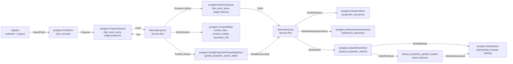
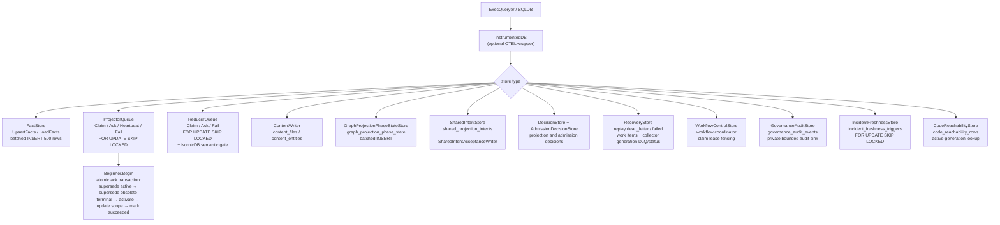

# storage/postgres

`storage/postgres` owns Eshu's relational persistence layer: facts, queue state,
content store, status, recovery data, projection and admission decisions,
webhook refresh triggers, shared projection intents, AWS scan status, and
workflow coordination tables. It is the single durable source of truth for
pipeline state that projector, reducer, ingester, collectors, and the API
surface all share.

## Where this fits in the pipeline

## Internal flow

## Lifecycle / workflow

The detailed lifecycle contract lives in
[`lifecycle-and-workflow-guide.md`](lifecycle-and-workflow-guide.md). Keep that
guide current when changing bootstrap DDL ordering, fact persistence, projector
or reducer queue behavior, workflow fencing, graph projection phase state,
webhook triggers, AWS scan status, or runtime drift evidence loading.

How retired, removed, tombstoned, and superseded evidence is kept out of
active-generation reads — the candidate-case matrix, the two retirement
mechanisms, and the index/pointer-bounded retraction shape — is documented in
[`retirement-proof-matrix.md`](retirement-proof-matrix.md) and proven by
`proof_domain_retirement_test.go` here plus `retirement_retract_proof_test.go`
in `internal/reducer`.

High-signal invariants for this package:

- Bootstrap DDL is idempotent and ordered through `BootstrapDefinitions`.
- `code_reachability_rows` stores reducer-materialized code reachable-set rows
  by active source generation, and `code_reachability_repository_watermarks`
  records the completed intent timestamp covered by each repository snapshot so
  empty reachable sets do not loop forever; query dead-code reads consult the
  rows before the compatibility scan over completed shared projection intents.
- Fact writes batch at 500 rows, deduplicate `fact_id` within a batch, sanitize
  JSONB control bytes, and skip unchanged pending-or-active generations by
  `FreshnessHint`.
- Projector claims preserve one active source-local generation per `scope_id`,
  reclaim expired leases before fresh work, coalesce stale same-scope work, and
  atomically ack by superseding stale active generation, superseding older
  terminal same-scope generations, activating the target generation, updating
  the scope pointer, and marking work succeeded.
- Reducer claims share the lease/retry contract and add domain filters plus the
  NornicDB semantic gate for `semantic_entity_materialization` while
  source-local projection is in flight. A reducer claim also supersedes
  unleased older-generation reducer rows once the same scope has a newer active
  generation, and status/drain/observer reads exclude those inactive rows from
  live readiness while preserving the durable work item for audit history.
- Workflow, AWS pagination, AWS scan-status, webhook, incident freshness, and
  hosted tenant/workspace grant stores use fencing, coalescing, or idempotent
  conflict keys so stale workers or replayed deliveries cannot overwrite newer
  durable truth.
- `GovernanceAuditStore` validates every event through
  `governanceaudit.NormalizeEvent`, derives a deterministic event id from the
  normalized safe fields, and uses `ON CONFLICT DO NOTHING` so retried writes
  are idempotent without storing raw principals, source names, prompts,
  provider responses, credential handles, private URLs, or token values.
- Tenant/workspace grant storage persists opaque tenant and workspace IDs,
  redacted display-handle hashes, scope grants, and repository grants. Active
  reads and claimed fact commits apply status, tombstone, effective-at, expiry,
  subject-class, and policy-revision predicates inside SQL before returning
  rows or writing source facts.
- Scoped API token storage is additive: it persists only opaque tenant and
  workspace IDs, token hashes, subject hashes, active bounds, expiry,
  revocation, and policy revision hashes without storing raw bearer tokens or
  changing current API, MCP, graph, collector, or workflow enforcement.
- Repository ref readbacks stay bounded by the `repository_refs` primary key
  `(repo_id, ref_kind, name)` and default-ref index; writers replace only a
  fresh ref set carried by the current materialization so content-only
  generations do not erase branch metadata.
- Documentation fact readbacks stay bounded by visible finding/source/packet
  indexes plus `fact_records_documentation_target_refs_idx`, a partial JSONB GIN
  index over documentation target-reference payloads.
- Eshu search-document projection writes derived document facts and a persisted
  BM25 read index in the same reducer retry path. `eshu_search_index_documents`
  stores active-generation document payloads and lengths,
  `eshu_search_index_terms` stores term frequencies by bounded term key, and
  `eshu_search_index_stats` stores corpus size and average length so API/MCP
  search reads do not rebuild a full corpus per request. Vector metadata and
  value rows store derived embedding lifecycle state plus bounded numeric
  payloads by active generation, provider profile, source class, model, content
  hash, and index version without promoting vector similarity to graph truth.
  The pending sweeper re-enqueues scopes whose active search documents exist but
  stats are missing.
  `EshuSearchVectorPendingStore` lists active repository scopes whose curated
  search documents do not yet have ready vector metadata/value rows for the
  configured provider profile, source class, model id, and vector index
  version, allowing reducer vector builds to converge without request-time
  scans.
- Relationship evidence backfill stays bounded to latest active repository
  facts, file/content facts, and `gcp_cloud_relationship` facts. GCP
  relationship facts are included explicitly because they are provider-resource
  facts without repository file content, while the resolver still requires
  distinct catalog matches before evidence is persisted. Streaming commit-time
  evidence discovery remains repository-scope only; cloud-scope relationship
  facts enter repository generations through deferred backfill.
- Deferred relationship maintenance coordinates sharded ingesters through
  `deferred_maintenance_barriers` and
  `deferred_maintenance_barrier_arrivals`. Each shard records its local batch
  drain in the current epoch; only the shard that completes the epoch runs
  global maintenance. The leader then takes an exclusive transaction-level
  Postgres advisory lock while normal source generation commits take the
  matching shared lock before writing `fact_records` and projector work, so the
  post-drain backfill/reopen pass waits for in-flight fact commits and blocks
  next-cycle commits until global maintenance commits or rolls back. If a shard
  arrives with a different shard count while an epoch is open, storage fails
  closed instead of creating competing epochs.
- `value_flow_fixpoint_components` stores reducer-owned solved value-flow
  component results by content-derived component key, so unchanged components
  can be reused across reducer restarts and replicas without re-solving.

No-Regression Evidence: scoped hot-path notes live in
[`evidence-notes.md`](evidence-notes.md), including #2059 claimed fact commit
tenant-grant fencing. No-Observability-Change: #2059 adds no new signal shape.

No-Regression Evidence: `go test ./internal/storage/postgres -run
'TestIngestionStore(CommitScopeGenerationTakesSharedMaintenanceBarrier|RunDeferredRelationshipMaintenanceTakesExclusiveBarrier|ShardDrainBarrier)|TestBootstrapDefinitionsIncludeDeferredMaintenanceBarrier'
-count=1` covers the shared source-commit barrier and exclusive deferred
maintenance barrier, the multi-shard drain rendezvous, and bootstrap DDL.

### Multi-cloud runtime drift evidence loader (issues #1997, #1998)

`PostgresMultiCloudRuntimeDriftEvidenceLoader` is the concrete
`reducer.MultiCloudRuntimeDriftEvidenceLoader` that backs
`DomainMultiCloudRuntimeDrift`. It builds the provider-neutral drift join on one
canonical `cloud_resource_uid` keyspace so AWS, GCP, and Azure share a single
path. The loader runs three bounded reads: (1) observed inventory facts
(`aws_resource`, `gcp_cloud_resource`, `azure_cloud_resource`) for one
`(scope_id, generation_id)`, resolving each provider's native raw identity (ARN,
full resource name, ARM id) into the shared uid through
`cloudinventory.ResolveProviderIdentity`; (2) active `terraform_state_resource`
rows whose provider-native identity (matched from `attributes.arn`,
`attributes.id`, or `attributes.self_link`) re-resolves to one of those uids,
bounded by a JSON allowlist of the observed identities so a stale generation
cannot widen the join. AWS ARNs and GCP full resource names are case-significant
and match exactly; Azure ARM ids are case-insensitive per Azure and the shared
`cloud_resource_uid` lower-cases them before hashing, so the Azure side of the
state-to-observed join is case-folded (the `match_key` CTE lower-cases only
`/subscriptions/`-rooted identities, and the loader maps the returned state
identity back to the observed uid via an exact lookup first and an Azure-only
case-folded lookup second) so a state row whose `attributes.id` differs only in
casing still joins instead of reading as orphaned, while AWS/GCP casing
differences stay distinct. Read (3) loads Terraform config rows resolved per state backend
owner through the same shared `tfstatebackend` resolver the AWS drift domain uses,
joined to state by Terraform address. Observed-only resolves to orphaned,
cloud+state without config to unmanaged, conflicting state owners for one uid to
ambiguous, and an unresolved config owner to unknown. The loader never invents a
second keyspace, never fabricates a uid for an unresolved identity, and never
promotes a provider observation over declared Terraform config.

No-Regression Evidence: `go test ./internal/storage/postgres -run 'TestPostgresMultiCloudRuntimeDriftEvidenceLoader' -count=1` proves the loader joins observed+state+config by uid across the three providers, classifies orphaned/unmanaged/ambiguous/unknown, resolves a Terraform state identity to the same uid as the observed fact, drops identities that cannot key into the shared keyspace, rejects blank scope/generation and a nil DB, short-circuits the state/config scans on an empty observed set (one query only), and stays stable under concurrent loads. `TestPostgresMultiCloudRuntimeDriftEvidenceLoaderAzureStateCaseInsensitiveJoin` adds the case-fold proof: an Azure state row whose `attributes.id` differs only in casing from the observed `arm_resource_id` still joins and reads as unmanaged, while AWS ARN and GCP full-resource-name casing differences stay distinct uids and read as orphaned, and the state-join SQL is asserted to case-fold only the `/subscriptions/` keyspace. The observed scan reuses `listMultiCloudObservedResourcesForGenerationQuery`, served by the existing `fact_records_scope_generation_idx (scope_id, generation_id, fact_kind, observed_at DESC)` partial-key prefix; the state scan (`listActiveStateResourcesForMultiCloudIdentitiesQuery`) is bounded by the observed-identity JSON allowlist and the `ingestion_scopes.active_generation_id` join, with `is_tombstone = FALSE` on both reads and no full-table scan; the Azure `match_key` fold keeps the state-side join an equijoin on a computed key (no per-row function scan against the allowlist). `go test ./internal/storage/postgres ./internal/reducer -race -count=1` passed; the case-fold is read-side only beside the unchanged AWS drift loader, so the AWS path does not regress.

No-Observability-Change: the loader adds no table, route, worker, queue domain, graph write, metric name, or metric label. It is wrapped by the new `reducer.multi_cloud_runtime_drift_evidence_load` span whose child `postgres.query` spans expose the observed, state, and config sub-scans; the publication handler already emits the bounded multi-cloud drift counters and the canonical `reducer_multi_cloud_runtime_drift_finding` payload, and the Postgres instrumentation wrapper still emits `eshu_dp_postgres_query_duration_seconds{store=...,operation=...}` for each read. Loader-side decode and unresolved-identity skips are surfaced through the redaction-aware `multi_cloud_observed_unresolved` and `multi_cloud_state_payload_decode` warning logs (fact kind plus redacted resource attributes only).

## Exported surface

The full exported store inventory lives in
[`exported-surface-guide.md`](exported-surface-guide.md). Keep that guide in
lockstep with public constructors, schema helpers, reducer/query adapters, and
callable store contracts.

Primary groups:

- Database adapters: `ExecQueryer`, `Transaction`, `Beginner`, `SQLDB`,
  `SQLTx`, `InstrumentedDB`.
- Fact, queue, recovery, status, workflow, and webhook stores.
- Governance audit store for validation-safe private event persistence,
  authorized bounded detailed reads, retention pruning, and aggregate-only
  status readback.
- Generation retention store for bounded superseded-generation cleanup,
  hashed retention events, changed-since expiry proof, and identity-safe
  content pruning.
- Service-scoped incident evidence loader for the incidents service-evidence
  family. It resolves PagerDuty provider service ids to catalog service ids
  through active exact/derived reducer correlation facts and fails closed for
  ambiguous repository ownership.
- Installed advisory target readers for active OS package and active attached
  SBOM component evidence used by vulnerability-intelligence planning.
- Content stores and content writers, including bounded entity-batch
  concurrency and Postgres pool-budget notes.
- Graph projection phase, shared projection intent, acceptance, freshness, and
  readiness helpers used by reducer domains.
- Projection and admission decision stores for reducer-owned write decisions
  and scope/generation/domain-bounded correlation admission explanations.
- Fact indexes for reducer-owned package and service-catalog correlations,
  including service-catalog candidate repository IDs used by ambiguous
  repository-scoped API/MCP readbacks.
- Terraform and AWS drift adapters that keep reducer joins bounded by scope,
  generation, ARN allowlists, backend ownership, and active read-model indexes.
- `EshuSearchDocumentStore` reads curated design-430 search documents
  (`reducer_eshu_search_document`) for a scope's active generation, bounded by
  repository, source kind, and a capped page.
- `EshuSearchVectorPendingStore` reads only active repository scopes with
  unbuilt or stale local vector sidecar rows for active search documents,
  bounded by scope limit and vector identity.
- `FunctionSummaryStore`, `FunctionSourceStore`, `FunctionGraphIDStore`, and
  `ValueFlowFixpointComponentStore` persist the durable value-flow inputs and
  solved component results used by the reducer's post-summary fixpoint.

## Dependencies

- `internal/facts` — `facts.Envelope`
- `internal/projector` — `projector.ScopeGenerationWork`, `projector.Result`,
  `projector.IsRetryable`
- `internal/reducer` — `reducer.Domain`, `reducer.SharedProjectionIntentRow`,
  `reducer.GraphProjectionReadinessLookup`, `reducer.AcceptedGenerationLookup`
- `internal/recovery` — recovery store interface contracts
- `internal/scope` — `scope.ScopeKind`, `scope.GenerationStatus`,
  `scope.TriggerKind`
- `internal/status` — status store interface contracts
- `internal/telemetry` — `telemetry.Instruments` for `InstrumentedDB`
- `internal/workflow` — `workflow.ClaimSelector`, `workflow.ClaimMutation`
- `database/sql` — standard library

## Telemetry

- `eshu_dp_postgres_query_duration_seconds` — histogram per SQL operation,
  labeled `operation=read|write` and `store=<StoreName>`; recorded by
  `InstrumentedDB`
- Spans: `postgres.exec` and `postgres.query` from `InstrumentedDB`; carry
  `db.system=postgresql`, `db.operation`, and `eshu.store` attributes
- `AWSPaginationCheckpointStore` records AWS checkpoint load, save, resume,
  expiry, and failure events through
  `eshu_dp_aws_pagination_checkpoint_events_total`.
- `PostgresAWSCloudRuntimeDriftEvidenceLoader` logs malformed AWS runtime
  resource rows with `resource.fingerprint`, `resource.identity_kind`, and
  `resource.type`; it does not put raw ARNs, Terraform addresses, or
  secret-shaped resource names in operator logs.

To add instrumentation to a store, wrap the `ExecQueryer` passed to its
constructor with `InstrumentedDB{Inner: db, StoreName: "my_store", ...}`.

## Operational notes

- `eshu_dp_postgres_query_duration_seconds{store="queue", operation="read"}`
  elevated means claim latency is high; check `FOR UPDATE SKIP LOCKED`
  contention and index coverage on `fact_work_items`.
- `eshu_dp_postgres_query_duration_seconds{store="facts", operation="write"}`
  elevated means fact batch writes are slow; check connection pool and batch
  size (default 500).
- Dead-letter items accumulate in `fact_work_items` when `attempt_count >=
  MaxAttempts`; use `RecoveryStore` to replay after investigating
  `failure_class`.
- `ErrProjectorClaimRejected` or `ErrReducerClaimRejected` in logs means a
  heartbeat or ack arrived after lease expiry; the original worker must stop and
  not retry the ack.
- `graph_projection_phase_state` rows gate reducer edge domains. If missing
  for a scope generation, check `GraphProjectionPhaseRepairQueueStore` depth and
  projector logs for `publish_phases` stage errors.
- `graph_endpoint_presence` (migration `024`, `GraphEndpointPresenceStore`) is
  the uid-exact, **cross-scope** endpoint-readiness primitive for the secrets/IAM
  graph projection (issue #1380). Keyed by `(keyspace, uid)`, it is written
  idempotently by the CloudResource and KubernetesWorkload node materializers
  only when the projection feature is enabled, and read via `MissingUIDs` (one
  bounded `uid = ANY(...)` query). Unlike `graph_projection_phase_state` it proves
  a *specific node* committed, which the scope/generation-keyed phase table
  cannot express across scopes.
- `secrets_iam_endpoint_not_ready` is a non-counting reducer retry class. It
  stays `retrying` with normal backoff and preserves the specific failure class,
  but single and batch claims do not increment `attempt_count` while that class
  is pending. This lets cross-scope endpoint readiness wait past
  `ESHU_REDUCER_MAX_ATTEMPTS` without terminally dropping edges.

No-regression and observability proof for this retry class lives in
[`evidence-notes.md`](evidence-notes.md#reducer-endpoint-readiness-retry-1391).

## Extension points

- New store — implement against `ExecQueryer`; wrap with `InstrumentedDB` for
  observability; add a `*SchemaSQL()` function and register in
  `BootstrapDefinitions` if the store needs a new table.
- New queue domain — extend `ReducerQueue.Claim` domain filter; add the domain
  constant in `internal/reducer`.
- New schema table — add a `Definition` to `bootstrapDefinitions` in
  `schema.go`; keep DDL idempotent; place FK-dependent tables after their
  referenced tables in the slice.

## Gotchas / invariants

- `ProjectorQueue.Ack` runs five SQL statements inside a transaction. Pass a
  `SQLDB` or an `InstrumentedDB` wrapping
  a `SQLDB`; a plain `ExecQueryer` without `Beginner` will cause Ack to fail.
- `upsertFacts` deduplicates by `fact_id` before batching (`facts.go:206`).
  Skipping deduplication causes `SQLSTATE 21000` on `ON CONFLICT DO UPDATE`
  when the same `fact_id` appears twice in one batch.
- `ListFactsByKind` keeps a stable `(observed_at, fact_id)` keyset cursor
  (`facts_filtered.go:71`). Lowering the page size below the write batch size
  can make reducer-only reads spend most of their time in Postgres round trips
  rather than extraction or graph writes.
- `ListFactsByKindAndPayloadValue` is only for top-level JSON payload fields
  that are part of a reducer domain's truth contract. Do not use it to paper
  over missing parser metadata or to guess at nested payload shape.
- Shared projection intents are idempotent by `intent_id`. Writers should
  upsert the same row on retry rather than minting a new ID. The 2000-row
  upsert batch keeps each statement below Postgres' parameter limit while
  avoiding small-batch round trips on code-call-heavy repositories.
- Current source-run history is distinct from prior acceptance-unit history.
  `HasCompletedAcceptanceUnitDomainIntents` intentionally ignores
  `source_run_id` so new accepted runs can detect prior graph state;
  `HasCompletedAcceptanceUnitSourceRunDomainIntents` includes `source_run_id`
  so chunked code-call projection can skip only same-run retractions.
- `ListOwnedPackageDependencyTargets` serves workflow-coordinator derivation.
  Package-registry callers use package-level identities so repeated versions of
  one package cannot starve later packages. Vulnerability-intelligence callers
  use package-version identities and retain dependency `source_location` so
  Swift OSV planning can send the source Git URL required by OSV `SwiftURL`.
  The rotation offset lets bounded full-corpus runs advance past the first
  sorted page without changing worker counts or query scope.
- `ListOSPackageAdvisoryTargets` and `ListSBOMComponentAdvisoryTargets` serve
  vulnerability-intelligence installed-evidence derivation. OS package reads
  stay on active `vulnerability.os_package` facts joined to the active
  generation and filtered by vendor advisory source/distro ecosystem. SBOM
  component reads stay on active `sbom.component` facts that have active
  same-scope attached `reducer_sbom_attestation_attachment` evidence and filter
  by PURL ecosystem before applying the bounded rotated limit. SBOM rows derive
  exact package identity from the PURL; component payload versions that
  conflict with the PURL version are dropped before planning. The readers return
  exact source facts only; the coordinator owns admission and partial-evidence
  skip reasons.
- `ListActivePackageManifestDependencyFacts` serves both package-source
  correlation and supply-chain impact. The query stays indexed on active Git
  dependency entities by `(package_manager, entity_name)`, so vulnerability
  impact can load repository lockfile evidence for one advisory package without
  waiting for package-registry enrichment to finish.
- `ListActiveJVMReachabilityFacts` serves JVM vulnerability reachability
  enrichment after Maven or Gradle dependency evidence has already proven a
  canonical repository and resolver-backed API package prefix. The query is
  bounded by repository IDs, the JVM file partial index, and the resolver API
  package list across parser imports, parser calls, and SCIP calls; reducers
  still perform the API-prefix match and keep missing source-set, resolver,
  reflection, dependency-injection, and generated-code evidence visible.
  No-Regression Evidence: `go test ./internal/storage/postgres -run
  'TestListActiveJVMReachabilityFacts' -count=1` failed before the SQL passed
  the API package list into the active-file query, then passed with the
  repository/API/language bound and a matching Java parser-import row. `go test
  ./internal/reducer -run
  'TestSupplyChainImpactHandlerLoadsActiveJVMReachabilityFacts|TestBuildSupplyChainImpactFindingsMarksJVMReachableFrom(ParserImport|SCIPEvidence)|TestBuildSupplyChainImpactFindingsKeepsJVMGapsUnknownWithoutAPIIdentity|TestBuildSupplyChainImpactFindingsNeverMarksJVMNotCalledWithoutAnalyzer'
  -count=1` proves the reducer still sends the repository/API filter and keeps
  parser and SCIP evidence accurate. No-Observability-Change: the read path
  still uses the existing instrumented Postgres query span and
  `eshu_dp_postgres_query_duration_seconds` metric from the reducer's
  Postgres adapter, plus reducer execution spans/counters and the persisted
  supply-chain impact reachability/missing-evidence payloads; no route, queue,
  graph write, worker, runtime knob, metric name, or metric label changed.
- `ListActiveSupplyChainImpactFacts` includes provider security alerts in the
  same package/repository-bounded read used for vulnerability, package, SBOM,
  image, OCI registry, and service evidence. The selector includes raw OCI
  manifest, index, tag-observation, and referrer facts only behind package,
  digest, repository, or image-reference predicates, so reducers can recover
  image/SBOM anchors without scanning the whole registry fact set. This lets
  alert-seeded impact admission reuse active owned dependency evidence without
  scanning all repository alerts.
  Reducer reconciliation keeps provider-scoped repository IDs separate from
  canonical `repository_id` values, so Postgres fact payloads should preserve
  both when the source uses a provider-owned repository namespace.
- `GetSupplyChainAdvisoriesForRepos` (issue #2127) is the repo-scoped read that
  sources the service vulnerabilities evidence family (#1990). It loads active,
  non-tombstone `reducer_supply_chain_impact_finding` facts filtered by
  `payload->>'repository_id'`, paged by the `fact_id` keyset, and maps each
  finding to a `reducer.ServiceVulnerabilityRecord` grouped by repository id. It
  is served by the partial index
  `fact_records_supply_chain_impact_repository_lookup_idx`
  (`payload->>'repository_id'`, `fact_id ASC`, `generation_id`) under the
  `reducer_supply_chain_impact_finding` + `is_tombstone = FALSE` predicate. A
  service is attributed an advisory only through a real impact finding on its
  repository; there is no fuzzy advisory-to-service name match.
- `ListActiveSBOMAttestationAttachmentFacts` keeps attachment repair bounded by
  subject digest, document id/digest, statement id/digest, payload digest, and
  referrer digest. It may read active SBOM document/component and attestation
  evidence plus OCI referrer facts, but it must not infer an attachment unless
  reducer-owned subject evidence can prove the join.
- Supply-chain impact parser-file follow-up is separate from normal repository
  follow-up. Repository IDs still load bounded context facts such as workload,
  service, image, CI/CD, and suppression evidence, but active `file` facts only
  load through the JS/TS parser-file repository filter and the SQL language
  predicate for JavaScript, JSX, TypeScript, and TSX. Non-JS/npm findings must
  not use broad repository IDs to pull every active file fact for a repository.
  No-Regression Evidence: `go test ./internal/reducer -run
  'TestSupplyChainImpactHandlerRequestsParserFilesOnlyForNPMReachability|TestBuildSupplyChainImpactFindingsUsesJSTSPackageAPIReachability|TestBuildSupplyChainImpactFindingsKeepsJSTSMissingAndAmbiguousEvidenceExplicit'
  -count=1` and `go test ./internal/storage/postgres -run
  'TestListActiveSupplyChainImpactFactsQuerySeparatesParserFileFollowUp|TestListActiveSupplyChainImpactFactsQueryBoundsRepositoryFollowUp'
  -count=1` prove non-JS/npm repository follow-up excludes parser files while
  npm JS/TS reachability still requests JS/TS file evidence.
  No-Observability-Change: the change only narrows the existing
  `FactStore.ListActiveSupplyChainImpactFacts` SQL predicate and reducer filter
  keys; operators continue to diagnose the path through
  `eshu_dp_postgres_query_duration_seconds`, reducer run spans/counters, and
  durable supply-chain impact finding payloads.
- Advisory evidence reads stay bounded by first-class advisory identity fields,
  package IDs, or PURLs before active-generation validation. Performance
  Evidence: issue #868 changed the read path from a broad active vulnerability
  CTE to selector-first identity branches backed by
  `fact_records_vulnerability_active_*_lookup_v2_idx`; representative
  preserved-volume proof returned `CVE-2021-44228` in 0.691s cold and
  0.435s/0.439s warm, while `EXPLAIN ANALYZE` completed the present-CVE SQL in
  472.419ms using those indexes. No-Observability-Change: the API route still
  emits `query.advisory_evidence`, Postgres query duration metrics, truth
  envelope metadata, status/error bodies, `count`, `limit`, `truncated`, and
  `next_cursor`; no graph query, queue, reducer lane, worker, runtime knob, or
  metric label changed.
- The NornicDB semantic gate in `ReducerQueue.Claim` is gated on a boolean
  parameter and must not be removed without an ADR; it prevents
  `semantic_entity_materialization` storms on NornicDB label indexes.
- `PackageRegistryIdentityLocker` uses transaction-scoped
  `pg_advisory_xact_lock` keys to coordinate package UID canonical writes
  across ingester, standalone projector, and bootstrap-index processes. It
  de-duplicates and sorts package IDs before acquiring locks, commits after the
  protected canonical write succeeds, and rolls back on callback failure so
  Postgres releases the lock automatically. No-Regression Evidence: `go test
  ./internal/storage/postgres -run 'TestPackageRegistryIdentityLocker' -count=1`
  proves sorted/de-duplicated lock acquisition and rollback-on-error behavior.
  Observability Evidence: waits over 100ms emit a structured
  `package registry identity advisory locks acquired` log with
  `package_uid_count`, `lock_key_sample`, and `wait_s`; existing Postgres
  transaction failures still surface as wrapped callback or commit errors.
- `aws_relationship_materialization`, `observability_coverage_materialization`,
  `iam_can_assume_materialization`, `s3_logs_to_materialization`,
  `s3_external_principal_grant_materialization`,
  `rds_posture_materialization`, `iam_instance_profile_role_materialization`,
  and `s3_internet_exposure_materialization` claims wait on the exact
  `cloud_resource_uid` / `canonical_nodes_committed` readiness row for the
  same scope, generation, and `entity_key`. This keeps relationship work
  and CloudResource node-property work pending or retrying until
  `aws_resource_materialization` has made `CloudResource` nodes visible, while
  allowing the resource materialization row in the same conflict key to claim
  and publish the phase.
- `WorkflowControlStore` claim mutations use `ErrWorkflowClaimRejected` for
  fenced writes; callers must stop processing when this error is returned.
- `WorkflowControlStore.FailClaimTerminal` uses a dense seven-argument SQL
  mutation because terminal failures do not requeue and therefore do not need a
  `visible_at` placeholder. Do not leave skipped parameter numbers in workflow
  claim SQL; Postgres must infer every prepared-statement parameter type before
  it can persist the terminal failure.
- `AWSScanStatusStore` mutations must keep their fencing guards. A stale AWS
  worker must not overwrite per-tuple scanner or commit state from a newer
  claim. ObserveAWSScan and CommitAWSScan stay pinned to the exact
  `(generation_id, fencing_token)` so stale collectors cannot clobber a newer
  owner. StartAWSScan accepts a cross-generation overwrite when the prior
  row is terminal OR the new `last_started_at` is strictly newer than the
  stored value (or the row has none), which lets a fresh workflow generation
  reclaim the per-target slot after an orphaned `running`/`pending` row was
  left by a collector that died mid-flight. Without this widening one
  orphaned row blocks every future generation and the workflow runtime spins
  stale-fence retries — see issue #612.
- `AWSScanStatusStore` returns `awscloud.ErrScanStatusStaleFence` when a
  mutation affects zero rows; callers wrap and route the failed claim to
  terminal (the AWS claimed runtime does this via
  `awsruntime.FailureClassStaleFence`) instead of looping it on the
  retryable queue.
- `AWSScanStatusStore.CommitAWSScan` clears previous commit failure class and
  message when a retry finally commits a scan whose scanner-side status is
  `succeeded`. Scanner-side failed, partial, budget-exhausted, and credential
  failures remain in the row so status readback can still explain active
  degraded scopes.
- `WebhookTriggerStore` treats webhook payloads as trigger evidence only. It
  preserves merged pull-request number, URL, and title provenance for bounded
  read-model enrichment, but the Git collector must still fetch the repository
  before freshness becomes true.
- `AWSFreshnessStore` treats AWS Config and EventBridge events as trigger
  evidence only. The AWS collector must still scan the affected service tuple
  before cloud inventory becomes fresh.
- `IncidentFreshnessStore` treats PagerDuty and Jira webhooks as source-scoped
  trigger evidence only. It coalesces repeated delivery events by
  `freshness_key`, claims queued triggers with `FOR UPDATE SKIP LOCKED`, and
  records handed-off or failed rows after the workflow coordinator authorizes a
  configured collector `scope_id`.
- `FactStore.LoadIncidentRoutingEvidence` builds reducer-ready PagerDuty
  incident-routing packets for the graph materialization domain. It loads
  `incident.record` anchors and same-generation `incident_routing.*` facts for
  the claimed scope/generation, skips tombstones, filters applied evidence to
  PagerDuty service resources, and then reads Terraform-source
  `PagerDutyDeclaration` content rows through a lowercased service-name
  allowlist. Routing facts without an incident anchor do not trigger a
  cross-scope graph mutation.
- Schema definitions in `bootstrapDefinitions` are applied in slice order.
  Tables with foreign key constraints on other tables must appear after their
  dependencies.

Additional historical no-regression notes for incident freshness, incident
routing, workflow terminal failure, readiness gating, owned dependency targets,
and advisory targets live in [`evidence-notes.md`](evidence-notes.md).

## Related docs

- `docs/public/architecture.md` — pipeline and ownership table
- `docs/public/deployment/service-runtimes.md` — runtime lanes and Postgres config
- `docs/public/reference/telemetry/index.md` — metric and span reference
- `docs/public/reference/local-testing.md` — Postgres verification gates
- ADR: `docs/public/reference/backend-conformance.md`
- ADR: `docs/public/reference/graph-backend-operations.md`

## ServiceCatalogIDResolver evidence (#2877 / #2863)

`ServiceCatalogIDResolver` (`service_catalog_id_resolver.go`) resolves a workload
id to its durable catalog service id over `reducer_service_catalog_correlation`
facts, the bridge the service intelligence report's incident lane needs (the
incident loader keys on the catalog service id, the service story exposes the
workload id).

Performance Evidence: the resolve query filters
`fact_kind = 'reducer_service_catalog_correlation'` and
`payload->>'workload_id' = $1` under the active-generation join, backed by the new
partial index `fact_records_service_catalog_correlations_workload_idx` that leads
with `(payload->>'workload_id')`. Before it, no index led with `workload_id` (the
`_repository_idx` keyed it third), so a workload lookup scanned the
fact-kind-filtered partition; with it the resolve is an index seek bounded by the
active-generation correlation rows for one workload (typically 1, fail-closed when
> 1). The report route adds one resolve plus one bounded incident load per
request, only when the incident source is wired.

No-Regression Evidence: no existing index, query, or write path is altered; the
added `CREATE INDEX IF NOT EXISTS ... WHERE fact_kind = '...'` is a small partial
index over an already-maintained fact kind, alongside its sibling partial indexes.
Validated by focused unit tests (fake `Queryer`) and the schema index test
(`schema_service_catalog_test.go`); the cost argument rests on the index
left-prefix match above, mirroring the proven `ServiceIncidentEvidenceLoader`
pattern rather than a live benchmark in this PR.

Observability Evidence: the resolver wraps failures with `%w` so callers attribute
the cause; the consuming report handler logs `serviceintel.incident_load_error`
and `serviceintel.incident_ambiguous_catalog_service`, and the route is covered by
the existing API request-duration/error metrics middleware. The resolver adds no
new metric or span of its own.

### Bounded incident read for the report surface

`ServiceIncidentEvidenceLoader.GetIncidentEvidenceForServicesBounded`
(`serviceIncidentEvidenceBoundedQuery` = the unbounded join plus `LIMIT $2`) caps
the rows one report request loads. The reducer materialization path keeps the
unbounded `GetIncidentEvidenceForServices` because it must observe every routed
incident; only the read surface caps the load.

Performance Evidence: the report source passes `reportIncidentEvidenceRowLimit`
(512), far above the surfaced incident bound (`serviceintel.maxReportIncidents` =
50) and the few evidence slots per incident, so a `get_service_intelligence_report`
call can no longer scan/load an unbounded incident history while still reading
more than enough distinct incidents for the composer's truncation flag to fire.
No-Regression Evidence: the unbounded query and the reducer path are byte-for-byte
unchanged (the bounded query is `serviceIncidentEvidenceQuery + "\nLIMIT $2"`),
proven by `TestServiceIncidentEvidenceBoundedQueryAppliesRowLimit`.
Observability Evidence: load failures on the bounded path are logged by the report
source as `serviceintel.incident_load_error` (workload id + catalog service id);
no new metric or span is added.
