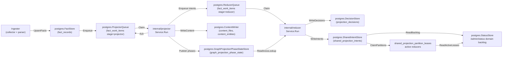
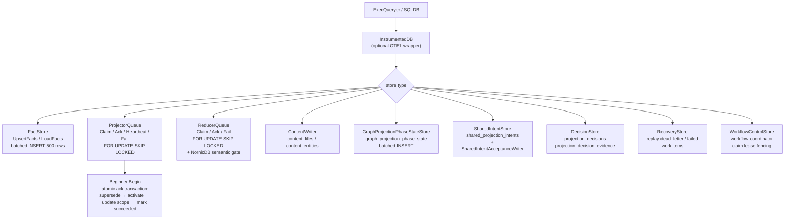

# storage/postgres

`storage/postgres` owns Eshu's relational persistence layer: facts, queue state,
content store, status, recovery data, decisions, webhook refresh triggers,
shared projection intents, AWS scan status, and workflow coordination tables.
It is the single durable source of truth for pipeline state that projector,
reducer, ingester, collectors, and the API surface all share.

## Where this fits in the pipeline

## Internal flow

## Lifecycle / workflow

### Schema bootstrap

`ApplyBootstrap` (or `ApplyBootstrapWithoutContentSearchIndexes`) applies all
`BootstrapDefinitions` in order. Each `Definition` carries a name and SQL DDL.
`ValidateDefinitions` enforces uniqueness. Schema DDL is idempotent
(`CREATE TABLE IF NOT EXISTS`, `CREATE INDEX IF NOT EXISTS`).
The large `fact_records` DDL lives in `schema_fact_records.go` so
`schema.go` can stay focused on bootstrap ordering and exported helpers.

### Fact persistence

`FactStore.UpsertFacts` batches facts into multi-row INSERT statements of up
to 500 rows (17 columns each, well under the Postgres 65535-parameter limit).
`deduplicateEnvelopes` removes duplicate `fact_id` values within each batch
before sending to avoid `SQLSTATE 21000` on `ON CONFLICT DO UPDATE` when a
generation contains self-overwrites.

`FactStore.ListFactsByKind` uses the same 500-row page size for kind-filtered
reads (`facts_filtered.go:77`). Reducer domains such as semantic entities and
code calls use this path to avoid full-generation loads and thousands of tiny
Postgres round trips on large repositories. `ListFactsByKindAndPayloadValue`
adds a top-level JSON payload allowlist (`facts_filtered.go:115`) for reducer
domains whose correctness contract is tied to `content_entity.entity_type`,
such as inheritance and SQL relationships. Both paths select the full
`facts.Envelope` column shape before calling the shared scanner, so filtered
reads keep schema version, collector, fencing, and source-confidence metadata.
`ListActiveRepositoryFacts` pages active Git repository facts through the
partial `fact_records_active_repository_idx` index so package source
correlation reads one row per active repository scope, not every fact row.
`ListActivePackageManifestDependencyFacts` uses
`fact_records_active_package_dependency_entity_idx` to load only active Git
manifest dependency entities for the ecosystem/name set in the current
package-registry reducer intent. Package correlation reads use
`fact_records_package_correlations_v2_lookup_idx` for package-scoped reads and
`fact_records_package_correlations_v2_repository_lookup_idx` for
repository-scoped reads across ownership, publication, and consumption rows so
API and MCP callers stay bounded by `package_id` or `repository_id`. The v2
names force existing bootstrapped databases to create indexes with the expanded
publication predicate instead of keeping the older ownership/consumption-only
partial indexes.
CI/CD run correlation reads use
`fact_records_ci_cd_run_correlations_lookup_idx` and
`fact_records_ci_cd_run_correlations_run_lookup_idx` for repository/run scoped
reducer facts. Commit, artifact-digest, and environment-only reads have their
own partial indexes so each advertised API/MCP anchor stays bounded. The
`fact_records_container_image_identity_digest_idx` index lets the reducer join
CI artifact digests to active image identity rows without scanning unrelated
fact payloads.
SBOM/attestation attachment reads use
`fact_records_sbom_attestation_attachments_subject_idx`,
`fact_records_sbom_attestation_attachments_document_idx`, and
`fact_records_sbom_attestation_attachments_status_idx` for digest, document,
and status-scoped reducer facts. `ListActiveSBOMAttestationAttachmentFacts`
loads only active referrer and image identity facts for the subject digests in
the current reducer intent, so attachment admission does not scan unrelated
SBOM or OCI evidence.

`sanitizeJSONB` strips `\u0000` escape sequences and raw control bytes
(`0x00–0x1F` except tab/newline/CR) from payloads before INSERT to prevent
`SQLSTATE 22P05` and `SQLSTATE 22P02` errors on repositories with binary or
non-UTF-8 content.

`CommitScopeGeneration` compares the incoming generation `FreshnessHint` with
the newest pending or active generation for the same scope. When the hint is
unchanged, the commit path logs and skips the redundant write so local polling
can observe files without recommitting identical snapshots or superseding
in-flight projector work. Failed generations do not satisfy this check, so a
failed first projection can still be retried by the next snapshot.

### Projector queue

`ProjectorQueue.Claim` uses `SELECT ... FOR UPDATE SKIP LOCKED` with a
per-scope in-flight conflict guard and an oldest-ready-row guard. Concurrent
claimers for the same `scope_id` must all target the same oldest ready work
item, so a worker cannot skip a locked older row and start a newer generation
for the same repository. Before selecting a candidate, claim coalesces older
same-scope projector rows and their pending or failed `scope_generations` to
`superseded` when a newer generation exists. That covers waiting rows and
obsolete terminal failures, so durable snapshot history remains available
without leaving stale local polling generations in the live backlog or health
summary.
`ProjectorQueue.Heartbeat` applies the same freshness check to a live claimed
or running row. When a newer pending or active generation exists for the scope,
heartbeat marks the older row and its generation `superseded` in one statement
and returns `projector.ErrWorkSuperseded` so the worker stops without acking
stale graph state.
Expired `claimed` or `running` rows are ordered ahead of ordinary pending rows
so stale leases are reclaimed before fresh work makes the status surface look
permanently overdue. Claim also demotes expired same-scope duplicate in-flight
rows back to `retrying` when a live sibling or a newly claimed sibling owns the
scope, which repairs queue state left by older owner crashes or claim races
without breaking the one-active-generation invariant. `Ack` runs a four-step atomic
transaction: supersede stale active generation → activate target generation →
update scope pointer → mark work succeeded. If `projector.IsRetryable(cause)`
returns true and `attempt_count < MaxAttempts`, `Fail` transitions to
`retrying` instead of `dead_letter`.

### Reducer queue

`ReducerQueue.Claim` extends the projector model with single-domain legacy
filtering and multi-domain allowlists for reducer deployment lanes, plus
NornicDB-specific semantic gates. When the NornicDB gate is active (`$5 = true`),
`semantic_entity_materialization` items are blocked while any source-local
projection is in-flight, preventing cross-scope contention on NornicDB label
indexes. The gate is disabled for Neo4j.
`reducer_queue.go` keeps lifecycle/validation; `reducer_queue_helpers.go`
keeps scan/default/retry/ID helpers shared by single-claim, batch, and replay paths.

`NewReducerGraphDrain` exposes a small read-side gate for code-call projection.
It checks whether reducer-owned graph domains are still pending, claimed,
running, or retrying so the local-authoritative NornicDB profile can avoid
overlapping code-call edge writes with semantic, inheritance, SQL relationship,
deployment, or workload graph materialization.

### Shared projection intents

`SharedIntentStore` stores durable shared projection intents for reducer-owned
edge domains. `ListPendingAcceptanceUnitIntents` reads one bounded
scope/unit/run slice, while
`HasCompletedAcceptanceUnitSourceRunDomainIntents` answers whether that exact
source run has already completed a chunk. Code-call projection uses the latter
lookup to process very large accepted units in chunks without retracting edges
written by earlier chunks from the same run.

### Graph projection phase state

`GraphProjectionPhaseStateStore` persists `canonical_nodes_committed` phase
markers after `cypher.CanonicalNodeWriter.Write` completes. The
`NewGraphProjectionReadinessLookup` and `NewGraphProjectionReadinessPrefetch`
factories return `reducer.GraphProjectionReadinessLookup` implementations used
by edge-domain reducer workers to gate on canonical node availability before
writing edges.

### Workflow control

`WorkflowControlStore` persists workflow coordinator control-plane state with
fenced claim leases. `ErrWorkflowClaimRejected` is returned when a claim
mutation is rejected because the current owner no longer holds the lease.

### AWS scan status

`AWSScanStatusStore` persists one row per AWS
`(collector_instance_id, account_id, region, service_kind)` tuple in
`aws_scan_status`. Scanner-side updates record `running`, `succeeded`,
`partial`, `credential_failed`, or `failed` along with bounded API call,
throttle, warning, and fact counts. The `collector-aws-cloud` command records a
separate commit status after the fenced ingestion transaction so operators can
distinguish scanner failures from commit failures.

### AWS runtime drift evidence

`PostgresAWSCloudRuntimeDriftEvidenceLoader` powers the
`aws_cloud_runtime_drift` reducer domain. It first loads `aws_resource` facts for
one AWS scope generation, then joins active `terraform_state_resource` facts by
an ARN allowlist derived from that generation. For state-backed ARNs it resolves
the `state_snapshot:<backend_kind>:<locator_hash>` owner through
`tfstatebackend.Resolver`, loads the owning config snapshot's
`terraform_resources`, and marks config present only when the Terraform address
matches. Missing backend ownership produces `unknown_cloud_resource` /
`unknown_management` evidence; ambiguous backend ownership or multiple active
state owners for the same ARN produces `ambiguous_cloud_resource` /
`ambiguous_management` evidence. Neither path treats unknown config as absent.

The AWS runtime drift findings reader uses the same bounded active fact read
shape and only closes result sets with the package-standard checked defer
pattern. No-Regression Evidence: `golangci-lint run ./...` catches unchecked
result-set closes, and `go test ./internal/storage/postgres` keeps the
Postgres store package compiling and exercising its existing storage contracts.
No-Observability-Change: the SQL text, filters, row counts, status surfaces, and
query instrumentation are unchanged; existing `InstrumentedDB` query spans and
duration metrics remain the operator signal for this read path.

### Webhook refresh triggers

`WebhookTriggerStore` persists provider webhook decisions in
`webhook_refresh_triggers`. Accepted triggers enter `queued`; ignored triggers
stay audit-only unless a later accepted delivery resolves the same refresh key,
which moves the row back to `queued`. `StoreTrigger` upserts on `refresh_key`
so dedupe follows the provider/repository/default-branch/target-SHA identity
even if the derived `trigger_id` algorithm changes. Claimers use
`FOR UPDATE SKIP LOCKED` in `received_at` order, then mark claimed rows
`handed_off` after the Git selector receives the targeted repository list or
`failed` with `failed_at`, `failure_class`, and `failure_message` when the
compatibility handoff cannot complete.

## Exported surface

**Database interfaces**

- `ExecQueryer` — combined read/write adapter; accepted by all store
  constructors
- `Transaction` — `ExecQueryer` + `Commit`/`Rollback`
- `Beginner` — `Begin(ctx) (Transaction, error)`; implemented by `SQLDB`
- `SQLDB` — adapts `*sql.DB`; `SQLTx` adapts `*sql.Tx`
- `InstrumentedDB` — wraps `ExecQueryer` with OTEL spans and
  `pcg_dp_postgres_query_duration_seconds`

**Fact store**

- `FactStore` / `NewFactStore` — `UpsertFacts`, `LoadFacts`, `ListFacts`,
  `ListFactsByKind`, `ListFactsByKindAndPayloadValue`,
  `ListActiveRepositoryFacts`, `CountFacts`
- `AWSCloudRuntimeDriftFindingStore` /
  `NewAWSCloudRuntimeDriftFindingStore` — active-generation reads over
  `reducer_aws_cloud_runtime_drift_finding` facts for the IaC management API;
  filters must include `scope_id` or a 12-digit `account_id`, optional regions
  must use AWS region characters only, exact `arn` filters use payload equality,
  and direct list reads cap at 500 rows.
  The decoded row preserves optional #124 read-model payload fields such as
  `management_status`, matched Terraform state/config handles, candidate
  service/environment labels, dependency paths, warning flags, missing
  evidence, and recommended action. Older facts without those fields still
  decode and let the query layer derive the current AWS drift statuses.

**Queue stores**

- `ProjectorQueue` / `NewProjectorQueue` — `Claim`, `Ack`, `Heartbeat`, `Fail`,
  `Enqueue`; `ErrProjectorClaimRejected`
- `ReducerQueue` / `NewReducerQueue` — `Claim`, `Ack`, `Fail`, `Enqueue`
  (batch); `ErrReducerClaimRejected`
- `QueueObserverStore` / `NewQueueObserverStore` — queue depth, age, and
  blockage queries for the status surface
- `AWSScanStatusStore` / `NewAWSScanStatusStore` — per AWS tuple scanner and
  commit status for `/admin/status`
- `PostgresAWSCloudRuntimeDriftEvidenceLoader` — bounded AWS resource →
  active Terraform state → owned Terraform config join for the
  `aws_cloud_runtime_drift` reducer domain, including explicit unknown and
  ambiguous owner evidence when coverage or deterministic owner signals are
  insufficient

**Content stores**

- `ContentStore` / `NewContentStore` — `GetFileContent`, `GetEntityContent`,
  `SearchFileContent`, `SearchEntityContent`; `FileContentRow`, `EntityContentRow`
- `ContentWriter` / `NewContentWriter` — writes `content_files` and
  `content_entities`. Entity-batch upserts fan out through
  `runConcurrentBatches` in `content_writer_batch.go`; the per-file batch
  loop stays serial because each file batch is preceded by a per-batch
  `delete_content_references` whose interleaving the existing tests gate.
  Auto-default concurrency is `runtime.NumCPU()` clamped to
  `contentWriterBatchConcurrencyAutoCap` (4); operators can opt up to
  `contentWriterBatchConcurrencyCap` (8) via
  `ESHU_CONTENT_WRITER_BATCH_CONCURRENCY`. The env value is resolved once in
  `NewContentWriter`, so a long-running ingester does not pick up live env
  changes mid-run; explicit overrides flow through
  `WithBatchConcurrency(int)`. The `upsert_entities` `logStage` line carries
  a `batch_concurrency` attribute so operators reading the log can
  reconcile the new wall-clock value with the per-batch
  `eshu_dp_postgres_query_duration_seconds` metric.

  Pool budgeting: peak Postgres demand is `ESHU_PROJECTOR_WORKERS *
  ESHU_CONTENT_WRITER_BATCH_CONCURRENCY` plus connections held by
  collector, status reads, and heartbeats. The auto cap of 4 reduces
  pressure relative to the prior unbounded fan-out, but does not on
  its own guarantee the product stays under the 30-connection default
  pool (`internal/runtime/data_stores.go`). Hosts with more than 7 CPUs
  (and the `local_authoritative` + NornicDB ingester wiring, which sets
  `ESHU_PROJECTOR_WORKERS = runtime.NumCPU()` uncapped) will see
  `4 * NumCPU` peak demand. When that exceeds the pool, `database/sql`
  queues new acquires rather than failing — throughput drops while the
  writer waits for a connection. Operators on high-core hosts, or
  operators raising the env knob, should raise the Postgres pool
  ceiling (the ESHU_POSTGRES_MAX_OPEN_CONNS env in
  `internal/runtime/data_stores.go`) or lower
  `ESHU_PROJECTOR_WORKERS` so the product stays inside the configured
  pool.

**Phase state**

- `GraphProjectionPhaseStateStore` / `NewGraphProjectionPhaseStateStore` —
  batched upsert of phase state rows
- `GraphProjectionPhaseRepairQueueStore` / `NewGraphProjectionPhaseRepairQueueStore`
  — repair queue for phase re-publish
- `NewGraphProjectionReadinessLookup` / `NewGraphProjectionReadinessPrefetch`
  — implement `reducer.GraphProjectionReadinessLookup`

**Shared projection**

- `SharedIntentStore` / `NewSharedIntentStore` — reads
  `shared_projection_intents` and writes shared projection intents in bounded
  multi-row batches (`shared_intents_upsert.go:62`). It also exposes history
  lookups for prior acceptance-unit completion and current source-run chunk
  completion.
- `SharedIntentAcceptanceWriter` / `NewSharedIntentAcceptanceWriter` — writes
  intent acceptance rows; `NewSharedIntentAcceptanceWriterWithInstruments` adds
  metrics
- `CodeCallIntentWriter` / `NewCodeCallIntentWriter` — type alias for
  `SharedIntentAcceptanceWriter`
- `SharedProjectionAcceptanceStore` / `NewSharedProjectionAcceptanceStore`

**Status**

- `StatusStore` / `NewStatusStore` — reads scope, generation, queue, blockage,
  failure, coordinator, registry collector, and domain backlog aggregates.
  `status_queries.go` merges `fact_work_items` with pending
  `shared_projection_intents` and active `shared_projection_partition_leases`
  for domain backlog rows. Lease-only rows stay visible even after the last
  pending intent is claimed, so `/admin/status` does not report healthy while
  reducer-owned shared projection work is still becoming graph-visible and does
  not report stalled while a reducer lease is actively moving that domain.
  `status_registry.go` derives OCI and package-registry aggregate counts from
  workflow tables without reading private registry object names. The same store
  also runs the bounded
  `terraformStateLastSerialQuery` and `terraformStateRecentWarningsQuery` from
  `tfstate_status.go` so the admin status response carries one row per
  Terraform-state safe locator hash plus up to
  `MaxTerraformStateRecentWarnings` recent warning facts grouped by
  `warning_kind`.

**AWS pagination checkpoints**

- `AWSPaginationCheckpointStore` / `NewAWSPaginationCheckpointStore` — persists
  claim-fenced AWS page tokens in `aws_scan_pagination_checkpoints`.
  `Save` rejects older fencing tokens, `ExpireStale` removes prior-generation
  rows for one AWS claim boundary, and `Complete` deletes operation state after
  a terminal page.

**Decision store**

- `DecisionStore` / `NewDecisionStore` — upserts `projection_decisions` and
  `projection_decision_evidence`; `DecisionFilter` for scoped reads

**Recovery**

- `RecoveryStore` / `NewRecoveryStore` — replays `dead_letter` and `failed`
  work items to `pending`

**Status**

- `StatusStore` / `NewStatusStore` — scope counts, generation counts, stage
  counts, queue depth
- `StatusRequestStore` / `NewStatusRequestStore` — async status request
  persistence

**Ingestion**

- `IngestionStore` / `NewIngestionStore` — scope and generation upserts

**Relationships**

- `RelationshipStore` / `NewRelationshipStore` — relationship evidence facts
  and backfill
- `RepoScopeResolver` — resolves scope IDs from repository identifiers

**Workflow coordination**

- `WorkflowControlStore` / `NewWorkflowControlStore` — claim, heartbeat,
  release with lease fencing; `ErrWorkflowClaimRejected`, `ClaimSelector`,
  `ClaimMutation`
- `WebhookTriggerStore` / `NewWebhookTriggerStore` —
  `StoreTrigger`, `ClaimQueuedTriggers`, `MarkTriggersHandedOff`,
  `MarkTriggersFailed`, and `WebhookTriggerSchemaSQL`
- `AWSFreshnessStore` / `NewAWSFreshnessStore` —
  coalesced AWS Config/EventBridge freshness triggers with
  `AWSFreshnessSchemaSQL`; `StatusStore` also reads aggregate freshness trigger
  counts and oldest queued age for `/admin/status`

**Schema bootstrap**

- `BootstrapDefinitions`, `ApplyBootstrap`,
  `ApplyBootstrapWithoutContentSearchIndexes`, `EnsureContentSearchIndexes`,
  `ValidateDefinitions`, `ApplyDefinitions`
- Per-table DDL helpers: `DecisionSchemaSQL`, `RelationshipSchemaSQL`,
  `SharedIntentSchemaSQL`, `SharedProjectionAcceptanceSchemaSQL`,
  `GraphProjectionPhaseStateSchemaSQL`, `GraphProjectionPhaseRepairQueueSchemaSQL`,
  `WorkflowControlSchemaSQL`, `WorkflowCoordinatorStateSchemaSQL`,
  `IaCReachabilitySchemaSQL`

**IaC reachability**

- `IaCReachabilityStore` / `NewIaCReachabilityStore` — IaC-to-workload
  reachability rows; `IaCReachabilityRow`, `IaCReachability`, `IaCFinding`

**Freshness checks** (implement `reducer` interfaces)

- `NewAcceptedGenerationLookup` / `NewAcceptedGenerationPrefetch`
- `NewGenerationFreshnessCheck` / `NewPriorGenerationCheck`

**Terraform drift adapters** (implement reducer drift ports for chunk #163)

- `PostgresTerraformBackendQuery` (`tfstate_backend_canonical.go:68`) — answers
  `tfstatebackend.TerraformBackendQuery` from durable parser facts; recomputes
  each row's locator hash with `terraformstate.ScopeLocatorHash` (the
  version-agnostic join key) so the join stays aligned with the state-snapshot
  scope ID built by `scope.NewTerraformStateSnapshotScope`. Using
  `terraformstate.LocatorHash` here would silently reject every drift candidate
  (issue #203).
- `PostgresDriftEvidenceLoader` (`tfstate_drift_evidence.go:56`) — builds the
  per-address `tfconfigstate.AddressedRow` slice from four logical inputs:
  config facts, active state facts, prior-generation state facts (skipped when
  current serial is zero), and prior-config-snapshot addresses. The config and
  backend queries gate on `jsonb_array_length > 0` so files with empty parser
  buckets are not decoded. `PriorConfigDepth` (default 10, set from
  `ESHU_DRIFT_PRIOR_CONFIG_DEPTH`) controls how many prior repo-snapshot
  generations the prior-config walk covers.
  As of issue #169 the loader also walks `terraform_modules` parser facts
  (`buildModulePrefixMap` in
  `tfstate_drift_evidence_module_prefix.go`) to learn which `.tf` files
  live under a `module {}` callee directory. Resources whose path matches a
  callee inherit the canonical
  `module.<name>[.module.<name>...]` prefix so their config-side address
  matches the state-side `terraform state list` shape. The prior-config walk
  builds a prefix map per prior generation before calling
  `collectPriorConfigAddresses` so module-nested `removed_from_config`
  detection stays alive even when a module block is renamed across
  generations. Local-source modules resolve; registry, git, archive, and
  cross-repo sources fall back to `added_in_state` and increment
  `eshu_dp_drift_unresolved_module_calls_total{reason}`. Module rename
  detection increments the same counter with `reason="module_renamed"` once
  per prior generation and callee path.
  Row construction is split across four sibling files:
  - `configRowFromParserEntry` (`tfstate_drift_evidence_config_row.go:22`) —
    maps one HCL-parser `terraform_resources` JSON entry to a
    `tfconfigstate.ResourceRow`; copies the flat dot-path `attributes` map and
    decodes `unknown_attributes` as `ResourceRow.UnknownAttributes`.
  - `stateRowFromCollectorPayload` (`tfstate_drift_evidence_state_row.go:29`)
    — decodes the collector's `terraform_state_resource` payload and calls
    `flattenStateAttributes` (same file, line 90) to produce a flat dot-path
    `map[string]string`. Singleton repeated blocks (e.g. `versioning`,
    `server_side_encryption_configuration`) arrive as `[]any` of length 1
    whose element is `map[string]any`; the flattener unwraps the array and
    recurses into the object so paths align with the parser's dot-path form.
    Multi-element repeated blocks (`len(typed) > 1`) hit the same first-wins
    unwrap and emit a debug-level slog record with
    `LogKeyDriftMultiElementPrefix`, `LogKeyDriftMultiElementCount`, and
    `LogKeyDriftMultiElementSource="state_flatten"` so the dropped signal is
    observable. The dot-path encoding MUST stay byte-identical to
    `ctyValueToDriftString` in
    `go/internal/parser/hcl/terraform_resource_attributes.go` so the
    classifier's value-equality check fires deterministically.
  - `loadPriorConfigAddresses` (`tfstate_drift_evidence_prior_config.go`)
    — walks the most recent `PriorConfigDepth` prior repo-snapshot generations
    for the config scope and returns the union of all declared resource
    addresses. `mergeDriftRows` sets `PreviouslyDeclaredInConfig=true` on
    state-only addresses present in this set, activating `removed_from_config`
    classification as of issue #168. Addresses outside the depth window keep
    `PreviouslyDeclaredInConfig=false` and surface as `added_in_state`. The
    walk is bounded by `listPriorConfigAddressesQuery`'s `LIMIT` so cost
    stays proportional to depth. It builds one prior-generation module-prefix
    map per generation returned by the bounded walk.
  - `buildModulePrefixMap` (`tfstate_drift_evidence_module_prefix.go`) —
    walks `terraform_modules` facts in the same `(scope_id, generation_id)`
    and returns a callee-directory to module-prefix map keyed by
    forward-slash paths. Uses `path.Clean` (NOT `path/filepath.Clean`)
    because the inputs are Postgres-stored strings, not live filesystem
    paths. Bounds the chain at `maxModulePrefixDepth = 10` (hard-coded
    const, no env knob) and breaks cycles with a per-expansion visited
    set. Multiple distinct callers of the same callee produce a slice of
    prefix strings; the loader's emission loop fans out to one
    `ResourceRow` per prefix.
- `IngestionStore.EnqueueConfigStateDriftIntents` (`drift_enqueue.go:61`) —
  Phase 3.5 trigger that enqueues one `config_state_drift` reducer intent per
  active `state_snapshot:*` scope after bootstrap Phase 3 finishes. It records
  `eshu_dp_correlation_drift_intents_enqueued_total` with the number of intents
  attempted so operators can compare queue trigger volume with downstream drift
  admission volume.

## Dependencies

- `internal/facts` — `facts.Envelope`
- `internal/projector` — `projector.ScopeGenerationWork`, `projector.Result`,
  `projector.IsRetryable`
- `internal/reducer` — `reducer.Domain`, `reducer.SharedProjectionIntentRow`,
  `reducer.GraphProjectionReadinessLookup`, `reducer.AcceptedGenerationLookup`
- `internal/recovery` — recovery store interface contracts
- `internal/scope` — `scope.ScopeKind`, `scope.GenerationStatus`,
  `scope.TriggerKind`
- `internal/status` — status store interface contracts
- `internal/telemetry` — `telemetry.Instruments` for `InstrumentedDB`
- `internal/workflow` — `workflow.ClaimSelector`, `workflow.ClaimMutation`
- `database/sql` — standard library

## Telemetry

- `pcg_dp_postgres_query_duration_seconds` — histogram per SQL operation,
  labeled `operation=read|write` and `store=<StoreName>`; recorded by
  `InstrumentedDB`
- Spans: `postgres.exec` and `postgres.query` from `InstrumentedDB`; carry
  `db.system=postgresql`, `db.operation`, and `pcg.store` attributes
- `AWSPaginationCheckpointStore` records AWS checkpoint load, save, resume,
  expiry, and failure events through
  `eshu_dp_aws_pagination_checkpoint_events_total`.

To add instrumentation to a store, wrap the `ExecQueryer` passed to its
constructor with `InstrumentedDB{Inner: db, StoreName: "my_store", ...}`.

## Operational notes

- `pcg_dp_postgres_query_duration_seconds{store="queue", operation="read"}`
  elevated means claim latency is high; check `FOR UPDATE SKIP LOCKED`
  contention and index coverage on `fact_work_items`.
- `pcg_dp_postgres_query_duration_seconds{store="facts", operation="write"}`
  elevated means fact batch writes are slow; check connection pool and batch
  size (default 500).
- Dead-letter items accumulate in `fact_work_items` when `attempt_count >=
  MaxAttempts`; use `RecoveryStore` to replay after investigating
  `failure_class`.
- `ErrProjectorClaimRejected` or `ErrReducerClaimRejected` in logs means a
  heartbeat or ack arrived after lease expiry; the original worker must stop and
  not retry the ack.
- `graph_projection_phase_state` rows gate reducer edge domains. If missing
  for a scope generation, check `GraphProjectionPhaseRepairQueueStore` depth and
  projector logs for `publish_phases` stage errors.

## Extension points

- New store — implement against `ExecQueryer`; wrap with `InstrumentedDB` for
  observability; add a `*SchemaSQL()` function and register in
  `BootstrapDefinitions` if the store needs a new table.
- New queue domain — extend `ReducerQueue.Claim` domain filter; add the domain
  constant in `internal/reducer`.
- New schema table — add a `Definition` to `bootstrapDefinitions` in
  `schema.go`; keep DDL idempotent; place FK-dependent tables after their
  referenced tables in the slice.

## Gotchas / invariants

- `ProjectorQueue.Ack` runs four SQL statements inside a transaction
  (`projector_queue.go:105`). Pass a `SQLDB` or an `InstrumentedDB` wrapping
  a `SQLDB`; a plain `ExecQueryer` without `Beginner` will cause Ack to fail.
- `upsertFacts` deduplicates by `fact_id` before batching (`facts.go:206`).
  Skipping deduplication causes `SQLSTATE 21000` on `ON CONFLICT DO UPDATE`
  when the same `fact_id` appears twice in one batch.
- `ListFactsByKind` keeps a stable `(observed_at, fact_id)` keyset cursor
  (`facts_filtered.go:71`). Lowering the page size below the write batch size
  can make reducer-only reads spend most of their time in Postgres round trips
  rather than extraction or graph writes.
- `ListFactsByKindAndPayloadValue` is only for top-level JSON payload fields
  that are part of a reducer domain's truth contract. Do not use it to paper
  over missing parser metadata or to guess at nested payload shape.
- Shared projection intents are idempotent by `intent_id`. Writers should
  upsert the same row on retry rather than minting a new ID. The 2000-row
  upsert batch keeps each statement below Postgres' parameter limit while
  avoiding small-batch round trips on code-call-heavy repositories.
- Current source-run history is distinct from prior acceptance-unit history.
  `HasCompletedAcceptanceUnitDomainIntents` intentionally ignores
  `source_run_id` so new accepted runs can detect prior graph state;
  `HasCompletedAcceptanceUnitSourceRunDomainIntents` includes `source_run_id`
  so chunked code-call projection can skip only same-run retractions.
- The NornicDB semantic gate in `ReducerQueue.Claim` is gated on a boolean
  parameter and must not be removed without an ADR; it prevents
  `semantic_entity_materialization` storms on NornicDB label indexes.
- `WorkflowControlStore` claim mutations use `ErrWorkflowClaimRejected` for
  fenced writes; callers must stop processing when this error is returned.
- `AWSScanStatusStore` mutations must keep their fencing guards. A stale AWS
  worker must not overwrite per-tuple scanner or commit state from a newer
  claim.
- `WebhookTriggerStore` treats webhook payloads as trigger evidence only. The
  Git collector must still fetch the repository before freshness becomes true.
- `AWSFreshnessStore` treats AWS Config and EventBridge events as trigger
  evidence only. The AWS collector must still scan the affected service tuple
  before cloud inventory becomes fresh.
- Schema definitions in `bootstrapDefinitions` are applied in slice order.
  Tables with foreign key constraints on other tables must appear after their
  dependencies.

## Related docs

- `docs/docs/architecture.md` — pipeline and ownership table
- `docs/docs/deployment/service-runtimes.md` — runtime lanes and Postgres config
- `docs/docs/reference/telemetry/index.md` — metric and span reference
- `docs/docs/reference/local-testing.md` — Postgres verification gates
- ADR: `docs/docs/adrs/2026-04-22-nornicdb-graph-backend-candidate.md`
- ADR: `docs/docs/adrs/2026-04-20-embedded-local-backends-implementation-plan.md`
