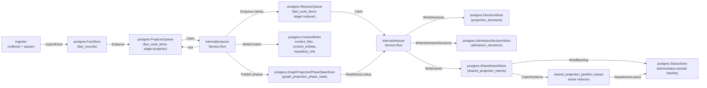
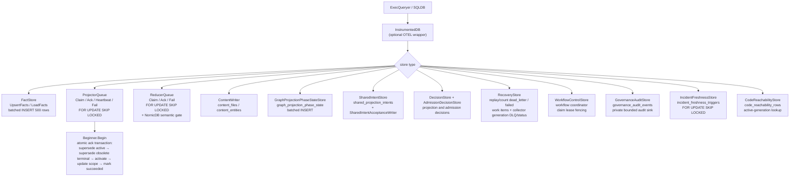

# storage/postgres

`storage/postgres` owns Eshu's relational persistence layer: facts, queue state,
content store, status, recovery data, projection and admission decisions,
webhook refresh triggers, shared projection intents, AWS scan status, and
workflow coordination tables. It is the single durable source of truth for
pipeline state that projector, reducer, ingester, collectors, and the API
surface all share.

## Where this fits in the pipeline



## Internal flow



## Lifecycle / workflow

The detailed lifecycle contract lives in
[`lifecycle-and-workflow-guide.md`](lifecycle-and-workflow-guide.md). Keep that
guide current when changing bootstrap DDL ordering, fact persistence, projector
or reducer queue behavior, workflow fencing, graph projection phase state,
webhook triggers, AWS scan status, or runtime drift evidence loading.

How retired, removed, tombstoned, and superseded evidence is kept out of
active-generation reads — the candidate-case matrix, the two retirement
mechanisms, and the index/pointer-bounded retraction shape — is documented in
[`retirement-proof-matrix.md`](retirement-proof-matrix.md) and proven by
`proof_domain_retirement_test.go` here plus `retirement_retract_proof_test.go`
in `internal/reducer`.

High-signal invariants for this package:

- Bootstrap DDL is idempotent and ordered through `BootstrapDefinitions`.
- `code_reachability_rows` stores reducer-materialized code reachable-set rows
  by active source generation, and `code_reachability_repository_watermarks`
  records the completed intent timestamp covered by each repository snapshot so
  empty reachable sets do not loop forever; query dead-code reads consult the
  rows before the compatibility scan over completed shared projection intents.
- Fact writes batch at 500 rows, deduplicate `fact_id` within a batch, sanitize
  JSONB control bytes, and skip unchanged pending-or-active generations by
  `FreshnessHint`.
- Projector claims preserve one active source-local generation per `scope_id`,
  reclaim expired leases before fresh work, coalesce stale same-scope work, and
  atomically ack by superseding stale active generation, superseding older
  terminal same-scope generations, activating the target generation, updating
  the scope pointer, and marking work succeeded.
- Reducer claims share the lease/retry contract and add domain filters plus the
  NornicDB semantic gate for `semantic_entity_materialization` while
  source-local projection is in flight. A reducer claim also supersedes
  unleased older-generation reducer rows once the same scope has a newer active
  generation, and status/drain/observer reads exclude those inactive rows from
  live readiness while preserving the durable work item for audit history.
- Workflow, AWS pagination, AWS scan-status, webhook, incident freshness, and
  hosted tenant/workspace grant stores use fencing, coalescing, or idempotent
  conflict keys so stale workers or replayed deliveries cannot overwrite newer
  durable truth.
- `GovernanceAuditStore` validates every event through
  `governanceaudit.NormalizeEvent`, derives a deterministic event id from the
  normalized safe fields, and uses `ON CONFLICT DO NOTHING` so retried writes
  are idempotent without storing raw principals, source names, prompts,
  provider responses, credential handles, private URLs, or token values.
- Tenant/workspace grant storage persists opaque tenant and workspace IDs,
  redacted display-handle hashes, scope grants, and repository grants. Active
  reads and claimed fact commits apply status, tombstone, effective-at, expiry,
  subject-class, and policy-revision predicates inside SQL before returning
  rows or writing source facts.
- Scoped API token storage is additive: it persists only opaque tenant and
  workspace IDs, token hashes, subject hashes, active bounds, expiry,
  revocation, and policy revision hashes without storing raw bearer tokens or
  changing current API, MCP, graph, collector, or workflow enforcement.
- Browser session storage is additive and hash-only: it persists session and
  CSRF digests, tenant/workspace IDs, optional scoped-token audit hashes, active
  grant bounds, expiry, revocation, the current workspace policy revision, and
  optional OIDC provider-proof metadata: provider config id, subject hash,
  validation time, and stale-after time. It does not store raw cookies, CSRF
  tokens, bearer tokens, provider tokens, raw group names, tenant names, or
  workspace names. Session resolution joins active tenants/workspaces, revokes
  stale OIDC-backed sessions before returning auth, treats upgraded OIDC rows
  with missing provider-proof timestamps as reauthentication-required, and
  re-checks the persisted policy revision against the workspace row before
  refreshing last-seen state, so provider-proof staleness, missing proof
  metadata, and policy changes invalidate dashboard sessions instead of
  extending them.
- Identity subject storage persists users, provider configs, local credential
  hashes, MFA handles, roles, grants, sessions, service principals, and token
  metadata with opaque IDs, hashes, and credential handles only. Local identity
  adds one-time bootstrap, invitation-only signup, bcrypt password proof,
  recovery-code MFA proof, lockout, resets, disablement, and time-boxed
  break-glass windows without storing raw proofs. Bootstrap uses a transaction
  advisory lock; invite acceptance and break-glass consumption serialize in SQL.
  It does not replace existing shared-token or scoped-token behavior.
- SAML SSO storage is additive to the identity schema. It persists only
  AuthnRequest digests, RelayState digests, replay digests, status, and
  timestamps. It never stores raw RelayState, SAMLResponse, assertions, NameID,
  group values, certificates, or IdP metadata XML. SAML external-subject
  resolution uses hash-only provider, subject, and group-claim inputs and
  requires active provider, user, tenant/workspace membership, admin role, and
  all-scope role grant rows before returning an all-scope session context.
- Repository ref readbacks stay bounded by the `repository_refs` primary key
  `(repo_id, ref_kind, name)` and default-ref index; writers replace only a
  fresh ref set carried by the current materialization so content-only
  generations do not erase branch metadata.
- Documentation fact readbacks stay bounded by visible finding/source/packet
  indexes plus `fact_records_documentation_target_refs_idx`, a partial JSONB GIN
  index over documentation target-reference payloads.
- Eshu search-document projection writes derived document facts and a persisted
  BM25 read index in the same reducer retry path. `eshu_search_index_documents`
  stores active-generation document payloads and lengths,
  `eshu_search_index_terms` stores term frequencies by bounded term key, and
  `eshu_search_index_stats` stores corpus size and average length so API/MCP
  search reads do not rebuild a full corpus per request. Vector metadata and
  value rows store derived embedding lifecycle state plus bounded numeric
  payloads by active generation, provider profile, source class, model, content
  hash, and index version without promoting vector similarity to graph truth.
  The pending sweeper re-enqueues scopes whose active search documents exist but
  stats are missing.
  `EshuSearchVectorPendingStore` lists active repository scopes whose curated
  search documents do not yet have ready vector metadata/value rows for the
  configured provider profile, source class, model id, and vector index
  version, allowing reducer vector builds to converge without request-time
  scans.
- Relationship evidence backfill stays bounded to latest active repository
  facts, file/content facts, and `gcp_cloud_relationship` facts. GCP
  relationship facts are included explicitly because they are provider-resource
  facts without repository file content, while the resolver still requires
  distinct catalog matches before evidence is persisted. Streaming commit-time
  evidence discovery remains repository-scope only; cloud-scope relationship
  facts enter repository generations through deferred backfill.
- Deferred relationship maintenance coordinates sharded ingesters through
  `deferred_maintenance_barriers` and
  `deferred_maintenance_barrier_arrivals`. Each shard records its local batch
  drain in the current epoch; only the shard that completes the epoch runs
  maintenance. Maintenance no longer serializes on one fleet-wide exclusive
  advisory lock, and it no longer holds every active repository's lock in one
  long transaction (issue #3482). Evidence discovery reads the whole committed
  fact corpus once (cross-repo relationships need every repository's facts), but
  the writes commit in bounded independent per-repository-batch transactions.
  Each batch transaction takes only its own repositories' exclusive advisory
  locks, namespaced under `deferred_relationship_maintenance` and acquired in
  sorted repository order to stay deadlock-free, re-reads those repositories'
  active generations under the lock, writes their evidence and readiness, and
  commits to release the locks before the next batch. Normal source generation
  commits take the matching shared lock for only their own repository partition
  (see `deferred_maintenance_lock.go`). The deployment-mapping reopen runs in its
  own transaction and the barrier-completion marker in another, so no step holds
  a fleet-wide lock. A commit therefore waits only for the in-flight batch that
  holds its repository, and a stall on one batch blocks at most that batch's
  repositories. If a shard arrives with a different shard count while an epoch is
  open, storage fails closed instead of creating competing epochs.
- `value_flow_fixpoint_components` stores reducer-owned solved value-flow
  component results by content-derived component key, so unchanged components
  can be reused across reducer restarts and replicas without re-solving.

No-Regression Evidence: scoped hot-path notes live in
[`evidence-notes.md`](evidence-notes.md), including #2059 claimed fact commit
tenant-grant fencing. No-Observability-Change: #2059 adds no new signal shape.

No-Regression Evidence: `go test ./internal/storage/postgres -run
'TestIngestionStore(CommitScopeGenerationTakesSharedMaintenanceBarrier|RunDeferredRelationshipMaintenanceTakesPerRepoExclusiveBarrier|ShardDrainBarrier)|TestBootstrapDefinitionsIncludeDeferredMaintenanceBarrier'
-count=1` covers the per-repo shared source-commit barrier and per-repo deferred
maintenance barrier, the multi-shard drain rendezvous, and bootstrap DDL.

### Deferred maintenance lock partitioning (issue #3482)

Deferred relationship maintenance commits bounded per-repository-batch
transactions keyed with two-argument transaction advisory locks
(`hashtext(namespace), hashtext(repo)`), while normal generation commits take the
matching shared lock for their repository partition. Locks are acquired in sorted
repository order, evidence/readiness writes are idempotent, open barrier epochs
are recoverable by later shard arrivals, and non-repository scopes no longer wait
on repository maintenance.

Performance/concurrency evidence: `TestWholeCorpusMaintenanceNeverHoldsFleetWideLockSet`,
`TestWholeCorpusMaintenanceDoesNotBlockUnrelatedCommit`, and
`TestDisjointRepoMaintenanceRunsConcurrently` prove peak locks stay at batch size,
unrelated commits avoid the current batch, and disjoint passes run in parallel.
Reproduce with `go test ./internal/storage/postgres -run
'TestWholeCorpusMaintenance|TestDisjointRepoMaintenanceRunsConcurrently|TestMaintenanceTakesPerRepoExclusiveLocksInOrder'
-race -count=1`. Observability stays on the existing deferred-backfill metrics and
per-repository batch logs so operators can attribute contention to one partition.

### Multi-cloud runtime drift evidence loader (issues #1997, #1998)

`PostgresMultiCloudRuntimeDriftEvidenceLoader` backs
`DomainMultiCloudRuntimeDrift` by joining observed cloud inventory, active
Terraform state, and Terraform config through one canonical `cloud_resource_uid`
keyspace. The reads are bounded by `(scope_id, generation_id)`, observed-identity
allowlists, active generation joins, and tombstone filters; Azure ARM ids are
case-folded only for `/subscriptions/` identities, while AWS/GCP identity casing
stays exact.

No-regression evidence: `TestPostgresMultiCloudRuntimeDriftEvidenceLoader` proves
provider joins, classification, empty-set short-circuiting, nil/blank rejection,
and concurrent stability; `TestPostgresMultiCloudRuntimeDriftEvidenceLoaderAzureStateCaseInsensitiveJoin`
pins the Azure-only case-fold. No new storage telemetry shape is added; reducer
spans, `postgres.query` child spans, publication counters, and redaction-aware
decode/unresolved warning logs carry the operator signal.

## Exported surface

The full exported store inventory lives in
[`exported-surface-guide.md`](exported-surface-guide.md). Keep that guide in
lockstep with public constructors, schema helpers, reducer/query adapters, and
callable store contracts.

Primary groups:

- Database adapters: `ExecQueryer`, `Transaction`, `Beginner`, `SQLDB`,
  `SQLTx`, `InstrumentedDB`.
- Fact, queue, recovery, status, workflow, and webhook stores.
- Governance audit store for validation-safe private event persistence,
  authorized bounded detailed reads, retention pruning, and aggregate-only
  status readback.
- Generation retention store for bounded superseded-generation cleanup,
  hashed retention events, changed-since expiry proof, and identity-safe
  content pruning.
- Service-scoped incident evidence loader for the incidents service-evidence
  family. It resolves PagerDuty provider service ids to catalog service ids
  through active exact/derived reducer correlation facts and fails closed for
  ambiguous repository ownership.
- Installed advisory target readers for active OS package and active attached
  SBOM component evidence used by vulnerability-intelligence planning.
- Content stores and content writers, including bounded entity-batch
  concurrency and Postgres pool-budget notes.
- Graph projection phase, shared projection intent, acceptance, freshness, and
  readiness helpers used by reducer domains.
- Hosted isolation and dashboard auth stores, including tenant/workspace
  grants, scoped API tokens, browser sessions, OIDC login state and group-role
  mappings, and dormant identity subject tables.
- Projection and admission decision stores for reducer-owned write decisions
  and scope/generation/domain-bounded correlation admission explanations.
- Fact indexes for reducer-owned package and service-catalog correlations,
  including service-catalog candidate repository IDs used by ambiguous
  repository-scoped API/MCP readbacks.
- Terraform and AWS drift adapters that keep reducer joins bounded by scope,
  generation, ARN allowlists, backend ownership, and active read-model indexes.
- `EshuSearchDocumentStore` reads curated design-430 search documents
  (`reducer_eshu_search_document`) for a scope's active generation, bounded by
  repository, source kind, and a capped page.
- `EshuSearchVectorPendingStore` reads only active repository scopes with
  unbuilt or stale vector sidecar rows for active search documents, bounded by
  scope limit and vector identity.
- `FunctionSummaryStore`, `FunctionSourceStore`, `FunctionGraphIDStore`, and
  `ValueFlowFixpointComponentStore` persist the durable value-flow inputs and
  solved component results used by the reducer's post-summary fixpoint.

## Dependencies

- `internal/facts` — `facts.Envelope`
- `internal/projector` — `projector.ScopeGenerationWork`, `projector.Result`,
  `projector.IsRetryable`
- `internal/reducer` — `reducer.Domain`, `reducer.SharedProjectionIntentRow`,
  `reducer.GraphProjectionReadinessLookup`, `reducer.AcceptedGenerationLookup`
- `internal/recovery` — recovery store interface contracts
- `internal/scope` — `scope.ScopeKind`, `scope.GenerationStatus`,
  `scope.TriggerKind`
- `internal/status` — status store interface contracts
- `internal/telemetry` — `telemetry.Instruments` for `InstrumentedDB`
- `internal/workflow` — `workflow.ClaimSelector`, `workflow.ClaimMutation`
- `database/sql` — standard library

## Telemetry

- `eshu_dp_postgres_query_duration_seconds` — histogram per SQL operation,
  labeled `operation=read|write` and `store=<StoreName>`; recorded by
  `InstrumentedDB`
- Spans: `postgres.exec` and `postgres.query` from `InstrumentedDB`; carry
  `db.system=postgresql`, `db.operation`, and `eshu.store` attributes
- `AWSPaginationCheckpointStore` records AWS checkpoint load, save, resume,
  expiry, and failure events through
  `eshu_dp_aws_pagination_checkpoint_events_total`.
- `PostgresAWSCloudRuntimeDriftEvidenceLoader` logs malformed AWS runtime
  resource rows with `resource.fingerprint`, `resource.identity_kind`, and
  `resource.type`; it does not put raw ARNs, Terraform addresses, or
  secret-shaped resource names in operator logs.

To add instrumentation to a store, wrap the `ExecQueryer` passed to its
constructor with `InstrumentedDB{Inner: db, StoreName: "my_store", ...}`.

## Operational notes

- `eshu_dp_postgres_query_duration_seconds{store="queue", operation="read"}`
  elevated means claim latency is high; check `FOR UPDATE SKIP LOCKED`
  contention and index coverage on `fact_work_items`.
- `eshu_dp_postgres_query_duration_seconds{store="facts", operation="write"}`
  elevated means fact batch writes are slow; check connection pool and batch
  size (default 500).
- Dead-letter items accumulate in `fact_work_items` when `attempt_count >=
  MaxAttempts`; use `RecoveryStore` to replay after investigating
  `failure_class`.
- `ErrProjectorClaimRejected` or `ErrReducerClaimRejected` in logs means a
  heartbeat or ack arrived after lease expiry; the original worker must stop and
  not retry the ack.
- `graph_projection_phase_state` rows gate reducer edge domains. If missing
  for a scope generation, check `GraphProjectionPhaseRepairQueueStore` depth and
  projector logs for `publish_phases` stage errors.
- `graph_endpoint_presence` (migration `024`, `GraphEndpointPresenceStore`) is
  the uid-exact, **cross-scope** endpoint-readiness primitive for the secrets/IAM
  graph projection (issue #1380). Keyed by `(keyspace, uid)`, it is written
  idempotently by the CloudResource and KubernetesWorkload node materializers
  only when the projection feature is enabled, and read via `MissingUIDs` (one
  bounded `uid = ANY(...)` query). Unlike `graph_projection_phase_state` it proves
  a *specific node* committed, which the scope/generation-keyed phase table
  cannot express across scopes.
- `secrets_iam_endpoint_not_ready` is a non-counting reducer retry class. It
  stays `retrying` with normal backoff and preserves the specific failure class,
  but single and batch claims do not increment `attempt_count` while that class
  is pending. This lets cross-scope endpoint readiness wait past
  `ESHU_REDUCER_MAX_ATTEMPTS` without terminally dropping edges.

No-regression and observability proof for this retry class lives in
[`evidence-notes.md`](evidence-notes.md#reducer-endpoint-readiness-retry-1391).

## Extension points

- New store — implement against `ExecQueryer`; wrap with `InstrumentedDB` for
  observability; add a `*SchemaSQL()` function and register in
  `BootstrapDefinitions` if the store needs a new table.
- New queue domain — extend `ReducerQueue.Claim` domain filter; add the domain
  constant in `internal/reducer`.
- New schema table — add a `Definition` to `bootstrapDefinitions` in
  `schema.go`; keep DDL idempotent; place FK-dependent tables after their
  referenced tables in the slice.

## Gotchas / invariants

Detailed query, queue, fact-readback, runtime, and fencing invariants live in
[`gotchas-and-invariants.md`](gotchas-and-invariants.md). Keep that companion
note current when changing storage behavior that touches those contracts.

Additional historical no-regression notes for incident freshness, incident
routing, workflow terminal failure, readiness gating, owned dependency targets,
and advisory targets live in [`evidence-notes.md`](evidence-notes.md).

## Related docs

- `docs/public/architecture.md` — pipeline and ownership table
- `docs/public/deployment/service-runtimes.md` — runtime lanes and Postgres config
- `docs/public/reference/telemetry/index.md` — metric and span reference
- `docs/public/reference/local-testing.md` — Postgres verification gates
- ADR: `docs/public/reference/backend-conformance.md`
- ADR: `docs/public/reference/graph-backend-operations.md`

## ServiceCatalogIDResolver evidence (#2877 / #2863)

`ServiceCatalogIDResolver` (`service_catalog_id_resolver.go`) resolves a workload
id to its durable catalog service id over `reducer_service_catalog_correlation`
facts, the bridge the service intelligence report's incident lane needs (the
incident loader keys on the catalog service id, the service story exposes the
workload id).

The resolve query is bounded by active-generation
`reducer_service_catalog_correlation` facts and the partial
`fact_records_service_catalog_correlations_workload_idx` index leading with
`payload->>'workload_id'`. It fails closed on ambiguity and is covered by focused
resolver tests plus `schema_service_catalog_test.go`. Failures are wrapped with
`%w`, while the report handler contributes the existing incident-load logs and API
request metrics.

### Bounded incident read for the report surface

`ServiceIncidentEvidenceLoader.GetIncidentEvidenceForServicesBounded`
(`serviceIncidentEvidenceBoundedQuery` = the unbounded join plus `LIMIT $2`) caps
the rows one report request loads. The reducer materialization path keeps the
unbounded `GetIncidentEvidenceForServices` because it must observe every routed
incident; only the read surface caps the load.

The report source passes `reportIncidentEvidenceRowLimit` (512), above the
surfaced incident bound but below unbounded history. The reducer path keeps the
unbounded query; the report query appends `LIMIT $2`, pinned by
`TestServiceIncidentEvidenceBoundedQueryAppliesRowLimit`. Load failures use the
existing `serviceintel.incident_load_error` log.

## Repository catalog cache on the ingestion hot path (#3481)

`commitScopeGeneration` uses a per-store `repositoryCatalogCache` instead of
reloading the whole repository fact catalog on every commit. The cache contains
repository identity and aliases, is shared safely across commit goroutines, and
invalidates when a generation introduces a new repository or changes a known
repository's slug/name. Cold loads run on the open ingestion transaction's
connection to avoid pool self-deadlock at `ESHU_POSTGRES_MAX_OPEN_CONNS=1`.

Accuracy and concurrency are pinned by
`TestIngestionStoreLoadsCatalogOnOpenTransaction`,
`TestIngestionStoreReloadsRepositoryCatalogAfterNewRepository`,
`TestIngestionStoreReloadsCatalogWhenKnownRepoAliasDrifts`,
`TestIngestionStoreSharedCatalogCacheIsConcurrencySafe`, and the proof-domain
flows. `BenchmarkIngestionStoreCatalogLoadsPerCommit` showed a 1000-repo/200-commit
harness dropping from 1.000 to 0.005 catalog loads per commit, with about 3.25x
faster runtime and lower memory/allocations. Operator proof is in
`load_repository_catalog` (`catalog_cache_hit`, `catalog_loads_total`) and
`repository_catalog_invalidated` structured logs.

## Scope-bounded relationship backfill catalog (#3500)

When a generation onboards a new repository, `commitScopeGeneration` runs
`backfillRelationshipEvidenceForNewRepositories` so pre-existing source repos
that reference the new repo gain cross-repo evidence the streaming pass (which
only sees the current batch) could not see. Before #3500 this path built the
`DiscoverEvidence` catalog matcher from the **whole fleet** catalog and then
discarded every result not targeting a new repo via `filterEvidenceByTargetRepo`,
so matcher build and per-fact match memory grew O(all repositories) on every
onboarding commit.

`repositoryScopedCatalog` now narrows the matcher input to just the repositories
the generation onboarded, the same scope-bounded model the AWS relationship
hash-join (`reducer/aws_relationship_join.go`) uses. `DiscoverEvidence` is a pure
function of `(envelopes, catalog)` and every emitted `EvidenceFact.TargetRepoID`
is a catalog entry, so matching against the new-repo-scoped catalog yields exactly
the evidence the full-catalog pass produced and then filtered. The post-filter is
removed because the scoped catalog cannot emit evidence for any other target.

Accuracy is pinned by `TestRepositoryScopedCatalogBoundsToNewRepos` (the scope is
exactly the new-repo entries regardless of fleet size) and
`TestBackfillScopedCatalogDiscoversSameEvidenceAsFullCatalog` (scoped discovery
equals the prior full-catalog-then-filter result edge-for-edge).

Benchmark Evidence: `BenchmarkBackfillDiscoveryFullCatalog` vs
`BenchmarkBackfillDiscoveryScoped` on Apple M4 Pro (`go test -bench
BenchmarkBackfillDiscovery -benchmem`, one source fact per fleet repo, fixed
two-repo onboarding delta). At a 5000-repo fleet the scoped path drops catalog
matcher memory from `5009964 B/op`/`65117 allocs/op` to `1508890 B/op`/`25072
allocs/op` (about 3.3x less memory, 2.6x fewer allocations); at 1000 repos from
`968620 B/op`/`13058 allocs/op` to `338582 B/op`/`5045 allocs/op`. The matcher
build and the discarded full-catalog evidence set no longer scale with fleet
size, so onboarding-commit correlation memory scales with the onboarding delta.
No-Observability-Change: the backfill emits no new metric, span, or log shape;
existing `relationship_backfill` commit-stage timing and the evidence-persist
rows still surface the path, now with bounded matcher cost.

### Content-scoped per-commit fact load (#3570)

The #3500 scope bound narrowed the catalog matcher but left the per-commit fact
load at O(all source facts): `backfillRelationshipEvidenceForNewRepositories`
still ran `loadLatestRelationshipFacts`, which scans every repository's
latest-generation `content`/`file`/`gcp_cloud_relationship` facts on every
onboarding commit, ships them all to Go, and iterates them all through
`DiscoverEvidence`. So onboarding-commit *time* still grew with fleet size.

`loadOnboardedRepoScopedRelationshipFacts` replaces that load on the per-commit
path. It runs `listOnboardedRepoScopedRelationshipFactRecordsQuery`, the
latest-generation sibling of the full query, with an added predicate
`lower(payload::text) LIKE ANY($1)`. The anchors come from
`backfillRelationshipAnchorTerms`: `relationships.CatalogPayloadAnchors` over the
newly onboarded repositories' catalog entries, plus the unconditional
`argoCDOverSelectAnchors`. The corpus-wide deferred path
(`BackfillAllRelationshipEvidence`) now scopes its load the same way — see
[Corpus-wide deferred fact load (#3569)](#corpus-wide-deferred-fact-load-3569).

The predicate is a **provable superset** of the facts the in-memory
`catalogMatcher` could match against the new-repo-scoped catalog. The matcher
accepts an alias only when its tokens appear as a consecutive token subsequence
of a candidate string, so every alias token a match needs is a substring of the
lowercased candidate. Content/file payloads store candidate strings verbatim
(file bodies are raw UTF-8 under `content`/`content_body`; `parsed_file_data` is
nested JSON whose `/`, `.`, and `-` survive escaping), and gcp facts store the
resource names verbatim, so every needed token is a substring of
`lower(payload::text)`. Two correctness carve-outs:

- **Private Terraform registry modules.** For a catalog alias
  `terraform-modules-<provider>` the matcher resolves via
  `privateTerraformRegistryProvider`, where only the `<provider>` path segment
  appears in the payload, never the full alias. `CatalogPayloadAnchors` therefore
  also emits the captured `<provider>` suffix as an anchor.
- **ArgoCD ApplicationSet template synthesis (two-phase load).**
  `discoverArgoCDDocumentEvidence` renders candidate repoURLs by substituting
  template parameters harvested from a *different* config repository's content and
  from `normalizePlatformToken`'d path basenames, so the matched token need not
  appear in the ArgoCD fact's own payload. ArgoCD-shaped facts are over-selected
  unconditionally via `argoCDOverSelectAnchors` (`kind: Application`,
  `kind: ApplicationSet`, `argocd_applications`, `argocd_applicationsets`,
  `"artifact_type":"argocd"`) — that is **phase one**. But an ApplicationSet's git
  file generator targets an *external* config repo, and the deploy repoURL is
  synthesized from that config file's params (e.g. `team` + `service`), so the
  newly-onboarded deploy repo's alias appears in neither the ApplicationSet
  payload nor the config file. Neither the alias anchors nor the ArgoCD markers
  select that external config file, so phase one alone would drop the deploy edge.
  **Phase two** repairs this: `ResolveArgoCDGeneratorConfigRepos` parses the loaded
  ApplicationSets' generator repoURLs, resolves the config repos against the full
  catalog, and `loadArgoCDGeneratorConfigFacts` reloads those repos' generator-path
  (`.yaml`/`.yml`/`.json`) content/file facts, which `mergeRelationshipFacts` folds
  into the scoped load so the content index `DiscoverEvidence` builds is complete.
  `backfillScopedCatalog` additionally adds the config repos' catalog entries
  because the deploy edge resolves the intermediate config repoURL against the
  catalog before the target — the same intermediate-match pattern as GCP source
  resolution. Adding a config repo cannot create a spurious edge: the deploy target
  must still be a catalog entry (a new repo), and the config repo is excluded as a
  deploy target by discovery.

Over-selection is safe; under-selection would drop correlation truth. Accuracy is
pinned by `TestCatalogPayloadAnchorsSelectsEveryExtractorFamily` (one matching
fact per extractor family, including the private-registry module and the
ApplicationSet, is selected), the central
`TestScopedFactLoadEqualsFullLoadForScopedCatalog` gate (discovery over the
anchor-scoped load equals discovery over the full corpus, edge-for-edge, on a
mixed corpus that genuinely excludes non-matching facts), and
`TestTwoPhaseScopedLoadIncludesExternalArgoCDConfig` (the two-phase load discovers
the external-config-synthesized ApplicationSet deploy edge that a single marker-only
phase drops, matching the full-corpus result edge-for-edge).

Benchmark Evidence: `BenchmarkBackfillDiscoveryFullFleet{1k,5k}` vs
`BenchmarkBackfillDiscoveryScopedFleet{1k,5k}` in
`go/internal/relationships/catalog_anchor_bench_test.go` on Apple M5 Max
(`go test ./internal/relationships -run '^$' -bench BenchmarkBackfillDiscovery
-benchmem`, one source fact per fleet repo, fixed one-repo onboarding delta).
Per-commit discovery cost for the full-load path is `7930898 ns/op`
(`784070 B/op`, `12972 allocs/op`) at a 1000-repo fleet and `38288156 ns/op`
(`3721535 B/op`, `65002 allocs/op`) at 5000 repos — linear in fleet size. The
content-scoped path is `14093 ns/op` (`3537 B/op`, `48 allocs/op`) at 1000 repos
and `13914 ns/op` (`3545 B/op`, `48 allocs/op`) at 5000 repos — flat. Per-commit
backfill time and memory now scale with the onboarding delta, not the fleet.

No-Observability-Change: the per-commit backfill emits no new metric, span, or
log shape; the existing `relationship_backfill` commit-stage timing and the
evidence-persist rows still surface the path, now reading a bounded fact set.

### Corpus-wide deferred fact load (#3569)

The #3570 scope bound covered the per-commit path, but the corpus-wide deferred
backfill (`BackfillAllRelationshipEvidence`, invoked by
`RunDeferredRelationshipMaintenance` during ingester maintenance and bootstrap
seeding) still ran `loadLatestRelationshipFacts`, which scanned **every**
repository's latest-generation `content`/`file`/`gcp_cloud_relationship` facts,
shipped them all to Go, and iterated them all through `DiscoverEvidence` on every
pass. So deferred-pass *time* stayed O(all source facts) as the fleet grew, even
though the discovered evidence is bounded by the facts that actually reference a
catalog repository.

`BackfillAllRelationshipEvidence` calls `loadDeferredAnchorScopedRelationshipFacts`
with the **full** catalog. Unlike the per-commit path (anchors over the
onboarding delta), the deferred pass treats every repository as an eligible
target. `loadLatestRelationshipFacts` and its unbounded query are removed.

#### The self-repo_id defeat (#3659) and its fix

The first #3569 implementation called `loadAnchorScopedRelationshipFacts(catalog,
catalog)`, whose anchors derive from `CatalogPayloadAnchors(fullCatalog)`. That
set includes each repo's **repo_id** token (the repo_id is `Aliases[0]`), and
every Git `content`/`file` payload carries its own `repo_id` field. So in the
deferred pass — where the anchor catalog is the WHOLE catalog — the
`lower(payload::text) LIKE ANY($1)` predicate matched every fact on its own
source metadata, and the load stayed corpus-wide. The #3655 benchmark looked
6x/11x faster only because its synthetic payloads omitted `repo_id`, so the
self-match never fired.

`repo_id` cannot simply be dropped from the anchors: a repo is also referenced by
OTHER repos through its repo_id URL/path (go.mod, manifests, ArgoCD configs), so
dropping it would break the superset guarantee and lose real cross-repo edges.

The deferred pass therefore uses a dedicated query,
`listDeferredScopedRelationshipFactRecordsQuery`, with two arms:

- `$1` — non-repo_id anchors: `CatalogPayloadAnchors` over each entry's aliases
  with the repo_id (`Aliases[0]`) stripped (`backfillNonRepoIDAnchorTerms`),
  unioned with `argoCDOverSelectAnchors`. A fact matching `$1` carries a
  cross-repo reference not keyed on its own repo_id.
- `$2` — raw lowercase full repo_id values (`relationships.CatalogRepoIDValues`),
  tested with `EXISTS (unnest($2))`, exact self-value exclusion
  (`catalog_repo_id.value <> own repo_id`), and a literal substring
  `lower(payload::text) LIKE '%' || value || '%' ESCAPE '\'` whose value has its
  LIKE metacharacters (`\ % _`) escaped inline so a repo_id containing one cannot
  become an accidental wildcard. The value stays raw in `$2` so the exact
  self-exclusion comparison is a whole-string match. A fact matches only when it
  references ANOTHER repo's repo_id verbatim; a pure self-match has no other
  repo_id value and is excluded.

A value-exclusion list (`payload->>'repo_id' != ALL(catalog_repo_ids)`) would NOT
work: every active repo's own repo_id is in the catalog, so that predicate would
exclude EVERY active repo's fact from the repo_id arm, dropping legitimate
cross-repo references and breaking truth-equivalence. A blind
`replace(payload, own_repo_id, '')` also breaks overlap cases such as
`github.com/org/app` referencing `github.com/org/app-config`, because the
target value is corrupted before matching. The self-aware `EXISTS` test compares
whole repo_id values, so overlapping targets still match. Full values (not the
longest token) are used because cross-repo references name a repo by its full
URL/path, and a shared prefix token like `github.com` would over-select the
fleet.

Truth-equivalence holds because the in-memory `catalogMatcher.match` already skips
self-matches (`entry.RepoID == sourceRepoID`), so the excluded pure-self facts
produced no evidence in the full-corpus load either.

Accuracy is pinned by `TestDeferredSelfExclusionTruthEquivalence`,
`TestDeferredSelfExclusionKeepsCrossRepoRepoIDReference`, and
`TestDeferredSelfExclusionExcludesPureSelfMatch`
(`go/internal/relationships/catalog_anchor_deferred_self_exclusion_test.go`), all
over representative fixtures whose payloads carry `repo_id`. The scope-bounding
query selection is pinned by `TestBackfillDeferredPassExcludesSelfRepoIDMatch`,
`TestBackfillAllRelationshipEvidenceUsesScopedFactQuery`, and
`TestBackfillAllRelationshipEvidenceShortCircuitsWithoutAnchors`
(`go/internal/storage/postgres/ingestion_backfill_deferred_scope_test.go`): the
deferred backfill issues the self-exclusion query (never the per-commit or
full-corpus query) and issues no fact query at all when the catalog has no usable
anchors, while still publishing backward-evidence readiness.

Performance Evidence: `BenchmarkDeferredBackfillDiscovery{Full,Scoped}Fleet{1k,5k}`
in `go/internal/relationships/catalog_anchor_bench_test.go` on Apple M-series
(`go test ./internal/relationships -run '^$' -bench BenchmarkDeferredBackfillDiscovery
-benchmem`, one edge-forming fact plus four orphan facts per fleet repo, every
payload carrying `repo_id`, whole-fleet catalog, scoped variant run through the
#3659 self-exclusion predicate). At a 1000-repo fleet deferred discovery drops
from `27748503 ns/op` (`44039593 B/op`, `399019 allocs/op`) to `6509206 ns/op`
(`5105782 B/op`, `55916 allocs/op`) — about 4.3x faster, 8.6x fewer allocs. At
5000 repos it drops from `122223287 ns/op` (`218460600 B/op`) to `31142259 ns/op`
(`25836605 B/op`) — about 3.9x faster, 8.4x fewer bytes. These are lower than the
unrepresentative #3655 numbers because the fixture now carries `repo_id`; both
variants yield the same evidence set.

No-Observability-Change: the deferred backfill emits no new metric, span, or log
shape; the existing `relationship.backfill_deferred` span, the
`DeferredBackfillDuration`/`DeferredBackfillEvidence` instruments, and the
`deferred_backfill_completed` log line still surface the path, now recording a
bounded fact load. A shrinking `DeferredBackfillDuration` against a growing fleet
is the operator-visible signal that the scope bound is in effect.

### Backfill source-file split (#3673)

`ingestion_backfill.go` had grown to 735 lines, over the repo's 500-line
per-file limit. It is split along three cohesive seams with no behavior change:

- `ingestion_backfill.go` — deferred batch/transaction maintenance machinery
  (`BackfillAllRelationshipEvidence`, `writeDeferredBackfillInBatches`,
  `writeDeferredBackfillBatch`, `RunDeferredRelationshipMaintenance`, the
  deployment-mapping reopen pair), the active-generation/work-item loaders, and
  the generation-precondition helpers.
- `ingestion_backfill_per_commit.go` — the per-commit new-repository
  relationship backfill (`backfillRelationshipEvidenceForNewRepositories`) and
  its catalog/evidence scoping helpers (`backfillScopedCatalog`,
  `repositoryScopedCatalog`, `filterEvidenceByTargetRepo`).
- `ingestion_catalog_parse.go` — repository-catalog loading and payload parsing
  (`loadRepositoryCatalog`, `catalogRepoIDs`, `repositoryCatalogEntryFromPayload`,
  `repositoryCatalogEntryFromMap`, `catalogString`, `uniqueCatalogAliases`).

Package `postgres` and every exported and unexported symbol are preserved
verbatim; only the per-file import sets are narrowed. The exported surface is
unchanged, so `doc.go`, `README.md` (other than this note), and `AGENTS.md` need
no contract edits.

No-Regression Evidence: pure mechanical move on PostgreSQL 16 (the package's
test backend). Function bodies, the `deferredMaintenanceRepoBatchSize = 32`
constant, lock-key derivation, batch sizing, and SQL queries are byte-identical
to the prior single file, so the deferred-maintenance lock partitioning,
per-batch transaction scope, idempotency, and scope-bounded discovery behavior
documented above are unchanged. Verified with `go build ./...`,
`go test ./internal/storage/postgres -count=1` (1065 tests pass, same terminal
count as before the split), and `golangci-lint run ./internal/storage/postgres/...`
(no issues). No benchmark is rerun because no instruction on any hot path
changed; the #3569/#3500/#3570 benchmarks above still describe the same code.

No-Observability-Change: the split moves code between files only. The
`relationship.backfill_deferred` and `bootstrap.reopen_deployment_mapping`
spans, the `DeferredBackfillDuration`/`DeferredBackfillEvidence`/
`DeploymentMappingReopened` instruments, and the `deferred_backfill_completed`/
`deployment_mapping_reopened`/`relationship_backfill_deferred_source_skipped`
log lines are emitted from the same statements, now relocated.

### Deferred relationship-evidence backfill long pole (#3704)

This change has three parts. The **concurrency fix** is the actual long-pole
reduction; the **CTE rewrite** and **per-batch telemetry** are supporting
cleanups. Be precise about which is which.

Long-pole diagnosis: on the de-nested 896-repo / ~3.5M-fact corpus the
`relationship_backfill` phase ran 30+ min, one core at 100%, bootstrap-index
blocked on a pgx read. The cause is **serial client-side per-fact processing**,
not the SQL plan. Live `EXPLAIN ANALYZE` on the corpus showed both the old
correlated-subquery CTE form and the new DISTINCT ON form execute in ~476 ms — the
query was never the wall-time bottleneck. The wall time was the single goroutine
that (1) streamed and scanned the fact result set, ran `DiscoverEvidence`, then
(2) wrote the discovered evidence one round-trip per row and processed the
per-repository write batches strictly one at a time.

#### Concurrency fix (the long-pole reduction)

Two serial client costs were removed:

1. **Per-row evidence INSERT → multi-row batched INSERT.**
   `RelationshipStore.UpsertEvidenceFacts` (`relationship_store.go`) issued one
   `INSERT ... ON CONFLICT (evidence_id) DO NOTHING` round-trip per evidence row.
   It now groups rows into multi-row INSERT statements of `evidenceInsertBatchRows`
   (500, matching the FactStore batch size, 500×12 = 6000 bound params, well under
   PostgreSQL's 65535 limit). The per-row `evidence_id` digest and column binding
   are unchanged, so the persisted rows are byte-identical; only the round-trip
   count drops from N to ⌈N/500⌉.

2. **Serial per-repository batches → bounded concurrent worker pool.**
   `writeDeferredBackfillInBatches` partitioned the corpus into independent
   per-repository batch transactions but processed them strictly serially. It now
   dispatches the batches across a bounded pool
   (`runDeferredBackfillBatches`), worker count from `deferredBackfillWorkerCount`
   (`ESHU_DEFERRED_BACKFILL_CONCURRENCY`, default `min(NumCPU, 4)`, hard cap 8).

Concurrency-safety argument (conflict domain = one repository's advisory-lock
partition):

- **Disjoint partitions.** The repository list is sorted, and batches are
  contiguous non-overlapping slices, so no two concurrent batches request the same
  per-repository advisory lock. Each batch also sorts its own lock keys, so neither
  intra-batch nor inter-batch acquisition can form a lock-order cycle: no deadlock.
- **Per-batch transaction scope.** Each batch runs in its own transaction and does
  everything (lock acquire, active-generation reload, evidence + readiness writes)
  on that one transaction's connection. No batch acquires a second connection while
  holding its transaction, so W concurrent batches hold exactly W connections; a
  worker count above the pool size throttles on `Begin` rather than deadlocking,
  and at `ESHU_POSTGRES_MAX_OPEN_CONNS=1` the pass self-serializes.
- **Idempotent writes.** Evidence inserts are `ON CONFLICT (evidence_id) DO
  NOTHING` and readiness upserts are generation-keyed, so a retried or partially
  failed pass converges to the same rows.
- **Bounded shared state.** The only shared mutable state during the concurrent
  phase is the readiness counter and a first-error latch, both mutex-guarded; the
  `evidenceBySourceRepo` map is built before fan-out and only read concurrently.
- **Peak lock bound.** The #3482 invariant (no fleet-wide lock set) is preserved:
  peak simultaneously-held repository locks is now `workers × batchSize` (e.g.
  4×32 = 128), still bounded and far below the fleet, never the whole corpus.

Why `DiscoverEvidence` is NOT parallelized: it builds a single global content
index across every loaded fact because cross-repo evidence (a fact in repo A
referencing repo B) needs repo B's content in the index. Partitioning that pass by
scope would drop cross-repo edges — a correctness regression on graph truth. It
stays a single in-memory pass by design; the concurrency is applied to the
independent write batches, where it is safe.

#### CTE rewrite (supporting cleanup, not the long-pole fix)

Every relationship-fact loader and the active-repository-generation lookup share
a `WITH latest_generations AS (...)` CTE that resolves each scope's active
generation. The pre-#3704 form computed the fallback (scopes without an
`active_generation_id` pointer) with a **per-scope correlated subquery**
(`SELECT generation_id ... WHERE candidate.scope_id = generation.scope_id ORDER BY
ingested_at DESC, generation_id DESC LIMIT 1`) evaluated once per GROUP BY group.
The planner could not estimate that correlated subplan's cardinality, leaving a
misestimated per-scope SubPlan in the plan. This rewrite eliminates that subplan
and restores a flat, parallelizable plan shape. It is a query-shape cleanup: live
measurement showed both forms already run sub-second, so it is not the wall-time
fix.

The CTE is now the single shared `latestGenerationCTE` constant
(`latest_generation_cte.go`), rewritten to one `DISTINCT ON (scope_id)` pass:
`ORDER BY (scope_id, ingested_at DESC, generation_id DESC)` makes the first row
per scope the newest generation, and `COALESCE(active_generation_id, that newest
id)` reproduces the original precedence exactly. `active_generation_id` is a
column of `ingestion_scopes` (one row per scope) so it is constant across a
scope's generation rows; the COALESCE yields the identical value the correlated
form selected. All seven embedding queries
(`listLatestRelationshipFactRecordsQuery`, `activeRepositoryGenerationsQuery`,
`activeScopeGenerationPartitionsQuery`,
`listOnboardedRepoScopedRelationshipFactRecordsQuery`,
`listDeferredScopedRelationshipFactRecordsQuery`, `resolveRepoActiveGenerationsQuery`,
`listArgoCDGeneratorConfigFactRecordsQuery`) reference the one constant, so they
cannot drift. `scope_generations_scope_latest_lookup_idx`
(`scope_id, ingested_at DESC, generation_id DESC`) backs the DISTINCT ON ordering
so the per-scope newest row is an index read, not a full sort; the prior
`scope_generations_scope_idx` could not serve it because `status` sits between
`scope_id` and `ingested_at`.

Accuracy (truth-equivalence): the rewritten CTE selects the byte-identical
`(scope_id, generation_id)` set the correlated form selected, so no graph truth
changes, and the batched evidence INSERT preserves the per-row `evidence_id`
identity. The active-pointer-wins, fallback-to-newest, single-generation, and
identical-`ingested_at` tie cases are pinned by
`TestLatestGenerationCTETruthEquivalenceAndPlan`
(`latest_generation_cte_integration_test.go`, gated on
`ESHU_LATEST_GENERATION_PROOF_DSN`; the tie case asserts both forms pick the
higher `generation_id`). String-shape gates that run everywhere live in
`ingestion_latest_generation_cte_test.go`
(`TestLatestGenerationCTEHasNoCorrelatedSubquery`,
`TestLatestGenerationCTEPreservesActiveGenerationPreference`,
`TestScopeGenerationsLatestLookupIndexExists`). The batched evidence write is
pinned by `TestUpsertEvidenceFactsBatchesInserts`. Concurrency safety is pinned
by `TestWriteDeferredBackfillInBatchesRunsConcurrently` (fan-out bounded by the
worker count, every batch commits), `TestConcurrentBackfillBatchesBoundPeakHeldLocks`
(peak held locks stay within `workers × batchSize`, all locks released, the
advisory-lock manager would hang on a lock-order deadlock), and
`TestWriteDeferredBackfillInBatchesSerialWhenWorkerCountOne` (worker count 1 keeps
the pass single-flight for `ESHU_POSTGRES_MAX_OPEN_CONNS=1`). All run under `-race`.

Benchmark Evidence (concurrency, the long-pole fix): `BenchmarkDeferredBackfill{Serial,Concurrent4,Concurrent8}`
in `ingestion_backfill_bench_test.go`, 256 repositories at batch size 8 (32
batches) with a 50 µs per-statement round-trip stand-in, darwin/arm64. Serial
(1 worker) `40,976,430 ns/op`; 4 workers `10,295,819 ns/op` (3.98x faster); 8
workers `5,238,341 ns/op` (7.82x faster) — near-linear in worker count, as
expected for round-trip-bound batch writes. End-to-end wall-time on the de-nested
896-repo / ~3.5M-fact corpus is measured by the operator's remote validation
stack (no local corpus of that size); the structural argument is serial → W-way
concurrent across the independent per-repository batches plus N → ⌈N/500⌉
evidence-write round-trips.

Performance Evidence (CTE plan shape, supporting cleanup): PostgreSQL 18, fixture
of 2000 scopes × 3 generations (6000 generation rows, half with an active
pointer), `ANALYZE`d, with `scope_generations_scope_latest_lookup_idx` present.
`EXPLAIN` of the legacy correlated form yields total cost `21654.36` with two
correlated `SubPlan` nodes (`Group` node cost `21594.66`). `EXPLAIN` of the
DISTINCT ON rewrite yields total cost `372.85` — a single `Unique` over one Merge
Left Join + Index Only Scan, **no SubPlan** — about a 58x planner-cost reduction
at that scale. Note: live `EXPLAIN ANALYZE` on the real corpus showed both forms
already execute in ~476 ms, so this plan-cost reduction is a query-shape cleanup,
not the wall-time long-pole fix — the concurrency change above is that fix.

Observability Evidence: the deferred backfill previously logged nothing until the
whole pass returned, hiding intra-pass progress. `runDeferredBackfillBatches`
records `eshu_dp_deferred_backfill_batch_duration_seconds` (histogram) and
`eshu_dp_deferred_backfill_batches_completed_total` (counter) per committed
per-repository batch, and emits a `deferred_backfill_batch_committed batch=N
total_batches=M repos=R readiness_rows=P duration_s=D workers=W` log line per
batch. A rising `…batches_completed_total` during a pass is the operator-visible
progress signal for the backfill long pole, and the `workers=W` attribute shows
the active concurrency; the existing `relationship.backfill_deferred` span and
`DeferredBackfillDuration`/`DeferredBackfillEvidence` instruments still record the
whole-pass totals. New instruments are registered in
`internal/telemetry/instruments.go`.

## Platform-Graph Conflict-Domain Partition (#3672)

### Conflict-Domain Map

`reducerConflictDomainKey` (`reducer_queue_conflict.go`) assigns every reducer
intent a `(conflict_domain, conflict_key)` pair that the claim SQL fences on.
Five domains shared one coarse `(platform_graph, scopeKey)` pair before this
change, so only one of the five could be in-flight per scope:

| Domain | Pre-#3672 conflict key | Post-#3672 conflict key | Partitioned or fenced |
|---|---|---|---|
| `workload_materialization` | `scopeKey` (raw) | `platform-graph:v2:sha256(platform-node-writer:scope)` | fenced (shared) |
| `deployment_mapping` | `scopeKey` (raw) | `platform-graph:v2:sha256(platform-node-writer:scope)` | fenced (shared) |
| `workload_identity` | `scopeKey` (raw) | `platform-graph:v2:sha256(domain:scope)` | partitioned |
| `deployable_unit_correlation` | `scopeKey` (raw) | `platform-graph:v2:sha256(domain:scope)` | partitioned |
| `cloud_asset_resolution` | `scopeKey` (raw) | `platform-graph:v2:sha256(domain:scope)` | partitioned |

`workload_materialization` and `deployment_mapping` share ONE key
(`platform-node-writer:<scope>`) so they still serialize. The other three each
get a per-domain key and drain concurrently with each other and with the
Platform-node-writer pair.

With the old key, one `platform_graph:scopeKey` fence serialized all five
domains for each scope. ~26k materialization intents drained in single file →
~25-min cumulative `intent_wait_seconds` (reported by `sub_duration_*`
telemetry landed in PR #3671).

### Write-Conflict Safety Evidence (source-verified)

The partition is keyed by the actual graph-write target. The table below is
confirmed against the writer source, not asserted:

| Domain | Write backend | MERGE/upsert target | MERGEs `(p:Platform {id})`? | Lock |
|---|---|---|---|---|
| `workload_materialization` | NornicDB graph | `MERGE (p:Platform {id})` (`workload_materializer.go` `batchRuntimePlatformNodeUpsertCypher`), Workload/Instance/Endpoint nodes, RUNS_ON edges | **YES** | **none** |
| `deployment_mapping` | NornicDB graph | `MERGE (p:Platform {id})` (`infrastructure_platform_materializer.go` `batchInfraPlatformUpsertCypher`), PROVISIONS_PLATFORM edges | **YES** | `PlatformGraphLocker` (pg_advisory_xact_lock per platformID) |
| `workload_identity` | Postgres `fact_records` | `INSERT ... ON CONFLICT (fact_id) DO UPDATE` keyed by intent id | no | idempotent per-intent upsert |
| `cloud_asset_resolution` | Postgres `fact_records` | `INSERT ... ON CONFLICT (fact_id) DO UPDATE` keyed by intent id | no | idempotent per-intent upsert |
| `deployable_unit_correlation` | NornicDB graph | `MERGE (Repository)-[:CORRELATES_DEPLOYABLE_UNIT]->(Repository)` (`canonical_deployable_unit_edges.go`) | no | per-repo partition, distinct edge type |

Critical hazard (#3672 review P1): `workload_materialization` and
`deployment_mapping` BOTH run `MERGE (p:Platform {id: row.platform_id})` over the
same `platform_id` namespace, and `workload_materialization` does **not** hold
the `PlatformGraphLocker` advisory lock that `deployment_mapping` uses. If the
two were claimed concurrently for the same scope, two unprotected MERGEs would
race the same Platform node → NornicDB commit-time uniqueness conflict / retry /
eventual dead-letter. They therefore MUST share one conflict key so the queue
fence keeps them serialized. `TestPlatformNodeWritersShareConflictKeyForSameScope`
is the regression guard for this invariant.

The three non-Platform-writing domains share no graph node with the Platform
writers or with each other: `workload_identity` and `cloud_asset_resolution`
upsert Postgres `fact_records` (idempotent per `fact_id`), and
`deployable_unit_correlation` MERGEs only Repository→Repository correlation
edges. They are safe to drain concurrently.

### Benchmark Evidence

darwin/arm64, Apple M5 Max, Go 1.26,
`pkg: github.com/eshu-hq/eshu/go/internal/storage/postgres`

```
BenchmarkReducerPlatformGraphConflictKey-18              38711040   157.2 ns/op   352 B/op   5 allocs/op
BenchmarkReducerPlatformGraphConflictKeyAllDomains-18    38427297   160.7 ns/op   352 B/op   5 allocs/op
```

Cost per intent at enqueue time: ~157 ns, 5 allocs (SHA-256 of the partition
token + scope string). This is negligible against any graph write (measured at
≥0.85 s in PR #3671 telemetry). No Postgres query shape changed; the claim SQL
fences on the stored `(conflict_domain, conflict_key)` columns unchanged.

No-Regression Evidence: the claim SQL fence predicate
(`inflight.conflict_domain = fact_work_items.conflict_domain AND COALESCE(...)`)
is unchanged. Only the conflict key value stored at enqueue time changes. The
existing `TestReducerClaimFencesConcurrentClaimersOnSharedConflictKey` and
`TestReducerClaimAllowsConcurrentClaimersOnDisjointConflictKeys` proofs (live
Postgres, `-race`) cover the fence contract for same-key serialization and
disjoint-key concurrency respectively; both continue to pass with the new key
shape. `TestPlatformNodeWritersShareConflictKeyForSameScope` proves the two
Platform-node writers share one key per scope so they remain serialized.

Expected drain improvement: the three non-Platform-writing domains
(`workload_identity`, `cloud_asset_resolution`, `deployable_unit_correlation`)
no longer queue behind the Platform-node writers or each other for a scope —
four concurrent lanes per scope instead of one. The two Platform-node writers
(`workload_materialization`, `deployment_mapping`) still serialize against each
other, by design, because they MERGE the same Platform node without a shared
lock. Removing the cross-domain false serialization is the primary win; the
`workload_materialization` long pole is no longer blocked by the other four
domains' queue waits. Exact speedup depends on worker count, per-domain intent
mix, and graph-write latency; full-corpus `sub_duration_*` telemetry measurement
requires the operator's remote validation environment.

### Observability Evidence

No new telemetry emitted by this change. The `sub_duration_*` log attributes
landed in PR #3671 (`sub_duration_graph_write_seconds`, `queue_wait_seconds`)
are the primary signal for validating drain improvement after this partition.
Operators should compare `queue_wait_seconds` histograms for the
`workload_materialization` domain before and after deployment.

No-Observability-Change: conflict key derivation is enqueue-time only; no
runtime spans, metrics, or log lines were added or removed.

## Identity profile read queries (#3462 Slice B)

`ListSessionsBySubject`, `ListAPITokensBySubject`, and
`GetLocalIdentityMFAStatus` are new metadata-only point reads that back the
console profile page (`GET /api/v0/auth/profile`, `/sessions`,
`/local/api-tokens`). They are not on the ingestion/reducer hot path; each is a
single dashboard-triggered read for the authenticated caller's own rows.

No-Regression Evidence: all three are net-new SELECTs that add no predicate to
any existing query and modify no existing index or write path, so there is no
prior baseline to regress. Backend PostgreSQL 16. Input shape: exactly one
`subject_id_hash` per call (never a scan over subjects). Each query filters on
the indexed `subject_id_hash`, and the two list reads are bounded `LIMIT 200`,
so the terminal row count per call is at most 200 rows (MFA returns a single
status row). The `(session_hash = $2) AS current` boolean is an equality on the
`browser_sessions` primary key, matching at most one row. No unbounded fan-out,
no cross-subject scan, no N+1.

Observability Evidence: the queries run on the `InstrumentedDB`-wrapped pool, so
per-statement latency/error spans and metrics are inherited without per-call
wiring; the handlers add `slog.ErrorContext` on the store-error (500) paths so an
operator sees a server-side signal instead of a silent empty/"none" result.

## Admin identity read queries (#3462 Slice C)

`ListAdminInvitations`, `ListAdminRoleAssignments`, `ListAdminRoles` (plus its
companion grant read), `ListAdminIdPProviders`, `ListAdminIdPGroupMappings`, and
`ListAdminAPITokens` are new metadata-only list reads that back the console admin
UX (`GET /api/v0/auth/local/invitations`, `/api/v0/auth/admin/role-assignments`,
`/roles`, `/idp-providers`, `/idp-group-mappings`, `/api-tokens`). They are not
on the ingestion/reducer hot path; each is a single admin-dashboard-triggered
read scoped strictly to the caller's own tenant (and workspace where the table
carries one), resolved from the all-scope `AuthContext`, never cross-tenant.

No-Regression Evidence: all are net-new SELECTs that add no predicate to any
existing query and modify no existing index or write path, so there is no prior
baseline to regress. Backend PostgreSQL 16. Input shape: exactly one
`tenant_id` (and `workspace_id`) per call — never a scan over tenants. Every
query filters on `tenant_id` first and is bounded `LIMIT 500`, so the terminal
row count per call is at most 500 rows. `ListAdminRoles` issues exactly two
bounded reads (roles, then grants for the same tenant) stitched in memory — a
fixed 2-query cost, not an N+1 over roles. The group-mapping row reference is an
in-SQL `md5()` digest over the composite key, computed per returned row only. No
unbounded fan-out, no cross-tenant scan.

Observability Evidence: the queries run on the `InstrumentedDB`-wrapped pool, so
per-statement latency/error spans and metrics are inherited without per-call
wiring; the handlers add `slog.ErrorContext` on the store-error (500) paths so an
operator sees a server-side signal instead of a silent empty result. No query
selects a hashed secret, invite code, credential handle, or external group hash;
the SQL-security tests in `identity_admin_reads_test.go` assert the safe-column
contract per query.

## Browser-session permission-catalog persistence (#3684)

`browser_sessions` gains three additive columns —
`permission_catalog_enforced` (bool), `allowed_permission_features` (jsonb), and
`allowed_permission_data_classes` (jsonb) — so a cookie session carries the same
permission-catalog grant snapshot a scoped token for the same roles would carry,
and the server enforces both identically. Session issuance derives the snapshot
through the shared `resolvePermissionGrantsForRoles` helper (the same
`identity_role_grants` SELECT scoped-token resolution already uses), keyed by
`(tenant_id, role_ids, as_of)`. Local login also resolves the user's active
membership roles via `resolveLocalIdentityRolesQuery` before deriving grants.
Only non-all-scope sessions are issued enforced; all-scope (admin) sessions keep
`permission_catalog_enforced=false` and stay fail-open.

No-Regression Evidence: the three columns are additive
`ADD COLUMN IF NOT EXISTS ... DEFAULT` migrations on PostgreSQL 16; existing rows
default to `enforced=false` / empty arrays, so prior sessions keep today's
fail-open behavior with no backfill. The new reads are bounded: the per-login
role and permission-grant SELECTs filter on indexed
`(tenant_id, workspace_id, user_id)` / `(tenant_id, role_id)` with active,
non-tombstoned, time-bounded predicates and a `LIMIT` (`maxOIDCGrantLimit`), and
run once per login or once per bounded OIDC refresh pass — never on the
ingestion/reducer hot path and never as a cross-subject scan. The grant SELECT is
the exact query scoped-token resolution already runs, so it adds no new query
shape or index to that path. The session resolve/switch SELECT projections and
the create INSERT add three columns to existing single-row-by-primary-key
statements, adding no predicate, join, or fan-out. Terminal row counts are
unchanged: one session row per resolve/switch/insert, and at most
`maxOIDCGrantLimit` grant rows per login.

No-Observability-Change: the new columns and per-login grant resolution add no
new metric, span, or log shape. The reads run on the existing
`InstrumentedDB`-wrapped pool, so per-statement latency/error spans and metrics
are inherited without per-call wiring; permission-denied outcomes continue to
surface through the existing `permission_catalog` enforcement envelope at the
query layer.

## Deferred backfill fact-load index + per-scope fan-out (#3710)

The deferred relationship-evidence backfill's fact-LOAD step
(`loadDeferredAnchorScopedRelationshipFacts`, now in
`ingestion_backfill_scoped_load.go`) was the dominant long pole of the pass. The
prior `listDeferredScopedRelationshipFactRecordsQuery` issued one corpus-wide scan
that evaluated the #3659 self-exclusion arm per row against the whole catalog — an
O(facts × catalog) sequential scan over every latest-generation content/file/gcp
fact. Four changes remove it:

1. A PARTIAL `pg_trgm` GIN index on `lower(payload::text)`
   (`fact_records_payload_trgm_idx`, defined once in `schema_fact_records.go` as
   `backfillPayloadTrigramIndexSQL`, mirrored verbatim in
   `schema/data-plane/postgres/003_fact_records.sql`, and ensured idempotently at
   the backfill entry point via `EnsureBackfillPayloadTrigramIndex`). The index is
   restricted to `WHERE fact_kind IN ('content', 'file', 'gcp_cloud_relationship')`
   — exactly the kinds the deferred query reads — so it does not index every other
   fact kind's payload and only those three kinds' inserts pay the GIN maintenance
   cost. The deferred query's `fact_kind IN (...)` predicate implies the partial
   index's WHERE predicate, so the planner still uses the index.
2. The candidate set is built inside a `WITH matched_facts AS MATERIALIZED (...)`
   CTE so the planner narrows on the payload-text predicate first — letting the
   `$1 LIKE ANY` constant-pattern arm drive a Bitmap Index Scan — instead of
   pushing it to a per-row Filter on the inner side of a Nested Loop. The trigram
   GIN index accelerates ONLY this `$1` arm: its patterns are constant
   `%anchor%` literals the index can probe. It does NOT accelerate the `$2`
   correlated self-exclusion arm (`lower(payload::text) LIKE '%' || value || '%'`),
   whose pattern is built per row from a catalog value and is not an indexable
   constant; that arm is bounded instead by the per-scope `(scope_id,
   generation_id)` partition, which caps it to one scope's facts.
3. The load is partitioned per `(scope_id, generation_id)` (`$3`/`$4`) and fanned
   out across the deferred-maintenance worker pool, so the monolithic scan becomes
   many partition-bounded per-scope scans that run concurrently and never contend
   (partitions are disjoint).
4. The partition SOURCE is `loadActiveScopeGenerationPartitions`
   (`SELECT scope_id, generation_id FROM latest_generations`), NOT
   `loadActiveRepositoryGenerations`. The latter filters `fact_kind = 'repository'`
   and keys `DISTINCT ON (repo_id)` over a `COALESCE(repo_id, graph_id, name)`
   value, so it covers only git scopes and collapses any two scopes whose COALESCE
   collides. Partitioning on that set would (a) drop EVERY `gcp_cloud_relationship`
   fact, because those facts live in cloud scopes (for example
   `gcp:project:…:relationship:global`) that carry no `repository` fact and so
   never appear in the repository-generation map — the gcp arm of the deferred
   query would be dead — and (b) lose one of any two scopes that collapse to the
   same derived repo_id. The scope-generation source covers EVERY scope the
   deferred query already joins to through `latest_generations`, keyed on the
   `(scope_id, generation_id)` pair, so the loaded fact set is the superset the
   single corpus scan produced. `repo_id` is not carried because nothing downstream
   labels or fans out on it — the partition query bounds each per-scope load by
   `$3`/`$4` alone.

The #3668 self-exclusion `$2` arm changed from a per-row boundary regex
(`~ '(^|[^a-z0-9._-])value($|[^a-z0-9._-])'`) to a plain substring
`lower(payload::text) LIKE '%' || value || '%'`, retaining `cat.value <>
own_repo_id`. The `$2` value's LIKE metacharacters (`\ % _`) are escaped inline
with `ESCAPE '\'` (the same convention `$1` uses), so a repo_id containing one of
those characters (or a trailing backslash) cannot become an accidental wildcard or
a malformed escape. The regex was un-indexable; the LIKE form is a provable
SUPERSET of the regex result that the in-memory `catalogMatcher`
(`relationships.DiscoverEvidence` → `catalogMatcher.match`) refines to the
identical evidence set via boundary-safe whole-token matching plus the self-match
drop (`entry.RepoID == sourceRepoID`).

Performance Evidence (PROJECTED — NOT YET MEASURED on the seeded corpus; real
`EXPLAIN ANALYZE` plus before/after wall-time numbers are pending the operator's
remote full-corpus run): query shape
`listDeferredScopedRelationshipFactRecordsQuery` (MATERIALIZED CTE + per-scope
`$3`/`$4` partition over `fact_records`), backend PostgreSQL 18, input shape a
~3.5M-fact corpus (latest-generation content/file/gcp facts across the fleet).
Before (structural): a single O(facts × catalog) sequential scan with the per-row
self-exclusion regex over the whole latest-generation fact set. After (structural):
the trgm GIN index is expected to drive a Bitmap Index Scan for the `$1` arm inside
the MATERIALIZED CTE, and each `(scope_id, generation_id)` partition scans only its
own facts via `fact_records_scope_generation_idx`, with the per-scope queries
fanned out across the deferred-maintenance worker pool. The expected one-time index
build cost is the GIN build over the three partial-index fact kinds, idempotent on
every later pass. On a fresh install it is paid at the data-plane bootstrap backfill
point; on an upgrade of an already-populated install the first build instead runs in
the deferred-maintenance path and holds a SHARE lock that blocks `fact_records`
writes for the build duration (one-time), surfaced by the
`DeferredBackfillIndexBuildDuration` metric. These
are PROJECTED plan-shape and cost expectations; the timing figures and the
MATERIALIZED-plan / Bitmap-Index-Scan claims are placeholders until the remote
`EXPLAIN ANALYZE` and corpus wall-time are captured.

No-Regression Evidence (write path, PENDING measurement): the partial trigram GIN
index adds write amplification to `content`, `file`, and `gcp_cloud_relationship`
fact inserts (the GIN maintenance on `lower(payload::text)`). The partial WHERE
predicate keeps every other fact kind off the index, so non-matching inserts are
unaffected. The ingest write no-regression for those three kinds is to be measured
on the operator's remote full-corpus run (placeholder — not yet captured locally).

Truth-equivalence (no evidence added or dropped relative to the regex/full-corpus
load) is proven by the `internal/relationships` gates
`TestDeferredLikeSupersetMatcherRefinesToBoundaryEvidence` (LIKE-superset →
matcher refinement over every #3668 case plus the substring-but-not-boundary
over-select), `TestDeferredSelfExclusionTruthEquivalence`, and
`TestDeferredSelfExclusionKeepsPrefixCollidingTargetRepoID`. The partition-source
coverage (gcp cloud-scope facts survive, two scopes collapsing to one repo_id both
load, cross-scope references survive) is proven on real Postgres by
`TestDeferredBackfillPartitionSourceCoversAllScopes`
(`ingestion_backfill_partition_integration_test.go`, gated on
`ESHU_DEFERRED_PARTITION_PROOF_DSN`), which fails against the rejected
per-repository partition source and passes against the scope-generation source.

Observability Evidence: the fan-out and the index build now emit aggregate
signals. `BackfillAllRelationshipEvidence` records
`eshu_dp_deferred_backfill_index_build_duration_seconds` (histogram) around
`EnsureBackfillPayloadTrigramIndex` and logs `deferred_backfill_index_ensured
duration_s=…`, so an operator sees the one-time first-build stall versus the
cheap idempotent re-check. The per-scope fan-out records
`eshu_dp_deferred_backfill_partitions_total` (counter, partitions per pass),
`eshu_dp_deferred_backfill_partition_workers` (histogram, worker saturation), and
`eshu_dp_deferred_backfill_partition_load_duration_seconds` (histogram, per-scope
load wall time — a long tail isolates the dominating scope), and emits a
`deferred_backfill_fact_load_completed partitions=… workers=… loaded_facts=…` log
line. New instruments are registered in `internal/telemetry/instruments.go`. The
per-scope queries still run on the existing `InstrumentedDB`-wrapped pool, so
per-statement latency/error spans and `eshu_dp_postgres_query_duration_seconds` are
inherited without per-call wiring, and the pass still records
`DeferredBackfillDuration`/`DeferredBackfillEvidence` and the
`deferred_backfill_completed` summary log.
