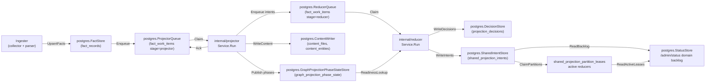
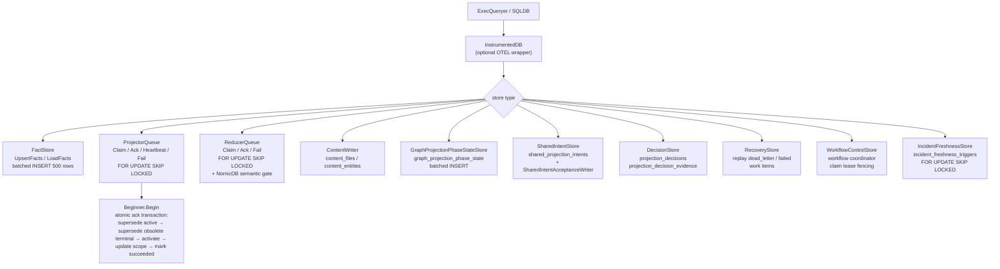

# storage/postgres

`storage/postgres` owns Eshu's relational persistence layer: facts, queue state,
content store, status, recovery data, decisions, webhook refresh triggers,
shared projection intents, AWS scan status, and workflow coordination tables.
It is the single durable source of truth for pipeline state that projector,
reducer, ingester, collectors, and the API surface all share.

## Where this fits in the pipeline



## Internal flow



## Lifecycle / workflow

The detailed lifecycle contract lives in
[`lifecycle-and-workflow-guide.md`](lifecycle-and-workflow-guide.md). Keep that
guide current when changing bootstrap DDL ordering, fact persistence, projector
or reducer queue behavior, workflow fencing, graph projection phase state,
webhook triggers, AWS scan status, or runtime drift evidence loading.

How retired, removed, tombstoned, and superseded evidence is kept out of
active-generation reads — the candidate-case matrix, the two retirement
mechanisms, and the index/pointer-bounded retraction shape — is documented in
[`retirement-proof-matrix.md`](retirement-proof-matrix.md) and proven by
`proof_domain_retirement_test.go` here plus `retirement_retract_proof_test.go`
in `internal/reducer`.

High-signal invariants for this package:

- Bootstrap DDL is idempotent and ordered through `BootstrapDefinitions`.
- Fact writes batch at 500 rows, deduplicate `fact_id` within a batch, sanitize
  JSONB control bytes, and skip unchanged pending-or-active generations by
  `FreshnessHint`.
- Projector claims preserve one active source-local generation per `scope_id`,
  reclaim expired leases before fresh work, coalesce stale same-scope work, and
  atomically ack by superseding stale active generation, superseding older
  terminal same-scope generations, activating the target generation, updating
  the scope pointer, and marking work succeeded.
- Reducer claims share the lease/retry contract and add domain filters plus the
  NornicDB semantic gate for `semantic_entity_materialization` while
  source-local projection is in flight. A reducer claim also supersedes
  unleased older-generation reducer rows once the same scope has a newer active
  generation, and status/drain/observer reads exclude those inactive rows from
  live readiness while preserving the durable work item for audit history.
- Workflow, AWS pagination, AWS scan-status, webhook, incident freshness, and
  hosted tenant/workspace grant stores use fencing, coalescing, or idempotent
  conflict keys so stale workers or replayed deliveries cannot overwrite newer
  durable truth.
- Hosted isolation storage is additive: tenant/workspace grant rows and
  scoped API token rows persist opaque IDs, redacted hashes, active bounds,
  expiry, revocation, and policy revision hashes without changing current API,
  MCP, graph, collector, or workflow enforcement.
- Documentation fact readbacks stay bounded by visible finding/source/packet
  indexes plus `fact_records_documentation_target_refs_idx`, a partial JSONB GIN
  index over documentation target-reference payloads.

Recent no-regression and observability notes that do not belong in the package
orientation flow live in [`evidence-notes.md`](evidence-notes.md).

No-Regression Evidence: `go test ./internal/storage/postgres -run 'Test(BootstrapDefinitionsIncludeTenantWorkspaceGrants|TenantWorkspaceGrantStore)' -count=1` failed before #2047, then passed after adding the tenant/workspace grant schema, idempotent upserts, active bounded reads, and privacy guardrails.

No-Observability-Change: #2047 adds no route, worker, queue domain, graph write,
metric name, metric label, runtime default, or API/MCP response field; store
calls keep using the existing Postgres query/exec spans and duration metric.

## Exported surface

The full exported store inventory lives in
[`exported-surface-guide.md`](exported-surface-guide.md). Keep that guide in
lockstep with public constructors, schema helpers, reducer/query adapters, and
callable store contracts.

Primary groups:

- Database adapters: `ExecQueryer`, `Transaction`, `Beginner`, `SQLDB`,
  `SQLTx`, `InstrumentedDB`.
- Fact, queue, recovery, status, workflow, and webhook stores.
- Installed advisory target readers for active OS package and active attached
  SBOM component evidence used by vulnerability-intelligence planning.
- Content stores and content writers, including bounded entity-batch
  concurrency and Postgres pool-budget notes.
- Graph projection phase, shared projection intent, acceptance, freshness, and
  readiness helpers used by reducer domains.
- Fact indexes for reducer-owned package and service-catalog correlations,
  including service-catalog candidate repository IDs used by ambiguous
  repository-scoped API/MCP readbacks.
- Terraform and AWS drift adapters that keep reducer joins bounded by scope,
  generation, ARN allowlists, backend ownership, and active read-model indexes.

## Dependencies

- `internal/facts` — `facts.Envelope`
- `internal/projector` — `projector.ScopeGenerationWork`, `projector.Result`,
  `projector.IsRetryable`
- `internal/reducer` — `reducer.Domain`, `reducer.SharedProjectionIntentRow`,
  `reducer.GraphProjectionReadinessLookup`, `reducer.AcceptedGenerationLookup`
- `internal/recovery` — recovery store interface contracts
- `internal/scope` — `scope.ScopeKind`, `scope.GenerationStatus`,
  `scope.TriggerKind`
- `internal/status` — status store interface contracts
- `internal/telemetry` — `telemetry.Instruments` for `InstrumentedDB`
- `internal/workflow` — `workflow.ClaimSelector`, `workflow.ClaimMutation`
- `database/sql` — standard library

## Telemetry

- `eshu_dp_postgres_query_duration_seconds` — histogram per SQL operation,
  labeled `operation=read|write` and `store=<StoreName>`; recorded by
  `InstrumentedDB`
- Spans: `postgres.exec` and `postgres.query` from `InstrumentedDB`; carry
  `db.system=postgresql`, `db.operation`, and `eshu.store` attributes
- `AWSPaginationCheckpointStore` records AWS checkpoint load, save, resume,
  expiry, and failure events through
  `eshu_dp_aws_pagination_checkpoint_events_total`.
- `PostgresAWSCloudRuntimeDriftEvidenceLoader` logs malformed AWS runtime
  resource rows with `resource.fingerprint`, `resource.identity_kind`, and
  `resource.type`; it does not put raw ARNs, Terraform addresses, or
  secret-shaped resource names in operator logs.

To add instrumentation to a store, wrap the `ExecQueryer` passed to its
constructor with `InstrumentedDB{Inner: db, StoreName: "my_store", ...}`.

## Operational notes

- `eshu_dp_postgres_query_duration_seconds{store="queue", operation="read"}`
  elevated means claim latency is high; check `FOR UPDATE SKIP LOCKED`
  contention and index coverage on `fact_work_items`.
- `eshu_dp_postgres_query_duration_seconds{store="facts", operation="write"}`
  elevated means fact batch writes are slow; check connection pool and batch
  size (default 500).
- Dead-letter items accumulate in `fact_work_items` when `attempt_count >=
  MaxAttempts`; use `RecoveryStore` to replay after investigating
  `failure_class`.
- `ErrProjectorClaimRejected` or `ErrReducerClaimRejected` in logs means a
  heartbeat or ack arrived after lease expiry; the original worker must stop and
  not retry the ack.
- `graph_projection_phase_state` rows gate reducer edge domains. If missing
  for a scope generation, check `GraphProjectionPhaseRepairQueueStore` depth and
  projector logs for `publish_phases` stage errors.
- `graph_endpoint_presence` (migration `024`, `GraphEndpointPresenceStore`) is
  the uid-exact, **cross-scope** endpoint-readiness primitive for the secrets/IAM
  graph projection (issue #1380). Keyed by `(keyspace, uid)`, it is written
  idempotently by the CloudResource and KubernetesWorkload node materializers
  only when the projection feature is enabled, and read via `MissingUIDs` (one
  bounded `uid = ANY(...)` query). Unlike `graph_projection_phase_state` it proves
  a *specific node* committed, which the scope/generation-keyed phase table
  cannot express across scopes.
- `secrets_iam_endpoint_not_ready` is a non-counting reducer retry class. It
  stays `retrying` with normal backoff and preserves the specific failure class,
  but single and batch claims do not increment `attempt_count` while that class
  is pending. This lets cross-scope endpoint readiness wait past
  `ESHU_REDUCER_MAX_ATTEMPTS` without terminally dropping edges.

No-Regression Evidence:

```bash
go test ./internal/storage/postgres -run 'TestReducerQueueFailDefersSecretsIAMEndpointReadinessPastAttemptBudget|TestReducerQueueClaimDoesNotCountSecretsIAMEndpointReadinessDefers|TestClaimBatchDoesNotCountSecretsIAMEndpointReadinessDefers' -count=1
```

This gate failed before #1391 because over-budget
`secrets_iam_endpoint_not_ready` dead-lettered and both claim paths consumed
`attempt_count`; it passed after the class became a deferred retry and both
claim SQL shapes preserved the attempt budget.

Observability Evidence: the change adds no metric or status field. Existing
queue status, latest-failure, queue-blockage, and
`eshu_dp_postgres_query_duration_seconds{store="queue"}` signals keep exposing
retrying/dead-letter counts, `visible_at` backoff, claim latency, and the
specific `failure_class=secrets_iam_endpoint_not_ready` needed to diagnose
blocked cross-scope endpoint readiness.

## Extension points

- New store — implement against `ExecQueryer`; wrap with `InstrumentedDB` for
  observability; add a `*SchemaSQL()` function and register in
  `BootstrapDefinitions` if the store needs a new table.
- New queue domain — extend `ReducerQueue.Claim` domain filter; add the domain
  constant in `internal/reducer`.
- New schema table — add a `Definition` to `bootstrapDefinitions` in
  `schema.go`; keep DDL idempotent; place FK-dependent tables after their
  referenced tables in the slice.

## Gotchas / invariants

- `ProjectorQueue.Ack` runs five SQL statements inside a transaction. Pass a
  `SQLDB` or an `InstrumentedDB` wrapping
  a `SQLDB`; a plain `ExecQueryer` without `Beginner` will cause Ack to fail.
- `upsertFacts` deduplicates by `fact_id` before batching (`facts.go:206`).
  Skipping deduplication causes `SQLSTATE 21000` on `ON CONFLICT DO UPDATE`
  when the same `fact_id` appears twice in one batch.
- `ListFactsByKind` keeps a stable `(observed_at, fact_id)` keyset cursor
  (`facts_filtered.go:71`). Lowering the page size below the write batch size
  can make reducer-only reads spend most of their time in Postgres round trips
  rather than extraction or graph writes.
- `ListFactsByKindAndPayloadValue` is only for top-level JSON payload fields
  that are part of a reducer domain's truth contract. Do not use it to paper
  over missing parser metadata or to guess at nested payload shape.
- Shared projection intents are idempotent by `intent_id`. Writers should
  upsert the same row on retry rather than minting a new ID. The 2000-row
  upsert batch keeps each statement below Postgres' parameter limit while
  avoiding small-batch round trips on code-call-heavy repositories.
- Current source-run history is distinct from prior acceptance-unit history.
  `HasCompletedAcceptanceUnitDomainIntents` intentionally ignores
  `source_run_id` so new accepted runs can detect prior graph state;
  `HasCompletedAcceptanceUnitSourceRunDomainIntents` includes `source_run_id`
  so chunked code-call projection can skip only same-run retractions.
- `ListOwnedPackageDependencyTargets` serves workflow-coordinator derivation.
  Package-registry callers use package-level identities so repeated versions of
  one package cannot starve later packages. Vulnerability-intelligence callers
  use package-version identities and retain dependency `source_location` so
  Swift OSV planning can send the source Git URL required by OSV `SwiftURL`.
  The rotation offset lets bounded full-corpus runs advance past the first
  sorted page without changing worker counts or query scope.
- `ListOSPackageAdvisoryTargets` and `ListSBOMComponentAdvisoryTargets` serve
  vulnerability-intelligence installed-evidence derivation. OS package reads
  stay on active `vulnerability.os_package` facts joined to the active
  generation and filtered by vendor advisory source/distro ecosystem. SBOM
  component reads stay on active `sbom.component` facts that have active
  same-scope attached `reducer_sbom_attestation_attachment` evidence and filter
  by PURL ecosystem before applying the bounded rotated limit. SBOM rows derive
  exact package identity from the PURL; component payload versions that
  conflict with the PURL version are dropped before planning. The readers return
  exact source facts only; the coordinator owns admission and partial-evidence
  skip reasons.
- `ListActivePackageManifestDependencyFacts` serves both package-source
  correlation and supply-chain impact. The query stays indexed on active Git
  dependency entities by `(package_manager, entity_name)`, so vulnerability
  impact can load repository lockfile evidence for one advisory package without
  waiting for package-registry enrichment to finish.
- `ListActiveJVMReachabilityFacts` serves JVM vulnerability reachability
  enrichment after Maven or Gradle dependency evidence has already proven a
  canonical repository and resolver-backed API package prefix. The query is
  bounded by repository IDs, the JVM file partial index, and the resolver API
  package list across parser imports, parser calls, and SCIP calls; reducers
  still perform the API-prefix match and keep missing source-set, resolver,
  reflection, dependency-injection, and generated-code evidence visible.
  No-Regression Evidence: `go test ./internal/storage/postgres -run
  'TestListActiveJVMReachabilityFacts' -count=1` failed before the SQL passed
  the API package list into the active-file query, then passed with the
  repository/API/language bound and a matching Java parser-import row. `go test
  ./internal/reducer -run
  'TestSupplyChainImpactHandlerLoadsActiveJVMReachabilityFacts|TestBuildSupplyChainImpactFindingsMarksJVMReachableFrom(ParserImport|SCIPEvidence)|TestBuildSupplyChainImpactFindingsKeepsJVMGapsUnknownWithoutAPIIdentity|TestBuildSupplyChainImpactFindingsNeverMarksJVMNotCalledWithoutAnalyzer'
  -count=1` proves the reducer still sends the repository/API filter and keeps
  parser and SCIP evidence accurate. No-Observability-Change: the read path
  still uses the existing instrumented Postgres query span and
  `eshu_dp_postgres_query_duration_seconds` metric from the reducer's
  Postgres adapter, plus reducer execution spans/counters and the persisted
  supply-chain impact reachability/missing-evidence payloads; no route, queue,
  graph write, worker, runtime knob, metric name, or metric label changed.
- `ListActiveSupplyChainImpactFacts` includes provider security alerts in the
  same package/repository-bounded read used for vulnerability, package, SBOM,
  image, OCI registry, and service evidence. The selector includes raw OCI
  manifest, index, tag-observation, and referrer facts only behind package,
  digest, repository, or image-reference predicates, so reducers can recover
  image/SBOM anchors without scanning the whole registry fact set. This lets
  alert-seeded impact admission reuse active owned dependency evidence without
  scanning all repository alerts.
  Reducer reconciliation keeps provider-scoped repository IDs separate from
  canonical `repository_id` values, so Postgres fact payloads should preserve
  both when the source uses a provider-owned repository namespace.
- `ListActiveSBOMAttestationAttachmentFacts` keeps attachment repair bounded by
  subject digest, document id/digest, statement id/digest, payload digest, and
  referrer digest. It may read active SBOM document/component and attestation
  evidence plus OCI referrer facts, but it must not infer an attachment unless
  reducer-owned subject evidence can prove the join.
- Supply-chain impact parser-file follow-up is separate from normal repository
  follow-up. Repository IDs still load bounded context facts such as workload,
  service, image, CI/CD, and suppression evidence, but active `file` facts only
  load through the JS/TS parser-file repository filter and the SQL language
  predicate for JavaScript, JSX, TypeScript, and TSX. Non-JS/npm findings must
  not use broad repository IDs to pull every active file fact for a repository.
  No-Regression Evidence: `go test ./internal/reducer -run
  'TestSupplyChainImpactHandlerRequestsParserFilesOnlyForNPMReachability|TestBuildSupplyChainImpactFindingsUsesJSTSPackageAPIReachability|TestBuildSupplyChainImpactFindingsKeepsJSTSMissingAndAmbiguousEvidenceExplicit'
  -count=1` and `go test ./internal/storage/postgres -run
  'TestListActiveSupplyChainImpactFactsQuerySeparatesParserFileFollowUp|TestListActiveSupplyChainImpactFactsQueryBoundsRepositoryFollowUp'
  -count=1` prove non-JS/npm repository follow-up excludes parser files while
  npm JS/TS reachability still requests JS/TS file evidence.
  No-Observability-Change: the change only narrows the existing
  `FactStore.ListActiveSupplyChainImpactFacts` SQL predicate and reducer filter
  keys; operators continue to diagnose the path through
  `eshu_dp_postgres_query_duration_seconds`, reducer run spans/counters, and
  durable supply-chain impact finding payloads.
- Advisory evidence reads stay bounded by first-class advisory identity fields,
  package IDs, or PURLs before active-generation validation. Performance
  Evidence: issue #868 changed the read path from a broad active vulnerability
  CTE to selector-first identity branches backed by
  `fact_records_vulnerability_active_*_lookup_v2_idx`; representative
  preserved-volume proof returned `CVE-2021-44228` in 0.691s cold and
  0.435s/0.439s warm, while `EXPLAIN ANALYZE` completed the present-CVE SQL in
  472.419ms using those indexes. No-Observability-Change: the API route still
  emits `query.advisory_evidence`, Postgres query duration metrics, truth
  envelope metadata, status/error bodies, `count`, `limit`, `truncated`, and
  `next_cursor`; no graph query, queue, reducer lane, worker, runtime knob, or
  metric label changed.
- The NornicDB semantic gate in `ReducerQueue.Claim` is gated on a boolean
  parameter and must not be removed without an ADR; it prevents
  `semantic_entity_materialization` storms on NornicDB label indexes.
- `PackageRegistryIdentityLocker` uses transaction-scoped
  `pg_advisory_xact_lock` keys to coordinate package UID canonical writes
  across ingester, standalone projector, and bootstrap-index processes. It
  de-duplicates and sorts package IDs before acquiring locks, commits after the
  protected canonical write succeeds, and rolls back on callback failure so
  Postgres releases the lock automatically. No-Regression Evidence: `go test
  ./internal/storage/postgres -run 'TestPackageRegistryIdentityLocker' -count=1`
  proves sorted/de-duplicated lock acquisition and rollback-on-error behavior.
  Observability Evidence: waits over 100ms emit a structured
  `package registry identity advisory locks acquired` log with
  `package_uid_count`, `lock_key_sample`, and `wait_s`; existing Postgres
  transaction failures still surface as wrapped callback or commit errors.
- `aws_relationship_materialization`, `observability_coverage_materialization`,
  `iam_can_assume_materialization`, `s3_logs_to_materialization`,
  `s3_external_principal_grant_materialization`,
  `rds_posture_materialization`, `iam_instance_profile_role_materialization`,
  and `s3_internet_exposure_materialization` claims wait on the exact
  `cloud_resource_uid` / `canonical_nodes_committed` readiness row for the
  same scope, generation, and `entity_key`. This keeps relationship work
  and CloudResource node-property work pending or retrying until
  `aws_resource_materialization` has made `CloudResource` nodes visible, while
  allowing the resource materialization row in the same conflict key to claim
  and publish the phase.
- `WorkflowControlStore` claim mutations use `ErrWorkflowClaimRejected` for
  fenced writes; callers must stop processing when this error is returned.
- `WorkflowControlStore.FailClaimTerminal` uses a dense seven-argument SQL
  mutation because terminal failures do not requeue and therefore do not need a
  `visible_at` placeholder. Do not leave skipped parameter numbers in workflow
  claim SQL; Postgres must infer every prepared-statement parameter type before
  it can persist the terminal failure.
- `AWSScanStatusStore` mutations must keep their fencing guards. A stale AWS
  worker must not overwrite per-tuple scanner or commit state from a newer
  claim. ObserveAWSScan and CommitAWSScan stay pinned to the exact
  `(generation_id, fencing_token)` so stale collectors cannot clobber a newer
  owner. StartAWSScan accepts a cross-generation overwrite when the prior
  row is terminal OR the new `last_started_at` is strictly newer than the
  stored value (or the row has none), which lets a fresh workflow generation
  reclaim the per-target slot after an orphaned `running`/`pending` row was
  left by a collector that died mid-flight. Without this widening one
  orphaned row blocks every future generation and the workflow runtime spins
  stale-fence retries — see issue #612.
- `AWSScanStatusStore` returns `awscloud.ErrScanStatusStaleFence` when a
  mutation affects zero rows; callers wrap and route the failed claim to
  terminal (the AWS claimed runtime does this via
  `awsruntime.FailureClassStaleFence`) instead of looping it on the
  retryable queue.
- `AWSScanStatusStore.CommitAWSScan` clears previous commit failure class and
  message when a retry finally commits a scan whose scanner-side status is
  `succeeded`. Scanner-side failed, partial, budget-exhausted, and credential
  failures remain in the row so status readback can still explain active
  degraded scopes.
- `WebhookTriggerStore` treats webhook payloads as trigger evidence only. It
  preserves merged pull-request number, URL, and title provenance for bounded
  read-model enrichment, but the Git collector must still fetch the repository
  before freshness becomes true.
- `AWSFreshnessStore` treats AWS Config and EventBridge events as trigger
  evidence only. The AWS collector must still scan the affected service tuple
  before cloud inventory becomes fresh.
- `IncidentFreshnessStore` treats PagerDuty and Jira webhooks as source-scoped
  trigger evidence only. It coalesces repeated delivery events by
  `freshness_key`, claims queued triggers with `FOR UPDATE SKIP LOCKED`, and
  records handed-off or failed rows after the workflow coordinator authorizes a
  configured collector `scope_id`.
- `FactStore.LoadIncidentRoutingEvidence` builds reducer-ready PagerDuty
  incident-routing packets for the graph materialization domain. It loads
  `incident.record` anchors and same-generation `incident_routing.*` facts for
  the claimed scope/generation, skips tombstones, filters applied evidence to
  PagerDuty service resources, and then reads Terraform-source
  `PagerDutyDeclaration` content rows through a lowercased service-name
  allowlist. Routing facts without an incident anchor do not trigger a
  cross-scope graph mutation.
- Schema definitions in `bootstrapDefinitions` are applied in slice order.
  Tables with foreign key constraints on other tables must appear after their
  dependencies.

No-Regression Evidence: incident freshness store coverage includes
`go test ./internal/storage/postgres -run 'TestIncidentFreshness|TestBootstrapSQLFilesMirrorDefinitions' -count=1`.
The queue keeps at-least-once webhook delivery coalesced by source freshness
key, preserves claimed rows during duplicate upserts, and uses
`FOR UPDATE SKIP LOCKED` for concurrent coordinator handoff without changing
fact emission, reducer lanes, worker counts, or graph writes.

Observability Evidence: incident freshness storage is wrapped by
`InstrumentedDB` as `store="incident_freshness_triggers"` in the webhook
listener and workflow coordinator. Existing Postgres query-duration metrics and
spans expose read/write latency without adding delivery IDs, issue keys,
incident IDs, URLs, or provider payload fields to metric labels.

No-Regression Evidence: incident-routing evidence loading is covered by
`go test ./internal/storage/postgres -run 'IncidentRoutingEvidence' -count=1`.
The read path stays bounded to one scope/generation fact query plus one
service-name allowlisted `content_entities` query and adds no table, schema
migration, queue behavior, worker count, or graph query.

No-Regression Evidence: workflow terminal failure mutation coverage includes
`go test ./internal/storage/postgres -run TestWorkflowControlStoreFailClaimTerminalUsesDensePostgresParameters -count=1`
and a remote Postgres integration run of
`TestWorkflowControlStoreIntegrationFailClaimTerminalRecordsFailureWithoutParameterHole`.
The change preserves claim fencing, retryable requeue `visible_at`, claim
ordering, worker counts, and workflow status semantics.

No-Observability-Change: existing `workflow_work_items.last_failure_class`,
`workflow_claims.failure_class`, fenced mutation errors, collector logs, and
`/api/v0/index-status` continue to expose terminal workflow failures and active
claim counts; no new telemetry dimension was required.

No-Regression Evidence: AWS relationship readiness gating is covered by
`go test ./internal/storage/postgres -run 'TestReducerQueueClaim(GatesAWSRelationshipsOnCanonicalCloudResourceReadiness|WaitsForAWSRelationshipReadinessBehavior|WaitsForRetryingAWSRelationshipReadinessBehavior|AWSRelationshipAlreadyReadyBehavior)|TestClaimBatchGatesAWSRelationshipsOnCanonicalCloudResourceReadiness|TestReducerQueueBlockagesReportAWSRelationshipReadinessWait' -count=1`.
The same CloudResource readiness gate now also covers RDS posture property
updates; `go test ./internal/storage/postgres -run RDSPosture -count=1` proves
`rds_posture_materialization` waits for the same phase. S3 internet-exposure
readiness is covered by
`go test ./internal/storage/postgres -run 'S3InternetExposure' -count=1`.
EC2 internet-exposure readiness is covered by
`go test ./internal/storage/postgres -run EC2InternetExposure -count=1` and
uses the same `cloud_resource_uid` gate keyed to
`ec2_instance_node_materialization:<scope>`.
The claim path keeps pending and retrying CloudResource-consuming reducer rows
unclaimed until the matching `cloud_resource_uid` /
`canonical_nodes_committed` phase exists, then makes the same row claimable
without changing worker counts, retry delays, or conflict-key fencing.

Observability Evidence: `/admin/status` queue blockages now include
`conflict_domain=readiness` and a conflict key prefixed with
`cloud_resource_uid:canonical_nodes_committed:` for reducer work that is
waiting on canonical `CloudResource` nodes. Existing queue gauges and domain
backlog rows continue to expose pending, retrying, in-flight, and oldest-age
counts without adding a high-cardinality metric label.

No-Regression Evidence: owned dependency target selection is covered by
`go test ./internal/storage/postgres -run 'TestListOwnedPackageDependencyTargetsQuery|TestOwnedPackageDependencyTargetLimit' -count=1`.
The query remains scoped to active Git dependency facts, adds package-level
selection for package-registry derivation, keeps package-version selection for
vulnerability derivation, and rotates bounded reads by caller-provided offset.

No-Observability-Change: existing Postgres query-duration telemetry,
workflow-run `requested_scope_set`, workflow work-item status rows, collector
claim status, and `/api/v0/index-status` expose whether derived targets were
planned, repeated, completed, retried, or failed. The target reader adds no new
metric labels and does not include package names or versions in telemetry
labels.

No-Regression Evidence: `go test ./internal/storage/postgres -run 'List.*AdvisoryTargets' -count=1` proves installed advisory target SQL stays active-generation scoped, bounded, ecosystem-filtered, and attached to SBOM subject evidence before the coordinator admits exact OSV targets.

No-Observability-Change: installed advisory target readers use the existing
`InstrumentedDB` query spans and `eshu_dp_postgres_query_duration_seconds`
histogram. Store labels stay bounded to the configured store name and operation;
package names, versions, PURLs, document IDs, subject digests, and advisory
payloads are not metric labels.

## Related docs

- `docs/public/architecture.md` — pipeline and ownership table
- `docs/public/deployment/service-runtimes.md` — runtime lanes and Postgres config
- `docs/public/reference/telemetry/index.md` — metric and span reference
- `docs/public/reference/local-testing.md` — Postgres verification gates
- ADR: `docs/public/reference/backend-conformance.md`
- ADR: `docs/public/reference/graph-backend-operations.md`
