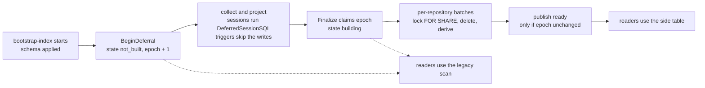

# lines

## Purpose

`lines` owns the bulk-load lifecycle of `content_file_secret_lines`, the
Postgres side table that holds one row per hardcoded-secret finding line
(#7125). Migration 131 derives those rows inside Postgres with statement-level
triggers on `content_files`. This package lets a bulk load (bootstrap-index)
skip that derivation and rebuild the table once at the end.

## Why it exists

The trigger adds about 0.6 ms of Postgres time per new file on an idle 16 vCPU
host (measured on 12,000 real files), 58 percent of the `upsert_files`
statement on a bootstrap-shaped load. The bootstrap stage budget cannot absorb
that. The bootstrap path already treats the content substring indexes the same
way (deferred, then built by a finalizer behind `content_substring_index_state`),
so the side table follows the same shape.

## Lifecycle

## Exported surface

- `DeferredSessionSQL`, `SessionSetting` - the per-session setting migration
  130's triggers test in their `WHEN` clause
- `BeginDeferral` - opens an epoch and takes readiness away before the first
  deferred write
- `Finalize`, `Options`, `Result`, `Database` - the repository-partitioned,
  restart-safe rebuild that publishes ready
- `AcquireBulkLoadLock`, `BulkLoadLock`, `LockOptions`, `Conner`,
  `BulkLoadLockClass`, `BulkLoadLockID` - the run-scoped exclusivity of one
  deferred bulk load (session advisory lock `(5318,1)`)
- `Ready`, `RowQueryer` - the readers' gate
- `StateNotBuilt`, `StateBuilding`, `StateReady`, `StateFailed` - the bounded
  states of `content_file_secret_lines_state`

## Operations

- Inserts, content or language changes, and key moves re-derive a file's
  findings in the statement-level triggers. Deletes, including retention
  prune, cascade through the foreign key. Go code must not write the side
  table; `TRUNCATE content_files` must name it or use `CASCADE`.
- The detection pattern, classification CASE, and `suppressed` expression are
  bound to `internal/query`'s Go definitions by tests. Change them only with
  a new migration that re-derives the table. Only bootstrap-index may run
  `DeferredSessionSQL`; never disable the triggers with `ALTER TABLE`.

- Check readiness:
  `SELECT state, epoch, build_started_at, build_completed_at, failure_class FROM content_file_secret_lines_state;`
- `state = 'ready'` is the only state readers serve from the side table.
  `not_built`, `building`, and `failed` all send reads to the legacy scan; the
  investigation response then carries `coverage.read_path = "legacy_scan"` and a
  limitation, the span attribute `eshu.hardcoded_secret.read_source`, and the
  counter `eshu_dp_hardcoded_secret_reads_total{source="legacy_scan"}`.
- Finalizer signals: log events `secret_lines.finalize_started`,
  `secret_lines.finalize_progress` (every 10 s), `secret_lines.finalize_complete`
  and `secret_lines.finalize_failed`; the run lock's
  `secret_lines.bulk_load_lock_acquired`, `_refused`, `_released` and
  `_release_failed`, and `bootstrap.postgres.ownership.waiting` with
  `lock=bulk_load` while a second run waits; counters
  `eshu_dp_secret_lines_backfill_batches_total{outcome}` and
  `eshu_dp_secret_lines_backfill_files_total`; the phase histogram
  `eshu_dp_bootstrap_pipeline_phase_seconds{bootstrap_phase="secret_lines_finalization"}`.
- A `failed` state is repaired by rerunning `bootstrap-index` (it begins a new
  epoch and finalizes) or by calling `Finalize` for the current epoch; both are
  idempotent.
- One `bootstrap-index` at a time, enforced. `AcquireBulkLoadLock` takes the
  session advisory lock `(5318,1)` on a pinned connection from before
  `BeginDeferral` until after `Finalize`; a second run waits up to
  `ESHU_SCHEMA_BOOTSTRAP_OWNERSHIP_WAIT` (default 3 m), then fails naming the
  holder's pid, application name and connection age. The schema-bootstrap
  ownership wait that follows uses the same bound, so the worst case before
  work starts is twice the value. The epoch fence covers the
  remaining ordering: a finalizer that outlives its epoch after a crash and a
  rerun cannot publish over the newer load. Without the lock, two overlapping
  loads could publish `ready` over rows the second was still writing without
  derivation.
- The lock dies with its backend, so a killed pod releases it at once. After a
  node death without a TCP close it lingers until keepalive fires. Find the
  holder with
  `SELECT l.pid, a.application_name, a.backend_start FROM pg_locks l JOIN pg_stat_activity a USING (pid) WHERE l.locktype='advisory' AND l.classid=5318 AND l.objid=1 AND l.granted;`
  and clear an orphan with `SELECT pg_terminate_backend(<pid>)`.
- `bootstrap-index` must not run through a transaction-mode connection pooler.
  Such a pooler does not reset session settings between clients, so
  `DeferredSessionSQL` can stay on a server connection later handed to another
  binary, whose writes then skip derivation while the state is `ready`. A pooler
  that merely drops the setting only makes that session derive, slower but
  correct.
- A live writer blocked on a row a batch holds waits until that batch commits
  (lock, delete, and derive of up to 500 files: hundreds of milliseconds,
  tunable by `BatchSize`). `LockTimeout` bounds only the finalizer's own waits,
  which is what makes the finalizer, not a writer, yield.

## Related

- `go/internal/storage/postgres/migrations/131_content_file_secret_lines.sql`
- `go/internal/query/content_reader_security_secrets.go` (the gated read)
- `go/cmd/bootstrap-index/bootstrap_finalize.go` (the caller)
- `docs/internal/evidence/7125-secret-lines-side-table.md`
