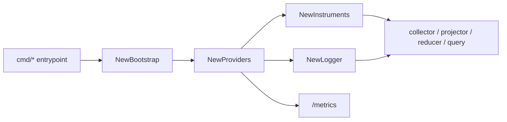

# Telemetry

## Purpose

`telemetry` owns Eshu's frozen Go data-plane observability contract: metric
instruments, metric dimensions, span names, structured log keys, phase values,
OTEL provider setup, Prometheus export, and trace-aware `slog` logging.

This package is a leaf package. It must not import other `go/internal/*`
packages.

## Ownership Boundary

This package owns the names and helper APIs runtime packages use to emit
signals. It does not decide when a collector, reducer, query handler, or storage
adapter should emit a signal; the owning runtime package makes that decision and
uses this package's frozen contract.

Keep full catalogs in public telemetry docs and in Go registries. This README
is the maintainer map, not a second metric/span/log inventory.

## Core Flow

Long-running runtimes create providers once, create `Instruments` once, wire
observable gauges after observers exist, and pass instruments, tracers, and
loggers down instead of recreating them in leaf packages.

## Exported Surface

See `doc.go` and `go doc ./internal/telemetry` for the full contract. The
important groups are:

- bootstrap/provider APIs: `Bootstrap`, `NewBootstrap`, `Providers`,
  `NewProviders`
- instruments and gauges: `Instruments`, `NewInstruments`,
  `RegisterObservableGauges`, `RegisterAcceptanceObservableGauges`,
  `RegisterAWSClaimConcurrencyGauge`, `RecordGOMEMLIMIT`
- frozen registries: `MetricDimensionKeys`, `SpanNames`, `LogKeys`
- attribute and log helpers: `Attr*`, `ScopeAttrs`, `DomainAttrs`,
  `AcceptanceAttrs`, `PhaseAttr`, `FailureClassAttr`, `EventAttr`
- logging: `NewLogger`, `NewLoggerWithWriter`, `TraceHandler`

## Dependencies

`telemetry` depends on the Go standard library and OpenTelemetry packages. It
must stay independent of Eshu internal runtime, storage, facts, reducer, and
query packages.

## Telemetry

The package registers the data-plane metrics with the `eshu_dp_` prefix, creates
the Prometheus exporter used by runtime `/metrics` handlers, and defines frozen
span/log/dimension names. It is both the implementation and the contract for Go
data-plane telemetry.

## Gotchas / Invariants

- Every metric registered here must use the `eshu_dp_` prefix.
- Add metric dimensions, span names, and log keys to the registry before callers
  use them.
- Use `Attr*` helpers and frozen `LogKey*`/`Span*` constants; do not inline names
  in callers.
- Keep metric labels bounded. High-cardinality values belong in spans or logs.
- `NewProviders` always creates a Prometheus exporter. OTLP export is enabled
  only when `OTEL_EXPORTER_OTLP_ENDPOINT` is set.
- The Prometheus exporter uses a dedicated registry and exposes only
  `service.name` and `service.namespace` as resource constant labels.
- Observable gauges are registered once per process after their observers are
  available.

## Focused Tests

- `go test ./internal/telemetry -run TestMetricDimensionKeys -count=1`
- `go test ./internal/telemetry -run TestSpanNames -count=1`
- `go test ./internal/telemetry -run TestLogKeys -count=1`
- `go test ./internal/telemetry -run TestNewInstruments -count=1`
- `go test ./internal/telemetry -run TestPrometheusExposesServiceLabelsOnMetrics -count=1`

## Related Docs

- `docs/public/reference/telemetry/index.md`
- `docs/public/reference/telemetry/metrics.md`
- `docs/public/reference/telemetry/metrics-ingestion-collectors.md`
- `docs/public/reference/telemetry/metrics-reducer-storage.md`
- `docs/public/reference/telemetry/traces.md`
- `docs/public/reference/telemetry/logs.md`
- `docs/public/reference/telemetry/cross-service-correlation.md`
