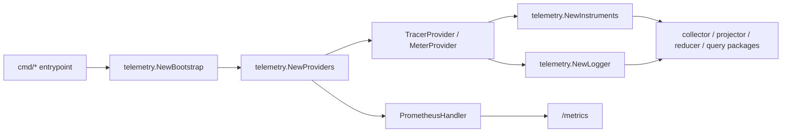

# Telemetry

`go/internal/telemetry` owns Eshu's frozen Go data-plane OpenTelemetry
contract. It centralizes metric instruments, metric dimensions, span names,
structured log keys, pipeline phase constants, OTEL provider setup, Prometheus
export, and trace-aware `slog` logging.

This package is a leaf package. It must not import other `go/internal/*`
packages.

## Source Of Truth

| Contract | Code source | Public operator doc |
| --- | --- | --- |
| Metric instruments | `instruments.go` | `docs/public/reference/telemetry/metrics.md` |
| Collector and ingestion metrics | `instruments.go` | `docs/public/reference/telemetry/metrics-ingestion-collectors.md` |
| Reducer, graph, storage, and memory metrics | `instruments.go` | `docs/public/reference/telemetry/metrics-reducer-storage.md` |
| Metric dimensions | `contract.go`, `registry.go`, `instruments.go` | `docs/public/reference/telemetry/metrics.md` |
| Span names | `contract.go`, `contract_*.go`, `registry.go` | `docs/public/reference/telemetry/traces.md` |
| Structured log keys and phase values | `contract.go`, `logging.go`, `registry.go` | `docs/public/reference/telemetry/logs.md` |
| Provider and Prometheus wiring | `provider.go` | `docs/public/reference/telemetry/runtime-signals.md` |
| Package godoc contract | `doc.go` | this README |

Keep catalogs in the focused public docs. Do not turn this README into a
second full metric, span, or log-key inventory.

## Runtime Wiring

Startup order for long-running runtimes:

1. Build `Bootstrap` with `NewBootstrap`.
2. Build providers with `NewProviders`.
3. Build instruments once with `NewInstruments`.
4. Register observable gauges after queue and worker observers exist.
5. Register shared-acceptance gauges when that observer exists.
6. Record `GOMEMLIMIT` after the effective limit is known.
7. Pass `*Instruments`, tracers, and loggers down to runtime packages.

## Bootstrap And Providers

- `Bootstrap` carries service name, namespace, meter name, tracer name, and
  logger name.
- `Providers` holds the trace provider, meter provider, Prometheus handler, and
  combined shutdown function.
- `NewProviders` creates Prometheus export for `/metrics` every time.
- `OTEL_EXPORTER_OTLP_ENDPOINT` enables OTLP gRPC trace and metric export.
  When it is empty, Prometheus still works.
- The Prometheus exporter uses a dedicated `prometheus.NewRegistry()`.
- `WithResourceAsConstantLabels` exposes only `service.name` and
  `service.namespace` as metric labels. Do not widen that filter without a
  cardinality review.

The regression gate for service labels is
`provider_resource_labels_test.go`.

## Metrics

`Instruments` owns all data-plane metric handles. Every metric name registered
in this package must use the `eshu_dp_` prefix.

Rules:

- Register counters and histograms in `NewInstruments`.
- Register observable gauges separately with `RegisterObservableGauges`,
  `RegisterAcceptanceObservableGauges`, or a focused package function such as
  the GOMEMLIMIT recorder.
- Use `Attr*` helpers instead of ad hoc `attribute.String` calls.
- Add a new metric dimension constant in `contract.go`, add it to
  `metricDimensionKeys` in `registry.go`, and add a matching helper in
  `instruments.go`.
- Keep metric labels bounded. Repository paths, file paths, fact IDs,
  work-item IDs, package names, image digests, delivery IDs, attribute keys,
  and raw cloud or state locators belong in spans or logs.

Observable gauges are registered once per process. Duplicate registration with
the same meter produces OTEL SDK errors.

## Spans

Span names are frozen contract values. Callers must use `telemetry.SpanXxx`
constants, never inline string literals.

Add a span by:

1. Adding the `Span*` constant in `contract.go` or the focused
   `contract_*.go` file.
2. Adding the constant to `spanNames` in `registry.go`, or to the focused
   registry insertion used by a companion contract file.
3. Starting the span in the owning package with
   `tracer.Start(ctx, telemetry.SpanXxx)`.
4. Updating the public traces page.
5. Running `go test ./internal/telemetry -count=1`.

`SpanNames()` returns a defensive copy of the frozen span registry.

## Structured Logs

`NewLogger` and `NewLoggerWithWriter` create JSON `slog` loggers backed by
`TraceHandler`.

Log behavior:

- `TraceHandler` injects `trace_id`, `span_id`, and `severity_number` only
  when the context carries a valid active span.
- Base attributes include `service_name`, `service_namespace`, `component`,
  and `runtime_role`.
- Built-in `slog` keys are normalized to `timestamp`, `severity_text`, and
  `message`.
- Common helpers include `ScopeAttrs`, `DomainAttrs`, `AcceptanceAttrs`,
  `PhaseAttr`, `FailureClassAttr`, `AcceptanceStaleCountAttr`, and `EventAttr`.

Add a log key by:

1. Adding the frozen `LogKey*` constant in `contract.go`.
2. Adding it to `logKeys` in `registry.go`.
3. Adding a helper in `logging.go` when repeated call sites need one.
4. Updating the public logs page and cross-service correlation guidance when
   the key affects async traceability.

`LogKeys()` returns a defensive copy of the frozen log-key registry.

## Pipeline Phases

Pipeline phase constants live in `logging.go`:

- `PhaseDiscovery`
- `PhaseParsing`
- `PhaseEmission`
- `PhaseProjection`
- `PhaseReduction`
- `PhaseShared`
- `PhaseQuery`
- `PhaseServe`

Use `PhaseAttr` with these constants. Do not invent package-local phase values.

## Change Checklist

When adding or changing telemetry:

1. Decide whether the signal is a metric, span, log key, status field, or trace
   attribute. Do not force high-cardinality detail into metrics.
2. Register the name in this package before any caller uses it.
3. Use the helper functions from this package in the caller.
4. Update the focused public telemetry page that operators use.
5. Add or update tests for registry contents, provider behavior, logger shape,
   or instrument registration.
6. Run `go test ./internal/telemetry -count=1`.
7. For runtime-affecting changes, record `Observability Evidence:` or
   `No-Observability-Change:` in the tracked evidence note required by the repo
   rules.

## Invariants

- No `go/internal/*` imports in this package.
- No metric name without the `eshu_dp_` prefix.
- No ad hoc metric label keys in runtime packages.
- No string-literal span names in callers.
- No package-local structured log keys when a frozen key exists.
- No high-cardinality metric labels.
- No use of the default Prometheus registry for Eshu data-plane metrics.
- No removal of `service.name` or `service.namespace` constant labels from the
  Prometheus exporter.
- No duplicate observable gauge registration for the same meter.

## Common Failures

| Symptom | First check |
| --- | --- |
| Counter or histogram missing from `/metrics` | Confirm `NewInstruments` succeeded and the runtime received the returned handle. |
| Gauge missing from `/metrics` | Confirm the relevant observable-gauge registration ran after observers were wired. |
| `trace_id` missing from logs | Confirm the log call used a context that carries an active span. Logs outside spans intentionally omit trace fields. |
| OTLP export missing | Confirm `OTEL_EXPORTER_OTLP_ENDPOINT` is set. Prometheus export does not require it. |
| Grafana service dropdown empty | Check `provider.go` and `TestPrometheusExposesServiceLabelsOnMetrics`; service labels must remain constant labels on every `eshu_dp_*` metric. |
| Duplicate instrument error | Confirm the binary calls `NewInstruments` once per meter and passes the handle down. |

## Related Docs

- `docs/public/reference/telemetry/index.md`
- `docs/public/reference/telemetry/metrics.md`
- `docs/public/reference/telemetry/metrics-ingestion-collectors.md`
- `docs/public/reference/telemetry/metrics-reducer-storage.md`
- `docs/public/reference/telemetry/traces.md`
- `docs/public/reference/telemetry/logs.md`
- `docs/public/reference/telemetry/cross-service-correlation.md`
- `docs/public/deployment/service-runtimes.md`
