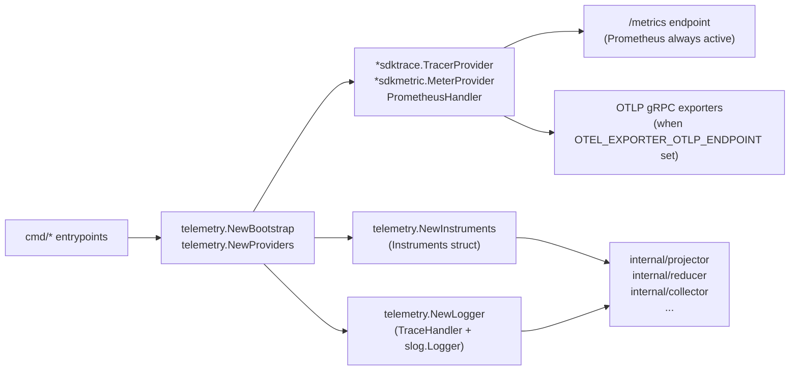

# Telemetry

## Purpose

`telemetry` owns Eshu's frozen Go data-plane OpenTelemetry contract: metric instruments, span names,
structured log keys, pipeline phase constants, attribute helpers, OTEL provider
initialization, and the trace-injecting `slog` handler. Every runtime-affecting
package in the data plane imports this package and nothing imports it back.

## Ownership boundary

This package is the single source of truth for all `eshu_dp_*` metric names, all
span name constants (`SpanCollectorObserve`, `SpanProjectorRun`, etc.), and all
log key constants (`LogKeyScopeID`, `LogKeyFailureClass`, etc.). New names are
registered here before being used anywhere else. It does not own queue workers,
graph writers, or HTTP handlers — it only defines the naming contract and the
bootstrapping seams those packages call at startup. Pipeline stage,
graph-backend, and failure-class labels stay here so runtime packages do not
invent local observability vocabularies.

See `CLAUDE.md` §Observability Contract for the project-wide rules that flow
from this package.

## Where this fits in the runtime

## Exported surface

See `doc.go` for the godoc contract. Key groups:

### Bootstrap and providers

- `Bootstrap` — minimum OTEL runtime settings (service name, namespace, meter
  name, tracer name, logger name); built by `NewBootstrap`
- `Providers` — holds `*sdktrace.TracerProvider`, `*sdkmetric.MeterProvider`,
  `PrometheusHandler`, and a combined `Shutdown` function; created by
  `NewProviders`
- `NewProviders` — configures OTLP gRPC trace and metric exporters when
  OTEL_EXPORTER_OTLP_ENDPOINT is set; always creates a Prometheus exporter
- `RecordGOMEMLIMIT` — registers `eshu_dp_gomemlimit_bytes` as an observable
  gauge at startup

### Metric instruments

`Instruments` holds all pre-registered OTEL metric instruments. Create with
`NewInstruments(meter)`. Observable gauges require a separate
`RegisterObservableGauges` call once the queue and worker observers are wired.
`RegisterAcceptanceObservableGauges` adds the `eshu_dp_shared_acceptance_rows`
gauge when a shared-acceptance observer is available.
`RegisterGraphOrphanObservableGauge` adds the `eshu_dp_graph_orphan_nodes` gauge
when the reducer has a graph orphan observer.

#### Counters (Int64)

| Field | Metric name |
| --- | --- |
| `FactsEmitted` | `eshu_dp_facts_emitted_total` |
| `FactsCommitted` | `eshu_dp_facts_committed_total` |
| `ProjectionsCompleted` | `eshu_dp_projections_completed_total` |
| `ReducerIntentsEnqueued` | `eshu_dp_reducer_intents_enqueued_total` |
| `ReducerAdmissionDeferrals` | `eshu_dp_reducer_admission_deferrals_total` |
| `ReducerExecutions` | `eshu_dp_reducer_executions_total` |
| `ReducerHeartbeatMissed` | `eshu_dp_reducer_heartbeat_missed_total` |
| `SearchIndexMutations` | `eshu_dp_search_index_mutations_total` |
| `SearchIndexErrors` | `eshu_dp_search_index_errors_total` |
| `CanonicalWrites` | `eshu_dp_canonical_writes_total` |
| `CanonicalNodesWritten` | `eshu_dp_canonical_nodes_written_total` |
| `CanonicalEdgesWritten` | `eshu_dp_canonical_edges_written_total` |
| `CanonicalAtomicWrites` | `eshu_dp_canonical_atomic_writes_total` |
| `CanonicalAtomicFallbacks` | `eshu_dp_canonical_atomic_fallbacks_total` |
| `SharedProjectionCycles` | `eshu_dp_shared_projection_cycles_total` |
| `SharedProjectionStaleIntents` | `eshu_dp_shared_projection_stale_intents_total` |
| `SharedProjectionPartitionHeartbeatMissed` | `eshu_dp_shared_projection_partition_heartbeat_missed_total` |
| `SharedProjectionLeaseQuarantines` | `eshu_dp_shared_projection_lease_quarantines_total` |
| `SharedAcceptanceUpserts` | `eshu_dp_shared_acceptance_upserts_total` |
| `SharedAcceptanceLookupErrors` | `eshu_dp_shared_acceptance_lookup_errors_total` |
| `GenerationRetentionPruned` | `eshu_dp_generation_retention_generations_pruned_total` |
| `GenerationRetentionRowsPruned` | `eshu_dp_generation_retention_rows_pruned_total` |
| `GenerationRetentionFailures` | `eshu_dp_generation_retention_failures_total` |
| `GenerationRetentionSkipped` | `eshu_dp_generation_retention_skipped_total` |
| `GenerationLivenessRecovered` | `eshu_dp_generation_liveness_recovered_total` |
| `GenerationLivenessSuperseded` | `eshu_dp_generation_liveness_superseded_total` |
| `GenerationLivenessFailures` | `eshu_dp_generation_liveness_failures_total` |
| `DocumentationEntityMentions` | `eshu_dp_documentation_entity_mentions_extracted_total` |
| `ReconciliationDriftRetractions` | `eshu_dp_reconciliation_drift_retractions_total` |
| `DocumentationClaimCandidates` | `eshu_dp_documentation_claim_candidates_extracted_total` |
| `DocumentationClaimsSuppressed` | `eshu_dp_documentation_claim_candidates_suppressed_total` |
| `DocumentationDriftFindings` | `eshu_dp_documentation_drift_findings_total` |
| `SharedEdgeWriteGroups` | `eshu_dp_shared_edge_write_groups_total` |
| `SharedEdgeRunsOnRetractOmissions` | `eshu_dp_shared_edge_runs_on_retract_omissions_total` (labels: bounded `domain`, `reason`) |
| `CodeCallEdgeBatches` | `eshu_dp_code_call_edge_batches_total` |
| `Neo4jBatchesExecuted` | `eshu_dp_neo4j_batches_executed_total` |
| `Neo4jDeadlockRetries` | `eshu_dp_neo4j_deadlock_retries_total` (labels: bounded `write_phase`, `reason`) |
| `ReposSnapshotted` | `eshu_dp_repos_snapshotted_total` |
| `FilesParsed` | `eshu_dp_files_parsed_total` |
| `SCIPSnapshotAttempts` | `eshu_dp_scip_snapshot_attempts_total` |
| `SCIPProcessWaitDuration` | `eshu_dp_scip_process_wait_seconds` |
| `FactBatchesCommitted` | `eshu_dp_fact_batches_committed_total` |
| `ContentReReads` | `eshu_dp_content_rereads_total` |
| `ContentReReadSkips` | `eshu_dp_content_reread_skips_total` |
| `DiscoveryDirsSkipped` | `eshu_dp_discovery_dirs_skipped_total` |
| `DiscoveryFilesSkipped` | `eshu_dp_discovery_files_skipped_total` |
| `LargeRepoClassifications` | `eshu_dp_large_repo_classifications_total` |
| `EvidenceFactsDiscovered` | `eshu_dp_evidence_facts_discovered_total` |
| `WorkflowClaimFactsEmitted` | `eshu_dp_workflow_claim_facts_emitted_total` (labels: `collector_kind`, `source_system`) |
| `DeferredBackfillEvidence` | `eshu_dp_deferred_backfill_evidence_total` |
| `DeferredBackfillBatchesCompleted` | `eshu_dp_deferred_backfill_batches_completed_total` |
| `DeferredBackfillPartitionsSkipped` | `eshu_dp_deferred_backfill_partitions_skipped_total` (labels: `reason`) |
| `DeferredBackfillPartitionsLoaded` | `eshu_dp_deferred_backfill_partitions_loaded_total` (labels: `reason`) |
| `DeploymentMappingReopened` | `eshu_dp_deployment_mapping_reopened_total` |
| `IaCReachabilityRows` | `eshu_dp_iac_reachability_rows_total` |
| `TerraformStateSnapshotsObserved` | `eshu_dp_tfstate_snapshots_observed_total` |
| `TerraformStateResourcesEmitted` | `eshu_dp_tfstate_resources_emitted_total` |
| `TerraformStateOutputsEmitted` | `eshu_dp_tfstate_outputs_emitted_total` |
| `TerraformStateModulesEmitted` | `eshu_dp_tfstate_modules_emitted_total` |
| `TerraformStateWarningsEmitted` | `eshu_dp_tfstate_warnings_emitted_total` |
| `TerraformStateRedactionsApplied` | `eshu_dp_tfstate_redactions_applied_total` |
| `TerraformStateS3ConditionalGetNotModified` | `eshu_dp_tfstate_s3_conditional_get_not_modified_total` |
| `OCIRegistryAPICalls` | `eshu_dp_oci_registry_api_calls_total` |
| `OCIRegistryTagsObserved` | `eshu_dp_oci_registry_tags_observed_total` |
| `OCIRegistryManifestsObserved` | `eshu_dp_oci_registry_manifests_observed_total` |
| `OCIRegistryReferrersObserved` | `eshu_dp_oci_registry_referrers_observed_total` |
| `PackageRegistryRequests` | `eshu_dp_package_registry_requests_total` |
| `PackageRegistryFactsEmitted` | `eshu_dp_package_registry_facts_emitted_total` |
| `PackageRegistryRateLimited` | `eshu_dp_package_registry_rate_limited_total` |
| `PackageRegistryParseFailures` | `eshu_dp_package_registry_parse_failures_total` |
| `VulnerabilityIntelligenceObservations` | `eshu_dp_vulnerability_intelligence_observations_total` |
| `VulnerabilityIntelligenceFactsEmitted` | `eshu_dp_vulnerability_intelligence_facts_emitted_total` |
| `VulnerabilityIntelligenceRateLimited` | `eshu_dp_vulnerability_intelligence_rate_limited_total` |
| `SecurityAlertProviderRequests` | `eshu_dp_security_alert_provider_requests_total` |
| `SecurityAlertFactsEmitted` | `eshu_dp_security_alert_facts_emitted_total` |
| `SecurityAlertRateLimited` | `eshu_dp_security_alert_rate_limited_total` |
| `CICDRunProviderRequests` | `eshu_dp_ci_cd_run_provider_requests_total` |
| `CICDRunFactsEmitted` | `eshu_dp_ci_cd_run_facts_emitted_total` |
| `CICDRunRateLimited` | `eshu_dp_ci_cd_run_rate_limited_total` |
| `CICDRunPartialGenerations` | `eshu_dp_ci_cd_run_partial_generations_total` |
| `PagerDutyProviderRequests` | `eshu_dp_pagerduty_provider_requests_total` |
| `PagerDutyFactsEmitted` | `eshu_dp_pagerduty_facts_emitted_total` |
| `PagerDutyRateLimited` | `eshu_dp_pagerduty_rate_limited_total` |
| `PagerDutyConfigResourcesObserved` | `eshu_dp_pagerduty_config_resources_observed_total` |
| `PagerDutyConfigDriftCandidates` | `eshu_dp_pagerduty_config_drift_candidates_total` |
| `PagerDutyConfigPartialFailures` | `eshu_dp_pagerduty_config_partial_failures_total` |
| `PagerDutyConfigRedactions` | `eshu_dp_pagerduty_config_redactions_total` |
| `JiraProviderRequests` | `eshu_dp_jira_provider_requests_total` |
| `JiraFactsEmitted` | `eshu_dp_jira_facts_emitted_total` |
| `JiraRateLimited` | `eshu_dp_jira_rate_limited_total` |
| `GrafanaProviderRequests` | `eshu_dp_grafana_provider_requests_total` |
| `GrafanaFactsEmitted` | `eshu_dp_grafana_facts_emitted_total` |
| `GrafanaRateLimited` | `eshu_dp_grafana_rate_limited_total` |
| `GrafanaRetries` | `eshu_dp_grafana_retries_total` |
| `GrafanaRedactions` | `eshu_dp_grafana_redactions_total` |
| `PrometheusMimirProviderRequests` | `eshu_dp_prometheus_mimir_provider_requests_total` |
| `PrometheusMimirFactsEmitted` | `eshu_dp_prometheus_mimir_facts_emitted_total` |
| `PrometheusMimirRateLimited` | `eshu_dp_prometheus_mimir_rate_limited_total` |
| `PrometheusMimirRetries` | `eshu_dp_prometheus_mimir_retries_total` |
| `PrometheusMimirRedactions` | `eshu_dp_prometheus_mimir_redactions_total` |
| `PrometheusMimirStale` | `eshu_dp_prometheus_mimir_stale_total` |
| `LokiProviderRequests` | `eshu_dp_loki_provider_requests_total` |
| `LokiFactsEmitted` | `eshu_dp_loki_facts_emitted_total` |
| `LokiRateLimited` | `eshu_dp_loki_rate_limited_total` |
| `LokiRetries` | `eshu_dp_loki_retries_total` |
| `LokiRedactions` | `eshu_dp_loki_redactions_total` |
| `LokiHighCardinalityRejected` | `eshu_dp_loki_high_cardinality_rejected_total` |
| `LokiStale` | `eshu_dp_loki_stale_total` |
| `TempoProviderRequests` | `eshu_dp_tempo_provider_requests_total` |
| `TempoFactsEmitted` | `eshu_dp_tempo_facts_emitted_total` |
| `TempoRateLimited` | `eshu_dp_tempo_rate_limited_total` |
| `TempoRetries` | `eshu_dp_tempo_retries_total` |
| `TempoRedactions` | `eshu_dp_tempo_redactions_total` |
| `TempoHighCardinalityRejected` | `eshu_dp_tempo_high_cardinality_rejected_total` |
| `TempoStale` | `eshu_dp_tempo_stale_total` |
| `ScannerWorkerClaims` | `eshu_dp_scanner_worker_claims_total` |
| `ScannerWorkerRetries` | `eshu_dp_scanner_worker_retries_total` |
| `ScannerWorkerDeadLetters` | `eshu_dp_scanner_worker_dead_letters_total` |
| `ScannerWorkerFactsEmitted` | `eshu_dp_scanner_worker_facts_emitted_total` |
| `PackageSourceCorrelations` | `eshu_dp_package_source_correlations_total` |
| `PackageConsumptionRepoEdges` | `eshu_dp_package_consumption_repo_edges_total` (labels: bounded `domain`, `outcome`) |
| `CodeImportRepoEdges` | `eshu_dp_code_import_repo_edges_total` (labels: bounded `domain`, `outcome`) |
| `ContainerImageIdentityDecisions` | `eshu_dp_container_image_identity_decisions_total` |
| `CICDRunCorrelations` | `eshu_dp_ci_cd_run_correlations_total` |
| `ServiceCatalogCorrelations` | `eshu_dp_service_catalog_correlations_total` |
| `ServiceCatalogCorrelationGuardrails` | `eshu_dp_service_catalog_correlation_guardrails_total` (labels: bounded `domain`, `guardrail`) |
| `SearchDecayPolicyApplications` | `eshu_dp_search_decay_policy_applications_total` (labels: bounded `policy_id`, `evidence_class`, `outcome`) |
| `SecretsIAMReducerTrustChains` | `eshu_dp_secrets_iam_reducer_trust_chains_total` (labels: bounded `result`, `confidence`) |
| `SecretsIAMPostureObservations` | `eshu_dp_secrets_iam_posture_observations_total` (labels: bounded `risk_type`, `severity`) |
| `SBOMAttestationAttachments` | `eshu_dp_sbom_attestation_attachments_total` |
| `SupplyChainImpactFindings` | `eshu_dp_supply_chain_impact_findings_total` |
| `SupplyChainSuppressionDecisions` | `eshu_dp_supply_chain_suppression_decisions_total` (per-finding VEX/operator-policy suppression outcomes, labels: `domain`, `outcome` in active/not_affected/accepted_risk/false_positive/ignored/expired/provider_dismissed/scope_mismatch) |
| `SupplyChainRemediationDecisions` | `eshu_dp_supply_chain_remediation_decisions_total` (per-finding advisory-only safe-upgrade decisions, labels: `domain`, `outcome` in exact/partial/unknown, `reason` in direct_upgrade_allowed/direct_range_blocked/transitive_parent_upgrade_required/no_patched_version/multiple_patched_branches/package_manager_unsupported/manifest_range_missing/manifest_range_malformed/installed_version_missing/installed_version_malformed) |
| `ConfluenceHTTPRequests` | `eshu_dp_confluence_http_requests_total` |
| `ConfluencePermissionDeniedPages` | `eshu_dp_confluence_permission_denied_pages_total` |
| `ConfluenceDocumentsObserved` | `eshu_dp_confluence_documents_observed_total` |
| `ConfluenceSectionsEmitted` | `eshu_dp_confluence_sections_emitted_total` |
| `ConfluenceLinksEmitted` | `eshu_dp_confluence_links_emitted_total` |
| `ConfluenceSyncFailures` | `eshu_dp_confluence_sync_failures_total` |
| `AWSAPICalls` | `eshu_dp_aws_api_calls_total` |
| `AWSThrottles` | `eshu_dp_aws_throttle_total` |
| `AWSAssumeRoleFailed` | `eshu_dp_aws_assumerole_failed_total` |
| `AWSBudgetExhausted` | `eshu_dp_aws_budget_exhausted_total` |
| `AWSCheckpointEvents` | `eshu_dp_aws_pagination_checkpoint_events_total` |
| `AWSResourcesEmitted` | `eshu_dp_aws_resources_emitted_total` |
| `AWSRelationshipsEmitted` | `eshu_dp_aws_relationships_emitted_total` |
| `AWSTagObservationsEmitted` | `eshu_dp_aws_tag_observations_emitted_total` |
| `AWSFreshnessEvents` | `eshu_dp_aws_freshness_events_total` |
| `AWSOrgAccessSkipped` | `eshu_dp_aws_org_access_skipped_total` |
| `CrossRepoEvidenceLoaded` | `eshu_dp_cross_repo_evidence_loaded_total` |
| `CrossRepoEdgesResolved` | `eshu_dp_cross_repo_edges_resolved_total` |
| `CrossRepoActivationFenced` | `eshu_dp_cross_repo_activation_fenced_total` |
| `FluxCrossRepoURLResolution` | `eshu_dp_flux_cross_repo_url_resolution_total` |
| `CorrelationRuleMatches` | `eshu_dp_correlation_rule_matches_total` |
| `CorrelationDriftDetected` | `eshu_dp_correlation_drift_detected_total` |
| `CorrelationDriftIntentsEnqueued` | `eshu_dp_correlation_drift_intents_enqueued_total` |
| `CorrelationOrphanDetected` | `eshu_dp_correlation_orphan_detected_total` |
| `CorrelationUnmanagedDetected` | `eshu_dp_correlation_unmanaged_detected_total` |
| `AWSRelationshipEdges` | `eshu_dp_aws_relationship_edges_total` |
| `AWSCloudImageEdges` | `eshu_dp_aws_cloud_image_edges_total` (labels: `resolution_mode`; counts AWS `CloudResource`->`ContainerImage` edges materialized per generation, issue #5450) |
| `CrossScopeOwnershipContendedRows` | `eshu_dp_cross_scope_ownership_contended_rows_total` |
| `GCPRelationshipEdges` | `eshu_dp_gcp_relationship_edges_total` |
| `GCPMaterializationFacts` | `eshu_dp_gcp_materialization_facts_total` |
| `GCPMaterializationGraphWrites` | `eshu_dp_gcp_materialization_graph_writes_total` |
| `IAMCanAssumeEdges` | `eshu_dp_iam_can_assume_edges_total` |
| `IAMCanPerformEdges` | `eshu_dp_iam_can_perform_edges_total` |
| `IAMCanPerformSkipped` | `eshu_dp_iam_can_perform_skipped_total` |
| `IAMCanPerformConditioned` | `eshu_dp_iam_can_perform_conditioned_total` |
| `S3LogsToEdges` | `eshu_dp_s3_logs_to_edges_total` |
| `S3LogsToSkipped` | `eshu_dp_s3_logs_to_skipped_total` |
| `EC2UsesProfileEdges` | `eshu_dp_ec2_uses_profile_edges_total` |
| `EC2UsesProfileSkipped` | `eshu_dp_ec2_uses_profile_skipped_total` |
| `IAMInstanceProfileRoleEdges` | `eshu_dp_iam_instance_profile_role_edges_total` |
| `IAMInstanceProfileRoleSkipped` | `eshu_dp_iam_instance_profile_role_skipped_total` |
| `EC2InternetExposureDecisions` | `eshu_dp_ec2_internet_exposure_decisions_total` |
| `EC2InternetExposureSkipped` | `eshu_dp_ec2_internet_exposure_skipped_total` |
| `S3InternetExposureDecisions` | `eshu_dp_s3_internet_exposure_decisions_total` |
| `S3InternetExposureSkipped` | `eshu_dp_s3_internet_exposure_skipped_total` |
| `DriftUnresolvedModuleCalls` | `eshu_dp_drift_unresolved_module_calls_total` |
| `DriftSchemaUnknownComposite` | `eshu_dp_drift_schema_unknown_composite_total` |
| `WebhookRequests` | `eshu_dp_webhook_requests_total` |
| `WebhookTriggerDecisions` | `eshu_dp_webhook_trigger_decisions_total` |
| `WebhookStoreOperations` | `eshu_dp_webhook_store_operations_total` |

`DriftUnresolvedModuleCalls` uses
`MetricDimensionDriftUnresolvedModuleReason` with the bounded reasons
`external_registry`, `external_git`, `external_archive`, `cross_repo_local`,
`cycle_detected`, `depth_exceeded`, and `module_renamed`. The first six
classify module calls the drift loader cannot resolve locally; `module_renamed`
classifies prior-config projection where the same callee path has different
module prefixes across generations.

#### Histograms (Float64 unless noted)

| Field | Metric name | Custom buckets |
| --- | --- | --- |
| `CollectorObserveDuration` | `eshu_dp_collector_observe_duration_seconds` | 0.01–60 s |
| `TerraformStateClaimWaitDuration` | `eshu_dp_tfstate_claim_wait_seconds` | 0–3600 s |
| `TerraformStateSnapshotBytes` | `eshu_dp_tfstate_snapshot_bytes` | 1 KiB–100 MiB |
| `TerraformStateParseDuration` | `eshu_dp_tfstate_parse_duration_seconds` | 0.001–10 s |
| `WebhookRequestDuration` | `eshu_dp_webhook_request_duration_seconds` | 0.001–10 s |
| `WebhookStoreDuration` | `eshu_dp_webhook_store_duration_seconds` | 0.001–10 s |
| `OCIRegistryScanDuration` | `eshu_dp_oci_registry_scan_duration_seconds` | 0.05–120 s |
| `PackageRegistryObserveDuration` | `eshu_dp_package_registry_observe_duration_seconds` | 0.01–60 s |
| `PackageRegistryGenerationLag` | `eshu_dp_package_registry_generation_lag_seconds` | 0.01–60 s |
| `VulnerabilityIntelligenceFetchDuration` | `eshu_dp_vulnerability_intelligence_fetch_duration_seconds` | 0.01-60 s |
| `SecurityAlertFetchDuration` | `eshu_dp_security_alert_fetch_duration_seconds` | 0.01–60 s |
| `CICDRunFetchDuration` | `eshu_dp_ci_cd_run_fetch_duration_seconds` | 0.01-60 s |
| `PagerDutyFetchDuration` | `eshu_dp_pagerduty_fetch_duration_seconds` | 0.01-60 s |
| `PagerDutyGenerationLag` | `eshu_dp_pagerduty_generation_lag_seconds` | 0.01–60 s |
| `JiraFetchDuration` | `eshu_dp_jira_fetch_duration_seconds` | 0.01–60 s |
| `GrafanaFetchDuration` | `eshu_dp_grafana_fetch_duration_seconds` | 0.01–60 s |
| `PrometheusMimirFetchDuration` | `eshu_dp_prometheus_mimir_fetch_duration_seconds` | 0.01–60 s |
| `LokiFetchDuration` | `eshu_dp_loki_fetch_duration_seconds` | 0.01–60 s |
| `TempoFetchDuration` | `eshu_dp_tempo_fetch_duration_seconds` | 0.01–60 s |
| `ScannerWorkerQueueWaitDuration` | `eshu_dp_scanner_worker_queue_wait_seconds` | 0.001–21600 s |
| `ScannerWorkerScanDuration` | `eshu_dp_scanner_worker_scan_duration_seconds` | 0.05–1200 s |
| `ScannerWorkerTargetCount` | `eshu_dp_scanner_worker_target_count` (Int64) | 1–100000 targets |
| `ScannerWorkerResultCount` | `eshu_dp_scanner_worker_result_count` (Int64) | 1–100000 results |
| `ScannerWorkerCPUSeconds` | `eshu_dp_scanner_worker_cpu_seconds` | 0.01–1800 s |
| `ScannerWorkerMemoryBytes` | `eshu_dp_scanner_worker_memory_bytes` (Int64) | 1 MiB–16 GiB |
| `ConfluenceFetchDuration` | `eshu_dp_confluence_fetch_duration_seconds` | 0.01–60 s |
| `ScopeAssignDuration` | `eshu_dp_scope_assign_duration_seconds` | default |
| `FactEmitDuration` | `eshu_dp_fact_emit_duration_seconds` | default |
| `ProjectorRunDuration` | `eshu_dp_projector_run_duration_seconds` | 0.1–120 s |
| `ProjectorStageDuration` | `eshu_dp_projector_stage_duration_seconds` | default |
| `ReducerRunDuration` | `eshu_dp_reducer_run_duration_seconds` | default |
| `SearchIndexWriteDuration` | `eshu_dp_search_index_write_duration_seconds` | 0.001–21600 s |
| `ReducerQueueWaitDuration` | `eshu_dp_reducer_queue_wait_seconds` | 0.001–21600 s |
| `GCPMaterializationDuration` | `eshu_dp_gcp_materialization_duration_seconds` | 0.001–21600 s |
| `GenerationRetentionDuration` | `eshu_dp_generation_retention_duration_seconds` | 0.001–900 s |
| `GenerationRetentionBatchSize` | `eshu_dp_generation_retention_batch_size` (Int64) | 1–100 generations |
| `GenerationRetentionOldestEligibleAge` | `eshu_dp_generation_retention_oldest_eligible_age_seconds` | 1h–90d |
| `CanonicalWriteDuration` | `eshu_dp_canonical_write_duration_seconds` | 0.01–60 s |
| `CanonicalProjectionDuration` | `eshu_dp_canonical_projection_duration_seconds` | 0.01–60 s |
| `CanonicalRetractDuration` | `eshu_dp_canonical_retract_duration_seconds` | 0.001–2.5 s |
| `CanonicalBatchSize` | `eshu_dp_canonical_batch_size` | 1–1000 rows |
| `CanonicalPhaseDuration` | `eshu_dp_canonical_phase_duration_seconds` | 0.001–5 s |
| `QueueClaimDuration` | `eshu_dp_queue_claim_duration_seconds` | default |
| `PostgresQueryDuration` | `eshu_dp_postgres_query_duration_seconds` | 0.001–2.5 s |
| `Neo4jQueryDuration` | `eshu_dp_neo4j_query_duration_seconds` | 0.001–10 s |
| `IaCResourceListDuration` | `eshu_dp_iac_resource_list_duration_seconds` | 0.001–5 s |
| `IaCResourceListErrors` | `eshu_dp_iac_resource_list_errors_total` (Int64) | counter |
| `CloudResourceListDuration` | `eshu_dp_cloud_resource_list_duration_seconds` | 0.001–10 s |
| `CloudResourceListErrors` | `eshu_dp_cloud_resource_list_errors_total` (Int64) | counter |
| `CloudResourceListScannedRows` | `eshu_dp_cloud_resource_list_scanned_rows` (Int64) | 0–201 logical owner-ledger candidates |
| `CloudResourceListPageSize` | `eshu_dp_cloud_resource_list_page_size` (Int64) | 0–201 resources |
| `CloudResourceListTruncations` | `eshu_dp_cloud_resource_list_truncations_total` (Int64) | counter |
| `APIRequestDuration` | `eshu_dp_api_request_duration_seconds` (labels: `route`, `status_class`) | 0.001–10 s |
| `APIRequestErrors` | `eshu_dp_api_request_errors_total` (Int64; labels: `route`, `status_class`) | counter |
| `RelationshipBreakdownPermitWaitDuration` | `eshu_dp_relationship_breakdown_permit_wait_seconds` | 0–30 s; no labels |
| `RelationshipBreakdownQueued` | `eshu_dp_relationship_breakdown_queued` (Int64 UpDownCounter) | current waiters; no labels |
| `RelationshipBreakdownInFlight` | `eshu_dp_relationship_breakdown_in_flight` (Int64 UpDownCounter) | current permit holders; no labels |
| `Neo4jBatchSize` | `eshu_dp_neo4j_batch_size` | 1–1000 rows |
| `SharedAcceptanceUpsertDuration` | `eshu_dp_shared_acceptance_upsert_duration_seconds` | default |
| `SharedAcceptanceLookupDuration` | `eshu_dp_shared_acceptance_lookup_duration_seconds` | default |
| `SharedAcceptancePrefetchSize` | `eshu_dp_shared_acceptance_prefetch_size` (Int64) | 1–512 rows |
| `SharedProjectionIntentWaitDuration` | `eshu_dp_shared_projection_intent_wait_seconds` | 0.001–21600 s |
| `SharedProjectionProcessingDuration` | `eshu_dp_shared_projection_processing_seconds` | 0.001–60 s |
| `SharedProjectionStepDuration` | `eshu_dp_shared_projection_step_seconds` | 0.001–60 s |
| `DocumentationDriftGenerationDuration` | `eshu_dp_documentation_drift_generation_duration_seconds` | default |
| `SharedEdgeWriteGroupDuration` | `eshu_dp_shared_edge_write_group_duration_seconds` | 0.001–60 s |
| `SharedEdgeWriteGroupStatementCount` | `eshu_dp_shared_edge_write_group_statement_count` (Int64) | 1–128 stmts |
| `CodeCallEdgeDuration` | `eshu_dp_code_call_edge_batch_duration_seconds` | 0.001–5 s |
| `BatchClaimSize` | `eshu_dp_reducer_batch_claim_size` (Int64) | 1–128 items |
| `RepoSnapshotDuration` | `eshu_dp_repo_snapshot_duration_seconds` | 0.1–300 s |
| `FileParseDuration` | `eshu_dp_file_parse_duration_seconds` | 0.001–2.5 s |
| `FilePreScanDuration` | `eshu_dp_file_prescan_duration_seconds` (labels: `language`) | 0.001–2.5 s |
| `GenerationFactCount` | `eshu_dp_generation_fact_count` | 10–300000 facts |
| `SCIPProcessWaitDuration` | `eshu_dp_scip_process_wait_seconds` | 0–60 s |
| `LargeRepoSemaphoreWait` | `eshu_dp_large_repo_semaphore_wait_seconds` | 0–300 s |
| `DeferredBackfillDuration` | `eshu_dp_deferred_backfill_duration_seconds` | 0.1–300 s |
| `DeferredBackfillBatchDuration` | `eshu_dp_deferred_backfill_batch_duration_seconds` | 0.1–300 s |
| `IaCReachabilityMaterializationDuration` | `eshu_dp_iac_reachability_materialization_duration_seconds` | 0.1–300 s |
| `CrossRepoResolutionDuration` | `eshu_dp_cross_repo_resolution_duration_seconds` | 0.01–30 s |
| `PipelineOverlapDuration` | `eshu_dp_pipeline_overlap_seconds` | 1–1800 s |
| `WorkflowClaimRunDuration` | `eshu_dp_workflow_claim_run_duration_seconds` (labels: `collector_kind`, `source_system`, `outcome`) | 0.1–1800 s |

`WorkflowClaimRunDuration` records the wall time of one claimed-service
processing cycle (`ClaimedService.processClaimed`) for every collector family,
recorded via `defer` on every return path. `outcome` is a bounded enum
(`success`, `unchanged`, `released`, `fail_retryable`, `fail_terminal`). It is
the per-collector long-pole signal: `sum by (collector_kind)` of `_sum` over
`_count` gives mean run duration per family. It shares the `collector_kind`
label with the #3678 per-stage `eshu_dp_bootstrap_pipeline_phase_seconds` so the
per-collector and per-phase layers join cleanly. The matching trace span is
`collector.claimed_run`, carrying the same `collector_kind`, `source_system`,
and `outcome` attributes.

`WorkflowClaimFactsEmitted` (`eshu_dp_workflow_claim_facts_emitted_total`, labels
`collector_kind` and `source_system`) counts facts committed per claimed-service
run from `CollectedGeneration.FactCount`, recorded on the success path only — no
extra scan or IO. `sum by (collector_kind)` of its rate gives facts/second per
collector; paired with `WorkflowClaimRunDuration` an operator sees whether a slow
collector is IO-bound or emission-heavy, and it joins the #3678
`eshu_dp_content_entity_emitted_total` (`source_file_kind`) counter for a
per-collector and per-file-kind volume breakdown.

#### Observable gauges

| Field | Metric name | Dimensions |
| --- | --- | --- |
| `QueueDepth` | `eshu_dp_queue_depth` | `queue`, `status` |
| `QueueOldestAge` | `eshu_dp_queue_oldest_age_seconds` | `queue` |
| `SourceQueueDepth` | `eshu_dp_queue_source_depth` | `queue`, `source_system`, `status` |
| `SourceQueueOldestAge` | `eshu_dp_queue_source_oldest_age_seconds` | `queue`, `source_system` |
| `WorkerPoolActive` | `eshu_dp_worker_pool_active` | `pool` |
| `SharedAcceptanceRows` | `eshu_dp_shared_acceptance_rows` | none |
| `GraphOrphanNodes` | `eshu_dp_graph_orphan_nodes` | `node_label` |
| `ActiveGenerationsByAge` | `eshu_dp_active_generations` | `age_bucket` |
| (via `RecordGOMEMLIMIT`) | `eshu_dp_gomemlimit_bytes` | none |

### Span name constants

Defined in `contract.go` and small companion files such as
`contract_query_spans.go`. Use `telemetry.SpanXxx` rather than string literals;
new query routes such as hardcoded-secret investigation register their span name
here before handlers use it.

Pipeline spans: `SpanCollectorObserve`, `SpanCollectorStream`, `SpanScopeAssign`,
`SpanFactEmit`, `SpanProjectorRun`, `SpanReducerIntentEnqueue`, `SpanReducerRun`,
`SpanReducerBatchClaim`, `SpanReducerEshuSearchIndexWrite`,
`SpanReducerDriftEvidenceLoad`,
`SpanReducerAzureRelationshipMaterialization`,
`SpanReducerRDSPostureMaterialization`,
`SpanReducerS3ExternalPrincipalGrantMaterialization`, `SpanCanonicalWrite`,
`SpanCanonicalProjection`,
`SpanCanonicalRetract`, `SpanEvidenceDiscovery`,
`SpanIaCReachabilityMaterialization`, `SpanSQLRelationshipMaterialization`,
`SpanInheritanceMaterialization`, `SpanCrossRepoResolution`,
`SpanSharedAcceptanceLookup`, `SpanSharedAcceptanceUpsert`,
`SpanQueryRelationshipEvidence`, `SpanQueryEvidenceCitationPacket`,
`SpanQueryDocumentationFindings`,
`SpanQueryDocumentationEvidencePacket`, `SpanQueryDocumentationPacketFreshness`,
`SpanQuerySemanticEvidence`,
`SpanQueryDeadIaC`, `SpanQueryIaCUnmanagedResources`,
`SpanQueryIaCManagementStatus`, `SpanQueryIaCManagementExplanation`,
`SpanQueryIaCTerraformImportPlan`, `SpanQueryAWSRuntimeDriftFindings`,
`SpanQueryInfraResourceSearch`, `SpanQueryCodeTopicInvestigation`,
`SpanQueryHardcodedSecretInvestigation`, `SpanQueryDeadCodeInvestigation`,
`SpanQueryCallGraphMetrics`, `SpanQueryGraphEntityInventory`,
`SpanQueryChangeSurfaceInvestigation`,
`SpanQueryPackageRegistryPackages`, `SpanQueryPackageRegistryVersions`,
`SpanQueryPackageRegistryDependencies`,
`SpanQueryAdvisoryEvidence`,
`SpanQueryIncidentContext`,
`SpanQueryWorkItemEvidence`,
`SpanQuerySupplyChainImpactExplanation`,
`SpanScannerWorkerClaimProcess`, `SpanScannerWorkerAnalyze`,
`SpanScannerWorkerFactEmitBatch`, `SpanTerraformStateClaimProcess`,
`SpanTerraformStateDiscoveryResolve`, `SpanTerraformStateSourceOpen`,
`SpanTerraformStateParserStream`, `SpanTerraformStateFactEmitBatch`,
`SpanTerraformStateCoordinatorDone`, `SpanWebhookHandle`, `SpanWebhookStore`,
`SpanOCIRegistryScan`, `SpanOCIRegistryAPICall`, `SpanPagerDutyObserve`,
`SpanPagerDutyFetch`, `SpanJiraObserve`, `SpanJiraFetch`,
`SpanPrometheusMimirObserve`, `SpanPrometheusMimirFetch`, `SpanLokiObserve`,
`SpanLokiFetch`, `SpanTempoObserve`,
and `SpanTempoFetch`.

Work-item evidence query spans use bounded `SpanAttrWorkItemEvidence*` integer
and boolean attributes for query count, result count, stale evidence,
permission-hidden evidence, rejected unsafe payloads, unsupported link types,
missing evidence, and page truncation.

Jira fetch spans use bounded integer attributes for page counts, emitted object
counts, redactions, partial failures, rate limits, and stale windows.

Dependency spans: `SpanPostgresExec`, `SpanPostgresQuery`, `SpanNeo4jExecute`.

`SpanQuerySemanticEvidence` covers the opt-in semantic documentation
observation and code-hint list routes. The underlying Postgres read still emits
`SpanPostgresQuery` with `db.operation=list_semantic_evidence`, so operators can
separate semantic provenance inspection from deterministic documentation, code,
and graph-truth reads without adding a metric label.

The full frozen list is also accessible at runtime via `SpanNames()`.

### Log keys and phase constants

Log keys (all frozen in `contract.go`): `LogKeyScopeID`, `LogKeyScopeKind`,
`LogKeySourceSystem`, `LogKeyGenerationID`, `LogKeyCollectorKind`,
`LogKeyDomain`, `LogKeyPartitionKey`, `LogKeyRequestID`, `LogKeyFailureClass`,
`LogKeyRefreshSkipped`, `LogKeyPipelinePhase`, `LogKeyAcceptanceScopeID`,
`LogKeyAcceptanceUnitID`, `LogKeyAcceptanceSourceRunID`,
`LogKeyAcceptanceGenerationID`, `LogKeyAcceptanceStaleCount`,
`LogKeyResourceFingerprint`, `LogKeyResourceIdentityKind`, and
`LogKeyResourceType`.

Drift-specific log keys (also frozen in `contract.go`):
`LogKeyDriftPriorConfigDepth`, `LogKeyDriftPriorConfigAddresses`,
`LogKeyDriftStateOnlyAddresses`, `LogKeyDriftAddressesPromoted` carry the
prior-config walk summary emitted by `PostgresDriftEvidenceLoader`.
`LogKeyDriftMultiElementPrefix`, `LogKeyDriftMultiElementCount`, and
`LogKeyDriftMultiElementSource` flag the first-wins truncation policy applied
to multi-element repeated nested blocks — emitted at debug level from both
`flattenStateAttributes`
(`internal/storage/postgres/tfstate_drift_evidence_state_row.go:90`) and
`walkBlockAttributes`
(`internal/parser/hcl/terraform_resource_attributes.go:132`).

Pipeline phase constants (defined in `logging.go`): `PhaseDiscovery`,
`PhaseParsing`, `PhaseEmission`, `PhaseProjection`, `PhaseReduction`,
`PhaseShared`, `PhaseQuery`, `PhaseServe`.

### Attribute and log helpers

Attribute helpers — typed constructors for every metric dimension key, for
example `AttrDomain`, `AttrScopeID`, `AttrWritePhase`; use these rather than
`attribute.String` literals when recording metrics.
`SafeResourceLogIdentity` and `SafeResourceLogAttrs` turn raw cloud or
infrastructure identifiers into deterministic fingerprints plus bounded
identity-kind and resource-type fields. Use them when logs need to correlate a
resource without exposing ARNs, Terraform addresses, or secret-shaped names.
Scanner-worker labels use `AttrAnalyzer`, `AttrTargetKind`, and
`AttrLimitKind`; values must come from bounded analyzer, target, and limit
enums, not paths, package names, registry URLs, or raw locators.
Webhook listener labels use `AttrProvider`, `AttrEventKind`, `AttrDecision`,
`AttrStatus`, `AttrOutcome`, and `AttrReason` so provider intake stays on the
same bounded vocabulary as the rest of the data plane.

`ScopeAttrs`, `DomainAttrs`, `AcceptanceAttrs` — return `[]slog.Attr` slices
for the common scope, domain, and acceptance-context log fields.

`PhaseAttr`, `FailureClassAttr`, `AcceptanceStaleCountAttr`, `EventAttr` —
single-key `slog.Attr` constructors for the most frequently repeated log fields.

### Logging

`NewLogger` and `NewLoggerWithWriter` — construct a JSON `slog.Logger` backed
by `TraceHandler`. The handler injects `trace_id`, `span_id`, and
`severity_number` from the active OTEL span context on every record. Base
attributes `service_name`, `service_namespace`, `component`, and `runtime_role`
are attached at logger creation.

### Refresh counter

`RecordSkippedRefresh`, `SkippedRefreshCount` — process-local atomic counter for
incremental-refresh skip tracking. Not a metric; used only for status-surface
reporting.

## Dependencies

No internal Eshu package imports; external dependencies are OTEL and Prometheus.

This is a leaf package. Introducing any `go/internal/*` import here creates a
circular dependency and must not happen.

## Telemetry

This package defines the telemetry contract. It emits nothing itself at
runtime; all emission happens in the packages that consume `Instruments`.

## Gotchas / invariants

- `NewInstruments` registers every counter and histogram but does not wire
  observable gauges. Call `RegisterObservableGauges` after the queue and worker
  implementations are ready, otherwise `eshu_dp_queue_depth`,
  `eshu_dp_queue_oldest_age_seconds`, and `eshu_dp_worker_pool_active` will not
  appear on `/metrics`.
- Observable gauges are registered exactly once per process. Calling
  `RegisterObservableGauges` more than once for the same meter produces
  duplicate-instrument errors from the OTEL SDK.
- The Prometheus exporter uses its own `prometheus.NewRegistry()` (not the
  default registry), so it is isolated from any third-party code that
  registers on the default registry.
- The Prometheus exporter is constructed with
  `otelprom.WithResourceAsConstantLabels` keyed to allow `service.name`
  and `service.namespace` only. Dropping or narrowing that filter breaks
  every dashboard that filters by `service_name` or `service_namespace`.
  The regression gate lives in `provider_resource_labels_test.go` (test
  TestPrometheusExposesServiceLabelsOnMetrics). The default exporter
  behavior leaves those attributes on `target_info` alone, so a Grafana
  template variable scoped to a data-plane selector like
  `label_values(eshu_dp_facts_emitted_total, service_name)` returns
  empty even though `label_values(target_info, service_name)` works.
- `TraceHandler` injects trace IDs only when a valid span is active; log lines
  outside any span deliberately omit trace fields.
- `RecordGOMEMLIMIT` no-ops when `meter` is nil.
- High-cardinality values — repository paths, fact IDs, work-item IDs — belong
  in spans or log fields, never labels.
- Metric names are frozen once registered; prefer adding a new name over
  renaming.

## Related docs

See `docs/public/reference/telemetry/index.md`, `docs/public/architecture.md`,
and `docs/public/deployment/service-runtimes.md`.
