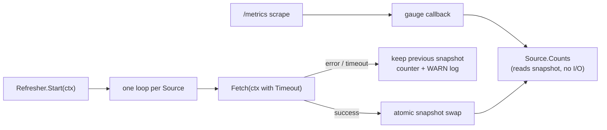

# Gauge Snapshot Refresher

## Purpose

`snapshot` lets an observable gauge report a value that comes from a slow
backend (the graph) without reading that backend during a `/metrics` scrape.
The reducer's `eshu_dp_edges_by_source_tool`, `eshu_dp_files_by_language`, and
`eshu_dp_graph_orphan_nodes` gauges use it (#7062): one stuck Bolt read used to
hold the metrics collection lock and wedge every scrape.

## Ownership boundary

This package owns the refresh loop, the atomic snapshot, and the three
`eshu_dp_gauge_snapshot_*` signals. It does not own the reads: callers pass a
`Fetch` that reads the backend, and the gauge registration stays in
`go/internal/telemetry` (`Register*ObservableGauge`).

## Flow

## Exported surface

- `Refresher`, `New(Config)`: build a refresher; `Config.Interval`,
  `Config.Timeout`, `Config.Meter`, `Config.Logger`, `Config.Now`.
- `Refresher.Register(name, Fetch) (*Source, error)`: add a source before
  `Start`; `name` is the bounded `gauge` label value.
- `Refresher.Start(ctx)` / `Refresher.Wait()`: start the loops once; `Wait`
  blocks until they exit after `ctx` ends.
- `Source.Counts(ctx)`: last published snapshot; `nil, nil` before the first
  success and once the snapshot is older than the max age (3x `Interval`, or
  `Interval + Timeout` if larger). The age gauge keeps reporting after expiry.
  Callers must not mutate the returned map.
- `OutcomeSuccess`, `OutcomeError`, `OutcomeTimeout`; `DefaultInterval` (5m),
  `DefaultTimeout` (30s).

## Concurrency

Each Source has exactly one refresh in flight, run by its own goroutine, and
the next read starts `Interval` after the previous one ends, so refreshes never
pile up. Sources are independent: a stuck read delays only its own Source. The
snapshot is an `atomic.Pointer` to an immutable value, so `Counts` never
blocks. `Fetch` must honor context cancellation; a `Fetch` that ignores it
stalls only its own loop and shows as a growing
`eshu_dp_gauge_snapshot_age_seconds`, never as a blocked scrape.

## Telemetry

| Signal | Labels | Meaning |
| --- | --- | --- |
| `eshu_dp_gauge_snapshot_refreshes_total` | `gauge`, `outcome` | Refreshes by result. |
| `eshu_dp_gauge_snapshot_refresh_duration_seconds` | `gauge`, `outcome` | Refresh read latency. |
| `eshu_dp_gauge_snapshot_age_seconds` | `gauge` | Age of the snapshot being served. |
| WARN `gauge snapshot refresh failed; keeping the last good snapshot until it expires` | `gauge`, `outcome`, `failure_class` | One per failed or timed-out refresh. |

A refresh cancelled by process shutdown is not counted or logged as a failure.

## Tests

`go test -race ./internal/telemetry/snapshot -count=1`.
