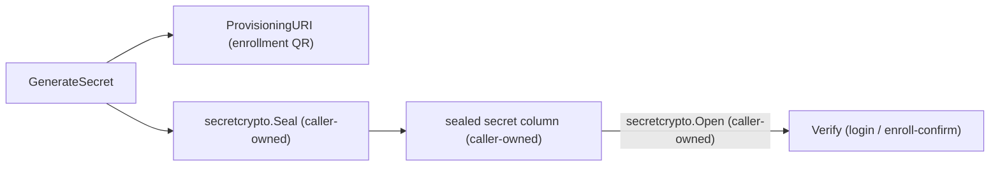

# totp

## Purpose

`totp` implements RFC 6238 Time-Based One-Time Passwords for Eshu's
authenticator-app MFA factor (issue #4986). It is a small, dependency-free
package: standard library only (`crypto/hmac`, `crypto/sha1`,
`crypto/subtle`, `crypto/rand`), no database, HTTP, or storage concerns.

Before this package, Eshu's only MFA factor was recovery codes
(`identity_mfa_recovery_codes`); there was no runtime TOTP verification.
This package is the cryptographic primitive `go/internal/storage/postgres`
(sealed-secret storage) and `go/internal/query` (enrollment/login endpoints)
build on.

## Exported surface

- `GenerateCode(secret []byte, t time.Time, step time.Duration, digits int) (string, error)`
  — RFC 4226 HOTP dynamic truncation over the RFC 6238 time-step counter,
  keyed by HMAC-SHA1. `digits` must be 6-8.
- `Verify(secret []byte, code string, t time.Time, step time.Duration, digits int, skewSteps int) (bool, error)`
  — checks `code` against a +/- `skewSteps` window of time steps around `t`,
  using `crypto/subtle.ConstantTimeCompare`. An empty code returns
  `false, nil`, never an error.
- `GenerateSecret() ([]byte, error)` — a fresh 20-byte (HMAC-SHA1-sized)
  `crypto/rand` secret.
- `ProvisioningURI(ProvisioningURIParams) (string, error)` — builds the
  `otpauth://totp/...` URI an authenticator app decodes from a QR code (the
  de facto ["Key Uri
  Format"](https://github.com/google/google-authenticator/wiki/Key-Uri-Format)).
  This package never renders a QR image; the console renders the QR
  client-side from this URI text.
- `DefaultDigits` (6), `DefaultStep` (30s), `DefaultSkewSteps` (1) — the
  approved production defaults (issue #4986 design).

## RFC conformance

`totp_test.go` verifies `GenerateCode` against the literal RFC 6238
Appendix B SHA1 test vectors (the RFC's own worked table, 8-digit
truncation, secret `"12345678901234567890"`):

| Unix time | Expected (8-digit) |
| --- | --- |
| 59 | 94287082 |
| 1111111109 | 07081804 |
| 1111111111 | 14050471 |
| 1234567890 | 89005924 |
| 2000000000 | 69279037 |
| 20000000000 | 65353130 |

A second test (`TestGenerateCode_SixDigitIsSuffixOfEightDigit`) proves the
production 6-digit path is the same computation: HOTP truncation is
`binary_code mod 10^digits`, and because `10^6` divides `10^8`,
`(x mod 10^8) mod 10^6 == x mod 10^6` — so the 6-digit code is always the
last six characters of the 8-digit RFC vector for the same input. This ties
the 6-digit production default back to the same RFC ground truth without a
separately-sourced (and easier to get wrong from memory) 6-digit vector
table.

## Secret handling

This package never persists, seals, or opens a secret. `GenerateSecret`
returns raw bytes; every caller is responsible for:

- sealing the secret at rest immediately (see `go/internal/secretcrypto`)
  before it is written to any column,
- opening it again only inside the single `Verify` call on the login or
  enroll-confirm path, and
- never logging, returning via a read API, or otherwise persisting the
  plaintext.

## Where this fits

## Dependencies

Standard library only. No internal package imports.

## Telemetry

None. This is a pure computation package with no I/O; telemetry for the
enrollment and login paths that call it belongs to those callers.
