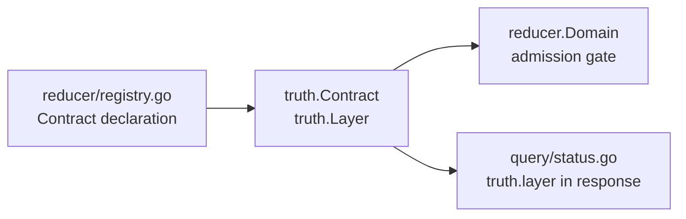

# Truth

## Purpose

`truth` owns the canonical truth contracts shared across Eshu: the layered
materialization contract and the unified evidence record. It defines the four
bounded source layers, a typed `Layer` enum with parse and validate helpers,
the `Contract` value that binds one canonical kind to the set of source layers
a reducer accepts as evidence, and the canonical `Evidence` value.

Every reducer registration, proof-domain assertion, and query-side
`truth.layer` / `truth.backend` response field reaches for these symbols
rather than redefining them locally.

### Canonical evidence (issue #3489)

`Evidence` is the single evidence record that carries BOTH a bounded `[0,1]`
`Confidence` AND a byte-level `Citation`, plus typed `Provenance`. It unifies
three former shapes that each carried only part of that contract:

| Former shape | Had | Lacked |
| --- | --- | --- |
| `relationships.EvidenceFact` | confidence, free-form `Details` | byte citation |
| `query.evidenceCitation` | path/line/hash/commit | confidence, provenance |
| documentation evidence packets | versioned finding model | unified citation+confidence |

`Citation` locates a file (`RepoID` + `RelativePath`) or an entity
(`EntityID`), then refines it with a line range, a byte offset/length window,
and the `ContentHash` / `CommitSHA` that pin the cited bytes. `Provenance`
records the `Basis` (source content, graph projection, assertion, derived),
`Rationale`, `Actor`, and `Source`.

## Where this fits

## Ownership boundary

`truth` owns the `Layer` enum and `Contract` struct. It does not own
reducer dispatch, proof-domain storage, or query response serialization.
The package has no internal-package imports and no runtime state.

## Exported surface

- `Layer` — string-typed enum for a bounded truth layer.
  Constants: `LayerSourceDeclaration`, `LayerAppliedDeclaration`,
  `LayerObservedResource`, `LayerCanonicalAsset`.
  Methods: `Layer.Validate`.
- `ParseLayer(raw string) (Layer, error)` — trims whitespace and validates
  one layer string against the known set.
- `Contract` — binds `CanonicalKind` (string) to `SourceLayers` ([]`Layer`).
  Methods: `Contract.Validate`, `Contract.Supports(layer Layer) bool`.
- `Evidence` — unified evidence record (`Kind`, `Confidence`, `Citation`,
  `Provenance`). Method: `Evidence.Validate`.
- `Citation` — byte-level source pointer. Method: `Citation.Validate`.
- `Provenance` — typed origin record. Method: `Provenance.Validate`.
- `ProvenanceBasis` — enum: `ProvenanceBasisSourceContent`,
  `ProvenanceBasisGraphProjection`, `ProvenanceBasisAssertion`,
  `ProvenanceBasisDerived`. Method: `ProvenanceBasis.Validate`.

See `doc.go` for the godoc contract.

## Dependencies

Standard library only (`fmt`, `strings`). No internal packages.

## Telemetry

None. This is a pure value-type package with no runtime I/O.

## Gotchas / invariants

- `LayerCanonicalAsset` is reducer output, not a source input.
  `Contract.Validate` (`model.go:60`) rejects it in `SourceLayers`. Registering
  a contract that cites `LayerCanonicalAsset` as a source layer will fail at
  domain registration time.
- `SourceLayers` must be non-empty and free of duplicates. `Contract.Validate`
  (`model.go:53`) enforces both checks before returning nil.
- `Contract.Supports` (`model.go:74`) is a linear scan over the slice. The
  slice is intentionally short; callers should not cache results.
- Adding a new layer requires updating the `Validate` switch in `model.go`,
  `ParseLayer`, and any downstream materialization that switches on `Layer`
  values.
- `Evidence.Validate` (`evidence.go`) bounds `Confidence` to `[0,1]` and
  rejects `NaN`; it does not fetch content, so a citation that passes
  `Citation.Validate` may still point at drifted or missing bytes. Consumers
  that hydrate content must re-check `ContentHash` / `CommitSHA`.

## Related docs

- `docs/public/architecture.md` — ownership table and pipeline overview
- `docs/public/reference/http-api.md` — `truth.layer` and `truth.backend`
  response fields
- `go/internal/reducer/README.md` — reducer domain registration and
  `Contract` usage
