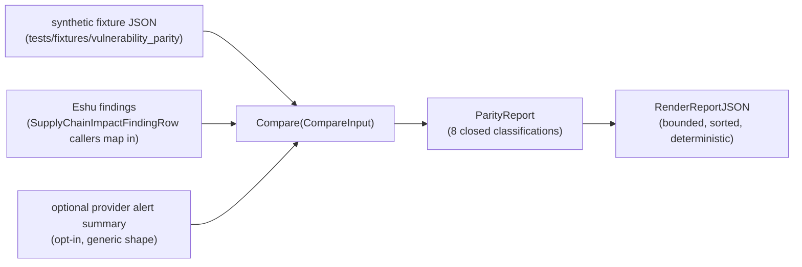

# Vulnerability Parity Gate

## Purpose

`internal/vulnerabilityparity` is the fixture-first parity gate that compares
Eshu vulnerability findings against expected fixture truth and optional
provider alert summaries. The gate exists so that Eshu's vulnerability output
can be promoted to a Kubernetes deployment only after Eshu has agreed with a
declared truth set, not after passing one provider integration.

The package owns three responsibilities:

1. A loader for synthetic fixture JSON that declares expected findings,
   supported ecosystems, and the evidence Eshu actually collected.
2. A pure `Compare` function that aligns expected, Eshu, and optional provider
   rows by `(advisory_id, package_id)` and classifies every row into one of
   eight closed categories.
3. A deterministic JSON report renderer suitable for CI artifacts and remote
   E2E evidence.

## Source-to-report flow

## Classification surface

| Class                              | Meaning                                                                              |
| ---------------------------------- | ------------------------------------------------------------------------------------ |
| `matched`                          | Expected fixture and Eshu agree on presence and status.                              |
| `provider_only`                    | Provider or fixture truth reports the finding; Eshu missed it despite evidence.      |
| `eshu_only`                        | Eshu produced a finding that neither expected truth nor provider reports.            |
| `fixed_dismissed_mismatch`         | Eshu and expected truth disagree on the open/fixed/dismissed lifecycle.              |
| `missing_dependency_evidence`      | Expected finding requires dependency facts Eshu did not collect.                     |
| `missing_advisory_evidence`        | Expected finding requires advisory source facts Eshu did not collect.                |
| `missing_sbom_image_evidence`      | Expected finding requires SBOM attestation or container image identity facts Eshu did not collect. |
| `unsupported_ecosystem`            | Expected ecosystem is not in the supported set, so Eshu intentionally produces no row. |

The set is closed. `Compare` never invents an unlisted class, and the fixture
loader rejects unknown statuses or unknown evidence families.

## Exported surface

- `SchemaVersion` — current fixture and report schema version (`1`).
- `Classification` and the eight `Class*` constants.
- `FindingStatus`, `EvidenceFamily`, and `FindingKey` — closed identity and
  state types.
- `ExpectedFinding`, `EshuFinding`, `ProviderAlert`, and `EvidenceCoverage` —
  the inputs the gate consumes.
- `FixtureSuite`, `CompareInput`, `ParityRow`, and `ParityReport` — the
  request and response shapes.
- `LoadFixtureSuite(path)` — parses one synthetic fixture file and rejects
  unknown statuses, unknown evidence families, and non-matching schema
  versions.
- `Compare(in)` — pure classifier that aligns expected, Eshu, and optional
  provider rows by `(advisory_id, package_id)` and returns a sorted report.
- `RenderReportJSON(report)` — emits bounded, sorted JSON suitable for CI
  artifacts.
- `ReportMaxRows` — bound on the size of a single rendered report.

See `doc.go` for the godoc contract.

## Dependencies

- Standard library only (`encoding/json`, `os`, `sort`, `strings`, `time`).
- No runtime, storage, queue, query, graph, or collector imports. Callers
  responsible for mapping a real Eshu finding (such as
  `SupplyChainImpactFindingRow`) into `EshuFinding` keep this package decoupled
  from runtime state.

## Telemetry

This package emits no metrics, spans, or logs because it is a deterministic
analyzer. Hosted runtimes that adopt the gate own their own observability
contract.

Collector Performance Evidence:
`go test ./internal/vulnerabilityparity -count=1` exercises the closed
classifier surface, fixture loader rejection paths, deterministic JSON
rendering, the `ReportMaxRows` bound, and the manifest walker over the eight
synthetic suites under `tests/fixtures/vulnerability_parity`.

No-Observability-Change: this package is not mounted as a runtime service and
does not extend the telemetry contract. The diagnosable surface is the
returned error and the rendered `ParityReport`.

## Gotchas / invariants

- Fixtures committed to the repository MUST be synthetic. The Go manifest test
  and `scripts/verify_vulnerability_parity_fixtures.sh` both reject fixtures
  containing real package registry URLs, real GitHub or GitLab URLs, the NVD
  domain, or tokens with prefixes like `ghp_`, `github_pat_`, or `glpat-`.
- Provider input is opt-in. A caller that does not pass `ProviderAlert` rows
  gets a fixture-vs-Eshu comparison; no third-party API is contacted by this
  package.
- Identity is `(advisory_id, package_id)`. Callers normalize advisory and
  package identifiers before constructing inputs; the gate trims surrounding
  whitespace and rejects missing identifiers.
- Status comparison is lifecycle-aware. `open`, `fixed`, and `dismissed` are
  the only accepted statuses; anything else is a fixture authoring error.
- Evidence semantics. `EvidenceSBOM` and `EvidenceImage` are treated as
  one combined family by the classifier; either evidence covers an
  expected finding that lists both.
- Determinism. `Compare` sorts the row list by `(advisory_id, package_id)`
  and `RenderReportJSON` further sorts by class so two runs with identical
  inputs produce byte-identical output (except `generated_at`, which callers
  may zero before rendering for golden-file diffs).
- Bounds. `RenderReportJSON` refuses to serialize more than `ReportMaxRows`
  rows so a runaway suite cannot bloat a CI artifact.
- Schema. `Compare` rejects any fixture whose `schema_version` does not
  match `SchemaVersion`, so bumping the gate schema forces fixtures to
  migrate before CI passes.

## Related docs

- `docs/public/reference/vulnerability-parity-gate.md`
- `docs/public/reference/collector-reducer-readiness.md`
- `tests/fixtures/vulnerability_parity/manifest.json`
- `scripts/verify_vulnerability_parity_fixtures.sh`
