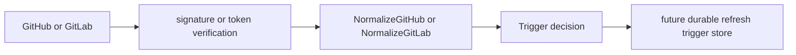

# Webhook Package

This package is the provider-facing normalization layer for the webhook
listener runtime. It verifies provider authentication inputs, parses GitHub and
GitLab payloads, and returns a `Trigger` that says whether the event should
create repository refresh work.

The package does not enqueue work, write graph data, or decide repository
truth. It only turns a verified provider delivery into an accepted or ignored
refresh decision.

## Flow

## Exported Surface

- `VerifyGitHubSignature` accepts only `X-Hub-Signature-256` HMAC-SHA256
  signatures.
- `VerifyGitLabToken` compares `X-Gitlab-Token` against the configured shared
  secret.
- `NormalizeGitHub` accepts GitHub push events and merged pull request events
  that target the repository default branch.
- `NormalizeGitLab` accepts GitLab push events and merged merge request events
  that target the repository default branch.
- `Trigger` carries provider, delivery, repository, ref, target SHA, sender, and
  decision fields for the later durable trigger handoff.
- `StoredTrigger` adds durable trigger IDs, refresh keys, status, duplicate
  count, and timestamps after persistence owns the decision.

## Invariants

- A webhook is a wake-up signal only. The collector must still fetch git state,
  create a repository snapshot, emit facts, and let projection update graph and
  content state.
- Tag events, non-default branch events, default-branch deletes, and merge
  events without a provider merge commit are ignored with explicit
  `DecisionReason` values.
- GitHub SHA-1 signatures are rejected so the listener cannot downgrade
  authentication.
- Repository provider ID, repository full name, and default branch are required
  before a `Trigger` can be accepted or ignored.

## Operational Notes

The runtime that calls this package should emit metrics and structured logs
around verification failures, ignored reasons, accepted triggers, duplicate
deliveries, and durable handoff failures. Metric labels should use bounded
values such as provider, event kind, decision, and reason; repository names,
delivery IDs, and SHAs belong in logs or spans.
