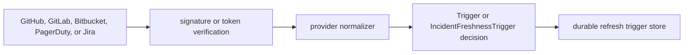

# Webhook Package

This package is the provider-facing normalization layer for the webhook
listener runtime. It verifies provider authentication inputs, parses GitHub,
GitLab, Bitbucket, PagerDuty, Jira, Azure DevOps, Jenkins, CircleCI,
Buildkite, and Drone payloads, and returns a `Trigger` or
`IncidentFreshnessTrigger` that says whether the event should create refresh
work.

The package does not enqueue work, write graph data, or decide repository
truth. It only turns a verified provider delivery into an accepted or ignored
refresh decision.

## Flow

## Exported Surface

- `VerifyGitHubSignature` accepts only `X-Hub-Signature-256` HMAC-SHA256
  signatures.
- `VerifyGitLabToken` compares `X-Gitlab-Token` against the configured shared
  secret.
- `VerifyBitbucketSignature` accepts Bitbucket Cloud `X-Hub-Signature`
  HMAC-SHA256 signatures.
- `VerifyPagerDutySignature` accepts PagerDuty `X-PagerDuty-Signature`
  HMAC-SHA256 signatures with the `v1=` header value.
- `VerifyJiraSignature` accepts Jira Cloud `X-Hub-Signature` HMAC-SHA256
  signatures.
- `NormalizeGitHub` accepts GitHub push events and merged pull request events
  that target the repository default branch.
- `NormalizeGitLab` accepts GitLab push events and merged merge request events
  that target the repository default branch.
- `NormalizeBitbucket` accepts Bitbucket Cloud push events and fulfilled pull
  request events that target the repository default branch.
- `NormalizePagerDutyIncidentFreshness` accepts verified PagerDuty webhook
  deliveries as incident-source collector wake-ups.
- `NormalizeJiraIncidentFreshness` accepts verified Jira issue created,
  updated, and deleted webhook deliveries as work-item-source collector
  wake-ups.
- `NormalizeAzureDevOps` accepts Azure DevOps `git.push` events and
  `git.pullrequest.updated` events (completed and merge-succeeded) that target
  the repository default branch.
- `NormalizeJenkins` accepts Jenkins Generic Webhook Trigger `push` and `merge`
  events that target the repository default branch.
- `NormalizeCircleCI` accepts CircleCI `workflow-completed` events, extracting
  git revision, branch, and tag information from `pipeline.vcs` fields.
- `NormalizeBuildkite` accepts Buildkite `build.finished` and `build.running`
  events, extracting commit SHA and branch from `build` fields.
- `NormalizeDrone` accepts Drone `build.success` and `build.failure` events for
  both `push` and `pull_request` builds, extracting branch, target, and commit
  SHAs from `build` fields.
- `ErrUnsupportedIncidentFreshnessEvent` marks verified provider deliveries
  that are not allowed to wake an incident-source collector.
- `Trigger` carries provider, delivery, repository, ref, target SHA, sender,
  decision fields, and bounded merged-PR provenance for the later durable
  trigger handoff.
- `StoredTrigger` adds durable trigger IDs, refresh keys, status, duplicate
  count, and timestamps after persistence owns the decision.
- `IncidentFreshnessTrigger` carries provider, event, delivery, configured
  scope, bounded source resource ID, and observed-at metadata only. Jira
  self-only issue URLs are represented by fingerprints, not raw URLs.
- `StoredIncidentFreshnessTrigger` adds durable delivery and freshness keys,
  status, duplicate count, and timestamps after persistence owns the decision.

## Invariants

- A webhook is a wake-up signal only. The collector must still fetch git state,
  create a repository snapshot, emit facts, and let projection update graph and
  content state.
- Merged GitHub pull-request number, URL, and title fields are provider
  provenance for read-model enrichment. They do not skip repository refresh or
  create graph truth directly.
- Tag events, non-default branch events, default-branch deletes, and merge
  events without a provider merge commit are ignored with explicit
  `DecisionReason` values.
- GitHub and Bitbucket SHA-1 signatures are rejected so the listener cannot
  downgrade authentication.
- Repository provider ID, repository full name, and default branch are required
  before a `Trigger` can be accepted or ignored.
- PagerDuty and Jira webhook payloads are scoped refresh triggers only. They do
  not create incident, change, work-item, pull-request, deployment, image, or
  code facts.
- Jira project, board, sprint, version, user, and other non-issue webhooks are
  rejected as unsupported collector wake-ups.
- Incident freshness requires a configured collector `scope_id`; the coordinator
  later rejects stale or unauthorized scope IDs before creating collector work.

## Operational Notes

The runtime that calls this package should emit metrics and structured logs
around verification failures, ignored reasons, accepted triggers, duplicate
deliveries, and durable handoff failures. Metric labels should use bounded
values such as provider, event kind, decision, and reason; repository names,
delivery IDs, and SHAs belong in logs or spans.
