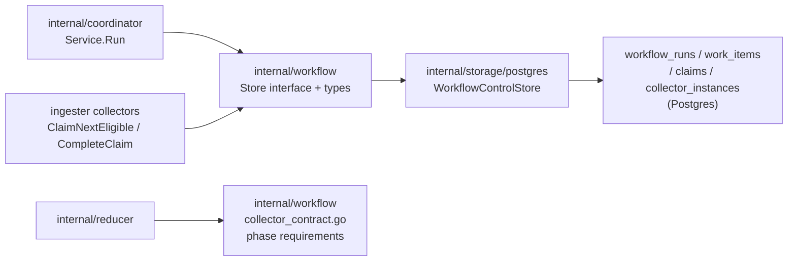
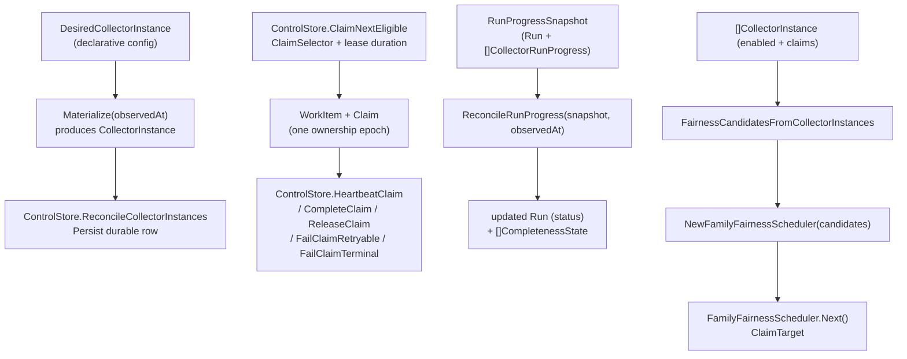

# Workflow

## Purpose

`internal/workflow` defines the durable contracts for the workflow control
plane: runs, work items, claims, collector instances, completeness states, the
`ControlStore` surface, and the reducer-facing phase contract per collector
family. All types are storage-neutral value types with `Validate` methods;
this package never opens database connections.

## Where this fits in the pipeline

## Internal flow

## Lifecycle / workflow

Types in this package flow through four phases of the workflow control plane:

1. **Collector registration** — `DesiredCollectorInstance` represents declarative
   configuration. `Materialize(observedAt)` binds it to a timestamp and produces
   a `CollectorInstance` suitable for `ControlStore.ReconcileCollectorInstances`.

2. **Work intake** — a caller creates a `Run` and calls
   `ControlStore.EnqueueWorkItems` with a slice of `WorkItem` rows. Each
   `WorkItem` carries identity (`WorkItemID`, `RunID`, `CollectorKind`,
   `CollectorInstanceID`), a `FairnessKey` for cross-instance routing and
   operator status grouping, and a `WorkItemStatus` lifecycle value. Package
   registry and vulnerability planners include target class in that key so
   direct, owned-package, and broad fanout work can be read separately from
   durable queue rows. Terraform-state work is planned before the state file is
   opened, so its initial `GenerationID` and `SourceRunID` use a candidate
   planning ID. The collector replaces that planning identity with the real
   state generation after reading the state serial and lineage.

3. **Claim lifecycle** — collector actors call `ControlStore.ClaimNextEligible`
   with a `ClaimSelector` to acquire a `WorkItem` and `Claim`. They advance the
   claim via `HeartbeatClaim`, `CompleteClaim`, `ReleaseClaim`,
   `FailClaimRetryable`, or `FailClaimTerminal` using a `ClaimMutation` carrying
   the `FencingToken` for optimistic concurrency. Hosted claim-aware collectors
   also copy tenant, workspace, subject-class, and policy-revision identity into
   the mutation so storage can re-check the active grant at fact commit time.
   The coordinator's `ControlStore.ReapExpiredClaims` reclaims ownership of
   claims whose `LeaseExpiresAt` has passed.

4. **Run progress and completeness** — reducer phases publish checkpoints that
   the coordinator observes. `ReconcileRunProgress(snapshot, observedAt)` takes
   a `RunProgressSnapshot` (a `Run` plus per-collector counts, published phase
   counts, and terminal reducer dead-letter counts) and derives an updated
   `Run.Status` and a sorted slice of `CompletenessState` rows. Terminal
   collector failures produce blocked completeness rows before downstream
   phases can be marked ready. So does a terminal reducer dead-letter on a
   required, bridged phase (`PhaseRequirement.DeadLetterDomain`,
   `CollectorRunProgress.TerminalDeadLetterCounts`) — see issue #4459: before
   this bridge, a permanently dead-lettered reducer intent (`fact_work_items`,
   `status = 'dead_letter'`) never published its phase, so the phase stayed
   pending forever and the run wedged in `reducer_converging` with no
   terminal signal. Only a confirmed `dead_letter` row on a phase whose
   `PhaseRequirement.DeadLetterDomain` names the exact reducer domain that
   owns it may trip this; a still-retrying row, or a dead-letter on a
   non-bridged phase, leaves the phase merely `pending` so in-flight work is
   never mistaken for a permanent block. The transition table:

   | Condition | `RunStatus` |
   |---|---|
   | any `failed_terminal` work items, or a required phase's owning reducer domain has a terminal dead-letter | `failed` |
   | all collection complete + all required phases ready | `complete` |
   | all collection complete, some phases pending | `reducer_converging` |
   | any claimed or mix of pending/completed | `collection_active` |
   | no collectors yet | `collection_pending` |

## Exported surface

**Status enums** (all carry `Validate` methods):
- `CollectorMode` — `continuous`, `scheduled`, `manual`
- `TriggerKind` — `bootstrap`, `schedule`, `webhook`, `replay`,
  `operator_recovery`
- `RunStatus` — `collection_pending`, `collection_active`,
  `collection_complete`, `reducer_converging`, `complete`, `failed`
- `WorkItemStatus` — `pending`, `claimed`, `completed`, `failed_retryable`,
  `failed_terminal`, `expired`
- `ClaimStatus` — `active`, `completed`, `failed_retryable`,
  `failed_terminal`, `expired`, `released`

**Durable value types** (all carry `Validate` methods):
- `Run` — root record for one workflow execution
- `WorkItem` — bounded collector slice unit; carries `FencingToken` and
  `CurrentClaimID`
- `Claim` — one ownership epoch for a `WorkItem`; carries `FencingToken` for
  safe concurrent mutation
- `DesiredCollectorInstance` — declarative config shape; `Materialize` binds to
  a timestamp
- `CollectorInstance` — durable row; adds `LastObservedAt`, `DeactivatedAt`
- `CompletenessState` — one reducer-phase checkpoint row per collector kind per
  keyspace per phase

**Store surface**:
- `ControlStore` — the full durable surface (thirteen methods) implemented by
  `storage/postgres`
- `ClaimSelector`, `ClaimMutation`, `ClaimedWorkItem` — claim operation
  arguments and return shapes; hosted `ClaimMutation` values carry the optional
  tenant boundary as an all-or-none group for commit-time grant checks
- `ClaimMutation.Resolved*` — optional completion-time phase identity fields
  used when planned work cannot know the final reducer checkpoint tuple until
  source open. Terraform-state claims use these fields to replace candidate
  planning IDs with the real snapshot scope/generation before reconciliation.

**Phase contract**:
- `CollectorContract`, `CollectorContractFor`, `CanonicalKeyspacesForCollector`,
  `RequiredPhasesForCollector` — lookup table of required reducer phases per
  collector family; registered entries: `CollectorGit`,
  `CollectorTerraformState`, `CollectorAWS`, `CollectorGCP`, `CollectorWebhook`,
  `CollectorDocumentation`, `CollectorOCIRegistry`, `CollectorPackageRegistry`,
  `CollectorVulnerabilityIntelligence`, `CollectorSBOMAttestation`,
  `CollectorSecurityAlert`, `CollectorCICDRun`, `CollectorPagerDuty`,
  `CollectorJira`, `CollectorScannerWorker`
- `PhaseRequirement`, `PhasePublicationKey` — per-phase requirement and
  publication checkpoint key types. `PhaseRequirement.DeadLetterDomain` names
  the sole reducer `Domain` that owns publishing that phase, when known; blank
  means no reducer domain is bridged yet, so a dead-letter can never be
  attributed to that phase (fails closed, never a false block). Currently
  bridged: `DomainDeploymentMapping` and `DomainWorkloadMaterialization` on
  `CollectorGit` (#4459).

**Run progress**:
- `CollectorRunProgress`, `RunProgressSnapshot` — inputs to `ReconcileRunProgress`.
  `CollectorRunProgress.TerminalDeadLetterCounts` carries, per bridged
  `PhasePublicationKey`, how many same-scope-generation `fact_work_items` rows
  are genuinely terminal (`status = 'dead_letter'`) for that phase's owning
  reducer domain. Populate this ONLY from a confirmed terminal dead-letter —
  never from a retrying, pending, claimed, or running row.
- `ReconcileRunProgress(snapshot, observedAt)` — pure derivation of `Run` status
  and completeness rows
- `CompletenessStatusPending`, `CompletenessStatusReady`,
  `CompletenessStatusBlocked` — status constants

**Fairness scheduling**:
- `FairnessCandidate`, `ClaimTarget` — input and output of the scheduler
- `FamilyFairnessScheduler`, `NewFamilyFairnessScheduler` — deterministic
  weighted round-robin across collector families; rotation within each family
- `FairnessCandidatesFromCollectorInstances` — extracts claim-enabled durable
  instances into `FairnessCandidate` slices

`collector.FairClaimDispatcher` is the production claim-dispatch boundary that
uses these scheduler values. It chooses the next target, then calls
`ClaimNextEligible` for that target so lease fencing, retry, terminal failure,
and completion stay in the existing claim lifecycle.

`DesiredCollectorInstance.Validate` applies a stricter configuration check for
`terraform_state` instances. A Terraform state collector must declare a
`discovery` block with graph discovery, explicit seeds, or local repo limits.
S3 seeds must include bucket, key, and region; any S3 seed also requires
`aws.role_arn`. This keeps unsafe or incomplete state-reader config out of the
durable `collector_instances` table.

Enabled `pagerduty` collector instances must declare at least one target with
`provider`, `scope_id`, `account_id`, and `token_env`. Optional `api_base_url`
overrides must use HTTPS and must not include credentials. Request limits,
lookback duration, source URIs, and optional live-configuration validation
limits are validated before the instance reaches durable storage.
`config_validation_enabled` opts a target into live PagerDuty service and
service-integration metadata collection, and `config_resource_limit` keeps that
read bounded to the same 0-100 page limit family as incident, log-entry, and
change-event reads.
Disabled `pagerduty` and `jira` instances are registration-only. Their durable
identity, kind, mode, and JSON shape must be valid, but private target fields
can stay blank until the instance is enabled.

`oci_registry` collector instances are claim-capable. The coordinator plans one
bounded work item per configured registry repository target, and the
`collector-oci-registry` runtime resolves each claimed `scope_id` back to a
configured target before scanning. OCI registry instances still declare no
reducer phase requirements until registry facts have a graph projection
contract.

`package_registry` collector instances are claim-capable. The coordinator plans
one bounded work item per configured package/feed target, and the
`collector-package-registry` runtime resolves each claimed `scope_id` back to a
configured metadata endpoint before parsing package-native evidence. Targets
may opt into `document_format=artifactory_package` when the response is a
JFrog wrapper around native metadata; unknown document formats are rejected
before planning. Targets may also opt into `derive_from_owned_packages` for
bounded package metadata planning from active owned Git dependency facts for
npm, PyPI, Go modules, Maven, NuGet, Composer, RubyGems, and Cargo.
Package-registry derivation selects package identities, not package-version
rows, so one heavily reused package cannot consume the whole planning budget.
Derived npm and PyPI targets have native metadata URLs today; derived Go
module, Maven, NuGet, Composer, RubyGems, and Cargo targets are planned as
identity evidence and complete with explicit missing-evidence warnings until
native metadata adapters land. When `version_limit` is omitted, the runtime
keeps one registry version for fetched metadata and leaves exact
installed-version truth to source dependency facts and vulnerability-intelligence
OSV query batches. Explicit package-registry targets can still set a higher
`version_limit` when the goal is targeted registry version/dependency
inspection.
Package registry instances are fact-only until reducer correlation and graph
projection contracts land.

`vulnerability_intelligence` collector instances are claim-capable. The
coordinator plans one bounded work item per configured vulnerability source
target. When `derive_from_owned_packages.enabled=true`, the planner can derive
OSV package-version targets for npm, PyPI, Go modules, Maven, NuGet, Composer,
RubyGems, Cargo, Pub, Hex, and Swift from active owned dependency facts only
when the dependency carries an exact version. Go rows must keep a usable
module-version string such as `v0.17.0`. Pub rows are planned from hosted
`pubspec.lock` evidence and keep canonical ecosystem `pub`. Swift rows are
planned from remote source-control `Package.resolved` pins and keep canonical
ecosystem `swift`; the coordinator carries the dependency `source_location` as
the OSV package name, and the runtime maps those queries to OSV's `SwiftURL`
ecosystem. Manifest ranges, aliases, workspace references, file/git references,
Pub dependency overrides, branch-only Swift pins, revision-only Swift pins,
local/path Swift pins, malformed versions, and `latest` remain partial evidence
and are not promoted into OSV package-version collection targets. Exact
package-version queries are grouped into bounded OSV querybatch work items when
the scope ID remains storage-safe, preserving installed-version truth without
issuing one claim per package version. The configuration can also declare
`derive_from_installed_evidence.enabled=true`; that path derives OSV targets
from active installed OS package facts and attached SBOM component facts only
when the owning evidence proves the ecosystem/source family, exact installed
version, and subject attachment. OS package rows require vendor repository
classification, vendor advisory source, package manager, package name, exact
installed version, and image/scope subject evidence. SBOM component rows require
an attached subject digest plus PURL-derived package ecosystem, name, and exact
version. Partial installed-evidence rows stay skipped with stable aggregate
reason codes by ecosystem and source family, without package names or versions
in skip status.
The configuration can also declare
`source_cache` for refresh or offline advisory-source cache lifecycle and
`fallback_urls` for source mirrors; validation keeps cache modes, durations,
and mirror URLs bounded before the desired collector instance is persisted.
Derived package and vulnerability target reads rotate their bounded slice on
each coordinator reconcile bucket by default, so a target limit smaller than
the full corpus does not repeatedly schedule only the first sorted page. Set
`derive_from_owned_packages.planning_mode=single_pass` or
`derive_from_installed_evidence.planning_mode=single_pass` only for bounded
representative proofs that must keep the total derived target set fixed across
reconcile buckets.

`scanner_worker` work items reserve the workflow boundary for isolated security
analyzers. A scanner-worker claim copies the active work item, claim ID,
fencing token, bounded target scope, and resource limits into the analyzer
input. The collector contract intentionally declares no canonical keyspaces and
no required reducer phases. Scanner workers commit source facts only; reducers
own finding admission, prioritization, and graph/read-model truth.

`pagerduty` collector instances are claim-capable. The coordinator plans
bounded PagerDuty account or service-allowlist work from configured targets,
and the `collector-pagerduty` runtime resolves each claimed `scope_id` back to
a configured target before fetching incidents, incident log entries, and
related change events. PagerDuty instances are fact-only until incident-context
correlation and query contracts land.

`jira` collector instances are claim-capable. Enabled instances must declare
configured Jira Cloud site targets before reaching durable storage. The target
JQL source may be a direct `jql` string or a `jql_env` variable name; workflow
validation accepts the variable name without resolving it, and `collector-jira`
resolves the actual query at runtime. The coordinator plans one bounded work
item per configured target, and the `collector-jira` runtime resolves each
claimed `scope_id` back to a configured Jira target before fetching updated
issues, changelogs, and remote links. The collector contract declares no
canonical keyspaces and no required reducer phases. Jira commits work-item
source facts only; reducers and query surfaces own incident, runtime, code,
and pull-request correlation truth.

`aws` collector instances are claim-capable. The coordinator plans one bounded
work item per authorized `(account_id, region, service_kind)` tuple, and the
`collector-aws-cloud` runtime commits durable facts such as `aws_resource`,
`aws_relationship`, `aws_tag_observation`, and `aws_warning` for each claim,
and updates `aws_scan_status` rows for the scanner status/read model. AWS
workflow completion is fact-backed in the current runtime: the cloud-resource
graph projection and DSL anchor contracts are scaffolded, but no live runtime
publishes `cloud_resource_uid` phase rows yet. Do not require those phases for
AWS workflow-run completion until the cloud-resource graph writer and anchor
publisher are implemented and wired.

`gcp` collector instances are known to the workflow contract for fixture-backed
facts and gated live Cloud Asset Inventory work. The coordinator may plan
claimable GCP work only when the collector instance explicitly opts into live
collection, but the workflow contract still declares no canonical keyspaces and
no required reducer phases. Do not add graph-readiness requirements until a GCP
cloud-resource graph writer and anchor publisher are implemented.

**Defaults**:
- `DefaultClaimLeaseTTL()` — 60s
- `DefaultHeartbeatInterval()` — 20s
- `DefaultReapInterval()` — 20s
- `DefaultExpiredClaimLimit()` — 100
- `DefaultExpiredClaimRequeueDelay()` — 5s
- `DefaultClaimMaxAttempts()` — 10 (bounded retry budget per work item;
  `collector.ClaimedService.MaxAttempts` escalates to terminal once a work
  item's AttemptCount reaches this value, with class
  `attempt_budget_exhausted`. Before this guard existed, the runtime could
  drive `workflow_claims.failed_retryable` into the millions on a single
  permanent retryable failure — see issue #612.)

## Dependencies

- `internal/reducer` — `GraphProjectionKeyspace` and `GraphProjectionPhase`
  identifiers used in the phase contract and `CompletenessState`
- `internal/scope` — `CollectorKind` used throughout

## Telemetry

None. The coordinator (`internal/coordinator`) and storage
(`internal/storage/postgres`) layers own telemetry around these contracts.

## Operational notes

- `ReconcileRunProgress` is a pure function. Feed it a fresh
  `RunProgressSnapshot` from the store and compare the returned `Run.Status`
  to the current durable row to determine whether an update is needed.
- `CollectorRunProgress.PublishedPhaseCounts` must be keyed by
  `PhasePublicationKey` values from `RequiredPhasesForCollector`. A missing key
  counts as zero published items and keeps the phase in `pending`.
- Terraform-state readiness follows `internal/reducer/tfstate` and currently
  requires only the `terraform_resource_uid` and `terraform_module_uid`
  `canonical_nodes_committed` checkpoints. `cross_source_anchor_ready` belongs
  to the DSL layer and must not be required for Terraform-state run completion
  unless that runtime starts publishing it.
- AWS readiness currently has no operational workflow completeness phases. The
  `internal/reducer/aws` package is scaffold-only; until a live AWS reducer or
  projector publishes `cloud_resource_uid` phase rows, completed AWS workflow
  work items must not wait on those future checkpoints.
- GCP readiness currently has no operational workflow completeness phases. GCP
  may be planned by the coordinator only through explicit live opt-in, and
  completed GCP workflow work items must not wait on future graph checkpoints.
- `CompletenessState` rows from `ReconcileRunProgress` are sorted by
  `CollectorKind`, `Keyspace`, `PhaseName` — callers can compare slices
  element-by-element for drift detection.

No-Regression Evidence: the Terraform-state workflow completion fix is covered
by
`go test ./internal/workflow ./internal/collector ./internal/collector/tfstateruntime ./internal/storage/postgres -run 'TestRequiredPhasesForCollectorMatchesTerraformStateReducerContract|TestClaimedServiceCompletesUnchangedTerraformStateClaimWithoutCommit|TestClaimedServiceCompletesTerraformStateClaimWithResolvedProjectionIdentity|TestClaimedSourceCompletesS3NotModifiedCandidateWhenPriorGenerationKnown|TestWorkflowControlStoreIntegrationCompleteClaimCanResolveProjectionIdentity' -count=1`.
The Postgres identity mutation was also exercised with
`ESHU_POSTGRES_DSN=postgres://... go test ./internal/storage/postgres -run TestWorkflowControlStoreIntegrationCompleteClaimCanResolveProjectionIdentity -count=1 -v`
against a throwaway Postgres container.
The test set proves the phase contract matches the reducer-owned Terraform
state checkpoints, candidate-scoped claims complete with the real snapshot
identity, S3 not-modified claims carry prior-generation identity, and Postgres
stores the resolved phase tuple under the same claim fence. It changes no
worker counts, claim ordering, scan cardinality, graph writes, or NornicDB
settings.

`sbom_attestation` collector instances are claim-capable. The coordinator plans
one bounded work item per configured SBOM or attestation source target. The
runtime fetches configured HTTP(S) documents or OCI referrer artifact blobs,
emits `sbom.*` and `attestation.*` source facts, and leaves reducer attachment
truth to the SBOM attestation attachment reducer. Parser-emitted SBOM documents
remain unverified unless separate attestation or signature verification facts
support a promotion.

`security_alert` collector instances are claim-capable. The coordinator plans
one bounded work item per configured GitHub Dependabot repository-alert target.
Targets must name a credential environment variable and an explicit repository
allowlist. Optional `api_base_url` values must use HTTPS because the collector
sends the bearer token to that endpoint; `source_uri` remains a source-document
identifier and may point at HTTP fixtures.

Observability Evidence: no new metrics were required. Existing workflow-run
status, workflow completeness rows, workflow work-item identity columns,
claim-fence mutation errors, `/api/v0/index-status`, and the remote runtime
state gate expose whether Terraform-state claims are still collecting,
completed, blocked, or stuck in reducer convergence.

No-Regression Evidence: `go test ./internal/workflow -run 'TestReconcileRunProgressCompletesAWSWithoutImplementedGraphPhases|TestCollectorContractForAWSHasNoOperationalGraphReadinessUntilProjectionLands' -count=1`
proves completed AWS collector work reaches terminal workflow status without
waiting on unimplemented `cloud_resource_uid` graph phase rows. The change does
not alter claim ordering, AWS scan fan-out, fact commit shape, reducer queue
claiming, worker counts, graph writes, or NornicDB settings.

Observability Evidence: no new metrics were required. Existing
`workflow_runs`, `workflow_work_items`, `aws_scan_status`,
`eshu_dp_aws_resources_emitted_total`, `eshu_dp_aws_relationships_emitted_total`,
`eshu_dp_aws_tag_observations_emitted_total`, AWS runtime-drift reducer logs,
and `/api/v0/index-status` separate collector completion, fact emission, scan
health, drift read-model publication, and future graph-readiness gaps.

No-Regression Evidence: `go test ./internal/workflow -run 'TestCollectorContractForGCPHasNoOperationalGraphReadinessUntilSchedulerLands' -count=1`
proves GCP is registered as a known collector contract with no canonical
keyspaces or reducer phase requirements. The change does not add live GCP SDK
calls, credentials, provider I/O, workflow planning, graph writes, read-model
writes, queue claiming, worker counts, or NornicDB settings.

No-Observability-Change: GCP remains non-operational and claim-disabled at the
coordinator boundary, so there is no new runtime path to instrument. Existing
coordinator startup validation errors and collector-instance config surfaces
are the only operator-facing signals for this blocked activation state.

No-Regression Evidence: the owned package target derivation contract is covered
by `go test ./internal/coordinator ./internal/workflow ./internal/storage/postgres ./internal/collector/packageregistry/packageruntime ./internal/collector/vulnerabilityintelligence/vulnruntime ./cmd/workflow-coordinator ./cmd/collector-package-registry ./cmd/collector-vulnerability-intelligence -count=1`.
The test set proves package-registry planning derives unique metadata targets
from active owned package evidence across npm, PyPI, Go modules, Maven, NuGet,
Composer, RubyGems, and Cargo; vulnerability planning derives OSV
targets only for exact owned npm, PyPI, Go, Maven, NuGet, Composer, RubyGems,
Cargo, Pub, Hex, and Swift versions, range and alias dependencies stay out of
exact vulnerability collection, skipped exact-query candidates carry stable
reason counts by ecosystem, source-backed Swift package names with slashes are
encoded into storage-safe `scope_id` values, the coordinator passes active
owned dependency rows to both planners, and both hosted collector commands parse
the new derivation config. Planning remains bounded by
`derive_from_owned_packages.target_limit`; the default remains 100 derived
targets, and operators can explicitly raise the cap up to 5000 for full-corpus
proofs. Package-registry derivation reads package-level identities and defaults
omitted derived `version_limit` values to one registry version when metadata is
fetched. Vulnerability derivation reads exact package-version identities and
batches them into storage-safe OSV querybatch work items, and the coordinator
rotates each bounded read by reconcile bucket. This does not change worker
counts, claim leases, graph writes, reducer queues, or NornicDB settings.

Observability Evidence: no new metrics were required. Existing workflow run
rows, work-item rows, `requested_scope_set` payloads, coordinator reconcile
metrics, collector claim status, package-registry request/fact/rate-limit
metrics, vulnerability-intelligence observation/fetch/fact metrics, and
`/api/v0/index-status` expose planned, skipped, rate-limited, failed, completed,
and stuck target states. `requested_scope_set.skipped_targets` reports skipped
vulnerability derivation counts by ecosystem and reason without package names or
versions. `/admin/status?format=json` also exposes
package-registry metadata target counts by ecosystem without putting package
names, versions, feed URLs, or credential material in metric labels.

No-Regression Evidence: `go test ./internal/coordinator ./internal/workflow -run 'Test(ServiceRunActiveModeSinglePass(PackageRegistry|Vulnerability)DerivedBudgetDoesNotAdmitNextBucket|PackageRegistryCollectorConfigurationRejectsUnknownDerivedPlanningMode|VulnerabilityIntelligenceCollectorConfigurationRejectsUnknownDerivedPlanningMode)' -count=1` proves representative single-pass derived target planning keeps the same run key and zero rotation offset across reconcile buckets, while config validation rejects unsupported planning modes. The default mode remains rotating, so hosted collectors can continue progressing through larger corpora.

No-Regression Evidence: `go test ./internal/coordinator ./internal/workflow ./internal/storage/postgres ./internal/collector/vulnerabilityintelligence/vulnruntime ./cmd/workflow-coordinator ./cmd/collector-vulnerability-intelligence -run 'InstalledEvidence|OSPackageAdvisory|SBOMComponentAdvisory|DerivedInstalledEvidence|TestOSVQueryEcosystemMapsInstalledOSEcosystems|VulnerabilityIntelligenceCollectorConfigurationAcceptsInstalledEvidenceDerivation|TestMapConfigAcceptsInstalledEvidenceDerivation' -count=1` proves installed OS package and SBOM component derivation admits only exact source-owned evidence, batches OSV query scopes where supported, preserves stable skip reason counts, and maps distro ecosystems to OSV query names.

Observability Evidence: installed-evidence derivation reuses workflow run
`requested_scope_set`, work-item status, collector claim status, source
snapshot, fetch duration, fact-emitted, rate-limit, and `/api/v0/index-status`
signals. No new metric labels were added; skipped-target status is aggregated
by reason, ecosystem, source family, collector kind, target class, source, and
selected/limit counts only.

Observability Evidence: no new metrics were required. Single-pass proof mode is visible in collector instance configuration, stable workflow run IDs, zero-offset target-reader requests in tests, and `/api/v0/index-status` queue totals. The remote runtime-state gate now fails representative proofs whose outstanding queue grows beyond the configured derived-target budget guard.

No-Regression Evidence (#4459): `go test ./internal/workflow -run
'TestReconcileRunProgressTerminalReducerDeadLetterBlocksConvergence|TestReconcileRunProgressRetryableDeadLetterDoesNotBlockConvergence'
-count=1` plus `ESHU_POSTGRES_DSN=<local Postgres> go test
./internal/storage/postgres -run
'TestWorkflowControlStoreIntegrationReconcileWorkflowRuns' -count=1` prove a
terminal `fact_work_items` dead-letter (`status = 'dead_letter'`) on a
required, bridged phase now terminates the run as `blocked`/`failed` instead
of wedging in `reducer_converging` forever, while a still-retrying row or a
dead-letter on a non-bridged phase leaves completeness `pending` (no false
block). Two worktrees at main (18b78ac5a) versus this fix, identical seeded
scenario: main wedges across three reconciliation cycles spanning 24
simulated hours; this branch terminates on the first cycle. No claim
ordering, worker count, graph write, reducer claiming, or NornicDB setting
changed — only a new `fact_work_items` read inside `ReconcileWorkflowRuns`
and a completeness-blocking branch gated on a confirmed terminal row.

Observability Evidence (#4459): added
`eshu_dp_workflow_run_terminal_dead_letter_blocks_total`
(`go/internal/telemetry/instruments.go`), labeled by `collector_kind` and
`domain` only (bounded, never run/scope/generation IDs), plus a "workflow run
blocked by terminal reducer dead-letter" structured log carrying `run_id`,
`keyspace`, `phase`, `domain`, and the dead-lettered item count. See the
Queue Domains section of `docs/public/observability/telemetry-coverage.md`.

## Extension points

- **Add a new collector family** — add an entry to `collectorContracts` in
  `collector_contract.go` with the required `PhaseRequirement` rows. The
  coordinator and storage layers consume the contract via
  `RequiredPhasesForCollector` lookups; no changes to their code are needed.
- **Add a new `RunStatus` transition** — edit `ReconcileRunProgress` in
  `progress.go`; add the new `RunStatus` constant in `types.go` with a
  `Validate` entry; update `progress_test.go` coverage.
- **Add a new claim operation** — add the method to `ControlStore` in
  `store.go`; implement it in `storage/postgres`; no changes to the value types
  are needed unless the operation introduces new state.

## Gotchas / invariants

- Every `Validate` enforces non-blank identifiers, known status enum values,
  and `updated_at >= created_at`. Stored rows that fail `Validate` should be
  treated as corruption and not silently ignored.
- `FamilyFairnessScheduler.Next` mutates internal `currentWeight` state. A
  single scheduler instance is not safe for concurrent use without external
  synchronization; `collector.FairClaimDispatcher` holds that lock around
  `Next` and does not hold it while Postgres claims work.
- Adding a new collector family requires an entry in `collectorContracts` in
  `collector_contract.go`. The lookup returns `false` for unknown kinds;
  callers that do not check will silently get empty phase lists.
- `DesiredCollectorInstance.Materialize` always sets `CreatedAt` and
  `UpdatedAt` to the supplied `observedAt`. The storage layer is responsible
  for applying an upsert that preserves the original `CreatedAt` on repeat
  calls.
- `ReconcileRunProgress` returns `RunStatusCollectionPending` for a snapshot
  with no collectors, not an error. An empty `Collectors` slice is valid
  (early in run lifecycle).

## Related docs

- `docs/public/architecture.md`
- `docs/public/deployment/service-runtimes.md`
- `go/internal/coordinator/README.md`
- `go/internal/storage/postgres` — the Postgres WorkflowControlStore type
  implements `ControlStore`
